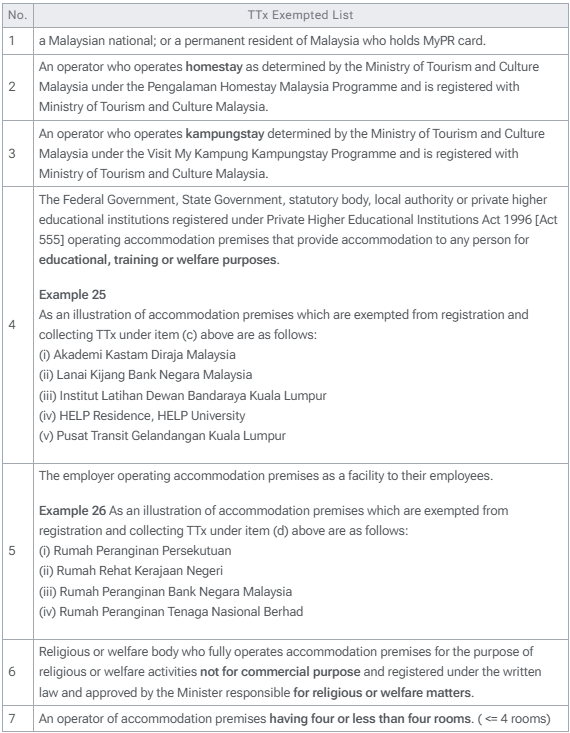
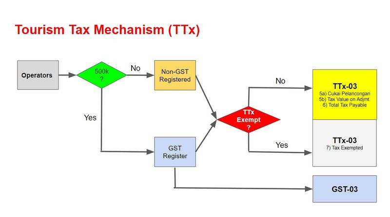
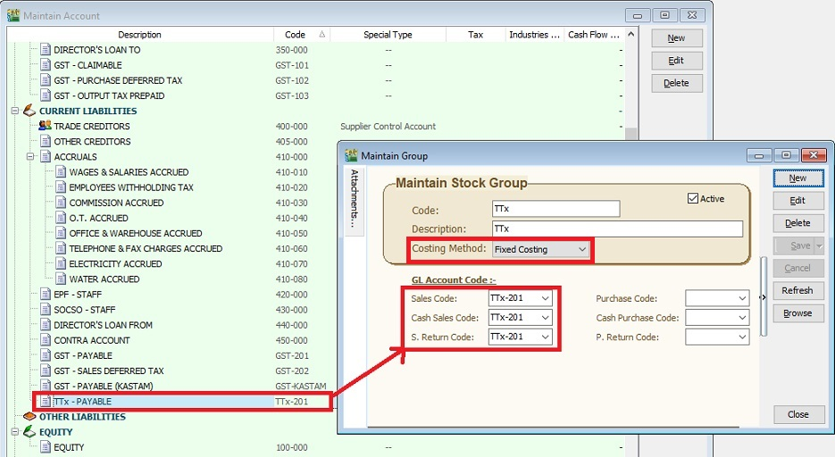
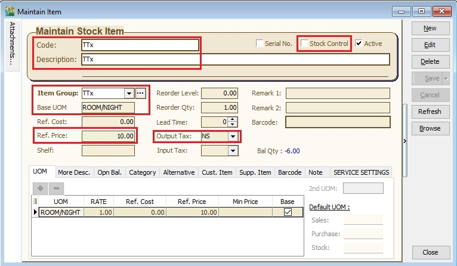
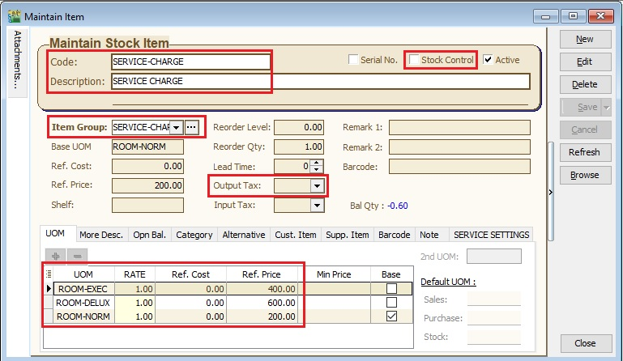
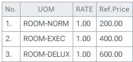
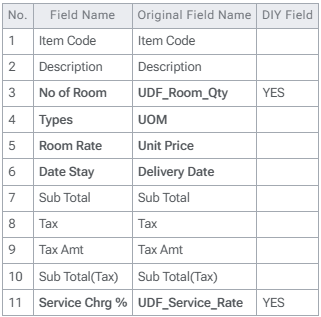
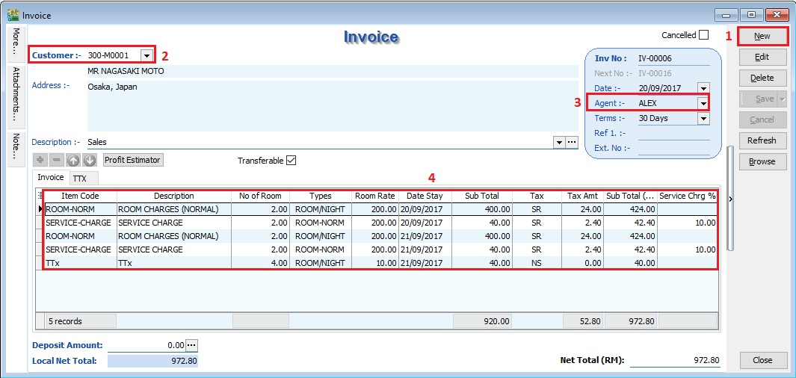

## Introduction

1. MYTTx implementation date : **01 September 2017**.

2. **TTx** is a tax charged and levied on a **tourist** staying at any **accommodation premises** made available by an **operator** at the rate fixed by the Minister. It is the duty of the tourist to pay TTx to the operator.

3. **Tourist** means any person, whether he is a Malaysian national or otherwise, visiting any place in Malaysia for any of the following purposes, namely:

   1. pleasure, recreation or holiday
   2. culture
   3. religion
   4. visiting friends or relatives
   5. sports
   6. business
   7. meetings, conferences, seminars or conventions
   8. studies or research
   9. any other purpose which is not related to an occupation that is remunerated from the place visited.

4. **Accommodation** premises means any building, including hostels, hotels, inns, boardinghouses, rest houses and lodging houses, held out by the proprietor, owner or manager, either wholly or partly, as offering lodging or sleeping accommodation to tourists for hire or any other form of reward, whether or not food or drink is also offered.

5. Accommodation premises excludes ‘innovative’ accommodations such as Apache-type hotels, caravan, container, bustel, boat house, tree house, sleeping tube, tents, cruise, and such similar accommodations. [added in the **GENERAL GUIDE ON TOURISM TAX** revised on 29 Aug 2017]

6. **Rate of tourism tax** is fixed at a flat rate of **RM10.00 per room per night**.

7. **Exemption from TTx** are:

   

   Therefore, we have designed a database structure specially for business which has provide accommodation to tourists.

   

## Modules Require

1. SQL Accounting (S&P)
2. DIY field
3. DIY script

## MyTTx Database

1. MyTTx database consists of:
   1. Compliance of Tax Invoice / Invoice format follow the MYTTx and GST standard.
   2. MYTTx preset setting ready.
   3. TTx-03 form.
2. Click on the link below and get the backup file for MYTTx database structure:
   1. MYTTx-Testing Company
3. Restore this backup.
4. Enter the user ID and password with “ADMIN” to login.

## MyTTx Basic Settings (Compulsory)

### MyTTx - Maintain Account

Go to **[GL | Maintain Account...]**, under **Current Liabilities**, create a new GL Account for GL Code is **TTx-201**, description is **TTx - Payable**.

### MyTTx - Maintain Stock Group

Go to **[Stock | Maintain Stock Group... | New]** and setting like this:

### MyTTx - Maintain Stock Item

Go to **[Stock | Maintain Stock Item... | New]**

MyTTx list settings are compulsory to follow :

:::info
   1. For GST registered person, output tax must set to NS.
                 NS - Matters to be treated as neither a supply of goods nor a supply of services, and no GST chargeable (0%)
   2. For Non-GST registered person, output tax must LEAVE IT BLANK.
:::

## Room Settings

### Room - Maintain Account

Go to **[GL | Maintain Account...]** and make sure **GL Account 500-000** is set as **SALES**. If it is not, create one.

### Room - Maintain Stock Group

Go to **[Stock | Maintain Stock Group... | New]** and setting like this:

### Room - Maintain Stock Item
:::info
   For GST or Non-GST registered person, output tax always LEAVE IT BLANK.
:::

Go to **[Stock | Maintain Stock Item... | New]**

   1. You can create different room types as different item code.
   2. Example of the room types settings list are:

## Service Charge Settings

### Service Charge - Maintain Account

Go to **[GL | Maintain Account...]**, under **Revenue**, create a new GL Account for GL Code is **500-001**, description is **SERVICE CHARGES**.

### Service Charge - Maintain Stock Group

Go to **[Stock | Maintain Stock Group... | New]** and setting like this:

### Service Charge - Maintain Stock Item

:::info
   For GST or Non-GST registered person, output tax always LEAVE IT BLANK.
:::

Go to **[Stock | Maintain Stock Item... | New]**

   1. Example of the Service Charge setting:

   

   2. **UOM Tab** can be use to preset the types of room rate.

   

   3. SERVICE SETTINGS
      1. Tick to confirm this is Service Charge code.
      2. Enter a service rate %. Example the screenshot below is 10%.

   

## New Guest Details

Go to **[Customer | Maintain Customer...]**

   1. You can maintain all the guest particular details at Maintain Customer.
   2. Record the **passport no** at company name 2. See the screenshot below.

   

   3. Tick on TTX Payable checkbox if he/she is NOT a Malaysian national or a permanent resident who holds MyPR card.

   

## Record of Tax Invoice / Invoice

Go to **[Sales | Invoice...]**

   1. Click on New.
   2. Select a customer (guest).
   3. Select an agent (eg. front desk agent).
   4. Enter the room, service charges, date stay, TTx at the details parts.

   5. Select the room, service charges and TTx at Item Code column.

   6. Enter the number of rooms to be stay at No of Room column.

   7. For **service charges**, select the **types of the room** (eg. room normal or executive) to calculate the service charge % on the room type rate.

   8. Enter the Date Stay.

   9. To confirm the Invoice, click on Save.
   10. You can preview/print the Tax Invoice or Invoice.
