## Branch Control Module

:::info
This module can be applied to Project, Agent, Area, Location, Stock Group, Stock Item, Payment Method, Account Code
:::

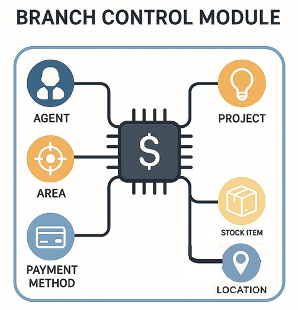

**SQL View (Branch Control)** is used to:

1. Restrict users to view or edit only the data belonging to their assigned branch.

2. Protect data privacy between branches.

3. Prevent users from accidentally selecting or modifying records from other branches.

## Scenario

Assume a company having 3 branches:

Example users:

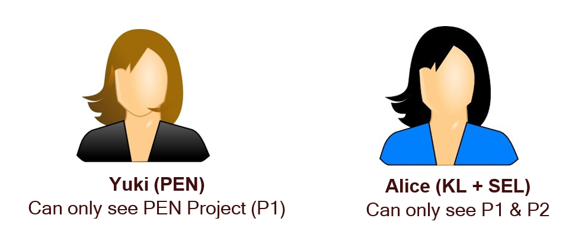

:::info
Project from other branches will be auto-filtered, preventing accidental selection of unauthorized or irrelevant data.
:::

## How to Set Branch Control Using SQL View

### A. Project Filtering

#### A1. Single Project Code (e.g., P1)

1. Navigate to **Tools** > **DIY**, click on **Maintain DIY**.

   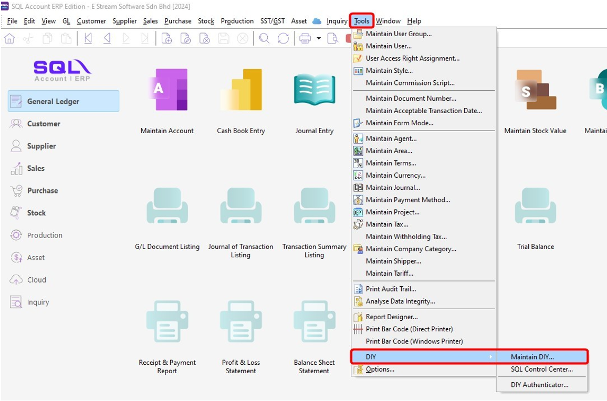

2. Next, go to **View Template**, right click on **Project** > **New View Template**.

   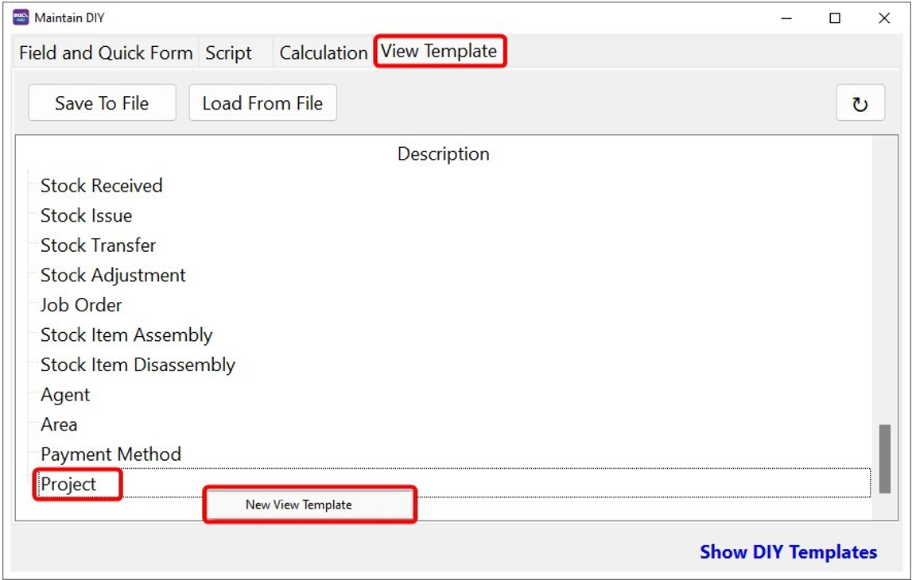

3. Click on **New** button.

   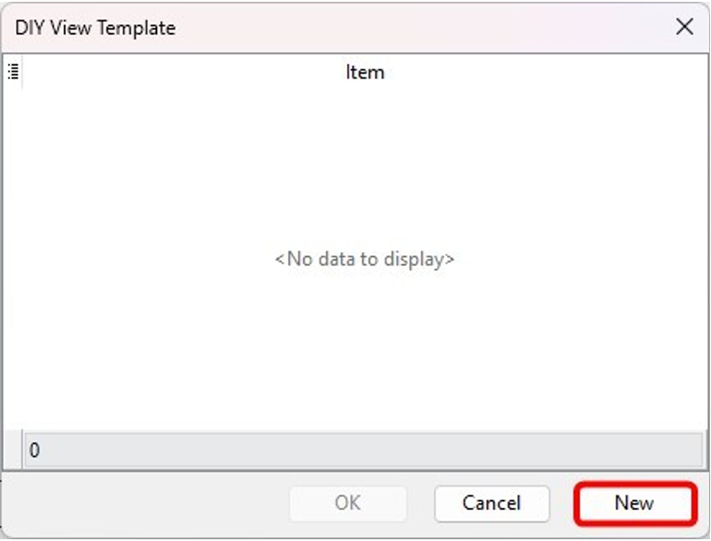

4. Set the filter conditions.

   | Field       | Description                       |
   | ----------- | --------------------------------- |
   | Description | Enter a name for this template    |
   | Code        | Select Project Code               |
   | Condition   | Equal                             |
   | Value       | Enter the project code (e.g., P1) |

   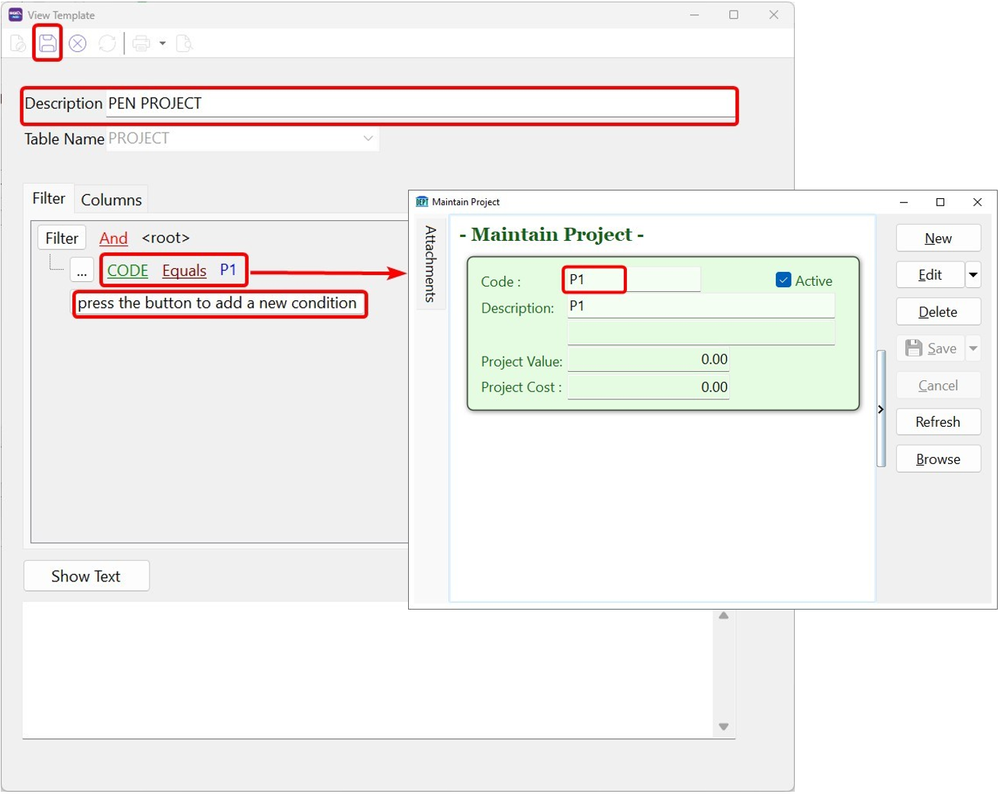

5. Select the new template from the list.

   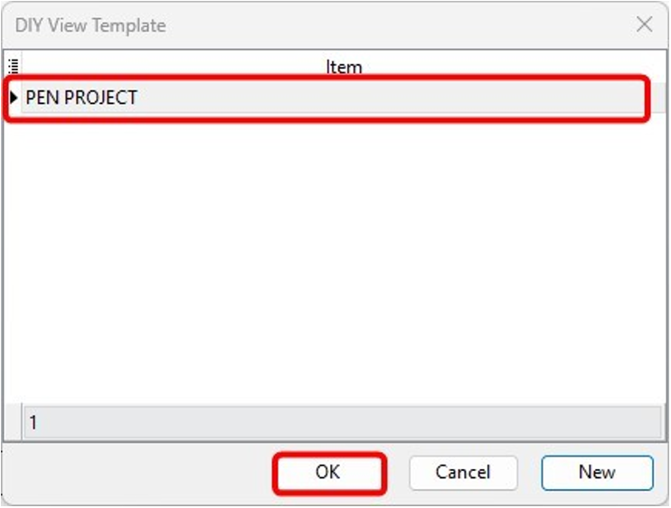

6. Right-click on **Project**, select **User View**.

   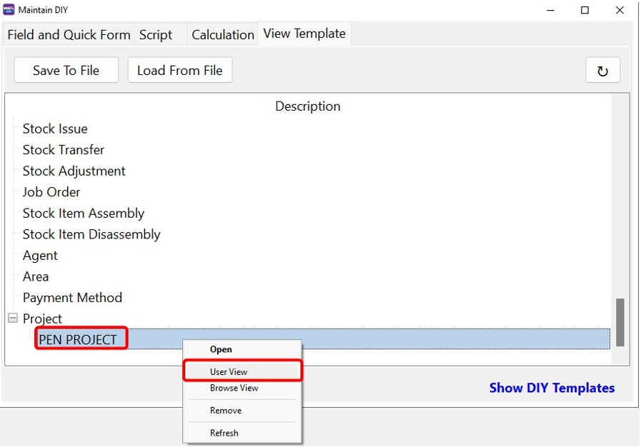

7. Select the users to which you wish to apply the rules.

   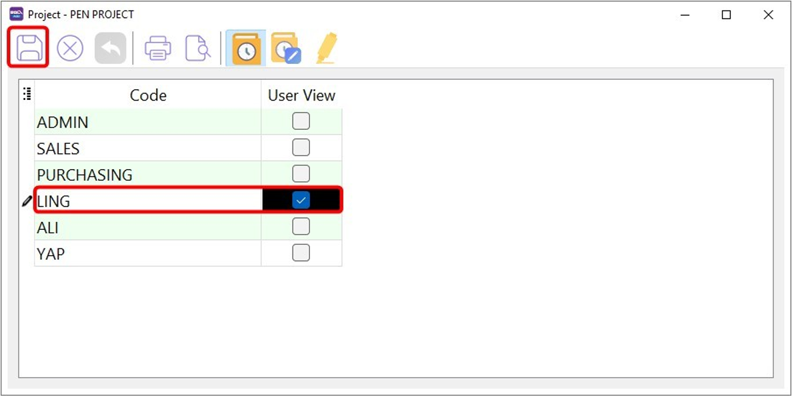

#### A2. Multiple Project Codes (e.g., KL + SEL = P1 & P2)

1. Set the filter condition.

   > Click on "+" button if you wish to add more codes

   | Field       | Description                    |
   | ----------- | ------------------------------ |
   | Description | Enter a name for this template |
   | Code        | Select Project Code            |
   | Condition   | is any of                      |
   | Value       | Enter project codes (P1, P2)   |

   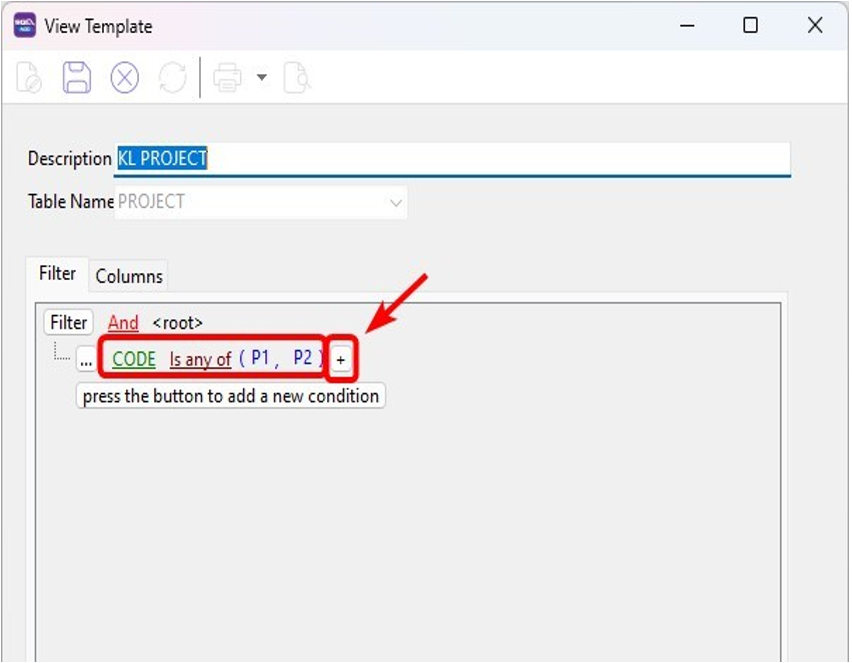

   **Sample result:**

   After apply, the user can select P1 and P2 only, not other branches.

   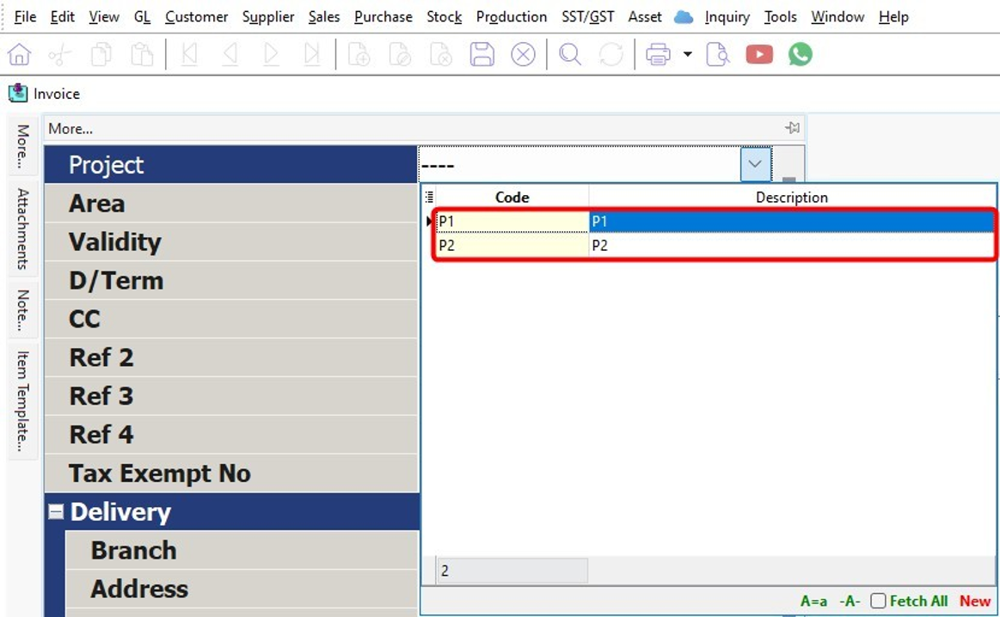

### B. Agent Filtering

#### Scenario 1: Agent can only see their own documents

> For Agent, if the login user same as agent code, retrieve the ready view template from this [guide](../integration/sql-mobile-connect/set-user-view.md) and load them.

If no ready templates available, create one:

1. Create a new view template by following **step 1 and 2** in [Project Filtering](#a-project-filtering) guide.

2. Select the Agent

   > CurrentUser = login user

   | Field       | Description                    |
   | ----------- | ------------------------------ |
   | Description | Enter a name for this template |
   | Code        | Select Project Code            |
   | Condition   | Equals                         |
   | Value       | Select CurrentUser             |

   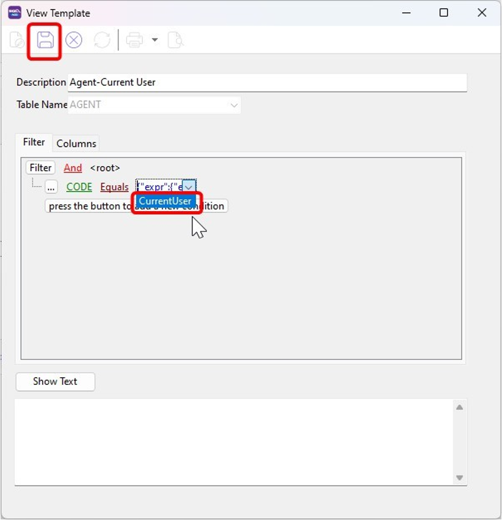

   **Sample result:**

   When Yap opens any document, the **Agent** field will only show her own agent code.

   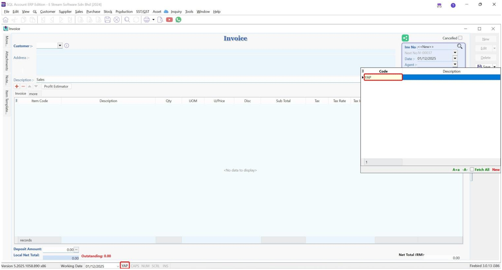

#### Scenario 2: Assign a user to a specific Agent Code

In the template editor, assign **Agent Code** on the value field.

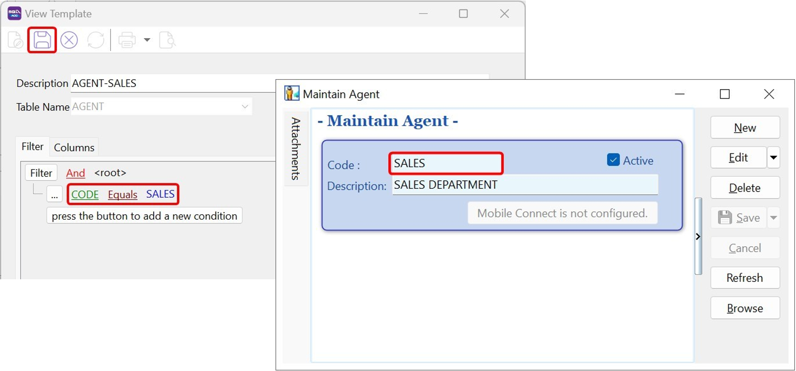

**Sample result:**

User will only see the assigned agent (e.g., **Sales**)

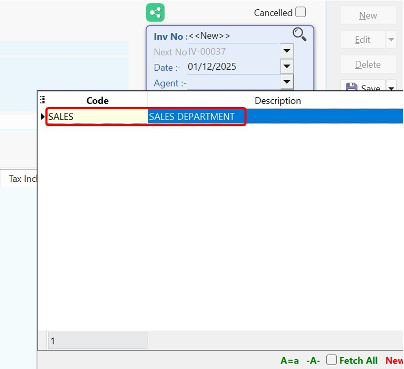

## How SQL View Affects the system

:::important

- **ADMIN** user is a superuser. Even if SQL View is applied, ADMIN can still view everything.
- SQL View does not support Stock Transfer documents. Locking can only be applied via the DIY Script module.

:::

|Action|Description|
|--|--|
|View Sales and Purchase Price History|the Sales Price History will only display values that pass the filter if a view is applied. Any values not permitted by the view will be excluded.|
|View Available Stock Balance|If a **location view** is applied, the View Available Stock Balance will only display the Total Qty belong to the location in Stock Card Qty, Qty in DO, Qty in PO and Available Qty. Each Location Balance only refer to the location assigned|
|Sales Invoice Transfer Dialog|When we transfer from Sales Order, if a view is applied, the dialog will only display values that pass the filter. Any values not permitted by the view will be excluded.|
|All Report Listing|When SQL Views are used to restrict Agent, the Agent dropdown in reports will only show values allowed by the view. Same applies to Project, Location, Stock Item and Area etc.|

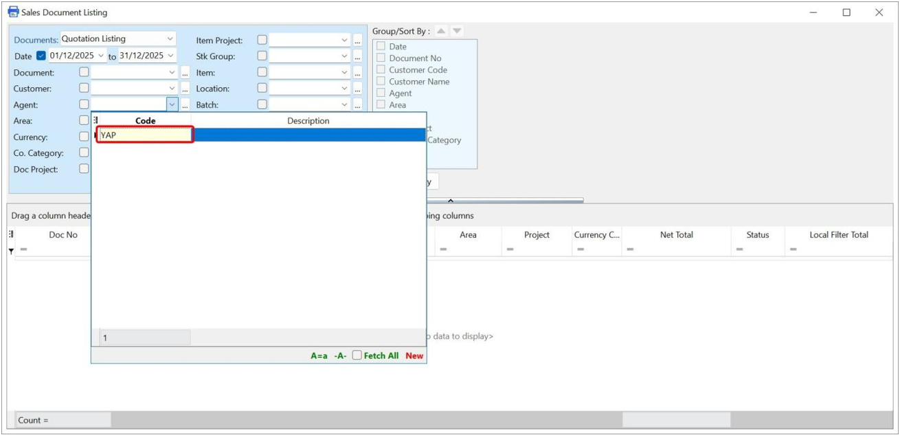
