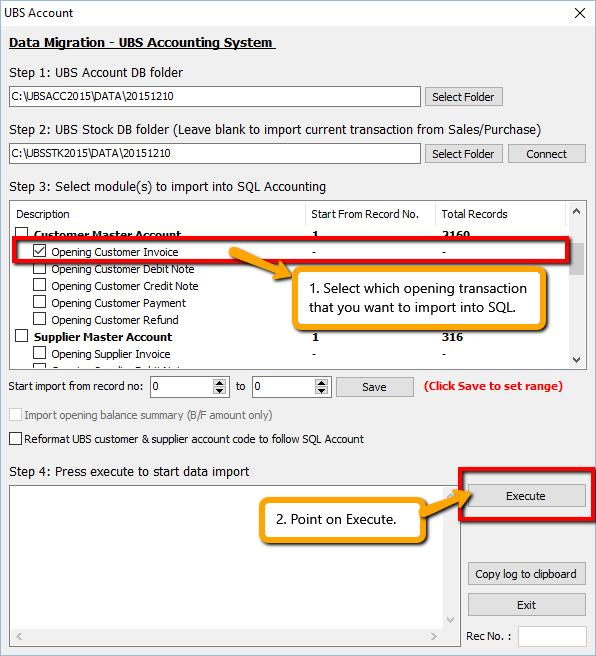

## Module that can be import from UBS

| Data Migration from Sage UBS | Module | Data Migration from Sage UBS | Module | Data Migration from Sage UBS | Module |
| --- | --- | --- | --- | --- | --- |
| Chart of Account | Yes | Journal Entry | Yes | Sales Debit Note | Yes |
| Customer Master | Yes | Bank Reconciliation | Coming Soon | Sales Credit Note | Yes |
| Supplier Master | Yes | AR/ Customer Invoice | Yes | Price History - Sales Invoice | Yes |
| Stock Master | Yes | AR/ Customer Debit Note | Yes | Price History - Sales Delivery Order | Yes |
| Agent Master | Yes | AR/ Customer Credit Note | Yes | AP/Supplier Invoice | Yes |
| Project Master | Yes | AR/ Customer Payment | Yes | AP/Supplier Debit Note | Yes |
| Area Master | Yes | Sales Quotation | No  | AP/Supplier Credit Note | Yes |
| Currency Master | Yes | Sales Order | No  | Purchase Order | No  |
| Terms Master | Yes | Sales Delivery Order | No  | Purchase Invoice | Yes |
| GL Opening Balance | Coming Soon | Sales Invoice | Yes | Purchase Debit & Credit Note | Yes |
| Cash Book Entry | Yes | Sales Cash Sales | Yes | Price History - Purchase Invoice | Yes |

## Time Estimate

Different pc might have different timing

| Duration of migration from Sage UBS | 1000 Records | 10,000 Records |
| --- | --- | --- |
| Masterfile | 2-5 Mins | 8-10 Mins |
| AR/AP Opening Balance | 5-10 Mins | 15-30 Mins |
| Sales/ Purchase Price History | 5-10 Mins | 15-30 Mins |
| Sales/ Purchase Current Transactions | 30-50 Mins | 1.5-2 Hours |
| AR/AP Current Transactions | 30-40 Mins | 1.5-2 Hours |
| GL Current Transactions | 10-15 Mins | 25-40 Mins |

Import Flow

1. Account Master File ( GL, Customer, Supplier.. )
2. Stock Master File ( Stock Group, Stock Item..)
3. Stock ( Sales Price History..)
4. Stock ( Current Transaction)
5. Account ( Opening Balance.. )
6. Account (Current Transaction..)

## Limitation & Precaution

1. No support for opening balance with foreign currency.

- This is because UBS have two posting (1 local, 1 foreign) for foreign currency transaction and sometimes one of the posting might be missing.
- Always import Price History first before AR/AP Opening Balance.
- This is to avoid system from auto-delete AR/AP opening balance when importing Price History with same document number.
- This is not applicable for UBS Sage 50.

## Preparing SQL Account Before Import Master Data

:::caution
Please make sure that SQL Account version is version 728 and above.
:::

Here are the things to do before data import:-

1. Open SQL Account and create a new empty database.

## Restore database from UBS

Here are the step-by-step guide how to restore database from UBS:-

1. Get the UBS Backup file `( BACKUP.ACC & BACKUP.STK )` and place the UBS backup file to the correct version database folder, example as below :

    - Directory to place UBS Backup File as below :
      - USB Account Old Version = `C:\UBSACC90\DB` or `C:\UBSACC2015\DB`
      - UBS Stock Old Version = `C:\UBSSTK90\DB` or `C:\UBSSTK2015\DB`
      - Sage UBS Account = `C:\UBSACC2015\`create new folder for your backup file.
      - Sage UBS Stock = `C:\UBSSTK2015\`create new folder for your backup file.

2. Download 7 Zip to extract UBS Backup file,( if you want to Import Master File Only) or else you may restore to UBS program ( For price history and current transaction ).
Download Path for [7 Zip](https://www.7-zip.org/download.html)

    :::caution
      *Make sure install the right one or else you cannot find 7 zip to Extract.
    :::

    

3. After extract the backup file or restore the backup file then in SQL Account Software you have to Create New Database and logon into the new company.

[Click Me to the video](https://www.youtube.com/watch?v=H7C14DzLyPE)

## Import Master Data

### Import Account Master Data

Here are the step-by-step guide to importing master data:-

1. Go to `File | Data Import | UBS Account` and select the UBS Account database folder.

- Account which mean import COA, Maintain Customer, Maintain Supplier, Agent, Area, Term, Project, Currency and Customer & Supplier Outstanding
- Stock which mean import Stock Group, Stock Category, Stock Location, Stock Price Tag, Stock Item, Sales Invoice History, Sales Delivery Order History, Purchase Invoice History.
- Assign the UBS Account & UBS Stock backup folder accordingly with click on “Select Folder” then click Connect, first of all you must import Chart of Account.Tick Chart of Account and Execute.

- Once you have done import Chart of Account, it’s prompt an message that successful and you have to do few setting according to the message.

- Go to `GL | Maintain Account` and check the trade debtor/creditor control account, bank account & etc. if they exist and their respective Special Account Type is correct.
- Go to `Tools | Options | Customer` and change the Default Control Account. Repeat the same for Supplier.

- Go to `Tools | Options | General Ledger` and set the Default Account accordingly

- Now, go back to `File | Data Import | UBS Account` and import the remaining master data - Agent, Area, Project, Terms, Currency, Customer and Supplier Master Account
- Click Execute and wait for the import to complete.

:::info

[Click ME to the video](https://youtu.be/H7C14DzLyPE?t=1m26s)

:::

### Import Stock Master Data

1. Go to `File | Data Import | UBS Stock`.

    

2. Select the UBS Stock database folder.

- Tick Stock Group, Category, Location, Price Tag.

:::caution
Please make sure user have purchase those module before import!
:::

- When import stock item code, make sure you have choose others option as below :

:::caution
*Also pay attention to the options below where you can choose to import extra Stock Item data such as UOM with Rate < 1, Stock Opening Balance & etc.
:::

**If you want to import Stock Customer & Supplier price:**

- Click Execute and wait for the import to complete.

:::caution

this feature only available in version 737 and above.

:::

:::info

[Click ME to the video](https://www.youtube.com/watch?v=doPrsNK7N6M)

:::

### Import Sales & Purchase Price History and Opening Balance

**Preparation Before Import Transactions**
The following steps are required if you are importing opening balance or current transactions:-

1. Go to `File | Product Activation` and insert your Activation Code or Season Code and click Register.
2. If current transactions involve GST tax code, go to `GST | Start GST Now` to activate GST module.
3. To minimize any pop-up dialog during import:-

- **Go to `Tools | Options | Unit Price`. For all tabs (Sales, Purchase, Stock, Cash Sales & Cash Purchase), under the Option column, change all to blank** as shown below:-

- Go to **`Tools | Options | Miscellaneous` and untick Prompt Negative Stock Quantity Dialog Box and Prompt Duplicate Cheque Number**
- **Logout and login as the new user you created.**
- **You may revert the changes back to original after data import.**

- **Go to `Tools | Options | General Ledger` and change the Financial Start Period and System Conversion Date if needed.**

### Import Sales & Purchase Price History Data

1. Before importing Sales & Purchase Price History, login into UBS and perform the following steps:-
    1. Transaction | Open Item Debtor | Edit B/F or O/I | Must tick mark all to O/I | Exit
    2. Transaction | Open Item Debtor | Maintain B/F Bills | Click "List"
   (Exit "List" and click "Generate" if there are transactions)
    3. Transaction | Open Item Debtor | Bill Payment Ledger | List Missing Records in Arpost.DBF |
    4. Press OK if there are items in the list or press Exit if non
2. Repeat above step for Creditor.
3. Please check with clients if they want to do UBS Account Year End Processing before importing Debtor or Creditor Opening Balance.
4. Login SQL Account, make sure you have insert season code for this database, and Start GST feature in SQL Account Software
5. Now, go to `File | Data Import | UBS Stock`. Under Stock Item, tick the Price History - XXX options you wish to import.

:::info

[Click ME to the video](https://www.youtube.com/watch?v=s0GR8MDF5J4)

:::

### Import Opening Balance

#### Year End Closing at UBS

1. Before importing Opening Balance, login into UBS and perform the following steps:-

- Old Version = Go to `Housekeeping | Run Setup | General Setting` (check when is the accounting period) then insert " Closing Period".
- Sage UBS = Go to `Housekeeping | Setup | General Setup` (check when is the accounting period) then insert " Closing Period".

**Scenario 1** : In UBS this accounting year = 01/01/2015 to 31/12/2015 if you want to cut off until 31/12/2015, so closing period you have to insert 12. **Scenario 2** : In UBS this accounting year = 01/01/2015 to 31/12/2015 if you want to cut off until 30/06/2015, so closing period you have to insert 6.
Then, go to `Periodic | Year End Closing`.

:::info

We strongly recommend that direct use the year end database to import instead of re-do the year end cut off at UBS.

[Click ME to the video](https://youtu.be/s0GR8MDF5J4?t=1m57s)

:::

#### After Year End at UBS

- After done the above steps, go to `Tools | Options | General Ledger` to setup your Financial Start Period and System Conversion Date.
- Next, `File | Data Import | UBS Account`, then select the UBS database folder. Beware of the following when selecting UBS database folder:-

:::caution

DO NOT select the folder under the UBS database folder. E.g. "DATA2013"
This is because after year end cut off UBS will auto generate a new folder for old financial cut off period.

:::

- After select folder, under Customer/Supplier Master Account, tick the Opening Customer/Supplier - XXX options you wish to import.

- You may tick all the opening at the same time. (Customer Payment takes longer time to import in).
- Note : After done. May compare Customer Aging with UBS :
- In UBS Step : `2. Debtors | A. Open Item Menu Debtors | 5. Print Detail Aging` (SQL follow UBS Detail Aging)
- In Sage UBS : `2. Debtors | 7. Print Debtors Aging` (SQL follow UBS Detail Aging)

:::info

[Click ME to the video](https://youtu.be/s0GR8MDF5J4?t=2m54s)

:::

### Current Transaction Data Import

#### Import Sales & Purchase Current Transaction

1. Go to `File | Data Import | UBS Stock` and select the UBS Stock database folder.
2. Under Stock Item, tick the Current Transaction - XXX options that you wish to import.
3. Click Execute and wait for the import to complete.

#### Import AP,AR,GL Current Transaction

1. Go to `File | Data Import | UBS Stock` and select the UBS Stock database folder.
2. Under Stock Item, tick the Current Transaction - XXX options that you wish to import.
3. Click Execute and wait for the import to complete.
4. Repeat the same steps for options under Supplier Current Transaction and GL Current Transaction.

#### Troubleshooting

1. First, it is best to tick and import one item at a time and perform backup before importing the next item.
2. This is what you can do if the import process stopped halfway because of some error:-
3. First, you can click "Copy log to clipboard" button and paste it into a notepad or just copy the last line of the log manually

- Then, you can skip the record with error as shown below:-

1. Highlight the item you're importing
2. Change the record no to the next number
3. Click Save and then click Execute again to resume

##### Sales & Purchase

##### GL, AR & AP

:::caution

- Please double check all data imported into SQL Account from UBS.
- We will appreciate if you would help report any issue encountered with detailed information
  so we can improve the data import tool.
- Please be aware that Import Current Transaction is under BETA.

:::

## Housekeeping

1. After UBS database is restored, run the following Housekeeping operation:-

- Index All Files
- Recover Data After Power Failure
- Delete Unwanted Transactions

:::info

[Click ME to Get the Steps](http://www.sql.com.my/document/Import%20UBS%20Guides.pdf)

:::

## FAQ

### Prompt message "Provider cannot be found. It may not be properly install" when try import

Please install [VFPOLEDBSetup.msi1](https://download.sql.com.my/customer/Fairy/vfpoledbsetup.msi)
