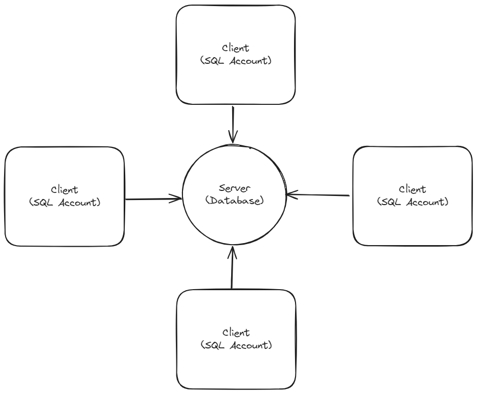
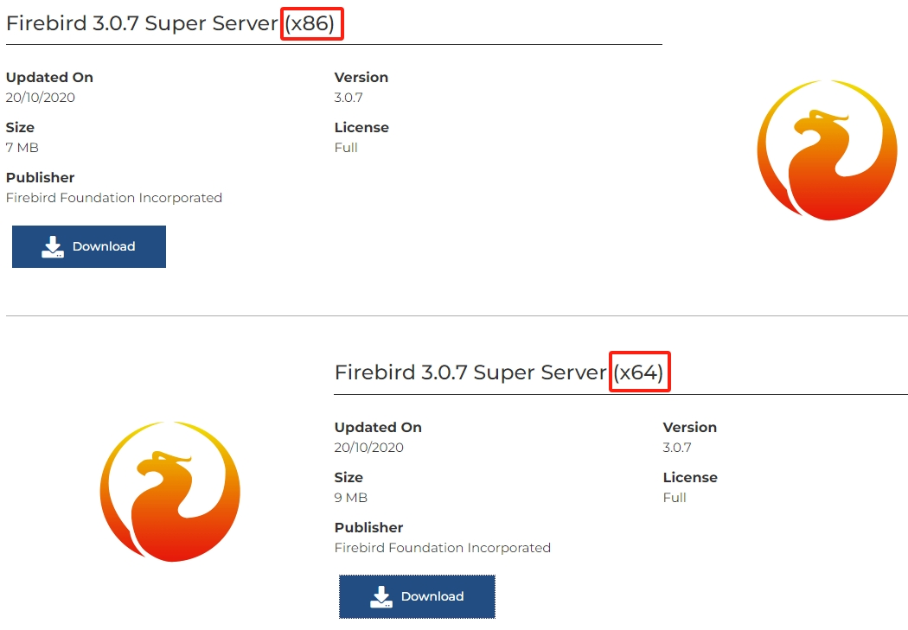
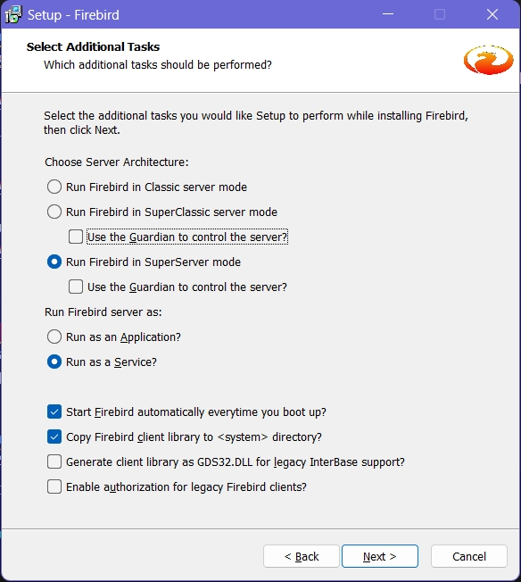
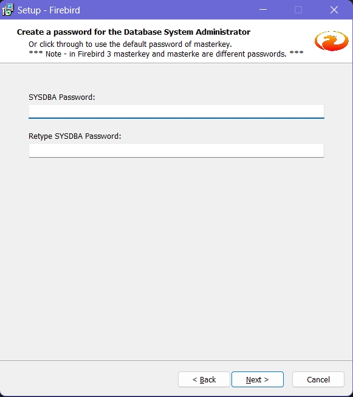
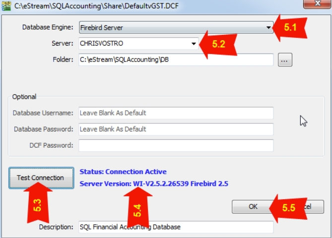
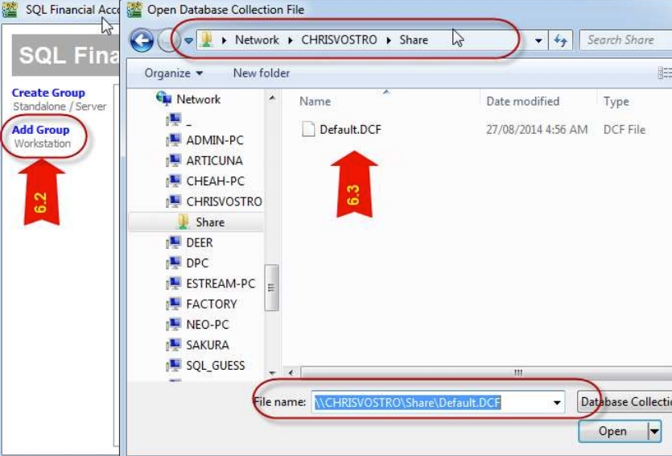
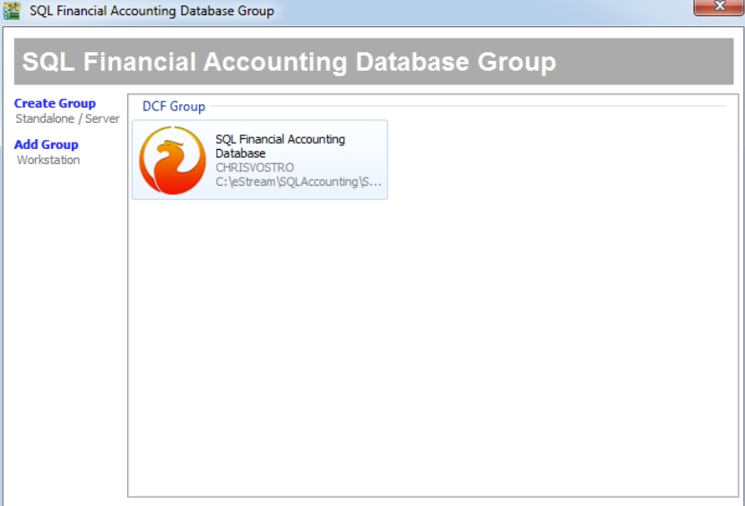

For a multi-user scenario, a separated database server is recommended. It will serve as the main database for multiple users to access concurrently.

## Database Server Setup

### Firebird Installation

1. Visit [download page](http://www.sql.com.my/support/downloads) to download `Firebird`.

2. If Window System Type is 64 Bits, please download `Firebird 3.0.x` **64 bit (x64)**

   

3. After downloading the Firebird executable, run it. Press **OK** to open the Terms and Conditions interface, check **I accept the agreement**, and click **Next**. Continue clicking **Next** until you reach the screen shown below. Ensure that the **Run Firebird in SuperServer Mode** option is selected, and that all other options are deselected.

   

4. Leave it blank to use default password, and click **Next**.

   

5. Continue with the setup until you reach the screen with a button **Finish**. Click on the button to complete.

### Network Setup

1. Window Firewall

   1. In windows, search for **Control Panel**, open it. Next, navigate to **Window Firewall** > **Advanced Settings** > **Inbound Rules**, select **New Rules**.
   2. Among the options, select **Port**. Click *Next*.
   3. Select **TCP**, for the **Specific Local Port**, fill in **3050**. Click *Next* continuosly until you reach the screen to give it a name.
   4. Name it **Firebird** and click *Finish*.

2. Network and Sharing Center

   1. In windows, search for **Control Panel**, run it. Navigate to **Network and Sharing Center** > **Change Advanced Sharing Settings**.
   2. Configure each settings as follows:

   | Settings                   | Action                                                                                      |
   | -------------------------- | ------------------------------------------------------------------------------------------- |
   | Network Discovery          | Switch on                                                                                   |
   | File and Printer Sharing   | Switch on to allow others on the network to access shared files and printers on this device |
   | Public Folder Sharing      | Switch on to allow others on the network to read write files in Public folders              |
   | File Sharing Connection    | Use 128-bit encryption for devices that support it for enhanced security                    |
   | Password Protected Sharing | Switch off                                                                                  |

3. Share the SQL Account or Payroll Folder

   1. Search **explorer** in windows, run it. Go to your share folder (e.g. `C:\eStream\SQLAccounting\Share` or `C:\eStream\SQL Payroll\Share`), right click on it and select **Properties**. It has a few tabs, navigate to **Sharing** > **Advanced Sharing**. Tick **Share this Folder**, click on **Permissions** and select **Full Control**. Press **OK** to close the **Permission** dialog box.
   2. Next, navigate to the **Security** tab, click on **Advanced**. In the advanced window, click on **Change Permissions** follow by the **Add** Button. In the empty box enter, type **Everyone** and press **OK**. Besides, tick **Allow Full Control** and press **OK** to close the window.

4. Install SQL Account or Payroll

   1. After downloading the executable, double click on it to run.
   2. Follow on the dialog, adjust according to your environment.
   3. After finish installed, open the application. Click on **Create Group** > **DCF Group**. Give it a name and save.
   4. Next, configure the **Database Engine** to be **Firebird Server** and click **Test Connection**, if you see a blue color message, it means the setup succeed.
   5. Scan through the rest of settings. After confirmed click **OK**.

   

## Client PC Setup

1. In client pc, we will also need to install the application. Repeat the installation steps and execute it after installed.

2. Click on **Add Group** > **DCF File**.

3. Select the DCF file from the public share folder created in previous step.

   

   

4. Click on firebird icon and login as usual.
