## Update BRN Number

Navigate to `File` > `Company Profile`

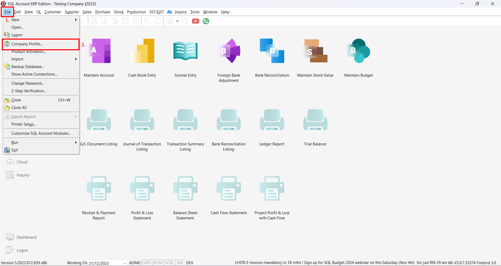

On **Company Profile**, update `Reg. No (New)` or `(Old)` same with maybank account to be linking.

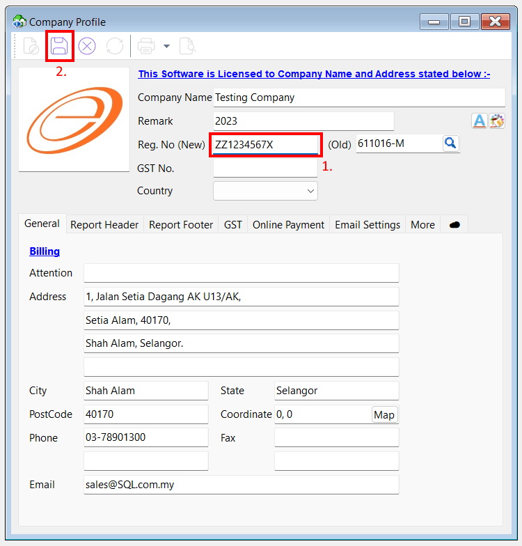

## Maybank Linking

Select  > `Maintain Cloud Banking` > `Maybank`

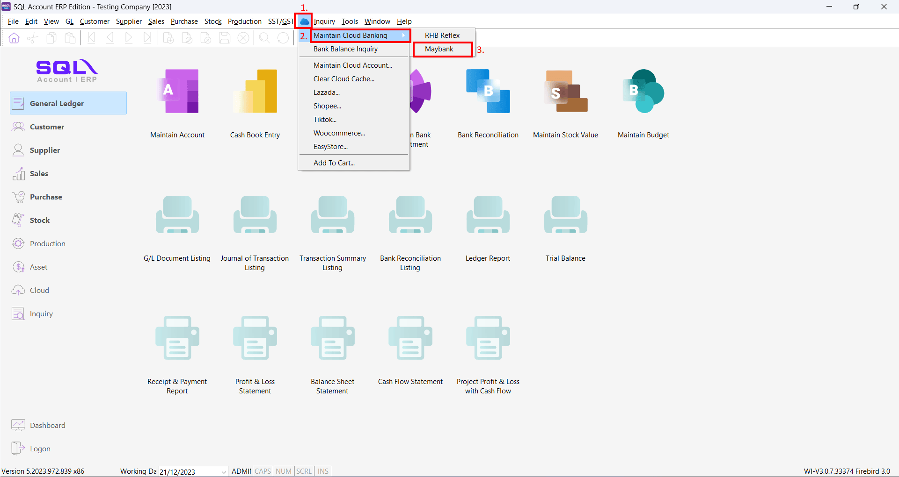

On **Maybank linking dialog**, click on `Connect` to link with Maybank account

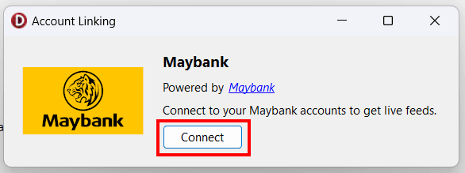

Maybank login screen will show up, **login** to your `Maybank account`, **select** `account` to link and **authorize**.

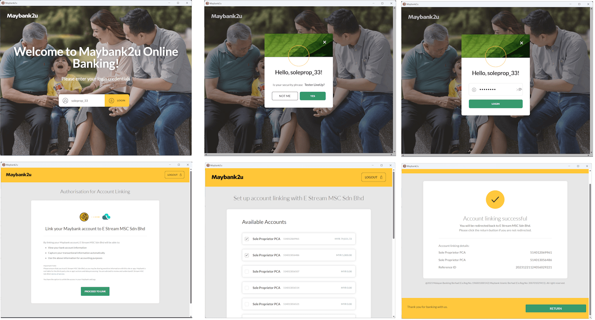

After linking successful, account linking with payment method dialog will show up, then select the payment method to map.

1. **Click** on `Payment Method` dropdown
2. **Select** `MAYBANK` payment method to map

    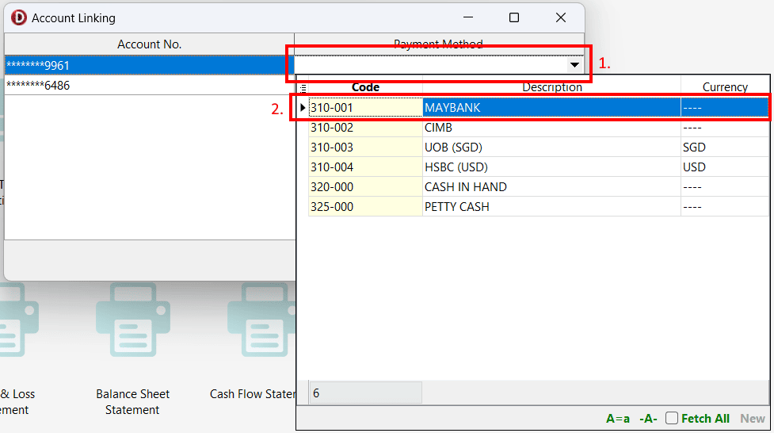

    :::tip[Hints]
    Maybank allow **up to 3 bank account** to linking at the same time.
    :::

3. **Click** `Link`

    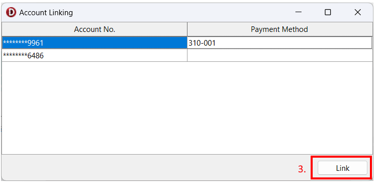

4. **Account linking successful** message will show up

    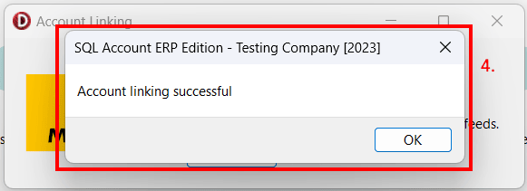

5. **Connected** status will display

    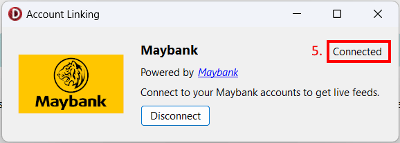

### Disconnect Maybank Linking

1. On Maybank linking dialog, **Click** on `Disconnect`

    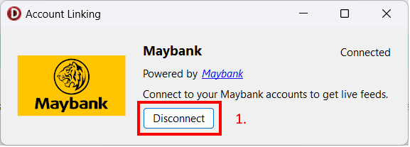

2. A confirm dialog will prompt, **Click** `Yes` to disconnect

    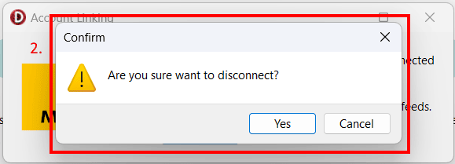

3. **Disconnected** message will shhow up

    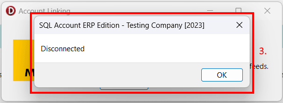

## Bank Reconciliation

1. `General Ledger` > `Bank Reconciliation`

    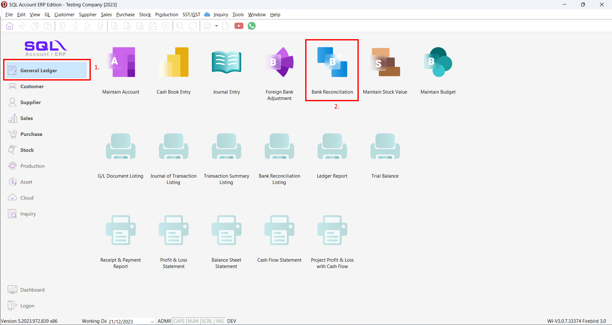

2. Select `Bank Statement Date` and select `Maybank` payment method that linked to Mayabank account

    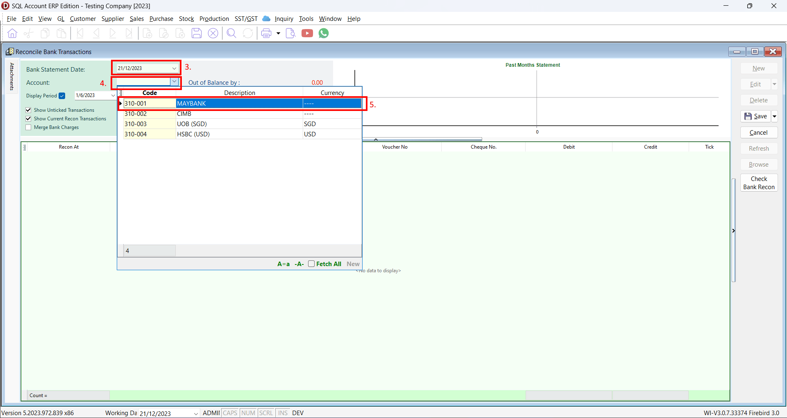

3. Select `Date Between` of transactions to load **(up to 60 days of transaction history)** and click `Load Statement`

    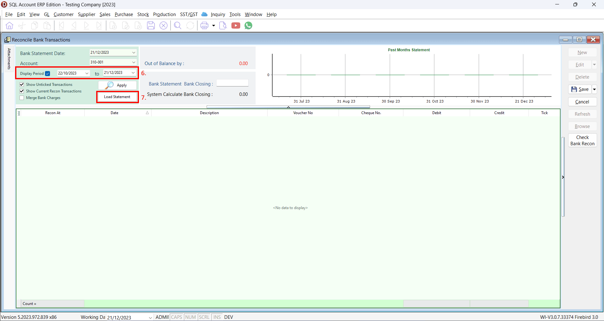

4. All transaction loaded from Maybank API and mapped transactions will auto match with SQL Account transaction

    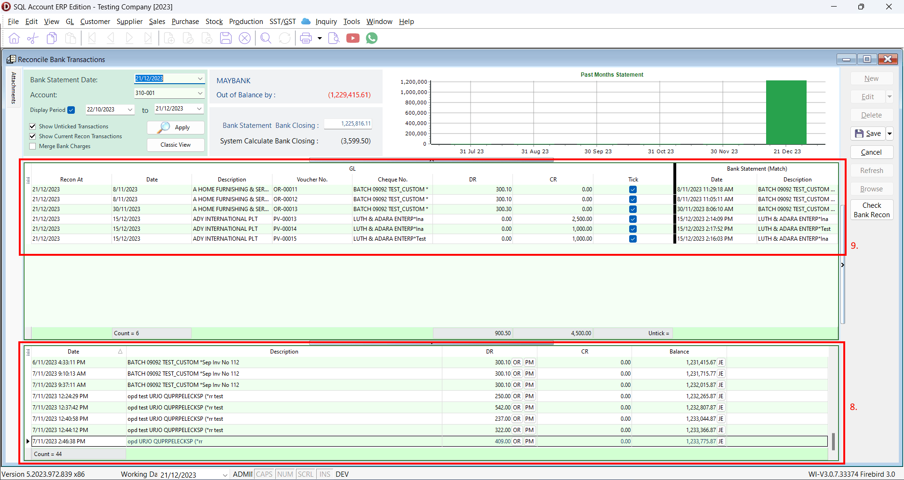
