## Update BRN Number

Navigate to `File` > `Company Profile`

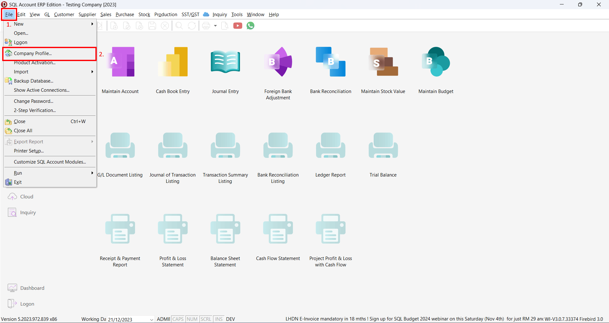

On **Company Profile**, update `Reg. No (New)` or `(Old)` same with maybank account to be linking.

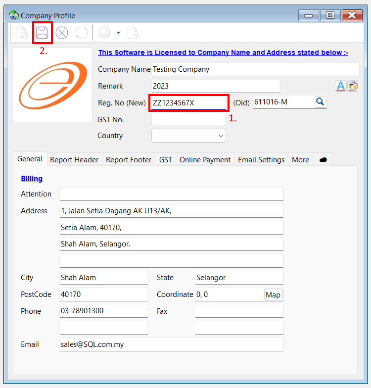

## Maybank Linking

Select  > `Maintain Cloud Banking` > `Maybank`

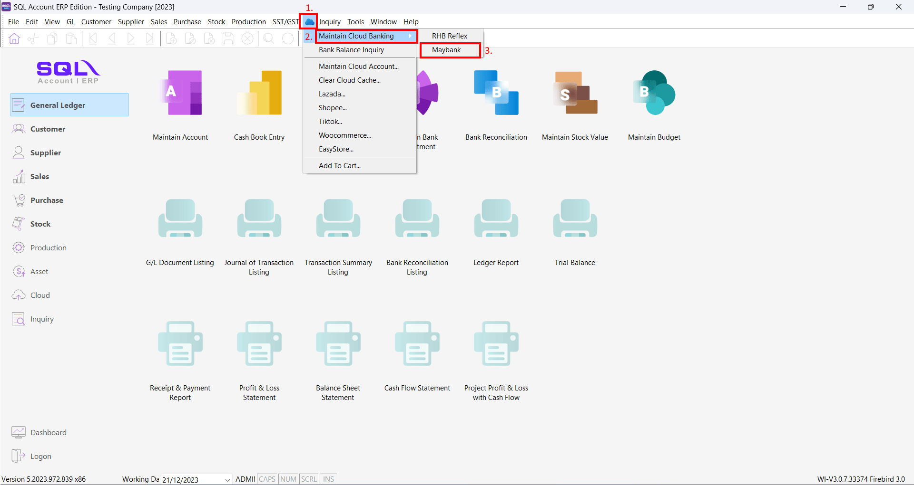

On **Maybank linking dialog**, click on `Connect` to link with Maybank account

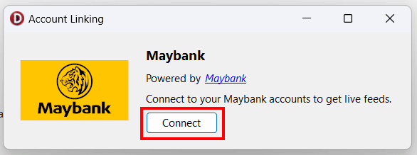

### For Sole Prop

Maybank2u login screen will show up, **login** to your `Maybank account`, **select** `account` to link and **authorize**.

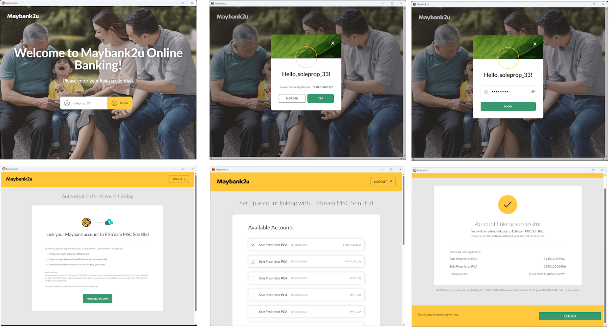

### For Non-Sole Prop Account

1. **Maker Account**
    - Maybank2u Biz login screen will show up, **login** to your `Maker` account, **select** `account` to link and **authorize**.

    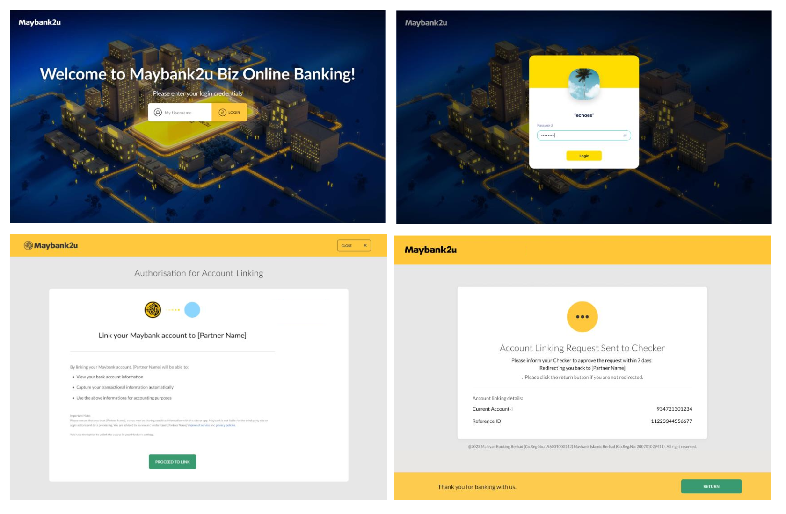

    - After authorize sucessfull, `Pending` status will show on **Maybank linking dialog**.

    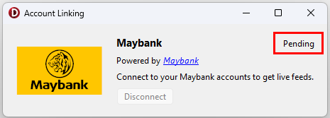

2. **Checker Account**
    - The `Checker` account will receive a notification for linking approval.

    - Login to the `Checker` account.

    - Review and approve the linking request to complete the account linking process.

    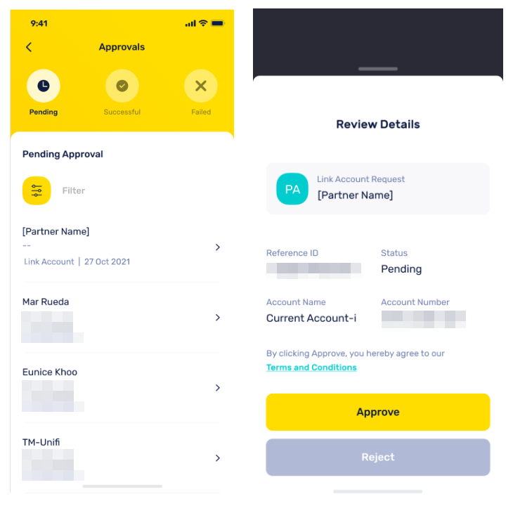

    - After the linking request has been approved, reopen the **Maybank linking dialog**. `Account approved` message will shown.

    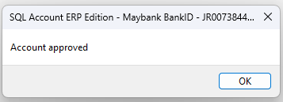

### Mapping Payment Method

After linking successful, account linking with payment method dialog will show up, then select the payment method to map.

1. **Click** on `Payment Method` dropdown
2. **Select** `MAYBANK` payment method to map

    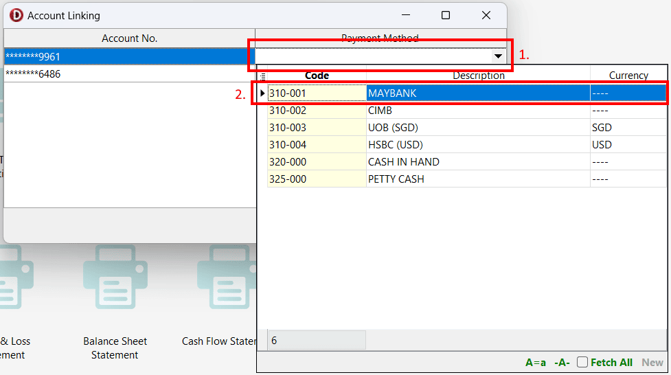

    :::tip[Hints]
    Maybank allow **up to 3 bank account** to linking at the same time.
    :::

3. **Click** `Link`

    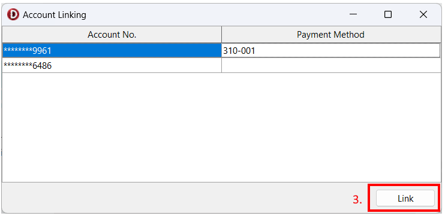

4. **Account linking successful** message will show up

    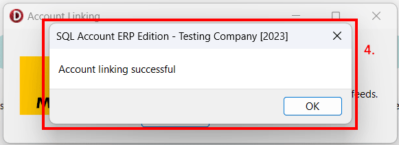

5. **Connected** status will display

    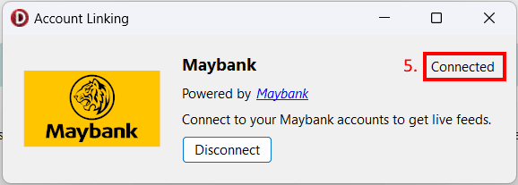

## Disconnect Maybank Linking

1. On Maybank linking dialog, **Click** on `Disconnect`

    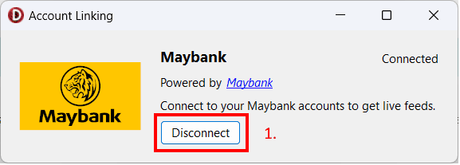

2. A confirm dialog will prompt, **Click** `Yes` to disconnect

    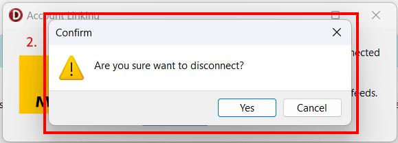

3. **Disconnected** message will shhow up

    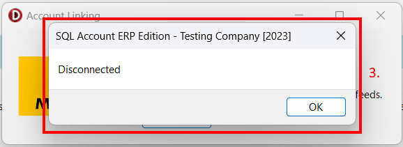

## Bank Reconciliation

1. `General Ledger` > `Bank Reconciliation`

    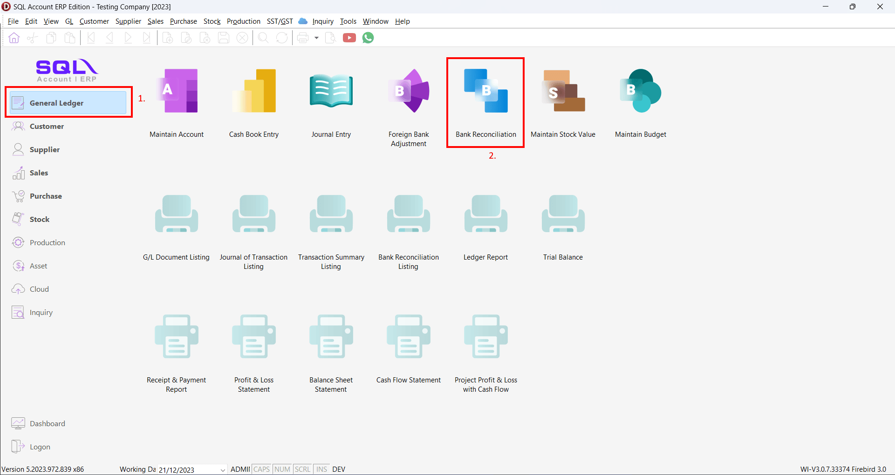

2. Select `Bank Statement Date` and select `Maybank` payment method that linked to Mayabank account

    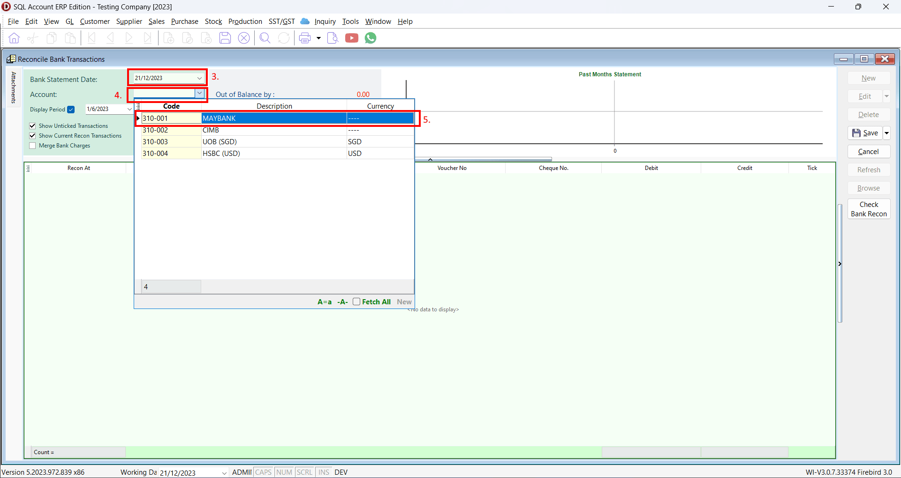

3. Select `Date Between` of transactions to load **(up to 60 days of transaction history)** and click `Load Statement`

    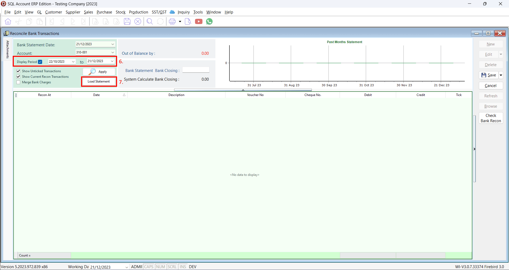

4. All transaction loaded from Maybank API and mapped transactions will auto match with SQL Account transaction

    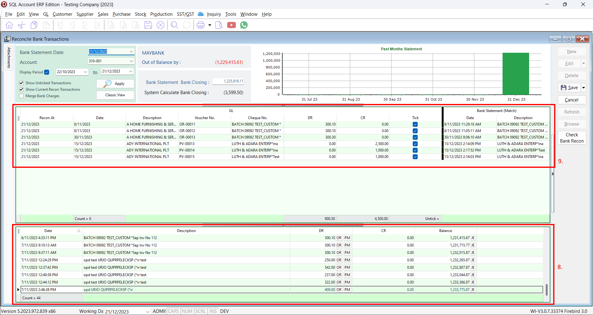
