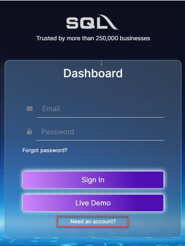
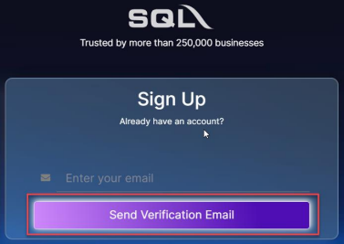
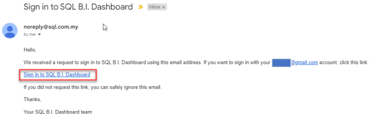
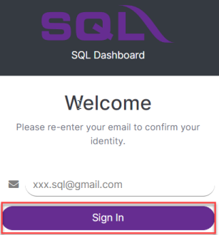
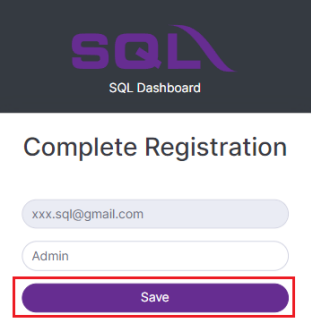
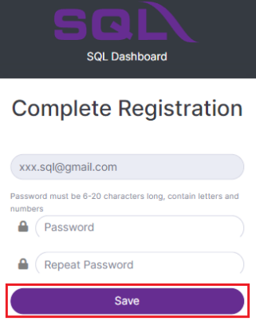
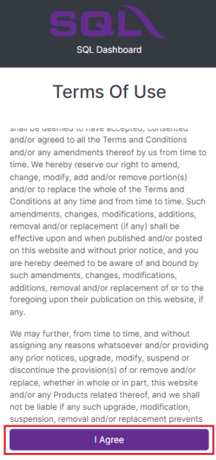
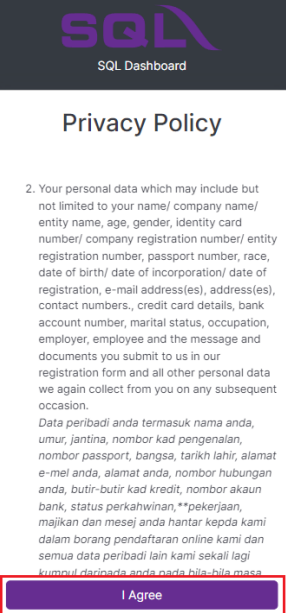
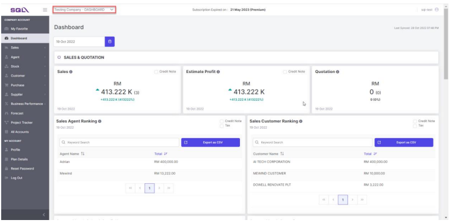

:::info
To start with BI Dashboard, contact your SQL Service Consultant for the service registration.
:::

## First Time Login

1. Go to [SQL Business Intelligence Dashboard](https://bi.sql.com.my/), click on **Need an account?**

    

2. Enter your registered email with SQL, click on send verification email

    

3. Check your mailbox, and click on "Sign in to SQL B.I Dashboard"

    

4. Enter your registered email and click sign in

    

5. Next, enter your name and click save

    

6. Enter your password, repeat password & click save

    

7. Read and click agree the term of use

    

8. Read and click agree the privacy policy

    

9. Login to dashboard

    
