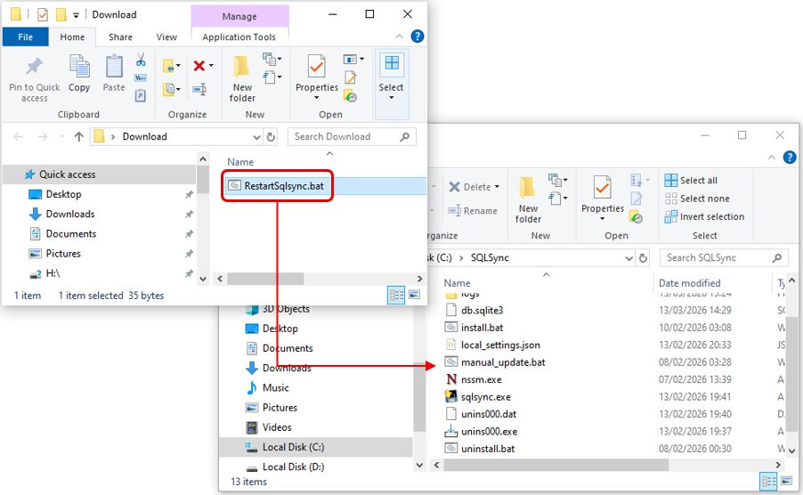
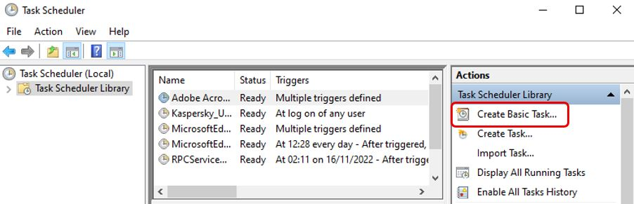
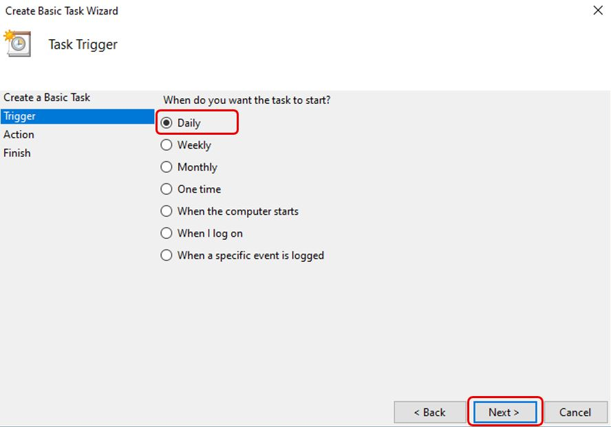
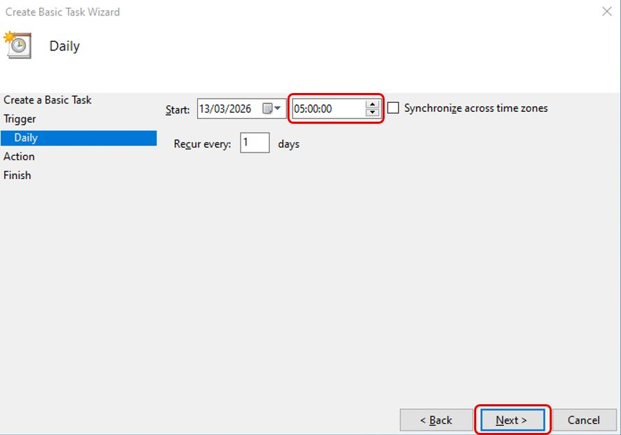
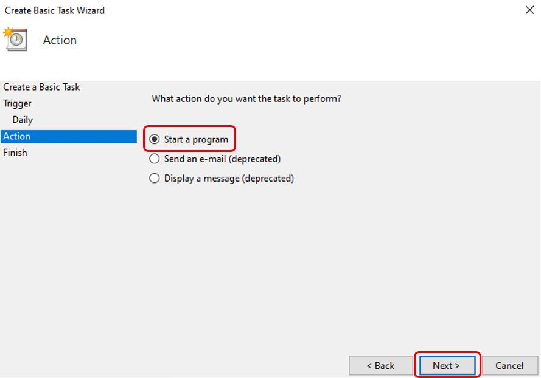
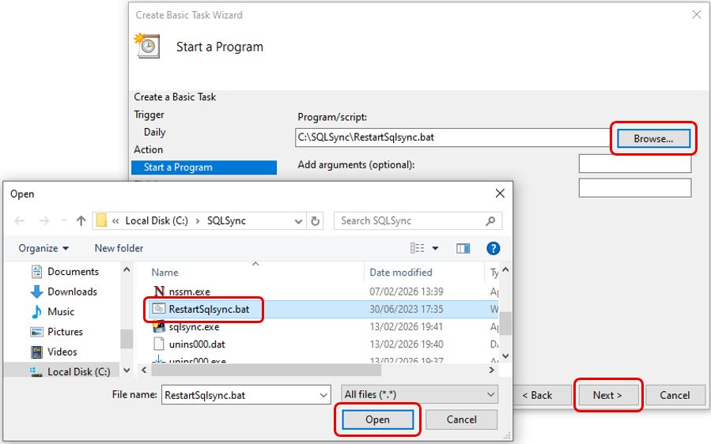
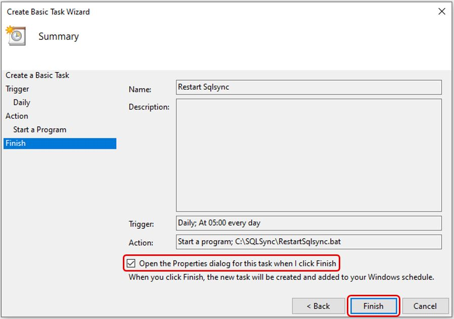
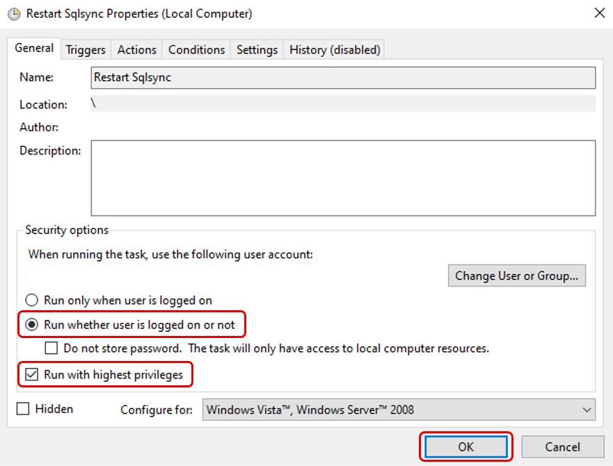
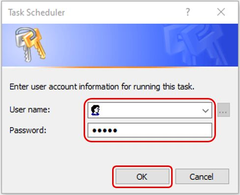

:::info
This is recommended for users whose PC is turned on 24 hours.
:::

## Prerequisites

- Completed [On-Premise Setup](./on-premise-setup)

## Setup

### Step 1 – Download RestartSqlsync Batch File

1. Download [RestartSqlsync.bat](https://drive.google.com/file/d/1v2V8nUbmCHk6Cpks4P32Zz1JVU2n4zip/view?usp=sharing)

### Step 2 – Place Batch File in SqlSync Folder

1. Copy and paste `RestartSqlsync.bat` to the SqlSync installation folder

   :::info
   The default SqlSync installation folder is `C:\SQLSync`
   :::

   

### Step 3 – Create Windows Task Scheduler

1. Open **Task Scheduler** > Click **Create Basic Task...**

   

2. Enter a name for the task (e.g. **Restart Sqlsync**) > **Next**

   

3. Select **Daily** > **Next**

   

4. Set start time based on your preference (e.g. **5:00:00 AM**) > **Next**

   

5. Select **Start a program** > **Next**

   

6. At **Program/script** field > **Browse** > Select the `RestartSqlsync.bat` file path > **Open** > **Next**

   

7. Check **Open the Properties dialog for this task when I click Finish** > **Finish**

   

8. Select **Run whether user is logged on or not** and **Run with highest privileges** > **OK**

   

9. Enter Windows administrator **User name** and **Password** > **OK**

   
