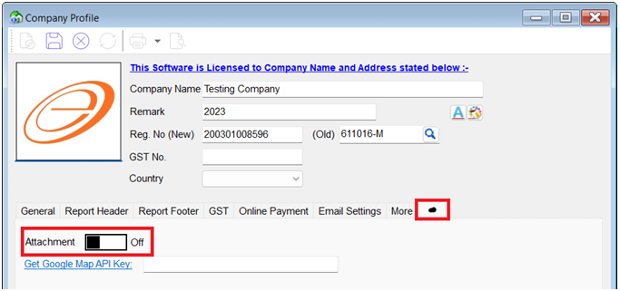
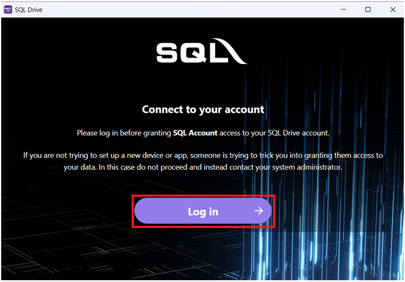
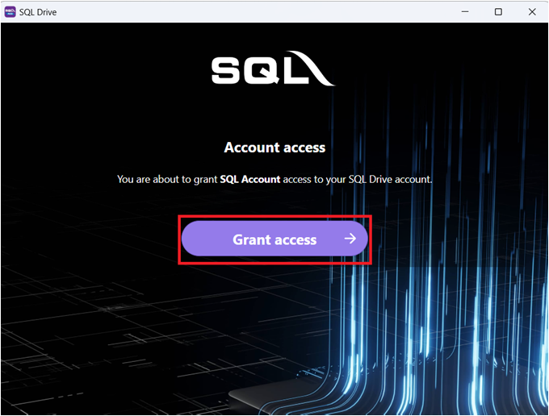
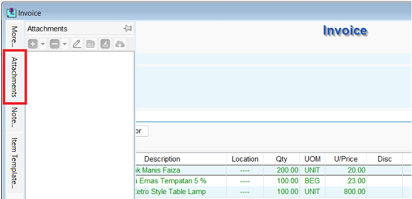
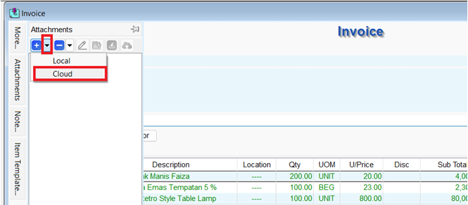
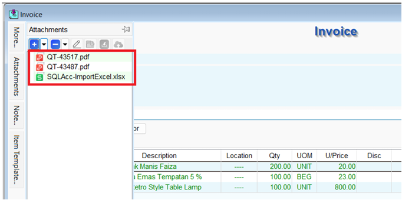
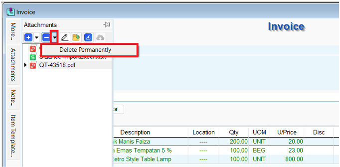

### Activation

   1. In SQL Account, navigate to **File > Company Profile...**

   2. Click on the **Cloud icon tab**

   3. Switch on the **"Attachment"** option

      

   4. A window will pop up. click on **Log In —> Login with Google**

      

   5. After login with gmail, click on **Grant Access**

      

   6. After granted, your account is connected.

### Add Cloud Attachment

   1. Click on **Attachments**.

      

   2. Click on the down arrow (**⌄**). Choose **Cloud**.

      

   3. You can attach multiple, different document type (e.g. excel, doc, image, pdf, etc)

      

   4. Refer to the following steps to delete the attachment files permanently

      
