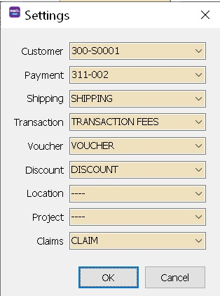
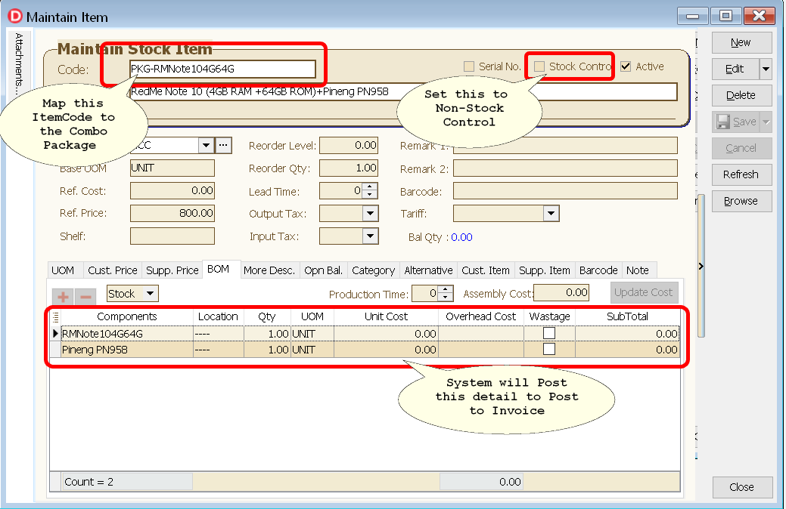
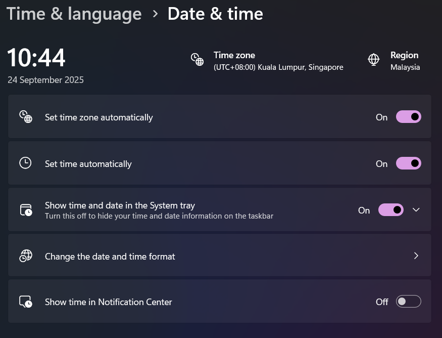
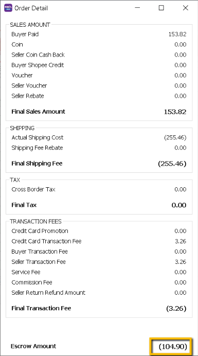
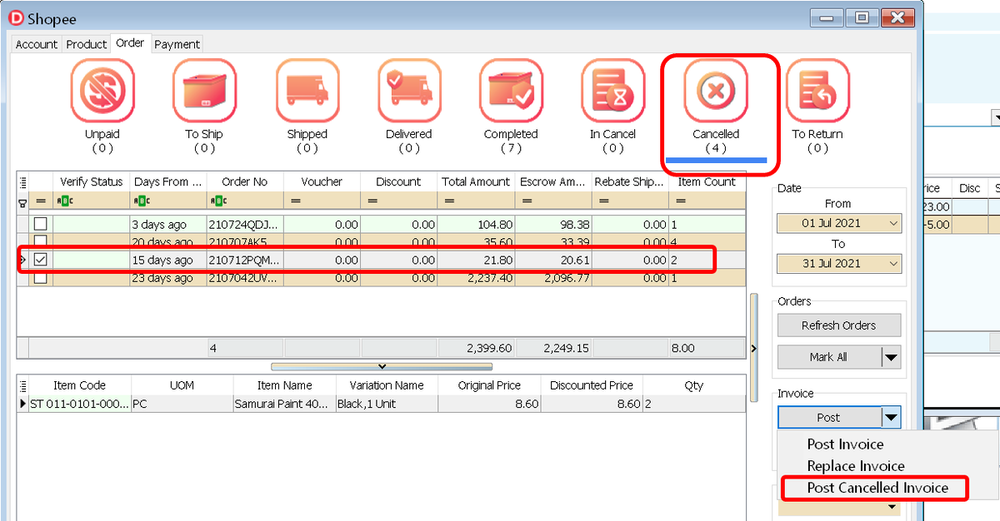
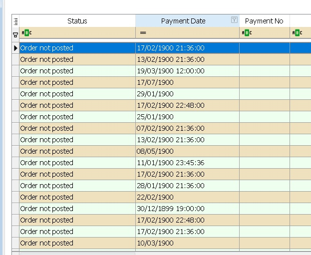

## Where and How do System Keep the Product Information?

As default , all the eCommerce Product Information will be kept in *Maintain Item | Alt Tab*

| **Platform**   | **Platform Field**        |
|----------------|---------------------------|
| **Shopee**     | Item ID, Item SKU          |
| **Lazada**     | Seller SKU, Shop SKU       |
| **WooCommerce**| SKU                        |
| **AddToCart**  | SKU, Item ID               |

## What is the Max Character that the System is allowed to Keep in Stock Alternative ?

Max Character allow is

- 30 (5.2021.913.805 & below)
- 35 (5.2021.914.806 & above)

## Why is that after POst and Refetch the Products and Item Codes are duplicated ?

Its due to user set same **SKU** at the eCommerce Platform for different products.

## How does the System Post Shipping Fee Amount ?

For **Shopee** it uses the following formula :

```math
shipping fee = (escrow + refund) - product price - commission - service - transaction
```

- For **Lazada** & **WooCommerce** it calculates directly from the platform field.
- It will **not post** if the Shipping fee is **pay by the buyer**

## How to handle Serial Number ?

If using Packing List :
    * You can use **To Ship** Status Post to Sales Order first, then manually transfer to Invoice.
Make sure enter the **Invoice Doc No = Order No** and Serial Number as well.

If Not using Packing List :
    * Just normal post to Invoice then enter the Serial Number after post

## How to split different Platforms Sales ?

You can use **Project Code** for each Platform

## How does the system handles Opening Invoice ?

- Users will need to fetch & post the last **1-2 months** orders (into sales invoice)

- During load payment, if system detect have earlier system conversion date , it will prompt <span style={{ color: 'red' }}>red alert</span> please sync all, all you need to do is **right click**, **check** past invoice & **post** past invoice.

- if future payment cycle have any adjustment related to past invoice, system will automatically update both SL_IV(itemise detail) & AR_IV (DocAmt).

## Where to download the Statement for each Pplatform ?

May refer link below :

- [Lazada](https://sellercenter.lazada.com.my/seller/helpcenter/guide-to-view-the-fees-your-account-statement-8809.html?spm=a2a16.helpcenter-psc-article.articles-list.1.1af31e466syh4Y)

- [Shopee](https://seller.shopee.com.my/edu/article/1651)

## What or Which Transaction will be used for Setting ?

 

 | **Field**    | **Description**                                                                 |
|--------------|---------------------------------------------------------------------------------|
| **Shipping** | - Shipping Fee (Shopee, Lazada & WooCommerce) - Auto. Shipping Fee Subsidy (by Lazada) - Shipping Fee (Paid By Customer) (Lazada) - Shipping Fee Voucher (by Lazada) |
| **Transaction** | - Commission Fee (Shopee) - Service Fee (Shopee) - Transaction Fee (Shopee) - Payment Fee (Lazada & TikTok) - Affiliate Commission (TikTok) - Platform Commission (TikTok)  - Commission (Lazada)  - Lazcoin Discount (Lazada)  - Free Shipping Max Fee (Lazada)  - Promotional Charges Vouchers (Lazada)  - Sponsored Affiliates (Lazada)  - Lazada Bonus (Lazada)  - Lazada Bonus - LZD co-fund (Lazada) |
| **Voucher**  | - Seller Voucher (Shopee)  - Lazcoin Discount (Lazada)  - Free Shipping Max Fee (Lazada)  - Voucher (WooCommerce) |
| **Discount** | For bundle deal. Example: 1 item = RM 5, if you buy 3 = RM 12. System will post discount as RM 3. |
| **Claim**    | - Any Lazada statement with type "Claim".  - Examples: damage claim, lost claim, shipping claim, etc. |

## Where is the Help File for each PLatforms

May refer to links below :

- [Lazada](https://sellercenter.lazada.com.my/seller/helpcenter/)
- [Shopee](https://seller.shopee.com.my/edu/home)
- [WooCommerce](https://docs.woocommerce.com/)

## Why non stock control item code transferable is set to False(untick) ?

This is because removing the non stock control item code so that it is shown in **Outstanding Report**.

## Why is it when loading Payment Status it showing "Missing Item Code" ?

This happens when user :

- Forget to **Map** the Itemcode in SQL Accounting
- The **SKU** in platform are **Deleted**

- Solution: **Sync** the Product again & **Map** again for all missing itemcode

## How does the system handle Combo Peoduct in PLatforms ?

- In SQL Accounting it use **BOM(Bill of Materials) Template** as Detail Itemcode to deduct.

- Below is Example Selling Mobile Phone with Power Bank :



## Why Expired Date COlumn keep showing Wrong Date even after relogin to the platform ?

Its due to your pc **system date time** is not correctly set...

- Solution :
    1. Click Windows , search Date & Time Settings
    2. Make sure You select correct **Time zone**
    
    3. Click Sync
    4. Try Relogin the platform again in SQL Accounting

## Shopee

<details>
  <summary>Shopee - click to expand</summary>

### How does the system post when Shipping Fees Charges is higher than Seller Paid Amount that causes the Escrow Amount becomes negative ?



System will Post to **Sales CN** and set Qty in Negative (In the **Order Tab**).
When Load in Income statement(.xls) files into **Payment Tab**, system will auto post to **Customer Refund**.

### How system post for Order Cancelled with Posted Invoice ?

This usually happens when Buyer is not at Home after a few attempts sent and seller decided to cancel the Order.



### How System handle Payment Withdraw ?

[How do i get my payment back?](https://help.shopee.com.my/portal/4/article/173133-%5BShopeePay%5D-ShopeePay-App-Withdrawals?previousPage=search%20recommendation%20bar)

[How to Post In SQL Accounting? Video](https://www.youtube.com/watch?v=PloG3CeHA1w)

### Why when i load the payments , the date looks incorrect ?

Try redownload again from shopee as shopee had updated the format.



</details>

## Lazada

<details>
  <summary>Lazada - click to expand</summary>

### How system Post Marketing Fees?

When load in Finance statement(.csv) file in **Payment Tab** (marketing fees without Order No).
System will post to Sales CN (Transaction Fee) and Customer Refund.

### How system handle Reversal Item Price and Adjustment Item Charge?

System will Delete the CN once load payment file(if the lazada payment release more than Outstanding Invoice amount)

### How system handle for first release payment in negative due to shipping fees under charge customer?

When load payment, once release amount is in **negative**, system will **delete earlier Invoice**, and raise CN(amount will be exactly same as Payment file) and Refund.

When **2nd payment(Adjustment)**, if the amount is in negative, append to CN and Refund, if in positive, will raise Invoice(Adjustment value) and Payment.

### Why the Invoice Amount is changes once Payment is loaded?

It is due to Shipping Fee updated.
Lazada actual Shipping Fee only known **after Payment** is Loaded.

### What is the Claim Field for & What GL Account to Set?

This only use when there is Damage Claim from Lazada.
You can create New Account under Sales as it part of Sales too.

### Load Payment shown Status As Payment ref id not found

It means Lazada not yet release the payment to Seller & SQL **will not** post without **payment ref ID**.

### Where to download the Logistic Billing detail?

You may refer [Logistics Billing System - updates to shipping fee charges and Account Statement](https://bixi.alicdn.com/punish/punish:resource:template:lazadaSpace:exefqahalk_33139279.html?qrcode=zNg-VXbPThepB3VqrYSNnA|aNNfRA|MWrYXQ_0|BgLVzQ&uuid=ccd83e5576cf4e17a907756aad848d9c&action=deny&origin=https%3A%2F%2Fuac-pre.lazada.com%3A443%2Ftbpass%2Fjump)

### How do system handle for Same Oder Number from different Store?

System will add Last 4 character Store Id for the duplicate(for 2nd & above Invoice)

### When Fetch Prompt Api access frequency exceed the limit

This happen when click too many times fetch. Just close whole window & try again

</details>
