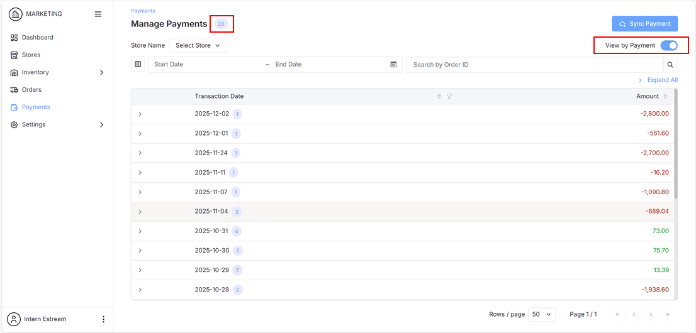
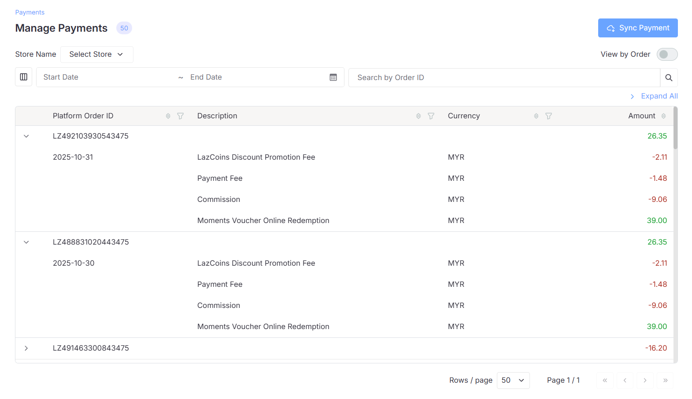
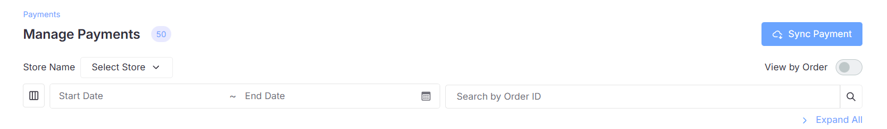

The **Manage Payments** page allows you to view and manage all payment transactions and orders. The number displayed next to the **Manage Payments** title (e.g., "20" or "50") shows the total number of transactions or orders in the data table based on the view options.

## Data Table Features

### Table Columns

| Column | Description |
|--------|-------------|
| **Transaction Date** (Payment view) / **Platform Order ID** (Order view) | The grouping field - by transaction date or order ID |
| **Description** | Details of each transaction line item |
| **Currency** | The currency used (e.g., MYR) |
| **Amount** | Total amount for the grouped row, or individual line item amounts when expanded |

### Filter and Search Options

| Filter Option | Description |
|---------------|-------------|
| **Sync Payment** | Click the **Sync Payment** button at the top-right corner to synchronize payment data from your e-commerce platform |
| **View Options** | Toggle between two view modes using the switch at the top-right corner: • **View by Payment** - Displays transactions grouped by transaction date • **View by Order** - Displays individual orders grouped by Platform Order ID |
| **Store Selection** | Click the **Select Store** dropdown next to "Store Name" to choose a specific store, or leave as default to display **All** stores |
| **Customize Table Columns** | Click the **column icon** on the left side (beside the Start Date field) to show or hide specific columns and customize which information is displayed |
| **Date Range Filter** | Select a **Start Date** and **End Date** (up to today) to filter transactions within the date range. |
| **Search by Order ID** | Enter an **Order ID** in the search field to filter and display matching orders |
| **Expand All** | Click **Expand All** in the top-right to expand all parent rows simultaneously and reveal detailed breakdowns for all transactions |

## FAQ

1. **What's the difference between "View by Payment" and "View by Order"?**

   - **View by Payment** groups transactions by date, showing all orders and charges for each transaction date
   - **View by Order** shows individual Platform Order IDs with their total amounts

2. **Why are some amounts shown in red and others in green?**

   - **Red (negative)** amounts represent deductions such as fees, charges, and commissions
   - **Green (positive)** amounts represent income such as product sales, refunds received, or reversed charges

3. **What does the number badge next to the transaction date mean?**

   - The badge (e.g., "1", "3", "7") indicates how many orders were processed on that transaction date

4. **How do I see the full breakdown of a transaction?**

   - Click the chevron icon (`>`) next to any transaction date or order ID to expand and view all details

5. **What is "Sync Payment" used for?**

   - The Sync Payment button synchronizes payment data from your e-commerce platform