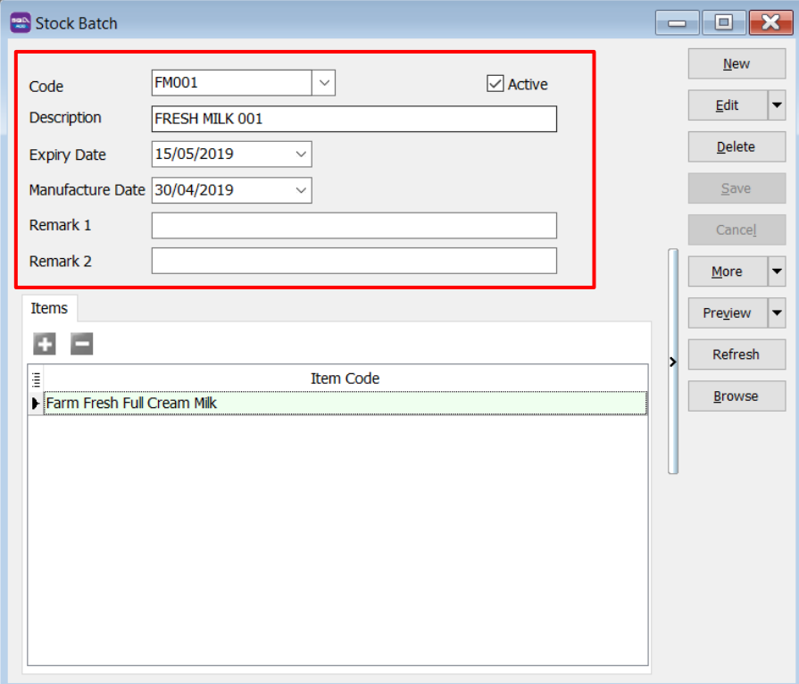
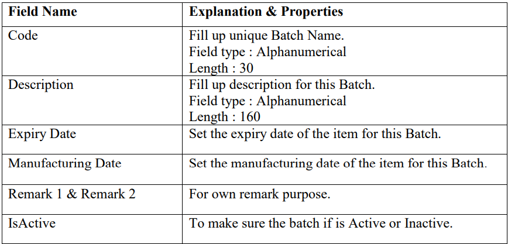
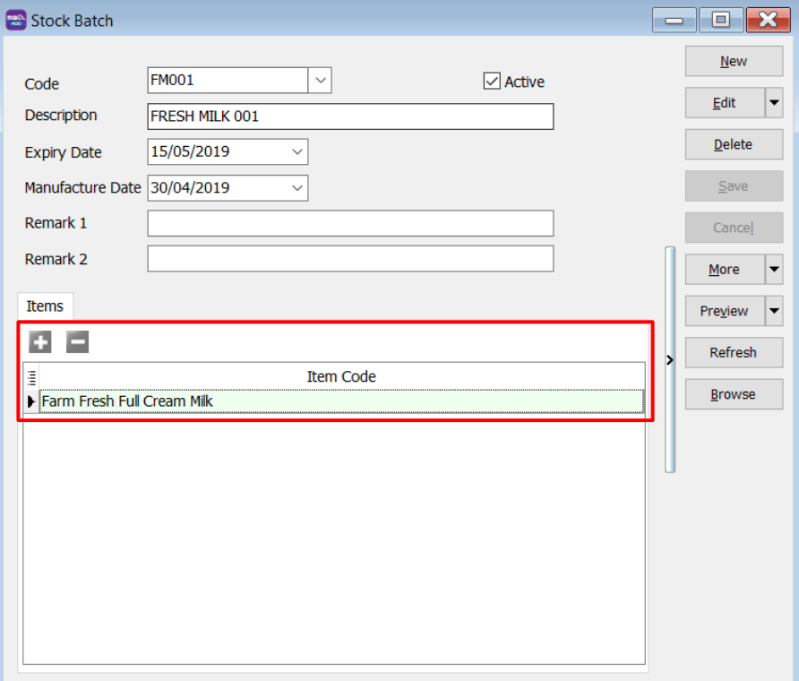
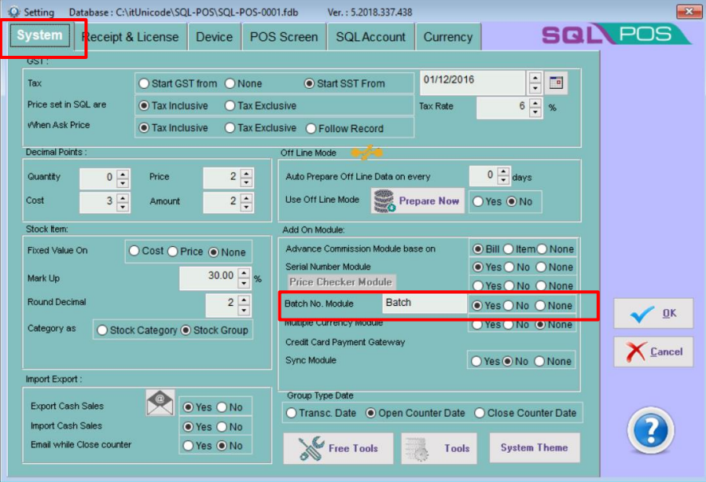
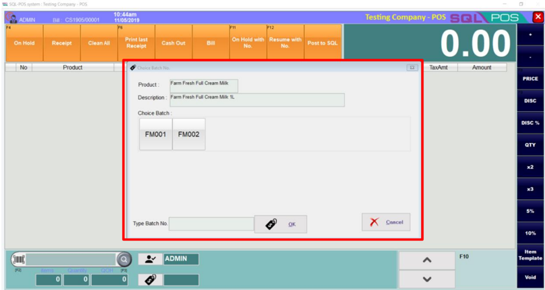
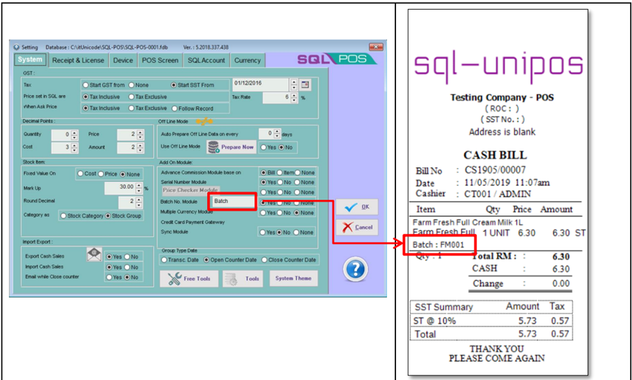
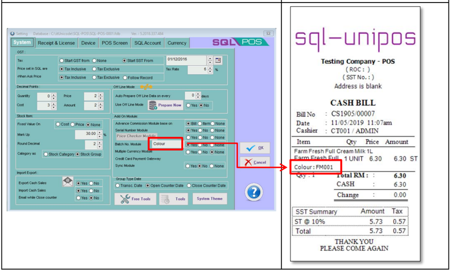

:::info
This feature is very useful and widely explore for alternative usage like:

1. To trace the expiry dates of the goods.
2. To differentiate goods by sizes, colours, etc.
3. To trace goods from which production batch.
4. and many more.

:::

***This module is optional module in both SQL Account & SQL Pos***

## How to use Batch Module in SQL Pos?

1. To Maintain Batch, Open SQL Account → Stock → Maintain Batch → New

2. Fill in the batch details:

    

    

3. Assign the stock item to the batch number.

    

4. In SQL Pos → Setting → System → Batch No. Module → Tick **YES**

    

5. In SQL Pos, when you select the item, it will prompt out to ask you to choose on the batch for this item.

    

6. When you print out the receipt, the receipt will show out your batch number. The description for batch that prints out in receipt will follow the setting that you had done.

    

    
