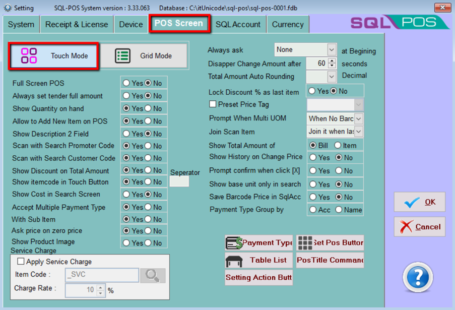
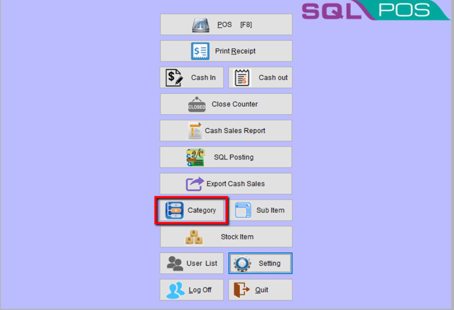
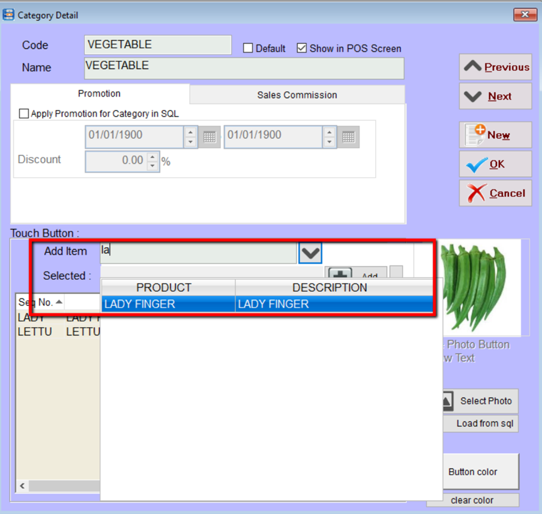
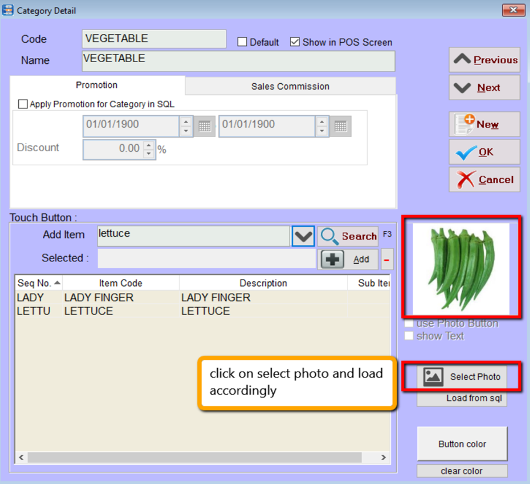
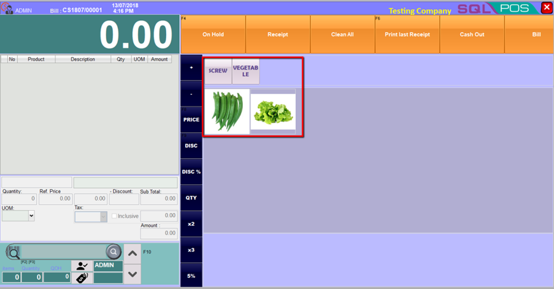

## Steps and Instructions

### Go to setting → POS Screen → Touch Mode → press OK

### Select Category → New → Example: Vegetable

### Select Item, eg. Lady Finger

### You can also load the photo as display photo in POS, continue to update all item

### SQL POS will show it as picture below

