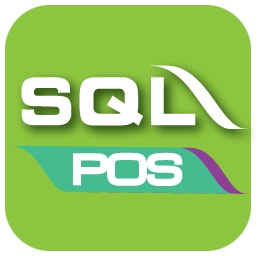
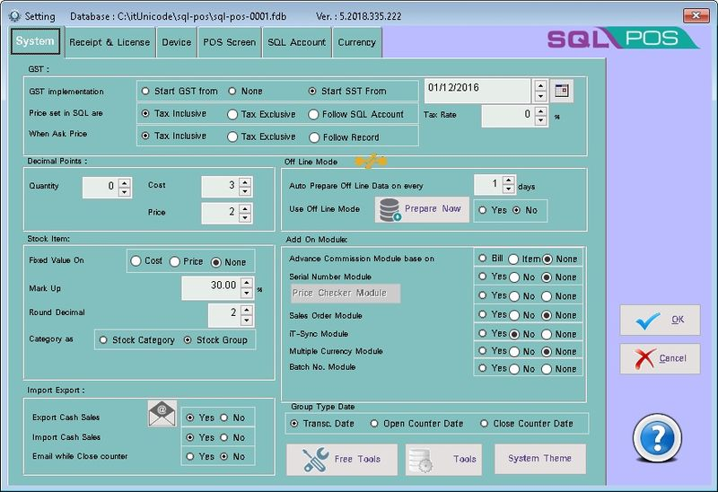
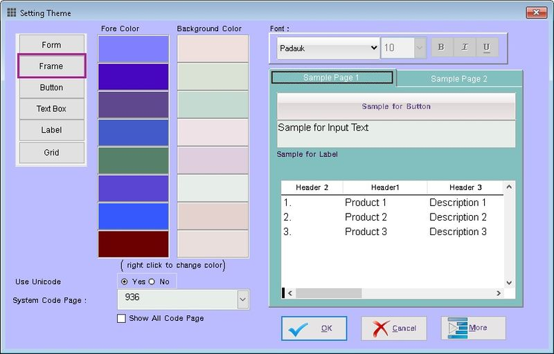
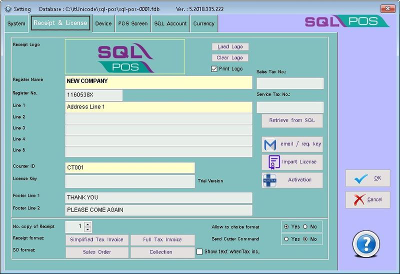

Cash collection, Inventory Management and Business Intelligence - all in one place. Seamless integration make it easy to sell you products and accept multiple payments. Inventory, orders and customer data are automatically updated. SQL Pos covers a wide range of industries - Mini Markets, Book Stores, Hardware Stores, Pharmacies Medical Sore and many more.

## System Requirements

The following requirements are needed in order to run SQL POS

- for **Standalone or Client (Workstation) PC**

:::info

- [`SQL Accounting`](../../intro.md)
- Microsoft Windows 10 and above (recommended with 64 bits windows).
- XGA - minimum of 16 bis colors recommended.
- Intel i5 and above computer.
- 4 GB of RAM (recommended 8 GB and above).
- 10 GB of available hard disk space (recommended use the Solid-State Drive (SSD) Disk).
- Microsoft Windows Compatible Printer.

:::

- for **Server PC**

:::info

- [`Firebird`](../../getting-started/multi-user-setup.md#firebird-installation)
- [`SQL Accounting`](../../intro.md)
- Microsoft Windows 10 and above (recommended with 64 bits windows).
- XGA - minimum of 16 bis colors recommended.
- Intel i5, i7 and above computer.
- 8 GB of RAM (recommended 12 GB and above).
- 10 GB of available hard disk space (recommended use the Solid-State Drive (SSD) Disk).
- Microsoft Windows Compatible Printer.
- 100 Base-T NIC.

:::

## System

### System - System

### GST

| **Field** | **Description** |
|------------|----------------|
| **GST Implementation** | - **Start GST from** – When GST starts charging - **None** – No Tax - **Start SST from** – When SST starts charging |
| **Date** | - Enter the Start Date for GST/SST |
| **Price set in SQL are** | - **Tax Inclusive** – System will reverse the price to exclude tax amount - **Tax Exclusive** – System will directly get the price |
| **When Ask Price** | - **Tax Inclusive** – System will reverse the entered price to exclude tax amount - **Tax Exclusive** – System will directly use the price entered - **Follow Record** – System will follow the last selected setting |
| **Tax Rate** | - The tax rate |

### Decimal Points

| **Field** | **Description** |
|------------|----------------|
| **Qty** | Quantity Field Display format |
| **Cost** | Stock Unit Cost Display format |
| **Price** | Sales Unit Price Display format |

### Off Line Mode

| **Field** | **Description** |
|------------|----------------|
| **Auto Prepare Off Line Data on every** | Set Number of Days to Update |
| **Use Of Line Mode** | **Yes** – To Enable Off Line Mode Function   **No** – To Disable Off Line Mode Function |
| **Prepare Now** | Adhoc update Data |

### Stock Item

| **Field** | **Description** |
|------------|----------------|
| **Fixed Value On** | **Cost** – ???   **Price** – ???   **None** – ??? |
| **Mark Up** | ??? |
| **Round Decimal** | ??? |
| **Category as** | **Stock Category** – ???   **Stock Group** – ??? |

### Add On Module

| **Field** | **Description** |
|------------|----------------|
| **Advance Commission Module base on** | **Bill** – ???   **Item** – ???   **None** – ??? |
| **Serial Number** | **Yes** – ???   **No** – ???   **None** – ??? |
| **Price Checker Module** | **Yes** – ???   **No** – ???   **None** – ??? |
| **Sales Order Module** | **Yes** – ???   **No** – ???   **None** – ??? |
| **iT-Sync Module** | **Yes** – ???   **No** – ???   **None** – ??? |
| **Multiple Currency Module** | **Yes** – ???   **No** – ???   **None** – ??? |
| **Batch No. Module** | **Yes** – ???   **No** – ???   **None** – ??? |

### Import Export

| **Field** | **Description** |
|------------|----------------|
| **Export Cash Sales** | **Yes** – Allow Export Cash Sales Data (Default)   **No** – Not Allow Export Cash Sales Data |
| **Import Cash Sales** | **Yes** – Allow Import Cash Sales Data (Default)   **No** – Not Allow Import Cash Sales Data |
| **Email while Close counter** | **Yes** – ???   **No** – (Default) |

### Group Type Date

This Option is to determine what date to post to SQL Accounting

| **Field** | **Description** |
|------------|----------------|
| **Transc. Date** | Post Base On Transactions Date (Default) |
| **Open Counter Date** | Post Base on Open Counter Date.   This is useful if Counter is closed on next Date but account needs to be posted on Today. |
| **Close Counter Date** | Post Base on Open Counter Date.   This is useful if Counter is closed on next Date and account needs to be posted on next Date. |

### Free Tools

| **Field** | **Description** |
|------------|----------------|
| **Import Product list from Excel File** | ??? |
| **Import Customer list from Excel File** | ??? |
| **Import Supplier list from Excel File** | ??? |
| **Global Price Adjustment** | ??? |
| **Delete Zero Quantity Items** | ??? |
| **Fix Firebird Shutdown Database** | ??? |

### Tools

| **Field** | **Description** |
|------------|----------------|
| **Backup Database** | Backup the current SQL Pos DB |
| **Restore Database** | ??? |
| **Delete Data / Clean Test Data** | ??? |
| **Unipos Migration** | ??? |

### Theme

This function is allow user to change the Application Skin/Theme to suit the user. From form till grid & label

  

## System - Receipt & License

This Page is to:

- Register the SQL Pos
- Design the Receipt

  
