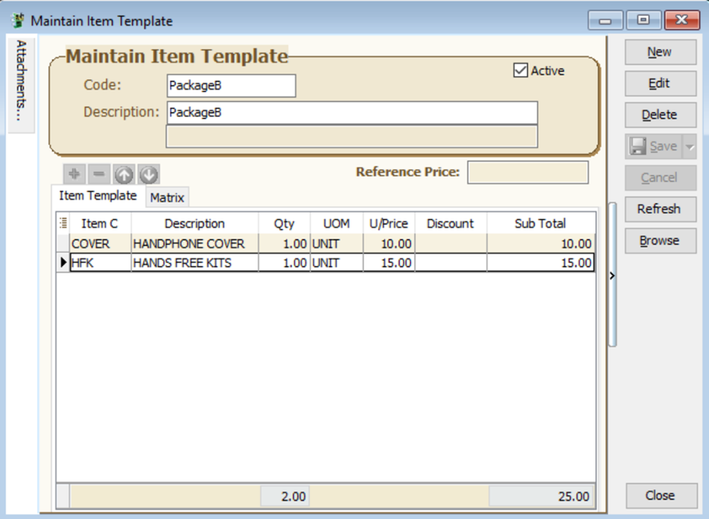
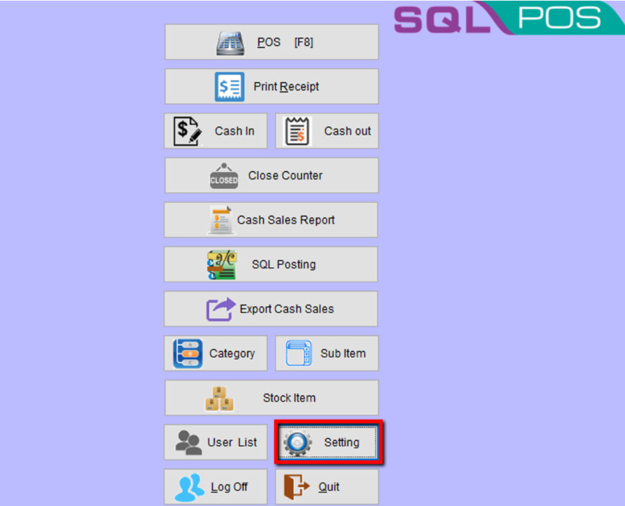
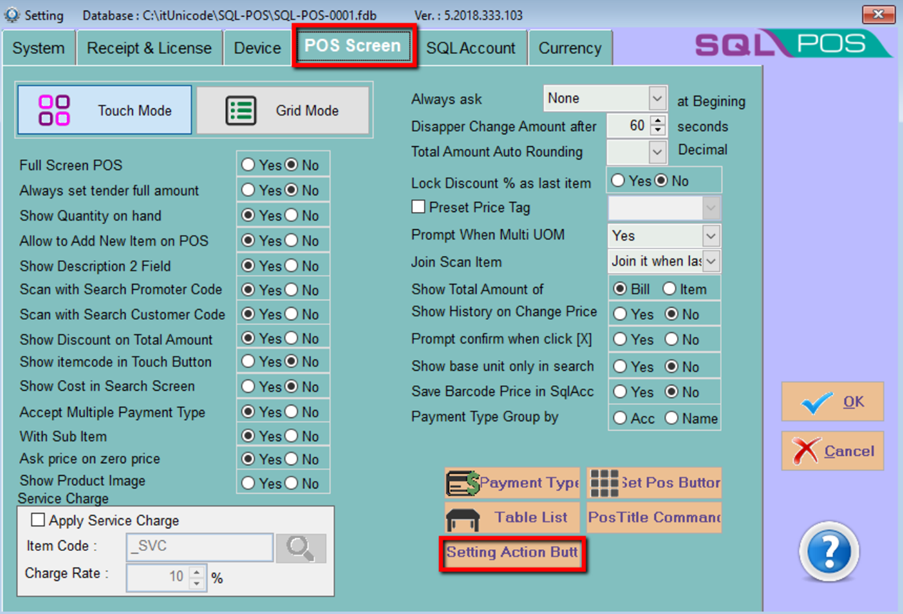
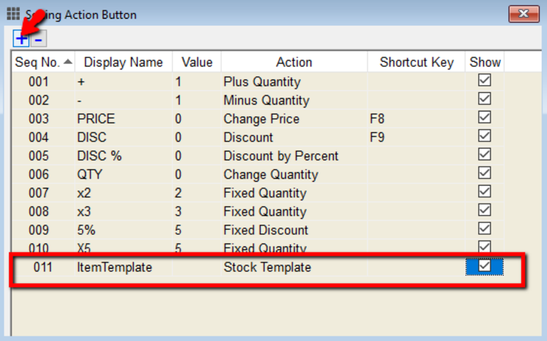
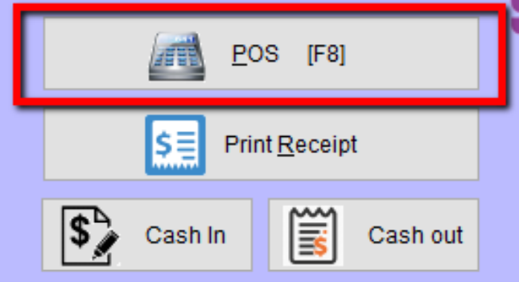
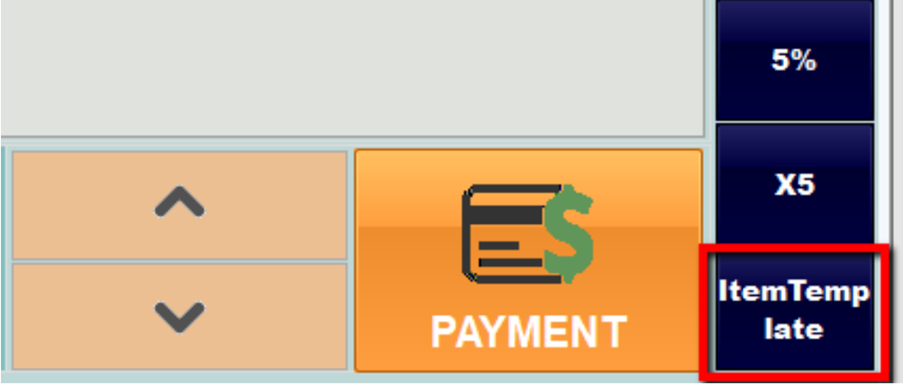
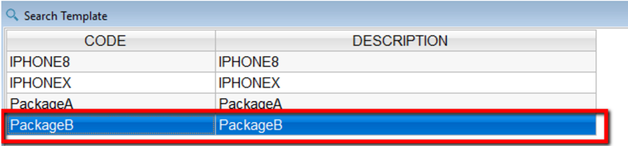
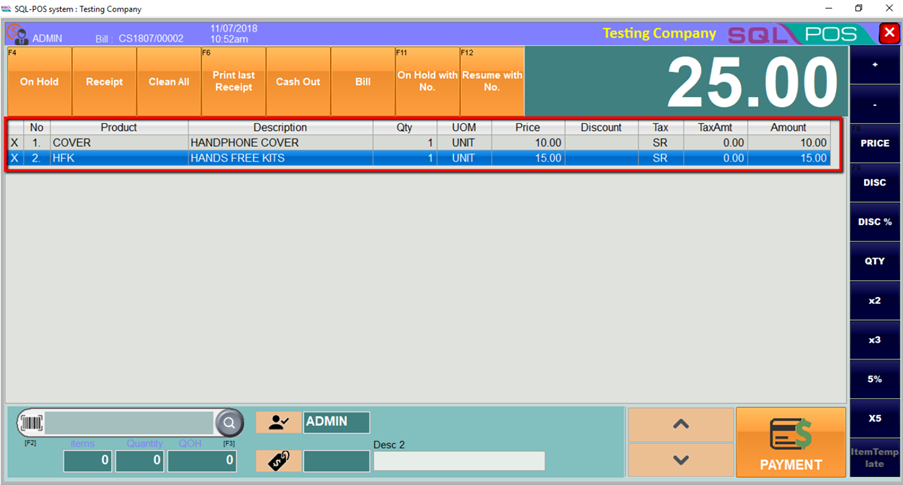

## SQL Account

:::note
*Item Template module required in SQL Account*
:::

1. Setup your item template from Stock | Maintain Item Template | New

## SQL POS

1. Go to Setting

    

2. Go to **POS Screen** | click on **Setting Action Button**

    

3. Click on + to insert a new line, enter a **display name** by double click, on Action column select stock template and make sure the show checkbox is ticked | click on OK | OK

    

4. Go to POS

    

5. On right bottom column you will able to see 1 new option Item Template , click on it

    

6. All the item template set in your SQL Account able to select here, you can double click to choose your package / template.

    

7. The items will be display out , and you can proceed with payment or if there is any discount, just set the discount as usual by enter in discount column, or choose the discount option on right panel.

    
