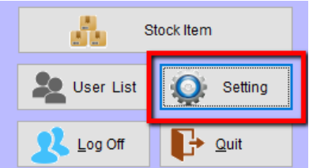
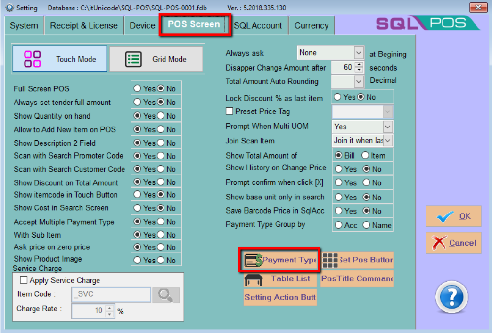
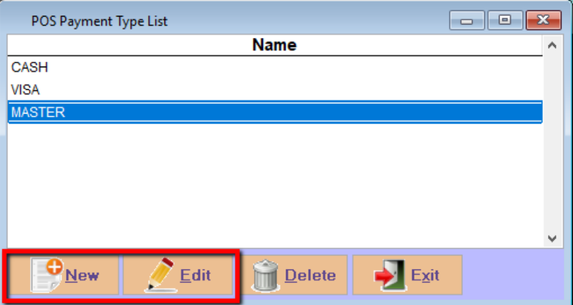
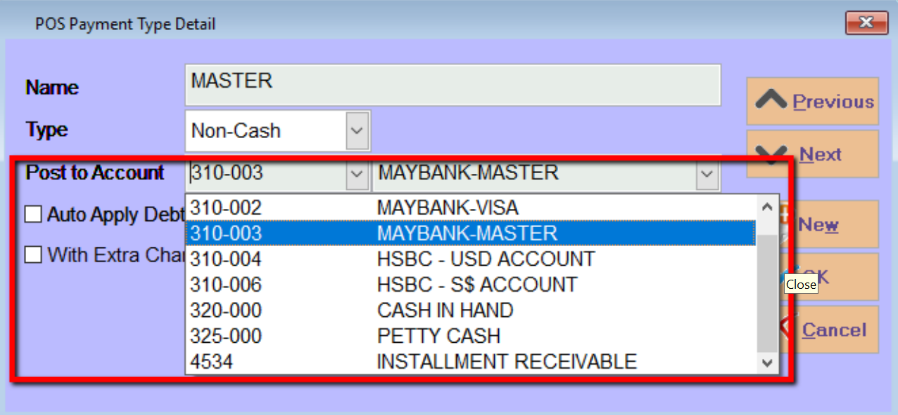
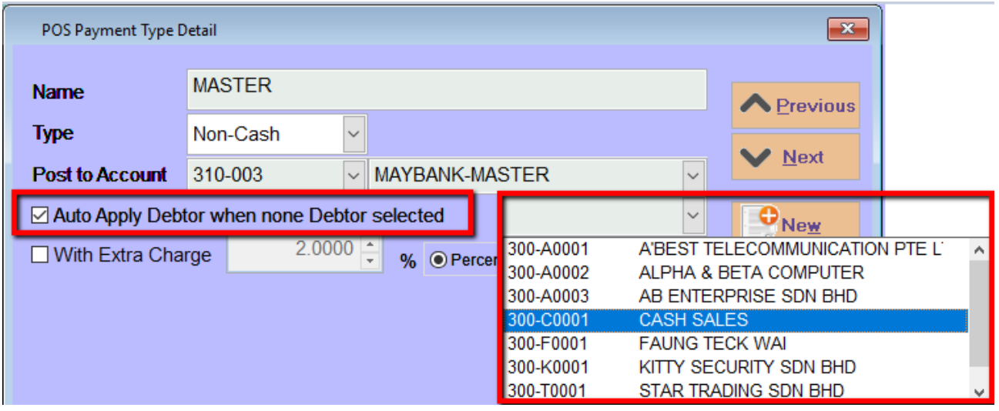
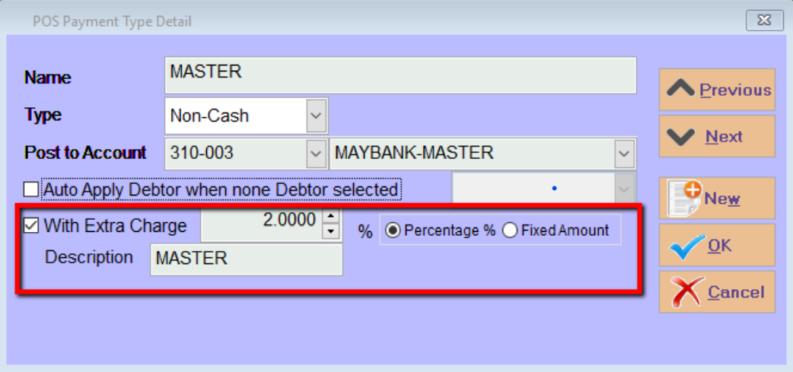

## Steps and Instructions

1. Click on setting

    

2. Navigate to SQL POS, click on Payment Type

    

3. Modify Payment Type

    - Click New to insert new payment type or click Edit to modify

    

4. Choose Payment Method

    - Choose your payment method map to SQL Account bank account

    

    4a: Set default debtor code

        - You can set a default debtor code for this payment method if the transaction not choosing any debtor code

        

    4b: Set the default charges

    - You can also set default have 2% or a fixed amount of rm 2 extra charges for this payment method

    
