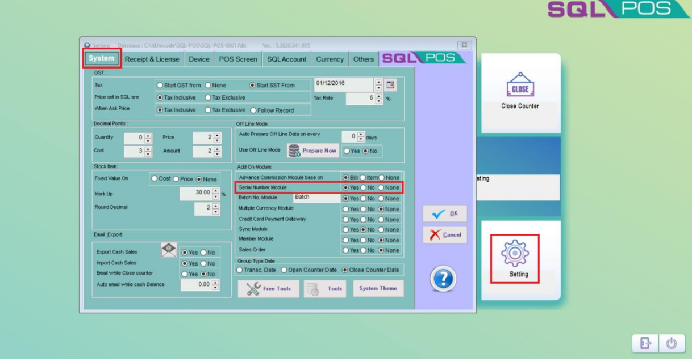
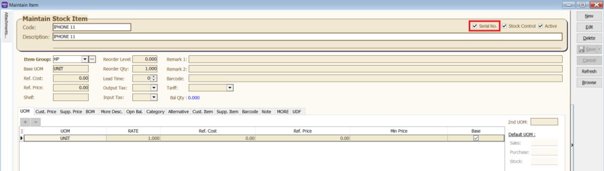
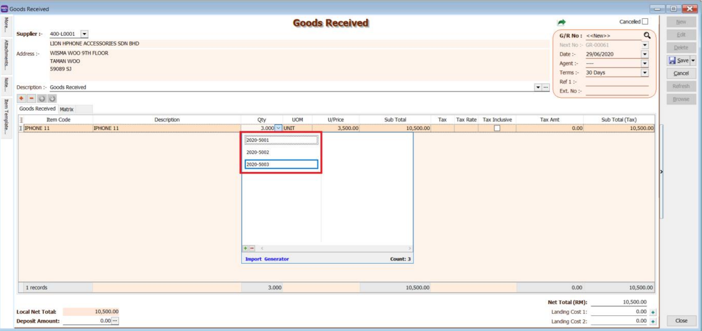
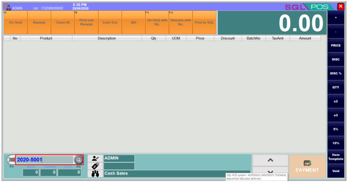
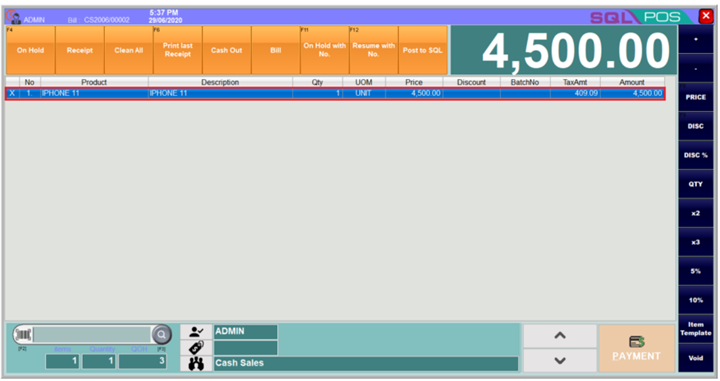
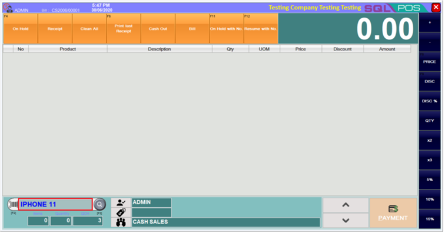
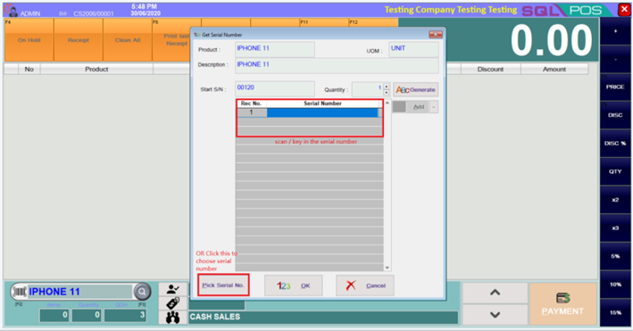
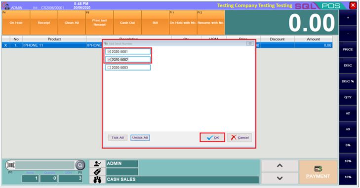

:::info
Serial Number module is an additional module. Make sure you had turned on the module.

Please check under Setting -> System -> Serial Number Module
:::

In SQL Account, make sure you had turn on the serial no for your item as well.

## How to insert the serial number?

### Method 1: Insert serial number using SQL Account and select accordingly in SQL Pos

1. Scan/Key in the serial number when you issue Purchase Goods Received/Purchase Invoice.

    

2. In SQL Pos, you can scan/type the serial number, the item will be automatically selected.

    

    

### Method 2: Key in manually

1. You can key in your item code and click ENTER, then system will prompt out the box for you to insert Serial Number by Scan / Type, Or click on the Pick Serial No. button to choose the serial number.

