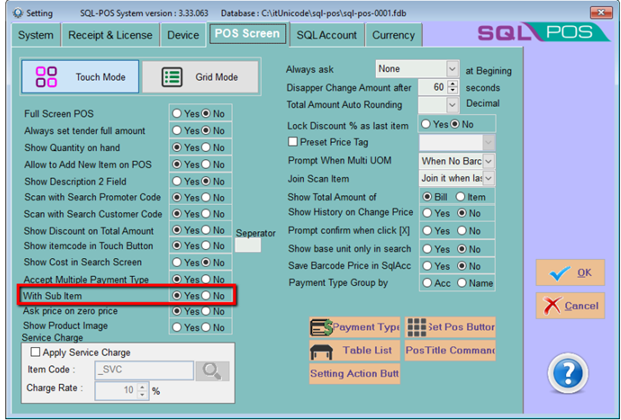
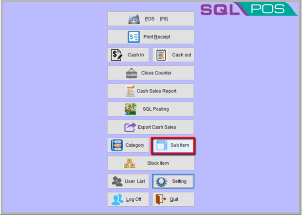
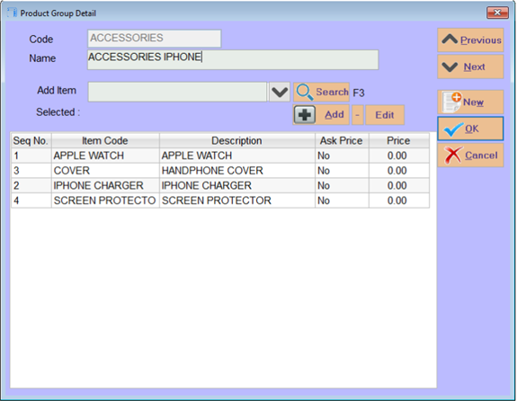
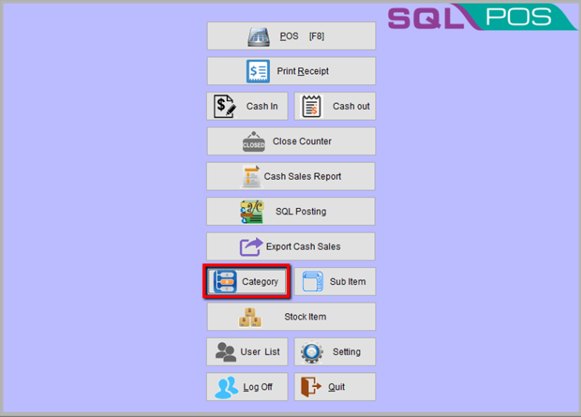
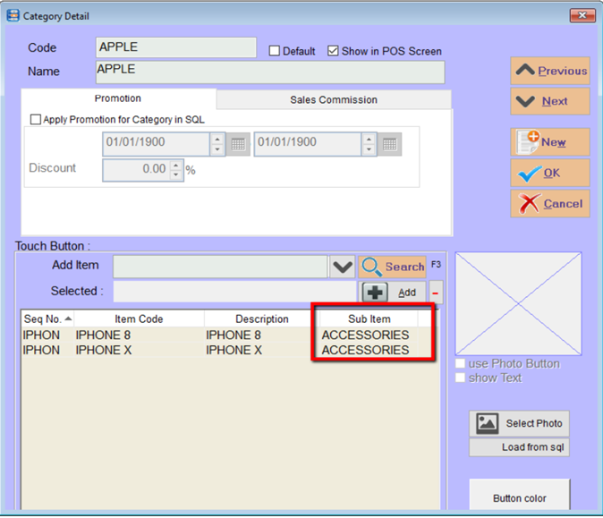
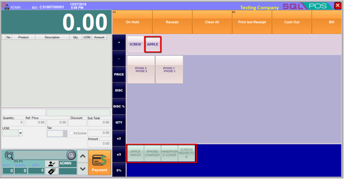

### Steps and Instructions

### You must make sure setting had turn on the subitem setting

### Press OK and found Sub Item on home screen

### Press New and create the sub item accordingly

### After creating the subitem, click on category and generate new code to add in sub item template under category

**Let’s see the results.**

