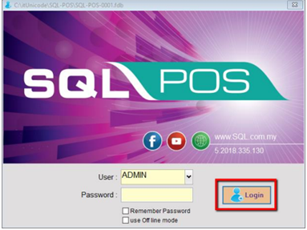
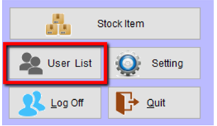
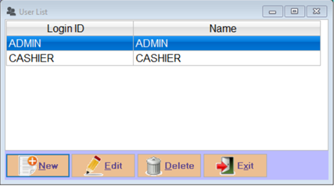
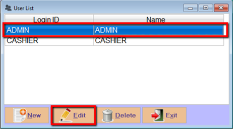
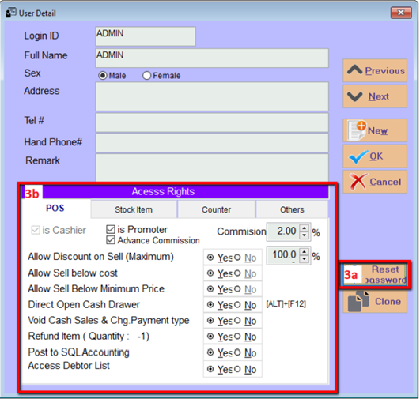

## Create New User

1. Click the login button

    

2. Go to User List

    

3. Press and New Button to create new user.

    

## Set user login password and access right setting

1. To reset admin password , highlight on the users name and click on EDIT button

    

2. Click on reset password button to reset your ADMIN password

3. Set your access right Yes / No accordingly.

    
