## Maintain Stock Item

- Item Code must be 7 Character (cannot more and less)
- First 2 Characters of Item Code must be fixed, mostly use 88 or 99
- Remaining 5 digit is Item Code Running Number

    Example:

    1. Item Code = 8800010, all others item code with measure scale have to start with 88xxxxx

    2. UOM Must be KG or PCS

    3. Enter Ref Price

    4. Save

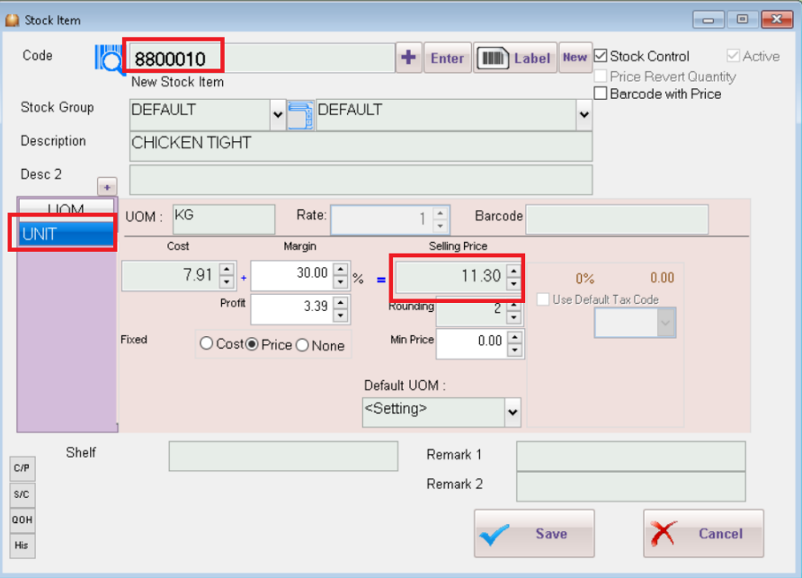

:::note
You are recommend to create all the item code first
:::

## IN SQL POS Setting

1. Navigate to "Others" Tab

2. Set "Scale Barcode" to Price

    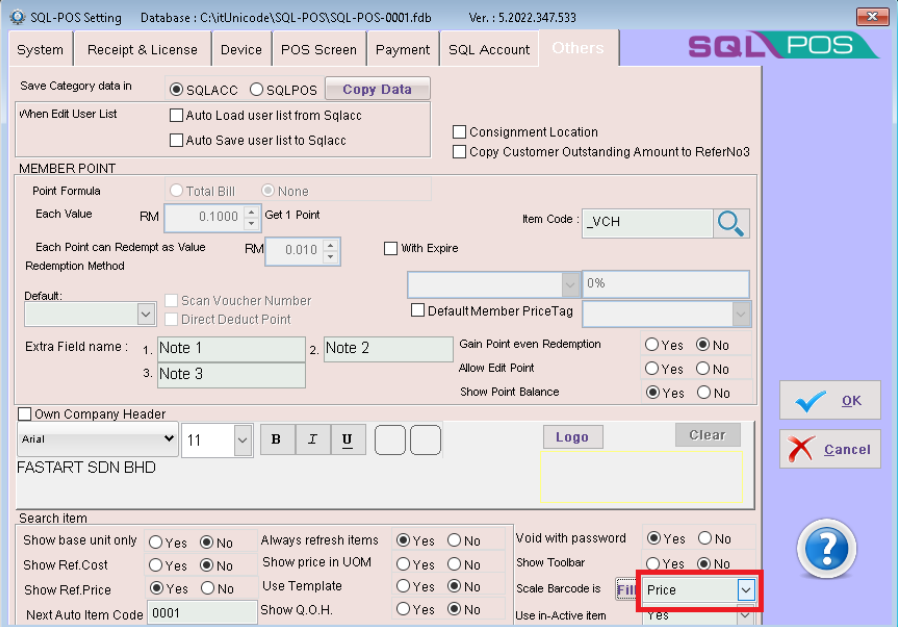

3. Click on Fill

    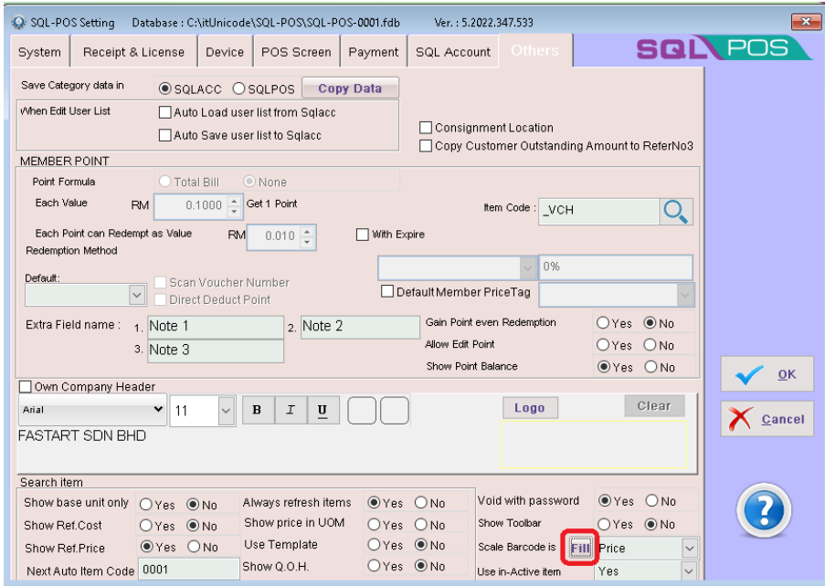

4. Fill Scale Items

    - Department = First 2 Character of Item Code
    - Code Length = 7 Digit Characters
    - Ticked Barcode with Price
    - Ticked Price Revert Quantity
    - Click on button Fill items which are Match

    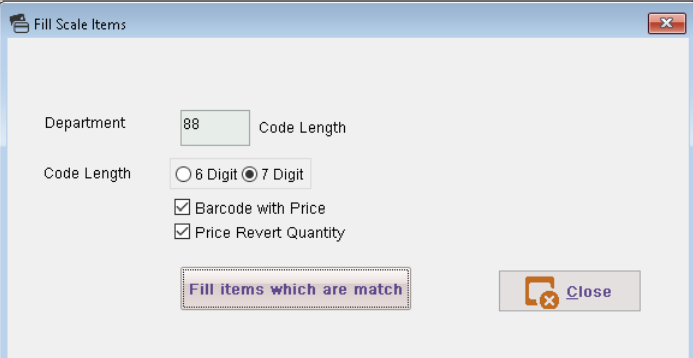

5. Click on Yes

    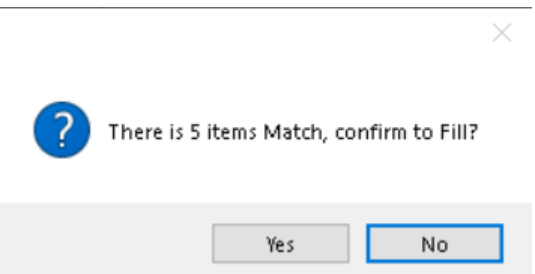

6. Click on OK

    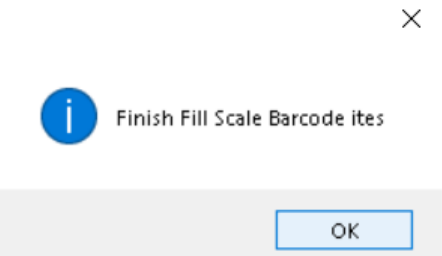

7. Close & Save the Setting

    :::caution
    Whenever you add a new item code, you must repeat from the Step 2.
    :::

    In Stock Item, for the items which have fulfill the criteria, Price Revert Quantity and Barcode with Price will be auto ticked.

    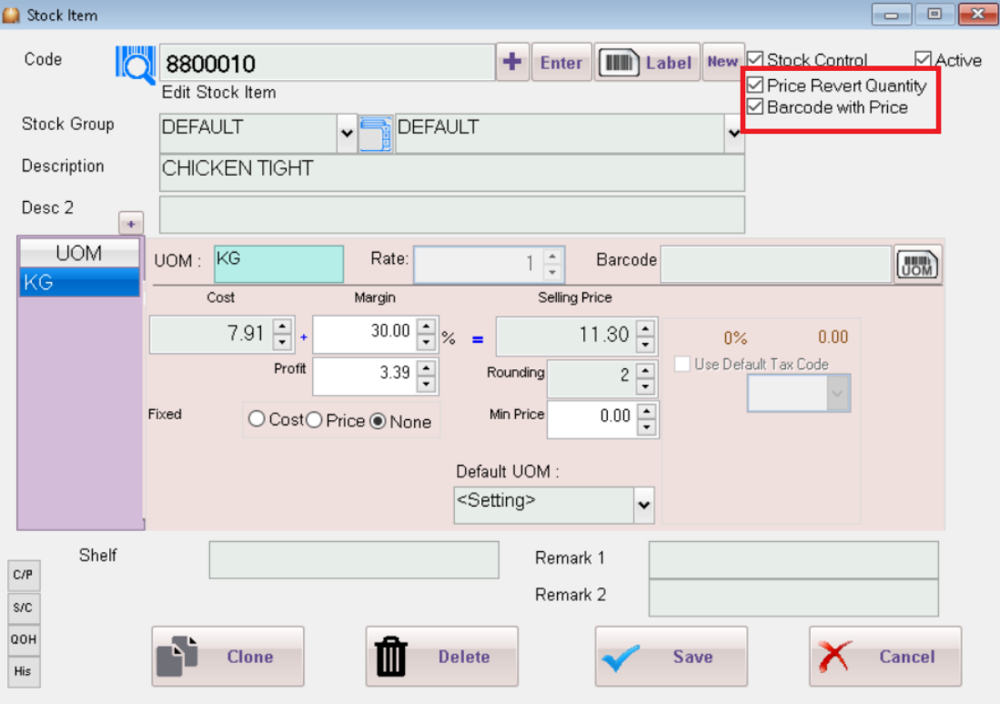

## Step to update price to weighing scale

1. Navigate to Stock Item, right click on More and select Export to Scale Machine

    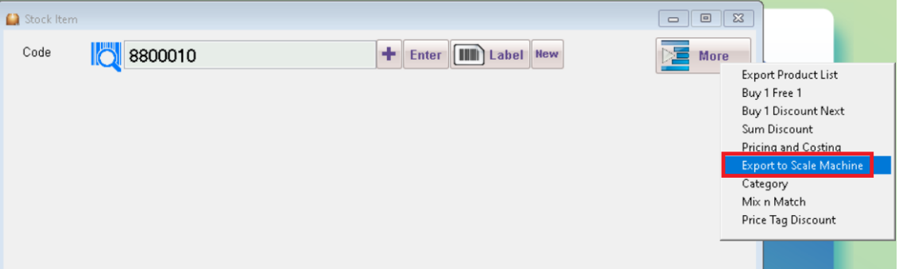

2. The following is the model supported by SQL POS

    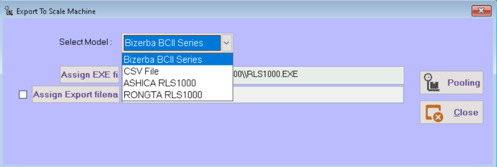

3. Select Model and tick Assign Export FileName

    - Assign Export FileName = C:\ITUnicode\PLU.TXP

    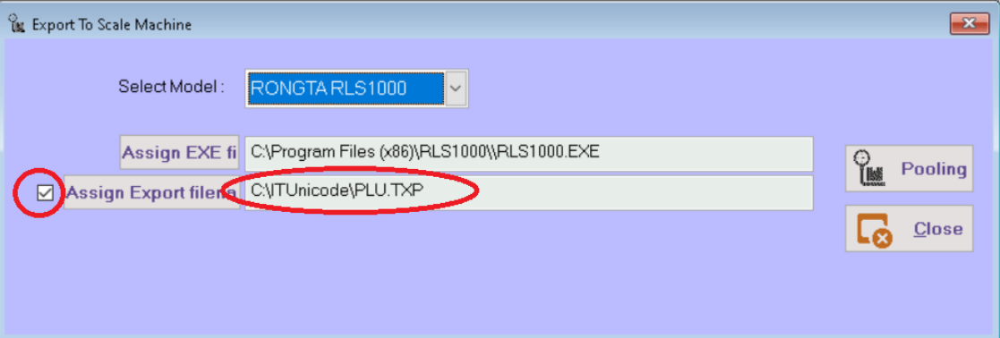

4. Click Button Pooling

    - System will run the program `C:\Program Files\RLS100\RLS1000.EXE` **(Please make sure RONGTA Pooling program is installed)**

5. System will auto open RLS1000 Program

    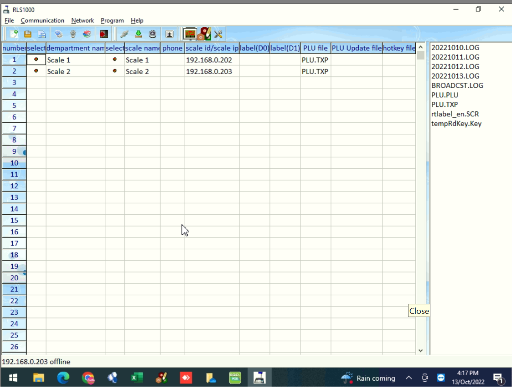

6. Next, go to File > FSetting

    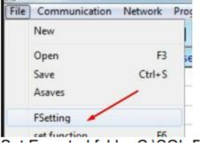

    - Exported folder: `C:\ITUnicode\`
    - Directory of Work: `C:\ITUnicode\`

    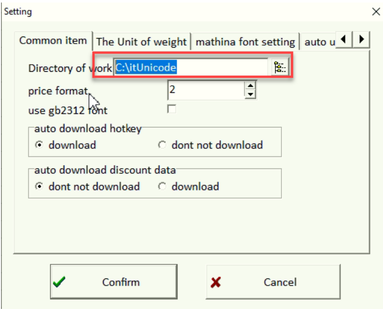

7. Click Confirm

8. Setting for RLS1000

    :::info
    You can use CMD to ping with the Scale IP address, make sure able to ping successfully first
    :::

    - Department Name = Scale 1
    - Scale Name = Scale 1
    - Scale IP = 192.168.0.x
    - Plu_file = PLU.TXP

    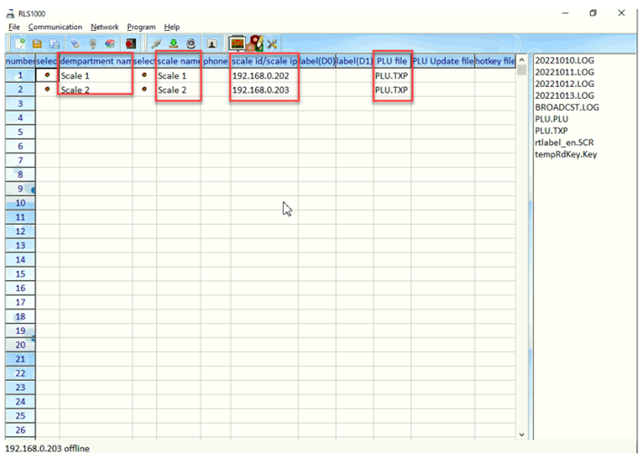

    :::note
    Example above involves 2 weighing scale
    :::

9. Click Green arrow button to Pooling latest selling price into scale Machine.

    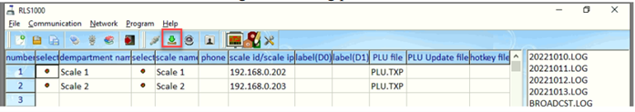

10. Click confirm.

    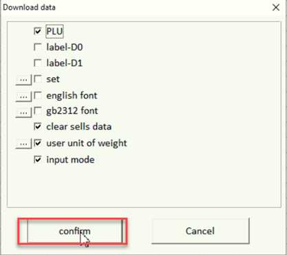

11. Status mention OK mean is connected.

    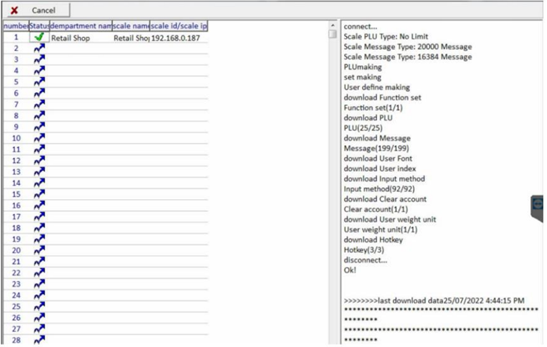

After finish the above, test the Scan the barcode function in POS system, check and confirm if system able to capture the correct price and qty.

:::info
Testing on weighing scale

- If item code is 8800010, then number 10 represent this item, in weighing scale.
Keypad, press 1 & 0, to measure, label will print out automatically.
- If print out label is empty(weighing scale have the item description), mostly is headline problem, need to refer back to Scale vendor.

:::
