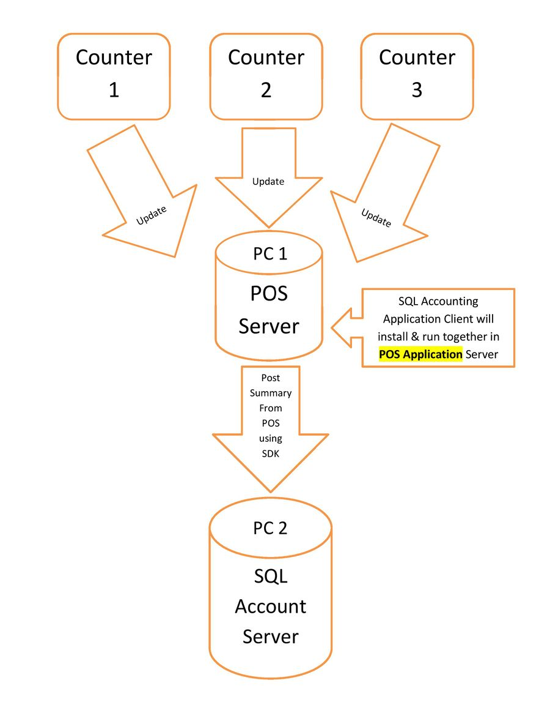
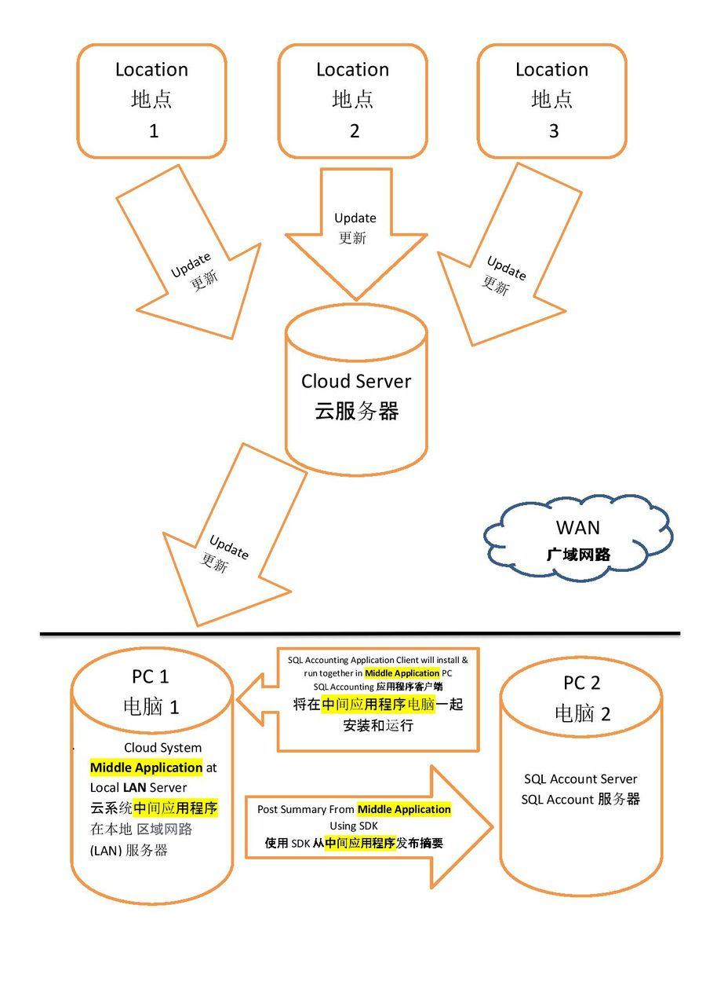
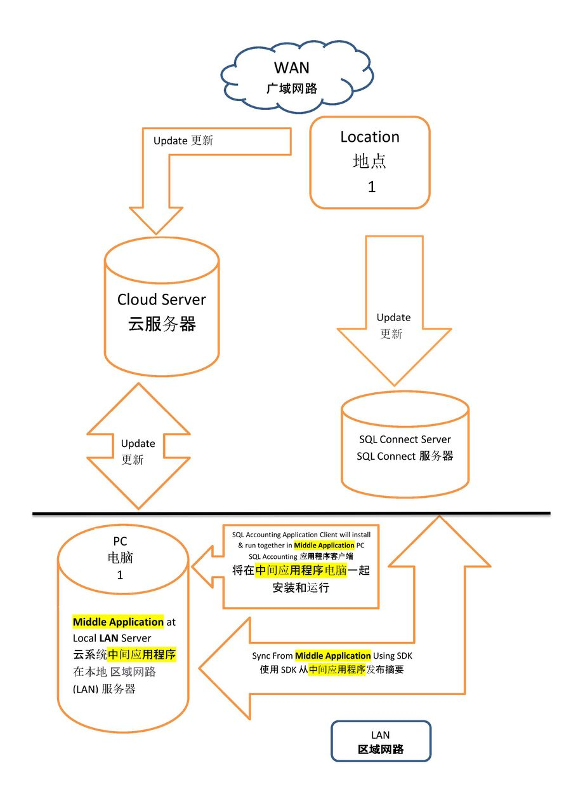

This is the "Bridge" direct live linking between External Program with SQL Accounting

## Pros and Cons

**Pros***

1. Can Live or Batch Update.
2. Can do action such as New, Edit & Delete.
3. About 95% of modules is covered.
4. Can direct Retrieve/Get Information From Connected Database.
5. Able to do Automation (i.e. auto login & update data).
6. Support GST & SST.
7. Free of Charge (Freeware) for End User on SDK Linking.

**Cons***

1. Must had programming knowledge.
2. Must had SQL Accounting installed & running.
3. Must self do checking else error prompt will unable to “capture”.
4. Only supported in IE for JScript

## Requirements

* Microsoft Windows 8.1 and above (recommended with 64 bits windows)
* Intel i5, i7 and above computer.
* 8 GB of RAM (recommended 12 GB and above).
* Firebird (For Automatic Login & Logout Only)
* SQL Accounting
* Windows Scheduler (For Automatic Login & Logout Only)

## Documentation

[SQLSDK.zip-download to use](https://www.sql.com.my/document/SQLLink/SQLSDK.zip)

[Steps-SDK.gif-a short video for steps-watch to know the steps after downloading SQLSDK.zip](https://download.sql.com.my/customer/Fairy/Steps-SDK.gif)

## Linking Flow

Highlight in Yellow Color is the Windows base Application/Function you need to Develop/Create.

### Example 1 - POS System



### Example 2 - Cloud/Mobile System



### Example 3 - Cloud/Mobile System with SQL Connect Public



:::warning

Using this method the **respond** might be very **slow**.
It depending on user **internet speed** & stabilities.

:::

* The SDK can be build in in your system or a Standalone windows Application(Middle Application).

* If you build in your system then it can be sync anytime either by a special interface with parameter (eg Date From, Date To & etc) or each transaction after post(not recommended)

* If you create a Standalone windows Application(Middle Application) you can make use the Windows Schedule to sync or call from you system to execute/run the Standalone windows Application(Middle Application).

## Steps

### CHM File

1. Setup SQL Accounting Linking [Click Here for SQL Accounting setup steps](/sql-account-api/on-premise-setup)
2. Create Sample Data
3. Login (username & password is Admin)
4. Double click the SQLSDK.chm file
5. Click Application Object | Business Objects
6. Click the word "here"
7. Click Yes
8. In the list Look for (example)
        - AR_IV -> Customer Invoice
        - AR_CN -> Customer Credit Note
        - AP_PI -> Supplier Invoice
        - SL_IV -> Sales Invoice
        - PH_PI -> Purchase Invoice
        - ST_AJ -> Stock Adjustment

## External Application Linking

1. Login SQL Accounting
2. Login External Application
3. Click Post to SQL Accounting button or Click Save button from External Application.

## Available Programming Language

* VB. Net
* C Sharp
* ASP.Net C Sharp
* Python
* PHP
* Node JS
* Java
* VB Script
* JavaScript
* Delphi

[Summary Document Flow by Programming Language - Excel](https://docs.google.com/spreadsheets/d/1dGUXIM0aWAG7xIyE1D1IsPmdq7paF9gpq3h0NqzFQDc/edit?usp=sharing)

## Example External Program

### VB. Net
        - Example [VBDotNet-20230819](https://download.sql.com.my/customer/Fairy/VBDotNet.zip)

### C Sharp

        - Example [CSharp-20230819](https://download.sql.com.my/customer/Fairy/CSharp.zip)

### Steps (C Sharp & VB.Net Only)

The  [example video](https://download.sql.com.my/customer/Fairy/Video-VBDotNetnCSharp.zip) is how to 

1. Open DCF in **D:\Happy\DB\Default.DCF**
2. Datatabase is **ACC-0008.FDB**
3. Click **Complete Post** button
4. Where to check in SQL accounting after Post (Steps-2.gif)

Available Function

        - Complete Post - SL_CS, SL_CN, AR_PM, AR_CN & AR_CF
        - Batch Post - Cash Sales - SL_CS
        - Batch Post...2 DB
        - Batch Post...2 DCF
        - Add Stock Assembly with Override Raw Materials - ST_AS
        - Add Stock Job Order to Stock Assembly with Override Raw Materials - PD_JO & ST_AS
        - Add Agent - Agent
        - Get Agent Description
        - Add Journal Voucher - Add GL JE
        - Edit GL Journal Voucher - Edit GL_JE
        - Edit Sales Cash Sales - SL_CS
        - Delete Cash Sales - Del SL CS - SL_CS
        - Customer Aging - Customer.Aging.RO
        - Get Sales Invoice Listing - Sales.IV.RO
        - Stock Item List
        - Add SKU with Edit SKU - ST_ITEM
        - Del SKU - ST_ITEM
        - Get DCF Database List
        - Month End - FIFO
        - Month End - WA (Weighted Average)
        - Get Options...(Perform Tax / Local Amount Rounding, 5 Cents Rounding (Sales Invoice) & 5 Cents Rounding (Cash Sales)
        - Get Next Invoice No.
        - Is Valid ST_Item
        - Is Valid GL_Acc
        - Outstanding SO - Sales.OutstandingSO.RO
        - Read RTF n Picture Data...
        - Get Customer List - AR_Customer
        - Add Customer with Edit Customer - AR_Customer
        - Del Customer - AR_Customer
        - Add GL Payment Voucher - Add GL_PV
        - Transfer Document - DO to SL_IV
        - Get Transfer Info. 1 - At Invoice Find DO Number & Date
        - Get Transfer Info. 2 - At DO Find Invoice Number & Date
        - GL Ledger
        - Add Stock Transfer - Add ST XF
        - Add Stock Adjustment - Add ST AJ
        - Get Serial Number Balance - Serial No. Bal.
        - Add Customer Deposit - Deposit
        - Transfer Customer Deposit to Payment - Deposit to PM
        - Refund Deposit - Deposit Refund
        - Forfeit Deposit - Deposit Forfeit
        - Enable Support DocNo Format with Month & Year Format
        - Add AR IV
        - Add AR CN
        - Add AR PM Bounce Chq
        - Add GL Ledger RO
        - AR Statement
        - Add Add/Edit AR PM
        - Add LogInOut (For Testing purpose)

### ASP.Net C Sharp

1. Make sure Enabled the following function in IIS Manager - Sites - YourSiteName - Authentication
        - Anonymous Authentication
        - ASP.Net Impersonation (Make sure set Specific user (Windows Login User & Password))

2. Make sure the Windows user set in ASP.Net Impersonation is Login

* Example [ASPDotNet-20210816](https://download.sql.com.my/customer/Fairy/ASPDotNet.zip)

Available Function
        - Get Agent Description
        - New & Update Customer/Supplier Info.
        - Edit Cash Sales
        - Edit Purchase Invoice
        - Complete Post
        - GL PV
        - Add Add/Edit Agent
        - Add Add/Edit Terms
        - Add Add/Edit ST Item
        - Delete Cash Sales
        - Add SL SO

### Python

Module Require in Python
        - pypiwin32 (Mandatory) -> pip install pypiwin32
        - Pillow (Optional for Picture) -> pip install Pillow

### Common

* Common.py file for example code

#### Common Functions

<details>
    <summary>Common Functions - click to expand</summary>

```python

#Updated 03 Oct 2023
import win32com.client
import Common
import os
from time import sleep

ComServer = win32com.client.Dispatch("SQLAcc.BizApp")

def KillApp():
    os.system('cmd /c "taskkill /IM "SQLACC.exe" /F"')
    sleep(2) #sleep 2 sec


def CheckLogin():
    global ComServer
    ComServer = win32com.client.Dispatch("SQLAcc.BizApp")
    B = ComServer.IsLogin
    if B == True:
        ComServer.Logout()
        KillApp()

    ComServer = win32com.client.Dispatch("SQLAcc.BizApp")
    try:
        ComServer.Login("ADMIN", "ADMIN", #UserName, Password
                        "D:\\Happy\\DB\\Default.DCF",
                        #"C:\\eStream\\SQLAccounting\\Share\\Default.DCF",  #DCF file
                        "ACC-0015.FDB") #Database Name
    except Exception as e:
        print("Oops !", e)


def ShowResult(ADataset):
    if ADataset.RecordCount > 0:
        while not ADataset.eof:
            fc = ADataset.Fields.Count
            for x in range(fc):
                fn = ADataset.Fields.Items(x).FieldName
                fv = ADataset.FindField(fn).AsString
                lresult = "Index : "+ str(x) + " FieldName : " + fn + " Value : " + fv
                print (lresult)
            print("====")
            ADataset.Next()
    else:
        print ("Record Not Found")


def QuotedStr(ACode):
    return "'" + ACode.replace("'", "''") + "'"
```

</details>

#### Agent

<details>
    <summary>Agent Script - click to expand</summary>

```python
#Updated 22 Jul 2023
import Common

def GetListData():
    lSQL = "SELECT * FROM AGENT "
    lSQL = lSQL + "WHERE ISACTIVE='T' "
    lSQL = lSQL + "ORDER BY CODE "

    lDataSet = ComServer.DBManager.NewDataSet(lSQL)

    Common.ShowResult(lDataSet)

def PostData():
    BizObject = ComServer.BizObjects.Find("Agent")
    lMain = BizObject.DataSets.Find("MainDataSet")

    lDocKey = BizObject.FindKeyByRef("CODE", "FAIRY")

    if lDocKey is None:
        BizObject.New()
        lMain.FindField("CODE").value = "FAIRY"
        lMain.FindField("DESCRIPTION").value = "FAIRY TAIL"

    else:
        BizObject.Params.Find("Code").Value = lDocKey
        BizObject.Open()
        BizObject.Edit()
        lMain.FindField("DESCRIPTION").value = "FAIRY TAIL WIZARD"

    try:
        BizObject.Save()
    except Exception as e:
        print("Oops!", e)
    BizObject.Close()
    print ("Posting/Update Done")

def DelData():
    #Deleting only work if the record never use in other document
    BizObject = ComServer.BizObjects.Find("Agent")

    lDocKey = BizObject.FindKeyByRef("CODE", "FAIRY")

    if lDocKey is None:
        print ("Record Not Found")
    else:
        BizObject.Params.Find("CODE").Value = lDocKey
        BizObject.Open()
        BizObject.Delete()
        print ("Deleting Done")

try:
    Common.CheckLogin()
    global ComServer
    ComServer = Common.ComServer
    GetListData()
    PostData()

    answer = input("Continue To delete?")
    if answer.lower() in ["y","yes"]:
        DelData()
    elif answer.lower() in ["n","no"]:
        print ("Deleting Aborted")
    else:
       print ("Invalid Input")

    ComServer.Logout()
finally:
    ComServer = None
    Common.KillApp()
```

</details>

#### Get Company Profile

<details>
    <summary>Get Company Profile - click to expand</summary>

        ```python
 #Updated 22 Jul 2023
import Common

def GetData():
    lSQL = "SELECT COMPANYNAME, REMARK, BRN, BRN2, GSTNO, "
    lSQL = lSQL + "SALESTAXNO, SERVICETAXNO, "
    lSQL = lSQL + "ADDRESS1,ADDRESS2,ADDRESS3,ADDRESS4 FROM SY_PROFILE "

    lDataSet = ComServer.DBManager.NewDataSet(lSQL)

    Common.ShowResult(lDataSet)

try:
    Common.CheckLogin()
    global ComServer
    ComServer = Common.ComServer
    GetData()
    ComServer.Logout()
finally:
    ComServer = None
    Common.KillApp()
        ```

</details>

#### Complete Post

<details>
    <summary>Complete Post - click to expand</summary>

        ```python
        #Updated 19 Jul 2023
        #This will doing following posting
        #01. Cash Sales
        #02. Sales Credit Note
        #03. Customer Payment With Knock off
        #04. Edit Credit Note Posted in Step 02 & Knock Off
        #05. Customer Refund to Knock off Credit Note
        import Common
        import datetime

        def PostDataCS():
            BizObject = ComServer.BizObjects.Find("SL_CS")
            lMain = BizObject.DataSets.Find("MainDataSet") #lMain contains master data
            lDetail = BizObject.DataSets.Find("cdsDocDetail") #lDetail contains detail data

            lDate = datetime.datetime(2023, 2, 22, 13, 0)
            lDate.strftime('%m/%d/%Y')

            BizObject.New();
            lMain.FindField("DocNo").AsString = "--IV Test--"
            lMain.FindField("DocDate").value = lDate
            lMain.FindField("PostDate").value = lDate
            lMain.FindField("Code").AsString = "300-C0001" #Customer Account
            lMain.FindField("CompanyName").AsString = "Cash Sales"
            lMain.FindField("Address1").AsString = "" #Optional
            lMain.FindField("Address2").AsString = "" #Optional
            lMain.FindField("Address3").AsString = "" #Optional
            lMain.FindField("Address4").AsString = "" #Optional
            lMain.FindField("Phone1").AsString = ""   #Optional
            lMain.FindField("Description").AsString = "Sales"

            #Insert Data - Detail
            #For Tax Inclusive = True with override Tax Amount
            lDetail.Append()
            lDetail.FindField("Seq").value = 1
            lDetail.FindField("Account").AsString = "500-000" #Sales Account
            lDetail.FindField("Description").AsString = "Sales Item A"
            lDetail.FindField("Description3").AsString = ("Item A Line 1" + ("\r" + "Item A Line 2"))
            lDetail.FindField("Qty").AsFloat = 1
            lDetail.FindField("Tax").AsString = "SV"
            lDetail.FindField("TaxRate").AsString = "6%"
            lDetail.FindField("TaxInclusive").value = 0
            lDetail.FindField("UnitPrice").AsFloat = 435
            lDetail.FindField("Amount").AsFloat = 410.37 #Exclding GST Amt
            lDetail.FindField("TaxAmt").AsFloat = 24.63

            lDetail.DisableControls()
            lDetail.FindField("TaxInclusive").value = 1
            lDetail.EnableControls()

            lDetail.Post()

            #For Tax Inclusive = False with override Tax Amount
            lDetail.Append()
            lDetail.FindField("Seq").value = 2
            lDetail.FindField("Account").AsString = "500-000"
            lDetail.FindField("Description").AsString = "Sales Item B"
            lDetail.FindField("Qty").AsFloat = 1
            lDetail.FindField("Tax").AsString = "SV"
            lDetail.FindField("TaxRate").AsString = "6%"
            lDetail.FindField("TaxInclusive").value = 0
            lDetail.FindField("UnitPrice").AsFloat = 94.43
            lDetail.FindField("Amount").AsFloat = 94.43
            lDetail.FindField("TaxAmt").AsFloat = 5.66
            lDetail.Post()

            #For With Item Code
            lDetail.Append()
            lDetail.FindField("Seq").value = 3
            lDetail.FindField("ItemCode").AsString = "ANT"
            lDetail.FindField("Description").AsString = "Sales Item B"
            #lDetail.FindField("Account").AsString     = "500-000" #If you wanted override the Sales Account Code
            lDetail.FindField("Qty").AsFloat = 2
            lDetail.FindField("UOM").AsString = "UNIT"
            #lDetail.FindField("DISC").AsString        = "5%+3" #Optional(eg 5% plus 3 Discount)
            lDetail.FindField("Tax").AsString = "SV"
            lDetail.FindField("TaxRate").AsString = "6%"
            lDetail.FindField("TaxInclusive").value = 0
            lDetail.FindField("UnitPrice").AsFloat = 100
            lDetail.FindField("Amount").AsFloat = 200
            lDetail.FindField("TaxAmt").AsFloat = 12
            lDetail.Post()

            BizObject.Save()
            BizObject.Close()

        def PostDataPM():
            BizObject = ComServer.BizObjects.Find("AR_PM")
            lMain = BizObject.DataSets.Find("MainDataSet") #lMain contains master data
            lDetail = BizObject.DataSets.Find("cdsKnockOff") #lDetail contains detail data

            lDate = datetime.datetime(2023, 2, 22, 13, 0)
            lDate.strftime('%m/%d/%Y')

            BizObject.New()
            lMain.FindField("DocNo").AsString = "--PM Test--"
            lMain.FindField("CODE").AsString = "300-C0001" #Customer Account
            lMain.FindField("DocDate").Value = lDate
            lMain.FindField("PostDate").Value = lDate
            lMain.FindField("Description").AsString = "Payment for A/c"
            lMain.FindField("PaymentMethod").AsString = "320-000" #Bank or Cash Account
            lMain.FindField("ChequeNumber").AsString = ""
            lMain.FindField("BankCharge").AsFloat = 0
            lMain.FindField("DocAmt").AsFloat = 200.00
            lMain.FindField("Cancelled").AsString = "F"

            #Knock Off IV
            V = ["IV", "--IV Test--"]  #DocType, DocNo

            if (lDetail.Locate("DocType;DocNo", V, False, False)) :
                lDetail.Edit()
                lDetail.FindField("KOAmt").AsFloat = 147.09 #Partial Knock off
                lDetail.FindField("KnockOff").AsString = "T"
                lDetail.Post()

            BizObject.Save()
            BizObject.Close()

        def PostDataCN():
            BizObject = ComServer.BizObjects.Find("SL_CN")
            lMain = BizObject.DataSets.Find("MainDataSet") #lMain contains master data
            lDetail = BizObject.DataSets.Find("cdsDocDetail") #lDetail contains detail data

            lDate = datetime.datetime(2023, 2, 22, 13, 0)
            lDate.strftime('%m/%d/%Y')

            BizObject.New()
            lMain.FindField("DocNo").AsString = "--CN Test--"
            lMain.FindField("DocDate").value = lDate
            lMain.FindField("PostDate").value = lDate
            lMain.FindField("Code").AsString = "300-C0001"
            lMain.FindField("CompanyName").AsString = "Cash Sales"
            lMain.FindField("Address1").AsString = ""
            lMain.FindField("Address2").AsString = ""
            lMain.FindField("Address3").AsString = ""
            lMain.FindField("Address4").AsString = ""
            lMain.FindField("Phone1").AsString = ""
            lMain.FindField("Description").AsString = "Sales Returned"

            #For With Item Code
            lDetail.Append()
            lDetail.FindField("ItemCode").AsString = "ANT"
            lDetail.FindField("Description").AsString = "Sales Item B"
            lDetail.FindField("Description2").AsString = "Product Spoil" #Reason
            lDetail.FindField("Remark1").AsString = "--IV Test--"   #Invoice No
            lDetail.FindField("Remark2").AsString = "01 Jan 2017"   #Invoice Date
            lDetail.FindField("Qty").AsFloat = 1
            lDetail.FindField("Tax").AsString = "SV"
            lDetail.FindField("TaxRate").AsString = "6%"
            lDetail.FindField("TaxInclusive").value = 0
            lDetail.FindField("UnitPrice").AsFloat = 100
            lDetail.FindField("Amount").AsFloat = 100
            lDetail.FindField("TaxAmt").AsFloat = 6
            lDetail.Post()

            #Save Document
            BizObject.Save()
            BizObject.Close()

        def PostKnockIVCN():
            BizObject = ComServer.BizObjects.Find("AR_CN")
            lMain = BizObject.DataSets.Find("MainDataSet")
            lDetail = BizObject.DataSets.Find("cdsKnockOff")

            #Find CN Number
            lDocNo = "--CN Test--"
            lDocKey = BizObject.FindKeyByRef("DocNo", lDocNo)
            BizObject.Params.Find("DocKey").Value = lDocKey

            if lDocKey is not None:
                BizObject.Open()
                BizObject.Edit()
                lMain.Edit()

                #Knock Off IV
                V = ["IV", "--IV Test--"]  #DocType, DocNo

                if (lDetail.Locate("DocType;DocNo", V, False, False)) :
                    lDetail.Edit()
                    lDetail.FindField("KOAmt").AsFloat = 100 #Partial Knock off
                    lDetail.FindField("KnockOff").AsString = "T"
                    lDetail.Post()

            BizObject.Save()
            BizObject.Close()

        def PostDataCF():
            BizObject = ComServer.BizObjects.Find("AR_CF")
            lMain = BizObject.DataSets.Find("MainDataSet") #lMain contains master data
            lDetail = BizObject.DataSets.Find("cdsKnockOff") #lDetail contains detail data

            lDate = datetime.datetime(2023, 2, 22, 13, 0)
            lDate.strftime('%m/%d/%Y')

            BizObject.New()
            lMain.FindField("DocNo").AsString = "--CF Test--"
            lMain.FindField("CODE").AsString = "300-C0001" #Customer Account
            lMain.FindField("DocDate").Value = lDate
            lMain.FindField("PostDate").Value = lDate
            lMain.FindField("Description").AsString = "Payment for A/c"
            lMain.FindField("PaymentMethod").AsString = "320-000" #Bank or Cash Account
            lMain.FindField("ChequeNumber").AsString = ""
            lMain.FindField("BankCharge").AsFloat = 0
            lMain.FindField("DocAmt").AsFloat = 6
            lMain.FindField("Cancelled").AsString = "F"

            #Knock Off Credit Note
            V = ["CN", "--CN Test--"]  #DocType, DocNo

            if (lDetail.Locate("DocType;DocNo", V, False, False)) :
                lDetail.Edit()
                lDetail.FindField("KOAmt").AsFloat = 4 #Partial Knock off
                lDetail.FindField("KnockOff").AsString = "T"
                lDetail.Post()

            BizObject.Save()
            BizObject.Close()

        try:
            Common.CheckLogin()
            global ComServer
            ComServer = Common.ComServer
            print ("Posting Cash Sales")
            PostDataCS()
            print ("Posting Payment")
            PostDataPM()
            print ("Posting Sales CN")
            PostDataCN()
            print ("Posting Knock Off CN")
            PostKnockIVCN()
            print ("Posting Customer Refund")
            PostDataCF()
            print ("Done")
            ComServer.Logout()
        finally:
            ComServer = None
            Common.KillApp()
        ```

</details>

#### Get Picture & Description3(Rich Text)

<details>
     <summary>Get Picture & Description3(Rich Text) - click to expand</summary>

        ```python
 #Updated 02 Aug 2023
import os, sys
import Common
from io import BytesIO
from PIL import Image

def GetData():
    lSQL = "SELECT Description3, Picture FROM ST_ITEM "
    lSQL = lSQL + "WHERE Code='ANT' "
    lDataSet = ComServer.DBManager.NewDataSet(lSQL)

    imgdata = BytesIO(lDataSet.FindField('Picture').Value)
    dt = Image.open(imgdata)
    dt.save("test.jpg")
    print ("Done Export Picture file...")
    #print (lDataSet.FindField('Picture').Value)

    rtf = lDataSet.FindField('Description3').AsString
    print (rtf)

    with open('out.rtf', 'w') as output:
        output.write(rtf)
        output.close()
    print ("Done Export RTF file...")

    txt = ComServer.Utility.RichTextToPlainText(rtf)
    print (txt)

try:
    Common.CheckLogin()
    global ComServer
    ComServer = Common.ComServer
    GetData()
    ComServer.Logout()
finally:
    ComServer = None
    Common.KillApp()
        ```

</details>

#### Get Invoice Next Number

<details>
     <summary>Get Invoice Next Number Script - click to expand</summary>

        ```python
 #Updated 19 Jul 2023
import Common

def GetData():
    lSQL = "SELECT A.*, B.NEXTNUMBER FROM SY_DOCNO A "
    lSQL = lSQL + "INNER JOIN SY_DOCNO_DTL B ON (A.DOCKEY=B.PARENTKEY) "
    lSQL = lSQL + "WHERE A.DOCTYPE='IV' "
    lSQL = lSQL + "AND A.DESCRIPTION='Customer Invoice' "
    lSQL = lSQL + "AND A.STATESET=1 "

    lDataSet = ComServer.DBManager.NewDataSet(lSQL)

    fmt = lDataSet.FindField('Format').AsString
    NextNo = lDataSet.FindField('NEXTNUMBER').AsFloat
    print (fmt % NextNo)

try:
    Common.CheckLogin()
    global ComServer
    ComServer = Common.ComServer
    GetData()
    ComServer.Logout()
finally:
    ComServer = None
    Common.KillApp()
        ```

</details>

#### Stock Item

<details>
     <summary>Stock Item Script - click to expand</summary>

        ```python
#Updated 21 Dec 2023
import Common

def GetListData():
    lSQL = "SELECT A.*, B.UOM, B.RATE, B.REFCOST, B.REFPRICE, B.ISBASE FROM ST_ITEM A "
    lSQL = lSQL + "INNER JOIN ST_ITEM_UOM B ON (A.CODE=B.CODE) "
    lSQL = lSQL + "WHERE A.ISACTIVE='T' "
    lSQL = lSQL + "ORDER BY A.CODE, B.RATE" 

    lDataSet = ComServer.DBManager.NewDataSet(lSQL)

    Common.ShowResult(lDataSet)

def PostData():
    BizObject = ComServer.BizObjects.Find("ST_ITEM")
    lMain = BizObject.DataSets.Find("MainDataSet")
    lDtl = BizObject.DataSets.Find("cdsUOM")
    LBar = BizObject.DataSets.Find("cdsBarcode")

    lDocKey = BizObject.FindKeyByRef("CODE", "FAIRY")

    if lDocKey is None:
        BizObject.New()
        lMain.FindField("CODE").value = "FAIRY"
        lMain.FindField("DESCRIPTION").value = "FAIRY TAIL"
        lMain.FindField("STOCKGROUP").value = "DEFAULT";
        lMain.FindField("STOCKCONTROL").value = "T";
        lMain.FindField("ISACTIVE").value = "T";

        lDtl.Edit() #For 1St UOM
        lDtl.FindField("UOM").AsString = "PCS"
        lDtl.FindField("Rate").AsFloat = 1
        lDtl.FindField("RefCost").AsFloat = 10.2
        lDtl.FindField("RefPrice").AsFloat = 25
        lDtl.Post()

        lDtl.Append() #For 2nd UOM
        lDtl.FindField("UOM").AsString = "CTN"
        lDtl.FindField("Rate").AsFloat = 12
        lDtl.FindField("RefCost").AsFloat = 102
        lDtl.FindField("RefPrice").AsFloat = 240
        lDtl.Post()

        LBar.Append() #For 1St UOM Barcode
        LBar.FindField("Barcode").AsString = "123456"
        LBar.FindField("UOM").AsString = "PCS"
        LBar.Post()

        LBar.Append() #For 2nd UOM Barcode
        LBar.FindField("Barcode").AsString = "7890123"
        LBar.FindField("UOM").AsString = "CTN"
        LBar.Post()
    else:
        BizObject.Params.Find("Dockey").Value = lDocKey
        BizObject.Open()
        BizObject.Edit()
        lMain.FindField("DESCRIPTION").value = "FAIRY TAIL WIZARD"

        while lDtl.RecordCount > 0:
            lDtl.First()
            lDtl.Delete()

        #Insert back with new Price
        lDtl.Append() #For 1St UOM
        lDtl.FindField("UOM").AsString = "PCS" #Make sure this always same as b4 delete data
        lDtl.FindField("Rate").AsFloat = 1     #Make sure this always same as b4 delete data
        lDtl.FindField("RefCost").AsFloat = 22.3
        lDtl.FindField("RefPrice").AsFloat = 52
        lDtl.FindField("ISBASE").AsFloat = 1
        lDtl.Post();

        lDtl.Append()  #For 2nd UOM
        lDtl.FindField("UOM").AsString = "CTN" #Make sure this always same as b4 delete data
        lDtl.FindField("Rate").AsFloat = 12    #Make sure this always same as b4 delete data
        lDtl.FindField("RefCost").AsFloat = 102.5
        lDtl.FindField("RefPrice").AsFloat = 260.45
        lDtl.FindField("ISBASE").AsFloat = 0
        lDtl.Post()

        while LBar.RecordCount > 0:
            LBar.First()
            LBar.Delete()

        LBar.Append() #For 1St UOM Barcode
        LBar.FindField("Barcode").AsString = "888888"
        LBar.FindField("UOM").AsString = "PCS"
        LBar.Post()

        LBar.Append() #For 2nd UOM Barcode
        LBar.FindField("Barcode").AsString = "999999"
        LBar.FindField("UOM").AsString = "CTN"
        LBar.Post()
    try:
        BizObject.Save()
    except Exception as e:
        print("Oops!", e)
    BizObject.Close()
    print ("Posting/Update Done")

def DelData():
    #Deleting only work if the record never use in other document
    BizObject = ComServer.BizObjects.Find("ST_ITEM")

    lDocKey = BizObject.FindKeyByRef("CODE", "FAIRY")

    if lDocKey is None:
        print ("Record Not Found")
    else:
        BizObject.Params.Find("Dockey").Value = lDocKey
        BizObject.Open()
        BizObject.Delete()
        print ("Deleting Done")

try:
    Common.CheckLogin()
    global ComServer
    ComServer = Common.ComServer
    GetListData()
    PostData()

    answer = input("Continue To delete?")
    if answer.lower() in ["y","yes"]:
        DelData()
    elif answer.lower() in ["n","no"]:
        print ("Deleting Aborted")
    else:
       print ("Invalid Input")
    ComServer.Logout()
finally:
    ComServer = None
    Common.KillApp()
        ```

</details>

#### AR_Customer

<details>
     <summary> AR_Customer Script - click to expand</summary>

        ```python
#Updated 22 Jul 2023
import Common

def GetListData():
    lSQL = "SELECT A.*, B.BRANCHTYPE, B.BRANCHNAME, B.ADDRESS1, B.ADDRESS2, B.ADDRESS3, B.ADDRESS4, "
    lSQL = lSQL + "B.GEOLAT, B.GEOLONG, B.ATTENTION, B.PHONE1, B.PHONE2, B.MOBILE, B.FAX1, B.FAX2, B.EMAIL "
    lSQL = lSQL + "FROM AR_CUSTOMER A "
    lSQL = lSQL + "INNER JOIN AR_CUSTOMERBRANCH B ON (A.CODE=B.CODE) "
    lSQL = lSQL + "WHERE A.STATUS='A' "
    lSQL = lSQL + "ORDER BY A.CODE, B.BRANCHTYPE "

    lDataSet = ComServer.DBManager.NewDataSet(lSQL)

    Common.ShowResult(lDataSet)

def PostData():
    BizObject = ComServer.BizObjects.Find("AR_CUSTOMER")
    lMain = BizObject.DataSets.Find("MainDataSet")
    lDtl = BizObject.DataSets.Find("cdsBranch")

    lDocKey = BizObject.FindKeyByRef("CODE", "FAIRY")

    if lDocKey is None:
        BizObject.New()
        lMain.FindField("CODE").value = "FAIRY"
        lMain.FindField("CompanyName").value = "FAIRY TAIL"

        lDtl.Edit() #For 1St Branch
        lDtl.FindField("BranchName").AsString  = "BILLING"
        lDtl.FindField("Address1").AsString    = "Address1"
        lDtl.FindField("Address2").AsString    = "Address2"
        lDtl.FindField("Address3").AsString    = "Address3"
        lDtl.FindField("Address4").AsString    = "Address4"
        lDtl.FindField("Attention").AsString   = "Attention"
        lDtl.FindField("Phone1").AsString      = "Phone1"
        lDtl.FindField("Fax1").AsString        = "Fax1"
        lDtl.FindField("Email").AsString       = "EmailAddress"
        lDtl.Post()

        lDtl.Append() #For 2nd Branch
        lDtl.FindField("BranchName").AsString  = "Branch1"
        lDtl.FindField("Address1").AsString    = "DAddress1"
        lDtl.FindField("Address2").AsString    = "DAddress2"
        lDtl.FindField("Address3").AsString    = "DAddress3"
        lDtl.FindField("Address4").AsString    = "DAddress4"
        lDtl.FindField("Attention").AsString   = "DAttention"
        lDtl.FindField("Phone1").AsString      = "DPhone1"
        lDtl.FindField("Fax1").AsString        = "DFax1"
        lDtl.FindField("Email").AsString       = "DEmailAddress"
        lDtl.Post()
    else:
        BizObject.Params.Find("Code").Value = "FAIRY"
        BizObject.Open()
        BizObject.Edit()
        lMain.FindField("CompanyName").value = "FAIRY TAIL WIZARD"

        while lDtl.RecordCount > 0:
            lDtl.First()
            lDtl.Delete()

        #Insert back with new Information
        lDtl.Append() #For 1St Branch
        lDtl.FindField("BranchType").AsString  = "B"
        lDtl.FindField("BranchName").AsString  = "BILLING" #Make sure this always same as b4 delete data
        lDtl.FindField("Address1").AsString    = "New Address1"
        lDtl.FindField("Address2").AsString    = "New Address2"
        lDtl.FindField("Address3").AsString    = "New Address3"
        lDtl.FindField("Address4").AsString    = "New Address4"
        lDtl.FindField("Attention").AsString   = "New Attention"
        lDtl.FindField("Phone1").AsString      = "New Phone1"
        lDtl.FindField("Fax1").AsString        = "New Fax1"
        lDtl.FindField("Email").AsString       = "New EmailAddress"
        lDtl.Post()

        lDtl.Append() #For 2nd Branch
        lDtl.FindField("BranchType").AsString  = "D"
        lDtl.FindField("BranchName").AsString  = "Branch1" #Make sure this always same as b4 delete data
        lDtl.FindField("Address1").AsString    = "New DAddress1"
        lDtl.FindField("Address2").AsString    = "New DAddress2"
        lDtl.FindField("Address3").AsString    = "New DAddress3"
        lDtl.FindField("Address4").AsString    = "New DAddress4"
        lDtl.FindField("Attention").AsString   = "New DAttention"
        lDtl.FindField("Phone1").AsString      = "New DPhone1"
        lDtl.FindField("Fax1").AsString        = "New DFax1"
        lDtl.FindField("Email").AsString       = "New DEmailAddress"
        lDtl.Post()

    try:
        BizObject.Save()
    except Exception as e:
        print("Oops!", e)
    BizObject.Close()
    print ("Posting/Update Done")

def DelData():
    #Deleting only work if the record never use in other document
    BizObject = ComServer.BizObjects.Find("AR_CUSTOMER")

    lDocKey = BizObject.FindKeyByRef("CODE", "FAIRY")

    if lDocKey is None:
        print ("Record Not Found")
    else:
        BizObject.Params.Find("CODE").Value = lDocKey
        BizObject.Open()
        BizObject.Delete()
        print ("Deleting Done")

try:
    Common.CheckLogin()
    global ComServer
    ComServer = Common.ComServer
    GetListData()
    PostData()

    answer = input("Continue To delete?")
    if answer.lower() in ["y","yes"]:
        DelData()
    elif answer.lower() in ["n","no"]:
        print ("Deleting Aborted")
    else:
       print ("Invalid Input")
    ComServer.Logout()
finally:
    ComServer = None
    Common.KillApp()
        ```

</details>

#### Sales Invoice

<details>
     <summary>Sales Invoice Script - click to expand</summary>

```python
#Updated 08 Jan 2024
import Common
import datetime

def GetListData():
    lSQL = "SELECT A.DOCNO, A.DOCDATE, A.CODE, A.COMPANYNAME, A.DESCRIPTION, A.DOCAMT, "
    lSQL = lSQL + "A.AGENT, A.AREA, "
    lSQL = lSQL + "B.ITEMCODE, B.DESCRIPTION ITEMDESC, B.QTY, B.UOM, B.UNITPRICE, B.DISC,  "
    lSQL = lSQL + "B.TAX, B.TAXRATE, B.TAXAMT, B.TAXINCLUSIVE, B.AMOUNT "
    lSQL = lSQL + "FROM SL_IV A "
    lSQL = lSQL + "INNER JOIN SL_IVDTL B ON (A.DOCKEY=B.DOCKEY) "
    lSQL = lSQL + "WHERE A.CODE='300-A0002' "
    lSQL = lSQL + "AND A.CANCELLED='F' "

    lDataSet = ComServer.DBManager.NewDataSet(lSQL)

    Common.ShowResult(lDataSet)

def PostData():
    BizObject = ComServer.BizObjects.Find("SL_IV")
    lMain = BizObject.DataSets.Find("MainDataSet") #lMain contains master data
    lDetail = BizObject.DataSets.Find("cdsDocDetail") #lDetail contains detail data
    
    lDate = datetime.datetime(2023, 2, 22, 13, 0)
    lDate.strftime('%m/%d/%Y')
    
    lDocKey = BizObject.FindKeyByRef("DocNo", "--IV Test--")
        
    if lDocKey is None:
        BizObject.New()
        lMain.FindField("DocNo").AsString = "--IV Test--"
        lMain.FindField("DocDate").value = lDate
        lMain.FindField("PostDate").value = lDate
        lMain.FindField("Code").AsString = "300-C0001" #Customer Account
        lMain.FindField("CompanyName").AsString = "Cash Sales"
        lMain.FindField("Address1").AsString = "" #Optional
        lMain.FindField("Address2").AsString = "" #Optional
        lMain.FindField("Address3").AsString = "" #Optional
        lMain.FindField("Address4").AsString = "" #Optional
        lMain.FindField("Phone1").AsString = ""   #Optional
        lMain.FindField("Description").AsString = "Sales"

        #Insert Data - Detail
        #For Tax Inclusive = True with override Tax Amount
        lDetail.Append()
        lDetail.FindField("Seq").value = 1
        lDetail.FindField("Account").AsString = "500-000" #Sales Account
        lDetail.FindField("Description").AsString = "Sales Item A"
        lDetail.FindField("Description3").AsString = ("Item A Line 1" + ("\r" + "Item A Line 2"))
        lDetail.FindField("Qty").AsFloat = 1
        lDetail.FindField("Tax").AsString = "SV"
        lDetail.FindField("TaxRate").AsString = "6%"
        lDetail.FindField("TaxInclusive").value = 0
        lDetail.FindField("UnitPrice").AsFloat = 435
        lDetail.FindField("Amount").AsFloat = 410.37 #Exclding GST Amt
        lDetail.FindField("TaxAmt").AsFloat = 24.63

        lDetail.DisableControls()
        lDetail.FindField("TaxInclusive").value = 1
        lDetail.EnableControls()
    
        lDetail.Post()

        #For Tax Inclusive = False with override Tax Amount
        lDetail.Append()
        lDetail.FindField("Seq").value = 2
        lDetail.FindField("Account").AsString = "500-000"
        lDetail.FindField("Description").AsString = "Sales Item B"
        lDetail.FindField("Qty").AsFloat = 1
        lDetail.FindField("Tax").AsString = "SV"
        lDetail.FindField("TaxRate").AsString = "6%"
        lDetail.FindField("TaxInclusive").value = 0
        lDetail.FindField("UnitPrice").AsFloat = 94.43
        lDetail.FindField("Amount").AsFloat = 94.43
        lDetail.FindField("TaxAmt").AsFloat = 5.66
        lDetail.Post()
    
        #For With Item Code
        lDetail.Append()
        lDetail.FindField("Seq").value = 3
        lDetail.FindField("ItemCode").AsString = "ANT"
        lDetail.FindField("Description").AsString = "Sales Item B"
        #lDetail.FindField("Account").AsString     = "500-000" #If you wanted override the Sales Account Code
        lDetail.FindField("Qty").AsFloat = 2
        lDetail.FindField("UOM").AsString = "UNIT"
        #lDetail.FindField("DISC").AsString        = "5%+3" #Optional(eg 5% plus 3 Discount)
        lDetail.FindField("Tax").AsString = "SV"
        lDetail.FindField("TaxRate").AsString = "6%"
        lDetail.FindField("TaxInclusive").value = 0
        lDetail.FindField("UnitPrice").AsFloat = 100
        lDetail.FindField("Amount").AsFloat = 200
        lDetail.FindField("TaxAmt").AsFloat = 12
        lDetail.Post()
    
    else:
        BizObject.Params.Find("Dockey").Value = lDocKey
        BizObject.Open()
        BizObject.Edit()
        lMain.Edit()
        lMain.FindField("Description").AsString = "Edited Description 123 的第一 🐱"

        #Delete all Detail
        while lDetail.RecordCount != 0:
            lDetail.Last()
            lDetail.Delete()
            
        #Append Detail
        lDetail.Append()
        #lDetail.FindField("Account").value = "500-000"
        lDetail.FindField("Description").AsString = "Item A  的第一"
        lDetail.FindField("Description3").AsString = ComServer.Utility.PlainTextToRichText("More description  的第一 🐱")
        lDetail.FindField("Tax").value = ""
        lDetail.FindField("TaxInclusive").value = 0
        lDetail.FindField("Amount").value = 410.37
        lDetail.FindField("TaxAmt").value = 0
        lDetail.Post()
        
    try:
        BizObject.Save()          
    except Exception as e:
        print("Oops!", e)    
    BizObject.Close()
    print ("Posting/Update Done")

def DelData():
    #Deleting only work if the record never not knock off by Payment or Credit Note
    BizObject = ComServer.BizObjects.Find("SL_IV")
    
    lDocKey = BizObject.FindKeyByRef("DocNo", "--IV Test--")
        
    if lDocKey is None:
        print ("Record Not Found")
    else:
        BizObject.Params.Find("Dockey").Value = lDocKey
        BizObject.Open()
        BizObject.Delete()        
        print ("Deleting Done")

try:
    Common.CheckLogin()
    global ComServer
    ComServer = Common.ComServer
    GetListData()
    PostData()
    
    answer = input("Continue To delete?")
    if answer.lower() in ["y","yes"]:
        DelData()
    elif answer.lower() in ["n","no"]:
        print ("Deleting Aborted")
    else:
       print ("Invalid Input")
       
    ComServer.Logout()   
finally:
    ComServer = None
    Common.KillApp()
```

</details>

#### Purchase Invoice

<details>
     <summary>Purchase Invoice Script - click to expand</summary>

```python
#Updated 08 Jan 2024
import Common
import datetime
       
def GetListData():
    lSQL = "SELECT A.DOCNO, A.DOCDATE, A.CODE, A.COMPANYNAME, A.DESCRIPTION, A.DOCAMT, "
    lSQL = lSQL + "A.AGENT, A.AREA, "
    lSQL = lSQL + "B.ITEMCODE, B.DESCRIPTION ITEMDESC, B.QTY, B.UOM, B.UNITPRICE, B.DISC,  "
    lSQL = lSQL + "B.TAX, B.TAXRATE, B.TAXAMT, B.TAXINCLUSIVE, B.AMOUNT "
    lSQL = lSQL + "FROM PH_PI A "
    lSQL = lSQL + "INNER JOIN PH_PIDTL B ON (A.DOCKEY=B.DOCKEY) "
    lSQL = lSQL + "WHERE A.CODE='400-L0001' "
    lSQL = lSQL + "AND A.CANCELLED='F' "
    
    lDataSet = ComServer.DBManager.NewDataSet(lSQL)
        
    Common.ShowResult(lDataSet)

def PostData():
    BizObject = ComServer.BizObjects.Find("PH_PI")
    lMain = BizObject.DataSets.Find("MainDataSet") #lMain contains master data
    lDetail = BizObject.DataSets.Find("cdsDocDetail") #lDetail contains detail data
    
    lDate = datetime.datetime(2023, 2, 22, 13, 0)
    lDate.strftime('%m/%d/%Y')
    
    V = ["--PI Test--", "400-W0001"]  #DocNo, Code
    
    lDocKey = BizObject.FindKeyByRef("DocNo;Code", V)
        
    if lDocKey is None:
        BizObject.New()
        lMain.FindField("DocNo").AsString = "--PI Test--"
        lMain.FindField("DocDate").value = lDate
        lMain.FindField("PostDate").value = lDate
        lMain.FindField("Code").AsString = "400-W0001" #Supplier Account
        lMain.FindField("CompanyName").AsString = "WORLDLINE COMMUNICATION SDN BHD"
        #lMain.FindField("Address1").AsString = "" #Optional
        #lMain.FindField("Address2").AsString = "" #Optional
        #lMain.FindField("Address3").AsString = "" #Optional
        #lMain.FindField("Address4").AsString = "" #Optional
        #lMain.FindField("Phone1").AsString = ""   #Optional
        lMain.FindField("Description").AsString = "Purchase Invoice"

        #Insert Data - Detail    
        lDetail.Append()
        lDetail.FindField("Seq").value = 1
        lDetail.FindField("ItemCode").AsString = "ANT"
        lDetail.FindField("Description").AsString = "Item B"
        #lDetail.FindField("Account").AsString     = "600-000" #If you wanted override the Purchase Account Code
        lDetail.FindField("Qty").AsFloat = 2
        lDetail.FindField("UOM").AsString = "UNIT"
        #lDetail.FindField("DISC").AsString        = "5%+3" #Optional(eg 5% plus 3 Discount)
        lDetail.FindField("Tax").AsString = ""
        lDetail.FindField("TaxRate").AsString = ""
        lDetail.FindField("TaxInclusive").value = 0
        lDetail.FindField("UnitPrice").AsFloat = 80
        lDetail.FindField("Amount").AsFloat = 160
        lDetail.FindField("TaxAmt").AsFloat = 0
        lDetail.Post()
        
        lDetail.Append()
        lDetail.FindField("Seq").value = 2
        lDetail.FindField("ItemCode").AsString = "HFK"
        lDetail.FindField("Description").AsString = "HANDS FREE KITS"
        #lDetail.FindField("Account").AsString     = "600-000" #If you wanted override the Purchase Account Code
        lDetail.FindField("Qty").AsFloat = 3
        lDetail.FindField("UOM").AsString = "UNIT"
        #lDetail.FindField("DISC").AsString        = "5%+3" #Optional(eg 5% plus 3 Discount)
        lDetail.FindField("Tax").AsString = ""
        lDetail.FindField("TaxRate").AsString = ""
        lDetail.FindField("TaxInclusive").value = 0
        lDetail.FindField("UnitPrice").AsFloat = 50
        lDetail.FindField("Amount").AsFloat = 150
        lDetail.FindField("TaxAmt").AsFloat = 0
        lDetail.Post()        
    
    else:
        BizObject.Params.Find("Dockey").Value = lDocKey
        BizObject.Open()
        BizObject.Edit()
        lMain.Edit()
        lMain.FindField("Description").AsString = "Edited Description 123 的第一 🐱"

        #Delete all Detail
        while lDetail.RecordCount != 0:
            lDetail.Last()
            lDetail.Delete()
            
        #Append Detail
        lDetail.Append()
        #lDetail.FindField("Account").value = "600-000"
        lDetail.FindField("Description").AsString = "Item A  的第一"
        lDetail.FindField("Description3").AsString = ComServer.Utility.PlainTextToRichText("More description  的第一 🐱")
        lDetail.FindField("Tax").value = ""
        lDetail.FindField("TaxInclusive").value = 0
        lDetail.FindField("Amount").value = 410.37
        lDetail.FindField("TaxAmt").value = 0
        lDetail.Post()
        
    try:
        BizObject.Save()          
    except Exception as e:
        print("Oops!", e)    
    BizObject.Close()
    print ("Posting/Update Done")

def DelData():
    #Deleting only work if the record never not knock off by Payment or Credit Note
    BizObject = ComServer.BizObjects.Find("PH_PI")
    
    V = ["--PI Test--", "400-W0001"]  #DocNo, Code
    
    lDocKey = BizObject.FindKeyByRef("DocNo;Code", V)    
        
    if lDocKey is None:
        print ("Record Not Found")
    else:
        BizObject.Params.Find("Dockey").Value = lDocKey
        BizObject.Open()
        BizObject.Delete()        
        print ("Deleting Done")

try:
    Common.CheckLogin()
    global ComServer
    ComServer = Common.ComServer
    GetListData()
    PostData()
    
    answer = input("Continue To delete?")
    if answer.lower() in ["y","yes"]:
        DelData()
    elif answer.lower() in ["n","no"]:
        print ("Deleting Aborted")
    else:
       print ("Invalid Input")
       
    ComServer.Logout()   
finally:
    ComServer = None
    Common.KillApp()
```

</details>

#### GL Ledger

<details>
     <summary>GL Ledger Script - click to expand</summary>

```python
#Updated 24 Jul 2023
import Common

def GetData():
    lSQL = "SELECT A.CODE, B.DESCRIPTION ACCDESC, A.DOCDATE, A.POSTDATE, A.DESCRIPTION, A.DESCRIPTION2,  "
    lSQL = lSQL + "A.LOCALDR, A.LOCALCR, A.REF1, A.REF2 FROM GL_TRANS A "
    lSQL = lSQL + "INNER JOIN GL_ACC B ON (A.CODE=B.CODE) "
    lSQL = lSQL + "WHERE A.CANCELLED='F' "
    lSQL = lSQL + "AND A.POSTDATE BETWEEN '01 JAN 2023'  "
    lSQL = lSQL + "AND '31 DEC 2023' "
    lSQL = lSQL + "AND A.CODE='310-000' "
    lSQL = lSQL + "ORDER BY A.CODE, A.POSTDATE "
    
    lDataSet = ComServer.DBManager.NewDataSet(lSQL)
    
    Common.ShowResult(lDataSet)
    
try:
    Common.CheckLogin()
    global ComServer
    ComServer = Common.ComServer       
    GetData()
    ComServer.Logout()
finally:    
    ComServer = None
    Common.KillApp()
```

</details>

#### GL Trial Balance

<details>
     <summary>GL Trial Balance Script - click to expand</summary>

```python
#Updated 25 Jul 2023
import Common
import datetime

def GetData():
    RptObject = ComServer.RptObjects.Find('GL.TrialBalance.RO')
    
    RptObject.Params.Find("AllProject").Value      = True
    RptObject.Params.Find("AllAgent").Value        = True
    RptObject.Params.Find("AllArea").Value         = True
    RptObject.Params.Find("LedgerType").Value      = "G" #G = Legder, S = Debtor, P = Supplier
    #RptObject.Params.Find("ProjectData").Value    = #Not use if AllArea is true
    RptObject.Params.Find("ShowZeroBalance").Value = False
    RptObject.Params.Find("SortBy").Value          = "PostDate;DocNo" 
    RptObject.Params.Find("UseDescription2").Value = False
    
    lDateFrom = datetime.datetime(2018, 1, 1, 13, 0)
    lDateFrom.strftime('%m/%d/%Y')
    lDateTo = datetime.datetime(2018, 12, 31, 13, 0)
    lDateTo.strftime('%m/%d/%Y')
    
    RptObject.Params.Find("DateFrom").Value       = lDateFrom
    RptObject.Params.Find("DateTo").Value         = lDateTo

    #RptObject.Params.Find("AgentData").Value      = 'Not use if AllAgent is true
    #RptObject.Params.Find("AreaData").Value       = 'Not use if AllArea is true
  
    RptObject.Params.Find("SortBy").Value          = "Code;Description"
    RptObject.CalculateReport()

    lDataSet = RptObject.DataSets.Find("cdsMain")
    lDataSet2 = RptObject.DataSets.Find("cdsGLAccount") #For Account List
    
    if lDataSet2.RecordCount > 0:
        while not lDataSet2.eof:
            print(lDataSet2.FindField('CODE').AsString)
            print(lDataSet2.FindField('DESCRIPTION').AsString)
            print("===")
            lDataSet2.Next()
            
    if lDataSet.RecordCount > 0:
        while not lDataSet.eof:
            print("Month To Date")
            print(lDataSet.FindField('CODE').AsString)
            print(lDataSet.FindField('MTDDR').AsString)            
            print(lDataSet.FindField('MTDCR').AsString)
            print("Year To Date")
            print(lDataSet.FindField('CODE').AsString)
            print(lDataSet.FindField('YTDDR').AsString)
            print(lDataSet.FindField('YTDCR').AsString)
            print("===")
            lDataSet.Next()
    else:
        print ("Record Not Found")
    
try:
    Common.CheckLogin()
    global ComServer
    ComServer = Common.ComServer       
    GetData()
    ComServer.Logout()
finally:    
    ComServer = None
    Common.KillApp()
```

</details>

#### Terms

<details>
     <summary>Terms Script - click to expand</summary>

```python
#Updated 25 Jul 2023
import Common
       
def GetListData():
    lSQL = "SELECT * FROM TERMS "
    lSQL = lSQL + "WHERE ISACTIVE='T' "
    lSQL = lSQL + "ORDER BY CODE "
    
    lDataSet = ComServer.DBManager.NewDataSet(lSQL)
        
    Common.ShowResult(lDataSet)

def PostData():
    BizObject = ComServer.BizObjects.Find("Terms")
    lMain = BizObject.DataSets.Find("MainDataSet")
    
    lDocKey = BizObject.FindKeyByRef("CODE", "90 Days")
        
    if lDocKey is None:
        BizObject.New()
        lMain.FindField("CODE").value = "90 Days"
        lMain.FindField("DESCRIPTION").value = "Net 90 Days"
        lMain.FindField("TermDay").value = 90
        lMain.FindField("ISACTIVE").value = "T"
    else:
        BizObject.Params.Find("CODE").Value = lDocKey
        BizObject.Open()
        BizObject.Edit()
        lMain.FindField("DESCRIPTION").value = "Net 90 Days - Edited"
        lMain.FindField("ISACTIVE").value = "F"
        
    try:
        BizObject.Save()          
    except Exception as e:
        print("Oops!", e)    
    BizObject.Close()
    print ("Posting/Update Done")

def DelData():
    #Deleting only work if the record never use in other document
    BizObject = ComServer.BizObjects.Find("Terms")
    
    lDocKey = BizObject.FindKeyByRef("CODE", "90 Days")
        
    if lDocKey is None:
        print ("Record Not Found")
    else:
        BizObject.Params.Find("CODE").Value = lDocKey
        BizObject.Open()
        BizObject.Delete()        
        print ("Deleting Done")

try:
    Common.CheckLogin()
    global ComServer
    ComServer = Common.ComServer
    GetListData()
    PostData()
    
    answer = input("Continue To delete?")
    if answer.lower() in ["y","yes"]:
        DelData()
    elif answer.lower() in ["n","no"]:
        print ("Deleting Aborted")
    else:
       print ("Invalid Input")
       
    ComServer.Logout()   
finally:
    ComServer = None
    Common.KillApp()
```

</details>

#### Stock Adjustment

<details>
     <summary>Stock Adjustment Script - click to expand</summary>

```python
#Updated 08 Jan 2024
import Common
import datetime
       
def GetListData():
    lSQL = "SELECT A.DOCNO, A.DOCDATE, A.DESCRIPTION, A.DOCAMT, "
    lSQL = lSQL + "A.AUTHBY, A.REASON, A.REMARK, "
    lSQL = lSQL + "B.ITEMCODE, B.DESCRIPTION ITEMDESC, B.QTY, B.UOM, B.UNITCOST, "
    lSQL = lSQL + "B.AMOUNT, B.REMARK1, B.REMARK2 "
    lSQL = lSQL + "FROM ST_AJ A "
    lSQL = lSQL + "INNER JOIN ST_AJDTL B ON (A.DOCKEY=B.DOCKEY) "
    lSQL = lSQL + "WHERE A.DocDate='20 Apr 2013' "
    lSQL = lSQL + "AND A.CANCELLED='F' "
    
    lDataSet = ComServer.DBManager.NewDataSet(lSQL)
        
    Common.ShowResult(lDataSet)

def PostData():
    BizObject = ComServer.BizObjects.Find("ST_AJ")
    lMain = BizObject.DataSets.Find("MainDataSet") #lMain contains master data
    lDetail = BizObject.DataSets.Find("cdsDocDetail") #lDetail contains detail data
    
    lDate = datetime.datetime(2023, 2, 22, 13, 0)
    lDate.strftime('%m/%d/%Y')
        
    lDocKey = BizObject.FindKeyByRef("DocNo", "--AJ Test--")
        
    if lDocKey is None:
        BizObject.New()
        lMain.FindField("DocNo").AsString = "--AJ Test--"
        lMain.FindField("DocDate").value = lDate
        lMain.FindField("PostDate").value = lDate
        lMain.FindField("Description").AsString = "Stock Adjustment"

        #Insert Data - Detail - Increase Stock Qty   
        lDetail.Append()
        lDetail.FindField("Seq").value = 1
        lDetail.FindField("ItemCode").AsString = "ANT"
        lDetail.FindField("Description").AsString = "ANTENA"
        lDetail.FindField("Qty").AsFloat = 2
        lDetail.FindField("UOM").AsString = "PCS"
        lDetail.FindField("UnitCOST").AsFloat = 80
        lDetail.FindField("Amount").AsFloat = 160
        lDetail.Post()
        
        #Insert Data - Detail - Reduce Stock Qty
        lDetail.Append()
        lDetail.FindField("Seq").value = 2
        lDetail.FindField("ItemCode").AsString = "HFK"
        lDetail.FindField("Description").AsString = "HANDS FREE KITS"
        lDetail.FindField("Qty").AsFloat = -3
        lDetail.FindField("UOM").AsString = "UNIT"
        lDetail.Post()        
    
    else:
        BizObject.Params.Find("Dockey").Value = lDocKey
        BizObject.Open()
        BizObject.Edit()
        lMain.Edit()
        lMain.FindField("Description").AsString = "Edited Description 123 的第一 🐱"

        #Delete all Detail
        while lDetail.RecordCount != 0:
            lDetail.Last()
            lDetail.Delete()
            
        #Append Detail
        lDetail.Append()
        lDetail.FindField("Seq").value = 1
        lDetail.FindField("ItemCode").AsString = "BOM"
        lDetail.FindField("Description").AsString = "Bill Of Material"        
        lDetail.FindField("Qty").AsFloat = -1
        lDetail.FindField("UOM").AsString = "UNIT"
        lDetail.Post()
        
    try:
        BizObject.Save()          
    except Exception as e:
        print("Oops!", e)    
    BizObject.Close()
    print ("Posting/Update Done")

def DelData():
    BizObject = ComServer.BizObjects.Find("ST_AJ")
        
    lDocKey = BizObject.FindKeyByRef("DocNo", "--AJ Test--")    
        
    if lDocKey is None:
        print ("Record Not Found")
    else:
        BizObject.Params.Find("Dockey").Value = lDocKey
        BizObject.Open()
        BizObject.Delete()        
        print ("Deleting Done")

try:
    Common.CheckLogin()
    global ComServer
    ComServer = Common.ComServer
    GetListData()
    PostData()
    
    answer = input("Continue To delete?")
    if answer.lower() in ["y","yes"]:
        DelData()
    elif answer.lower() in ["n","no"]:
        print ("Deleting Aborted")
    else:
       print ("Invalid Input")
       
    ComServer.Logout()   
finally:
    ComServer = None
    Common.KillApp()
```

</details>

#### Sales Order

<details>
     <summary>Sales Order Script - click to expand</summary>

```python
#Updated 08 Jan 2024
import Common
import datetime
       
def GetListData():
    lSQL = "SELECT A.DOCNO, A.DOCDATE, A.CODE, A.COMPANYNAME, A.DESCRIPTION, A.DOCAMT, "
    lSQL = lSQL + "A.AGENT, A.AREA, "
    lSQL = lSQL + "B.ITEMCODE, B.DESCRIPTION ITEMDESC, B.QTY, B.UOM, B.UNITPRICE, B.DISC,  "
    lSQL = lSQL + "B.TAX, B.TAXRATE, B.TAXAMT, B.TAXINCLUSIVE, B.AMOUNT "
    lSQL = lSQL + "FROM SL_SO A "
    lSQL = lSQL + "INNER JOIN SL_SODTL B ON (A.DOCKEY=B.DOCKEY) "
    lSQL = lSQL + "WHERE A.CODE='300-A0002' "
    lSQL = lSQL + "AND A.CANCELLED='F' "
    
    lDataSet = ComServer.DBManager.NewDataSet(lSQL)
        
    Common.ShowResult(lDataSet)

def PostData():
    BizObject = ComServer.BizObjects.Find("SL_SO")
    lMain = BizObject.DataSets.Find("MainDataSet") #lMain contains master data
    lDetail = BizObject.DataSets.Find("cdsDocDetail") #lDetail contains detail data
    
    lDate = datetime.datetime(2023, 2, 22, 13, 0)
    lDate.strftime('%m/%d/%Y')
    
    lDocKey = BizObject.FindKeyByRef("DocNo", "--SO Test--")
        
    if lDocKey is None:
        BizObject.New()
        lMain.FindField("DocNo").AsString = "--SO Test--"
        lMain.FindField("DocDate").value = lDate
        lMain.FindField("PostDate").value = lDate
        lMain.FindField("Code").AsString = "300-C0001" #Customer Account
        lMain.FindField("CompanyName").AsString = "Cash Sales"
        #lMain.FindField("Address1").AsString = "" #Optional
        #lMain.FindField("Address2").AsString = "" #Optional
        #lMain.FindField("Address3").AsString = "" #Optional
        #lMain.FindField("Address4").AsString = "" #Optional
        #lMain.FindField("Phone1").AsString = ""   #Optional
        lMain.FindField("Description").AsString = "Sales Order"

        #Insert Data - Detail    
        lDetail.Append()
        lDetail.FindField("Seq").value = 1
        lDetail.FindField("ItemCode").AsString = "ANT"
        lDetail.FindField("Description").AsString = "Sales Item B"
        lDetail.FindField("Qty").AsFloat = 2
        lDetail.FindField("UOM").AsString = "UNIT"
        #lDetail.FindField("DISC").AsString        = "5%+3" #Optional(eg 5% plus 3 Discount)
        lDetail.FindField("Tax").AsString = "SV"
        lDetail.FindField("TaxRate").AsString = "6%"
        lDetail.FindField("TaxInclusive").value = 0
        lDetail.FindField("UnitPrice").AsFloat = 100
        lDetail.FindField("Amount").AsFloat = 200
        lDetail.FindField("TaxAmt").AsFloat = 12
        lDetail.Post()
    
    else:
        BizObject.Params.Find("Dockey").Value = lDocKey
        BizObject.Open()
        BizObject.Edit()
        lMain.Edit()
        lMain.FindField("Description").AsString = "Edited Description 123 的第一 🐱"

        #Delete all Detail
        while lDetail.RecordCount != 0:
            lDetail.Last()
            lDetail.Delete()
            
        #Append Detail
        lDetail.Append()
        lDetail.FindField("Seq").value = 1
        lDetail.FindField("ItemCode").AsString = "BOM"
        lDetail.FindField("Description").AsString = "Sales Item BOM"
        lDetail.FindField("Qty").AsFloat = 1
        lDetail.FindField("UOM").AsString = "UNIT"
        #lDetail.FindField("DISC").AsString        = "5%+3" #Optional(eg 5% plus 3 Discount)
        lDetail.FindField("Tax").AsString = "SV"
        lDetail.FindField("TaxRate").AsString = "6%"
        lDetail.FindField("TaxInclusive").value = 0
        lDetail.FindField("UnitPrice").AsFloat = 100
        lDetail.FindField("Amount").AsFloat = 100
        lDetail.FindField("TaxAmt").AsFloat = 6
        lDetail.Post()
        
    try:
        BizObject.Save()          
    except Exception as e:
        print("Oops!", e)    
    BizObject.Close()
    print ("Posting/Update Done")

def DelData():
    BizObject = ComServer.BizObjects.Find("SL_SO")
    
    lDocKey = BizObject.FindKeyByRef("DocNo", "--SO Test--")
        
    if lDocKey is None:
        print ("Record Not Found")
    else:
        BizObject.Params.Find("Dockey").Value = lDocKey
        BizObject.Open()
        BizObject.Delete()        
        print ("Deleting Done")

try:
    Common.CheckLogin()
    global ComServer
    ComServer = Common.ComServer
    GetListData()
    PostData()
    
    answer = input("Continue To delete?")
    if answer.lower() in ["y","yes"]:
        DelData()
    elif answer.lower() in ["n","no"]:
        print ("Deleting Aborted")
    else:
       print ("Invalid Input")
       
    ComServer.Logout()   
finally:
    ComServer = None
    Common.KillApp()
```

</details>

#### Sales.PriceHistory.RO

<details>
     <summary>Sales.PriceHistory.RO Script - click to expand</summary>

```python
#Updated 01 Apr 2021
import win32com.client
import datetime

ComServer = win32com.client.Dispatch("SQLAcc.BizApp")

def CheckLogin():
    B = ComServer.IsLogin
    if B == True:
        ComServer.Logout()
    ComServer.Login("ADMIN", "ADMIN", #UserName, Password
                    "C:\\eStream\\SQLAccounting\\Share\\Default.DCF",  #DCF file
                    "ACC-0081.FDB") #Database Name

def GetData():
    RptObject = ComServer.RptObjects.Find('Sales.PriceHistory.RO')
    
    #RptObject.Params.Find("AgentData").Value            = #Not use if AllAgent is true
    #RptObject.Params.Find("TaxData").Value              = #Not use if AllTax is true
    #RptObject.Params.Find("CompanyCategoryData").Value  = #Not use if AllCompanyCategory is true
    RptObject.Params.Find("AllAgent").Value              = True
    RptObject.Params.Find("AllTax").Value                = True
    RptObject.Params.Find("AllShipper").Value            = True
    RptObject.Params.Find("AllArea").Value               = True
    RptObject.Params.Find("AllCompany").Value            = True
    RptObject.Params.Find("AllDocProject").Value         = True
    RptObject.Params.Find("AllItem").Value               = False
    RptObject.Params.Find("AllItemProject").Value        = True
    RptObject.Params.Find("AllLocation").Value           = True
    RptObject.Params.Find("AllCompanyCategory").Value    = True
    RptObject.Params.Find("AllBatch").Value              = True
    RptObject.Params.Find("AllTariff").Value             = True
    RptObject.Params.Find("AllStockGroup").Value         = True
    #RptObject.Params.Find("AreaData").Value             = #Not use if AllArea is true
    #RptObject.Params.Find("CategoryData").Value         = #Not use if AllTax is true
    #RptObject.Params.Find("CategoryTpl").Value          = #Not use if AllTax is true
    #RptObject.Params.Find("CompanyData").Value          = #Not use if AllTax is true
       
    lDateFrom = datetime.datetime(2021, 3, 1, 13, 0)
    lDateFrom.strftime('%m/%d/%Y')
    lDateTo = datetime.datetime(2021, 3, 31, 13, 0)
    lDateTo.strftime('%m/%d/%Y')
    
    RptObject.Params.Find("DateFrom").Value         = lDateFrom
    RptObject.Params.Find("DateTo").Value           = lDateTo

    RptObject.Params.Find("DoCN_SC").Value          = False #Include Credit Note
    #RptObject.Params.Find("DocProjectData").Value  = #Not use if AllDocProject is true
    RptObject.Params.Find("DoCS_CP").Value          = True #Include Cash Sales
    RptObject.Params.Find("DoDN_SD").Value          = False #Include Debit Note
    RptObject.Params.Find("DoDO_GR").Value          = False #Include Delivery Order
    RptObject.Params.Find("DoED_EG").Value          = False #Include Extra Delivery Order
    RptObject.Params.Find("DoIV_PI").Value          = False #Include Invoice
    RptObject.Params.Find("DoQT_PQ").Value          = False #Include Quotation
    RptObject.Params.Find("DoSO_PO").Value          = False #Include Sales Order
    #RptObject.Params.Find("ItemCode").Value        = #For Internal use only
    RptObject.Params.Find("ItemData").Value         = "ANT" + "\r" + "BOM"
    #RptObject.Params.Find("ItemProjectData").Value  = #Not use if AllItemProject is true
    #RptObject.Params.Find("LocationData").Value     = #Not use if AllLocation is true
    #RptObject.Params.Find("MaxRecords").Value       = #Not use if SelectMaxRecords is False
    RptObject.Params.Find("SelectDate").Value        = True
    RptObject.Params.Find("SelectMaxRecords").Value  = False
    #RptObject.Params.Find("GroupBy").Value          = #Only use if wanted to grouping
    RptObject.Params.Find("HasCategory").Value       = False
    #RptObject.Params.Find("ItemCategoryData").Value = #Not use if HasCategory is False
    #RptObject.Params.Find("BatchData").Value        = #Not use if AllBatch is true
    #RptObject.Params.Find("TariffData").Value       = #Not use if AllTariff is true
    #RptObject.Params.Find("ShipperData").Value      = #Not use if AllShipper is true
    RptObject.Params.Find("SortBy").Value            = "DocDate;DocNo"
    #RptObject.Params.Find("StockGroupData").Value   = #Not use if AllStockGroup is true
    #RptObject.Params.Find("SummaryInterval  
    
    RptObject.CalculateReport()

    lDataSet = RptObject.DataSets.Find("cdsMain")
        
    if lDataSet.RecordCount > 0:
        while not lDataSet.eof:
            for idx in range(lDataSet.Fields.Count):
                LFld = lDataSet.Fields.Items(idx).FieldName 
                print(LFld + " :"+ lDataSet.FindField(LFld).AsString)
            print("===")
            lDataSet.Next()
    else:
        print ("Record Not Found")
    
try:
    CheckLogin()      
    GetData()
finally:
    ComServer.Logout()
    ComServer = None
```

</details>

#### Get Edited Sales Invoice List

<details>
     <summary>Get Edited Sales Invoice List Script - click to expand</summary>

```python
#Updated 19 Jul 2021
import win32com.client

ComServer = win32com.client.Dispatch("SQLAcc.BizApp")

def CheckLogin():
    B = ComServer.IsLogin
    if B == True:
        ComServer.Logout()
    ComServer.Login("ADMIN", "ADMIN", #UserName, Password
                    "C:\\eStream\\SQLAccounting\\Share\\Default.DCF",  #DCF file
                    "ACC-0081.FDB") #Database Name

def GetData():
    lSQL = "SELECT REFERENCE FROM AUDIT "
    lSQL = lSQL + "WHERE REF LIKE 'SL_IV%' "
    lSQL = lSQL + "AND UPDATEKIND='E' "
    lSQL = lSQL + "AND CAST(DOCDATETIME AS DATE) = '10 JUN 2021' "
    
    lDataSet = ComServer.DBManager.NewDataSet(lSQL)

    if lDataSet.RecordCount > 0:
        while not lDataSet.eof:
            DocNo = lDataSet.FindField('REFERENCE').AsString
            DocNo = DocNo.split(',')[0]
            DocNo = DocNo.split(':')[1]
    
            print(DocNo)
            print("===")
            lDataSet.Next()
    else:
        print ("Record Not Found")


    
try:
    CheckLogin()      
    GetData()
finally:
    ComServer.Logout()
    ComServer = None
```

</details>

#### SO to DO

<details>
     <summary>Get Outstanding SO by SO Number transfer to DO Script Script - click to expand</summary>

```python
#Updated 29 Nov 2021
import win32com.client
import datetime

ComServer = win32com.client.Dispatch("SQLAcc.BizApp")

def CheckLogin():
    B = ComServer.IsLogin
    if B == True:
        ComServer.Logout()
    ComServer.Login("FAUNG", "ADMIN", #UserName, Password
                    "D:\\Happy\\DB\\Default.DCF",
                   # "C:\eStream\SQLAccounting\Share\Default.DCF",  #DCF file
                    "ACC-0011.FDB") #Database Name

def PostData():
    lSQL = "SELECT Dockey, DocNo,Code, CompanyName, DocProject, Seq, DtlKey, ItemCode, Qty, UOM, UnitPrice, Disc, Amount, DtlProject, "
    lSQL = lSQL + "Tax, TaxRate, TaxInclusive, TaxAmt, COALESCE(Sum(XFQty),0) XFQty, COALESCE((Qty-Sum(XFQty)), Qty) OSQty FROM ( "
    lSQL = lSQL + "SELECT A.Dockey, A.DocNo, A.Code, A.CompanyName, A.Project DocProject, "
    lSQL = lSQL + "B.DtlKey, B.Seq, B.ItemCode, B.Qty, B.UOM, B.UnitPrice, B.Disc, B.Amount, "
    lSQL = lSQL + "B.Tax, B.TaxRate, B.TaxInclusive, B.TaxAmt, B.Project DtlProject, C.Qty XFQty FROM SL_SO A "
    lSQL = lSQL + "INNER JOIN SL_SODTL B ON (A.DOCKEY=B.DOCKEY) "
    lSQL = lSQL + "LEFT JOIN ST_XTRANS C ON (A.DOCKEY=C.FROMDOCKEY AND B.DTLKEY=C.FROMDTLKEY "
    lSQL = lSQL + "                          AND C.FROMDOCTYPE='SO') "
    lSQL = lSQL + "WHERE A.DOCNO='SO-00044') "
    lSQL = lSQL + "GROUP BY Dockey, DocNo, Code, CompanyName, DocProject, Seq, Dtlkey, ItemCode, Qty, UOM, UnitPrice, Disc, "
    lSQL = lSQL +" Amount, DtlProject, Tax, TaxRate, TaxInclusive, TaxAmt "
    lSQL = lSQL + "HAVING COALESCE((Qty-Sum(XFQty)), Qty) >0 "
    
    lDataSet = ComServer.DBManager.NewDataSet(lSQL) #Get Outstanding Qty for each itemcode
    #print("==="+ str(lDataSet.RecordCount))
    if lDataSet.RecordCount > 0:
        BizObject = ComServer.BizObjects.Find("SL_DO")
        lMain = BizObject.DataSets.Find("MainDataSet") #lMain contains master data
        lDetail = BizObject.DataSets.Find("cdsDocDetail") #lDetail contains detail data
    
        lDate = datetime.datetime(2021, 11, 29, 13, 0)
        lDate.strftime('%m/%d/%Y')
    
        BizObject.New();
        lMain.FindField("DocKey").value = -1
        lMain.FindField("DocNo").AsString = "--DO Test--"
        lMain.FindField("DocDate").value = lDate
        lMain.FindField("PostDate").value = lDate
        lMain.FindField("Code").AsString = lDataSet.FindField("Code").AsString #Customer Account
        lMain.FindField("CompanyName").AsString = lDataSet.FindField("CompanyName").AsString
        #lMain.FindField("Address1").AsString = "" #Optional
        #lMain.FindField("Address2").AsString = "" #Optional
        #lMain.FindField("Address3").AsString = "" #Optional
        #lMain.FindField("Address4").AsString = "" #Optional
        #lMain.FindField("Phone1").AsString = ""   #Optional
        lMain.FindField("Project").AsString = lDataSet.FindField("DocProject").AsString
        lMain.FindField("Description").AsString = "Delivery Order"

        #Insert Data - Detail
        while not lDataSet.eof:
            lDetail.Append()
            lDetail.FindField("DtlKey").value = -1
            lDetail.FindField("DocKey").value = -1
            lDetail.FindField("Seq").value = lDataSet.FindField("Seq").Value
            lDetail.FindField("ItemCode").AsString = lDataSet.FindField("ItemCode").AsString
            lDetail.FindField("UOM").AsString = lDataSet.FindField("UOM").AsString
            lDetail.FindField("Qty").AsFloat = lDataSet.FindField("OSQty").AsFloat # Transfer all balance Qty
            lDetail.FindField("DISC").AsString = lDataSet.FindField("DISC").AsString
            lDetail.FindField("Tax").AsString = lDataSet.FindField("Tax").AsString
            lDetail.FindField("TaxRate").AsString = lDataSet.FindField("TaxRate").AsString
            lDetail.FindField("TaxInclusive").value = lDataSet.FindField("TaxInclusive").value 
            lDetail.FindField("UnitPrice").AsFloat = lDataSet.FindField("UnitPrice").AsFloat 
            lDetail.FindField("Amount").AsFloat = lDataSet.FindField("Amount").AsFloat 
            lDetail.FindField("TaxAmt").AsFloat = lDataSet.FindField("TaxAmt").AsFloat
            lDetail.FindField("Project").AsString = lDataSet.FindField("DtlProject").AsString
            lDetail.FindField("FromDocType").AsString = "SO"; #From Document Type
            lDetail.FindField("FromDockey").AsFloat = lDataSet.FindField("Dockey").AsFloat;
            lDetail.FindField("FromDtlkey").AsFloat = lDataSet.FindField("DtlKey").AsFloat;
            lDetail.Post()
            lDataSet.Next()
    
        BizObject.Save()
        BizObject.Close()
    else :
        print ("Record Not Found")
try:
    CheckLogin()
    print ("Posting SO to DO")
    PostData()
    print ("Done")
finally:
    ComServer.Logout()
    ComServer = None
```

</details>

#### Stock Month End - Weighted Average

<details>
     <summary>Stock Month End - Weighted Average Script - click to expand</summary>

```python
#Updated 30 Nov 2021
import win32com.client
import datetime

ComServer = win32com.client.Dispatch("SQLAcc.BizApp")

def CheckLogin():
    B = ComServer.IsLogin
    if B == True:
        ComServer.Logout()
    ComServer.Login("FAUNG", "ADMIN", #UserName, Password
                    "D:\\Happy\\DB\\Default.DCF",
                   # "C:\eStream\SQLAccounting\Share\Default.DCF",  #DCF file
                    "ACC-0011.FDB") #Database Name

def GetData():
    #Accuracy : 90% - Due to the figure is base on last run Costing in SQL Accounting
    lSQL = "SELECT A.ItemCode, A.Location, A.Batch,  MAX(B.Seq) AS Seq, 2 AS CostingMethod "
    lSQL = lSQL + "FROM ST_TR A INNER JOIN ST_TR_WMA B ON (A.TRANSNO=B.TRANSNO) "
    lSQL = lSQL + "WHERE A.PostDate<='31 Jul 2020' "
    lSQL = lSQL + "GROUP BY A.ItemCode, A.Location, A.Batch "
    
    lDataSet1 = ComServer.DBManager.NewDataSet(lSQL) 

    if lDataSet1.RecordCount > 0:
        lDataSet1.First()
        while not lDataSet1.eof:
            lSQL = "SELECT A.TRANSNO, A.ItemCode, A.Location, A.Batch, B.UTDQty, B.UTDCost FROM ST_TR A "
            lSQL = lSQL + "INNER JOIN ST_TR_WMA B ON (A.TRANSNO=B.TRANSNO) "
            lSQL = lSQL + "WHERE A.ITEMCODE= '" + lDataSet1.FindField("ItemCode").AsString + "' "
            lSQL = lSQL + "AND B.SEQ= " + lDataSet1.FindField("Seq").AsString
            lSQL = lSQL + " AND A.LOCATION='" + lDataSet1.FindField("Location").AsString + "' "
            lSQL = lSQL + " AND A.BATCH='" + lDataSet1.FindField("Batch").AsString + "' "
            lSQL = lSQL + "AND B.UTDQty<>0 "
            lSQL = lSQL + "ORDER BY A.ItemCode, A.Location, A.Batch "
            
            #print(lSQL)
            lDataSet2 = ComServer.DBManager.NewDataSet(lSQL)
            if lDataSet2.RecordCount > 0:
                lDataSet2.First()
                print("ITEMCODE = "+lDataSet2.FindField("ITEMCODE").AsString)
                print("LOCATION = "+lDataSet2.FindField("LOCATION").AsString)
                print("BATCH = "+lDataSet2.FindField("BATCH").AsString)
                print("UTDQTY = "+lDataSet2.FindField("UTDQTY").AsString)
                print("UTDCOST = "+lDataSet2.FindField("UTDCOST").AsString)
                print("=====")
            else :
                print ("Detail Record Not Found")
            lDataSet1.Next()
            
    else :
        print ("Record Not Found")
try:
    CheckLogin()
    print ("Month End - WA")
    GetData()
    print ("Done")
finally:
    ComServer.Logout()
    ComServer = None
```

</details>

#### Stock Month End - FIFO

<details>
     <summary>Stock Month End - FIFO Script - click to expand</summary>

```python
#Updated 15 Feb 2022
import win32com.client
import datetime

ComServer = win32com.client.Dispatch("SQLAcc.BizApp")

def CheckLogin():
    B = ComServer.IsLogin
    if B == True:
        ComServer.Logout()
    ComServer.Login("FAUNG", "ADMIN", #UserName, Password
                    "C:\eStream\SQLAccounting\Share\Default.DCF",  #DCF file
                    "ACC-0011.FDB") #Database Name

def GetData():
    #Accuracy : 90% - Due to the figure is base on last run Costing in SQL Accounting        

    lSQL = "SELECT A.TRANSNO, A.ItemCode, A.Location, A.Batch, B.QTY, B.COST FROM ST_TR A "
    lSQL = lSQL + "INNER JOIN ST_TR_FIFO B ON (A.TRANSNO=B.TRANSNO) "
    lSQL = lSQL + "WHERE B.COSTTYPE='U' "
    lSQL = lSQL + "AND A.PostDate<='31 Jul 2022' "
    lSQL = lSQL + "AND A.ITEMCODE ='ANT' "
    lSQL = lSQL + "AND B.Qty<>0 "
    lSQL = lSQL + "AND EXISTS (SELECT MAX(D.Seq) FROM ST_TR C "
    lSQL = lSQL + "            INNER JOIN ST_TR_FIFO D ON (C.TRANSNO=D.TRANSNO) "
    lSQL = lSQL + "            WHERE C.PostDate<='31 Jul 2022' "
    lSQL = lSQL + "            AND C.ItemCode ='ANT' "
    lSQL = lSQL + "            GROUP BY C.ItemCode, C.Location, C.Batch "
    lSQL = lSQL + "            HAVING B.SEQ=MAX(D.Seq) "
    lSQL = lSQL + "            ) "
    lSQL = lSQL + "ORDER BY A.ItemCode, A.Location, A.BATCH, A.TRANSNO "
    print(lSQL)
    lDataSet2 = ComServer.DBManager.NewDataSet(lSQL)
            
    if lDataSet2.RecordCount > 0: #Total Qty & Cost
        lDataSet2.First()
        while not lDataSet2.eof:
            print(" ")
            print("TRANSNO = "+lDataSet2.FindField("TRANSNO").AsString)
            print("ITEMCODE = "+lDataSet2.FindField("ITEMCODE").AsString)
            print("LOCATION = "+lDataSet2.FindField("LOCATION").AsString)
            print("BATCH = "+lDataSet2.FindField("BATCH").AsString)
            print("QTY = "+lDataSet2.FindField("QTY").AsString)
            print("COST = "+lDataSet2.FindField("COST").AsString)
            print("=====")
            print(" ")
            print("===Detail Cost===")
            lSQL = "SELECT TRANSNO, ITEMCODE, COSTSEQ, QTY, COST FROM ST_TR_FIFO "
            lSQL = lSQL + "WHERE ITEMCODE = '" + lDataSet2.FindField("ITEMCODE").AsString
            lSQL = lSQL + "' AND COSTTYPE='B' "
            lSQL = lSQL + "AND TRANSNO="+lDataSet2.FindField("TRANSNO").AsString
            lSQL = lSQL + " ORDER BY COSTSEQ"
                    
            lDataSet3 = ComServer.DBManager.NewDataSet(lSQL)

            if lDataSet3.RecordCount > 0: #Detail Cost
                lDataSet3.First()
                while not lDataSet3.eof:
                    print("TRANSNO = "+lDataSet3.FindField("TRANSNO").AsString)
                    print("ITEMCODE = "+lDataSet3.FindField("ITEMCODE").AsString)
                    print("COSTSEQ = "+lDataSet3.FindField("COSTSEQ").AsString)
                    print("QTY = "+lDataSet3.FindField("QTY").AsString)
                    print("COST = "+lDataSet3.FindField("COST").AsString)
                    print("D=====")
                    lDataSet3.Next()
            lDataSet2.Next()
    else :
        print("Detail Record Not Found")
                
try:
    CheckLogin()
    print ("Month End - FIFO")
    GetData()
    print ("Done")
finally:
    #ComServer.Logout()
    ComServer = None
```

</details>

#### Login 2 Database

<details>
     <summary>Login 2 Database Script - click to expand</summary>

```python
#Updated 17 Mar 2022
import win32com.client
import datetime

ComServer = win32com.client.Dispatch("SQLAcc.BizApp")

def CheckLogin1():
    ComServer = None
    ComServer = win32com.client.Dispatch("SQLAcc.BizApp")
    B = ComServer.IsLogin
    if B == True:
        ComServer.Logout()
    ComServer.Login("FAUNG", "ADMIN", #UserName, Password
                    "C:\\eStream\\SQLAccounting\\Share\\Default.DCF",  #DCF file
                    "ACC-0024.FDB") #Database Name


def CheckLogin2():
    ComServer = None
    ComServer = win32com.client.Dispatch("SQLAcc.BizApp")
    B = ComServer.IsLogin
    if B == True:
        ComServer.Logout()
    ComServer.Login("FAUNG", "ADMIN", #UserName, Password
                    "C:\\eStream\\SQLAccounting\\Share\\Default.DCF",  #DCF file
                    "ACC-0015.FDB") #Database Name
        
def GetData():    
    lSQL = "SELECT COUNT(*) Nos FROM AR_CUSTOMER A WHERE A.CODE LIKE '%300%' "
    
    try:
        lDataSet1 = ComServer.DBManager.NewDataSet(lSQL) 
        Seq = 0
        if lDataSet1.RecordCount > 0:
            lDataSet1.First()
            Seq = lDataSet1.FindField("Nos").Value
            print(Seq)
        else :
            print ("Record Not Found")
        
    finally:
        lDataSet1 = None

    
try:
    print ("Login 1st DB")
    CheckLogin1()
    GetData()
    print ("Done 1st DB")
    print ("Login 2nd DB")
    CheckLogin2()
    GetData()
    print ("Done 2nd DB")    
finally:
    ComServer.Logout()
    ComServer = None
    print ("Done...")
```

</details>

#### Get Stock Qty Balance

<details>
     <summary>Get Stock Qty Balance Script - click to expand</summary>

```python
#Updated 18 Jan 2024
import Common

def GetData():
    lSQL = "SELECT  ItemCode, Location, Batch, Sum(Qty) Qty  FROM ST_TR   "
    lSQL = lSQL + "WHERE PostDate<='31 Dec 2019' "
    lSQL = lSQL + "AND ITEMCODE ='ANT' "
    lSQL = lSQL + "GROUP BY ItemCode, Location, Batch "
    
    lDataSet = ComServer.DBManager.NewDataSet(lSQL)
    
    if lDataSet.RecordCount > 0:
        while not lDataSet.eof:
            print(lDataSet.FindField('ItemCode').AsString)
            print(lDataSet.FindField('Location').AsString)
            print(lDataSet.FindField('Batch').AsString)
            print(lDataSet.FindField('Qty').AsString)
            print("===")
            lDataSet.Next()
    else:
        print ("Record Not Found")
    
try:
    Common.CheckLogin()
    global ComServer
    ComServer = Common.ComServer      
    GetData()
finally:
    ComServer = None
    Common.KillApp()
```

</details>

#### Maintain Asset Item

<details>
     <summary>Maintain Asset Item Script - click to expand</summary>

```python
#Updated 03 Oct 2023
import Common
import datetime
       
def GetListData():
    lSQL = "SELECT A.DOCNOEX, A.ACQUIREDATE, A.CODE, A.DESCRIPTION, A.ASSETGROUP, "
    lSQL = lSQL + "A.AGENT, A.AREA, A.COST, A.USEFULLIFE, A.DEPRRATE, A.RESIDUAL, "
    lSQL = lSQL + "B.POSTDATE, B.DESCRIPTION HISTORYDESC "
    lSQL = lSQL + "FROM FA_ITEM A "
    lSQL = lSQL + "INNER JOIN FA_ITEM_HISTORY B ON (A.Code=B.Code) "
    lSQL = lSQL + "WHERE A.STATUS=1 " #1 = Active 2 = InActive    
    
    lDataSet = ComServer.DBManager.NewDataSet(lSQL)
        
    Common.ShowResult(lDataSet)

def GetAutoKey(ACode):
    lSQL = "SELECT AUTOKEY FROM FA_ITEM "
    lSQL = lSQL + "WHERE Code= ' + Common.QuotedStr(ACode)
    
    lDataSet = ComServer.DBManager.NewDataSet(lSQL)
    return lDataSet.FindField("AutoKey").AsFloat

def PostData():
    BizObject = ComServer.BizObjects.Find("FA.Item.OPF")
    lMain = BizObject.DataSets.Find("Main") #lMain contains master data
    lProj = BizObject.DataSets.Find("Project") #lProj contains Project data
    lDepr = BizObject.DataSets.Find("DeprSche") #lDepr contains Depreciation Scheduler data
    lHist = BizObject.DataSets.Find("History") #lHist contains History data
    
    lDate = datetime.datetime(2023, 2, 22, 13, 0)
    lDate.strftime('%m/%d/%Y')
    
    lDocKey = GetAutoKey("--FA Test--")
        
    if lDocKey == 0:
        BizObject.New()
        lMain.FindField("Code").AsString = "--FA Test--"
        lMain.FindField("Description").AsString = "5ft Banquet Table"
        lMain.FindField("AcquireDate").value = lDate
        lMain.FindField("AssetGroup").AsString = "Default"
        lMain.FindField("Cost").AsFloat = 6190.50
        lMain.FindField("UsefulLife").AsFloat = 3
        lMain.FindField("Residual").AsFloat = 1
        lMain.FindField("DocNoEx").AsString = "IV-321578"
        lMain.FindField("Qty").AsFloat = 100

        #Insert Data - Depreciation Schedule
        lDate = datetime.datetime(2024, 9, 3, 13, 0)
        lDate.strftime('%m/%d/%Y')
        
        lDepr.Append()
        lDepr.FindField("SCHEDATE").value       = lDate
        lDepr.FindField("Description").AsString = "Depreciation 1/3"
        lDepr.FindField("AMOUNT").AsFloat       = 2063.17
        lDepr.Post()

        lDate = datetime.datetime(2025, 9, 3, 13, 0)
        lDate.strftime('%m/%d/%Y')
        
        lDepr.Append()
        lDepr.FindField("SCHEDATE").value       = lDate
        lDepr.FindField("Description").AsString = "Depreciation 2/3"
        lDepr.FindField("AMOUNT").AsFloat       = 2063.17
        lDepr.Post()

        lDate = datetime.datetime(2026, 9, 3, 13, 0)
        lDate.strftime('%m/%d/%Y')

        lDepr.Append()
        lDepr.FindField("SCHEDATE").value       = lDate
        lDepr.FindField("Description").AsString = "Depreciation 3/3"
        lDepr.FindField("AMOUNT").AsFloat       = 2063.16
        lDepr.Post()        

        #Insert Data - Hisory   
        lDate = datetime.datetime(2023, 1, 20, 13, 0)
        lDate.strftime('%m/%d/%Y')
        
        lHist.Append()
        lHist.FindField("PostDate").value = lDate
        lHist.FindField("Description").AsString = "Supplier ABC 4 Units"
        lHist.Post()
        
        lDate = datetime.datetime(2023, 2, 22, 13, 0)
        lDate.strftime('%m/%d/%Y')
        
        lHist.Append()
        lHist.FindField("PostDate").value = lDate
        lHist.FindField("Description").AsString = "Supplier XYZ Sdn Bhd 6 Units"
        lHist.Post()
        
        #Insert Data - Project
        lProj.Edit()
        lProj.FindField("Project").AsString = "KL"
        lProj.FindField("Rate").AsFloat = 40.00
        lProj.Post()
        
        lProj.Append()
        lProj.FindField("Project").AsString = "JB"
        lProj.FindField("Rate").AsFloat = 60.00
        lProj.Post()           
    else:
        BizObject.Params.Find("Autokey").AsString = lDocKey
        BizObject.Open()
        BizObject.Edit()
        lMain.Edit()
        lMain.FindField("Description").AsString = "Edited 5ft Banquet Tables"

        #Delete all Project
        while lProj.RecordCount != 0:
            lProj.First()
            lProj.Delete()
            
        lProj.Append()
        lProj.FindField("Project").AsString = "----"
        lProj.FindField("Rate").AsFloat = 10.00
        lProj.Post()
        
        lProj.Append()
        lProj.FindField("Project").AsString = "KL"
        lProj.FindField("Rate").AsFloat = 40.00
        lProj.Post()

        lProj.Append()
        lProj.FindField("Project").AsString = "JB"
        lProj.FindField("Rate").AsFloat = 50.00
        lProj.Post()      
        
        #Insert Data - Hisory   
        lDate = datetime.datetime(2023, 2, 10, 13, 0)
        lDate.strftime('%m/%d/%Y')
        
        lHist.Append()
        lHist.FindField("PostDate").value = lDate
        lHist.FindField("Description").AsString = "1 of table leg broken"
        lHist.Post()        
    try:
        BizObject.Save()          
    except Exception as e:
        print("Oops!", e)    
    BizObject.Close()
    print ("Posting/Update Done")

def DelData():
    BizObject = ComServer.BizObjects.Find("FA.Item.OPF")
    
    lDocKey = GetAutoKey("--FA Test--")
        
    if lDocKey == 0:
        print ("Record Not Found")
    else:
        BizObject.Params.Find("Autokey").AsString = lDocKey
        BizObject.Open()
        BizObject.Delete()        
        print ("Deleting Done")

try:
    Common.CheckLogin()
    global ComServer
    ComServer = Common.ComServer
    GetListData()
    PostData()
    
    answer = input("Continue To delete?")
    if answer.lower() in ["y","yes"]:
        DelData()
    elif answer.lower() in ["n","no"]:
        print ("Deleting Aborted")
    else:
       print ("Invalid Input")
       
    ComServer.Logout()   
finally:
    ComServer = None
    Common.KillApp()
```

</details>

#### Customer Payment

<details>
     <summary>Customer Payment Script - click to expand</summary>

```python
#Updated 04 Dec 2023
import Common
import datetime
       
def GetListData():
    lSQL = "SELECT A.DOCNO, A.DOCDATE, A.CODE, B.COMPANYNAME, A.DESCRIPTION, A.DOCAMT, "
    lSQL = lSQL + "A.AGENT, A.AREA, A.PAYMENTMETHOD "
    lSQL = lSQL + "FROM AR_PM A "
    lSQL = lSQL + "INNER JOIN AR_CUSTOMER B ON (A.CODE=B.CODE) "
    lSQL = lSQL + "WHERE A.CODE='300-A0002' "
    lSQL = lSQL + "AND A.CANCELLED='F' "
    
    lDataSet = ComServer.DBManager.NewDataSet(lSQL)
        
    Common.ShowResult(lDataSet)

def PostData():
    BizObject = ComServer.BizObjects.Find("AR_PM")
    lMain = BizObject.DataSets.Find("MainDataSet") #lMain contains master data
    lDetail = BizObject.DataSets.Find("cdsKnockOff") #lDetail contains detail data
    
    lDate = datetime.datetime(2023, 2, 22, 13, 0)
    lDate.strftime('%m/%d/%Y')
    
    lDocKey = BizObject.FindKeyByRef("DocNo", "--PM Test--")
        
    if lDocKey is None:
        BizObject.New()
        lMain.FindField("DocNo").AsString = "--PM Test--"
        lMain.FindField("DocDate").value = lDate
        lMain.FindField("PostDate").value = lDate
        lMain.FindField("Code").AsString = "300-C0001" #Customer Account
        lMain.FindField("Description").AsString = "Payment for A/c"
        lMain.FindField("PaymentMethod").AsString = "325-000" #Bank or Cash Account
        lMain.FindField("ChequeNumber").AsString = ""
        lMain.FindField("BankCharge").AsFloat = 0
        lMain.FindField("DocAmt").AsFloat = 10000.00
        lMain.FindField("Cancelled").AsString = "F"    

        #Knock Off IV  
        V = ["IV", "--IV Test--"]  #DocType, DocNo
        if (lDetail.Locate("DocType;DocNo", V, False, False)) :
            lDetail.Edit()
            lDetail.FindField("KOAmt").AsFloat = 147.09 #Partial Knock off
            lDetail.FindField("KnockOff").AsString = "T"
            lDetail.Post()
    else:
        BizObject.Params.Find("Dockey").Value = lDocKey
        BizObject.Open()
        BizObject.Edit()
        lMain.Edit()
        lMain.FindField("Description").AsString = "Edited Payment for A/c 的第一 🐱"

        #Knock Off IV  
        V = ["IV", "--IV Test--"]  #DocType, DocNo
        if (lDetail.Locate("DocType;DocNo", V, False, False)) :
            lDetail.Edit()
            lDetail.FindField("KOAmt").AsFloat = 200.09 #Partial Knock off
            lDetail.FindField("KnockOff").AsString = "T"
            lDetail.Post()
        
    try:
        BizObject.Save()          
    except Exception as e:
        print("Oops!", e)    
    BizObject.Close()
    print ("Posting/Update Done")

def DelData():
    #Deleting only work if the record never not knock off by Refund
    BizObject = ComServer.BizObjects.Find("AR_PM")
    
    lDocKey = BizObject.FindKeyByRef("DocNo", "--PM Test--")
        
    if lDocKey is None:
        print ("Record Not Found")
    else:
        BizObject.Params.Find("Dockey").Value = lDocKey
        BizObject.Open()
        BizObject.Delete()        
        print ("Deleting Done")

try:
    Common.CheckLogin()
    global ComServer
    ComServer = Common.ComServer
    GetListData()
    PostData()
    
    answer = input("Continue To delete?")
    if answer.lower() in ["y","yes"]:
        DelData()
    elif answer.lower() in ["n","no"]:
        print ("Deleting Aborted")
    else:
       print ("Invalid Input")
       
    ComServer.Logout()   
finally:
    ComServer = None
    Common.KillApp()
```

</details>

#### Customer Due Listing

<details>
     <summary>Customer Due Listing Script - click to expand</summary>

```python
#Updated 08 Oct 2024
import Common
import datetime

def GetData():
    RptObject = ComServer.RptObjects.Find('Customer.DueDocument.RO')
	
    #RptObject.Params.Find("AgentData").Value            = 'Not use if AllAgent is true
    RptObject.Params.Find("AllAgent").Value             = True
    RptObject.Params.Find("AllArea").Value              = True
    RptObject.Params.Find("AllCompany").Value           = False
    RptObject.Params.Find("AllCompanyCategory").Value   = True
    RptObject.Params.Find("AllCurrency").Value          = True
    RptObject.Params.Find("AllDocProject").Value        = True
    RptObject.Params.Find("AllItemProject").Value       = True
    #RptObject.Params.Find("AreaData").Value            = 'Not use if AllArea is true
    #RptObject.Params.Find("CompanyCategoryData").Value = 'Not use if AllCompanyCategory is true
    RptObject.Params.Find("CompanyData").Value          = "300-C0001"
    #RptObject.Params.Find("CurrencyData").Value        = 'Not use if AllCurrency is true
    #RptObject.Params.Find("DocProjectData").Value      = 'Not use if AllDocProject is true
    #RptObject.Params.Find("GroupBy").Value             = #
    #RptObject.Params.Find("ItemProjectData").Value     = #
    RptObject.Params.Find("PrintContra").Value         = True
    RptObject.Params.Find("PrintCreditNote").Value     = True
    RptObject.Params.Find("PrintDebitNote").Value      = True
    RptObject.Params.Find("PrintInvoice").Value        = True
    RptObject.Params.Find("PrintOverDue").Value        = True
    RptObject.Params.Find("PrintUnDue").Value          = False
    RptObject.Params.Find("ShowForeignCurrency").Value = True
    RptObject.Params.Find("ShowLocalCurrency").Value   = True
    RptObject.Params.Find("SortBy").Value              = "DocDate;DueDate;DocNo" 

    lDateTo = datetime.datetime(2024, 9, 30, 13, 0)
    lDateTo.strftime('%m/%d/%Y')
    
    RptObject.Params.Find("DateTo").Value              = lDateTo
    RptObject.Params.Find("IncludePDCheque").Value     = True

    RptObject.CalculateReport()

    lDataSet = RptObject.DataSets.Find("cdsMain")
    print("Record count : ", lDataSet.RecordCount)           
    if lDataSet.RecordCount > 0:
        while not lDataSet.eof:
            print(lDataSet.FindField('CODE').AsString)
            print(lDataSet.FindField('DOCTYPE').AsString)
            print(lDataSet.FindField('DOCDATE').AsString)            
            print(lDataSet.FindField('DOCNO').AsString)
            print(lDataSet.FindField('DUEDATE').AsString)
            print(lDataSet.FindField('DOCAMT').AsString)
            print(lDataSet.FindField('OUTSTANDING').AsString)
            print(lDataSet.FindField('AGE').AsString)
            print("===")
            lDataSet.Next()
    else:
        print ("Record Not Found")
    
try:
    Common.CheckLogin()
    global ComServer
    ComServer = Common.ComServer       
    GetData()
    ComServer.Logout()
finally:    
    ComServer = None
    Common.KillApp()
```

</details>

#### Stock Assembly

<details>
     <summary>Stock Assembly Script - click to expand</summary>

```python
#Updated 07 Aug 2025
import Common
import datetime
       
def GetListData():
    lSQL = "SELECT A.DOCNO, A.DOCDATE, A.ITEMCODE BOM, A.DESCRIPTION, A.LOCATION LOCATION_HDR, "
    lSQL = lSQL + "A.BATCH BATCH_HDR, A.PROJECT PROJECT_HDR, A.QTY BOMQTY, A.UOM BOMUOM, A.ASMCOST, A.DOCAMT,  "
    lSQL = lSQL + "B.ITEMCODE, B.DESCRIPTION ITEMDESC, B.QTY, B.UOM, B.UNITCOST, B.OVERHEADCOST, B.AMOUNT  "
    lSQL = lSQL + "FROM ST_AS A "
    lSQL = lSQL + "INNER JOIN ST_ASDTL B ON (A.DOCKEY=B.DOCKEY) "
    lSQL = lSQL + "WHERE A.DOCNO='AS-00001' "
    lSQL = lSQL + "AND A.CANCELLED IS FALSE "
    
    lDataSet = ComServer.DBManager.NewDataSet(lSQL)
        
    Common.ShowResult(lDataSet)

def PostData():
    BizObject = ComServer.BizObjects.Find("ST_AS")
    lMain = BizObject.DataSets.Find("MainDataSet") #lMain contains master data
    lDetail = BizObject.DataSets.Find("cdsDocDetail") #lDetail contains detail data
    
    lDate = datetime.datetime(2025, 8, 22, 13, 0)
    lDate.strftime('%m/%d/%Y')
        
    lDocKey = BizObject.FindKeyByRef("DocNo", "--AS Test--")
        
    if lDocKey is None:
        BizObject.New()
        lMain.FindField("DocNo").AsString = "--AS Test--"
        lMain.FindField("DocDate").value = lDate
        lMain.FindField("PostDate").value = lDate
        lMain.FindField("ItemCode").AsString = "BOM" #BOM Item Code
        lMain.FindField("Description").AsString = "BOM Description 123"
        lMain.FindField("Location").AsString = "KL"
        lMain.FindField("Qty").AsFloat = 2
        lMain.FindField("UOM").AsString = "UNIT"

        #Delete all Detail
        while lDetail.RecordCount != 0:
            lDetail.Last()
            lDetail.Delete()

        #Insert Data - Detail
        lDetail.Append()
        lDetail.FindField("Seq").value = 1
        lDetail.FindField("ItemCode").AsString = "ANT"
        lDetail.FindField("Description").AsString = "Item B"
        lDetail.FindField("Qty").AsFloat = 2
        lDetail.FindField("UOM").AsString = "UNIT"
        lDetail.Post()
        
        lDetail.Append()
        lDetail.FindField("Seq").value = 2
        lDetail.FindField("ItemCode").AsString = "COVER"
        lDetail.FindField("Description").AsString = "HANDS FREE KITS"
        lDetail.FindField("Qty").AsFloat = 3
        lDetail.FindField("UOM").AsString = "UNIT"
        lDetail.Post()        
    
    else:
        BizObject.Params.Find("Dockey").Value = lDocKey
        BizObject.Open()
        BizObject.Edit()
        lMain.Edit()
        lMain.FindField("Description").AsString = "Edited Description 123 的第一 🐱"
            
        V = ["ANT", "UNIT"]  #ItemCode, UOM
        if (lDetail.Locate("ItemCode;UOM", V, False, False)) :
            lDetail.Edit()
            lDetail.FindField("Description").AsString = "Item A  的第一"
            lDetail.FindField("Description3").AsString = ComServer.Utility.PlainTextToRichText("More description  的第一 🐱")
            lDetail.FindField("Qty").AsFloat = 5
            lDetail.FindField("UOM").AsString = "UNIT"
            lDetail.Post()
        
    try:
        BizObject.Save()          
    except Exception as e:
        print("Oops!", e)    
    BizObject.Close()
    print ("Posting/Update Done")

def DelData():    
    BizObject = ComServer.BizObjects.Find("ST_AS")
    
    lDocKey = BizObject.FindKeyByRef("DocNo", "--AS Test--")    
        
    if lDocKey is None:
        print ("Record Not Found")
    else:
        BizObject.Params.Find("Dockey").Value = lDocKey
        BizObject.Open()
        BizObject.Delete()        
        print ("Deleting Done")

try:
    Common.CheckLogin()
    global ComServer
    ComServer = Common.ComServer
    GetListData()
    PostData()
    
    answer = input("Continue To delete?")
    if answer.lower() in ["y","yes"]:
        DelData()
    elif answer.lower() in ["n","no"]:
        print ("Deleting Aborted")
    else:
       print ("Invalid Input")
       
    ComServer.Logout()   
finally:
    ComServer = None
    Common.KillApp()
```

</details>

#### Stock Batch

<details>
     <summary>Stock Batch Script - click to expand</summary>

```python
#Updated 08 Aug 2025
import Common
import datetime
       
def GetListData():
    lSQL = "SELECT A.CODE, A.DESCRIPTION, A.EXPDATE, A.MFGDATE, B.ITEMCODE FROM ST_BATCH A "
    lSQL = lSQL + "LEFT JOIN ST_ITEM_BATCH B ON (A.AUTOKEY=B.PARENTKEY) "
    lSQL = lSQL + "WHERE A.ISACTIVE IS TRUE "
    lSQL = lSQL + "ORDER BY A.CODE "
    
    lDataSet = ComServer.DBManager.NewDataSet(lSQL)
        
    Common.ShowResult(lDataSet)

def PostData():
    BizObject = ComServer.BizObjects.Find("ST.BATCH.OPF")
    lMain = BizObject.DataSets.Find("Main") #lMain contains master data
    lDetail = BizObject.DataSets.Find("BatchItem") #lDetail contains detail data
    
    lDate = datetime.datetime(2030, 8, 22, 13, 0)
    lDate.strftime('%m/%d/%Y')
    
    BizObject.Params.Find("Code").Value = "--BT Test--"
    BizObject.Open()
    lCode = lMain.FindField("Code").value
    print(f"Code = {lCode}")
        
    if lCode is None:
        BizObject.New()
        lMain.FindField("Code").AsString = "--BT Test--"
        lMain.FindField("EXPDate").value = lDate
        lMain.FindField("Description").AsString = "Batch Description 123"

        #Insert Data - Detail
        lDetail.Append()
        lDetail.FindField("ItemCode").AsString = "ANT"
        lDetail.Post()
        
        lDetail.Append()
        lDetail.FindField("ItemCode").AsString = "COVER"
        lDetail.Post()        
    
    else:
        print(f"Code edit = {lCode}")
        BizObject.Edit()
        lMain.FindField("Description").AsString = "Edited Description 123 的第一 🐱"
        lMain.Post()
        
        if (lDetail.Locate("ItemCode", "COVER", False, False)) :
            lDetail.Delete()
        
    try:
        BizObject.Save()          
    except Exception as e:
        print("Oops!", e)    
    BizObject.Close()
    print ("Posting/Update Done")

def DelData():    
    BizObject = ComServer.BizObjects.Find("ST.BATCH.OPF")
    lMain = BizObject.DataSets.Find("Main")
    
    BizObject.Params.Find("Code").Value = "--BT Test--"
    BizObject.Open()
    lCode = lMain.FindField("Code").value
    print(f"Code = {lCode}")
    
    BizObject.Delete()        
    print ("Deleting Done")

try:
    Common.CheckLogin()
    global ComServer
    ComServer = Common.ComServer
    answer = input("Get the list?")
    if answer.lower() in ["y","yes"]:
        GetListData()
        
    answer = input("Continue To post data?")
    if answer.lower() in ["y","yes"]:        
        PostData()
    
    answer = input("Continue To delete?")
    if answer.lower() in ["y","yes"]:
        DelData()
    elif answer.lower() in ["n","no"]:
        print ("Deleting Aborted")
    else:
       print ("Invalid Input")
       
    ComServer.Logout()   
finally:
    ComServer = None
    Common.KillApp()
```

</details>

### PHP

    - Tested PHP Version : 7.4.3/8.1.10
    - Add this in ..\xampp\php\php.ini
    ```pascal
     [PHP_COM_DOTNET]
    extension=php_com_dotnet.dll
    ```

#### Grid.css file for example code

<details>
     <summary>Grid.css file - click to expand</summary>

```python
body 
{
  margin: 10;
}
table {
  font-family: arial, sans-serif;
  border: 1px solid black;
  border-collapse: collapse;
  table-layout: auto;
}

td, th {
  border: 1px solid black;
  text-align: left;
  padding: 8px;
  white-space: nowrap;
}

tr:nth-child(even) {
  background-color: #dddddd;
}
```

</details>

#### Get Agent

<details>
     <summary>Get Agent - click to expand</summary>

```php
<!DOCTYPE html>
<html>
<body>

<h1>SQL Acc SDK in PHP page</h1>

<?php
echo "Updated 22 Oct 2024<br>";

$ComServer = null;

function CheckLogin()
{
    global $ComServer;
    $ComServer = new COM("SQLAcc.BizApp") or die("Could not initialise SQLAcc.BizApp object.");
    $status = $ComServer->IsLogin();

    if ($status == true)
    {
        $ComServer->Logout();
    }
    $ComServer->Login("ADMIN", "ADMIN", #UserName, Password
                      "C:\\eStream\\SQLAccounting\\Share\\Default.DCF",  #DCF file
                      "ACC-0082.FDB"); #Database Name
    
}

function GetData()
{
    global $ComServer;

    $lSQL = "SELECT * FROM AGENT 
	         WHERE CODE='HALIM'";

    $lDataSet = $ComServer->DBManager->NewDataSet($lSQL);

    if ($lDataSet->RecordCount > 0)
    {
        echo "Result : ";
        echo $lDataSet->FindField('Description')->AsString() . "<br>";
    }
    else
    {
        echo "Record Not Found";
    }
	$lDataSet = null;
}

if (isset($_POST['BtnData']))
{
    try
    {
        CheckLogin();
        GetData();
        echo date("d M Y h:i:s A") . " - Done";
    }
    finally
    {
        $ComServer->Logout();
        #free the object
        $ComServer = null;
    }
}

?>
    <form method="post">           
        <input type="submit" name="BtnData"
                value="Get Agent"/> 
    </form> 
</body>
</html>
```

</details>

#### Add & Edit Agent

<details>
     <summary>Add & Edit Agent Script - click to expand</summary>

```php
<!DOCTYPE html>
<html>
<body>

<h1>SQL Acc SDK in PHP page</h1>

<?php
echo "Updated 01 May 2020<br>";

$ComServer = null;

function CheckLogin()
{
    global $ComServer;
    $ComServer = new COM("SQLAcc.BizApp") or die("Could not initialise SQLAcc.BizApp object.");
    $status = $ComServer->IsLogin();

    if ($status == true)
    {
        $ComServer->Logout();
    }
    $ComServer->Login("ADMIN", "ADMIN", #UserName, Password
                      "C:\\eStream\\SQLAccounting\\Share\\Default.DCF",  #DCF file
                      "ACC-0082.FDB"); #Database Name
    
}

function PostData(){
	global $ComServer;
	
    $BizObject = $ComServer->BizObjects->Find("Agent");
    $lMain = $BizObject->DataSets->Find("MainDataSet");
    
    $lDocKey = $BizObject->FindKeyByRef("CODE", "FAIRY");
	
	if ($lDocKey == null){
        $BizObject->New();
        $lMain->FindField("CODE")->value = "FAIRY";
        $lMain->FindField("DESCRIPTION")->value = "FAIRY TAIL";
	} else{
        $BizObject->Params->Find("CODE")->Value = $lDocKey;
        $BizObject->Open();
        $BizObject->Edit();
        $lMain->FindField("DESCRIPTION")->value = "FAIRY TAIL WIZARD";
	}
	try{
		$BizObject->Save();
		echo "Posting Done <br>";
	}catch (Exception $e) {
    echo 'Caught exception: ',  $e->getMessage(), "\n";
}

}

if (isset($_POST['BtnData']))
{
    try
    {
        CheckLogin();
        PostData();
        echo date("d M Y h:i:s A") . " - Done";
    }
    finally
    {
        $ComServer->Logout();
        #free the object
        $ComServer = null;
    }
}

?>
    <form method="post">           
        <input type="submit" name="BtnData"
                value="Add/Edit Agent"/> 
    </form> 
</body>
</html>
```

</details>

#### Delete Agent

<details>
     <summary>Delete Agent Script - click to expand</summary>

```php
<!DOCTYPE html>
<html>
<body>

<h1>SQL Acc SDK in PHP page</h1>

<?php
echo "Updated 01 May 2020<br>";

$ComServer = null;

function CheckLogin()
{
    global $ComServer;
    $ComServer = new COM("SQLAcc.BizApp") or die("Could not initialise SQLAcc.BizApp object.");
    $status = $ComServer->IsLogin();

    if ($status == true)
    {
        $ComServer->Logout();
    }
    $ComServer->Login("ADMIN", "ADMIN", #UserName, Password
                      "C:\\eStream\\SQLAccounting\\Share\\Default.DCF",  #DCF file
                      "ACC-0082.FDB"); #Database Name
    
}

function PostData(){
	global $ComServer;
	
    $BizObject = $ComServer->BizObjects->Find("Agent");
    $lMain = $BizObject->DataSets->Find("MainDataSet");
    
    $lDocKey = $BizObject->FindKeyByRef("CODE", "FAIRY");
	
	if ($lDocKey == null){
        echo "Record Not Found";
	} else{
        $BizObject->Params->Find("CODE")->Value = $lDocKey;
        $BizObject->Open();
        $BizObject->Delete();
        echo "Delete Done<br>";
	}	
}

if (isset($_POST['BtnData']))
{
    try
    {
        CheckLogin();
        PostData();
        echo date("d M Y h:i:s A") . " - Done";
    }
    finally
    {
        $ComServer->Logout();
        #free the object
        $ComServer = null;
    }
}

?>
    <form method="post">           
        <input type="submit" name="BtnData"
                value="Delete Agent"/> 
    </form> 
</body>
</html>
```

</details>

#### Complete Post

<details>
     <summary>Complete Post Script - click to expand</summary>

```php
<!DOCTYPE html>
<html>
<body>

<h1>SQL Acc SDK in PHP page</h1>

<?php
echo "Updated 14 Mar 2025<br>";
#This will doing following posting
#01. Cash Sales
#02. Sales Credit Note
#03. Customer Payment With Knock off
#04. Edit Credit Note Posted in Step 02 & Knock Off
#05. Customer Refund to Knock off Credit Note

$ComServer = null;

function CheckLogin()
{
    global $ComServer;
    $ComServer = new COM("SQLAcc.BizApp", null, CP_UTF8) or die("Could not initialise SQLAcc.BizApp object.");
    $status = $ComServer->IsLogin();

    if ($status == true)
    {
   #     $ComServer->Logout();
    } else
    $ComServer->Login("ADMIN", "ADMIN", #UserName, Password
                      "D:\Happy\DB\Default.DCF", #"C:\eStream\SQLAccounting\Share\Default.DCF",  #DCF file
                      "ACC-0082.FDB"); #Database Name
    
}

function PostDataCS(){
	global $ComServer;
	
	$BizObject = $ComServer->BizObjects->Find("SL_CS");
    $lMain = $BizObject->DataSets->Find("MainDataSet"); #lMain contains master data
    $lDetail = $BizObject->DataSets->Find("cdsDocDetail"); #lDetail contains detail data
	$lSN = $BizObject->DataSets->Find("cdsSerialNumber"); #lSN contains Serial Number data
	
    $BizObject->New();
    $lMain->FindField("DocNo")->AsString = "--CS Test--";
    $lMain->FindField("DocDate")->value = date("d-m-Y", strtotime("2025-03-24")); #YYYY-MM-DD
    $lMain->FindField("PostDate")->value = date("d-m-Y", strtotime("2025-03-24")); #YYYY-MM-DD
    $lMain->FindField("Code")->AsString = "300-C0001"; #Customer Account
    $lMain->FindField("CompanyName")->AsString = "Cash Sales";
    $lMain->FindField("Address1")->AsString = ""; #Optional
    $lMain->FindField("Address2")->AsString = ""; #Optional
    $lMain->FindField("Address3")->AsString = ""; #Optional
    $lMain->FindField("Address4")->AsString = ""; #Optional
    $lMain->FindField("Phone1")->AsString = "";   #Optional
    $lMain->FindField("Description")->AsString = "Sales";
	
    #Insert Data - Detail
    #For Tax Inclusive = True with override Tax Amount
    $lDetail->Append();
    $lDetail->FindField("Seq")->value = 1;
    $lDetail->FindField("Account")->AsString = "500-000"; #Sales Account
    $lDetail->FindField("Description")->AsString = "Sales Item A";
	
	$txt = <<<EOT
           Item A Line 1
           Item A Line 2
           EOT;
	
    $lDetail->FindField("Description3")->AsString = $txt;
    $lDetail->FindField("Qty")->AsFloat = 1;
    $lDetail->FindField("Tax")->AsString = "SV";
    $lDetail->FindField("TaxRate")->AsString = "6%";
    $lDetail->FindField("TaxInclusive")->AsBoolean = False;
    $lDetail->FindField("UnitPrice")->AsFloat = 435;
    $lDetail->FindField("Amount")->AsFloat = 410.37; #Exclding GST Amt
    $lDetail->FindField("TaxAmt")->AsFloat = 24.63;

    $lDetail->DisableControls();
    $lDetail->FindField("TaxInclusive")->AsBoolean = True;
    $lDetail->EnableControls();    
    $lDetail->Post();
	
    #For Tax Inclusive = False with override Tax Amount
    $lDetail->Append();
    $lDetail->FindField("Seq")->value = 2;
    $lDetail->FindField("Account")->AsString = "500-000";
    $lDetail->FindField("Description")->AsString = "Sales Item B";
    $lDetail->FindField("Qty")->AsFloat = 1;
    $lDetail->FindField("Tax")->AsString = "SV";
    $lDetail->FindField("TaxRate")->AsString = "6%";
    $lDetail->FindField("TaxInclusive")->AsBoolean = False;
    $lDetail->FindField("UnitPrice")->AsFloat = 94.43;
    $lDetail->FindField("Amount")->AsFloat = 94.43;
    $lDetail->FindField("TaxAmt")->AsFloat = 5.66;
    $lDetail->Post();
	
    #For With Item Code
    $lDetail->Append();
    $lDetail->FindField("Seq")->value = 3;
    $lDetail->FindField("ItemCode")->AsString = "ANT";
    $lDetail->FindField("Description")->AsString = "Sales Item B";
    #$lDetail->FindField("Account")->AsString = "500-000"; #If you wanted override the Sales Account Code
    $lDetail->FindField("Qty")->AsFloat = 2;
    $lDetail->FindField("UOM")->AsString = "UNIT";
    #$lDetail->FindField("DISC")->AsString = "5%+3"; #Optional(eg 5% plus 3 Discount)
    $lDetail->FindField("Tax")->AsString = "SV";
    $lDetail->FindField("TaxRate")->AsString = "6%";
    $lDetail->FindField("TaxInclusive")->AsBoolean = False;
    $lDetail->FindField("UnitPrice")->AsFloat = 100;
    $lDetail->FindField("Amount")->AsFloat = 200;
    $lDetail->FindField("TaxAmt")->AsFloat = 12;
    $lDetail->Post();
	
	#For Item Code with Serial Number
    $lDetail->Append;
    $lDetail->FindField("SEQ")->Value = 4;
    $lDetail->FindField("ItemCode")->AsString = "SN1";
    $lDetail->FindField("DESCRIPTION")->AsString = "Sales Serial Number Item";
	
    $lSN->Append();
    $lSN->FindField("SERIALNUMBER")->AsString = "SN520606|23.74";
    $lSN->Post();

    $lSN->Append();
    $lSN->FindField("SERIALNUMBER")->AsString = "SN520607|22.84";
    $lSN->Post();

    $lDetail->FindField("UOM")->AsString = "UNIT";
    $lDetail->FindField("QTY")->AsFloat = 2;
    $lDetail->FindField("TAX")->AsString = "SV";
    $lDetail->FindField("TaxRate")->AsString = "6%";
    $lDetail->FindField("TAXINCLUSIVE")->AsBoolean = False;
    $lDetail->FindField("UNITPRICE")->AsFloat = 94.43;
    $lDetail->FindField("TAXAMT")->AsFloat = 11.33;
    $lDetail->Post();
	
    $BizObject->Save();
    $BizObject->Close();
}

function PostDataPM(){
	global $ComServer;
	
    $BizObject = $ComServer->BizObjects->Find("AR_PM");
    $lMain = $BizObject->DataSets->Find("MainDataSet"); #lMain contains master data
    $lDetail = $BizObject->DataSets->Find("cdsKnockOff"); #lDetail contains detail data
	
    $BizObject->New();
    $lMain->FindField("DocNo")->AsString = "--PM Test--";
    $lMain->FindField("CODE")->AsString = "300-C0001"; #Customer Account
    $lMain->FindField("DocDate")->Value = date("d-m-Y", strtotime("2025-03-24")); #YYYY-MM-DD
    $lMain->FindField("PostDate")->Value = date("d-m-Y", strtotime("2025-03-24")); #YYYY-MM-DD
    $lMain->FindField("Description")->AsString = "Payment for A/c";
    $lMain->FindField("PaymentMethod")->AsString = "320-000"; #Bank or Cash Account
    $lMain->FindField("ChequeNumber")->AsString = "";
    $lMain->FindField("BankCharge")->AsFloat = 0;
    $lMain->FindField("DocAmt")->AsFloat = 200.00;
    $lMain->FindField("Cancelled")->AsBoolean = False;

    #Knock Off IV  
    $V = array("IV", "--CS Test--");  #DocType, DocNo
    
    if ($lDetail->Locate("DocType;DocNo", $V, False, False)) {
        $lDetail->Edit();
        $lDetail->FindField("KOAmt")->AsFloat = 147.09; #Partial Knock off
        $lDetail->FindField("KnockOff")->AsBoolean = True;
        $lDetail->Post();
	}	
    $BizObject->Save();
    $BizObject->Close();
}

function PostDataCN(){
	global $ComServer;
	
	$BizObject = $ComServer->BizObjects->Find("SL_CN");
    $lMain = $BizObject->DataSets->Find("MainDataSet"); #lMain contains master data
    $lDetail = $BizObject->DataSets->Find("cdsDocDetail"); #lDetail contains detail data
	
    $BizObject->New();
    $lMain->FindField("DocNo")->AsString = "--CN Test--";
    $lMain->FindField("DocDate")->value = date("d-m-Y", strtotime("2025-03-24")); #YYYY-MM-DD
    $lMain->FindField("PostDate")->value = date("d-m-Y", strtotime("2025-03-24")); #YYYY-MM-DD
    $lMain->FindField("Code")->AsString = "300-C0001";
    $lMain->FindField("CompanyName")->AsString = "Cash Sales";
    $lMain->FindField("Address1")->AsString = "";
    $lMain->FindField("Address2")->AsString = "";
    $lMain->FindField("Address3")->AsString = "";
    $lMain->FindField("Address4")->AsString = "";
    $lMain->FindField("Phone1")->AsString = "";
    $lMain->FindField("Description")->AsString = "Sales Returned";
	
    #For With Item Code
    $lDetail->Append();
    $lDetail->FindField("ItemCode")->AsString = "ANT";
    $lDetail->FindField("Description")->AsString = "Sales Item B";
    $lDetail->FindField("Description2")->AsString = "Product Spoil"; #Reason
    $lDetail->FindField("Remark1")->AsString = "--CS Test--";   #Invoice No
    $lDetail->FindField("Remark2")->AsString = "20 Apr 2020";   #Invoice Date
    $lDetail->FindField("Qty")->AsFloat = 1;
    $lDetail->FindField("Tax")->AsString = "SV";
    $lDetail->FindField("TaxRate")->AsString = "6%";
    $lDetail->FindField("TaxInclusive")->AsBoolean = False;
    $lDetail->FindField("UnitPrice")->AsFloat = 100;
    $lDetail->FindField("Amount")->AsFloat = 100;
    $lDetail->FindField("TaxAmt")->AsFloat = 6;
    $lDetail->Post();
	
    $BizObject->Save();
    $BizObject->Close();	
}

function PostKnockIVCN(){
	global $ComServer;
	
    $BizObject = $ComServer->BizObjects->Find("AR_CN");
    $lMain = $BizObject->DataSets->Find("MainDataSet");
    $lDetail = $BizObject->DataSets->Find("cdsKnockOff");
	
    #Find CN Number
    $lDocNo = "--CN Test--";
    $lDocKey = $BizObject->FindKeyByRef("DocNo", $lDocNo);
    $BizObject->Params->Find("DocKey")->AsString = $lDocKey;
	
	if ($lDocKey != null){
        $BizObject->Open();
        $BizObject->Edit();
        $lMain->Edit();
        
        #Knock Off IV        
        $V = array("IV", "--CS Test--");  #DocType, DocNo
        
        if ($lDetail->Locate("DocType;DocNo", $V, False, False)){
            $lDetail->Edit();
            $lDetail->FindField("KOAmt")->AsFloat = 100; #Partial Knock off
            $lDetail->FindField("KnockOff")->AsBoolean = True;
            $lDetail->Post();
		}
        $BizObject->Save();
        $BizObject->Close();		
	}
}

function PostDataCF(){
	global $ComServer;
	
    $BizObject = $ComServer->BizObjects->Find("AR_CF");
    $lMain = $BizObject->DataSets->Find("MainDataSet"); #lMain contains master data
    $lDetail = $BizObject->DataSets->Find("cdsKnockOff"); #lDetail contains detail data
	
    $BizObject->New();
    $lMain->FindField("DocNo")->AsString = "--CF Test--";
    $lMain->FindField("CODE")->AsString = "300-C0001"; #Customer Account
    $lMain->FindField("DocDate")->Value = date("d-m-Y", strtotime("2025-03-24")); #YYYY-MM-DD
    $lMain->FindField("PostDate")->Value = date("d-m-Y", strtotime("2025-03-24")); #YYYY-MM-DD
    $lMain->FindField("Description")->AsString = "Payment for A/c";
    $lMain->FindField("PaymentMethod")->AsString = "320-000"; #Bank or Cash Account
    $lMain->FindField("ChequeNumber")->AsString = "";
    $lMain->FindField("BankCharge")->AsFloat = 0;
    $lMain->FindField("DocAmt")->AsFloat = 6;

    #Knock Off CN 
    $V = array("CN", "--CN Test--");  #DocType, DocNo
    
    if ($lDetail->Locate("DocType;DocNo", $V, False, False)) {
        $lDetail->Edit();
        $lDetail->FindField("KOAmt")->AsFloat = 4; #Partial Knock off
        $lDetail->FindField("KnockOff")->AsBoolean = True;
        $lDetail->Post();
	}	
    $BizObject->Save();
    $BizObject->Close();
}

if (isset($_POST['BtnData']))
{
    try
    {
        CheckLogin();
        echo date("d M Y h:i:s A")." - Posting Cash Sales<br>";
        PostDataCS();
        echo date("d M Y h:i:s A")." - Posting Customer Payment<br>";
        PostDataPM();
        echo date("d M Y h:i:s A")." - Posting Sales Credit Note<br>";
        PostDataCN();
        echo date("d M Y h:i:s A")." - Posting Knock Off Sales Credit Note<br>";
        PostKnockIVCN();
        echo date("d M Y h:i:s A")." - Posting Customer Refund<br>";
        PostDataCF();
        echo date("d M Y h:i:s A")." - Posting Done";
    }
    finally
    {
#        $ComServer->Logout();
        #free the object
        $ComServer = null;
    }
}

?> 
    <form method="post">           
        <input type="submit" name="BtnData"
                value="Complete Post"/> 
    </form> 
</body>
</html>
```

</details>

#### Get Invoice Next Number

<details>
     <summary>Get Invoice Next Number Script - click to expand</summary>

```php
<!DOCTYPE html>
<html>
<body>

<h1>SQL Acc SDK in PHP page</h1>

<?php
echo "Updated 01 May 2020<br>";
#This action to Get Next Number for Customer Invoice

$ComServer = null;

function CheckLogin()
{
    global $ComServer;
    $ComServer = new COM("SQLAcc.BizApp") or die("Could not initialise SQLAcc.BizApp object.");
    $status = $ComServer->IsLogin();

    if ($status == true)
    {
        $ComServer->Logout();
    }
    $ComServer->Login("ADMIN", "ADMIN", #UserName, Password
                      "C:\\eStream\\SQLAccounting\\Share\\Default.DCF",  #DCF file
                      "ACC-0082.FDB"); #Database Name
    
}

function GetData(){
	global $ComServer;
	
    $lSQL = "SELECT A.*, B.NEXTNUMBER FROM SY_DOCNO A 
	         INNER JOIN SY_DOCNO_DTL B ON (A.DOCKEY=B.PARENTKEY)
			 WHERE A.DOCTYPE='IV'
			 AND A.DESCRIPTION='Customer Invoice'
			 AND A.STATESET=1
			 ";
	
	$lDataSet = $ComServer->DBManager->NewDataSet($lSQL);

    if ($lDataSet->RecordCount > 0) {
		$lDataSet->First();
        $fmt = $lDataSet->FindField('Format')->AsString();
        $NextNo = $lDataSet->FindField('NEXTNUMBER')->AsFloat();
		
        echo date("d M Y h:i:s A")." Format in SQLAcc : " . str_ireplace("d","s", $fmt)."<br>";
        $fmt= str_ireplace(".","'0", $fmt);
        echo date("d M Y h:i:s A")." Format in PHP : " . str_ireplace("d","s", $fmt)."<br>";
		echo date("d M Y h:i:s A")." Output in PHP : " .sprintf($fmt,$NextNo)."<br>";
	}else {
    echo "Record Not Found";
    }
}

if (isset($_POST['BtnData']))
{
    try
    {
        CheckLogin();
        GetData();
        echo date("d M Y h:i:s A")." - Done";
    }
    finally
    {
        $ComServer->Logout();
        #free the object
        $ComServer = null;
    }
}

?> 
    <form method="post">           
        <input type="submit" name="BtnData"
                value="Get Doc Number"/> 
    </form> 
</body>
</html>
```

</details>

#### Add & Edit AR_Customer

<details>
     <summary>Add & Edit AR_Customer Script - click to expand</summary>

```python
<!DOCTYPE html>
<html>
<body>

<h1>SQL Acc SDK in PHP page</h1>

<?php
echo "Updated 02 Jul 2025<br>";

$ComServer = null;

function CheckLogin()
{
    global $ComServer;
    $ComServer = new COM("SQLAcc.BizApp", null, CP_UTF8) or die("Could not initialise SQLAcc.BizApp object.");
    $status = $ComServer->IsLogin();

    if ($status == true)
    {
        $ComServer->Logout();
    }
    $ComServer->Login("ADMIN", "ADMIN", #UserName, Password
                      "C:\\eStream\\SQLAccounting\\Share\\Default.DCF", #DCF File 
                      "ACC-0001.FDB"); #Database Name
    
}

function PostData(){
	global $ComServer;
	
    $BizObject = $ComServer->BizObjects->Find("AR_Customer");
    $lMain = $BizObject->DataSets->Find("MainDataSet");
	$lDtl  = $BizObject->DataSets->Find("cdsBranch");
    
    $lDocKey = $BizObject->FindKeyByRef("CODE", "FAIRY");
	
	if ($lDocKey == null){
        $BizObject->New();
        $lMain->FindField("CODE")->value = "FAIRY"; #Can use '<<New>>'; for auto assign code
        $lMain->FindField("CompanyName")->value = "FAIRY TAIL";
		
        $lDtl->Edit(); #For 1St Branch
        $lDtl->FindField("BranchName")->AsString  = "BILLING";
        $lDtl->FindField("Address1")->AsString    = "Address1";
        $lDtl->FindField("Address2")->AsString    = "Address2";
        $lDtl->FindField("Address3")->AsString    = "Address3";
        $lDtl->FindField("Address4")->AsString    = "Address4"; 
        $lDtl->FindField("Attention")->AsString   = "Attention"; 
        $lDtl->FindField("Phone1")->AsString      = "Phone1";
        $lDtl->FindField("Fax1")->AsString        = "Fax1";
        $lDtl->FindField("Email")->AsString       = "EmailAddress";
        $lDtl->Post();

        $lDtl->Append(); #For 2nd Branch
        $lDtl->FindField("BranchName")->AsString  = "Branch 1";
        $lDtl->FindField("Address1")->AsString    = "DAddress1";
        $lDtl->FindField("Address2")->AsString    = "DAddress2";
        $lDtl->FindField("Address3")->AsString    = "DAddress3";
        $lDtl->FindField("Address4")->AsString    = "DAddress4";  
        $lDtl->FindField("Attention")->AsString   = "DAttention";  
        $lDtl->FindField("Phone1")->AsString      = "DPhone1";
        $lDtl->FindField("Fax1")->AsString        = "DFax1";
        $lDtl->FindField("Email")->AsString       = "DEmailAddress";
        $lDtl->Post();	
	} else{
        $BizObject->Params->Find("CODE")->Value = $lDocKey;
        $BizObject->Open();
        $BizObject->Edit();
        $lMain->FindField("CompanyName")->value = "FAIRY TAIL WIZARD";
		
		if ($lDtl->Locate("BranchName", "BILLING", False, False)) {
            $lDtl->Edit(); #For 1St Branch
            $lDtl->FindField("BRANCHTYPE")->AsString    = "B";
            $lDtl->FindField("BranchName")->AsString  = "BILLING"; #Make sure this always same as b4 delete data            
            $lDtl->FindField("Address1")->AsString    = "Edited New Address1";
            $lDtl->FindField("Address2")->AsString    = "Edited New Address2";
            $lDtl->FindField("Address3")->AsString    = "Edited New Address3";
            $lDtl->FindField("Address4")->AsString    = "Edited New Address4";  
            $lDtl->FindField("Attention")->AsString   = "Edited New Attention";  
            $lDtl->FindField("Phone1")->AsString      = "Edited New Phone1";
            $lDtl->FindField("Fax1")->AsString        = "Edited New Fax1";
            $lDtl->Post();
		}
		if ($lDtl->Locate("BranchName", "Branch1", False, False)) {
            $lDtl->Edit(); #For 2nd Branch
            $lDtl->FindField("BRANCHTYPE")->AsString    = "D";
            $lDtl->FindField("BranchName")->AsString  = "Branch 1"; #Make sure this always same as b4 delete data
            $lDtl->FindField("Address1")->AsString    = "Edited New DAddress1";
            $lDtl->FindField("Address2")->AsString    = "Edited New DAddress2";
            $lDtl->FindField("Address3")->AsString    = "Edited New DAddress3";
            $lDtl->FindField("Address4")->AsString    = "Edited New DAddress4"; 
            $lDtl->FindField("Attention")->AsString   = "Edited New DAttention";  
            $lDtl->FindField("Phone1")->AsString      = "Edited New DPhone1";
            $lDtl->FindField("Fax1")->AsString        = "Edited New DFax1";
            $lDtl->FindField("Email")->AsString       = "Edited New DEmailAddress";
            $lDtl->Post();
		}
        $lDtl->Append(); #For 3rd Branch
        $lDtl->FindField("BRANCHTYPE")->AsString    = "D";
        $lDtl->FindField("BranchName")->AsString  = "Branch 2";
        $lDtl->FindField("Address1")->AsString    = "New DAddress1";
        $lDtl->FindField("Address2")->AsString    = "New DAddress2";
        $lDtl->FindField("Address3")->AsString    = "New DAddress3";
        $lDtl->FindField("Address4")->AsString    = "New DAddress4"; 
        $lDtl->FindField("Attention")->AsString   = "New DAttention";  
        $lDtl->FindField("Phone1")->AsString      = "New DPhone1";
        $lDtl->FindField("Fax1")->AsString        = "New DFax1";
        $lDtl->FindField("Email")->AsString       = "New DEmailAddress";
        $lDtl->Post();
	}
	try{
		$BizObject->Save();
		echo $lMain->FindField("CODE")->AsString. "<br>";
		echo "Posting Done <br>";
	}catch (Exception $e) {
    echo 'Caught exception: ',  $e->getMessage(), "\n";
    }
	
}

if (isset($_POST['BtnData']))
{
    try
    {
        CheckLogin();
        PostData();
        echo date("d M Y h:i:s A") . " - Done";
    }
    finally
    {
        $ComServer->Logout();
        free the object
        $ComServer = null;
    }
}

?>
    <form method="post">
        <input type="submit" name="BtnData"
                value="Add/Edit AR Customer"/>
    </form>
</body>
</html>
```

</details>

#### Get Stock List

<details>
     <summary>Get Stock List Script - click to expand</summary>

```php
<!DOCTYPE html>
<html>
<head>
<link rel="stylesheet" type="text/css" href="css/Grid.css" />
</head>
<body>

<h1>SQL Acc SDK in PHP page</h1>

<?php
echo "Updated 22 Jun 2020<br>";
#This action to Get Stock Item List

$ComServer = null;

function CheckLogin()
{
    global $ComServer;
    $ComServer = new COM("SQLAcc.BizApp") or die("Could not initialise SQLAcc.BizApp object.");
    $status = $ComServer->IsLogin();

    if ($status == true)
    {
        $ComServer->Logout();
    }
    $ComServer->Login("ADMIN", "ADMIN", #UserName, Password
                      "C:\eStream\SQLAccounting\Share\Default.DCF",  #DCF file
                      "ACC-0024.FDB"); #Database Name

}

function GetData(){
	global $ComServer;

    $lSQL = "SELECT A.*, B.UOM, B.RATE, B.REFCOST, B.REFPRICE, B.ISBASE FROM ST_ITEM A 
	         INNER JOIN ST_ITEM_UOM B ON (A.CODE=B.CODE) 
			 WHERE A.ISACTIVE='T'
			 ";

	$lDataSet = $ComServer->DBManager->NewDataSet($lSQL);

    if ($lDataSet->RecordCount > 0) {
		$lDataSet->First();
		$fc = $lDataSet->Fields->Count-1;
		echo "<table>";
		echo "<tr>";
		for ($x = 0; $x <= $fc; $x++) {
			#Insert Header
			echo "<td>".$lDataSet->Fields->Items($x)->FieldName()."</td>"; 
		}
		echo "</tr>";

#Looping Dataset
while (! $lDataSet->Eof()){
echo "<tr>";
		    for ($x = 0; $x <= $fc; $x++) {
				$lFN = $lDataSet->Fields->Items($x)->FieldName();
			    echo "<td>".$lDataSet->FindField($lFN)->AsString()."</td>"; 
		    }
		    echo "</tr>";
			$lDataSet->Next();
		}
		echo "</table>"."<br>";
	}else {
    echo "Record Not Found";
    }
}

if (isset($_POST['BtnData']))
{
    try
    {
        CheckLogin();
        GetData();
        echo date("d M Y h:i:s A")." - Done";
    }
    finally
    {
        $ComServer->Logout();
        #free the object
        $ComServer = null;
    }
}

?>
    <form method="post">
        <input type="submit" name="BtnData"
                value="Get Stock list"/>
    </form>
</body>
</html>
```

</details>

#### AR_IV (Customer invoice)

<details>
     <summary>AR_IV Script - click to expand</summary>

```php
<!DOCTYPE html>
<html>
<head>
<link rel="stylesheet" type="text/css" href="css/Grid.css" />
</head>
<body>

<h1>SQL Acc SDK in PHP page</h1>

<?php
echo "Updated 18 May 2024<br>";
#This action to Post Customer Invoice

$ComServer = null;

function CheckLogin()
{
    global $ComServer;
    $ComServer = new COM("SQLAcc.BizApp") or die("Could not initialise SQLAcc.BizApp object.");
    $status = $ComServer->IsLogin();

    if ($status == true)
    {
        $ComServer->Logout();
    }
    $ComServer->Login("ADMIN", "ADMIN", #UserName, Password
                      "C:\eStream\SQLAccounting\Share\Default.DCF",  #DCF file
                      "ACC-0070.FDB"); #Database Name

}

function PostData(){
global $ComServer;

$BizObject = $ComServer->BizObjects->Find("AR_IV");
    $lMain = $BizObject->DataSets->Find("MainDataSet"); #lMain contains master data
    $lDetail = $BizObject->DataSets->Find("cdsDocDetail"); #lDetail contains detail data

    $BizObject->New();
    $lMain->FindField("DocNo")->AsString = "--IV Test--";
    $lMain->FindField("DocDate")->value = date("d-m-Y", strtotime("2020-04-20")); #YYYY-MM-DD
    $lMain->FindField("PostDate")->value = date("d-m-Y", strtotime("2020-04-20")); #YYYY-MM-DD
    $lMain->FindField("Code")->AsString = "300-C0001"; #Customer Account
    $lMain->FindField("Description")->AsString = "Sales";

    #Insert Data - Detail
    #For Tax Inclusive = True with override Tax Amount
    $lDetail->Append();
    $lDetail->FindField("Seq")->value = 1;
    $lDetail->FindField("Account")->AsString = "500-000"; #Sales Account
    $lDetail->FindField("Description")->AsString = "Sales Item A";
    $lDetail->FindField("Tax")->AsString = "SV";
    $lDetail->FindField("TaxRate")->AsString = "6%";
    $lDetail->FindField("TaxInclusive")->value = 0;
    $lDetail->FindField("Amount")->AsFloat = 410.37; #Exclding GST Amt
    $lDetail->FindField("TaxAmt")->AsFloat = 24.63;

    $lDetail->DisableControls();
    $lDetail->FindField("TaxInclusive")->value = 1;
    $lDetail->EnableControls();
    $lDetail->Post();

    #For Tax Inclusive = False with override Tax Amount
    $lDetail->Append();
    $lDetail->FindField("Seq")->value = 2;
    $lDetail->FindField("Account")->AsString = "500-000";
    $lDetail->FindField("Description")->AsString = "Sales Item B";
    $lDetail->FindField("Tax")->AsString = "SV";
    $lDetail->FindField("TaxRate")->AsString = "6%";
    $lDetail->FindField("TaxInclusive")->value = 0;
    $lDetail->FindField("Amount")->AsFloat = 94.43;
    $lDetail->FindField("TaxAmt")->AsFloat = 5.66;
    $lDetail->Post();

    $BizObject->Save();
    $BizObject->Close();
}

if (isset($_POST['BtnData']))
{
    try
    {
        CheckLogin();
		PostData();
        echo date("d M Y h:i:s A")." - Done";
    }
    finally
    {
        $ComServer->Logout();
        #free the object
        $ComServer = null;
    }
}

?>
    <form method="post">
        <input type="submit" name="BtnData"
                value="Post Customer Invoice"/>
    </form>
</body>
</html>
```

</details>

#### Get Outstanding Invoice List

<details>
     <summary>Get Outstanding Invoice List Script - click to expand</summary>

```php
<!DOCTYPE html>
<html>
<head>
<link rel="stylesheet" type="text/css" href="css/Grid.css" />
</head>
<body>

<h1>SQL Acc SDK in PHP page</h1>

<?php
echo "Updated 24 Jun 2020<br>";
#This action to Get Outstanding Invoice List

$ComServer = null;

function CheckLogin()
{
    global $ComServer;
    $ComServer = new COM("SQLAcc.BizApp") or die("Could not initialise SQLAcc.BizApp object.");
    $status = $ComServer->IsLogin();

    if ($status == true)
    {
        $ComServer->Logout();
    }
    $ComServer->Login("ADMIN", "ADMIN", #UserName, Password
                      "C:\eStream\SQLAccounting\Share\Default.DCF",  #DCF file
                      "ACC-0024.FDB"); #Database Name

}

function GetData(){
	global $ComServer;

    $lSQL = "SELECT A.*, B.COMPANYNAME, (A.DOCAMT-A.PAYMENTAMT) OUTSTANDING  FROM AR_IV A
	         INNER JOIN AR_CUSTOMER B ON (A.CODE=B.CODE) 
			 WHERE (A.DOCAMT-A.PAYMENTAMT)<>0
			 AND CANCELLED='F'
			 ";

	$lDataSet = $ComServer->DBManager->NewDataSet($lSQL);

    if ($lDataSet->RecordCount > 0) {
		$lDataSet->First();
		$fc = $lDataSet->Fields->Count-1;
		echo "<table>";
		echo "<tr>";
		for ($x = 0; $x <= $fc; $x++) {
			#Insert Header
			echo "<td>".$lDataSet->Fields->Items($x)->FieldName()."</td>"; 
		}
		echo "</tr>";
		
		#Looping Dataset
		while (! $lDataSet->Eof()){
			echo "<tr>";
		    for ($x = 0; $x <= $fc; $x++) {
				$lFN = $lDataSet->Fields->Items($x)->FieldName();
			    echo "<td>".$lDataSet->FindField($lFN)->AsString()."</td>"; 
		    }
		    echo "</tr>";
			$lDataSet->Next();
		}	
		echo "</table>"."<br>";		
	}else {
    echo "Record Not Found";
    }
}

if (isset($_POST['BtnData']))
{
    try
    {
        CheckLogin();
        GetData();
        echo date("d M Y h:i:s A")." - Done";
    }
    finally
    {
        $ComServer->Logout();
        #free the object
        $ComServer = null;
    }
}

?> 
    <form method="post">           
        <input type="submit" name="BtnData"
                value="Get Outstanding Invoice List"/> 
    </form> 
</body>
</html>
```

</details>

#### Stock Month End - Weighted Average

<details>
     <summary>Stock Month End - Weighted Average Script - click to expand</summary>

```php
<!DOCTYPE html>
<html>
<head>
<link rel="stylesheet" type="text/css" href="css/Grid.css" />
</head>
<body>

<h1>SQL Acc SDK in PHP page</h1>

<?php
echo "Updated 01 Dec 2021<br>";


$ComServer = null;

function CheckLogin()
{
    global $ComServer;
    $ComServer = new COM("SQLAcc.BizApp") or die("Could not initialise SQLAcc.BizApp object.");
    $status = $ComServer->IsLogin();

    if ($status == true)
    {
        $ComServer->Logout();
    }
    $ComServer->Login("ADMIN", "ADMIN", #UserName, Password
                      "C:\eStream\SQLAccounting\Share\Default.DCF",  #DCF file
                      "ACC-0024.FDB"); #Database Name
    
}

function GetData(){
	#Accuracy : 90% - Due to the figure is base on last run Costing in SQL Accounting
	global $ComServer;
	
    $lSQL = "SELECT A.ItemCode, A.Location, A.Batch,  MAX(B.Seq) AS Seq, 2 AS CostingMethod
	         FROM ST_TR A INNER JOIN ST_TR_WMA B ON (A.TRANSNO=B.TRANSNO) 
			 WHERE A.PostDate<='31 Jul 2020'
			 AND A.ITEMCODE='Adj_Voucher'
			 GROUP BY A.ItemCode, A.Location, A.Batch
			 ";
	
	$lDataSet1 = $ComServer->DBManager->NewDataSet($lSQL);
	
	$Seq = "";
	$lDataSet1->First();
	while (! $lDataSet1->Eof()){
		$Seq = $Seq.$lDataSet1->FindField("SEQ")->AsString .",";
		$lDataSet1->Next();
	}

    $lSQL = "SELECT A.TRANSNO, A.ItemCode, A.Location, A.Batch, B.UTDQty, B.UTDCost FROM ST_TR A
	         INNER JOIN ST_TR_WMA B ON (A.TRANSNO=B.TRANSNO) 
			 WHERE A.PostDate<='31 Jul 2020'
			 AND A.ITEMCODE='Adj_Voucher'
			 AND B.SEQ IN (".substr_replace($Seq ,"",-1).") 
			 AND B.UTDQty<>0 
			 ORDER BY A.ItemCode, A.Location, A.Batch
			 ";
		 
	$lDataSet2 = $ComServer->DBManager->NewDataSet($lSQL);		 
			 
    if ($lDataSet2->RecordCount > 0) {
		$lDataSet2->First();
		$fc = $lDataSet2->Fields->Count-1;
		echo "<table>";
		echo "<tr>";
		for ($x = 0; $x <= $fc; $x++) {
			#Insert Header
			echo "<td>".$lDataSet2->Fields->Items($x)->FieldName()."</td>"; 
		}
		echo "</tr>";
		
		#Looping Dataset
		while (! $lDataSet2->Eof()){
			echo "<tr>";
		    for ($x = 0; $x <= $fc; $x++) {
				$lFN = $lDataSet2->Fields->Items($x)->FieldName();
			    echo "<td>".$lDataSet2->FindField($lFN)->AsString()."</td>"; 
		    }
		    echo "</tr>";
			$lDataSet2->Next();
		}	
		echo "</table>"."<br>";		
	}else {
    echo "Record Not Found";
    }
}

if (isset($_POST['BtnData']))
{
    try
    {
        CheckLogin();
        GetData();
        echo date("d M Y h:i:s A")." - Done";
    }
    finally
    {
        $ComServer->Logout();
        #free the object
        $ComServer = null;
    }
}

?> 
    <form method="post">           
        <input type="submit" name="BtnData"
                value="Month End - WA"/> 
    </form> 
</body>
</html>
```

</details>

#### Stock Month End - FIFO

<details>
     <summary>Stock Month End - FIFO Script - click to expand</summary>

```php
<!DOCTYPE html>
<html>
<head>
<link rel="stylesheet" type="text/css" href="css/Grid.css" />
</head>
<body>

<h1>SQL Acc SDK in PHP page</h1>

<?php
echo "Updated 16 Jul 2020<br>";
#This action to Get Outstanding Invoice List

$ComServer = null;

function CheckLogin()
{
    global $ComServer;
    $ComServer = new COM("SQLAcc.BizApp") or die("Could not initialise SQLAcc.BizApp object.");
    $status = $ComServer->IsLogin();

    if ($status == true)
    {
        $ComServer->Logout();
    }
    $ComServer->Login("ADMIN", "ADMIN", #UserName, Password
                      "C:\eStream\SQLAccounting\Share\Default.DCF",  #DCF file
                      "ACC-0024.FDB"); #Database Name
    
}

function GetData(){
	#Accuracy : 90% - Due to the figure is base on last run Costing in SQL Accounting
	global $ComServer;
	
    $lSQL = "SELECT  A.ItemCode, A.Location, A.Batch, MAX(B.Seq) AS Seq, 1 AS CostingMethod 
	         FROM ST_TR A INNER JOIN ST_TR_FIFO B ON (A.TRANSNO=B.TRANSNO) 
			 WHERE A.PostDate<='31 Jul 2020'
			 AND A.ItemCode IN ('ANT', 'COVER', 'BOM')
			 GROUP BY A.ItemCode, A.Location, A.Batch
			 ";
	
	$lDataSet1 = $ComServer->DBManager->NewDataSet($lSQL);
	
	$Seq = "";
	$lDataSet1->First();
	while (! $lDataSet1->Eof()){
		$Seq = $Seq.$lDataSet1->FindField("SEQ")->AsString .",";
		$lDataSet1->Next();
	}

    $lSQL = "SELECT A.TRANSNO, A.ItemCode, A.Location, A.Batch, B.QTY, B.COST FROM ST_TR A 
	         INNER JOIN ST_TR_FIFO B ON (A.TRANSNO=B.TRANSNO) 
			 WHERE B.COSTTYPE='U' 
			 AND A.PostDate<='31 Jul 2020'
			 AND B.SEQ IN (".substr_replace($Seq ,"",-1).") 
			 AND A.ItemCode IN ('ANT1.0', 'COVER', 'BOM')
			 AND B.Qty<>0 
			 ORDER BY A.ItemCode, A.Location, A.Batch
			 ";
	 
	$lDataSet2 = $ComServer->DBManager->NewDataSet($lSQL);		 
			 
    if ($lDataSet2->RecordCount > 0) {
		$lDataSet2->First();
		$fc = $lDataSet2->Fields->Count-1;
		echo "<table>";
		echo "<tr>";
		for ($x = 0; $x <= $fc; $x++) {
			#Insert Header
			echo "<td>".$lDataSet2->Fields->Items($x)->FieldName()."</td>"; 
		}
		echo "</tr>";
		
		#Looping Dataset
		while (! $lDataSet2->Eof()){
			echo "<tr>";
		    for ($x = 0; $x <= $fc; $x++) {
				$lFN = $lDataSet2->Fields->Items($x)->FieldName();
			    echo "<td>".$lDataSet2->FindField($lFN)->AsString()."</td>"; 
		    }
		    echo "</tr>";
			$lDataSet2->Next();
		}	
		echo "</table>"."<br>";		
	}else {
    echo "Record Not Found";
    }
	
	#FIFO Detail Key to link with $lDataSet2 & $lDataSet3 is TRANSNO
	$Seq = "";
	$lDataSet2->First();
	while (! $lDataSet2->Eof()){
		$Seq = $Seq.$lDataSet2->FindField("TRANSNO")->AsString .",";
		$lDataSet2->Next();
	}

    $lSQL = "SELECT  TransNo, Cost, SUM(Qty) AS Qty, MIN(CostSeq) AS Seq FROM ST_TR_FIFO 
	         WHERE CostType='B' 
			 AND TRANSNO IN (".substr_replace($Seq ,"",-1).") 
			 GROUP BY TransNo, Cost
			 ";
	 
	$lDataSet3 = $ComServer->DBManager->NewDataSet($lSQL);

    if ($lDataSet3->RecordCount > 0) {
		$lDataSet3->First();
		$fc = $lDataSet3->Fields->Count-1;
		echo "<table>";
		echo "<tr>";
		for ($x = 0; $x <= $fc; $x++) {
			#Insert Header
			echo "<td>".$lDataSet3->Fields->Items($x)->FieldName()."</td>"; 
		}
		echo "</tr>";
		
		#Looping Dataset
		while (! $lDataSet3->Eof()){
			echo "<tr>";
		    for ($x = 0; $x <= $fc; $x++) {
				$lFN = $lDataSet3->Fields->Items($x)->FieldName();
			    echo "<td>".$lDataSet3->FindField($lFN)->AsString()."</td>"; 
		    }
		    echo "</tr>";
			$lDataSet3->Next();
		}	
		echo "</table>"."<br>";		
	}else {
    echo "Record Not Found";
    }	
}

if (isset($_POST['BtnData']))
{
    try
    {
        CheckLogin();
        GetData();
        echo date("d M Y h:i:s A")." - Done";
    }
    finally
    {
        #$ComServer->Logout();
        #free the object
        $ComServer = null;
    }
}

?> 
    <form method="post">           
        <input type="submit" name="BtnData"
                value="Month End - FIFO"/> 
    </form> 
</body>
</html>
```

</details>

#### Add & Edit Stock Item

<details>
     <summary>Add & Edit Stock Item Script - click to expand</summary>

```php
<!DOCTYPE html>
<html>
<body>

<h1>SQL Acc SDK in PHP page</h1>

<?php
echo "Updated 05 Aug 2020<br>";
$ComServer = null;

function CheckLogin()
{
    global $ComServer;
    $ComServer = new COM("SQLAcc.BizApp") or die("Could not initialise SQLAcc.BizApp object.");
    $status = $ComServer->IsLogin();

    if ($status == true)
    {
        $ComServer->Logout();
    }
    $ComServer->Login("ADMIN", "ADMIN", #UserName, Password
                      "C:\eStream\SQLAccounting\Share\Default.DCF",  #DCF file
                      "ACC-0024.FDB"); #Database Name
    
}

function PostData(){
	global $ComServer;
	
	$BizObject = $ComServer->BizObjects->Find("ST_ITEM");
    $lMain = $BizObject->DataSets->Find("MainDataSet"); 
    $lUOM  = $BizObject->DataSets->Find("cdsUOM"); 
	$lBarcode = $BizObject->DataSets->Find("cdsBarcode"); 
	
	$lDocKey = $BizObject->FindKeyByRef("CODE", "FAIRY-PHP");

	if ($lDocKey == null){
        $BizObject->New();
        $lMain->FindField("CODE")->AsString = "FAIRY-PHP";
        $lMain->FindField("DESCRIPTION")->AsString = "FAIRY TAIL";
        $lMain->FindField("STOCKGROUP")->AsString = "DEFAULT";
        $lMain->FindField("STOCKCONTROL")->AsString = "T";
        $lMain->FindField("ISACTIVE")->AsString = "T";

        $lUOM->Edit(); #For 1St UOM
        $lUOM->FindField("UOM")->AsString = "PCS";
        $lUOM->FindField("Rate")->AsFloat = 1;
        $lUOM->FindField("RefCost")->AsFloat = 10.2;
        $lUOM->FindField("RefPrice")->AsFloat = 25;
        $lUOM->Post();

        $lUOM->Append(); #For 2nd UOM
        $lUOM->FindField("UOM")->AsString = "CTN";
        $lUOM->FindField("Rate")->AsFloat = 12;
        $lUOM->FindField("RefCost")->AsFloat = 102;
        $lUOM->FindField("RefPrice")->AsFloat = 240;
        $lUOM->Post();

        $lBarcode->Append(); #For 1st UOM Barcode
        $lBarcode->FindField("BARCODE")->AsString = "123456789";
		$lBarcode->FindField("UOM")->AsString = "PCS";
        $lBarcode->Post();
		
        $lBarcode->Append(); #For 2nd UOM Barcode
        $lBarcode->FindField("BARCODE")->AsString = "987654321";
		$lBarcode->FindField("UOM")->AsString = "CTN";
        $lBarcode->Post();		
	} else{
        $BizObject->Params->Find("Dockey")->AsString = $lDocKey;
        $BizObject->Open();
        $BizObject->Edit();
        $lMain->FindField("DESCRIPTION")->AsString = "FAIRY TAIL WIZARD";
		
		$r = $lUOM->RecordCount();
		$x = 1;
		while ($x <= $r ){
			$lUOM->First();
            $lUOM->Delete();
			$x++;
		}
		
		$r = $lBarcode->RecordCount();
		$x = 1;
		while ($x <= $r ){
			$lBarcode->First();
            $lBarcode->Delete();
			$x++;
		}
		
        $lUOM->Append(); #For 1St UOM
        $lUOM->FindField("UOM")->AsString = "PCS"; #Make sure this always same as b4 delete data
        $lUOM->FindField("Rate")->AsFloat = 1; #Make sure this always same as b4 delete data
        $lUOM->FindField("RefCost")->AsFloat = 22.3;
        $lUOM->FindField("RefPrice")->AsFloat = 52;
        $lUOM->Post();

        $lUOM->Append(); #For 2nd UOM
        $lUOM->FindField("UOM")->AsString = "CTN"; #Make sure this always same as b4 delete data
        $lUOM->FindField("Rate")->AsFloat = 12; #Make sure this always same as b4 delete data
        $lUOM->FindField("RefCost")->AsFloat = 102.5;
        $lUOM->FindField("RefPrice")->AsFloat = 260.45;
        $lUOM->Post();	
		
        $lBarcode->Append(); #For 1st UOM Barcode
        $lBarcode->FindField("BARCODE")->AsString = "456321789";
		$lBarcode->FindField("UOM")->AsString = "PCS";
        $lBarcode->Post();
		
        $lBarcode->Append(); #For 2nd UOM Barcode
        $lBarcode->FindField("BARCODE")->AsString = "321456987";
		$lBarcode->FindField("UOM")->AsString = "CTN";
        $lBarcode->Post();			
	}
	
	try{
        $BizObject->Save();
        $BizObject->Close();
	}catch (Exception $e) {
    echo 'Caught exception: ',  $e->getMessage(), "\n";
    }	
}


if (isset($_POST['BtnData']))
{
    try
    {
        CheckLogin();
        echo date("d M Y h:i:s A")." - Begin Posting Stock Item<br>";
        PostData();
		echo date("d M Y h:i:s A")." - Done<br>";
    }
    finally
    {
        $ComServer->Logout();
        #free the object
        $ComServer = null;
    }
}

?> 
    <form method="post">           
        <input type="submit" name="BtnData"
                value="Add & Edit Stock Item"/> 
    </form> 
</body>
</html>
```

</details>

#### Add Stock Issue

<details>
     <summary>Add Stock Issue Script - click to expand</summary>

```php
<!DOCTYPE html>
<html>
<body>

<h1>SQL Acc SDK in PHP page</h1>

<?php
echo "Updated 18 May 2024<br>";
$ComServer = null;

function CheckLogin()
{
    global $ComServer;
    $ComServer = new COM("SQLAcc.BizApp") or die("Could not initialise SQLAcc.BizApp object.");
    $status = $ComServer->IsLogin();

    if ($status == true)
    {
        $ComServer->Logout();
    }
    $ComServer->Login("ADMIN", "ADMIN", #UserName, Password
                      "D:\Happy\DB\Default.DCF", #"C:\eStream\SQLAccounting\Share\Default.DCF",  #DCF file
                      "ACC-0024.FDB"); #Database Name
    
}

function CheckLogin1()
{
    global $ComServer;
    $ComServer = new COM("SQLAcc.BizApp") or die("Could not initialise SQLAcc.BizApp object.");
    
}

function PostData(){
	global $ComServer;
	
	$BizObject = $ComServer->BizObjects->Find("ST_IS");
    $lMain = $BizObject->DataSets->Find("MainDataSet"); 
    $lDetail = $BizObject->DataSets->Find("cdsDocDetail"); 
	
    $BizObject->New();
    $lMain->FindField("DocKey")->value = -1;
    $lMain->FindField("DocNo")->AsString = "--IS Test--";
    $lMain->FindField("DocDate")->value = date("d-m-Y", strtotime("2020-04-20")); #YYYY-MM-DD
    $lMain->FindField("PostDate")->value = date("d-m-Y", strtotime("2020-04-20")); #YYYY-MM-DD
    $lMain->FindField("Description")->AsString = "Stock Issue";
	
    #Insert Data - Detail	
    $lDetail->Append();
    $lDetail->FindField("Seq")->value = 1;
    $lDetail->FindField("ItemCode")->AsString = "ANT";
    $lDetail->FindField("Description")->AsString = "Sales Item B";
    $lDetail->FindField("Qty")->AsFloat = 2;
    $lDetail->FindField("UOM")->AsString = "BOX";
    $lDetail->Post();

    $lDetail->Append();
    $lDetail->FindField("Seq")->value = 2;
    $lDetail->FindField("ItemCode")->AsString = "N-CHARGER";
    $lDetail->FindField("Description")->AsString = "NOKIA CHARGER";
    $lDetail->FindField("Qty")->AsFloat = 5;
    $lDetail->FindField("UOM")->AsString = "UNIT";
    $lDetail->Post();
	
    $BizObject->Save();
    $BizObject->Close();
	
	try{
        $BizObject->Save();
        $BizObject->Close();
	}catch (Exception $e) {
    echo 'Caught exception: ',  $e->getMessage(), "\n";
    }	
}


if (isset($_POST['BtnData']))
{
    try
    {
        CheckLogin1();
        echo date("d M Y h:i:s A")." - Begin Posting<br>";
        PostData();
		echo date("d M Y h:i:s A")." - Done<br>";
    }
    finally
    {
        $ComServer->Logout();
        #free the object
        $ComServer = null;
    }
}

?> 
    <form method="post">           
        <input type="submit" name="BtnData"
                value="Add Stock Issue"/> 
    </form> 
</body>
</html>
```

</details>

#### Add Points

<details>
     <summary>Add Points Script - click to expand</summary>

```php
<!DOCTYPE html>
<html>
<body>

<h1>SQL Acc SDK in PHP page</h1>

<?php
echo "Updated 18 May 2024<br>";
$ComServer = null;

function CheckLogin()
{
    global $ComServer;
    $ComServer = new COM("SQLAcc.BizApp") or die("Could not initialise SQLAcc.BizApp object.");
    $status = $ComServer->IsLogin();

    if ($status == true)
    {
        $ComServer->Logout();
    }
    $ComServer->Login("ADMIN", "ADMIN", #UserName, Password
                      "C:\eStream\SQLAccounting\Share\Default.DCF",  #DCF file
                      "ACC-0024.FDB"); #Database Name
    
}

function PostData(){
	global $ComServer;
	
	$BizObject = $ComServer->BizObjects->Find("Sales.Points.OPF");
    $lMain = $BizObject->DataSets->Find("Main"); #lMain contains master data
	
    $BizObject->New();
    $lMain->FindField("DocNo")->AsString = "--Point Test--";
    $lMain->FindField("DocDate")->value = date("d-m-Y", strtotime("2020-04-20")); #YYYY-MM-DD
    $lMain->FindField("Code")->AsString = "300-C0001"; #Customer Account
    $lMain->FindField("CompanyName")->AsString = "Cash Sales";
	$lMain->FindField("DESCRIPTION")->AsString = "Points Earn";
    $lMain->FindField("FromDocType")->AsString = "CS";
	$lMain->FindField("FromDocNo")->AsString = "CS-01234";
	$lMain->FindField("FROMDOCAMT")->AsFloat = 100.10;
	$lMain->FindField("Points")->AsFloat = 10;
	
	try{
		$BizObject->Save();
	}catch (Exception $e) {
		echo 'Caught exception: ',  $e->getMessage(), "\n";
    }
}


if (isset($_POST['BtnData']))
{
    try
    {
        CheckLogin();
        echo date("d M Y h:i:s A")." - Posting Point<br>";
        PostData();
    }
    finally
    {
        $ComServer->Logout();
        #free the object
        $ComServer = null;
    }
}

?> 
    <form method="post">           
        <input type="submit" name="BtnData"
                value="Post Point"/> 
    </form> 
</body>
</html>
```

</details>

#### AR_CN (customer credit note)

<details>
     <summary>AR_CN Script - click to expand</summary>

```php
<!DOCTYPE html>
<html>
<head>
<link rel="stylesheet" type="text/css" href="css/Grid.css" />
</head>
<body>

<h1>SQL Acc SDK in PHP page</h1>

<?php
echo "Updated 12 Dec 2020<br>";
#This action to Post Customer Credit Note

$ComServer = null;

function CheckLogin()
{
    global $ComServer;
    $ComServer = new COM("SQLAcc.BizApp") or die("Could not initialise SQLAcc.BizApp object.");
    $status = $ComServer->IsLogin();

    if ($status == true)
    {
        $ComServer->Logout();
    }
    $ComServer->Login("ADMIN", "ADMIN", #UserName, Password
                      "C:\eStream\SQLAccounting\Share\Default.DCF",  #DCF file
                      "ACC-0040.FDB"); #Database Name
    
}

function PostData(){
	global $ComServer;
	
	$BizObject = $ComServer->BizObjects->Find("AR_CN");
    $lMain = $BizObject->DataSets->Find("MainDataSet"); #lMain contains master data
    $lDetail = $BizObject->DataSets->Find("cdsDocDetail"); #lDetail contains detail data
	$lKO = $BizObject->DataSets->Find("cdsKnockOff");
	
    $BizObject->New();
    $lMain->FindField("DocKey")->value = -1;
    $lMain->FindField("DocNo")->AsString = "--CN Test1--";
    $lMain->FindField("DocDate")->value = "04/20/2020"; #MM/DD/YYYY
    $lMain->FindField("PostDate")->value = "04/20/2020"; #MM/DD/YYYY
    $lMain->FindField("Code")->AsString = "300-C0001"; #Customer Account
    $lMain->FindField("Description")->AsString = "Sales";
	
    #Insert Data - Detail
    #For Tax Inclusive = True with override Tax Amount
    $lDetail->Append();
    $lDetail->FindField("DtlKey")->value = -1;
    $lDetail->FindField("DocKey")->value = -1;
    $lDetail->FindField("Seq")->value = 1;
    $lDetail->FindField("Account")->AsString = "510-000"; #Sales Return Account
    $lDetail->FindField("Description")->AsString = "Return Item A";
    $lDetail->FindField("Tax")->AsString = "";
    $lDetail->FindField("TaxRate")->AsString = "";
    $lDetail->FindField("TaxInclusive")->value = 0;
    $lDetail->FindField("Amount")->AsFloat = 410.37; #Exclding GST Amt
    $lDetail->FindField("TaxAmt")->AsFloat = 0;
	$lDetail->Post();

    $V = array("IV", "IV-00003");  #DocType, DocNo
        
    if ($lKO->Locate("DocType;DocNo", $V, False, False)){
        $lKO->Edit();
        $lKO->FindField("KOAmt")->AsFloat = 100; #Partial Knock off
        $lKO->FindField("KnockOff")->AsString = "T";
        $lKO->Post();
	}	
    $BizObject->Save();
    $BizObject->Close();	
}

if (isset($_POST['BtnData']))
{
    try
    {
        CheckLogin();
		PostData();
        echo date("d M Y h:i:s A")." - Done";
    }
    finally
    {
        $ComServer->Logout();
        #free the object
        $ComServer = null;
    }
}

?> 
    <form method="post">           
        <input type="submit" name="BtnData"
                value="Post Customer Credit Note"/> 
    </form> 
</body>
</html>
```

</details>

#### SO to DO (sales order to delivery order)

<details>
     <summary>SO to DO Script - click to expand</summary>

```php
<!DOCTYPE html>
<html>
<head>
<link rel="stylesheet" type="text/css" href="css/Grid.css" />
</head>
<body>

<h1>SQL Acc SDK in PHP page</h1>

<?php
echo "Updated 18 May 2024<br>";
#This action to 
#01. Get Oustanding SO
#02. Post To DO

$ComServer = null;

function CheckLogin()
{
    global $ComServer;
    $ComServer = new COM("SQLAcc.BizApp") or die("Could not initialise SQLAcc.BizApp object.");
    $status = $ComServer->IsLogin();

    if ($status == true)
    {
        $ComServer->Logout();
    }
    $ComServer->Login("ADMIN", "ADMIN", #UserName, Password
                      "C:\eStream\SQLAccounting\Share\Default.DCF",  #DCF file
                      "ACC-0024.FDB"); #Database Name
    
}

function PostData(){
	global $ComServer;
	
    $lSQL = "SELECT Dockey, DocNo,Code, CompanyName, Seq, DtlKey, ItemCode, Qty, UOM, UnitPrice, Disc, Amount, 
             COALESCE(Sum(XFQty),0) XFQty, COALESCE((Qty-Sum(XFQty)), Qty) OSQty FROM (
             SELECT A.Dockey, A.DocNo, A.Code, A.CompanyName,
             B.DtlKey, B.Seq, B.ItemCode, B.Qty, B.UOM, B.UnitPrice, B.Disc, B.Amount, 
             C.Qty XFQty FROM SL_SO A
             INNER JOIN SL_SODTL B ON (A.DOCKEY=B.DOCKEY)
             LEFT JOIN ST_XTRANS C ON (A.DOCKEY=C.FROMDOCKEY AND B.DTLKEY=C.FROMDTLKEY
                                       AND C.FROMDOCTYPE='SO')
             WHERE A.DOCNO='SO-00140')
             GROUP BY Dockey, DocNo, Code, CompanyName, Seq, Dtlkey, ItemCode, Qty, UOM, UnitPrice, Disc, Amount
			 HAVING COALESCE((Qty-Sum(XFQty)), Qty) >0
			 ";	
	
	$lDataSet = $ComServer->DBManager->NewDataSet($lSQL); #Get Oustanding SO Qty

    if ($lDataSet->RecordCount > 0) {
		$BizObject = $ComServer->BizObjects->Find("SL_DO");
        $lMain = $BizObject->DataSets->Find("MainDataSet"); #lMain contains master data
        $lDetail = $BizObject->DataSets->Find("cdsDocDetail"); #lDetail contains detail data	
		
		$lDataSet->First();
		$BizObject->New();
		$lMain->FindField("DocNo")->AsString = "--DO Test--";
		$lMain->FindField("DocDate")->value = date("d-m-Y", strtotime("2021-01-20")); #YYYY-MM-DD
		$lMain->FindField("PostDate")->value = date("d-m-Y", strtotime("2021-01-20")); #YYYY-MM-DD
		$lMain->FindField("Code")->AsString = $lDataSet->FindField("Code")->AsString;
		$lMain->FindField("CompanyName")->AsString = $lDataSet->FindField("CompanyName")->AsString;
		$lMain->FindField("Description")->AsString = "Delivery Order";		

		while (! $lDataSet->Eof()){
    		$lDetail->Append();
    		$lDetail->FindField("ItemCode")->AsString = $lDataSet->FindField("ItemCode")->AsString;
    		$lDetail->FindField("UOM")->AsString = $lDataSet->FindField("UOM")->AsString;
		$lDetail->FindField("Qty")->AsFloat = $lDataSet->FindField("OSQty")->AsFloat;
    		$lDetail->FindField("DISC")->value = $lDataSet->FindField("DISC")->value;
    		$lDetail->FindField("Tax")->AsString = "";
    		$lDetail->FindField("TaxRate")->AsString = "";
    		$lDetail->FindField("TaxInclusive")->value = 0;
    		$lDetail->FindField("UnitPrice")->AsFloat = $lDataSet->FindField("UnitPrice")->AsFloat;
    		$lDetail->FindField("Amount")->AsFloat = $lDataSet->FindField("Amount")->AsFloat;
    		$lDetail->FindField("TaxAmt")->AsFloat = 0;
		$lDetail->FindField("FromDocType")->AsString = "SO";
		$lDetail->FindField("FromDockey")->AsFloat = $lDataSet->FindField("Dockey")->AsFloat;
		$lDetail->FindField("FromDtlkey")->AsFloat = $lDataSet->FindField("DtlKey")->AsFloat;
    		$lDetail->Post();
		$lDataSet->Next();

		}
        $BizObject->Save();
        $BizObject->Close();			
	}else {
    echo "Record Not Found";
    }
}

if (isset($_POST['BtnData']))
{
    try
    {
        CheckLogin();
		PostData();
        echo date("d M Y h:i:s A")." - Done";
    }
    finally
    {
        $ComServer->Logout();
        #free the object
        $ComServer = null;
    }
}

?> 
    <form method="post">           
        <input type="submit" name="BtnData"
                value="Post SO to DO"/> 
    </form> 
</body>
</html>
```

</details>

#### ST_AJ (stock adjustment)

<details>
     <summary>ST_AJ Script - click to expand</summary>

```php
<!DOCTYPE html>
<html>
<head>
<link rel="stylesheet" type="text/css" href="css/Grid.css" />
</head>
<body>

<h1>SQL Acc SDK in PHP page</h1>

<?php
echo "Updated 18 May 2024<br>";

$ComServer = null;

function CheckLogin()
{
    global $ComServer;
    $ComServer = new COM("SQLAcc.BizApp") or die("Could not initialise SQLAcc.BizApp object.");
    $status = $ComServer->IsLogin();

    if ($status == true)
    {
        $ComServer->Logout();
    }
    $ComServer->Login("ADMIN", "ADMIN", #UserName, Password
                      "C:\eStream\SQLAccounting\Share\Default.DCF",  #DCF file
                      "ACC-0100.FDB"); #Database Name
    
}

function PostData(){
	global $ComServer;
	
	$BizObject = $ComServer->BizObjects->Find("ST_AJ");
    $lMain = $BizObject->DataSets->Find("MainDataSet"); 
    $lDetail = $BizObject->DataSets->Find("cdsDocDetail"); 
	
    $BizObject->New();
    $lMain->FindField("DocNo")->AsString = "--AJ Test--";
    $lMain->FindField("DocDate")->value = date("d-m-Y", strtotime("2020-04-20")); #YYYY-MM-DD
    $lMain->FindField("PostDate")->value = date("d-m-Y", strtotime("2020-04-20")); #YYYY-MM-DD
    $lMain->FindField("Description")->AsString = "Stock Adjustment";
	
    #Insert Data - Detail - Increase Stock Qty
    $lDetail->Append();
    $lDetail->FindField("Seq")->value = 1;
    $lDetail->FindField("ItemCode")->AsString = "ANT";
    $lDetail->FindField("Description")->AsString = "ANTENA";
    $lDetail->FindField("Qty")->AsFloat = 2;
    $lDetail->FindField("UOM")->AsString = "BOX";
    $lDetail->Post();

    #Insert Data - Detail - Reduce Stock Qty
    $lDetail->Append();
    $lDetail->FindField("Seq")->value = 2;
    $lDetail->FindField("ItemCode")->AsString = "N-CHARGER";
    $lDetail->FindField("Description")->AsString = "NOKIA CHARGER";
    $lDetail->FindField("Qty")->AsFloat = -5;
    $lDetail->FindField("UOM")->AsString = "UNIT";
    $lDetail->Post();
	
    $BizObject->Save();
    $BizObject->Close();
	
	try{
        $BizObject->Save();
        $BizObject->Close();
	}catch (Exception $e) {
    echo 'Caught exception: ',  $e->getMessage(), "\n";
    }	
}

if (isset($_POST['BtnData']))
{
    try
    {
        CheckLogin();
		PostData();
        echo date("d M Y h:i:s A")." - Done";
    }
    finally
    {
        $ComServer->Logout();
        #free the object
        $ComServer = null;
    }
}

?> 
    <form method="post">           
        <input type="submit" name="BtnData"
                value="Post ST_AJ"/> 
    </form> 
</body>
</html>
```

</details>

#### Get Stock Serial Number balance

<details>
     <summary>Get Stock Serial Number balance Script - click to expand</summary>

```php
<!DOCTYPE html>
<html>
<head>
<link rel="stylesheet" type="text/css" href="css/Grid.css" />
</head>
<body>

<h1>SQL Acc SDK in PHP page</h1>

<?php
echo "Updated 21 May 2021<br>";

$ComServer = null;

function CheckLogin()
{
    global $ComServer;
    $ComServer = new COM("SQLAcc.BizApp") or die("Could not initialise SQLAcc.BizApp object.");
    $status = $ComServer->IsLogin();

    if ($status == true)
    {
        $ComServer->Logout();
    }
    $ComServer->Login("ADMIN", "ADMIN", #UserName, Password
                      "D:\Happy\DB\Default.DCF",  #"C:\eStream\SQLAccounting\Share\Default.DCF",  #DCF file
                      "ACC-0024.FDB"); #Database Name
    
}

function GetData(){
	global $ComServer;
	
    $lSQL = "SELECT ItemCode, Location, Batch, SerialNumber, SUM(Qty) Qty  FROM ST_TR_SN  
	         GROUP BY ItemCode, Location, Batch, SerialNumber 
			 HAVING SUM(Qty) > 0
			 ";
	
	$lDataSet = $ComServer->DBManager->NewDataSet($lSQL);

    if ($lDataSet->RecordCount > 0) {
		$lDataSet->First();
		$fc = $lDataSet->Fields->Count-1;
		echo "<table>";
		echo "<tr>";
		for ($x = 0; $x <= $fc; $x++) {
			#Insert Header
			echo "<td>".$lDataSet->Fields->Items($x)->FieldName()."</td>"; 
		}
		echo "</tr>";
		
		#Looping Dataset
		while (! $lDataSet->Eof()){
			echo "<tr>";
		    for ($x = 0; $x <= $fc; $x++) {
				$lFN = $lDataSet->Fields->Items($x)->FieldName();
			    echo "<td>".$lDataSet->FindField($lFN)->AsString()."</td>"; 
		    }
		    echo "</tr>";
			$lDataSet->Next();
		}	
		echo "</table>"."<br>";		
	}else {
    echo "Record Not Found";
    }
}

if (isset($_POST['BtnData']))
{
    try
    {
        CheckLogin();
		GetData();
        echo date("d M Y h:i:s A")." - Done";
    }
    finally
    {
        $ComServer->Logout();
        #free the object
        $ComServer = null;
    }
}

?> 
    <form method="post">           
        <input type="submit" name="BtnData"
                value="Get SN Balance"/> 
    </form> 
</body>
</html>
```

</details>

#### SL_IV-Add, Edit & Delete (sales invoice)

<details>
     <summary>SL_IV-Add, Edit & Delete Script - click to expand</summary>

```php
<!DOCTYPE html>
<html>
<body>

<h1>SQL Acc SDK in PHP page</h1>

<?php
echo "Updated 25 May 2024<br>";
$ComServer = null;

function CheckLogin()
{
    global $ComServer;
    $ComServer = new COM("SQLAcc.BizApp") or die("Could not initialise SQLAcc.BizApp object.");
    $status = $ComServer->IsLogin();

    if ($status == true)
    {
        $ComServer->Logout();
    }
    $ComServer->Login("ADMIN", "ADMIN", #UserName, Password
                      "D:\Happy\DB\Default.DCF", #"C:\eStream\SQLAccounting\Share\Default.DCF",  #DCF file
                      "ACC-0015.FDB"); #Database Name
    
}

function PostDataIV(){
	global $ComServer;
	
	$BizObject = $ComServer->BizObjects->Find("SL_IV");
    $lMain = $BizObject->DataSets->Find("MainDataSet"); #lMain contains master data
    $lDetail = $BizObject->DataSets->Find("cdsDocDetail"); #lDetail contains detail data
	$lSN = $BizObject->DataSets->Find("cdsSerialNumber"); #lDetail contains detail data
	
    #Find IV Number
    $lDocNo = "--IV Test--";
    $lDocKey = $BizObject->FindKeyByRef("DocNo", $lDocNo);
	
	if ($lDocKey != null){
        echo "Dockey = ".$lDocKey."<br>";
		$BizObject->Params->Find("DocKey")->AsString = $lDocKey;
		$BizObject->Open();
        $BizObject->Edit();
        $lMain->Edit();
	    $lMain->FindField("DocDate")->value = date("d-m-Y", strtotime("2024-04-24")); #YYYY-MM-DD
        $lMain->FindField("PostDate")->value = date("d-m-Y", strtotime("2024-04-24")); #YYYY-MM-DD
        $lMain->FindField("CompanyName")->AsString = "Cash Sales-Edited";
        $lMain->FindField("Address1")->AsString = ""; #Optional
        $lMain->FindField("Address2")->AsString = ""; #Optional
        $lMain->FindField("Address3")->AsString = ""; #Optional
        $lMain->FindField("Address4")->AsString = ""; #Optional
        $lMain->FindField("Phone1")->AsString = "";   #Optional
        $lMain->FindField("Description")->AsString = "Sales - Edited";

		$V = array("ANT", "UNIT");  #ItemCode, UOM
		
		if ($lDetail->Locate("ItemCode;UOM", $V, False, False)){
            $lDetail->Edit();
            $lDetail->FindField("Qty")->AsFloat = 2;
            $lDetail->FindField("Tax")->AsString = "";
            $lDetail->FindField("TaxRate")->AsString = "";
            $lDetail->FindField("TaxInclusive")->value = 0;
            $lDetail->FindField("UnitPrice")->AsFloat = 6.00;
            $lDetail->FindField("Amount")->AsFloat = 12.00;
            $lDetail->FindField("TaxAmt")->AsFloat = 0;
            $lDetail->Post();
		}	
	} else {
      echo "New Invoice<br>";
	  $BizObject->New();
      $lMain->FindField("DocKey")->value = -1;
      $lMain->FindField("DocNo")->AsString = #$lDocNo;
	  $lMain->FindField("Code")->AsString = "300-C0001"; #Customer Account
	  $lMain->FindField("DocDate")->value = date("d-m-Y", strtotime("2024-04-03")); #YYYY-MM-DD
      $lMain->FindField("PostDate")->value = date("d-m-Y", strtotime("2024-04-03"));  #YYYY-MM-DD
      $lMain->FindField("CompanyName")->AsString = "Cash Sales";
      $lMain->FindField("Address1")->AsString = ""; #Optional
      $lMain->FindField("Address2")->AsString = ""; #Optional
      $lMain->FindField("Address3")->AsString = ""; #Optional
      $lMain->FindField("Address4")->AsString = ""; #Optional
      $lMain->FindField("Phone1")->AsString = "";   #Optional
      $lMain->FindField("Description")->AsString = "Sales";
	  #$lMain->FindField('DocAmt')->value = $Amt;
	

      $lDetail->Append();
      $lDetail->FindField("ItemCode")->AsString = "BOM";
      $lDetail->FindField("Description")->AsString = "Sales Item BOM";
	  $lDetail->FindField("UOM")->AsString = "UNIT";
      $lDetail->FindField("Qty")->AsFloat = 2;
      $lDetail->FindField("Tax")->AsString = "";
      $lDetail->FindField("TaxRate")->AsString = "";
      $lDetail->FindField("TaxInclusive")->value = 0;
      $lDetail->FindField("UnitPrice")->AsFloat = 150;
      $lDetail->FindField("Amount")->AsFloat = 300;
      $lDetail->FindField("TaxAmt")->AsFloat = 0;
      $lDetail->Post();
	  
      $lDetail->Append();
      $lDetail->FindField("ItemCode")->AsString = "ANT";
      $lDetail->FindField("Description")->AsString = "Sales Item ANT";
	  $lDetail->FindField("UOM")->AsString = "UNIT";
      $lDetail->FindField("Qty")->AsFloat = 1;
      $lDetail->FindField("Tax")->AsString = "";
      $lDetail->FindField("TaxRate")->AsString = "";
      $lDetail->FindField("TaxInclusive")->value = 0;
      $lDetail->FindField("UnitPrice")->AsFloat = 100;
      $lDetail->FindField("Amount")->AsFloat = 100;
      $lDetail->FindField("TaxAmt")->AsFloat = 0;
      $lDetail->Post();	
	  
	  #For Serial Number
      $lDetail->Append();
      $lDetail->FindField("ItemCode")->AsString = "SN";
      $lDetail->FindField("Description")->AsString = "Sales Serial Number Item";
	  $lDetail->FindField("UOM")->AsString = "UNIT";
	  
	  $lSN->Append;
      $lSN->FindField("SERIALNUMBER")->AsString = 'SN-136476';
      $lSN->Post;
	  
	  $lSN->Append;
      $lSN->FindField("SERIALNUMBER")->AsString = 'SN-136477';
      $lSN->Post;
	  
	  $lDetail->FindField("Qty")->AsFloat = 2;
      $lDetail->FindField("Tax")->AsString = "";
      $lDetail->FindField("TaxRate")->AsString = "";
      $lDetail->FindField("TaxInclusive")->value = 0;
      $lDetail->FindField("UnitPrice")->AsFloat = 100;
      $lDetail->FindField("Amount")->AsFloat = 100;
      $lDetail->FindField("TaxAmt")->AsFloat = 0;
      $lDetail->Post();		  
	}
    $BizObject->Save();
	echo "Save with DocNo ".$lMain->FindField("DocNo")->AsString."<br>";
	echo date("d M Y h:i:s A")." - Posting Done<br>";
    $BizObject->Close();	
}

function PostDelIV(){
	global $ComServer;
	
	$BizObject = $ComServer->BizObjects->Find("SL_IV");
    $lMain = $BizObject->DataSets->Find("MainDataSet"); #lMain contains master data
	
    #Find IV Number
    $lDocNo = "--IV Test--";
    $lDocKey = $BizObject->FindKeyByRef("DocNo", $lDocNo);
	
	if ($lDocKey != null){
        echo "Dockey = ".$lDocKey."<br>";
		$BizObject->Params->Find("DocKey")->AsString = $lDocKey;
		$BizObject->Open();
        $BizObject->Delete();
		echo date("d M Y h:i:s A")." - Record deleted<br>";
	} else {
		echo date("d M Y h:i:s A")." - Document Not Found<br>";
	}		
}
if (isset($_POST['BtnPost']))
{
    try
    {
        CheckLogin();
        echo date("d M Y h:i:s A")." - Begin Posting<br>";
        PostDataIV();	
    }
    finally
    {
        $ComServer->Logout();
        #free the object
        $ComServer = null;
    }
}

if (isset($_POST['BtnDel']))
{
    try
    {
        CheckLogin();
        echo date("d M Y h:i:s A")." - Begin Delete<br>";
        PostDelIV();	
    }
    finally
    {
        $ComServer->Logout();
        #free the object
        $ComServer = null;
    }
}

?> 
    <form method="post">           
        <input type="submit" name="BtnPost"
                value="Post Sales IV"/> 
        <input type="submit" name="BtnDel"
                value="Post Delete IV"/>
    </form> 
</body>
</html>
```

</details>

#### GL_PV-Add, Edit & Delete (payment voucher)

<details>
     <summary>Insert, Edit & Delete Invoice Script - click to expand</summary>

```php
<!DOCTYPE html>
<html>
<body>

<h1>SQL Acc SDK in PHP page</h1>

<?php
echo "Updated 18 May 2024<br>";
$ComServer = null;

function CheckLogin()
{
    global $ComServer;
    $ComServer = new COM("SQLAcc.BizApp") or die("Could not initialise SQLAcc.BizApp object.");
    $status = $ComServer->IsLogin();

    if ($status == true)
    {
        $ComServer->Logout();
    }
    $ComServer->Login("ADMIN", "ADMIN", #UserName, Password
                      "D:\Happy\DB\Default.DCF", #"C:\eStream\SQLAccounting\Share\Default.DCF",  #DCF file
                      "ACC-0015.FDB"); #Database Name
    
}

function PostData(){
	global $ComServer;
	
	$BizObject = $ComServer->BizObjects->Find("GL_PV");
    $lMain = $BizObject->DataSets->Find("MainDataSet"); #lMain contains master data
    $lDetail = $BizObject->DataSets->Find("cdsDocDetail"); #lDetail contains detail data
	
    #Find PV Number
    $lDocNo = "--PV Test--";
    $lDocKey = $BizObject->FindKeyByRef("DocNo", $lDocNo);
	
	if ($lDocKey != null){
        echo "Dockey = ".$lDocKey."<br>";
		$BizObject->Params->Find("DocKey")->AsString = $lDocKey;
		$BizObject->Open();
        $BizObject->Edit();
        $lMain->Edit();
	    $lMain->FindField("DocDate")->value = date("d-m-Y", strtotime("2022-02-20")); #YYYY-MM-DD
        $lMain->FindField("PostDate")->value = date("d-m-Y", strtotime("2022-02-20")); #YYYY-MM-DD
        $lMain->FindField("Description")->AsString = "Tenaga Malaysia - Edited";
		$lMain->FindField("PaymentMethod")->AsString = "310-001"; #GL Bank/Cash account code
		$lMain->FindField("CHEQUENUMBER")->AsString = "MBB 123456"; #Optional
		$lMain->FindField("Cancelled")->AsString = "F";

		$r = $lDetail->RecordCount();
		$x = 1;
		while ($x <= $r ){
			$lDetail->First();
            $lDetail->Delete();
			$x++;
		}
        $lDetail->Append();
        $lDetail->FindField("Code")->AsString = "907-000";
        $lDetail->FindField("Description")->AsString = "TNB Bill for Feb 2022 - Edited";
        $lDetail->FindField("Tax")->AsString = "";
        $lDetail->FindField("TaxRate")->AsString = "";
        $lDetail->FindField("TaxInclusive")->value = 0;
        $lDetail->FindField("Amount")->AsFloat = 168.80;
        $lDetail->FindField("TaxAmt")->AsFloat = 0;
        $lDetail->Post();		
	} else {
      echo "New PV<br>";
	  $BizObject->New();
      $lMain->FindField("DocNo")->AsString = $lDocNo;
	  $lMain->FindField("DocDate")->value = date("d-m-Y", strtotime("2022-02-18")); #YYYY-MM-DD
      $lMain->FindField("PostDate")->value = date("d-m-Y", strtotime("2022-02-18")); #YYYY-MM-DD
      $lMain->FindField("Description")->AsString = "Tenaga Malaysia";
	  $lMain->FindField("PaymentMethod")->AsString = "310-001"; #GL Bank/Cash account code
	  $lMain->FindField("CHEQUENUMBER")->AsString = "MBB 123456"; #Optional
	  $lMain->FindField("Cancelled")->AsString = "F";
		
      $lDetail->Append();
      $lDetail->FindField("Code")->AsString = "907-000"; #GL Account
      $lDetail->FindField("Description")->AsString = "TNB Bill for Jan 2022";
      $lDetail->FindField("Tax")->AsString = "";
      $lDetail->FindField("TaxRate")->AsString = "";
      $lDetail->FindField("TaxInclusive")->value = 0;
      $lDetail->FindField("Amount")->AsFloat = 100.80;
      $lDetail->FindField("TaxAmt")->AsFloat = 0;
      $lDetail->Post();

      $lDetail->Append();
      $lDetail->FindField("Code")->AsString = "907-000";
      $lDetail->FindField("Description")->AsString = "TNB Bill for Feb 2022";
      $lDetail->FindField("Tax")->AsString = "";
      $lDetail->FindField("TaxRate")->AsString = "";
      $lDetail->FindField("TaxInclusive")->value = 0;
      $lDetail->FindField("Amount")->AsFloat = 68.00;
      $lDetail->FindField("TaxAmt")->AsFloat = 0;
      $lDetail->Post();
	}
    $BizObject->Save();
	
	echo date("d M Y h:i:s A")." - Posting Done<br>";
    $BizObject->Close();	
}

function DelData(){
	global $ComServer;
	
	$BizObject = $ComServer->BizObjects->Find("GL_PV");
    $lMain = $BizObject->DataSets->Find("MainDataSet"); #lMain contains master data
	
    #Find PV Number
    $lDocNo = "--PV Test--";
    $lDocKey = $BizObject->FindKeyByRef("DocNo", $lDocNo);
	
	if ($lDocKey != null){
        echo "Dockey = ".$lDocKey."<br>";
		$BizObject->Params->Find("DocKey")->AsString = $lDocKey;
		$BizObject->Open();
        $BizObject->Delete();
		echo date("d M Y h:i:s A")." - Record deleted<br>";
	} else {
		echo date("d M Y h:i:s A")." - Document Not Found<br>";
	}		
}
if (isset($_POST['BtnPost']))
{
    try
    {
        CheckLogin();
        echo date("d M Y h:i:s A")." - Begin Posting<br>";
        PostData();	
    }
    finally
    {
        $ComServer->Logout();
        #free the object
        $ComServer = null;
    }
}

if (isset($_POST['BtnDel']))
{
    try
    {
        CheckLogin();
        echo date("d M Y h:i:s A")." - Begin Delete<br>";
        DelData();	
    }
    finally
    {
        $ComServer->Logout();
        #free the object
        $ComServer = null;
    }
}

?> 
    <form method="post">           
        <input type="submit" name="BtnPost"
                value="Post GL PV"/> 
        <input type="submit" name="BtnDel"
                value="Delete PV"/>
    </form> 
</body>
</html>
```

</details>

#### GL_JE-Add, Edit & Delete (journal entry)

<details>
     <summary>Insert, Edit & Delete Journal Script Script - click to expand</summary>

```php
<!DOCTYPE html>
<html>
<body>

<h1>SQL Acc SDK in PHP page</h1>

<?php
echo "Updated 18 May 2024<br>";
$ComServer = null;

function CheckLogin()
{
    global $ComServer;
    $ComServer = new COM("SQLAcc.BizApp") or die("Could not initialise SQLAcc.BizApp object.");
    $status = $ComServer->IsLogin();

    if ($status == true)
    {
        $ComServer->Logout();
    }
    $ComServer->Login("ADMIN", "ADMIN", #UserName, Password
                      "C:\eStream\SQLAccounting\Share\Default.DCF",  #DCF file
                      "ACC-0015.FDB"); #Database Name
    
}

function PostData(){
	global $ComServer;
	
	$BizObject = $ComServer->BizObjects->Find("GL_JE");
    $lMain = $BizObject->DataSets->Find("MainDataSet"); #lMain contains master data
    $lDetail = $BizObject->DataSets->Find("cdsDocDetail"); #lDetail contains detail data
	
    #Find JE Number
    $lDocNo = "--JE Test--";
    $lDocKey = $BizObject->FindKeyByRef("DocNo", $lDocNo);
	
	if ($lDocKey != null){
        echo "Dockey = ".$lDocKey."<br>";
		$BizObject->Params->Find("DocKey")->AsString = $lDocKey;
		$BizObject->Open();
        $BizObject->Edit();
        $lMain->Edit();
	    $lMain->FindField("DocDate")->value = date("d-m-Y", strtotime("2022-02-20")); #YYYY-MM-DD
        $lMain->FindField("PostDate")->value = date("d-m-Y", strtotime("2022-02-20")); #YYYY-MM-DD
        $lMain->FindField("Description")->AsString = "Credit Card Charges - Edited";
		$lMain->FindField("Cancelled")->AsString = "F";

		$r = $lDetail->RecordCount();
		$x = 1;
		while ($x <= $r ){
			$lDetail->First();
            $lDetail->Delete();
			$x++;
		}
        $lDetail->Append();
        $lDetail->FindField("Code")->AsString = "902-000";
        $lDetail->FindField("Description")->AsString = "MBB Credit Card Charges - Edited";
        $lDetail->FindField("Tax")->AsString = "";
        $lDetail->FindField("TaxRate")->AsString = "";
        $lDetail->FindField("TaxInclusive")->value = 0;
        $lDetail->FindField("LocalDR")->AsFloat = 78.88;
		$lDetail->FindField("DR")->AsFloat = 78.88; #If Wanted DR <> LocalDR
        $lDetail->FindField("LocalTaxAmt")->AsFloat = 0;
        $lDetail->Post();
		
        $lDetail->Append();
        $lDetail->FindField("Code")->AsString = "310-001";
        $lDetail->FindField("Description")->AsString = "MBB Credit Card Charges - Edited";
        $lDetail->FindField("Tax")->AsString = "";
        $lDetail->FindField("TaxRate")->AsString = "";
        $lDetail->FindField("TaxInclusive")->value = 0;
        $lDetail->FindField("LocalCR")->AsFloat = 78.88;
		$lDetail->FindField("CR")->AsFloat = 78.88; #If Wanted CR <> LocalCR
        $lDetail->FindField("LocalTaxAmt")->AsFloat = 0;
        $lDetail->Post();			
	} else {
      echo "New JE<br>";
	  $BizObject->New();
      $lMain->FindField("DocNo")->AsString = $lDocNo;
	  $lMain->FindField("DocDate")->value = date("d-m-Y", strtotime("2022-02-18")); #YYYY-MM-DD
      $lMain->FindField("PostDate")->value = date("d-m-Y", strtotime("2022-02-18")); #YYYY-MM-DD
      $lMain->FindField("Description")->AsString = "Credit Card Charges";
	  $lMain->FindField("Cancelled")->AsString = "F";
		
      $lDetail->Append();
      $lDetail->FindField("Code")->AsString = "902-000";
      $lDetail->FindField("Description")->AsString = "MBB Credit Card Charges";
      $lDetail->FindField("Tax")->AsString = "";
      $lDetail->FindField("TaxRate")->AsString = "";
      $lDetail->FindField("TaxInclusive")->value = 0;
      $lDetail->FindField("LocalDR")->AsFloat = 88.88;
	  $lDetail->FindField("DR")->AsFloat = 88.88; #If Wanted DR <> LocalDR
      $lDetail->FindField("LocalTaxAmt")->AsFloat = 0;
      $lDetail->Post();
		
      $lDetail->Append();
      $lDetail->FindField("Code")->AsString = "310-001";
      $lDetail->FindField("Description")->AsString = "MBB Credit Card Charges";
      $lDetail->FindField("Tax")->AsString = "";
      $lDetail->FindField("TaxRate")->AsString = "";
      $lDetail->FindField("TaxInclusive")->value = 0;
      $lDetail->FindField("LocalCR")->AsFloat = 88.88;
	  $lDetail->FindField("CR")->AsFloat = 88.88; #If Wanted CR <> LocalCR
      $lDetail->FindField("LocalTaxAmt")->AsFloat = 0;
      $lDetail->Post();
	}
    $BizObject->Save();
	
	echo date("d M Y h:i:s A")." - Posting Done<br>";
    $BizObject->Close();	
}

function DelData(){
	global $ComServer;
	
	$BizObject = $ComServer->BizObjects->Find("GL_JE");
    $lMain = $BizObject->DataSets->Find("MainDataSet"); #lMain contains master data
	
    #Find JE Number
    $lDocNo = "--JE Test--";
    $lDocKey = $BizObject->FindKeyByRef("DocNo", $lDocNo);
	
	if ($lDocKey != null){
        echo "Dockey = ".$lDocKey."<br>";
		$BizObject->Params->Find("DocKey")->AsString = $lDocKey;
		$BizObject->Open();
        $BizObject->Delete();
		echo date("d M Y h:i:s A")." - Record deleted<br>";
	} else {
		echo date("d M Y h:i:s A")." - Document Not Found<br>";
	}		
}
if (isset($_POST['BtnPost']))
{
    try
    {
        CheckLogin();
        echo date("d M Y h:i:s A")." - Begin Posting<br>";
        PostData();	
    }
    finally
    {
        $ComServer->Logout();
        #free the object
        $ComServer = null;
    }
}

if (isset($_POST['BtnDel']))
{
    try
    {
        CheckLogin();
        echo date("d M Y h:i:s A")." - Begin Delete<br>";
        DelData();	
    }
    finally
    {
        $ComServer->Logout();
        #free the object
        $ComServer = null;
    }
}

?> 
    <form method="post">           
        <input type="submit" name="BtnPost"
                value="Post GL JE"/> 
        <input type="submit" name="BtnDel"
                value="Delete JE"/>
    </form> 
</body>
</html>
```

</details>

#### Get Outstanding SO List

<details>
     <summary>Get Outstanding SO List Script - click to expand</summary>

```php
<!DOCTYPE html>
<html>
<body>

<h1>SQL Acc SDK in PHP page</h1>

<?php
echo "Updated 09 Jun 2022<br>";
$ComServer = null;

function CheckLogin()
{
    global $ComServer;
    $ComServer = new COM("SQLAcc.BizApp") or die("Could not initialise SQLAcc.BizApp object.");
    $status = $ComServer->IsLogin();

    if ($status == true)
    {
        $ComServer->Logout();
    }
    $ComServer->Login("ADMIN", "ADMIN", #UserName, Password
                      "C:\eStream\SQLAccounting\Share\Default.DCF",  #DCF file
                      "ACC-0015.FDB"); #Database Name
    
}

function GetData(){
	global $ComServer;
	
    $lSQL = "SELECT Dockey, DocNo,Code, CompanyName, Seq, DtlKey, ItemCode, Qty, UOM, UnitPrice, Disc, Amount, 
             COALESCE(Sum(XFQty),0) XFQty, COALESCE((Qty-Sum(XFQty)), Qty) OSQty FROM (
             SELECT A.Dockey, A.DocNo, A.Code, A.CompanyName,
             B.DtlKey, B.Seq, B.ItemCode, B.Qty, B.UOM, B.UnitPrice, B.Disc, B.Amount, 
             C.Qty XFQty FROM SL_SO A
             INNER JOIN SL_SODTL B ON (A.DOCKEY=B.DOCKEY)
             LEFT JOIN ST_XTRANS C ON (A.DOCKEY=C.FROMDOCKEY AND B.DTLKEY=C.FROMDTLKEY
                                       AND C.FROMDOCTYPE='SO')
             WHERE A.Cancelled='F')
             GROUP BY Dockey, DocNo, Code, CompanyName, Seq, Dtlkey, ItemCode, Qty, UOM, UnitPrice, Disc, Amount
             HAVING COALESCE((Qty-Sum(XFQty)), Qty) >0
			 ";
	
	$lDataSet = $ComServer->DBManager->NewDataSet($lSQL);

    if ($lDataSet->RecordCount > 0) {
		$lDataSet->First();
		$fc = $lDataSet->Fields->Count-1;
		echo "<table>";
		echo "<tr>";
		for ($x = 0; $x <= $fc; $x++) {
			#Insert Header
			echo "<td>".$lDataSet->Fields->Items($x)->FieldName()."</td>"; 
		}
		echo "</tr>";
		
		#Looping Dataset
		while (! $lDataSet->Eof()){
			echo "<tr>";
		    for ($x = 0; $x <= $fc; $x++) {
				$lFN = $lDataSet->Fields->Items($x)->FieldName();
			    echo "<td>".$lDataSet->FindField($lFN)->AsString()."</td>"; 
		    }
		    echo "</tr>";
			$lDataSet->Next();
		}	
		echo "</table>"."<br>";		
	}else {
    echo "Record Not Found";
    }
}

if (isset($_POST['BtnData']))
{
    try
    {
        CheckLogin();
        echo date("d M Y h:i:s A")." - Get Data<br>";
        GetData();
		echo date("d M Y h:i:s A")." - Done<br>";
    }
    finally
    {
        $ComServer->Logout();
        #free the object
        $ComServer = null;
    }
}

?> 
    <form method="post">           
        <input type="submit" name="BtnData"
                value="Get Outstanding SO List"/> 
    </form> 
</body>
</html>
```

</details>

#### Get Stock Item Picture

<details>
     <summary>Get Stock Item Picture Script - click to expand</summary>

```php
<!DOCTYPE html>
<html>
<body>

<h1>SQL Acc SDK in PHP page</h1>

<?php
echo "Updated 14 Sep 2022<br>";

$ComServer = null;

function CheckLogin()
{
    global $ComServer;
    $ComServer = new COM("SQLAcc.BizApp", null, CP_UTF8) or die("Could not initialise SQLAcc.BizApp object.");
    $status = $ComServer->IsLogin();

    if ($status == true)
    {
        $ComServer->Logout();
    }
    $ComServer->Login("ADMIN", "ADMIN", #UserName, Password
                      "C:\eStream\SQLAccounting\Share\Default.DCF",  #DCF file
                      "ACC-0082.FDB"); #Database Name
    
}

function GetData(){
    global $ComServer;
	
    $lSQL = "SELECT Picture FROM ST_ITEM 
             WHERE Code='ANT' ";
	
    $lDataSet = $ComServer->DBManager->NewDataSet($lSQL);

    if ($lDataSet->RecordCount > 0) {
	$lDataSet->First();
		
	$raw = $lDataSet->FindField('Picture')->Value();
	
        $b = [];
        foreach($raw as $p) {
            array_push($b, chr($p));
        }

	echo '';

	}else {
    echo "Record Not Found";
    }
}

if (isset($_POST['BtnData']))
{
    try
    {
        CheckLogin();
        GetData();
	echo "<br>";
        echo date("d M Y h:i:s A")." - Done";	
    }
    finally
    {
        $ComServer->Logout();
        #free the object
        $ComServer = null;
    }
}

?> 
    <form method="post">           
        <input type="submit" name="BtnData"
                value="Get Item Picture"/> 
    </form> 
</body>
</html>
```

</details>

#### 

<details>
     <summary> Script - click to expand</summary>

```php

```

</details>

#### Customer.Aging.RO

<details>
     <summary>Customer.Aging.RO Script - click to expand</summary>

```php
<!DOCTYPE html>
<html>
<head>
<link rel="stylesheet" type="text/css" href="css/Grid.css" />
</head>
<body>

<h1>SQL Acc SDK in PHP page</h1>

<?php
echo "Updated 26 Sep 2022<br>";

$ComServer = null;

function CheckLogin()
{
    global $ComServer;
    $ComServer = new COM("SQLAcc.BizApp", null, CP_UTF8) or die("Could not initialise SQLAcc.BizApp object.");
    $status = $ComServer->IsLogin();

    if ($status == true)
    {
        #$ComServer->Logout();
    }
    $ComServer->Login("ADMIN", "ADMIN", #UserName, Password
                      "C:\eStream\SQLAccounting\Share\Default.DCF",  #DCF file
                      "ACC-0082.FDB"); #Database Name
    
}

function SetGrid($DataSet){
	echo "<table>";
	echo "<tr>";	
    $DataSet->First();
	$fc = $DataSet->Fields->Count-1;
	for ($x = 0; $x <= $fc; $x++) {
		#Insert Header
		echo "<td>".$DataSet->Fields->Items($x)->FieldName()."</td>"; 
	}
	echo "</tr>";
		
	#Looping Dataset
	while (! $DataSet->Eof()){
		echo "<tr>";
	    for ($x = 0; $x <= $fc; $x++) {
			$lFN = $DataSet->Fields->Items($x)->FieldName();
		    echo "<td>".$DataSet->FindField($lFN)->AsString()."</td>"; 
	    }
	    echo "</tr>";
		$DataSet->Next();
	}
    echo "</table>"."<br>";		
}

function GetData(){
	global $ComServer;
	
    $lSQL = '<?xml version="1.0" standalone="yes"?>  <DATAPACKET Version="2.0"><METADATA><FIELDS>
	         <FIELD attrname="ColumnNo" fieldtype="i4" required="true"/><FIELD attrname="ColumnType" fieldtype="string" WIDTH="1"/>
             <FIELD attrname="Param1" fieldtype="i4" required="true"/><FIELD attrname="Param2" fieldtype="i4" required="true"/>
             <FIELD attrname="IsLocal" fieldtype="boolean"/><FIELD attrname="HeaderScript" fieldtype="bin.hex" SUBTYPE="Text" WIDTH="1"/>
             </FIELDS><PARAMS/></METADATA><ROWDATA><ROW ColumnNo="0" ColumnType="" Param1="0" Param2="0" IsLocal="FALSE"/>
             <ROW ColumnNo="1" ColumnType="A" Param1="0" Param2="0" IsLocal="FALSE" HeaderScript="ObjectPascal&#013;begin&#013;Value:= &apos;Current Mth&apos;&#013;end;"/>
             <ROW ColumnNo="2" ColumnType="A" Param1="-1" Param2="-1" IsLocal="FALSE" HeaderScript="ObjectPascal&#013;begin&#013;Value:= &apos;1 Months&apos;&#013;end;"/>
             <ROW ColumnNo="3" ColumnType="A" Param1="-2" Param2="-2" IsLocal="FALSE" HeaderScript="ObjectPascal&#013;begin&#013;Value:= &apos;2 Months&apos;&#013;end;"/>
             <ROW ColumnNo="4" ColumnType="A" Param1="-3" Param2="-3" IsLocal="FALSE" HeaderScript="ObjectPascal&#013;begin&#013;Value:= &apos;3 Months&apos;&#013;end;"/>
             <ROW ColumnNo="5" ColumnType="A" Param1="-4" Param2="-4" IsLocal="FALSE" HeaderScript="ObjectPascal&#013;begin&#013;Value:= &apos;4 Months&apos;&#013;end;"/>
             <ROW ColumnNo="6" ColumnType="B" Param1="-999999" Param2="-5" IsLocal="FALSE" HeaderScript="ObjectPascal&#013;begin&#013;Value:= &apos;5 Month &amp; above&apos;&#013;end;"/>
             </ROWDATA></DATAPACKET>';
	
	$lRptVar = $ComServer->RptObjects->Find('Customer.Aging.RO');
	$lRptVar->Params->Find('ActualGroupBy')->AsString = 'Code;CompanyName'; #Fixed
#	$lRptVar->Params->Find('AgentData')->AsBlob               = ; #Not use if AllAgent is True
    $lRptVar->Params->Find('AgingData')->AsString           = $lSQL;
    $lRptVar->Params->Find('AgingDate')->AsDate             = '23 Sep 2022';
    $lRptVar->Params->Find('AgingOn')->AsString             = 'I'; #Fixed
    $lRptVar->Params->Find('AllAgent')->AsBoolean           = True;
    $lRptVar->Params->Find('AllArea')->AsBoolean            = True;
    $lRptVar->Params->Find('AllCompany')->AsBoolean         = True;
    $lRptVar->Params->Find('AllCompanyCategory')->AsBoolean = True;
    $lRptVar->Params->Find('AllControlAccount')->AsBoolean  = True;
    $lRptVar->Params->Find('AllCurrency')->AsBoolean        = True;
    $lRptVar->Params->Find('AllDocProject')->AsBoolean      = True;
#    $lRptVar->Params->Find('AreaData')->AsBlob            = ; #Not use if AllArea is True
#    $lRptVar->Params->Find('CompanyCategoryData')->AsBlob = ; #Not use if AllCompanyCategory is True
#    $lRptVar->Params->Find('CompanyData')->AsBlob         = ; #Not use if AllCompany is True
#    $lRptVar->Params->Find('ControlAccountData')->AsBlob  = ; #Not use if AllControlAccount is True
#    $lRptVar->Params->Find('CurrencyData')->AsBlob        = ; #Not use if AllCurrency is True
#    $lRptVar->Params->Find('DocProjectData')->AsBlob      = ; #Not use if AllDocProject is True
    $lRptVar->Params->Find('FilterPostDate')->AsBoolean      = True;
#    $lRptVar->Params->Find('GroupBy
    $lRptVar->Params->Find('IncludePDC')->AsBoolean         = False;
    $lRptVar->Params->Find('IncludeZeroBalance')->AsBoolean = False;
    $lRptVar->Params->Find('SortBy')->AsString              = 'Code;CompanyName';
    $lRptVar->Params->Find('DateTo')->AsDate                = '23 Sep 2022';
    $lRptVar->Params->Find('IncludeKnockedOffDetail')->AsBoolean = False;
	
	$lRptVar->CalculateReport();
	$lDataSetHdr = $lRptVar->DataSets->Find('cdsAgingHeader');
	$lDataSet = $lRptVar->DataSets->Find('cdsMain');
	$lDataSet2 = $lRptVar->DataSets->Find('cdsDocument');
	$lDataSetCO = $lRptVar->DataSets->Find('cdsCompany');

    if ($lDataSet->RecordCount > 0) {
		echo "Header"."<br>";	
		SetGrid($lDataSetHdr);
						
		echo "Main Data"."<br>";
		SetGrid($lDataSet);
		
		echo "Detail Invoice"."<br>";
		SetGrid($lDataSet2);

		echo "Company Information"."<br>";
		SetGrid($lDataSetCO);

	}else {
    echo "Record Not Found";
    }
}

if (isset($_POST['BtnData']))
{
    try
    {
        CheckLogin();
        GetData();
		echo "<br>";
        echo date("d M Y h:i:s A")." - Done";	
    }
    finally
    {
        #$ComServer->Logout();
        #free the object
        $ComServer = null;
    }
}

?> 
    <form method="post">           
        <input type="submit" name="BtnData"
                value="Get AR Aging"/> 
    </form> 
</body>
</html>
```

</details>

#### Get Description3

<details>
     <summary>Get Description3 Script - click to expand</summary>

```php
<!DOCTYPE html>
<html>
<body>

<h1>SQL Acc SDK in PHP page</h1>

<?php
echo "Updated 30 Aug 2024<br>";
$ComServer = null;

function CheckLogin()
{
    global $ComServer;
    $ComServer = new COM("SQLAcc.BizApp", null, CP_UTF8) or die("Could not initialise SQLAcc.BizApp object.");
    $status = $ComServer->IsLogin();

    if ($status == true)
    {
       # $ComServer->Logout();
    }
    $ComServer->Login("ADMIN", "ADMIN", #UserName, Password
                      "C:\eStream\SQLAccounting\Share\Default.DCF",  #DCF file
                      "ACC-0024.FDB"); #Database Name
    
}

function GetData(){
	global $ComServer;
	
    $lSQL = "SELECT Description3, Picture FROM ST_ITEM 
	         WHERE Code='ANT' ";
	
	$lDataSet = $ComServer->DBManager->NewDataSet($lSQL);

    if ($lDataSet->RecordCount > 0) {
		$lDataSet->First();
		
		$rtf = $lDataSet->FindField('Description3')->AsString();
		
        echo $rtf;		
		echo "<br>== <br>";
		echo "<br>Result after RTF: <br>";
		$txt = $ComServer->Utility->RichTextToPlainText($rtf);
		echo "<TEXTAREA rows=10 cols=80 id='edResult1' >".$txt. "</TEXTAREA>";
		echo "<br>== <br>";
		echo "的第一 🐱";
	}else {
        echo "Record Not Found";
    }
}

if (isset($_POST['BtnData']))
{
    try
    {
        CheckLogin();
        GetData();
        echo date("d M Y h:i:s A") . " - Done";
    }
    finally
    {
        #$ComServer->Logout();
        #free the object
        $ComServer = null;
    }
}

?>
    <form method="post">           
        <input type="submit" name="BtnData"
                value="Get Data"/> 
    </form> 
</body>
</html>
```

</details>

#### AR_PM-Add, Edit & Delete (customer payment)

<details>
     <summary>AR_PM-Add, Edit & Delete Script - click to expand</summary>

```php
<!DOCTYPE html>
<html>
<body>

<h1>SQL Acc SDK in PHP page</h1>

<?php
echo "Updated 24 Sep 2024<br>";
$ComServer = null;

function CheckLogin()
{
    global $ComServer;
    $ComServer = new COM("SQLAcc.BizApp", null, CP_UTF8) or die("Could not initialise SQLAcc.BizApp object.");
    $status = $ComServer->IsLogin();

    if ($status == true)
    {
        $ComServer->Logout();
    }
    $ComServer->Login("ADMIN", "ADMIN", #UserName, Password
                      "C:\eStream\SQLAccounting\Share\Default.DCF",  #DCF file
                      "ACC-0024.FDB"); #Database Name
    
}

function PostData(){
	global $ComServer;
	
    $BizObject = $ComServer->BizObjects->Find("AR_PM");
    $lMain = $BizObject->DataSets->Find("MainDataSet"); #lMain contains master data
    $lDetail = $BizObject->DataSets->Find("cdsKnockOff"); #lDetail contains detail data
	
    #Find OR Number
    $lDocNo = "--OR Test--";
    $lDocKey = $BizObject->FindKeyByRef("DocNo", $lDocNo);
	
	if ($lDocKey != null){
        echo "Dockey = ".$lDocKey."<br>";
		$BizObject->Params->Find("DocKey")->AsString = $lDocKey;
		$BizObject->Open();
        $BizObject->Edit();
        $lMain->Edit();
	    $lMain->FindField("DocDate")->value = date("d-m-Y", strtotime("2024-09-23")); #YYYY-MM-DD
        $lMain->FindField("PostDate")->value = date("d-m-Y", strtotime("2024-09-23")); #YYYY-MM-DD
        $lMain->FindField("Description")->AsString = "Payment for A/c - Edited";
		$lMain->FindField("DocAmt")->AsFloat = 550.00;

        #Knock Off IV  
        $V = array("IV", "--CS Test--");  #DocType, DocNo
		
		if ($lDetail->Locate("DocType;DocNo", $V, False, False)) {
			$lDetail->Edit();
        	$lDetail->FindField("KOAmt")->AsFloat = 550;
        	$lDetail->FindField("KnockOff")->AsString = "T";
        	$lDetail->Post();
		}		
	} else {
      echo "New Payment<br>";
	  $BizObject->New();
      $lMain->FindField("DocKey")->value = -1;
      $lMain->FindField("DocNo")->AsString = $lDocNo;
	  $lMain->FindField("Code")->AsString = "300-C0001"; #Customer Account
	  $lMain->FindField("DocDate")->value = date("d-m-Y", strtotime("2024-09-23")); #YYYY-MM-DD
      $lMain->FindField("PostDate")->value = date("d-m-Y", strtotime("2024-09-23"));  #YYYY-MM-DD
      $lMain->FindField("Description")->AsString = "Payment for A/c";
      $lMain->FindField("PaymentMethod")->AsString = "320-000"; #Bank or Cash Account
      $lMain->FindField("ChequeNumber")->AsString = "";
      $lMain->FindField("BankCharge")->AsFloat = 0;
      $lMain->FindField("DocAmt")->AsFloat = 200.00;
      $lMain->FindField("Cancelled")->AsString = "F";
	

      #Knock Off IV  
      $V = array("IV", "--CS Test--");  #DocType, DocNo
	  	
	  if ($lDetail->Locate("DocType;DocNo", $V, False, False)) {
	  	$lDetail->Edit();
	  	$lDetail->FindField("KOAmt")->AsFloat = 200.0;
	  	$lDetail->FindField("KnockOff")->AsString = "T";
	  	$lDetail->Post();
	  }	
	  	  
	}
    $BizObject->Save();
	echo "Save with DocNo ".$lMain->FindField("DocNo")->AsString."<br>";
	echo date("d M Y h:i:s A")." - Posting Done<br>";
    $BizObject->Close();	
}

function DelData(){
	global $ComServer;
	
	$BizObject = $ComServer->BizObjects->Find("AR_PM");
    $lMain = $BizObject->DataSets->Find("MainDataSet"); #lMain contains master data
	
    #Find PV Number
    $lDocNo = "--OR Test--";
    $lDocKey = $BizObject->FindKeyByRef("DocNo", $lDocNo);
	
	if ($lDocKey != null){
        echo "Dockey = ".$lDocKey."<br>";
		$BizObject->Params->Find("DocKey")->AsString = $lDocKey;
		$BizObject->Open();
        $BizObject->Delete();
		echo date("d M Y h:i:s A")." - Record deleted<br>";
	} else {
		echo date("d M Y h:i:s A")." - Document Not Found<br>";
	}		
}

if (isset($_POST['BtnData']))
{
    try
    {
        CheckLogin();
        echo date("d M Y h:i:s A")." - Begin Posting<br>";
        PostData();
		echo date("d M Y h:i:s A")." - Done<br>";
    }
    finally
    {
        $ComServer->Logout();
        #free the object
        $ComServer = null;
    }
}

if (isset($_POST['BtnDel']))
{
    try
    {
        CheckLogin();
        echo date("d M Y h:i:s A")." - Begin Delete<br>";
        DelData();	
    }
    finally
    {
        $ComServer->Logout();
        #free the object
        $ComServer = null;
    }
}

?> 
    <form method="post">           
        <input type="submit" name="BtnData"
                value="Add & Edit AR PM"/> 
        <input type="submit" name="BtnDel"
                value="Delete AR PM"/>				
    </form> 
</body>
</html>
```

</details>

#### Customer.Statement.RO

<details>
     <summary>Customer.Statement.RO Script - click to expand</summary>

```php
<!DOCTYPE html>
<html>
<head>
<link rel="stylesheet" type="text/css" href="css/Grid.css" />
</head>
<body>

<h1>SQL Acc SDK in PHP page</h1>

<?php
echo "Updated 28 Oct 2024<br>";


$ComServer = null;

function CheckLogin()
{
    global $ComServer;
    $ComServer = new COM("SQLAcc.BizApp", null, CP_UTF8) or die("Could not initialise SQLAcc.BizApp object.");
    $status = $ComServer->IsLogin();

    if ($status == true)
    {
        $ComServer->Logout();
    }
    $ComServer->Login("ADMIN", "ADMIN", #UserName, Password
                      "C:\\eStream\\SQLAccounting\\Share\\Default.DCF",  #DCF file
                      "ACC-0082.FDB"); #Database Name
    
}

function SetGrid($DataSet){
	echo "<table>";
	echo "<tr>";	
    $DataSet->First();
	$fc = $DataSet->Fields->Count-1;
	for ($x = 0; $x <= $fc; $x++) {
		#Insert Header
		echo "<td>".$DataSet->Fields->Items($x)->FieldName()."</td>"; 
	}
	echo "</tr>";
		
	#Looping Dataset
	while (! $DataSet->Eof()){
		echo "<tr>";
	    for ($x = 0; $x <= $fc; $x++) {
			$lFN = $DataSet->Fields->Items($x)->FieldName();
		    echo "<td>".$DataSet->FindField($lFN)->AsString()."</td>"; 
	    }
	    echo "</tr>";
		$DataSet->Next();
	}
    echo "</table>"."<br>";		
}

function GetData(){
	global $ComServer;
	
    $lSQL = '<?xml version="1.0" standalone="yes"?>  <DATAPACKET Version="2.0"><METADATA><FIELDS>
	         <FIELD attrname="ColumnNo" fieldtype="i4" required="true"/><FIELD attrname="ColumnType" fieldtype="string" WIDTH="1"/>
             <FIELD attrname="Param1" fieldtype="i4" required="true"/><FIELD attrname="Param2" fieldtype="i4" required="true"/>
             <FIELD attrname="IsLocal" fieldtype="boolean"/><FIELD attrname="HeaderScript" fieldtype="bin.hex" SUBTYPE="Text" WIDTH="1"/>
             </FIELDS><PARAMS/></METADATA><ROWDATA><ROW ColumnNo="0" ColumnType="" Param1="0" Param2="0" IsLocal="FALSE"/>
             <ROW ColumnNo="1" ColumnType="A" Param1="0" Param2="0" IsLocal="FALSE" HeaderScript="ObjectPascal&#013;begin&#013;Value:= &apos;Current Mth&apos;&#013;end;"/>
             <ROW ColumnNo="2" ColumnType="A" Param1="-1" Param2="-1" IsLocal="FALSE" HeaderScript="ObjectPascal&#013;begin&#013;Value:= &apos;1 Months&apos;&#013;end;"/>
             <ROW ColumnNo="3" ColumnType="A" Param1="-2" Param2="-2" IsLocal="FALSE" HeaderScript="ObjectPascal&#013;begin&#013;Value:= &apos;2 Months&apos;&#013;end;"/>
             <ROW ColumnNo="4" ColumnType="A" Param1="-3" Param2="-3" IsLocal="FALSE" HeaderScript="ObjectPascal&#013;begin&#013;Value:= &apos;3 Months&apos;&#013;end;"/>
             <ROW ColumnNo="5" ColumnType="A" Param1="-4" Param2="-4" IsLocal="FALSE" HeaderScript="ObjectPascal&#013;begin&#013;Value:= &apos;4 Months&apos;&#013;end;"/>
             <ROW ColumnNo="6" ColumnType="B" Param1="-999999" Param2="-5" IsLocal="FALSE" HeaderScript="ObjectPascal&#013;begin&#013;Value:= &apos;5 Month &amp; above&apos;&#013;end;"/>
             </ROWDATA></DATAPACKET>';
	
	$lRptVar = $ComServer->RptObjects->Find('Customer.Statement.RO');
#	$lRptVar->Params->Find('AgentData')->AsBlob               = ; #Not use if AllAgent is True
    $lRptVar->Params->Find('AgingData')->AsString           = $lSQL;
    $lRptVar->Params->Find('AgingOn')->AsString             = 'I'; #Fixed
    $lRptVar->Params->Find('AllAgent')->AsBoolean           = True;
    $lRptVar->Params->Find('AllArea')->AsBoolean            = True;
    $lRptVar->Params->Find('AllCompany')->AsBoolean         = True;
    $lRptVar->Params->Find('AllCompanyCategory')->AsBoolean = True;
    $lRptVar->Params->Find('AllControlAccount')->AsBoolean  = True;
    $lRptVar->Params->Find('AllCurrency')->AsBoolean        = True;
    $lRptVar->Params->Find('AllDocProject')->AsBoolean      = True;
#    $lRptVar->Params->Find('AreaData')->AsBlob            = ; #Not use if AllArea is True
#    $lRptVar->Params->Find('CompanyCategoryData')->AsBlob = ; #Not use if AllCompanyCategory is True
#    $lRptVar->Params->Find('CompanyData')->AsBlob         = ; #Not use if AllCompany is True
#    $lRptVar->Params->Find('ControlAccountData')->AsBlob  = ; #Not use if AllControlAccount is True
#    $lRptVar->Params->Find('CurrencyData')->AsBlob        = ; #Not use if AllCurrency is True
#    $lRptVar->Params->Find('DocProjectData')->AsBlob      = ; #Not use if AllDocProject is True
    $lRptVar->Params->Find('DateFrom')->AsDate              = '01 Sep 2024';
	$lRptVar->Params->Find('DateTo')->AsDate                = '30 Sep 2024';
	$lRptVar->Params->Find('StatementDate')->AsDate         = '30 Sep 2024'; # Norm same as DateTo
	$lRptVar->Params->Find('SelectDate')->AsBoolean         = True;
    $lRptVar->Params->Find('IncludeZeroBalance')->AsBoolean = False;
    $lRptVar->Params->Find('SortBy')->AsString              = 'CompanyCategory;Code;CompanyName;Agent;Area;CurrencyCode;ControlAccount';
    $lRptVar->Params->Find('StatementType')->AsString       = 'O'; #O := Open Item, B := B/F
    
	
	$lRptVar->CalculateReport();
	$lDataSet = $lRptVar->DataSets->Find('cdsMain');
	$lDataSet2 = $lRptVar->DataSets->Find('cdsDocument');
	$lDataSetCO = $lRptVar->DataSets->Find('cdsCompany');

    if ($lDataSet->RecordCount > 0) {						
		echo "Main Data"."<br>";
		SetGrid($lDataSet);
		
		echo "Detail Invoice"."<br>";
		SetGrid($lDataSet2);

		echo "Company Information"."<br>";
		SetGrid($lDataSetCO);

	}else {
    echo "Record Not Found";
    }
}

if (isset($_POST['BtnData']))
{
    try
    {
        CheckLogin();
        GetData();
		echo "<br>";
        echo date("d M Y h:i:s A")." - Done";	
    }
    finally
    {
        $ComServer->Logout();
        #free the object
        $ComServer = null;
    }
}

?> 
    <form method="post">           
        <input type="submit" name="BtnData"
                value="Get Data"/> 
    </form> 
</body>
</html>
```

</details>

#### AP_SP-Add, Edit & Delete (sales payment)

<details>
     <summary>AP_SP-Add, Edit & Delete Script - click to expand</summary>

```php
<!DOCTYPE html>
<html>
<body>

<h1>SQL Acc SDK in PHP page</h1>

<?php  
echo "Updated 16 Nov 2024<br>";
$ComServer = null;

function CheckLogin()
{
    global $ComServer;
    $ComServer = new COM("SQLAcc.BizApp", null, CP_UTF8) or die("Could not initialise SQLAcc.BizApp object.");
    $status = $ComServer->IsLogin();

    if ($status == true)
    {
        $ComServer->Logout();
    }
    $ComServer->Login("ADMIN", "ADMIN", #UserName, Password
                      "C:\\eStream\\SQLAccounting\\Share\\Default.DCF",  #DCF file
                      "ACC-0024.FDB"); #Database Name
    
}

function PostData(){
	global $ComServer;
	
    $BizObject = $ComServer->BizObjects->Find("AP_SP");
    $lMain = $BizObject->DataSets->Find("MainDataSet"); #lMain contains master data
    $lDetail = $BizObject->DataSets->Find("cdsKnockOff"); #lDetail contains detail data
	
    #Find PV Number
    $lDocNo = "--PV Test--";
	$lCode = "400-C0001";
	$V = array($lDocNo, $lCode);  #DocNo, Supplier Code
    $lDocKey = $BizObject->FindKeyByRef("DocNo;Code", $V);
	
	if ($lDocKey != null){
        echo "Dockey = ".$lDocKey."<br>";
		$BizObject->Params->Find("DocKey")->AsString = $lDocKey;
		$BizObject->Open();
        $BizObject->Edit();
        $lMain->Edit();
	    $lMain->FindField("DocDate")->value = date("d-m-Y", strtotime("2024-09-23")); #YYYY-MM-DD
        $lMain->FindField("PostDate")->value = date("d-m-Y", strtotime("2024-09-23")); #YYYY-MM-DD
        $lMain->FindField("Description")->AsString = "Payment for A/c - Edited";
		$lMain->FindField("DocAmt")->AsFloat = 550.00;

        #Knock Off IV  
        $V = array("PI", "--PI Test--");  #DocType, DocNo
		
		if ($lDetail->Locate("DocType;DocNo", $V, False, False)) {
			$lDetail->Edit();
        	$lDetail->FindField("KOAmt")->AsFloat = 550;
        	$lDetail->FindField("KnockOff")->AsString = "T";
        	$lDetail->Post();
		}		
	} else {
      echo "New Payment<br>";
	  $BizObject->New();
      $lMain->FindField("DocKey")->value = -1;
      $lMain->FindField("DocNo")->AsString = $lDocNo;
	  $lMain->FindField("Code")->AsString = $lCode; #Supplier Account
	  $lMain->FindField("DocDate")->value = date("d-m-Y", strtotime("2024-09-23")); #YYYY-MM-DD
      $lMain->FindField("PostDate")->value = date("d-m-Y", strtotime("2024-09-23"));  #YYYY-MM-DD
      $lMain->FindField("Description")->AsString = "Payment for A/c";
      $lMain->FindField("PaymentMethod")->AsString = "320-000"; #Bank or Cash Account
      $lMain->FindField("ChequeNumber")->AsString = "";
      $lMain->FindField("BankCharge")->AsFloat = 0;
      $lMain->FindField("DocAmt")->AsFloat = 200.00;
      $lMain->FindField("Cancelled")->AsString = "F";
	

      #Knock Off IV  
      $V = array("PI", "--PI Test--");  #DocType, DocNo
	  	
	  if ($lDetail->Locate("DocType;DocNo", $V, False, False)) {
	  	$lDetail->Edit();
	  	$lDetail->FindField("KOAmt")->AsFloat = 200.0;
	  	$lDetail->FindField("KnockOff")->AsString = "T";
	  	$lDetail->Post();
	  }	
	  	  
	}
    $BizObject->Save();
	echo "Save with DocNo ".$lMain->FindField("DocNo")->AsString."<br>";
	echo date("d M Y h:i:s A")." - Posting Done<br>";
    $BizObject->Close();	
}

function DelData(){
	global $ComServer;
	
	$BizObject = $ComServer->BizObjects->Find("AP_SP");
    $lMain = $BizObject->DataSets->Find("MainDataSet"); #lMain contains master data
	
    #Find PV Number
    $lDocNo = "--PV Test--";
	$lCode = "400-C0001";
	$V = array($lDocNo, $lCode);  #DocNo, Supplier Code
    $lDocKey = $BizObject->FindKeyByRef("DocNo;Code", $V);
	
	if ($lDocKey != null){
        echo "Dockey = ".$lDocKey."<br>";
		$BizObject->Params->Find("DocKey")->AsString = $lDocKey;
		$BizObject->Open();
        $BizObject->Delete();
		echo date("d M Y h:i:s A")." - Record deleted<br>";
	} else {
		echo date("d M Y h:i:s A")." - Document Not Found<br>";
	}		
}

if (isset($_POST['BtnData']))
{
    try
    {
        CheckLogin();
        echo date("d M Y h:i:s A")." - Begin Posting<br>";
        PostData();
		echo date("d M Y h:i:s A")." - Done<br>";
    }
    finally
    {
        $ComServer->Logout();
        #free the object
        $ComServer = null;
    }
}

if (isset($_POST['BtnDel']))
{
    try
    {
        CheckLogin();
        echo date("d M Y h:i:s A")." - Begin Delete<br>";
        DelData();	
    }
    finally
    {
        $ComServer->Logout();
        #free the object
        $ComServer = null;
    }
}

?> 
    <form method="post">           
        <input type="submit" name="BtnData"
                value="Add & Edit AP SP"/> 
        <input type="submit" name="BtnDel"
                value="Delete AP SP"/>				
    </form> 
</body>
</html>
```

</details>

#### ST_XF-Add, Edit & Delete (stock transfer)

<details>
     <summary>ST_XF-Add, Edit & Delete Script - click to expand</summary>

```php
<!DOCTYPE html>
<html>
<body>

<h1>SQL Acc SDK in PHP page</h1>

<?php
echo "Updated 05 Apr 2025<br>";

$ComServer = null;

function CheckLogin()
{
    global $ComServer;
    $ComServer = new COM("SQLAcc.BizApp", null, CP_UTF8) or die("Could not initialise SQLAcc.BizApp object.");
    $status = $ComServer->IsLogin();

    if ($status == true)
    {
        $ComServer->Logout();
    }
    $ComServer->Login("ADMIN", "ADMIN", #UserName, Password
                      "C:\\eStream\\SQLAccounting\\Share\\Default.DCF", #DCF File 
                      "ACC-0035.FDB"); #Database Name
    
}

function PostData(){
	global $ComServer;
	
    $BizObject = $ComServer->BizObjects->Find("ST_XF");
    $lMain = $BizObject->DataSets->Find("MainDataSet");
	$lDtl  = $BizObject->DataSets->Find("cdsDocDetail");
    
    #Find ST Transfer Number
    $lDocNo = "--XF Test--";
    $lDocKey = $BizObject->FindKeyByRef("DocNo", $lDocNo);
	
	if ($lDocKey == null){
        $BizObject->New();
        $lMain->FindField("DocNo")->AsString = $lDocNo;
        $lMain->FindField("DocDate")->value = date("d-m-Y", strtotime("2025-03-24")); #YYYY-MM-DD
        $lMain->FindField("PostDate")->value = date("d-m-Y", strtotime("2025-03-24")); #YYYY-MM-DD
        $lMain->FindField("Code")->AsString = "300-C0001"; #Customer Account - Optional
        $lMain->FindField("CompanyName")->AsString = "Cash Sales";  #Customer Name - Optional
        $lMain->FindField("Description")->AsString = "Stock Transfer";
		
        #For With Item Code
        $lDtl->Append();
        $lDtl->FindField("Seq")->value = 1;
        $lDtl->FindField("ItemCode")->AsString = "ANT";
        $lDtl->FindField("Description")->AsString = "Transfer Item A";
        $lDtl->FindField("Qty")->AsFloat = 2;
        $lDtl->FindField("UOM")->AsString = "CTN";
        $lDtl->FindField("FromLocation")->AsString = "----";
        $lDtl->FindField("ToLocation")->AsString = "BALAKONG";
        $lDtl->Post();
		
        $lDtl->Append();
        $lDtl->FindField("Seq")->value = 2;
        $lDtl->FindField("ItemCode")->AsString = "HFK";
        $lDtl->FindField("Description")->AsString = "Transfer Item B";
        $lDtl->FindField("Qty")->AsFloat = 3;
        $lDtl->FindField("UOM")->AsString = "UNIT";
        $lDtl->FindField("FromLocation")->AsString = "KL";
        $lDtl->FindField("ToLocation")->AsString = "BC";
        $lDtl->Post();
		
        $lDtl->Append();
        $lDtl->FindField("Seq")->value = 3;
        $lDtl->FindField("ItemCode")->AsString = "HFK";
        $lDtl->FindField("Description")->AsString = "Transfer Item C";
        $lDtl->FindField("Qty")->AsFloat = 4;
        $lDtl->FindField("UOM")->AsString = "UNIT";
        $lDtl->FindField("FromLocation")->AsString = "----";
        $lDtl->FindField("ToLocation")->AsString = "BC";
        $lDtl->Post();
	} else{
        $BizObject->Params->Find("DocKey")->AsString = $lDocKey;
        $BizObject->Open();
        $BizObject->Edit();
        $lMain->FindField("CompanyName")->value = "FAIRY TAIL WIZARD";
		$lMain->FindField("Description")->AsString = "Stock Transfer - Edited";
		
		$V = array("HFK", "UNIT", "KL");  #ItemCode, UOM, FromLocation
		if ($lDtl->Locate("ItemCode;UOM;FromLocation", $V, False, False)){
            $lDtl->Edit(); 
            $lDtl->FindField("Seq")->value = 2;
            $lDtl->FindField("ItemCode")->AsString = "HFK";
            $lDtl->FindField("Description")->AsString = "Transfer Item B";
            $lDtl->FindField("Qty")->AsFloat = 5;
            $lDtl->FindField("UOM")->AsString = "UNIT";
            $lDtl->FindField("FromLocation")->AsString = "KL";
            $lDtl->FindField("ToLocation")->AsString = "BALAKONG";
            $lDtl->Post();
		}
	}
	try{
		$BizObject->Save();
		echo $lMain->FindField("DocNo")->AsString. "<br>";
		echo "Posting Done <br>";
	}catch (Exception $e) {
    echo 'Caught exception: ',  $e->getMessage(), "\n";
    }
	
}

if (isset($_POST['BtnData']))
{
    try
    {
        CheckLogin();
        PostData();
        echo date("d M Y h:i:s A") . " - Done";
    }
    finally
    {
        #$ComServer->Logout();
        #free the object
        $ComServer = null;
    }
}

?>
    <form method="post">           
        <input type="submit" name="BtnData"
                value="Add/Edit Stock Transfer"/> 
    </form> 
</body>
</html>
```

</details>

### Node JS
        Module Require in Node JS
        - Winax (Mandatory) -> npm install winax

#### Common
        - Common.js file for example code

<details>
     <summary>Common Function Script - click to expand</summary>

```python
/* Updated 31 Jul 2023 */
var winax = require('C:\\node_js\\node_modules\\winax'); /* Path where you install winax */
var cp = require('child_process'); 

exports.KillApp = function KillApp(){
	cp.exec('start cmd.exe /C "taskkill /IM "SQLACC.exe" /F"');
}

exports.CreateSQLAccServer = function CreateSQLAccServer() {  
  var ComServer;
  ComServer = new winax.Object('SQLAcc.BizApp');
  if (!ComServer.IsLogin) {           /* check whether user has logon */
    ComServer.Login('ADMIN', 'ADMIN', /* UserName, Password */
	'C\:\\eStream\\SQLAccounting\\Share\\DEFAULT.DCF', /* DCF File */
	'ACC-0024.FDB'); /* FDB Name */
  }
  return ComServer;
}

exports.ShowResult = function ShowResult(ADataset){
  var fc, fn, fv, lresult;
  ADataset.First;
  while (!ADataset.Eof){
	  fc = ADataset.Fields.Count;
	  for (let i = 0; i < fc; i++) {
		  fn = ADataset.Fields.Items(i).FieldName;
          fv = ADataset.FindField(fn).AsString;
		  lresult =  "Index : "+ i + " FieldName : " + fn + " Value : " + fv;
		  console.log(lresult);
      }
	  console.log("====");
      ADataset.Next();	  
  }
}

exports.ShowMsg = function ShowMsgShowMsg(AMsg){
    try {
        var WSH = new winax.Object('WScript.Shell');
        WSH.popup(AMsg);
    } catch (e) {
        console.log(e);
    }	
}
```

</details>

#### Get Company Profile

<details>
     <summary>Get Company Profile Script - click to expand</summary>

```php
/* Updated 22 Jul 2023 */
var Common = require('./Common'); 
var ComServer, lDataSet;

function GetData() {
  var lSQL;
  lSQL = "SELECT COMPANYNAME, REMARK, BRN, BRN2, GSTNO, ";
  lSQL = lSQL + "SALESTAXNO, SERVICETAXNO, ";
  lSQL = lSQL + "ADDRESS1,ADDRESS2,ADDRESS3,ADDRESS4 FROM SY_PROFILE ";
  lDataSet = ComServer.DBManager.NewDataSet(lSQL);  
  
  Common.ShowResult(lDataSet);
}

try{
	ComServer = Common.CreateSQLAccServer();
	GetData();
	ComServer.Logout();
} catch(e){
	console.error(e.message)
} finally {
	Common.KillApp();
}
```

</details>

#### Complete Post

<details>
     <summary>Complete Post Script - click to expand</summary>

```php
/* Updated 22 Jul 2023 
This will doing following posting
01. Cash Sales
02. Sales Credit Note
03. Customer Payment With Knock off
04. Edit Credit Note Posted in Step 02 & Knock Off
05. Customer Refund to Knock off Credit Note
*/
var Common = require('./Common'); 
var ComServer;

function PostDataCS() {
  var BizObject, lMain, lDetail;
  BizObject = ComServer.BizObjects.Find('SL_CS') ;

  lMain   = BizObject.DataSets.Find('MainDataSet');  /*lMain contains master data*/
  lDetail = BizObject.DataSets.Find('cdsDocDetail'); /*lDetail contains detail data */ 

  /*Begin Looping yr data*/
  /*Insert Data - Master*/ 
  BizObject.New();
  lMain.FindField('DocNo').AsString       = "--CS Test--";
  lMain.FindField('DocDate').value        = "20/12/2022";
  lMain.FindField('PostDate').value       = "20/12/2022";
  lMain.FindField('Code').AsString        = "300-C0001"; /*Customer Account*/
  lMain.FindField('CompanyName').AsString = "Cash Sales"
  lMain.FindField('Address1').AsString    = ""; /*Optional*/
  lMain.FindField('Address2').AsString    = ""; /*Optional*/
  lMain.FindField('Address3').AsString    = ""; /*Optional*/
  lMain.FindField('Address4').AsString    = ""; /*Optional*/
  lMain.FindField('Phone1').AsString      = ""; /*Optional*/
  lMain.FindField('Description').AsString = "Sales";
  
  /*Insert Data - Detail*/
  /*For Tax Inclusive = True with override Tax Amount*/
  lDetail.Append();
  lDetail.FindField('Seq').value            = 1;
  lDetail.FindField('Account').AsString     = "500-000"; /*Sales Account*/
  lDetail.FindField('Description').AsString = "Sales Item A";
  lDetail.FindField('Qty').AsFloat          = 1;
  lDetail.FindField('Tax').AsString         = "SV";
  lDetail.FindField('TaxRate').AsString     = "6%";
  lDetail.FindField('TaxInclusive').value   = 0;
  lDetail.FindField('UnitPrice').AsFloat    = 435;
  lDetail.FindField('Amount').AsFloat       = 410.37; /*Exclding Tax Amt*/
  lDetail.FindField('TaxAmt').AsFloat       = 24.63;
  
  lDetail.DisableControls();
  lDetail.FindField('TaxInclusive').value   = 1;
  lDetail.EnableControls();
  
  lDetail.Post();
  
  /*For Tax Inclusive = False with override Tax Amount*/
  lDetail.Append();
  lDetail.FindField('Seq').value            = 2;
  lDetail.FindField('Account').AsString     = "500-000";
  lDetail.FindField('Description').AsString = "Sales Item B";
  lDetail.FindField('Qty').AsFloat          = 1;
  lDetail.FindField('Tax').AsString         = "SV";
  lDetail.FindField('TaxRate').AsString     = "6%";
  lDetail.FindField('TaxInclusive').value   = 0;
  lDetail.FindField('UnitPrice').AsFloat    = 94.43;
  lDetail.FindField('Amount').AsFloat       = 94.43;
  lDetail.FindField('TaxAmt').AsFloat       = 5.66;
  lDetail.Post();  
  
  /*For With Item Code*/
  lDetail.Append();
  lDetail.FindField('Seq').value            = 3;
  lDetail.FindField('ItemCode').AsString    = "ANT";
  lDetail.FindField('Description').AsString = "Sales Item B";
  /*lDetail.FindField('Account').AsString     = "500-000"; If you wanted override the Sales Account Code*/
  lDetail.FindField('Qty').AsFloat          = 2;
  lDetail.FindField('UOM').AsString         = "UNIT";
  /*lDetail.FindField('DISC').AsString        = "5%+3"; Optional (eg 5% plus 3 Discount)*/
  lDetail.FindField('Tax').AsString         = "SV";
  lDetail.FindField('TaxRate').AsString     = "6%";
  lDetail.FindField('TaxInclusive').value   = 0;
  lDetail.FindField('UnitPrice').AsFloat    = 100;
  lDetail.FindField('Amount').AsFloat       = 200;
  lDetail.FindField('TaxAmt').AsFloat       = 12;
  lDetail.Post();
  
  /*Save Document*/
  BizObject.Save();
  BizObject.Close();  
}

function PostDataPM() {
  var BizObject, lMain, lDetail, v;
    
  BizObject = ComServer.BizObjects.Find('AR_PM') ;

  lMain   = BizObject.DataSets.Find('MainDataSet');  /*lMain contains master data*/
  lDetail = BizObject.DataSets.Find('cdsKnockOff'); /*lDetail contains detail data */
  
  BizObject.New();
  
  lMain.FindField('DocNo').AsString         = "--PM Test--";
  lMain.FindField('Code').AsString          = "300-C0001";
  lMain.FindField('DocDate').value          = "20/12/2022";
  lMain.FindField('PostDate').value         = "20/12/2022";
  lMain.FindField('Description').AsString   = "Payment for A/";
  lMain.FindField('PaymentMethod').AsString = "320-000"; /*Bank or Cash Account*/
  lMain.FindField('ChequeNumber').AsString  = "";
  lMain.FindField('BankCharge').AsFloat     = 0;
  lMain.FindField('DocAmt').AsFloat         = 200.00;
  lMain.FindField('Cancelled').AsString     = "F";
  
  v = ComServer.CreateOleVariantArray(2);
  v.SetItem(0, 'IV'); /*Knock Off DocType IV or DN*/
  v.SetItem(1, '--CS Test--'); /*Knock Off DocNo*/ 
  
  if (lDetail.Locate('DocType;DocNo', v.AsOleVariant(), false, false)){
      lDetail.Edit();
      lDetail.FindField('KOAmt').AsFloat     = "147.09";	/*Partial Knock Off*/	  
      lDetail.FindField('KnockOff').AsString = 'T';
      lDetail.Post();
	  }
    /* Save document */  
  BizObject.Save();
  BizObject.Close();
}

function PostDataCN() {
  var BizObject, lMain, lDetail;
  BizObject = ComServer.BizObjects.Find('SL_CN') ;

  lMain   = BizObject.DataSets.Find('MainDataSet');  /*lMain contains master data*/
  lDetail = BizObject.DataSets.Find('cdsDocDetail'); /*lDetail contains detail data */ 

  /*Begin Looping yr data*/
  /*Insert Data - Master*/ 
  BizObject.New();
  lMain.FindField('DocNo').AsString       = "--CN Test--";
  lMain.FindField('DocDate').value        = "21/12/2022";
  lMain.FindField('PostDate').value       = "21/12/2022";
  lMain.FindField('Code').AsString        = "300-C0001"; /*Customer Account*/
  lMain.FindField('CompanyName').AsString = "Cash Sales"
  lMain.FindField('Address1').AsString    = ""; /*Optional*/
  lMain.FindField('Address2').AsString    = ""; /*Optional*/
  lMain.FindField('Address3').AsString    = ""; /*Optional*/
  lMain.FindField('Address4').AsString    = ""; /*Optional*/
  lMain.FindField('Phone1').AsString      = ""; /*Optional*/
  lMain.FindField('Description').AsString = "Sales Returned";
  
  /*Insert Data - Detail*/  
  /*For With Item Code*/
  lDetail.Append();
  lDetail.FindField('Seq').value             = 1;
  lDetail.FindField('ItemCode').AsString     = "ANT";
  lDetail.FindField('Description').AsString  = "Sales Item B";
  lDetail.FindField('Description2').AsString = "Product Spoil"; /*Reason*/
  lDetail.FindField('Remark1').AsString      = "--IV Test--"; /*Invoice No*/
  lDetail.FindField('Remark2').AsString      = "20 Dec 2022"; /*Invoide Date*/
  lDetail.FindField('Qty').AsFloat          = 1;
  lDetail.FindField('UOM').AsString         = "UNIT";
  lDetail.FindField('Tax').AsString         = "SV";
  lDetail.FindField('TaxRate').AsString     = "6%";
  lDetail.FindField('TaxInclusive').value   = 0;
  lDetail.FindField('UnitPrice').AsFloat    = 100;
  lDetail.FindField('Amount').AsFloat       = 100;
  lDetail.FindField('TaxAmt').AsFloat       = 6;
  lDetail.Post();
  
  /*Save Document*/
  BizObject.Save();
  BizObject.Close();  
}

function PostKnockIVCN() {
  var BizObject, lMain, lDetail, v, lDocNo, lDocKey;
    
  BizObject = ComServer.BizObjects.Find('AR_CN') ;

  lMain   = BizObject.DataSets.Find('MainDataSet');  /*lMain contains master data*/
  lDetail = BizObject.DataSets.Find('cdsKnockOff'); /*lDetail contains detail data */
  
  /* Find CN Number */
  lDocNo = "--CN Test--"
  lDocKey = BizObject.FindKeyByRef('DocNo', lDocNo);
  BizObject.Params.Find('DocKey').Value = lDocKey;
  
  if (lDocKey != null) {
	  BizObject.Open();
	  BizObject.Edit();
	  lMain.Edit();
	  
	  v = ComServer.CreateOleVariantArray(2);
	  v.SetItem(0, 'IV'); /*Knock Off DocType IV or DN*/
	  v.SetItem(1, '--CS Test--'); /*Knock Off DocNo*/ 
  
	  if (lDetail.Locate('DocType;DocNo', v.AsOleVariant(), false, false)){
		  lDetail.Edit();
	      lDetail.FindField('KOAmt').AsFloat     = "100";	/*Partial Knock Off*/	  
	      lDetail.FindField('KnockOff').AsString = 'T';
	      lDetail.Post();
	  }
    /* Save document */  
	  BizObject.Save();
	  BizObject.Close();
  }
}

function PostDataCF() {
  var BizObject, lMain, lDetail, v;
    
  BizObject = ComServer.BizObjects.Find('AR_CF') ;

  lMain   = BizObject.DataSets.Find('MainDataSet');  /*lMain contains master data*/
  lDetail = BizObject.DataSets.Find('cdsKnockOff'); /*lDetail contains detail data */
  
  BizObject.New();
  
  lMain.FindField('DocNo').AsString         = "--CF Test--";
  lMain.FindField('Code').AsString          = "300-C0001";
  lMain.FindField('DocDate').value          = "24/12/2022";
  lMain.FindField('PostDate').value         = "24/12/2022";
  lMain.FindField('Description').AsString   = "Payment for A/";
  lMain.FindField('PaymentMethod').AsString = "320-000"; /*Bank or Cash Account*/
  lMain.FindField('ChequeNumber').AsString  = "";
  lMain.FindField('BankCharge').AsFloat     = 0;
  lMain.FindField('DocAmt').AsFloat         = 6.00;
  lMain.FindField('Cancelled').AsString     = "F";
  
  v = ComServer.CreateOleVariantArray(2);
  v.SetItem(0, 'CN'); /*Knock Off DocType*/
  v.SetItem(1, '--CN Test--'); /*Knock Off DocNo*/ 
  
  if (lDetail.Locate('DocType;DocNo', v.AsOleVariant(), false, false)){
      lDetail.Edit();
      lDetail.FindField('KOAmt').AsFloat     = "4";	/*Partial Knock Off*/	  
      lDetail.FindField('KnockOff').AsString = 'T';
      lDetail.Post();
	  }
    /* Save document */  
  BizObject.Save();
  BizObject.Close();
}

try{
	ComServer = Common.CreateSQLAccServer();
	console.log("Posting Cash Sales");
    PostDataCS();
    console.log("Posting Payment");
    PostDataPM();
    console.log("Posting Sales CN");
    PostDataCN();
    console.log("Posting Knock Off CN");
    PostKnockIVCN();
    console.log("Posting Customer Refund");
    PostDataCF();
    console.log("Done");
	ComServer.Logout();
} catch(e){
	console.error(e.message)
} finally {
	Common.KillApp();
}
```

</details>

#### Get Picture & Description3(Rich Text)

<details>
     <summary>Get Picture & Description3(Rich Text) Script - click to expand</summary>

```php
/* Updated 31 Jul 2023 */
var Common = require('./Common'); 
var ComServer, lDataSet;
const fs = require('fs');

function saveImage(filename, data){
  var myBuffer = new Buffer.alloc(data.length);
  for (var i = 0; i < data.length; i++) {
      myBuffer[i] = data[i];
  }
  fs.writeFile(filename, myBuffer, function(err) {
      if(err) {
          console.log(err);
      } else {
          console.log("The Image file was saved!");
      }
  });
}

function ExpFile(AFName, AData){
	const FN = new console.Console(fs.createWriteStream(AFName));
    FN.log(AData);
}

function GetData() {
  var lSQL, txt, rtf;
  lSQL = "SELECT Description3, Picture FROM ST_ITEM ";
  lSQL = lSQL + "WHERE Code='ANT' ";
  lDataSet = ComServer.DBManager.NewDataSet(lSQL);  
  
  lDataSet.First;
  rtf = lDataSet.FindField('Description3').AsString;
  console.log(rtf);
  
  ExpFile('./output.rtf', rtf);
  
  txt = ComServer.Utility.RichTextToPlainText(rtf);
  Common.ShowMsg(txt);
  /* console.log(txt); <= Not support Unicode */
  
  ExpFile('./output.txt', txt);  
  console.log('Done Export');
  
  saveImage("./Pic.jpg", lDataSet.FindField('Picture').Value);
}

try{
	ComServer = Common.CreateSQLAccServer();
	GetData();
	ComServer.Logout();
} catch(e){
	console.error(e.message)
} finally {
	Common.KillApp();
}
```

</details>

#### Get Stock Qty Balance

<details>
     <summary>Get Stock Qty Balance Script - click to expand</summary>

```php
/* Updated 18 Jan 2024 */
var Common = require('./Common'); 
var ComServer;

function GetListData() {
  var lSQL, lDataSet;
  lSQL = "SELECT  ItemCode, Location, Batch, Sum(Qty) Qty  FROM ST_TR   ";
  lSQL = lSQL + "WHERE PostDate<='31 Dec 2019' ";
  lSQL = lSQL + "AND ITEMCODE ='ANT' ";
  lSQL = lSQL + "GROUP BY ItemCode, Location, Batch ";
  
  lDataSet = ComServer.DBManager.NewDataSet(lSQL);
  
  Common.ShowResult(lDataSet);
}

try{
	ComServer = Common.CreateSQLAccServer();
	GetListData();
	ComServer.Logout();
} catch(e){
	console.error(e.message)
} finally {
	Common.KillApp();
}
```

</details>

#### SO to DO

<details>
     <summary>SO to DO Script - click to expand</summary>

```php
/*Updated 26 Apr 2024*/
var Common = require('./Common'); 
var ComServer;

function PostData() {
  var BizObject, lMain, lDetail, lSQL, lDataSet;
  
  lSQL = "SELECT Dockey, DocNo,Code, CompanyName, DocProject, Seq, DtlKey, ItemCode, Description, Qty, UOM, UnitPrice, Disc, Amount, DtlProject, ";
  lSQL = lSQL + "Tax, TaxRate, TaxInclusive, TaxAmt, COALESCE(Sum(XFQty),0) XFQty, COALESCE((Qty-Sum(XFQty)), Qty) OSQty FROM ( ";
  lSQL = lSQL + "SELECT A.Dockey, A.DocNo, A.Code, A.CompanyName, A.Project DocProject, ";
  lSQL = lSQL + "B.DtlKey, B.Seq, B.ItemCode, B.Description, B.Qty, B.UOM, B.UnitPrice, B.Disc, B.Amount, ";
  lSQL = lSQL + "B.Tax, B.TaxRate, B.TaxInclusive, B.TaxAmt, B.Project DtlProject, C.Qty XFQty FROM SL_SO A ";
  lSQL = lSQL + "INNER JOIN SL_SODTL B ON (A.DOCKEY=B.DOCKEY) ";
  lSQL = lSQL + "LEFT JOIN ST_XTRANS C ON (A.DOCKEY=C.FROMDOCKEY AND B.DTLKEY=C.FROMDTLKEY ";
  lSQL = lSQL + "                          AND C.FROMDOCTYPE='SO') ";
  lSQL = lSQL + "WHERE A.DOCNO='SO-00041') ";
  lSQL = lSQL + "GROUP BY Dockey, DocNo, Code, CompanyName, DocProject, Seq, Dtlkey, ItemCode, Description, Qty, UOM, UnitPrice, Disc, ";
  lSQL = lSQL +" Amount, DtlProject, Tax, TaxRate, TaxInclusive, TaxAmt ";
  lSQL = lSQL + "HAVING COALESCE((Qty-Sum(XFQty)), Qty) >0 ";
  
  lDataSet = ComServer.DBManager.NewDataSet(lSQL); 
  
  if (lDataSet.RecordCount > 0) {
	  BizObject = ComServer.BizObjects.Find('SL_DO') ;	  
	  lMain   = BizObject.DataSets.Find('MainDataSet');  /*lMain contains master data*/
	  lDetail = BizObject.DataSets.Find('cdsDocDetail'); /*lDetail contains detail data */	  

	  BizObject.New();
	  lMain.FindField('DocNo').AsString       = "<<New>>";
      lMain.FindField('DocDate').value        = "26/04/2024";
      lMain.FindField('PostDate').value       = "26/04/2024";
      lMain.FindField('Code').AsString        = lDataSet.FindField('Code').AsString; /*Customer Account*/
      lMain.FindField('Description').AsString = "Post from 3rd Party";
	  
	  lDataSet.First;
	  while (!lDataSet.Eof){  
		  lDetail.Append();
          lDetail.FindField('Seq').value            = lDataSet.FindField('Seq').Value;
          lDetail.FindField('ItemCode').AsString    = lDataSet.FindField('ItemCode').AsString;
          lDetail.FindField('Description').AsString = lDataSet.FindField('Description').AsString;
          lDetail.FindField('Qty').AsFloat          = lDataSet.FindField('OSQty').AsFloat;/*Transfer all balance Qty*/
          lDetail.FindField('UOM').AsString         = lDataSet.FindField('UOM').AsString;
          lDetail.FindField('DISC').value           = lDataSet.FindField('DISC').AsString;
          lDetail.FindField('Tax').value            = lDataSet.FindField('Tax').AsString;
          lDetail.FindField('TaxRate').value        = lDataSet.FindField('TaxRate').AsString;
          lDetail.FindField('TaxInclusive').value   = lDataSet.FindField('TaxInclusive').value;
          lDetail.FindField('UnitPrice').AsFloat    = lDataSet.FindField('UnitPrice').AsFloat ;
          lDetail.FindField('Amount').AsFloat       = lDataSet.FindField('Amount').AsFloat;
          lDetail.FindField('TaxAmt').AsFloat       = lDataSet.FindField('TaxAmt').AsFloat;
		  lDetail.FindField('FromDocType').AsString = "SO"; /*From Document Type*/
          lDetail.FindField('FromDockey').AsFloat   = lDataSet.FindField('Dockey').AsFloat;
          lDetail.FindField('FromDtlkey').AsFloat   = lDataSet.FindField('DtlKey').AsFloat;
          lDetail.Post();
          lDataSet.Next();
	  }
      /*Save Document*/
      BizObject.Save();
	  BizObject.Close(); 
  } else
	  console.log("Record Not Found");
}


try{
	ComServer = Common.CreateSQLAccServer();
	console.log("Posting SO to DO");
    PostData();
    console.log("Done");
	ComServer.Logout();
} catch(e){
	console.error(e.message)
} finally {
	Common.KillApp();
}
```

</details>

#### Get Build No

<details>
     <summary>Get Build No Script - click to expand</summary>

```php
/* Updated 22 Jan 2025  */
var Common = require('./Common'); 
var ComServer, lBuildNo;

function GetData() {
  lBuildNo = ComServer.BuildNo;  
  console.error(lBuildNo);
}

try{
	ComServer = Common.CreateSQLAccServer();
	GetData();
 	ComServer.Logout();
} catch(e){
	console.error(e.message)
} finally {
 	Common.KillApp();	
}
```

</details>

#### Delete SL_IV (sales invoice)

<details>
     <summary>Delete SL_IV Script - click to expand</summary>

```php
/* Updated 26 Jun 2025  */
var Common = require('./Common'); 
var ComServer;

function PostData() {
  var BizObject, lMain, lDockey;
  BizObject = ComServer.BizObjects.Find('SL_IV') ;

  lMain   = BizObject.DataSets.Find('MainDataSet');  /*lMain contains master data*/

  lDocKey = BizObject.FindKeyByRef('DocNo', "--IV Test--");
  BizObject.Params.Find("Dockey").Value = lDocKey;
  
  if (lDocKey != null) {
      BizObject.Open();
      BizObject.Delete();
  } else
	  console.log("Record Not Found");
  BizObject.Close();  
}


try{
	ComServer = Common.CreateSQLAccServer();
	console.log("Delete Sales Invoice");
    PostData();
    console.log("Done");
	ComServer.Logout();
} catch(e){
	console.error(e.message)
} finally {
	Common.KillApp();
}
```

</details>

### Java

        Module/Library Require in Java
        - Jacob (Mandatory)
Example [Java-20250331](https://download.sql.com.my/customer/Fairy/Java.zip)

### VB Script

#### Get Company Profile

<details>
     <summary>Get Company Profile Script - click to expand</summary>

```vb
'Copy below script & paste to notepad & name it as eg Common.Agent.RO.vbs
Call GetCoInfo
 
Function CreateSQLAccServer
  Set CreateSQLAccServer = CreateObject("SQLAcc.BizApp")
End Function
 
Function GetCoInfo
Dim ComServer, RptObject, lDataSet
  'Step 1: Create Com Server object
  Set ComServer = CreateSQLAccServer 'Create Com Server
  If not ComServer.IsLogin Then 'if user hasn't logon to SQL application
    ComServer.Login "ADMIN", "ADMIN", "C:\DB\SQLAcc.DCF", "ACC-0002.FDB" 
  END IF
 
  'Step 2: Find and Create the Report Objects
  Set RptObject = ComServer.RptObjects.Find("Common.Agent.RO") 
 
 
  'Step 3: Perform Report calculation 
  RptObject.CalculateReport()
  Set lDataSet = RptObject.DataSets.Find("cdsProfile")

  MsgBox "Count " & lDataSet.RecordCount
 
  'Step 5 Retrieve the output 
  lDataSet.First
  While (not lDataSet.eof)
	MsgBox "Company Name : " & lDataSet.FindField("CompanyName").AsString 
	
	MsgBox "Remark : " & lDataSet.FindField("Remark").AsString

	MsgBox "ROC No : " & lDataSet.FindField("RegisterNo").AsString

	MsgBox "GST No : " & lDataSet.FindField("GSTNo").AsString
	
	MsgBox "Address 1 : " & lDataSet.FindField("Address1").AsString
	
	MsgBox "Address 2 : " & lDataSet.FindField("Address2").AsString
	
	MsgBox "Address 3 : " & lDataSet.FindField("Address3").AsString
	
	MsgBox "Address 4 : " & lDataSet.FindField("Address4").AsString
	
	MsgBox "Attention : " & lDataSet.FindField("Attention").AsString
	
	MsgBox "Phone : " & lDataSet.FindField("Phone1").AsString
	
	MsgBox "Fax : " & lDataSet.FindField("Fax1").AsString
	
	MsgBox "E-Mail : " & lDataSet.FindField("EMail").AsString
	lDataSet.Next
  Wend

  'Step 6 : Logout after done  
  ComServer.Logout    
End Function
```

</details>

#### Complete Post

<details>
     <summary>SL_CS, AR_PM, SL_CN & AR_CN Script - click to expand</summary>

```vb
'Updated 13 Sep 2018
'Copy below script & paste to notepad & name it as eg SL_CS.vbs
'This will doing following posting
'01. Cash Sales
'02. Sales Credit Note
'03. Customer Payment With Knock off
'04. Edit Credit Note Posted in Step 02 & Knock Off
Call CheckLogin
Call InsertData

Dim ComServer

Function CreateSQLAccServer
  Set CreateSQLAccServer = CreateObject("SQLAcc.BizApp")
End Function

function CheckLogin
  'Step 1: Create Com Server object
  Set ComServer = CreateSQLAccServer 'Create Com Server
  If not ComServer.IsLogin Then 'if user hasn't logon to SQL application
    ComServer.Login "ADMIN", "ADMIN", "C:\estream\SQLAccounting\Share\Default.DCF", "ACC-0020.FDB"
	                'UserName, Password, DCF full path, Database filename
  END IF
End Function

Function InsertData
Dim BizObject, lMain, lDetail, lDate
  'Step 2: Find and Create the Biz Objects
  Set BizObject = ComServer.BizObjects.Find("SL_CS") 

  'Step 3: Set Dataset
  Set lMain   = BizObject.DataSets.Find("MainDataSet")  'lMain contains master data
  Set lDetail = BizObject.DataSets.Find("cdsDocDetail") 'lDetail contains detail data  
  
  'Begin Looping yr data
  'Step 4 : Insert Data - Master
  lDate = CDate("January 1, 2017")
  BizObject.New
  lMain.FindField("DocKey").value         = -1
  lMain.FindField("DocNo").AsString       = "--IV Test--"
  lMain.FindField("DocDate").value        = lDate
  lMain.FindField("PostDate").value       = lDate
  lMain.FindField("Code").AsString        = "300-C0001" 'Customer Account
  lMain.FindField("CompanyName").AsString = "Cash Sales"
  lMain.FindField("Address1").AsString    = "" 'Optional
  lMain.FindField("Address2").AsString    = "" 'Optional
  lMain.FindField("Address3").AsString    = "" 'Optional
  lMain.FindField("Address4").AsString    = "" 'Optional
  lMain.FindField("Phone1").AsString      = "" 'Optional
  lMain.FindField("Description").AsString = "Sales"
    
  'Step 5: Insert Data - Detail
  'For Tax Inclusive = True with override Tax Amount
  lDetail.Append
  lDetail.FindField("DtlKey").value         = -1
  lDetail.FindField("DocKey").value         = -1
  lDetail.FindField("Seq").value            = 1
  lDetail.FindField("Account").AsString     = "500-000" 'Sales Account
  lDetail.FindField("Description").AsString = "Sales Item A"
  lDetail.FindField("Qty").AsFloat          = 1
  lDetail.FindField("Tax").AsString         = "SR"
  lDetail.FindField("TaxRate").AsString     = "6%"
  lDetail.FindField("TaxInclusive").value   = 0
  lDetail.FindField("UnitPrice").AsFloat    = 435
  lDetail.FindField("Amount").AsFloat       = 410.37 'Exclding GST Amt
  lDetail.FindField("TaxAmt").AsFloat       = 24.63
  
  lDetail.DisableControls
  lDetail.FindField("TaxInclusive").value   = 1
  lDetail.EnableControls
  
  lDetail.Post
  
  'For Tax Inclusive = False with override Tax Amount
  lDetail.Append
  lDetail.FindField("DtlKey").value         = -1
  lDetail.FindField("DocKey").value         = -1
  lDetail.FindField("Seq").value            = 2
  lDetail.FindField("Account").AsString     = "500-000"
  lDetail.FindField("Description").AsString = "Sales Item B"
  lDetail.FindField("Qty").AsFloat          = 1
  lDetail.FindField("Tax").AsString         = "SR"
  lDetail.FindField("TaxRate").AsString     = "6%"
  lDetail.FindField("TaxInclusive").value   = 0
  lDetail.FindField("UnitPrice").AsFloat    = 94.43
  lDetail.FindField("Amount").AsFloat       = 94.43
  lDetail.FindField("TaxAmt").AsFloat       = 5.66
  lDetail.Post

  'For With Item Code
  lDetail.Append
  lDetail.FindField("DtlKey").value         = -1
  lDetail.FindField("DocKey").value         = -1
  lDetail.FindField("Seq").value            = 3
  lDetail.FindField("ItemCode").AsString    = "ANT"
  lDetail.FindField("Description").AsString = "Sales Item B"
  'lDetail.FindField("Account").AsString     = "500-000" 'If you wanted override the Sales Account Code
  lDetail.FindField("Qty").AsFloat          = 2
  lDetail.FindField("UOM").AsString         = "UNIT"
  'lDetail.FindField("DISC").AsString        = "5%+3" 'Optional (eg 5% plus 3 Discount)
  lDetail.FindField("Tax").AsString         = "SR"
  lDetail.FindField("TaxRate").AsString     = "6%"
  lDetail.FindField("TaxInclusive").value   = 0
  lDetail.FindField("UnitPrice").AsFloat    = 100  
  lDetail.FindField("Amount").AsFloat       = 200
  lDetail.FindField("TaxAmt").AsFloat       = 12
  lDetail.Post

  'Step 6: Save Document
  BizObject.Save
  BizObject.Close
  
  'Step 7: Payment
  Call InsertARPM
  
  'Step 8: Credit Note
  Call InsertSLCN
  'End Looping yr data

  'Step 9 : Logout after done  
  'ComServer.Logout
  
  MsgBox "Done"  
End Function

Function InsertARPM
Dim BizObject, lMain, lDetail, lDate, v(1)
  'Step 2: Find and Create the Biz Objects
  Set BizObject = ComServer.BizObjects.Find("AR_PM") 
 
  'Step 3: Set Dataset
  Set lMain = BizObject.DataSets.Find("MainDataSet")   'lMain contains master data
  Set lDetail = BizObject.DataSets.Find("cdsKnockOff") 'lDetail contains detail data  
  
  'Step 4 : Posting
    lDate = CDate("January 23, 2017")
    BizObject.New
    lMain.FindField("DOCKEY").Value           = -1
    lMain.FindField("DocNo").AsString         = "--PM Test--" 
    lMain.FindField("CODE").AsString          = "300-C0001" 'Customer Account
    lMain.FindField("DocDate").Value          = lDate
    lMain.FindField("PostDate").Value         = lDate
    lMain.FindField("Description").AsString   = "Payment for A/c"
    lMain.FindField("PaymentMethod").AsString = "320-000" 'Bank or Cash Account
	lMain.FindField("ChequeNumber").AsString  = ""
	lMain.FindField("BankCharge").AsFloat     = 0
    lMain.FindField("DocAmt").AsFloat         = 200.00
    lMain.FindField("Cancelled").AsString     = "F"
  'Step 5: Knock Off IV
    lIVNO = "--IV Test--"
    v(0) = "IV"
    v(1) = lIVNO
	
    if (lDetail.Locate("DocType;DocNo", v, false, false)) then
      lDetail.Edit
      lDetail.FindField("KOAmt").AsFloat     = 147.09 'Partial Knock off
      lDetail.FindField("KnockOff").AsString = "T"
      lDetail.Post
	End IF  
  'Step 6: Save Document
    BizObject.Save
    BizObject.Close
End Function

Function InsertSLCN
Dim BizObject, lMain, lDetail, lDate
  'Step 2: Find and Create the Biz Objects
  Set BizObject = ComServer.BizObjects.Find("SL_CN") 

  'Step 3: Set Dataset
  Set lMain   = BizObject.DataSets.Find("MainDataSet")  'lMain contains master data
  Set lDetail = BizObject.DataSets.Find("cdsDocDetail") 'lDetail contains detail data  
  
  'Step 4 : Insert Data - Master
  lDate = CDate("January 24, 2017")
  BizObject.New
  lMain.FindField("DocKey").value         = -1
  lMain.FindField("DocNo").AsString       = "--CN Test--"
  lMain.FindField("DocDate").value        = lDate
  lMain.FindField("PostDate").value       = lDate
  lMain.FindField("Code").AsString        = "300-C0001"
  lMain.FindField("CompanyName").AsString = "Cash Sales"
  lMain.FindField("Address1").AsString    = ""
  lMain.FindField("Address2").AsString    = ""
  lMain.FindField("Address3").AsString    = ""
  lMain.FindField("Address4").AsString    = ""
  lMain.FindField("Phone1").AsString      = ""  
  lMain.FindField("Description").AsString = "Sales Returned"
    
  'For With Item Code
  lDetail.Append
  lDetail.FindField("DtlKey").value          = -1
  lDetail.FindField("DocKey").value          = -1
  lDetail.FindField("ItemCode").AsString     = "ANT"
  lDetail.FindField("Description").AsString  = "Sales Item B"
  lDetail.FindField("Description2").AsString = "Product Spoil" 'Reason
  lDetail.FindField("Remark1").AsString      = "--IV Test--"   'Invoice No
  lDetail.FindField("Remark2").AsString      = "01 Jan 2017"   'Invoice Date
  lDetail.FindField("Qty").AsFloat           = 1
  lDetail.FindField("Tax").AsString          = "SR"
  lDetail.FindField("TaxRate").AsString      = "6%"
  lDetail.FindField("TaxInclusive").value    = 0
  lDetail.FindField("UnitPrice").AsFloat     = 100
  lDetail.FindField("Amount").AsFloat        = 100
  lDetail.FindField("TaxAmt").AsFloat        = 6  
  lDetail.Post

  'Step 6: Save Document
  BizObject.Save
  BizObject.Close
  
  'Step 7: Knock Off Invoice
  Call KnockIV
End Function

Function KnockIV
Dim BizObject, lMain, lDetail, lDate, v(1)
  'Step 2: Find and Create the Biz Objects
  Set BizObject = ComServer.BizObjects.Find("AR_CN") 
 
  'Step 3: Set Dataset
  Set lMain   = BizObject.DataSets.Find("MainDataSet") 'lMain contains master data
  Set lDetail = BizObject.DataSets.Find("cdsKnockOff") 'lDetail contains Knock off data  
  
  'Step 4 : Find CN Number
  lDocNo = "--CN Test--"
  lDocKey = BizObject.FindKeyByRef("DocNo", lDocNo)
  BizObject.Params.Find("DocKey").Value = lDocKey
  
  If not IsNull(lDocKey) Then 
    BizObject.Open
    BizObject.Edit
    lMain.Edit
  'Step 5: Knock Off IV
    lIVNO = "--IV Test--"
    v(0) = "IV"
    v(1) = lIVNO
	
    if (lDetail.Locate("DocType;DocNo", v, false, false)) then
      lDetail.Edit
      lDetail.FindField("KOAmt").AsFloat     = 106 'Fully Knock off
      lDetail.FindField("KnockOff").AsString = "T"
      lDetail.Post
	End IF    
  'Step 6: Save Document
    BizObject.Save
    BizObject.Close
  END IF	
End Function
```

</details>

#### AR_IV (customer invoice)

<details>
     <summary>AR_IV Script - click to expand</summary>

```vb
'Copy below script & paste to notepad & name it as eg AR_IV.vbs
Call InsertARIV

Function CreateSQLAccServer
  Set CreateSQLAccServer = CreateObject("SQLAcc.BizApp")
End Function

Function InsertARIV
Dim ComServer, BizObject, lDataSet, lDataSet2, lDate

  'Step 1: Create Com Server object
  Set ComServer = CreateSQLAccServer 'Create Com Server
  If not ComServer.IsLogin Then 'if user hasn't logon to SQL application
    ComServer.Login "ADMIN", "ADMIN", "C:\estream\SQLAccounting\Share\Default.DCF", "ACC-0020.FDB" 
  END IF

  'Step 2: Find and Create the Biz Objects
  Set BizObject = ComServer.BizObjects.Find("AR_IV") 

  'Step 3: Set Dataset
  Set lMainDataSet = BizObject.DataSets.Find("MainDataSet")    'lMainDataSet contains master data
  Set lDetailDataSet = BizObject.DataSets.Find("cdsDocDetail") 'lDetailDataSet contains detail data  
  
  'Step 4 : Insert Data - Master
  lDate = CDate("January 1, 2016")
  BizObject.New
  lMainDataSet.FindField("DocKey").value = -1
  lMainDataSet.FindField("DocNo").value = "--IV Test--"
  lMainDataSet.FindField("DocDate").value = lDate
  lMainDataSet.FindField("PostDate").value = lDate
  lMainDataSet.FindField("Code").value = "300-A0003"
  lMainDataSet.FindField("Description").value = "Sales"
    
  'Step 5: Insert Data - Detail
  'For Tax Inclusive = True with override Tax Amount
  lDetailDataSet.Append
  lDetailDataSet.FindField("DtlKey").value = -1
  lDetailDataSet.FindField("DocKey").value = -1
  lDetailDataSet.FindField("Account").value = "500-000"
  lDetailDataSet.FindField("Description").value =  "Sales Item A"
  lDetailDataSet.FindField("Tax").value =  "SR"
  lDetailDataSet.FindField("TaxInclusive").value =  0
  lDetailDataSet.FindField("Amount").value = 410.37
  lDetailDataSet.FindField("TaxAmt").value = 24.63
  
  lDetailDataSet.DisableControls
  lDetailDataSet.FindField("TaxInclusive").value =  1
  lDetailDataSet.EnableControls
  
  lDetailDataSet.FindField("Changed").value = "F"
  lDetailDataSet.Post
  
  'For Tax Inclusive = False with override Tax Amount
  lDetailDataSet.Append
  lDetailDataSet.FindField("DtlKey").value = -1
  lDetailDataSet.FindField("DocKey").value = -1
  lDetailDataSet.FindField("Account").value = "500-000"
  lDetailDataSet.FindField("Description").value =  "Sales Item B"
  lDetailDataSet.FindField("Tax").value =  "SR"
  lDetailDataSet.FindField("TaxInclusive").value =  0
  lDetailDataSet.FindField("Amount").value = 94.43
  lDetailDataSet.FindField("TaxAmt").value = 5.66
  lDetailDataSet.FindField("Changed").value = "F"
  lDetailDataSet.Post

  'Step 6: Save Document
  BizObject.Save
  BizObject.Close
  MsgBox "Done"
End Function
```

</details>

#### AR_IV-Edit

<details>
     <summary>AR_IV-Edit Script - click to expand</summary>

```vb
'Available in Version 5.2018.833.759 & above
'Copy below script & paste to notepad & name it as eg AR_IV.vbs
Call CheckLogin
Call GetData
Call PostData

Dim ComServer, lDataSet

Function CreateSQLAccServer
  Set CreateSQLAccServer = CreateObject("SQLAcc.BizApp")
End Function

function CheckLogin
  'Step 1: Create Com Server object
  Set ComServer = CreateSQLAccServer 'Create Com Server
  If not ComServer.IsLogin Then 'if user hasn't logon to SQL application
    ComServer.Login "ADMIN", "ADMIN", "C:\estream\SQLAccounting\Share\Default.DCF", "ACC-0020.FDB"
	                'UserName, Password, DCF full path, Database filename
  END IF
End Function

Function GetData
Dim lSQL
  lSQL = "SELECT Dockey FROM AR_IV "
  lSQL = lSQL & "WHERE DocNo='IV-00002' "
  Set lDataSet = ComServer.DBManager.NewDataSet(lSQL)
End Function

Function PostData
Dim BizObject, lMain, lDetail
  'Step 2: Find and Create the Biz Objects
  Set BizObject = ComServer.BizObjects.Find("AR_IV") 

  'Step 3: Set Dataset
  Set lMain   = BizObject.DataSets.Find("MainDataSet")  'lMain contains master data
  Set lDetail = BizObject.DataSets.Find("cdsDocDetail") 'lDetail contains detail data  
  
  'Step 4 : Find Doc Number
  If lDataSet.RecordCount > 0 Then   
	lDataSet.First
    BizObject.Params.Find("DocKey").Value = lDataSet.FindField("DocKey").AsString
  
  
    BizObject.Open
    BizObject.Edit
    lMain.Edit
	lMain.FindField("Description").AsString = "Sales - Edited" 
  
  'Step 5: Delete all Detail
    While lDetail.RecordCount <> 0
      lDetail.First
	  lDetail.Delete
    Wend
  'Step 6: Append Detail
  lDetail.Append  
  lDetail.FindField("DtlKey").value = -1
  lDetail.FindField("Account").value = "500-000"
  lDetail.FindField("Description").value =  "Sales Item A - Edited"
  lDetail.FindField("Tax").value =  "SR"
  lDetail.FindField("TaxRate").value =  "6%"
  lDetail.FindField("TaxInclusive").value =  0
  lDetail.FindField("Amount").value = 100
  lDetail.FindField("TaxAmt").value = 6
  
  lDetail.DisableControls
  lDetail.FindField("TaxInclusive").value =  1
  lDetail.EnableControls
  
  lDetail.FindField("Changed").value = "F"
  lDetail.Post
  
  'Step 7: Save Document
    BizObject.Save
    BizObject.Close
  
  'Step 8 : Logout after done  
    'ComServer.Logout  
    MsgBox "Done" 
	Else
	MsgBox "Record Not Found" 
  END IF 
End Function
```

</details>

#### AR_PM (customer payment)

<details>
     <summary>AR_PM Script - click to expand</summary>

```vb
'Copy below script & paste to notepad & name it as eg AR_PM.vbs
Call PostData
 
Function CreateSQLAccServer
  Set CreateSQLAccServer = CreateObject("SQLAcc.BizApp")
End Function
 
Function PostData
Dim ComServer, BizObject, lIVNo, v(1), lDate
 
  'Step 1: Create Com Server object
  Set ComServer = CreateSQLAccServer 'Create Com Server
  If not ComServer.IsLogin Then 'if user hasn't logon to SQL application
    ComServer.Login "ADMIN", "ADMIN", "C:\estream\SQLAccounting\Share\Default.DCF", "ACC-0020.FDB" 
  END IF
 
  'Step 2: Find and Create the Biz Objects
  Set BizObject = ComServer.BizObjects.Find("AR_PM") 
 
  'Step 3: Set Dataset
  Set lMain = BizObject.DataSets.Find("MainDataSet")    'lMainDataSet contains master data
  Set lDetailDataSet = BizObject.DataSets.Find("cdsKnockOff") 'lDetailDataSet contains detail data  
  
  'Step 4 : Posting
    lDate = CDate("January 23, 2017")
    BizObject.New
    lMain.FindField("DOCKEY").Value           = -1
    lMain.FindField("DocNo").AsString         = "--PM Test--" 
    lMain.FindField("CODE").AsString          = "300-C0001"
    lMain.FindField("DocDate").Value          = lDate
    lMain.FindField("PostDate").Value         = lDate
    lMain.FindField("Description").AsString   = "Payment for A/c"
    lMain.FindField("PaymentMethod").AsString = "310-000"
    lMain.FindField("DocAmt").AsFloat         = 65.57
    lMain.FindField("Cancelled").AsString     = "F"
  'Step 5: Knock Off IV
    lIVNO = "--IV Test--"
    v(0) = "IV"
    v(1) = lIVNO
	
    if (lDetailDataSet.Locate("DocType;DocNo", v, false, false)) then
      lDetailDataSet.Edit
      lDetailDataSet.FindField("KOAmt").value = 65.57
      lDetailDataSet.FindField("KnockOff").AsString = "T"
      lDetailDataSet.Post
	End IF  
  'Step 6: Save Document
    BizObject.Save
    BizObject.Close
    MsgBox "Done"
  'END IF
End Function
```

</details>

#### AR_PM-Edit

<details>
     <summary>AR_PM-Edit Script - click to expand</summary>

```vb
'Copy below script & paste to notepad & name it as eg AR_IV.vbs
Call EditARPM
 
Function CreateSQLAccServer
  Set CreateSQLAccServer = CreateObject("SQLAcc.BizApp")
End Function
 
Function EditARPM
Dim ComServer, BizObject, lDataSet, lDataSet2, lDocKey, lDocNo, lIVNo, v(1)
 
  'Step 1: Create Com Server object
  Set ComServer = CreateSQLAccServer 'Create Com Server
  If not ComServer.IsLogin Then 'if user hasn't logon to SQL application
    ComServer.Login "ADMIN", "ADMIN", "C:\estream\SQLAccounting\Share\Default.DCF", "ACC-0020.FDB" 
  END IF
 
  'Step 2: Find and Create the Biz Objects
  Set BizObject = ComServer.BizObjects.Find("AR_PM") 
 
  'Step 3: Set Dataset
  Set lMainDataSet = BizObject.DataSets.Find("MainDataSet")    'lMainDataSet contains master data
  Set lDetailDataSet = BizObject.DataSets.Find("cdsKnockOff") 'lDetailDataSet contains detail data  
  
  'Step 4 : Find OR Number
  lDocNo = "OR-00022"
  lDocKey = BizObject.FindKeyByRef("DocNo", lDocNo)
  BizObject.Params.Find("DocKey").Value = lDocKey
  
  If not IsNull(lDocKey) Then 
    BizObject.Open
    BizObject.Edit
    lMainDataSet.Edit
	lMainDataSet.FindField("Description").AsString = "testing"
  'Step 5: Knock Off IV
    lIVNO = "IV-00006"
    v(0) = "IV"
    v(1) = lIVNO
	
    if (lDetailDataSet.Locate("DocType;DocNo", v, false, false)) then
      lDetailDataSet.Edit
      lDetailDataSet.FindField("KOAmt").value = 50.12
      lDetailDataSet.FindField("KnockOff").AsString = "T"
      lDetailDataSet.Post
	  MsgBox "yes"
	End IF  
  'Step 6: Save Document
    BizObject.Save
    BizObject.Close
    MsgBox "Done"
  END IF
End Function
```

</details>

#### Customer.RO

<details>
     <summary>Customer.RO Report Object Script - click to expand</summary>

```vb
'Copy below script & paste to notepad & name it as eg customer_ro.vbs
Call GetCustomerData

Function CreateSQLAccServer
  Set CreateSQLAccServer = CreateObject("SQLAcc.BizApp")
End Function

Function GetCustomerData
Dim ComServer, RptObject, lDataSet, lDataSet2, lDateFrom, lDateTo
  'Step 1: Create Com Server object
  Set ComServer = CreateSQLAccServer 'Create Com Server
  If not ComServer.IsLogin Then 'if user hasn't logon to SQL application
    ComServer.Login "ADMIN", "ADMIN", "C:\DB\SQLAcc.DCF", "ACC-0002.FDB" 
  END IF

  'Step 2: Find and Create the Report Objects
  Set RptObject = ComServer.RptObjects.Find("Customer.RO") 

  'Step 3: Spool parameters
  RptObject.Params.Find("AllAgent").Value = true
  RptObject.Params.Find("AllArea").Value = true
  RptObject.Params.Find("AllCompany").Value = false
  RptObject.Params.Find("AllCompanyCategory").Value = true
  RptObject.Params.Find("AllCurrency").Value = true
  RptObject.Params.Find("AllTerms").Value = true
  RptObject.Params.Find("SelectDate").Value = true
  RptObject.Params.Find("PrintActive").Value = true
  RptObject.Params.Find("PrintInactive").Value = false
  RptObject.Params.Find("PrintPending").Value = false
  RptObject.Params.Find("PrintProspect").Value = false
  RptObject.Params.Find("PrintSuspend").Value = false
  lDateFrom = CDate("January 1, 2000")
  lDateTo = CDate("December 31, 2014")

  RptObject.Params.Find("DateFrom").Value = lDateFrom
  RptObject.Params.Find("DateTo").Value = lDateTo
  RptObject.Params.Find("CompanyData").Value = "300-A0003"
  
  'Step 4: Perform Report calculation 
  RptObject.CalculateReport()
  Set lDataSet = RptObject.DataSets.Find("cdsMain")
  Set lDataSet2 = RptObject.DataSets.Find("cdsBranch")
  MsgBox "Count " & lDataSet.RecordCount

  'Step 5 Retrieve the output 
  lDataSet.First
  While (not lDataSet.eof)
    MsgBox lDataSet.FindField("Code").AsString & " " & lDataSet.FindField("CompanyName").AsString
	lDataSet2.First
    While (not lDataSet2.eof)
	  MsgBox lDataSet2.FindField("Address1").AsString
	  lDataSet2.Next
    Wend
	lDataSet.Next
  Wend
End Function
```

</details>

#### Customer.Statement.RO

<details>
     <summary>Customer.Statement.RO Report Object Script - click to expand</summary>

```vb
'Copy below script & paste to notepad & name it as eg customer_statement_ro.vbs
Call GetCustStatementData
 
Function CreateSQLAccServer
  Set CreateSQLAccServer = CreateObject("SQLAcc.BizApp")
End Function

Function GetCustStatementData
Const Quote = """"
Dim ComServer, RptObject, lDataSet, lDataSet2, lDateFrom, lDateTo, lAgeData
  'Step 1: Create Com Server object
  Set ComServer = CreateSQLAccServer 'Create Com Server
  If not ComServer.IsLogin Then 'if user hasn't logon to SQL application
    ComServer.Login "ADMIN", "ADMIN", "C:\DB\SQLAcc.DCF", "ACC-0002.FDB" 
  END IF

  'Step 2: Find and Create the Report Objects
  Set RptObject = ComServer.RptObjects.Find("Customer.Statement.RO") 
 
  'Step 3: Spool parameters
  lAgeData = "<?xml version=" & Quote & "1.0" & Quote & " standalone=" & Quote & "yes" & Quote & "?>  <DATAPACKET Version=" & Quote & "2.0" & Quote & "><METADATA><FIELDS>" &_
       "<FIELD attrname=" & Quote & "ColumnNo" & Quote & " fieldtype=" & Quote & "i4" & Quote & " required=" & Quote & "true" & Quote & "/><FIELD attrname=" & Quote & "ColumnType" & Quote & " fieldtype=" & Quote & "string" & Quote & " WIDTH=" & Quote & "1" & Quote & "/>" &_
       "<FIELD attrname=" & Quote & "Param1" & Quote & " fieldtype=" & Quote & "i4" & Quote & " required=" & Quote & "true" & Quote & "/><FIELD attrname=" & Quote & "Param2" & Quote & " fieldtype=" & Quote & "i4" & Quote & " required=" & Quote & "true" & Quote & "/>" &_
       "<FIELD attrname=" & Quote & "IsLocal" & Quote & " fieldtype=" & Quote & "boolean" & Quote & "/><FIELD attrname=" & Quote & "HeaderScript" & Quote & " fieldtype=" & Quote & "bin.hex" & Quote & " SUBTYPE=" & Quote & "Text" & Quote & " WIDTH=" & Quote & "1" & Quote & "/>" &_
       "</FIELDS><PARAMS/></METADATA><ROWDATA><ROW ColumnNo=" & Quote & "0" & Quote & " ColumnType=" & Quote & "" & Quote & " Param1=" & Quote & "0" & Quote & " Param2=" & Quote & "0" & Quote & " IsLocal=" & Quote & "FALSE" & Quote & "/>" &_
       "<ROW ColumnNo=" & Quote & "1" & Quote & " ColumnType=" & Quote & "A" & Quote & " Param1=" & Quote & "0" & Quote & " Param2=" & Quote & "0" & Quote & " IsLocal=" & Quote & "FALSE" & Quote & " HeaderScript=" & Quote & "ObjectPascal&#013;begin&#013;Value:= &apos;Current Mth&apos;&#013;end;" & Quote & "/>" &_
       "<ROW ColumnNo=" & Quote & "2" & Quote & " ColumnType=" & Quote & "A" & Quote & " Param1=" & Quote & "-1" & Quote & " Param2=" & Quote & "-1" & Quote & " IsLocal=" & Quote & "FALSE" & Quote & " HeaderScript=" & Quote & "ObjectPascal&#013;begin&#013;Value:= &apos;1 Months&apos;&#013;end;" & Quote & "/>" &_
       "<ROW ColumnNo=" & Quote & "3" & Quote & " ColumnType=" & Quote & "A" & Quote & " Param1=" & Quote & "-2" & Quote & " Param2=" & Quote & "-2" & Quote & " IsLocal=" & Quote & "FALSE" & Quote & " HeaderScript=" & Quote & "ObjectPascal&#013;begin&#013;Value:= &apos;2 Months&apos;&#013;end;" & Quote & "/>" &_
       "<ROW ColumnNo=" & Quote & "4" & Quote & " ColumnType=" & Quote & "A" & Quote & " Param1=" & Quote & "-3" & Quote & " Param2=" & Quote & "-3" & Quote & " IsLocal=" & Quote & "FALSE" & Quote & " HeaderScript=" & Quote & "ObjectPascal&#013;begin&#013;Value:= &apos;3 Months&apos;&#013;end;" & Quote & "/>" &_
       "<ROW ColumnNo=" & Quote & "5" & Quote & " ColumnType=" & Quote & "A" & Quote & " Param1=" & Quote & "-4" & Quote & " Param2=" & Quote & "-4" & Quote & " IsLocal=" & Quote & "FALSE" & Quote & " HeaderScript=" & Quote & "ObjectPascal&#013;begin&#013;Value:= &apos;4 Months&apos;&#013;end;" & Quote & "/>" &_
       "<ROW ColumnNo=" & Quote & "6" & Quote & " ColumnType=" & Quote & "B" & Quote & " Param1=" & Quote & "-999999" & Quote & " Param2=" & Quote & "-5" & Quote & " IsLocal=" & Quote & "FALSE" & Quote & " HeaderScript=" & Quote & "ObjectPascal&#013;begin&#013;Value:= &apos;5 Month &amp; above&apos;&#013;end;" & Quote & "/>" &_
       "</ROWDATA></DATAPACKET>"
'  RptObject.Params.Find("AgentData").Value            =  'Not use if AllAgent is True
  RptObject.Params.Find("AgingData").Value            = lAgeData 'Fixed
  RptObject.Params.Find("AgingOn").Value              = "I" 'Fixed
  RptObject.Params.Find("AllAgent").Value             = true
  RptObject.Params.Find("AllArea").Value              = true
  RptObject.Params.Find("AllCompany").Value           = false
  RptObject.Params.Find("AllCompanyCategory").Value   = true
  RptObject.Params.Find("AllControlAccount").Value    = true
  RptObject.Params.Find("AllCurrency").Value          = true
  RptObject.Params.Find("AllDocProject").Value        = true
'  RptObject.Params.Find("AreaData").Value             =  'Not use if AllArea is True
'  RptObject.Params.Find("CompanyCategoryData").Value  =  'Not use if AllCompanyCategory is True
  RptObject.Params.Find("CompanyData").Value          = "300-A0001"& vbCRLF & "300-C0001" 'Filter by Customer Code 300-A0001 & 300-C0001
'  RptObject.Params.Find("ControlAccountData").Value   =  'Not use if AllControlAccount is True
'  RptObject.Params.Find("CurrencyData").Value         =  'Not use if AllCurrency is True
  lDateFrom = CDate("August 1, 2016")
  lDateTo = CDate("August 31, 2016")
  RptObject.Params.Find("DateFrom").Value             = lDateFrom
  RptObject.Params.Find("DateTo").Value               = lDateTo
'  RptObject.Params.Find("DocProjectData").Value       =  'Not use if AllDocProject is True
  RptObject.Params.Find("IncludeZeroBalance").Value   = false
  RptObject.Params.Find("SelectDate").Value           = true
  RptObject.Params.Find("SortBy").Value               = "CompanyCategory;Code;CompanyName;Agent;Area;CurrencyCode;ControlAccount"
  RptObject.Params.Find("StatementDate").Value        = lDateTo ' Norm same as DateTo
  RptObject.Params.Find("StatementType").Value        = "O" 'O = Open Item, B = B/F
 
  'Step 4: Perform Report calculation 
  RptObject.CalculateReport()
  Set lDataSet = RptObject.DataSets.Find("cdsMain")
  Set lDataSet2 = RptObject.DataSets.Find("cdsDocument")
  MsgBox "Count " & lDataSet.RecordCount

  'Step 5 Retrieve the output 
  lDataSet.First
  While (not lDataSet.eof)
    MsgBox lDataSet.FindField("Code").AsString & " " & lDataSet.FindField("CompanyName").AsString & " " & lDataSet.FindField("Balance").AsString
	lDataSet2.First
    While (not lDataSet2.eof)
	  MsgBox lDataSet2.FindField("DocNo").AsString
	  lDataSet2.Next
    Wend
	lDataSet.Next
  Wend
End Function
```

</details>

#### GL.CB.RO

<details>
     <summary>GL.CB.RO Object Script - click to expand</summary>

```vb
'Copy below script & paste to notepad & name it as eg GL.CB.RO.vbs
Call GetCLCBData
 
Function CreateSQLAccServer
  Set CreateSQLAccServer = CreateObject("SQLAcc.BizApp")
End Function
 
Function GetCLCBData
Dim ComServer, RptObject, lDataSet, lDataSet2, lDataSet3, lDateFrom, lDateTo
  'Step 1: Create Com Server object
  Set ComServer = CreateSQLAccServer 'Create Com Server
  If not ComServer.IsLogin Then 'if user hasn't logon to SQL application
    ComServer.Login "ADMIN", "ADMIN", "C:\DB\SQLAcc.DCF", "ACC-0002.FDB" 
  END IF
 
  'Step 2: Find and Create the Report Objects
  Set RptObject = ComServer.RptObjects.Find("GL.CB.RO") 
 
  'Step 3: Spool parameters
  RptObject.Params.Find("AllCurrency").Value    = true
  RptObject.Params.Find("AllDocProject").Value  = true
  RptObject.Params.Find("AllDocument").Value    = true
  RptObject.Params.Find("AllItemProject").Value = true
  RptObject.Params.Find("AllItemArea").Value    = true
  RptObject.Params.Find("AllItemAgent").Value   = true
  RptObject.Params.Find("AllDocAgent").Value    = true
  RptObject.Params.Find("AllDocArea").Value     = true
  RptObject.Params.Find("AllPaymentMethod").Value = false
  'RptObject.Params.Find("CurrencyData").Value    = 'Not use if AllCurrency is true
  
  lDateFrom = CDate("January 01, 2017")
  lDateTo = CDate("December 31, 2017")
 
  'For Post Date From & Date To'
  RptObject.Params.Find("DateFrom").Value = lDateFrom 
  RptObject.Params.Find("DateTo").Value   = lDateTo
  
  'RptObject.Params.Find("DocProjectData").Value  = 'Not use if AllDocProject is true
  'RptObject.Params.Find("DocAreaData").Value     = 'Not use if AllDocArea is true
  'RptObject.Params.Find("DocAgentData").Value    = 'Not use if AllDocAgent is true
  'RptObject.Params.Find("ItemAgentData").Value   = 'Not use if AllItemAgent is true
  RptObject.Params.Find("DocType").Value          = "PV" 'PV for Payment Voucher & OR for Official Receipt
  'RptObject.Params.Find("DocumentData").Value    = 'Not use if AllDocument is true
  'RptObject.Params.Find("GroupBy").Value         = 'If you wanted to grouping the data
  RptObject.Params.Find("IncludeCancelled").Value = false
  'RptObject.Params.Find("ItemAreaData").Value    = 'Not use if AllItemArea is true
  'RptObject.Params.Find("ItemProjectData").Value = 'Not use if AllItemProject is true
  RptObject.Params.Find("PaymentMethodData").Value  = "310-001"
  RptObject.Params.Find("PrintDocumentStyle").Value = false
  RptObject.Params.Find("SelectDate").Value         = true 'For Post Date
  'RptObject.Params.Find("SelectDocDate").Value     = 'For Doc Date
  RptObject.Params.Find("SortBy").Value             = "PostDate;DocNo" 
 
  'Step 4: Perform Report calculation 
  RptObject.CalculateReport()
  Set lDataSet = RptObject.DataSets.Find("cdsMain")
  Set lDataSet2 = RptObject.DataSets.Find("cdsDetail")
  Set lDataSet3 = RptObject.DataSets.Find("cdsTax")
  MsgBox "Count " & lDataSet.RecordCount
 
  'Step 5 Retrieve the output 
  lDataSet.First
  While (not lDataSet.eof)
    MsgBox lDataSet.FindField("DocNo").AsString & " " & lDataSet.FindField("Description").AsString
	lDataSet2.First
    While (not lDataSet2.eof)
	  MsgBox lDataSet2.FindField("Code").AsString & " " & lDataSet2.FindField("Description").AsString
	  lDataSet2.Next
    Wend
	lDataSet.Next
  Wend
  'For GST List
  MsgBox "GST Code Count " & lDataSet3.RecordCount
  lDataSet3.First
  While (not lDataSet3.eof)
    MsgBox lDataSet3.FindField("Code").AsString
	lDataSet3.Next
  Wend
End Function
```

</details>

#### AR_Customer

<details>
     <summary>AR_Customer Script - click to expand</summary>

```vb
'Copy below script & paste to notepad & name it as eg AR_Customer.vbs
Call CheckLogin
Call InsertData

Dim ComServer

Function CreateSQLAccServer
  Set CreateSQLAccServer = CreateObject("SQLAcc.BizApp")
End Function

function CheckLogin
  'Step 1: Create Com Server object
  Set ComServer = CreateSQLAccServer 'Create Com Server
  If not ComServer.IsLogin Then 'if user hasn't logon to SQL application
    ComServer.Login "ADMIN", "ADMIN", "C:\estream\SQLAccounting\Share\Default.DCF", "ACC-0020.FDB"
	                'UserName, Password, DCF full path, Database filename
  END IF
End Function

Function InsertData
Dim BizObject, lMain, lDetail
  'Step 2: Find and Create the Biz Objects
  Set BizObject = ComServer.BizObjects.Find("AR_Customer") 

  'Step 3: Set Dataset
  Set lMain   = BizObject.DataSets.Find("MainDataSet")  'lMain contains master data
  Set lDetail = BizObject.DataSets.Find("cdsBranch") 'lDetail contains detail data  
  
  'Begin Looping yr data
  'Step 4 : Insert Data - Master
  BizObject.New
  lMain.FindField("Code").AsString       = "300-Test"
  lMain.FindField("CompanyName").AsString = "Cash Sales"
    
  'Step 5: Insert Data - Detail
  'For 1st Branch
  lDetail.Edit
  lDetail.FindField("BranchName").AsString  = "BILLING"
  lDetail.FindField("Address1").AsString    = "Address1"
  lDetail.FindField("Address2").AsString    = "Address2"
  lDetail.FindField("Address3").AsString    = "Address3"
  lDetail.FindField("Address4").AsString    = "Address4"  
  lDetail.FindField("Attention").AsString   = "Attention"  
  lDetail.FindField("Phone1").AsString      = "Phone1"
  lDetail.FindField("Fax1").AsString        = "Fax1"
  lDetail.FindField("Email").AsString       = "EmailAddress"
  lDetail.Post
  
  'For 2nd Branch
  lDetail.Append
  lDetail.FindField("BranchName").AsString  = "Branch1"
  lDetail.FindField("Address1").AsString    = "DAddress1"
  lDetail.FindField("Address2").AsString    = "DAddress2"
  lDetail.FindField("Address3").AsString    = "DAddress3"
  lDetail.FindField("Address4").AsString    = "DAddress4"  
  lDetail.FindField("Attention").AsString   = "DAttention"  
  lDetail.FindField("Phone1").AsString      = "DPhone1"
  lDetail.FindField("Fax1").AsString        = "DFax1"
  lDetail.FindField("Email").AsString       = "DEmailAddress"
  lDetail.Post

  'Step 6: Save Document
  BizObject.Save
  BizObject.Close
 
  'End Looping yr data

  'Step 7 : Logout after done  
  'ComServer.Logout
  
  MsgBox "Done"  
End Function
```

</details>

#### AR_Customer-Edit

<details>
     <summary>AR_Customer-Edit Script - click to expand</summary>

```vb
Copy below script & paste to notepad & name it as eg AR_Customer.vbs
Call EditARCustomer
 
Function CreateSQLAccServer
  Set CreateSQLAccServer = CreateObject("SQLAcc.BizApp")
End Function
 
Function EditARCustomer
Dim ComServer, BizObject, lDataSet, lDataSet2
 
  'Step 1 Create Com Server object
  Set ComServer = CreateSQLAccServer 'Create Com Server
  If not ComServer.IsLogin Then 'if user hasn't logon to SQL application
    ComServer.Login "ADMIN", "ADMIN", "C\estream\SQLAccounting\Share\Default.DCF", "ACC-0020.FDB" 
  END IF
 
  'Step 2 Find and Create the Biz Objects
  Set BizObject = ComServer.BizObjects.Find("AR_Customer") 
 
  'Step 3 Set Dataset
  Set lMainDataSet = BizObject.DataSets.Find("MainDataSet") 'lMainDataSet contains master data
  Set lDetailDataSet = BizObject.DataSets.Find("cdsBranch") 'lDetailDataSet contains detail data  
  
  'Step 4 Find Customer Code
  BizObject.Params.Find("Code").Value = "300-Test"
  
  BizObject.Open
  BizObject.Edit
  lMainDataSet.Edit
  lMainDataSet.FindField("CompanyName").value = "Testing 123-Changed"
 
  'Step 5 For 1st Branch
    v = "BILLING"
 
    if (lDetailDataSet.Locate("BranchName", v, false, false)) then
	  lDetailDataSet.Edit 
      lDetailDataSet.FindField("Address1").AsString   = "Address1-Changed"
      lDetailDataSet.FindField("Address2").AsString   = "Address2-Changed"
      lDetailDataSet.FindField("Address3").AsString   = "Address3-Changed"
      lDetailDataSet.FindField("Address4").AsString   = "Address4-Changed"
      lDetailDataSet.FindField("Attention").AsString  = "Attention-Changed"
      lDetailDataSet.FindField("Phone1").AsString     = "Phone1-Changed"
      lDetailDataSet.FindField("Fax1").AsString       = "Fax1-Changed"
      lDetailDataSet.FindField("Email").AsString      = "EmailAddress-Changed"
      lDetailDataSet.Post
	end if
 'Step 5 For 2nd Branch
    v = "Branch1"
 
    if (lDetailDataSet.Locate("BranchName", v, false, false)) then 
      lDetailDataSet.Edit
      lDetailDataSet.FindField("Address1").AsString   = "DAddress1-Changed"
      lDetailDataSet.FindField("Address2").AsString   = "DAddress2-Changed"
      lDetailDataSet.FindField("Address3").AsString   = "DAddress3-Changed"
      lDetailDataSet.FindField("Address4").AsString   = "DAddress4-Changed"
      lDetailDataSet.FindField("Attention").AsString  = "DAttention-Changed"
      lDetailDataSet.FindField("Phone1").AsString     = "DPhone1-Changed"
      lDetailDataSet.FindField("Fax1").AsString       = "DFax1-Changed"
      lDetailDataSet.FindField("Email").AsString      = "DEmailAddress-Changed"
      lDetailDataSet.Post  
   end IF 
  'Step 6 Save Customer
  BizObject.Save
  BizObject.Close
  MsgBox "Done"
End Function
```

</details>

#### GL.TrialBalance.RO

<details>
     <summary>GL.TrialBalance.RO Script - click to expand</summary>

```vb
'Copy below script & paste to notepad & name it as eg GL.TrialBalance.RO.vbs
Call GetGLTBData
 
Function CreateSQLAccServer
  Set CreateSQLAccServer = CreateObject("SQLAcc.BizApp")
End Function
 
Function GetGLTBData
Dim ComServer, RptObject, lDataSet, lDataSet2, lDateFrom, lDateTo
  'Step 1: Create Com Server object
  Set ComServer = CreateSQLAccServer 'Create Com Server
  If not ComServer.IsLogin Then 'if user hasn't logon to SQL application
    ComServer.Login "ADMIN", "ADMIN", "C:\DB\SQLAcc.DCF", "ACC-0002.FDB" 
  END IF
 
  'Step 2: Find and Create the Report Objects
  Set RptObject = ComServer.RptObjects.Find("GL.TrialBalance.RO") 
 
  'Step 3: Spool parameters
  RptObject.Params.Find("AllProject").Value      = true
  RptObject.Params.Find("AllAgent").Value        = true
  RptObject.Params.Find("AllArea").Value         = true
  RptObject.Params.Find("LedgerType").Value      = "G" 'G = Legder, S = Debtor, P = Supplier
  'RptObject.Params.Find("ProjectData").Value    = 'Not use if AllArea is true
  RptObject.Params.Find("ShowZeroBalance").Value = false
  RptObject.Params.Find("SortBy").Value          = "PostDate;DocNo" 
  RptObject.Params.Find("UseDescription2").Value = false
   
  lDateFrom = CDate("October 27, 2016")
  lDateTo = CDate("December 31, 2016")
 
  'For Post Date From & Date To'
  RptObject.Params.Find("DateFrom").Value       = lDateFrom 
  RptObject.Params.Find("DateTo").Value         = lDateTo

  'RptObject.Params.Find("AgentData").Value      = 'Not use if AllAgent is true
  'RptObject.Params.Find("AreaData").Value       = 'Not use if AllArea is true
  
  RptObject.Params.Find("SortBy").Value          = "Code;Description" 
 
  'Step 4: Perform Report calculation 
  RptObject.CalculateReport()
  Set lDataSet = RptObject.DataSets.Find("cdsMain")
  Set lDataSet2 = RptObject.DataSets.Find("cdsGLAccount")

  MsgBox "Count " & lDataSet.RecordCount
 
  'Step 5 Retrieve the output 
  lDataSet.First
  While (not lDataSet.eof)
    MsgBox "Month To Date"
	MsgBox lDataSet.FindField("Code").AsString & " DR=>" & lDataSet.FindField("MTDDR").AsString & " CR=>" &	lDataSet.FindField("MTDCR").AsString
	
	MsgBox "Year To Date"
	MsgBox lDataSet.FindField("Code").AsString & " DR=>" & lDataSet.FindField("YTDDR").AsString & " CR=>" &	lDataSet.FindField("YTDCR").AsString
	lDataSet.Next
  Wend
  
  'For Account List
  lDataSet2.First
  While (not lDataSet2.eof)
	MsgBox lDataSet2.FindField("Code").AsString & " " & lDataSet2.FindField("Description").AsString
	lDataSet2.Next
  Wend
  
End Function
```

</details>

#### Customer.Aging.RO

<details>
     <summary>Customer.Aging.RO Script - click to expand</summary>

```vb
'Copy below script & paste to notepad & name it as eg customer_aging_ro.vbs
Call GetCustStatementData
 
Function CreateSQLAccServer
  Set CreateSQLAccServer = CreateObject("SQLAcc.BizApp")
End Function

Function GetCustStatementData
Const Quote = """"
Dim ComServer, RptObject, lDataSet, lDataSet2, lDateFrom, lDateTo, lAgeData
  'Step 1: Create Com Server object
  Set ComServer = CreateSQLAccServer 'Create Com Server
  If not ComServer.IsLogin Then 'if user hasn't logon to SQL application
    ComServer.Login "ADMIN", "ADMIN", "C:\DB\SQLAcc.DCF", "ACC-0002.FDB" 
  END IF

  'Step 2: Find and Create the Report Objects
  Set RptObject = ComServer.RptObjects.Find("Customer.Aging.RO") 
 
  'Step 3: Spool parameters
  lAgeData = "<?xml version=" & Quote & "1.0" & Quote & " standalone=" & Quote & "yes" & Quote & "?>  <DATAPACKET Version=" & Quote & "2.0" & Quote & "><METADATA><FIELDS>" &_
       "<FIELD attrname=" & Quote & "ColumnNo" & Quote & " fieldtype=" & Quote & "i4" & Quote & " required=" & Quote & "true" & Quote & "/><FIELD attrname=" & Quote & "ColumnType" & Quote & " fieldtype=" & Quote & "string" & Quote & " WIDTH=" & Quote & "1" & Quote & "/>" &_
       "<FIELD attrname=" & Quote & "Param1" & Quote & " fieldtype=" & Quote & "i4" & Quote & " required=" & Quote & "true" & Quote & "/><FIELD attrname=" & Quote & "Param2" & Quote & " fieldtype=" & Quote & "i4" & Quote & " required=" & Quote & "true" & Quote & "/>" &_
       "<FIELD attrname=" & Quote & "IsLocal" & Quote & " fieldtype=" & Quote & "boolean" & Quote & "/><FIELD attrname=" & Quote & "HeaderScript" & Quote & " fieldtype=" & Quote & "bin.hex" & Quote & " SUBTYPE=" & Quote & "Text" & Quote & " WIDTH=" & Quote & "1" & Quote & "/>" &_
       "</FIELDS><PARAMS/></METADATA><ROWDATA><ROW ColumnNo=" & Quote & "0" & Quote & " ColumnType=" & Quote & "" & Quote & " Param1=" & Quote & "0" & Quote & " Param2=" & Quote & "0" & Quote & " IsLocal=" & Quote & "FALSE" & Quote & "/>" &_
       "<ROW ColumnNo=" & Quote & "1" & Quote & " ColumnType=" & Quote & "A" & Quote & " Param1=" & Quote & "0" & Quote & " Param2=" & Quote & "0" & Quote & " IsLocal=" & Quote & "FALSE" & Quote & " HeaderScript=" & Quote & "ObjectPascal&#013;begin&#013;Value:= &apos;Current Mth&apos;&#013;end;" & Quote & "/>" &_
       "<ROW ColumnNo=" & Quote & "2" & Quote & " ColumnType=" & Quote & "A" & Quote & " Param1=" & Quote & "-1" & Quote & " Param2=" & Quote & "-1" & Quote & " IsLocal=" & Quote & "FALSE" & Quote & " HeaderScript=" & Quote & "ObjectPascal&#013;begin&#013;Value:= &apos;1 Months&apos;&#013;end;" & Quote & "/>" &_
       "<ROW ColumnNo=" & Quote & "3" & Quote & " ColumnType=" & Quote & "A" & Quote & " Param1=" & Quote & "-2" & Quote & " Param2=" & Quote & "-2" & Quote & " IsLocal=" & Quote & "FALSE" & Quote & " HeaderScript=" & Quote & "ObjectPascal&#013;begin&#013;Value:= &apos;2 Months&apos;&#013;end;" & Quote & "/>" &_
       "<ROW ColumnNo=" & Quote & "4" & Quote & " ColumnType=" & Quote & "A" & Quote & " Param1=" & Quote & "-3" & Quote & " Param2=" & Quote & "-3" & Quote & " IsLocal=" & Quote & "FALSE" & Quote & " HeaderScript=" & Quote & "ObjectPascal&#013;begin&#013;Value:= &apos;3 Months&apos;&#013;end;" & Quote & "/>" &_
       "<ROW ColumnNo=" & Quote & "5" & Quote & " ColumnType=" & Quote & "A" & Quote & " Param1=" & Quote & "-4" & Quote & " Param2=" & Quote & "-4" & Quote & " IsLocal=" & Quote & "FALSE" & Quote & " HeaderScript=" & Quote & "ObjectPascal&#013;begin&#013;Value:= &apos;4 Months&apos;&#013;end;" & Quote & "/>" &_
       "<ROW ColumnNo=" & Quote & "6" & Quote & " ColumnType=" & Quote & "B" & Quote & " Param1=" & Quote & "-999999" & Quote & " Param2=" & Quote & "-5" & Quote & " IsLocal=" & Quote & "FALSE" & Quote & " HeaderScript=" & Quote & "ObjectPascal&#013;begin&#013;Value:= &apos;5 Month &amp; above&apos;&#013;end;" & Quote & "/>" &_
       "</ROWDATA></DATAPACKET>"
  RptObject.Params.Find("ActualGroupBy").Value         = "Code;CompanyName" 'Fixed
'  RptObject.Params.Find("AgentData").Value            =  'Not use if AllAgent is True
  RptObject.Params.Find("AgingData").Value            = lAgeData 'Fixed

  lDateTo = CDate("August 31, 2016")
  RptObject.Params.Find("AgingDate").Value            = lDateTo  

  RptObject.Params.Find("AgingOn").Value              = "I" 'Fixed
  RptObject.Params.Find("AllAgent").Value             = true
  RptObject.Params.Find("AllArea").Value              = true
  RptObject.Params.Find("AllCompany").Value           = false
  RptObject.Params.Find("AllCompanyCategory").Value   = true
  RptObject.Params.Find("AllControlAccount").Value    = true
  RptObject.Params.Find("AllCurrency").Value          = true
  RptObject.Params.Find("AllDocProject").Value        = true
'  RptObject.Params.Find("AreaData").Value             =  'Not use if AllArea is True
'  RptObject.Params.Find("CompanyCategoryData").Value  =  'Not use if AllCompanyCategory is True
  RptObject.Params.Find("CompanyData").Value          = "300-A0001"& vbCRLF & "300-C0001" 'Filter by Customer Code 300-A0001 & 300-C0001
'  RptObject.Params.Find("ControlAccountData").Value   =  'Not use if AllControlAccount is True
'  RptObject.Params.Find("CurrencyData").Value         =  'Not use if AllCurrency is True
'  RptObject.Params.Find("DocProjectData").Value       =  'Not use if AllDocProject is True
  RptObject.Params.Find("FilterPostDate").Value        = false
'  RptObject.Params.Find("GroupBy").Value               = 'Not use 
  RptObject.Params.Find("IncludePDC").Value        = false
  RptObject.Params.Find("IncludeZeroBalance").Value   = false
  RptObject.Params.Find("SortBy").Value               = "Code;CompanyName"
  RptObject.Params.Find("DateTo").Value               = lDateTo

 
  'Step 4: Perform Report calculation 
  RptObject.CalculateReport()
  Set lDataSet = RptObject.DataSets.Find("cdsMain")
  Set lDataSet2 = RptObject.DataSets.Find("cdsDocument")
  MsgBox "Count " & lDataSet.RecordCount

  'Step 5 Retrieve the output 
  lDataSet.First
  While (not lDataSet.eof)
    MsgBox lDataSet.FindField("Code").AsString & " " & lDataSet.FindField("CompanyName").AsString & " " & lDataSet.FindField("C1").AsString
	lDataSet2.First
    While (not lDataSet2.eof)
	  MsgBox lDataSet2.FindField("DocNo").AsString & " " & lDataSet2.FindField("C1").AsString
	  lDataSet2.Next
    Wend
	lDataSet.Next
  Wend
End Function
```

</details>

#### GL.JE.RO

<details>
     <summary>GL Journal Voucher Report Object Script - click to expand</summary>

```vb
'Copy below script & paste to notepad & name it as eg GLJE_ro.vbs
Call GetCustomerData

Function CreateSQLAccServer
  Set CreateSQLAccServer = CreateObject("SQLAcc.BizApp")
End Function

Function GetCustomerData
Dim ComServer, RptObject, lDataSet, lDataSet2, lDateFrom, lDateTo
  'Step 1: Create Com Server object
  Set ComServer = CreateSQLAccServer 'Create Com Server
  If not ComServer.IsLogin Then 'if user hasn't logon to SQL application
    ComServer.Login "ADMIN", "ADMIN", "C:\DB\SQLAcc.DCF", "ACC-0002.FDB" 
  END IF

  'Step 2: Find and Create the Report Objects
  Set RptObject = ComServer.RptObjects.Find("GL.JE.RO") 

  'Step 3: Spool parameters
  RptObject.Params.Find("AllCurrency").Value = true
  RptObject.Params.Find("AllDocProject").Value = true
  RptObject.Params.Find("AllDocument").Value = true
  RptObject.Params.Find("AllItemProject").Value = true
  RptObject.Params.Find("AllItemArea").Value = true
  RptObject.Params.Find("AllItemAgent").Value = true
  RptObject.Params.Find("AllDocAgent").Value = true
  RptObject.Params.Find("AllDocArea").Value = true
  RptObject.Params.Find("AllPaymentMethod").Value = true

  lDateFrom = CDate("December 1, 2017")
  lDateTo = CDate("December 31, 2017")

  RptObject.Params.Find("DateFrom").Value = lDateFrom
  RptObject.Params.Find("DocDateFrom").Value = lDateFrom
  RptObject.Params.Find("DateTo").Value = lDateTo
  RptObject.Params.Find("DocDateTo").Value = lDateTo
  RptObject.Params.Find("IncludeCancelled").Value = false
  RptObject.Params.Find("PrintDocumentStyle").Value = false
  RptObject.Params.Find("SelectDate").Value = true 'Post Date
  RptObject.Params.Find("SelectDocDate").Value = false 'Doc Date
  
  'Step 4: Perform Report calculation 
  RptObject.CalculateReport()
  Set lDataSet = RptObject.DataSets.Find("cdsMain")
  Set lDataSet2 = RptObject.DataSets.Find("cdsDetail")
  MsgBox "Count " & lDataSet.RecordCount

  'Step 5 Retrieve the output 
  lDataSet.First
  While (not lDataSet.eof)
    MsgBox lDataSet.FindField("DocNo").AsString & " " & lDataSet.FindField("Description").AsString
	lDataSet2.First
    While (not lDataSet2.eof)
	  MsgBox lDataSet2.FindField("Code").AsString & " " & lDataSet2.FindField("Description").AsString
	  lDataSet2.Next
    Wend
	lDataSet.Next
  Wend
End Function
```

</details>

#### SL_CS (sales credit note / credit sales)

<details>
     <summary>SL_CS Script - click to expand</summary>

```vb
'Copy below script & paste to notepad & name it as eg SL_CS.vbs
Call InsertData

Function CreateSQLAccServer
  Set CreateSQLAccServer = CreateObject("SQLAcc.BizApp")
End Function

Function InsertData
Dim ComServer, BizObject, lDate

  'Step 1: Create Com Server object
  Set ComServer = CreateSQLAccServer 'Create Com Server
  If not ComServer.IsLogin Then 'if user hasn't logon to SQL application
    ComServer.Login "ADMIN", "ADMIN", "C:\estream\SQLAccounting\Share\Default.DCF", "ACC-0020.FDB" 
  END IF

  'Step 2: Find and Create the Biz Objects
  Set BizObject = ComServer.BizObjects.Find("SL_CS") 

  'Step 3: Set Dataset
  Set lMainDataSet = BizObject.DataSets.Find("MainDataSet")    'lMainDataSet contains master data
  Set lDetailDataSet = BizObject.DataSets.Find("cdsDocDetail") 'lDetailDataSet contains detail data  
  
  'Step 4 : Insert Data - Master
  lDate = CDate("January 1, 2016")
  BizObject.New
  lMainDataSet.FindField("DocKey").value = -1
  lMainDataSet.FindField("DocNo").value = "--IV Test--"
  lMainDataSet.FindField("DocDate").value = lDate
  lMainDataSet.FindField("PostDate").value = lDate
  lMainDataSet.FindField("Code").value = "300-C0001" 'Customer Code
  lMainDataSet.FindField("Description").value = "Sales"
    
  'Step 5: Insert Data - Detail
  'For Tax Inclusive = True with override Tax Amount
  lDetailDataSet.Append
  lDetailDataSet.FindField("DtlKey").value = -1
  lDetailDataSet.FindField("DocKey").value = -1
  lDetailDataSet.FindField("Account").value = "500-000" 'Sales Account Code  & can ignore if had itemcode
  lDetailDataSet.FindField("Description").value =  "Sales Item A"
  lDetailDataSet.FindField("Qty").value =  1
  lDetailDataSet.FindField("Tax").value =  "SR"
  lDetailDataSet.FindField("TaxInclusive").value =  0
  lDetailDataSet.FindField("UnitPrice").value = 410.37
  lDetailDataSet.FindField("Amount").value = 410.37
  lDetailDataSet.FindField("TaxAmt").value = 24.63
  
  lDetailDataSet.DisableControls
  lDetailDataSet.FindField("TaxInclusive").value =  1
  lDetailDataSet.EnableControls
  
  lDetailDataSet.Post
  
  'For Tax Inclusive = False with override Tax Amount
  lDetailDataSet.Append
  lDetailDataSet.FindField("DtlKey").value = -1
  lDetailDataSet.FindField("DocKey").value = -1
  lDetailDataSet.FindField("Account").value = "500-000"
  lDetailDataSet.FindField("Description").value =  "Sales Item B"
  lDetailDataSet.FindField("Qty").value =  1
  lDetailDataSet.FindField("Tax").value =  "SR"
  lDetailDataSet.FindField("TaxInclusive").value =  0
  lDetailDataSet.FindField("UnitPrice").value = 94.43
  lDetailDataSet.FindField("Amount").value = 94.43
  lDetailDataSet.FindField("TaxAmt").value = 5.66
  lDetailDataSet.Post

  'For With Item Code
  lDetailDataSet.Append
  lDetailDataSet.FindField("DtlKey").value = -1
  lDetailDataSet.FindField("DocKey").value = -1
  lDetailDataSet.FindField("ItemCode").value = "ANT"
  lDetailDataSet.FindField("Description").value =  "Sales Item B"
  lDetailDataSet.FindField("Qty").value =  2
  lDetailDataSet.FindField("Tax").value =  "SR"
  lDetailDataSet.FindField("TaxInclusive").value =  0
  lDetailDataSet.FindField("UnitPrice").value = 100
  lDetailDataSet.FindField("Amount").value = 200
  lDetailDataSet.FindField("TaxAmt").value = 12
  lDetailDataSet.Post

  'Step 6: Save Document
  BizObject.Save
  BizObject.Close
  ComServer.Logout
  MsgBox "Done"
End Function
```

</details>

#### Customer.PM.RO

<details>
     <summary>Customer Payment Report Object Script - click to expand</summary>

```vb
'Copy below script & paste to notepad & name it as eg Customer.PM.RO.vbs
Call GetARPMData
 
Function CreateSQLAccServer
  Set CreateSQLAccServer = CreateObject("SQLAcc.BizApp")
End Function
 
Function GetARPMData
Dim ComServer, RptObject, lDataSet, lDataSet2, lDataSet3, lDateFrom, lDateTo
  'Step 1: Create Com Server object
  Set ComServer = CreateSQLAccServer 'Create Com Server
  If not ComServer.IsLogin Then 'if user hasn't logon to SQL application
    ComServer.Login "ADMIN", "ADMIN", "C:\DB\SQLAcc.DCF", "ACC-0002.FDB" 
  END IF
 
  'Step 2: Find and Create the Report Objects
  Set RptObject = ComServer.RptObjects.Find("Customer.PM.RO") 
 
  'Step 3: Spool parameters
  'RptObject.Params.Find("AgentData").Value               = 'Not use if AllAgent is true
  'RptObject.Params.Find("CompanyCategoryData").Value     = 'Not use if AllCompanyCategory is true
  RptObject.Params.Find("AllAgent").Value                = true
  RptObject.Params.Find("AllCompanyCategory").Value      = true
  RptObject.Params.Find("AllArea").Value                 = true
  RptObject.Params.Find("AllCompany").Value              = true
  RptObject.Params.Find("AllCurrency").Value             = true
  RptObject.Params.Find("AllDocument").Value             = false
  RptObject.Params.Find("AllPaymentMethod").Value        = true
  'RptObject.Params.Find("AreaData").Value                = 'Not use if AllArea is true
  'RptObject.Params.Find("CompanyData").Value             = 'Not use if AllCompany is true
  'RptObject.Params.Find("CurrencyData").Value            = 'Not use if AllCurrency is true

  lDateFrom = CDate("January 01, 2017")
  lDateTo = CDate("December 31, 2017")
  
  RptObject.Params.Find("DateFrom").Value                = lDateFrom
  RptObject.Params.Find("DateTo").Value                  = lDateTo
  RptObject.Params.Find("DocumentData").Value            = "VCOR-00049"
  'RptObject.Params.Find("GroupBy").Value                 = 'If you wanted to grouping the data
  RptObject.Params.Find("IncludeCancelled").Value        = false
  'RptObject.Params.Find("PaymentMethodData").Value       = 'Not use if AllPaymentMethod is true
  RptObject.Params.Find("PrintDocumentStyle").Value      = false
  RptObject.Params.Find("SelectDate").Value              = true
  RptObject.Params.Find("ShowUnappliedAmountOnly").Value = false
  RptObject.Params.Find("SortBy").Value                  = "PostDate;DocNo;Code"
  RptObject.Params.Find("AllDocProject").Value           = true
  RptObject.Params.Find("AllItemProject").Value          = true
  'RptObject.Params.Find("DocProjectData").Value          = 'Not use if AllDocProject is true
  'RptObject.Params.Find("ItemProjectData").Value         = 'Not use if AllItemProject is true  
  
  'Step 4: Perform Report calculation 
  RptObject.CalculateReport()
  Set lDataSet = RptObject.DataSets.Find("cdsMain")
  Set lDataSet2 = RptObject.DataSets.Find("cdsKnockOff")
  Set lDataSet3 = RptObject.DataSets.Find("cdsKnockOffDetail")
  MsgBox "Count " & lDataSet.RecordCount
 
  'Step 5 Retrieve the output 
  lDataSet.First
  While (not lDataSet.eof)
    MsgBox lDataSet.FindField("DocKey").AsString & " " &  lDataSet.FindField("DocNo").AsString & " " & lDataSet.FindField("Code").AsString
	MsgBox "cdsKnockOff Count " & lDataSet2.RecordCount
	lDataSet2.First
    While (not lDataSet2.eof)
	  MsgBox lDataSet2.FindField("FromDocKey").AsString & " " & lDataSet2.FindField("DocNo").AsString & " " & lDataSet2.FindField("KOAmt").AsString
	  lDataSet2.Next
    Wend
    MsgBox "cdsKnockOffDetail Count " & lDataSet3.RecordCount
	lDataSet3.First
    While (not lDataSet3.eof)
      MsgBox lDataSet3.FindField("FromDocKey").AsString & " " & lDataSet3.FindField("DocNo").AsString & " " & lDataSet3.FindField("KOAmt").AsString
  	  lDataSet3.Next
    Wend	
	lDataSet.Next
  Wend
End Function
```

</details>

#### Sales.IV.RO

<details>
     <summary>Sales Invoice Report Object Script - click to expand</summary>

```vb
'Copy below script & paste to notepad & name it as eg Sales.IV.RO.vbs
Call GetSalesIVData
 
Function CreateSQLAccServer
  Set CreateSQLAccServer = CreateObject("SQLAcc.BizApp")
End Function
 
Function GetSalesIVData
Dim ComServer, RptObject, lDataSet, lDataSet2, lDataSet3, lDateFrom, lDateTo
  'Step 1: Create Com Server object
  Set ComServer = CreateSQLAccServer 'Create Com Server
  If not ComServer.IsLogin Then 'if user hasn't logon to SQL application
    ComServer.Login "ADMIN", "ADMIN", "C:\DB\SQLAcc.DCF", "ACC-0002.FDB" 
  END IF
 
  'Step 2: Find and Create the Report Objects
  Set RptObject = ComServer.RptObjects.Find("Sales.IV.RO") 
 
  'Step 3: Spool parameters
  'RptObject.Params.Find("AgentData").Value              = 'Not use if AllAgent is true
  RptObject.Params.Find("AllAgent").Value               = true
  RptObject.Params.Find("AllArea").Value                = true
  RptObject.Params.Find("AllCompany").Value             = false
  RptObject.Params.Find("AllCurrency").Value            = true
  RptObject.Params.Find("AllDocProject").Value          = true
  RptObject.Params.Find("AllDocument").Value            = true
  RptObject.Params.Find("AllItem").Value                = true
  RptObject.Params.Find("AllItemProject").Value         = true
  RptObject.Params.Find("AllLocation").Value            = true
  RptObject.Params.Find("AllStockGroup").Value          = true
  RptObject.Params.Find("AllCompanyCategory").Value     = true
  RptObject.Params.Find("AllBatch").Value               = true
  RptObject.Params.Find("AllTariff").Value              = true 'For Version 776 & above
  'RptObject.Params.Find("TariffData").Value             = 'Not use if TariffData is true - For Version 776 & above
  'RptObject.Params.Find("AreaData").Value               = 'Not use if AllArea is true
  'RptObject.Params.Find("CompanyCategoryData").Value    = 'Not use if AllCompanyCategory is true
  RptObject.Params.Find("CompanyData").Value            = "300-C0001"
  'RptObject.Params.Find("CurrencyData").Value           = 'Not use if AllCurrency is true

  lDateFrom = CDate("January 01, 2017")
  lDateTo = CDate("December 31, 2017")
  
  RptObject.Params.Find("DateFrom").Value                = lDateFrom
  RptObject.Params.Find("DateTo").Value                  = lDateTo
  'RptObject.Params.Find("DocProjectData").Value          = 'Not use if AllDocProject is true
  'RptObject.Params.Find("DocumentData").Value            = 'Not use if AllDocument is true
  'RptObject.Params.Find("GroupBy").Value                 = 'If you wanted to grouping the data
  'RptObject.Params.Find("CategoryData").Value            = 'Not use if HasCategory is false
  'RptObject.Params.Find("CategoryTpl").Value             = 'For Internal use only
  RptObject.Params.Find("IncludeCancelled").Value        = false
  RptObject.Params.Find("HasCategory").Value             = false
  'RptObject.Params.Find("ItemData").Value                = 'Not use if AllItem is true
  'RptObject.Params.Find("ItemProjectData").Value         = 'Not use if AllItemProject is true
  'RptObject.Params.Find("LocationData").Value            = 'Not use if AllLocation is true
  'RptObject.Params.Find("ItemCategoryData").Value        = 'For Internal use only
  'RptObject.Params.Find("BatchData").Value               = 'Not use if AllBatch is true
  RptObject.Params.Find("PrintDocumentStyle").Value      = false
  RptObject.Params.Find("SelectDate").Value              = true
  RptObject.Params.Find("SortBy").Value                  = "PostDate;DocNo;Code"
  'RptObject.Params.Find("StockGroupData").Value          = 'Not use if AllStockGroup is true
  
  
  'Step 4: Perform Report calculation 
  RptObject.CalculateReport()
  Set lDataSet = RptObject.DataSets.Find("cdsMain")
  Set lDataSet2 = RptObject.DataSets.Find("cdsDocDetail")
  MsgBox "Count " & lDataSet.RecordCount
 
  'Step 5 Retrieve the output 
  lDataSet.First
  While (not lDataSet.eof)
    MsgBox lDataSet.FindField("DocKey").AsString & " " &  lDataSet.FindField("DocNo").AsString & " " & lDataSet.FindField("Code").AsString
	MsgBox "cdsDocDetail Count " & lDataSet2.RecordCount
	lDataSet2.First
    While (not lDataSet2.eof)
	  MsgBox lDataSet2.FindField("DocKey").AsString & " " & lDataSet2.FindField("ItemCode").AsString & " " & lDataSet2.FindField("Amount").AsString
	  lDataSet2.Next
    Wend	
	lDataSet.Next
  Wend
End Function
```

</details>

#### Customer.DueDocument.RO

<details>
     <summary>Customer.DueDocument.RO Script - click to expand</summary>

```vb
'Copy below script & paste to notepad & name it as eg Customer.DueDocument.RO.vbs
Call GetData
 
Function CreateSQLAccServer
  Set CreateSQLAccServer = CreateObject("SQLAcc.BizApp")
End Function
 
Function GetData
Dim ComServer, RptObject, lDataSet, lDateTo
  'Step 1: Create Com Server object
  Set ComServer = CreateSQLAccServer 'Create Com Server
  If not ComServer.IsLogin Then 'if user hasn't logon to SQL application
    ComServer.Login "ADMIN", "ADMIN", "C:\DB\SQLAcc.DCF", "ACC-0002.FDB" 
  END IF
 
  'Step 2: Find and Create the Report Objects
  Set RptObject = ComServer.RptObjects.Find("Customer.DueDocument.RO") 
 
  'Step 3: Spool parameters
  'RptObject.Params.Find("AgentData").Value              = 'Not use if AllAgent is true
  RptObject.Params.Find("AllAgent").Value               = true
  RptObject.Params.Find("AllArea").Value                = true
  RptObject.Params.Find("AllCompany").Value             = false
  RptObject.Params.Find("AllCompanyCategory").Value     = true
  RptObject.Params.Find("AllCurrency").Value            = true
  RptObject.Params.Find("AllDocProject").Value          = true
  RptObject.Params.Find("AllItemProject").Value         = true
  'RptObject.Params.Find("AreaData").Value              = 'Not use if AllArea is true
  'RptObject.Params.Find("CompanyCategoryData").Value   = 'Not use if AllCompanyCategory is true
  RptObject.Params.Find("CompanyData").Value            = "300-A0003"
  'RptObject.Params.Find("CurrencyData").Value          = 'Not use if AllCurrency is true
  'RptObject.Params.Find("DocProjectData").Value        = 'Not use if AllDocProject is true
  'RptObject.Params.Find("GroupBy").Value               = 'If you wanted to grouping the data
  'RptObject.Params.Find("ItemProjectData").Value       = 'Not use if AllItemProject is true
  RptObject.Params.Find("PrintContra").Value            = true
  RptObject.Params.Find("PrintCreditNote").Value        = true
  RptObject.Params.Find("PrintDebitNote").Value         = true
  RptObject.Params.Find("PrintInvoice").Value           = true
  RptObject.Params.Find("PrintOverDue").Value           = true
  RptObject.Params.Find("PrintUnDue").Value             = true
  RptObject.Params.Find("ShowForeignCurrency").Value    = true
  RptObject.Params.Find("ShowLocalCurrency").Value      = true
  RptObject.Params.Find("SortBy").Value                 = "PostDate;DocNo;Code"
  
  lDateTo = CDate("April 12, 2018")
  
  RptObject.Params.Find("DateTo").Value                 = lDateTo
  RptObject.Params.Find("IncludePDCheque").Value        = true  
    
  'Step 4: Perform Report calculation 
  RptObject.CalculateReport()
  Set lDataSet = RptObject.DataSets.Find("cdsMain")
  MsgBox "Count " & lDataSet.RecordCount
 
  'Step 5 Retrieve the output 
  lDataSet.First
  While (not lDataSet.eof)
    MsgBox "Dockey " & lDataSet.FindField("DocKey").AsString 
	MsgBox "DocNo " & lDataSet.FindField("DocNo").AsString 
	MsgBox "DocAmt " & lDataSet.FindField("DocAmt").AsString
	MsgBox "Outstanding " & lDataSet.FindField("Outstanding").AsString
	MsgBox "Code " & lDataSet.FindField("Code").AsString
	lDataSet.Next
  Wend
End Function
```

</details>

#### Customer.IV.RO 

<details>
     <summary>Customer.IV.RO Script - click to expand</summary>

```vb
'Copy below script & paste to notepad & name it as eg Customer.IV.RO.vbs
Call GetData
 
Function CreateSQLAccServer
  Set CreateSQLAccServer = CreateObject("SQLAcc.BizApp")
End Function
 
Function GetData
Dim ComServer, RptObject, lDataSet, lDataSet2, lDataSet3, lDateFrom, lDateTo
  'Step 1: Create Com Server object
  Set ComServer = CreateSQLAccServer 'Create Com Server
  If not ComServer.IsLogin Then 'if user hasn't logon to SQL application
    ComServer.Login "ADMIN", "ADMIN", "C:\DB\SQLAcc.DCF", "ACC-0002.FDB" 
  END IF
 
  'Step 2: Find and Create the Report Objects
  Set RptObject = ComServer.RptObjects.Find("Customer.IV.RO") 
 
  'Step 3: Spool parameters
  'RptObject.Params.Find("AgentData").Value             = 'Not use if AllAgent is true
  'RptObject.Params.Find("CompanyCategoryData").Value   = 'Not use if AllCompanyCategory is true
  RptObject.Params.Find("AllAgent").Value               = true
  RptObject.Params.Find("AllCompanyCategory").Value     = true
  RptObject.Params.Find("AllArea").Value                = true
  RptObject.Params.Find("AllCompany").Value             = true
  RptObject.Params.Find("AllCurrency").Value            = true
  RptObject.Params.Find("AllDocument").Value            = false
  RptObject.Params.Find("AllPaymentMethod").Value       = true
  'RptObject.Params.Find("AreaData").Value              = 'Not use if AllArea is true
  'RptObject.Params.Find("CompanyData").Value           = 'Not use if AllCompany is true
  'RptObject.Params.Find("CurrencyData").Value          = 'Not use if AllCurrency is true
  
  lDateFrom = CDate("January 01, 2017")
  lDateTo = CDate("December 31, 2017")
  
  RptObject.Params.Find("DateFrom").Value                = lDateFrom
  RptObject.Params.Find("DateTo").Value                  = lDateTo
  RptObject.Params.Find("DocumentData").Value            =  "IV-00012"
  'RptObject.Params.Find("GroupBy").Value                = 'If you wanted to grouping the data
  RptObject.Params.Find("IncludeCancelled").Value        = true
  'RptObject.Params.Find("PaymentMethodData").Value      = 'Not use if AllPaymentMethod is true
  RptObject.Params.Find("PrintDocumentStyle").Value      = false
  RptObject.Params.Find("SelectDate").Value              = true
  RptObject.Params.Find("ShowUnappliedAmountOnly").Value = true
  RptObject.Params.Find("SortBy").Value                  = "DocDate;DocNo;Code"
  RptObject.Params.Find("AllDocProject").Value           = true
  RptObject.Params.Find("AllItemProject").Value          = true
  'RptObject.Params.Find("DocProjectData").Value         = 'Not use if AllDocProject is true
  'RptObject.Params.Find("ItemProjectData  ").Value      = 'Not use if AllItemProject is true
    
  'Step 4: Perform Report calculation 
  RptObject.CalculateReport()
  Set lDataSet = RptObject.DataSets.Find("cdsMain")
  Set lDataSet2 = RptObject.DataSets.Find("cdsDocDetail")
  MsgBox "Count " & lDataSet.RecordCount
 
  'Step 5 Retrieve the output 
  lDataSet.First
  While (not lDataSet.eof)
    MsgBox "DocNo " & lDataSet.FindField("DocNo").AsString
	MsgBox "DocAmt " & lDataSet.FindField("DocAmt").AsString
	MsgBox "PaymentAmt " & lDataSet.FindField("PaymentAmt").AsString
	
	MsgBox "cdsDocDetail Count " & lDataSet2.RecordCount
	lDataSet2.First
    While (not lDataSet2.eof)
	  MsgBox "Account " & lDataSet2.FindField("Account").AsString
	  MsgBox "Description " & lDataSet2.FindField("Description").AsString
	  MsgBox "Amount " & lDataSet2.FindField("Amount").AsString
	  lDataSet2.Next
    Wend	
	lDataSet.Next
  Wend
End Function
```

</details>

#### Sales.OutstandingSO.RO

<details>
     <summary>Sales.OutstandingSO.RO Script - click to expand</summary>

```vb
'Copy below script & paste to notepad & name it as eg Sales.OutstandingSO.RO.vbs
Call GetData
 
Function CreateSQLAccServer
  Set CreateSQLAccServer = CreateObject("SQLAcc.BizApp")
End Function
 
Function GetData
Dim ComServer, RptObject, lDataSet, lDataSet2, lDataSet3, lDateFrom, lDateTo
  'Step 1: Create Com Server object
  Set ComServer = CreateSQLAccServer 'Create Com Server
  If not ComServer.IsLogin Then 'if user hasn't logon to SQL application
    ComServer.Login "ADMIN", "ADMIN", "C:\DB\SQLAcc.DCF", "ACC-0002.FDB" 
  END IF
 
  'Step 2: Find and Create the Report Objects
  Set RptObject = ComServer.RptObjects.Find("Sales.OutstandingSO.RO") 
 
  'Step 3: Spool parameters
  'RptObject.Params.Find("AgentData").Value            = 'Not use if AllAgent is true
  'RptObject.Params.Find("CompanyCategoryData").Value  = 'Not use if AllCompanyCategory is true
  'RptObject.Params.Find("LocationData").Value         = 'Not use if AllLocation is true
  'RptObject.Params.Find("StockGroupData").Value       = 'Not use if AllStockGroup is true
  RptObject.Params.Find("AllAgent").Value              = true
  RptObject.Params.Find("AllArea").Value               = true
  RptObject.Params.Find("AllCompany").Value            = true
  RptObject.Params.Find("AllDocument").Value           = false
  RptObject.Params.Find("AllItem").Value               = true
  RptObject.Params.Find("AllItemProject").Value        = true
  'RptObject.Params.Find("AreaData").Value              = 'Not use if AllArea is true
  'RptObject.Params.Find("CompanyData").Value           = 'Not use if AllCompany is true
  RptObject.Params.Find("AllTariff").Value              = true 'For Version 776 & above
  'RptObject.Params.Find("TariffData").Value             = 'Not use if TariffData is true - For Version 776 & above

  
  lDateFrom = CDate("January 01, 2017")
  lDateTo = CDate("December 31, 2017") 
  
  'RptObject.Params.Find("DateFrom").Value              = lDateFrom
  'RptObject.Params.Find("DateTo").Value                = lDateTo
  'RptObject.Params.Find("DeliveryDateFrom").Value      = lDateFrom
  'RptObject.Params.Find("DeliveryDateTo").Value        = lDateTo
  RptObject.Params.Find("DocumentData").Value           = "SO-00007"& vbCRLF & "SO-00009"
  'RptObject.Params.Find("GroupBy").Value               = 'If you wanted to grouping the data
  RptObject.Params.Find("IncludeCancelled").Value       = false
  'RptObject.Params.Find("ItemData").Value               = 'Not use if AllItem is true
  RptObject.Params.Find("PrintFulfilledItem").Value     = true 'Print transfered info
  RptObject.Params.Find("PrintOutstandingItem").Value   = true 'Print untransfer info
  'RptObject.Params.Find("ItemProjectData").Value       = 'Not use if AllItemProject is true
  RptObject.Params.Find("SelectDate").Value             = false
  RptObject.Params.Find("SelectDeliveryDate").Value     = false
  RptObject.Params.Find("SortBy").Value                 = "DocDate;DocNo;Code"
  RptObject.Params.Find("AllDocProject").Value          = true
  RptObject.Params.Find("AllLocation").Value            = true
  RptObject.Params.Find("AllCompanyCategory").Value     = true
  RptObject.Params.Find("AllBatch").Value               = true
  RptObject.Params.Find("HasCategory").Value            = false
  RptObject.Params.Find("AllStockGroup").Value          = true
  'RptObject.Params.Find("CategoryData").Value          = 'For Internal use only
  'RptObject.Params.Find("CategoryTpl").Value           = 'For Internal use only
  'RptObject.Params.Find("ItemCategoryData").Value      = 'For Internal use only
  'RptObject.Params.Find("DocProjectData").Value        = 'Not use if AllDocProject is true
  'RptObject.Params.Find("BatchData").Value             = 'Not use if AllBatch is true
  RptObject.Params.Find("TranferDocFilterDate").Value   = false
   
    
  'Step 4: Perform Report calculation 
  RptObject.CalculateReport()
  Set lDataSet = RptObject.DataSets.Find("cdsMain")
  Set lDataSet2 = RptObject.DataSets.Find("cdsTransfer")
  MsgBox "Count " & lDataSet.RecordCount
 
  'Step 5 Retrieve the output 
  lDataSet.First
  While (not lDataSet.eof)
    MsgBox "DocKey " & lDataSet.FindField("DocKey").AsString
	MsgBox "DtlKey " & lDataSet.FindField("Dtlkey").AsString
	MsgBox "DocNo " & lDataSet.FindField("DocNo").AsString
	MsgBox "Item Code " & lDataSet.FindField("ItemCode").AsString
	MsgBox "Org Qty " & lDataSet.FindField("SQty").AsString
	MsgBox "Outstanding Qty " & lDataSet.FindField("OutstandingQty").AsString
	
	MsgBox "cdsDocDetail Count " & lDataSet2.RecordCount
	lDataSet2.First
    While (not lDataSet2.eof)
      MsgBox "FromDocKey " & lDataSet2.FindField("FromDocKey").AsString
	  MsgBox "FromDtlKey " & lDataSet2.FindField("FromDtlkey").AsString
	  MsgBox "DocType " & lDataSet2.FindField("DocType").AsString
	  MsgBox "DocNo " & lDataSet2.FindField("DocNo").AsString
	  MsgBox "DocDate " & lDataSet2.FindField("DocDate").AsString
	  MsgBox "Transfer Qty " & lDataSet2.FindField("TransferQty").AsString
	  lDataSet2.Next
    Wend	
	lDataSet.Next
  Wend
End Function
```

</details>

#### Common.PaymentMethod.RO

<details>
     <summary>Common.PaymentMethod.RO Script - click to expand</summary>

```vb
'Copy below script & paste to notepad & name it as eg Common.PaymentMethod.RO.vbs
Call GetInfo
 
Function CreateSQLAccServer
  Set CreateSQLAccServer = CreateObject("SQLAcc.BizApp")
End Function
 
Function GetInfo
Dim ComServer, RptObject, lDataSet1, lDataSet2
  'Step 1: Create Com Server object
  Set ComServer = CreateSQLAccServer 'Create Com Server
  If not ComServer.IsLogin Then 'if user hasn't logon to SQL application
    ComServer.Login "ADMIN", "ADMIN", "C:\DB\SQLAcc.DCF", "ACC-0002.FDB" 
  END IF
 
  'Step 2: Find and Create the Report Objects
  Set RptObject = ComServer.RptObjects.Find("Common.PaymentMethod.RO") 
 
 
  'Step 3: Perform Report calculation 
  RptObject.CalculateReport()
  Set lDataSet1 = RptObject.DataSets.Find("cdsMain")
  Set lDataSet2 = RptObject.DataSets.Find("cdsPaymentAccount") 'You can link with lDataSet1 using Code to get the description

  MsgBox "Count " & lDataSet1.RecordCount
 
  'Step 5 Retrieve the output 
  lDataSet1.First
  While (not lDataSet1.eof)
	MsgBox "Code : " & lDataSet1.FindField("Code").AsString 
	lDataSet1.Next
  Wend    
  
  MsgBox "Count " & lDataSet2.RecordCount
  
  lDataSet2.First
  While (not lDataSet2.eof)
	MsgBox "Code : " & lDataSet2.FindField("Code").AsString 
	MsgBox "Description : " & lDataSet2.FindField("Description").AsString
	lDataSet2.Next
  Wend    
End Function
```

</details>

#### Common.Agent.RO

<details>
     <summary>Common.Agent.RO Script - click to expand</summary>

```vb
'Copy below script & paste to notepad & name it as eg Common.Agent.RO.vbs
Call GetInfo
 
Function CreateSQLAccServer
  Set CreateSQLAccServer = CreateObject("SQLAcc.BizApp")
End Function
 
Function GetInfo
Dim ComServer, RptObject, lDataSet1
  'Step 1: Create Com Server object
  Set ComServer = CreateSQLAccServer 'Create Com Server
  If not ComServer.IsLogin Then 'if user hasn't logon to SQL application
    ComServer.Login "ADMIN", "ADMIN", "C:\DB\SQLAcc.DCF", "ACC-0002.FDB" 
  END IF
 
  'Step 2: Find and Create the Report Objects
  Set RptObject = ComServer.RptObjects.Find("Common.Agent.RO") 
 
 
  'Step 3: Perform Report calculation 
  RptObject.CalculateReport()
  Set lDataSet1 = RptObject.DataSets.Find("cdsMain")
  
  MsgBox "Count " & lDataSet1.RecordCount
 
  'Step 5 Retrieve the output 
  lDataSet1.First
  While (not lDataSet1.eof)
	MsgBox "Code : " & lDataSet1.FindField("Code").AsString 
	MsgBox "Description : " & lDataSet1.FindField("Description").AsString 
	lDataSet1.Next
  Wend      
End Function
```

</details>

#### Stock.Item.RO

<details>
     <summary>Stock.Item.RO Script - click to expand</summary>

```vb
'Copy below script & paste to notepad & name it as eg Stock.Item.RO.vbs
Call GetInfo
 
Function CreateSQLAccServer
  Set CreateSQLAccServer = CreateObject("SQLAcc.BizApp")
End Function
 
Function GetInfo
Dim ComServer, RptObject, lDataSet1, lDataSet2, lDateFrom, lDateTo
  'Step 1 Create Com Server object
  Set ComServer = CreateSQLAccServer 'Create Com Server
  If not ComServer.IsLogin Then 'if user hasn't logon to SQL application
    ComServer.Login "ADMIN", "ADMIN", "C\DB\SQLAcc.DCF", "ACC-0002.FDB" 
  END IF
 
  'Step 2 Find and Create the Report Objects
  Set RptObject = ComServer.RptObjects.Find("Stock.Item.RO") 
 
  'Step 3 Spool parameters
    RptObject.Params.Find("AllItem").AsBoolean              = true
    RptObject.Params.Find("AllStockGroup").AsBoolean        = true
    RptObject.Params.Find("AllCustomerPriceTag").AsBoolean  = true
    RptObject.Params.Find("AllSupplierPriceTag").AsBoolean  = true
    'RptObject.Params.Find("CategoryData").AsBlob            =  'Not use
    'RptObject.Params.Find("CategoryTpl").AsBlob             =  'Not use
    'RptObject.Params.Find("CustomerPriceTagData").AsBlob    =  'Not use if AllCustomerPriceTag is True
    'RptObject.Params.Find("SupplierPriceTagData").AsBlob    =  'Not use if AllSupplierPriceTag is True
	
    lDateFrom = CDate("January 01, 2017")
    lDateTo = CDate("December 31, 2017")
  
    'RptObject.Params.Find("DateFrom").AsDate                = lDateFrom 'Not use if SelectDate is False
    'RptObject.Params.Find("DateTo").AsDate                  = lDateTo
    RptObject.Params.Find("HasAltStockItem").AsBoolean      = false
    RptObject.Params.Find("HasBarcode").AsBoolean           = false
    RptObject.Params.Find("HasBOM").AsBoolean               = false
    RptObject.Params.Find("HasCategory").AsBoolean          = false
    RptObject.Params.Find("HasCustomerItem").AsBoolean      = false
    RptObject.Params.Find("HasOpeningBalance").AsBoolean    = false
    RptObject.Params.Find("HasPurchasePrice").AsBoolean     = false
    RptObject.Params.Find("HasSellingPrice").AsBoolean      = false
    RptObject.Params.Find("HasSupplierItem").AsBoolean      = false
    'RptObject.Params.Find("ItemData").AsBlob                = 'Not use if AllItem is True
    'RptObject.Params.Find("ItemCategoryData").AsBlob        = 'Not use if SelectCategory is False
    RptObject.Params.Find("PrintActive").AsBoolean          = true
    RptObject.Params.Find("PrintInActive").AsBoolean        = true
    RptObject.Params.Find("PrintNonStockControl").AsBoolean = true
    RptObject.Params.Find("PrintStockControl").AsBoolean    = true
    RptObject.Params.Find("SelectCategory").AsBoolean       = false
    RptObject.Params.Find("SelectDate").AsBoolean           = false
    RptObject.Params.Find("SortBy").AsString                  = "Code"
    'RptObject.Params.Find("StockGroupData").AsBlob        =  'Not use if AllStockGroup is True  
    
  'Step 4 Perform Report calculation 
  RptObject.CalculateReport()
  Set lDataSet1 = RptObject.DataSets.Find("cdsMain")
  Set lDataSet2 = RptObject.DataSets.Find("cdsUOM") ' To link Master Data use Code
  MsgBox "Count " & lDataSet1.RecordCount
 
  'Step 5 Retrieve the output 
  lDataSet1.First
  While (not lDataSet1.eof)
    MsgBox "Code " & lDataSet1.FindField("Code").AsString 
    MsgBox "Description " & lDataSet1.FindField("Description").AsString 
    MsgBox "Balance Qty " & lDataSet1.FindField("BalSQty").AsString 
    lDataSet1.Next
  Wend

  MsgBox "Count " & lDataSet2.RecordCount
  lDataSet2.First
  While (not lDataSet2.eof)
    MsgBox "Code " & lDataSet2.FindField("Code").AsString 
	MsgBox "UOM " & lDataSet2.FindField("UOM").AsString 
	MsgBox "Rate " & lDataSet2.FindField("Rate").AsString 
	MsgBox "RefPrice " & lDataSet2.FindField("RefPrice").AsString
    lDataSet2.Next
  Wend	
End Function
```

</details>

#### Stock Item Balance

<details>
     <summary>Get Stock Item Balance Script - click to expand</summary>

```vb
'Available in Version 5.2018.833.759 & above
'Copy below script & paste to notepad & name it as eg ItemBalance.vbs
Call CheckLogin
Call GetData

Dim ComServer

Function CreateSQLAccServer
  Set CreateSQLAccServer = CreateObject("SQLAcc.BizApp")
End Function

function CheckLogin
  'Step 1: Create Com Server object
  Set ComServer = CreateSQLAccServer 'Create Com Server
  If not ComServer.IsLogin Then 'if user hasn't logon to SQL application
    ComServer.Login "ADMIN", "ADMIN", "C:\estream\SQLAccounting\Share\Default.DCF", "ACC-0020.FDB"
	                'UserName, Password, DCF full path, Database filename
  END IF
End Function

Function GetData
Dim lDataSet, lSQL
  lSQL = "SELECT A.Location, A.Batch, A.ItemCode, B.Description, Sum(A.Qty) Qty FROM ST_TR A "
  lSQL = lSQL & "INNER JOIN ST_ITEM B ON (A.ITEMCODE=B.CODE) " 
  lSQL = lSQL & "WHERE B.IsActive='T' "
  lSQL = lSQL & "AND A.PostDate <= '31 Dec 2017' "
  lSQL = lSQL & "AND A.ItemCode= 'ANT' "
  lSQL = lSQL & "GROUP by A.Location, A.Batch, A.ItemCode, B.Description"
  Set lDataSet = ComServer.DBManager.NewDataSet(lSQL)
  
  lDataSet.First
  While (not lDataSet.eof)
    MsgBox "Location : " & lDataSet.FindField("Location").AsString
    MsgBox "Batch : " & lDataSet.FindField("Batch").AsString
    MsgBox "Item Code : " & lDataSet.FindField("ItemCode").AsString
	MsgBox "Item Description : " & lDataSet.FindField("Description").AsString
	MsgBox "Balance Qty : " & lDataSet.FindField("Qty").AsString
	lDataSet.Next
  Wend
End Function
```

</details>

#### ST_IS (stock issue)

<details>
     <summary>ST_IS Script - click to expand</summary>

```vb
'Copy below script & paste to notepad & name it as eg StockIssue.vbs
Call CheckLogin
Call InsertData

Dim ComServer

Function CreateSQLAccServer
  Set CreateSQLAccServer = CreateObject("SQLAcc.BizApp")
End Function

function CheckLogin
  'Step 1: Create Com Server object
  Set ComServer = CreateSQLAccServer 'Create Com Server
  If not ComServer.IsLogin Then 'if user hasn't logon to SQL application
    ComServer.Login "ADMIN", "ADMIN", "C:\estream\SQLAccounting\Share\Default.DCF", "ACC-0020.FDB"
	                'UserName, Password, DCF full path, Database filename
  END IF
End Function

Function InsertData
Dim BizObject, lMain, lDetail, lDate
  'Step 2: Find and Create the Biz Objects
  Set BizObject = ComServer.BizObjects.Find("ST_IS") 

  'Step 3: Set Dataset
  Set lMain   = BizObject.DataSets.Find("MainDataSet")  'lMain contains master data
  Set lDetail = BizObject.DataSets.Find("cdsDocDetail") 'lDetail contains detail data  
  
  'Step 4 : Insert Data - Master
  lDate = CDate("January 1, 2017")
  BizObject.New
  lMain.FindField("DocKey").value         = -1
  lMain.FindField("DocNo").AsString       = "--IS Test--"
  lMain.FindField("DocDate").value        = lDate
  lMain.FindField("PostDate").value       = lDate
  lMain.FindField("Description").AsString = "Stock Issue"
    
  'Step 5: Insert Data - Detail
  lDetail.Append
  lDetail.FindField("DtlKey").value         = -1
  lDetail.FindField("DocKey").value         = -1
  lDetail.FindField("ItemCode").AsString    = "ANT"
  lDetail.FindField("Description").AsString = "Issue out Item A"
  lDetail.FindField("Qty").AsFloat          = 2
  lDetail.Post

  lDetail.Append
  lDetail.FindField("DtlKey").value         = -1
  lDetail.FindField("DocKey").value         = -1
  lDetail.FindField("ItemCode").AsString    = "E-BAT"
  lDetail.FindField("Description").AsString = "Issue out Item A"
  lDetail.FindField("Qty").AsFloat          = 4
  lDetail.Post  
  'Step 6: Save Document
  BizObject.Save
  BizObject.Close
    
  ComServer.Logout 'Logout after done
  MsgBox "Done"  
End Function
```

</details>

#### ST_RC (stock received)

<details>
     <summary>ST_RC Script - click to expand</summary>

```vb
'Copy below script & paste to notepad & name it as eg StockReceived.vbs
Call CheckLogin
Call InsertData

Dim ComServer

Function CreateSQLAccServer
  Set CreateSQLAccServer = CreateObject("SQLAcc.BizApp")
End Function

function CheckLogin
  'Step 1: Create Com Server object
  Set ComServer = CreateSQLAccServer 'Create Com Server
  If not ComServer.IsLogin Then 'if user hasn't logon to SQL application
    ComServer.Login "ADMIN", "ADMIN", "C:\estream\SQLAccounting\Share\Default.DCF", "ACC-0020.FDB"
	                'UserName, Password, DCF full path, Database filename
  END IF
End Function

Function InsertData
Dim BizObject, lMain, lDetail, lDate
  'Step 2: Find and Create the Biz Objects
  Set BizObject = ComServer.BizObjects.Find("ST_RC") 

  'Step 3: Set Dataset
  Set lMain   = BizObject.DataSets.Find("MainDataSet")  'lMain contains master data
  Set lDetail = BizObject.DataSets.Find("cdsDocDetail") 'lDetail contains detail data  
  
  'Step 4 : Insert Data - Master
  lDate = CDate("January 1, 2017")
  BizObject.New
  lMain.FindField("DocKey").value         = -1
  lMain.FindField("DocNo").AsString       = "--RC Test--"
  lMain.FindField("DocDate").value        = lDate
  lMain.FindField("PostDate").value       = lDate
  lMain.FindField("Description").AsString = "Stock Received"
    
  'Step 5: Insert Data - Detail
  lDetail.Append
  lDetail.FindField("DtlKey").value         = -1
  lDetail.FindField("DocKey").value         = -1
  lDetail.FindField("ItemCode").AsString    = "ANT"
  lDetail.FindField("Description").AsString = "Received Item A"
  lDetail.FindField("Qty").AsFloat          = 2
  lDetail.FindField("UnitCost").AsFloat     = 25.15
  lDetail.Post

  lDetail.Append
  lDetail.FindField("DtlKey").value         = -1
  lDetail.FindField("DocKey").value         = -1
  lDetail.FindField("ItemCode").AsString    = "E-BAT"
  lDetail.FindField("Description").AsString = "Received Item A"
  lDetail.FindField("Qty").AsFloat          = 4
  lDetail.FindField("UnitCost").AsFloat     = 54
  lDetail.Post  
  'Step 6: Save Document
  BizObject.Save
  BizObject.Close
    
  ComServer.Logout 'Logout after done
  MsgBox "Done"  
End Function
```

</details>

#### ST_AJ (stock adjustment)

<details>
     <summary>ST_AJ Script - click to expand</summary>

```vb
'Copy below script & paste to notepad & name it as eg StockAdjustment.vbs
Call CheckLogin
Call InsertData

Dim ComServer

Function CreateSQLAccServer
  Set CreateSQLAccServer = CreateObject("SQLAcc.BizApp")
End Function

function CheckLogin
  'Step 1: Create Com Server object
  Set ComServer = CreateSQLAccServer 'Create Com Server
  If not ComServer.IsLogin Then 'if user hasn't logon to SQL application
    ComServer.Login "ADMIN", "ADMIN", "C:\estream\SQLAccounting\Share\Default.DCF", "ACC-0020.FDB"
	                'UserName, Password, DCF full path, Database filename
  END IF
End Function

Function InsertData
Dim BizObject, lMain, lDetail, lDate
  'Step 2: Find and Create the Biz Objects
  Set BizObject = ComServer.BizObjects.Find("ST_AJ") 

  'Step 3: Set Dataset
  Set lMain   = BizObject.DataSets.Find("MainDataSet")  'lMain contains master data
  Set lDetail = BizObject.DataSets.Find("cdsDocDetail") 'lDetail contains detail data  
  
  'Step 4 : Insert Data - Master
  lDate = CDate("January 1, 2017")
  BizObject.New
  lMain.FindField("DocKey").value         = -1
  lMain.FindField("DocNo").AsString       = "--AJ Test--"
  lMain.FindField("DocDate").value        = lDate
  lMain.FindField("PostDate").value       = lDate
  lMain.FindField("Description").AsString = "Stock Adjustment"
    
  'Step 5: Insert Data - Detail
  lDetail.Append
  lDetail.FindField("DtlKey").value         = -1
  lDetail.FindField("DocKey").value         = -1
  lDetail.FindField("ItemCode").AsString    = "ANT"
  lDetail.FindField("Description").AsString = "Adjust IN Item A"
  lDetail.FindField("Qty").AsFloat          = 2
  lDetail.FindField("UnitCost").AsFloat     = 25.15 'Only IN need UnitCost
  lDetail.Post

  lDetail.Append
  lDetail.FindField("DtlKey").value         = -1
  lDetail.FindField("DocKey").value         = -1
  lDetail.FindField("ItemCode").AsString    = "E-BAT"
  lDetail.FindField("Description").AsString = "Adjust OUT Item A"
  lDetail.FindField("Qty").AsFloat          = -4
  lDetail.Post  
  'Step 6: Save Document
  BizObject.Save
  BizObject.Close
    
  ComServer.Logout 'Logout after done
  MsgBox "Done"  
End Function
```

</details>

#### ST_XF (stock transfer)

<details>
     <summary>ST_XF Script - click to expand</summary>

```vb
'Copy below script & paste to notepad & name it as eg ST_XF.vbs
Call CheckLogin
Call InsertData

Dim ComServer

Function CreateSQLAccServer
  Set CreateSQLAccServer = CreateObject("SQLAcc.BizApp")
End Function

function CheckLogin
  'Step 1: Create Com Server object
  Set ComServer = CreateSQLAccServer 'Create Com Server
  If not ComServer.IsLogin Then 'if user hasn't logon to SQL application
    ComServer.Login "ADMIN", "ADMIN", "C:\estream\SQLAccounting\Share\Default.DCF", "ACC-0020.FDB"
	                'UserName, Password, DCF full path, Database filename
  END IF
End Function

Function InsertData
Dim BizObject, lMain, lDetail, lDate
  'Step 2: Find and Create the Biz Objects
  Set BizObject = ComServer.BizObjects.Find("ST_XF") 

  'Step 3: Set Dataset
  Set lMain   = BizObject.DataSets.Find("MainDataSet")  'lMain contains master data
  Set lDetail = BizObject.DataSets.Find("cdsDocDetail") 'lDetail contains detail data  
  
  'Begin Looping yr data
  'Step 4 : Insert Data - Master
  lDate = CDate("January 1, 2017")
  BizObject.New
  lMain.FindField("DocKey").value         = -1
  lMain.FindField("DocNo").AsString       = "--XF Test--"
  lMain.FindField("DocDate").value        = lDate
  lMain.FindField("PostDate").value       = lDate
  lMain.FindField("Code").AsString        = "300-C0001" 'Customer Account - Optional
  lMain.FindField("CompanyName").AsString = "Cash Sales" 'Optional
  lMain.FindField("Description").AsString = "Stock Transfer"
    
  'Step 5: Insert Data - Detail
  lDetail.Append
  lDetail.FindField("DtlKey").value          = -1
  lDetail.FindField("DocKey").value          = -1
  lDetail.FindField("ItemCode").AsString     = "ANT"
  lDetail.FindField("Description").AsString  = "Transfer Item A"
  lDetail.FindField("Qty").AsFloat           = 10
  lDetail.FindField("UOM").AsString          = "UNIT"
  lDetail.FindField("FromLocation").AsString = "----"
  lDetail.FindField("ToLocation").AsString   = "BALAKONG"
  lDetail.Post

  lDetail.Append
  lDetail.FindField("DtlKey").value          = -1
  lDetail.FindField("DocKey").value          = -1
  lDetail.FindField("ItemCode").AsString     = "HFK"
  lDetail.FindField("Description").AsString  = "Transfer Item B"
  lDetail.FindField("Qty").AsFloat           = 5
  lDetail.FindField("UOM").AsString          = "UNIT"
  lDetail.FindField("FromLocation").AsString = "----"
  lDetail.FindField("ToLocation").AsString   = "BALAKONG"
  lDetail.Post

  'Step 6: Save Document
  BizObject.Save
  BizObject.Close
  
  'Step 7 : Logout after done  
  'ComServer.Logout
  
  MsgBox "Done"  
End Function
```

</details>

#### AP_PI-Edit (purchase invoice)

<details>
     <summary>AP_PI-Edit Script - click to expand</summary>

```vb
'Available in Version 5.2018.833.759 & above
'Copy below script & paste to notepad & name it as eg AP_PI.vbs
Call CheckLogin
Call GetData
Call PostData

Dim ComServer, lDataSet

Function CreateSQLAccServer
  Set CreateSQLAccServer = CreateObject("SQLAcc.BizApp")
End Function

function CheckLogin
  'Step 1: Create Com Server object
  Set ComServer = CreateSQLAccServer 'Create Com Server
  If not ComServer.IsLogin Then 'if user hasn't logon to SQL application
    ComServer.Login "ADMIN", "ADMIN", "C:\estream\SQLAccounting\Share\Default.DCF", "ACC-0020.FDB"
	                'UserName, Password, DCF full path, Database filename
  END IF
End Function

Function GetData
Dim lSQL
  lSQL = "SELECT Dockey FROM AP_PI "
  lSQL = lSQL & "WHERE DocNo='PI-00001' "
  lSQL = lSQL & "AND Code='400-D0001' "
  Set lDataSet = ComServer.DBManager.NewDataSet(lSQL)
End Function

Function PostData
Dim BizObject, lMain, lDetail
  'Step 2: Find and Create the Biz Objects
  Set BizObject = ComServer.BizObjects.Find("AP_PI") 

  'Step 3: Set Dataset
  Set lMain   = BizObject.DataSets.Find("MainDataSet")  'lMain contains master data
  Set lDetail = BizObject.DataSets.Find("cdsDocDetail") 'lDetail contains detail data  
  
  'Step 4 : Find Doc Number
  If lDataSet.RecordCount > 0 Then   
	lDataSet.First
    BizObject.Params.Find("DocKey").Value = lDataSet.FindField("DocKey").AsString
  
  
    BizObject.Open
    BizObject.Edit
    lMain.Edit
	lMain.FindField("Description").AsString = "testing" 
  
  'Step 5: Delete all Detail
    While lDetail.RecordCount <> 0
      lDetail.First
	  lDetail.Delete
    Wend
  'Step 6: Append Detail
    lDetail.Append
    lDetail.FindField("DtlKey").value = -1
    lDetail.FindField("Account").value = "610-2000"
    lDetail.FindField("Description").value =  "Purchase Item A"
    lDetail.FindField("Tax").value =  ""
    lDetail.FindField("TaxInclusive").value =  0
    lDetail.FindField("Amount").value = 410.37
    lDetail.FindField("TaxAmt").value = 0
    lDetail.Post
  
  'Step 7: Save Document
    BizObject.Save
    BizObject.Close
  
  'Step 8 : Logout after done  
    'ComServer.Logout  
    MsgBox "Done" 
	Else
	MsgBox "Record Not Found" 
  END IF 
   
End Function
```

</details>

#### SL_DO to SL_IV

<details>
     <summary>SL_DO to SL_IV Script - click to expand</summary>

```vb
'Updated 26 Oct 2018
'Copy below script & paste to notepad & name it as eg SL_IV.vbs
Call CheckLogin
Call InsertData1
Call InsertData2

Dim ComServer

Function CreateSQLAccServer
  Set CreateSQLAccServer = CreateObject("SQLAcc.BizApp")
End Function

function CheckLogin
  'Step 1: Create Com Server object
  Set ComServer = CreateSQLAccServer 'Create Com Server
  If not ComServer.IsLogin Then 'if user hasn't logon to SQL application
    ComServer.Login "ADMIN", "ADMIN", "C:\estream\SQLAccounting\Share\Default.DCF", "ACC-0020.FDB"
	                'UserName, Password, DCF full path, Database filename
  END IF
End Function

Function InsertData1
Dim BizObject, lMain, lDetail, lDate
  'Step 2: Find and Create the Biz Objects
  Set BizObject = ComServer.BizObjects.Find("SL_DO") 

  'Step 3: Set Dataset
  Set lMain   = BizObject.DataSets.Find("MainDataSet")  'lMain contains master data
  Set lDetail = BizObject.DataSets.Find("cdsDocDetail") 'lDetail contains detail data  
  
  'Begin Looping yr data
  'Step 4 : Insert Data - Master
  lDate = CDate("January 1, 2017")
  BizObject.New
  lMain.FindField("DocKey").value         = -1
  lMain.FindField("DocNo").AsString       = "--DO Test--"
  lMain.FindField("DocDate").value        = lDate
  lMain.FindField("PostDate").value       = lDate
  lMain.FindField("Code").AsString        = "300-C0001" 'Customer Account
  lMain.FindField("CompanyName").AsString = "Cash Sales"
  'lMain.FindField("Address1").AsString    = "" 'Optional
  'lMain.FindField("Address2").AsString    = "" 'Optional
  'lMain.FindField("Address3").AsString    = "" 'Optional
  'lMain.FindField("Address4").AsString    = "" 'Optional
  'lMain.FindField("Phone1").AsString      = "" 'Optional
  lMain.FindField("Description").AsString = "Delivery Order"
    
  'Step 5: Insert Data - Detail
  lDetail.Append
  lDetail.FindField("DtlKey").value         = -1
  lDetail.FindField("DocKey").value         = -1
  lDetail.FindField("Seq").value            = 1
  lDetail.FindField("ItemCode").AsString    = "ANT"
  lDetail.FindField("Description").AsString = "Sales Item A"
  lDetail.FindField("UOM").AsString         = "BOX"
  lDetail.FindField("Qty").AsFloat          = 2
  'lDetail.FindField("DISC").AsString        = "5%+3" 'Optional (eg 5% plus 3 Discount)
  lDetail.FindField("Tax").AsString         = "SR"
  lDetail.FindField("TaxRate").AsString     = "6%"
  lDetail.FindField("TaxInclusive").value   = 0
  lDetail.FindField("UnitPrice").AsFloat    = 100  
  lDetail.FindField("Amount").AsFloat       = 200
  lDetail.FindField("TaxAmt").AsFloat       = 12
  lDetail.Post

  lDetail.Append
  lDetail.FindField("DtlKey").value         = -1
  lDetail.FindField("DocKey").value         = -1
  lDetail.FindField("Seq").value            = 2
  lDetail.FindField("ItemCode").AsString    = "COVER"
  lDetail.FindField("Description").AsString = "Sales Item B"
  lDetail.FindField("UOM").AsString         = "UNIT"
  lDetail.FindField("Qty").AsFloat          = 3
  lDetail.FindField("Tax").AsString         = "SR"
  lDetail.FindField("TaxRate").AsString     = "6%"
  lDetail.FindField("TaxInclusive").value   = 0
  lDetail.FindField("UnitPrice").AsFloat    = 10  
  lDetail.FindField("Amount").AsFloat       = 30
  lDetail.FindField("TaxAmt").AsFloat       = 1.80
  lDetail.Post  
  'Step 6: Save Document
  BizObject.Save
  BizObject.Close
  MsgBox "DO Posting Done"  
End Function

Function InsertData2
Dim BizObject, lMain, lDetail, lDate, lDODtl, lxFer, lSQL, v(2)
  'Step 1: Check Is transtered or not
  lSQL = "SELECT DocKey FROM SL_IVDTL "
  lSQL = lSQL & "WHERE FromDockey=(SELECT DocKey FROM SL_DO " 
  lSQL = lSQL & "WHERE DocNo='--DO Test--') "
  Set lxFer = ComServer.DBManager.NewDataSet(lSQL)

  if lxFer.RecordCount = 0 then
    'Step 2: Get DO Information
    lSQL = "SELECT * FROM SL_DODTL "
    lSQL = lSQL & "WHERE Dockey=(SELECT DocKey FROM SL_DO " 
    lSQL = lSQL & "WHERE DocNo='--DO Test--') "
    Set lDODtl = ComServer.DBManager.NewDataSet(lSQL)    
	
	'Step 3: Find and Create the Biz Objects
    Set BizObject = ComServer.BizObjects.Find("SL_IV") 

    'Step 4: Set Dataset
    Set lMain   = BizObject.DataSets.Find("MainDataSet")  'lMain contains master data
    Set lDetail = BizObject.DataSets.Find("cdsDocDetail") 'lDetail contains detail data  
  
    'Step 5 : Insert Data - Master
    lDate = CDate("January 1, 2017")
    BizObject.New
    lMain.FindField("DocKey").value         = -1
    lMain.FindField("DocNo").AsString       = "--IV Test--"
    lMain.FindField("DocDate").value        = lDate
    lMain.FindField("PostDate").value       = lDate
    lMain.FindField("Code").AsString        = "300-C0001" 'Customer Account
    lMain.FindField("CompanyName").AsString = "Cash Sales"
    'lMain.FindField("Address1").AsString    = "" 'Optional
    'lMain.FindField("Address2").AsString    = "" 'Optional
    'lMain.FindField("Address3").AsString    = "" 'Optional
    'lMain.FindField("Address4").AsString    = "" 'Optional
    'lMain.FindField("Phone1").AsString      = "" 'Optional
    lMain.FindField("Description").AsString = "Sales"
    
    'Step 6: Insert Data - Detail	
    v(0) = "COVER"
    v(1) = "UNIT"
	
    if (lDODtl.Locate("ItemCode;UOM", v, false, false)) then
      lDetail.Append
      lDetail.FindField("DtlKey").value         = -1
      lDetail.FindField("DocKey").value         = -1
      lDetail.FindField("Seq").value            = 1
      lDetail.FindField("ItemCode").AsString    = lDODtl.FindField("ItemCode").AsString
      lDetail.FindField("Description").AsString = lDODtl.FindField("Description").AsString
      'lDetail.FindField("Account").AsString     = "500-000" 'If you wanted override the Sales Account Code
      lDetail.FindField("UOM").AsString         = lDODtl.FindField("UOM").AsString
	  lDetail.FindField("Qty").AsFloat          = lDODtl.FindField("Qty").AsFloat
      lDetail.FindField("DISC").AsString        = lDODtl.FindField("Disc").AsString
      lDetail.FindField("Tax").AsString         = lDODtl.FindField("Tax").AsString
      lDetail.FindField("TaxRate").AsString     = lDODtl.FindField("TaxRate").AsString
      lDetail.FindField("TaxInclusive").value   = lDODtl.FindField("TaxInclusive").Value
      lDetail.FindField("UnitPrice").AsFloat    = lDODtl.FindField("UnitPrice").AsFloat
      lDetail.FindField("Amount").AsFloat       = lDODtl.FindField("Amount").AsFloat
      lDetail.FindField("TaxAmt").AsFloat       = lDODtl.FindField("TaxAmt").AsFloat
	  lDetail.FindField("FromDocType").AsString = "DO"
	  lDetail.FindField("FromDockey").AsFloat   = lDODtl.FindField("DocKey").AsFloat
	  lDetail.FindField("FromDtlkey").AsFloat   = lDODtl.FindField("DtlKey").AsFloat
      lDetail.Post
	End IF  
    v(0) = "ANT"
    v(1) = "BOX"
	
    if (lDODtl.Locate("ItemCode;UOM", v, false, false)) then
      lDetail.Append
      lDetail.FindField("DtlKey").value         = -1
      lDetail.FindField("DocKey").value         = -1
      lDetail.FindField("Seq").value            = 2
      lDetail.FindField("ItemCode").AsString    = lDODtl.FindField("ItemCode").AsString
      lDetail.FindField("Description").AsString = lDODtl.FindField("Description").AsString
      'lDetail.FindField("Account").AsString     = "500-000" 'If you wanted override the Sales Account Code
      lDetail.FindField("UOM").AsString         = lDODtl.FindField("UOM").AsString
	  lDetail.FindField("Qty").AsFloat          = lDODtl.FindField("Qty").AsFloat
      lDetail.FindField("DISC").AsString        = lDODtl.FindField("Disc").AsString
      lDetail.FindField("Tax").AsString         = lDODtl.FindField("Tax").AsString
      lDetail.FindField("TaxRate").AsString     = lDODtl.FindField("TaxRate").AsString
      lDetail.FindField("TaxInclusive").value   = lDODtl.FindField("TaxInclusive").Value
      lDetail.FindField("UnitPrice").AsFloat    = lDODtl.FindField("UnitPrice").AsFloat
      lDetail.FindField("Amount").AsFloat       = lDODtl.FindField("Amount").AsFloat
      lDetail.FindField("TaxAmt").AsFloat       = lDODtl.FindField("TaxAmt").AsFloat
	  lDetail.FindField("FromDocType").AsString = "DO"
	  lDetail.FindField("FromDockey").AsFloat   = lDODtl.FindField("DocKey").AsFloat
	  lDetail.FindField("FromDtlkey").AsFloat   = lDODtl.FindField("DtlKey").AsFloat
      lDetail.Post
	End IF  
  'Step 7: Save Document
    BizObject.Save
    BizObject.Close
  
  'Step 8 : Logout after done  
  'ComServer.Logout
  
  MsgBox "Posting IV Done"
  else MsgBox "--DO Test-- had been transfered. Posting IV aborted"  
  End IF
End Function
```

</details>

#### SL_IV-Edit

<details>
     <summary>SL_IV-Edit Script - click to expand</summary>

```vb
'Available in Version 5.2018.833.759 & above
'Copy below script & paste to notepad & name it as eg SL_IV.vbs
Call CheckLogin
Call GetData
Call PostData

Dim ComServer, lDataSet

Function CreateSQLAccServer
  Set CreateSQLAccServer = CreateObject("SQLAcc.BizApp")
End Function

function CheckLogin
  'Step 1: Create Com Server object
  Set ComServer = CreateSQLAccServer 'Create Com Server
  If not ComServer.IsLogin Then 'if user hasn't logon to SQL application
    ComServer.Login "ADMIN", "ADMIN", "C:\estream\SQLAccounting\Share\Default.DCF", "ACC-0020.FDB"
	                'UserName, Password, DCF full path, Database filename
  END IF
End Function

Function GetData
Dim lSQL
  lSQL = "SELECT Dockey FROM SL_IV "
  lSQL = lSQL & "WHERE DocNo='IV-00010' "
  Set lDataSet = ComServer.DBManager.NewDataSet(lSQL)
End Function

Function PostData
Dim BizObject, lMain, lDetail
  'Step 2: Find and Create the Biz Objects
  Set BizObject = ComServer.BizObjects.Find("SL_IV") 

  'Step 3: Set Dataset
  Set lMain   = BizObject.DataSets.Find("MainDataSet")  'lMain contains master data
  Set lDetail = BizObject.DataSets.Find("cdsDocDetail") 'lDetail contains detail data  
  
  'Step 4 : Find Doc Number
  If lDataSet.RecordCount > 0 Then   
	lDataSet.First
    BizObject.Params.Find("DocKey").Value = lDataSet.FindField("DocKey").AsString
  
  
    BizObject.Open
    BizObject.Edit
    lMain.Edit
	lMain.FindField("Description").AsString = "Sales - Edited" 
  
  'Step 5: Delete all Detail
    While lDetail.RecordCount <> 0
      lDetail.First
	  lDetail.Delete
    Wend
  'Step 6: Append Detail
    lDetail.Append
    lDetail.FindField("DtlKey").value = -1
    lDetail.FindField("Account").value = "500-000"
    lDetail.FindField("Description").value =  "Edited Item A"
    lDetail.FindField("Tax").value =  ""
    lDetail.FindField("TaxInclusive").value =  0
    lDetail.FindField("Amount").value = 410.37
    lDetail.FindField("TaxAmt").value = 0
    lDetail.Post
  
  'Step 7: Save Document
    BizObject.Save
    BizObject.Close
  
  'Step 8 : Logout after done  
    'ComServer.Logout  
    MsgBox "Done" 
	Else
	MsgBox "Record Not Found" 
  END IF 
End Function
```

</details>

#### GL_JE

<details>
     <summary>GL_JE Script - click to expand</summary>

```vb
'Copy below script & paste to notepad & name it as eg GL_JE.vbs
Call InsertGLJE
 
Function CreateSQLAccServer
  Set CreateSQLAccServer = CreateObject("SQLAcc.BizApp")
End Function
 
Function InsertGLJE
Dim ComServer, BizObject, lDataSet, lDataSet2, lDate
 
  'Step 1: Create Com Server object
  Set ComServer = CreateSQLAccServer 'Create Com Server
  If not ComServer.IsLogin Then 'if user hasn't logon to SQL application
    ComServer.Login "ADMIN", "ADMIN", "C:\estream\SQLAccounting\Share\Default.DCF", "ACC-0020.FDB" 
  END IF
 
  'Step 2: Find and Create the Biz Objects
  Set BizObject = ComServer.BizObjects.Find("GL_JE") 
 
  'Step 3: Set Dataset
  Set lMainDataSet = BizObject.DataSets.Find("MainDataSet")    'lMainDataSet contains master data
  Set lDetailDataSet = BizObject.DataSets.Find("cdsDocDetail") 'lDetailDataSet contains detail data  
  
  'Step 4 : Insert Data - Master
  lDate = CDate("January 23, 2017")
  BizObject.New
  lMainDataSet.FindField("DocKey").value = -1
  lMainDataSet.FindField("DocNo").value = "--JV Test--"
  lMainDataSet.FindField("DocDate").value = lDate
  lMainDataSet.FindField("PostDate").value = lDate
  lMainDataSet.FindField("Description").value = "testing desc header"
  lMainDataSet.Post
  
  'Step 5: Insert Data - Detail
  'For Tax Inclusive
  lDetailDataSet.Append
  lDetailDataSet.FindField("DtlKey").value = -1
  lDetailDataSet.FindField("DocKey").value = -1
  lDetailDataSet.FindField("SEQ").value = 1
  lDetailDataSet.FindField("Code").value = "610-1000"
  lDetailDataSet.FindField("Project").value = "----"
  lDetailDataSet.FindField("Description").value =  "testing desc1"
  lDetailDataSet.FindField("Tax").value =  "TX"
  'lDetailDataSet.FindField("LOCALTAXAMT").value = 17.32 //For JE you can't override (i.e. system auto calc)
  lDetailDataSet.FindField("TaxInclusive").Value = 1
  lDetailDataSet.FindField("LocalDR").value = 306 '//Including GST if TAXINCLUSIVE = 1
  lDetailDataSet.FindField("DR").value = 306 '//If wanted DR <> LocalDR
  
  'For Tax Exclusive 
  lDetailDataSet.Append
  lDetailDataSet.FindField("DtlKey").value = -1
  lDetailDataSet.FindField("DocKey").value = -1
  lDetailDataSet.FindField("SEQ").value = 2
  lDetailDataSet.FindField("Code").value = "605-200"
  lDetailDataSet.FindField("Project").value = "----"
  lDetailDataSet.FindField("Description").value = "testing desc2"
  lDetailDataSet.FindField("Tax").value =  "TX"
  lDetailDataSet.FindField("TaxInclusive").value =  0
  lDetailDataSet.FindField("LocalCR").value = 100
  lDetailDataSet.Post 

  'For No GST
  lDetailDataSet.Append
  lDetailDataSet.FindField("DtlKey").value = -1
  lDetailDataSet.FindField("DocKey").value = -1
  lDetailDataSet.FindField("SEQ").value = 3
  lDetailDataSet.FindField("Code").value = "610-002"
  lDetailDataSet.FindField("Project").value = "----"
  lDetailDataSet.FindField("Description").value =  "testing desc3"
  lDetailDataSet.FindField("Tax").value =  ""
  lDetailDataSet.FindField("TaxInclusive").value =  0
  lDetailDataSet.FindField("LocalCR").value = 200
  lDetailDataSet.Post 
  'Step 6: Save Document
  BizObject.Save
  BizObject.Close
  MsgBox "Done"
End Function
```

</details>

#### GL_JE-Edit

<details>
     <summary>GL_JE-Edit Script - click to expand</summary>

```vb
'Available in Version 5.2018.833.759 & above
'Copy below script & paste to notepad & name it as eg GL_JE.vbs
Call CheckLogin
Call GetData
Call PostData

Dim ComServer, lDataSet

Function CreateSQLAccServer
  Set CreateSQLAccServer = CreateObject("SQLAcc.BizApp")
End Function

function CheckLogin
  'Step 1: Create Com Server object
  Set ComServer = CreateSQLAccServer 'Create Com Server
  If not ComServer.IsLogin Then 'if user hasn't logon to SQL application
    ComServer.Login "ADMIN", "ADMIN", "C:\estream\SQLAccounting\Share\Default.DCF", "ACC-0020.FDB"
	                'UserName, Password, DCF full path, Database filename
  END IF
End Function

Function GetData
Dim lSQL
  lSQL = "SELECT Dockey FROM GL_JE "
  lSQL = lSQL & "WHERE DocNo='JV-00002' "
  Set lDataSet = ComServer.DBManager.NewDataSet(lSQL)
End Function

Function PostData
Dim BizObject, lMain, lDetail
  'Step 2: Find and Create the Biz Objects
  Set BizObject = ComServer.BizObjects.Find("GL_JE") 

  'Step 3: Set Dataset
  Set lMain   = BizObject.DataSets.Find("MainDataSet")  'lMain contains master data
  Set lDetail = BizObject.DataSets.Find("cdsDocDetail") 'lDetail contains detail data  
  
  'Step 4 : Find Doc Number
  If lDataSet.RecordCount > 0 Then   
	lDataSet.First
    BizObject.Params.Find("DocKey").Value = lDataSet.FindField("DocKey").AsString
  
  
    BizObject.Open
    BizObject.Edit
    lMain.Edit
	lMain.FindField("Description").AsString = "Journal - Edited" 
  
  'Step 5: Delete all Detail
    While lDetail.RecordCount <> 0
      lDetail.First
	  lDetail.Delete
    Wend
  'Step 6: Append Detail
  lDetail.Append
  lDetail.FindField("DtlKey").value = -1
  lDetail.FindField("Code").value = "610-000"
  lDetail.FindField("Description").value =  "testing desc1"
  lDetail.FindField("Project").value = "P12W1"
  lDetail.FindField("Tax").value =  ""
  lDetail.FindField("TaxInclusive").value =  0
  lDetail.FindField("LocalDR").value = 200
  lDetail.FindField("DR").value = 200
  lDetail.Post 

  lDetail.Append
  lDetail.FindField("DtlKey").value = -1
  lDetail.FindField("Code").value = "531-000"
  lDetail.FindField("Description").value =  "testing desc2"
  lDetail.FindField("Project").value = "P13W1"
  lDetail.FindField("Tax").value =  ""
  lDetail.FindField("TaxInclusive").value =  0
  lDetail.FindField("LocalCR").value = 200
  lDetail.FindField("CR").value = 200
  lDetail.Post 
  
  'Step 7: Save Document
    BizObject.Save
    BizObject.Close
  
  'Step 8 : Logout after done  
    'ComServer.Logout  
    MsgBox "Done" 
	Else
	MsgBox "Record Not Found" 
  END IF 
End Function
```

</details>

#### GL_JE-Delete

<details>
     <summary>GL_JE-Delete Script - click to expand</summary>

```vb
'Available in Version 5.2018.833.759 & above
'Copy below script & paste to notepad & name it as eg GL_JE.vbs
Call CheckLogin
Call GetData
Call DelData

Dim ComServer, lDataSet

Function CreateSQLAccServer
  Set CreateSQLAccServer = CreateObject("SQLAcc.BizApp")
End Function

function CheckLogin
  'Step 1: Create Com Server object
  Set ComServer = CreateSQLAccServer 'Create Com Server
  If not ComServer.IsLogin Then 'if user hasn't logon to SQL application
    ComServer.Login "ADMIN", "ADMIN", "C:\estream\SQLAccounting\Share\Default.DCF", "ACC-0020.FDB"
	                'UserName, Password, DCF full path, Database filename
  END IF
End Function

Function GetData
Dim lSQL
  lSQL = "SELECT Dockey FROM GL_JE "
  lSQL = lSQL & "WHERE DocNo='JV-00002' "
  Set lDataSet = ComServer.DBManager.NewDataSet(lSQL)
End Function

Function DelData
Dim BizObject
  'Step 2: Find and Create the Biz Objects
  Set BizObject = ComServer.BizObjects.Find("GL_JE") 
  'Step 3 : Find Doc Number
  If lDataSet.RecordCount > 0 Then 
	lDataSet.First
    BizObject.Params.Find("DocKey").Value = lDataSet.FindField("DocKey").AsString
    BizObject.Open
    BizObject.Delete
    BizObject.Close
  
  'Step 4 : Logout after done  
    'ComServer.Logout  
    MsgBox "Done" 
	Else
	MsgBox "Record Not Found" 
  END IF 	
End Function
```

</details>

#### Get Invoice Next Number

<details>
     <summary>Get Invoice Next Number Script - click to expand</summary>

```vb
'Available in Version 5.2018.833.759 & above
'Copy below script & paste to notepad & name it as eg GetNextNo.vbs
Call CheckLogin
Call GetData
Call ShowNextNo

Dim ComServer, lDataSet

Function CreateSQLAccServer
  Set CreateSQLAccServer = CreateObject("SQLAcc.BizApp")
End Function

function CheckLogin
  'Step 1: Create Com Server object
  Set ComServer = CreateSQLAccServer 'Create Com Server
  If not ComServer.IsLogin Then 'if user hasn't logon to SQL application
    ComServer.Login "ADMIN", "ADMIN", "C:\estream\SQLAccounting\Share\Default.DCF", "ACC-0020.FDB"
	                'UserName, Password, DCF full path, Database filename
  END IF
End Function

Function GetData
Dim lSQL
  lSQL = "SELECT A.*, B.NEXTNUMBER FROM SY_DOCNO A "
  lSQL = lSQL & "INNER JOIN SY_DOCNO_DTL B ON (A.DOCKEY=B.PARENTKEY) "
  lSQL = lSQL & "WHERE A.DOCTYPE='IV' "
  lSQL = lSQL & "AND A.DESCRIPTION='Customer Invoice' "
  lSQL = lSQL & "AND A.STATESET=1 "
  Set lDataSet = ComServer.DBManager.NewDataSet(lSQL)
End Function

Function ShowNextNo 
Dim Desc, Fmt, NextNo, lResult, sb
  set sb = CreateObject("System.Text.StringBuilder")
  'Step 2 : Find Doc Number
  If lDataSet.RecordCount > 0 Then   
	lDataSet.First
    Desc = lDataSet.FindField("Description").AsString
	Fmt  = lDataSet.FindField("Format").AsString
	NextNo = lDataSet.FindField("NEXTNUMBER").Value
	
	'Convert from IV-%.5d to IV-{0:d5}
	sb.Append_3 Fmt
	sb.Replace "d", ""
	sb.Replace "%.","{0:d"
	Fmt = sb.ToString & "}"
	
	sb.Length = 0 'clear sb list
	sb.AppendFormat Fmt, NextNo
	
	lResult = sb.ToString
    MsgBox Desc
	MsgBox Fmt
	MsgBox NextNo
	MsgBox lResult
	Else
	MsgBox "Record Not Found" 
  END IF    
End Function
```

</details>

#### Auto Run Doc. Number

<details>
     <summary>Sales Order Auto Run Doc Number Script - click to expand</summary>

```vb
'Copy below script & paste to notepad & name it as eg SL_SO.vbs
'If had prompt Set Default - Just click Yes to avoid keep prompt
Call CheckLogin
Call GetData
Call InsertData

Dim ComServer, lDataSet

Function CreateSQLAccServer
  Set CreateSQLAccServer = CreateObject("SQLAcc.BizApp")
End Function

function CheckLogin
  'Step 1: Create Com Server object
  Set ComServer = CreateSQLAccServer 'Create Com Server
  If not ComServer.IsLogin Then 'if user hasn't logon to SQL application
    ComServer.Login "ADMIN", "ADMIN", "C:\estream\SQLAccounting\Share\Default.DCF", "ACC-0020.FDB"
	                'UserName, Password, DCF full path, Database filename
  END IF
End Function

Function GetData
Dim lSQL
  lSQL = "SELECT * FROM SY_DOCNO "
  lSQL = lSQL & "WHERE DESCRIPTION='Customer Sales Order 2' "
  Set lDataSet = ComServer.DBManager.NewDataSet(lSQL)
End Function


Function InsertData
Dim BizObject, lMain, lDetail, lDate
  'Step 2: Find and Create the Biz Objects
  Set BizObject = ComServer.BizObjects.Find("SL_SO") 

  'Step 3: Set Dataset
  Set lMain   = BizObject.DataSets.Find("MainDataSet")  'lMain contains master data
  Set lDetail = BizObject.DataSets.Find("cdsDocDetail") 'lDetail contains detail data  
  
  'Begin Looping yr data
  'Step 4 : Insert Data - Master
  lDate = CDate("January 1, 2019")
  BizObject.New
  lMain.FindField("DocKey").value         = -1
  lMain.FindField("DocNo").AsString       = "<<New>>"
  lMain.FindField("DocDate").value        = lDate
  lMain.FindField("PostDate").value       = lDate
  lMain.FindField("Code").AsString        = "300-C0001" 'Customer Account
  lMain.FindField("CompanyName").AsString = "Cash Sales"
  lMain.FindField("Address1").AsString    = "" 'Optional
  lMain.FindField("Address2").AsString    = "" 'Optional
  lMain.FindField("Address3").AsString    = "" 'Optional
  lMain.FindField("Address4").AsString    = "" 'Optional
  lMain.FindField("Phone1").AsString      = "" 'Optional
  lMain.FindField("Description").AsString = "Sales Order"
  lMain.FindField("DocNoSetKey").value    = lDataSet.FindField("DocKey").value
    
  'Step 5: Insert Data - Detail
  'For With Item Code
  lDetail.Append
  lDetail.FindField("DtlKey").value         = -1
  lDetail.FindField("DocKey").value         = -1
  lDetail.FindField("Seq").value            = 3
  lDetail.FindField("ItemCode").AsString    = "ANT"
  lDetail.FindField("Description").AsString = "Sales Item B"
  lDetail.FindField("Qty").AsFloat          = 2
  lDetail.FindField("UOM").AsString         = "UNIT"
  'lDetail.FindField("DISC").AsString        = "5%+3" 'Optional (eg 5% plus 3 Discount)
  lDetail.FindField("Tax").AsString         = ""
  lDetail.FindField("TaxRate").AsString     = ""
  lDetail.FindField("TaxInclusive").value   = 0
  lDetail.FindField("UnitPrice").AsFloat    = 100  
  lDetail.FindField("Amount").AsFloat       = 200
  lDetail.FindField("TaxAmt").AsFloat       = 0
  lDetail.Post

  'Step 6: Save Document
  BizObject.Save
  BizObject.Close
  
  'Step 7 : Logout after done  
  'ComServer.Logout
  
  MsgBox "Done"  
End Function
```

</details>

#### GL_PV

<details>
     <summary>Cash Book PV Script - click to expand</summary>

```vb
'Copy below script & paste to notepad & name it as eg AR_PM.vbs
Call PostData
 
Function CreateSQLAccServer
  Set CreateSQLAccServer = CreateObject("SQLAcc.BizApp")
End Function
 
Function PostData
Dim ComServer, BizObject, lIVNo, lDate
 
  'Step 1: Create Com Server object
  Set ComServer = CreateSQLAccServer 'Create Com Server
  If not ComServer.IsLogin Then 'if user hasn't logon to SQL application
    ComServer.Login "ADMIN", "ADMIN", "C:\estream\SQLAccounting\Share\Default.DCF", "ACC-0020.FDB" 
  END IF
 
  'Step 2: Find and Create the Biz Objects
  Set BizObject = ComServer.BizObjects.Find("GL_PV") 
 
  'Step 3: Set Dataset
  Set lMain = BizObject.DataSets.Find("MainDataSet")    'lMainDataSet contains master data
  Set lDetailDataSet = BizObject.DataSets.Find("cdsDocDetail") 'lDetailDataSet contains detail data  
  
  'Step 4 : Posting
    lDate = CDate("January 23, 2020")
    BizObject.New
    lMain.FindField("DOCKEY").Value           = -1
    lMain.FindField("DocNo").AsString         = "--CB PV Test--" 
    lMain.FindField("DocDate").Value          = lDate
    lMain.FindField("PostDate").Value         = lDate
    lMain.FindField("Description").AsString   = "Compacc System"
    lMain.FindField("PaymentMethod").AsString = "310-001"
	lMain.FindField("CHEQUENUMBER").AsString = "MBB 213245"
    lMain.FindField("DocAmt").AsFloat         = 2019.57
    lMain.FindField("Cancelled").AsString     = "F"
	lMain.Post
  
    lDetailDataSet.Append
    lDetailDataSet.FindField("DTLKEY").value = -1
	lDetailDataSet.FindField("DOCKEY").value = -1
	lDetailDataSet.FindField("Code").AsString = "200-300"
    lDetailDataSet.FindField("DESCRIPTION").AsString = "Maybank - Asus A555LD-xx313H"
	lDetailDataSet.FindField("TAX").AsString = ""
	lDetailDataSet.FindField("TAXAMT").AsFloat = 0
	lDetailDataSet.FindField("TAXINCLUSIVE").AsFloat = 0
	lDetailDataSet.FindField("AMOUNT").AsFloat = 2019.57
    lDetailDataSet.Post

  'Step 5: Save Document
    BizObject.Save
    BizObject.Close
    MsgBox "Done"
End Function
```

</details>

#### ST_Item with Opening

<details>
     <summary>ST_Item with Opening Script - click to expand</summary>

```vb
'Copy below script & paste to notepad & name it as eg ST_XF.vbs
Call CheckLogin
Call InsertData

Dim ComServer

Function CreateSQLAccServer
  Set CreateSQLAccServer = CreateObject("SQLAcc.BizApp")
End Function

function CheckLogin
  'Step 1: Create Com Server object
  Set ComServer = CreateSQLAccServer 'Create Com Server
  If not ComServer.IsLogin Then 'if user hasn't logon to SQL application
    ComServer.Login "ADMIN", "ADMIN", "C:\estream\SQLAccounting\Share\Default.DCF", "ACC-0020.FDB"
	                'UserName, Password, DCF full path, Database filename
  END IF
End Function

Function InsertData
Dim BizObject, lMain, lDtl, lOpn
  'Step 2: Find and Create the Biz Objects
  Set BizObject = ComServer.BizObjects.Find("ST_ITEM") 

  'Step 3: Set Dataset
  Set lMain = BizObject.DataSets.Find("MainDataSet")  'lMain contains master data
  Set lDtl = BizObject.DataSets.Find("cdsUOM") 'lDetail contains detail data  
  Set lOpn = BizObject.DataSets.Find("cdsOpeningBalance") 'lDetail contains detail data  
  
  'Begin Looping yr data
  'Step 4 : Insert Data - Master
  BizObject.New
  lMain.FindField("CODE").value = "==Test New Item Code=="
  lMain.FindField("DESCRIPTION").value = "Item Description 123"
  lMain.FindField("STOCKGROUP").value = "DEFAULT"
  lMain.FindField("STOCKCONTROL").value = "T"
  lMain.FindField("ISACTIVE").value = "T"
			    
  'Step 5: Insert Data - Detail
  lDtl.Edit 'For 1St UOM
  lDtl.FindField("UOM").AsString = "PCS"
  lDtl.FindField("Rate").AsFloat = 1
  lDtl.FindField("RefCost").AsFloat = 10.2
  lDtl.FindField("RefPrice").AsFloat = 25
  lDtl.Post

  lDtl.Append 'For 2nd UOM
  lDtl.FindField("UOM").AsString = "CTN"
  lDtl.FindField("Rate").AsFloat = 12
  lDtl.FindField("RefCost").AsFloat = 102
  lDtl.FindField("RefPrice").AsFloat = 240
  lDtl.Post
  
  'Step 6: Insert Data - Opening
  lOpn.Append 
  lOpn.FindField("LOCATION").AsString = "----"
  lOpn.FindField("Qty").AsFloat = 10 'in smallest UOM'
  lOpn.FindField("COST").AsFloat = 10.2
  lOpn.Post

  'Step 7: Save Document
  BizObject.Save
  BizObject.Close
  
  'Step 8 : Logout after done  
  'ComServer.Logout
  
  MsgBox "Done"  
End Function
```

</details>

#### GL Stock Value-Insert,Edit & Delete

<details>
     <summary>GL Stock Value-Insert,Edit & Delete Script - click to expand</summary>

```vb
'Available in Version 5.2018.833.759 & above
'Copy below script & paste to notepad & name it as eg GLStockValue.vbs
Call CheckLogin
Call GetData
'Call InsertValue
'Call UpdateValue
Call DeleteValue

Dim ComServer, lDataSet

Function CreateSQLAccServer
  Set CreateSQLAccServer = CreateObject("SQLAcc.BizApp")
End Function

function CheckLogin
  'Step 1: Create Com Server object
  Set ComServer = CreateSQLAccServer 'Create Com Server
  If not ComServer.IsLogin Then 'if user hasn't logon to SQL application
    ComServer.Login "ADMIN", "ADMIN", "C:\estream\SQLAccounting\Share\Default.DCF", "ACC-0020.FDB"
	                'UserName, Password, DCF full path, Database filename
  END IF
End Function

Function GetData
Dim lSQL
  lSQL = "SELECT Dockey FROM GL_STOCK "
  lSQL = lSQL & "WHERE BalanceStock='330-000' "
  Set lDataSet = ComServer.DBManager.NewDataSet(lSQL)
End Function

Function InsertValue
Dim BizObject, lMain, lDetail
  'Step 2: Find and Create the Biz Objects
  Set BizObject = ComServer.BizObjects.Find("GL_STOCK") 

  'Step 3: Set Dataset
  Set lMain   = BizObject.DataSets.Find("MainDataSet")  'lMain contains master data
  Set lDetail = BizObject.DataSets.Find("cdsDocDetail") 'lDetail contains detail data  
  
  'Step 4 : Find Dockey Record
  If lDataSet.RecordCount > 0 Then   
	lDataSet.First
    BizObject.Params.Find("DocKey").Value = lDataSet.FindField("DocKey").AsString  
	
    BizObject.Open
    BizObject.Edit
	
    lDetail.Append
    lDetail.FindField("Project").value = "----"
	lDetail.FindField("SYear").value = 2021
	lDetail.FindField("SMonth").value = 4
	lDetail.FindField("Amount").value = 423.00
    lDetail.Post
	
  'Step 6: Save Document
    BizObject.Save
    BizObject.Close
    MsgBox "Done"
  END IF	
End Function

Function UpdateValue
Dim BizObject, lMain, lDetail, v(2)
  'Step 2: Find and Create the Biz Objects
  Set BizObject = ComServer.BizObjects.Find("GL_STOCK") 

  'Step 3: Set Dataset
  Set lMain   = BizObject.DataSets.Find("MainDataSet")  'lMain contains master data
  Set lDetail = BizObject.DataSets.Find("cdsDocDetail") 'lDetail contains detail data  
  
  'Step 4 : Find Dockey Record
  If lDataSet.RecordCount > 0 Then   
	lDataSet.First
    BizObject.Params.Find("DocKey").Value = lDataSet.FindField("DocKey").AsString  
	
    BizObject.Open
    BizObject.Edit

    v(0) = "----" 'Project Code
    v(1) = "2021" 'Year
	v(2) = "3" 'Month to update
	
	if (lDetail.Locate("Project;SYear;SMonth", v, false, false)) then
      lDetail.Edit
      lDetail.FindField("Amount").value = 333.12      
      lDetail.Post
	End IF 
  'Step 6: Save Document
    BizObject.Save
    BizObject.Close
    MsgBox "Done"
  END IF	
End Function

Function DeleteValue
Dim BizObject, lMain, lDetail, v(2)
  'Step 2: Find and Create the Biz Objects
  Set BizObject = ComServer.BizObjects.Find("GL_STOCK") 

  'Step 3: Set Dataset
  Set lMain   = BizObject.DataSets.Find("MainDataSet")  'lMain contains master data
  Set lDetail = BizObject.DataSets.Find("cdsDocDetail") 'lDetail contains detail data  
  
  'Step 4 : Find Dockey Record
  If lDataSet.RecordCount > 0 Then   
	lDataSet.First
    BizObject.Params.Find("DocKey").Value = lDataSet.FindField("DocKey").AsString  
	
    BizObject.Open
    BizObject.Edit

    v(0) = "----" 'Project Code
    v(1) = "2021" 'Year
	v(2) = "4" 'Month to update
	
	if (lDetail.Locate("Project;SYear;SMonth", v, false, false)) then
      lDetail.Delete
	End IF 
  'Step 6: Save Document
    BizObject.Save
    BizObject.Close
    MsgBox "Done"
  END IF	
End Function
```

</details>

#### Stock Item Template to SL_IV

<details>
     <summary>Stock Item Template to SL_IV Script - click to expand</summary>

```vb
'Updated 03 Sep 2021
'Copy below script & paste to notepad & name it as eg SL_IV.vbs
Call CheckLogin
Call InsertData1
Call InsertData2

Dim ComServer

Function CreateSQLAccServer
  Set CreateSQLAccServer = CreateObject("SQLAcc.BizApp")
End Function

function CheckLogin
  'Step 1: Create Com Server object
  Set ComServer = CreateSQLAccServer 'Create Com Server
  If not ComServer.IsLogin Then 'if user hasn't logon to SQL application
    ComServer.Login "ADMIN", "ADMIN", "C:\estream\SQLAccounting\Share\Default.DCF", "ACC-0020.FDB"
	                'UserName, Password, DCF full path, Database filename
  END IF
End Function

Function InsertData1
Dim BizObject, lMain, lDetail, lDate
  'Step 2: Find and Create the Biz Objects
  Set BizObject = ComServer.BizObjects.Find("ST_ITEM_TPL") 

  'Step 3: Set Dataset
  Set lMain   = BizObject.DataSets.Find("MainDataSet")  'lMain contains master data
  Set lDetail = BizObject.DataSets.Find("cdsItemTplDtl") 'lDetail contains detail data  
  
  'Begin Looping yr data
  'Step 4 : Insert Data - Master
  BizObject.New
  lMain.FindField("Code").AsString        = "--TPL Test--"
  lMain.FindField("Description").AsString = "Template formt 1"
  lMain.FindField("RefPrice").AsFloat     = 299.15
    
  'Step 5: Insert Data - Detail
  lDetail.Append
  lDetail.FindField("DtlKey").value         = -1
  lDetail.FindField("Code").AsString        = "--TPL Test--"
  lDetail.FindField("Seq").value            = 1
  lDetail.FindField("ItemCode").AsString    = "ANT"
  lDetail.FindField("Description").AsString = "Sales Item A"
  lDetail.FindField("UOM").AsString         = "BOX"
  lDetail.FindField("Qty").AsFloat          = 2
  'lDetail.FindField("DISC").AsString        = "5%+3" 'Optional (eg 5% plus 3 Discount)
  lDetail.FindField("UNITAMOUNT").AsFloat    = 100  
  lDetail.FindField("Amount").AsFloat       = 200
  lDetail.FindField("PRINTABLE").AsString   = "T"
  lDetail.Post

  lDetail.Append
  lDetail.FindField("DtlKey").value         = -1
  lDetail.FindField("Code").AsString        = "--TPL Test--" 
  lDetail.FindField("Seq").value            = 2
  lDetail.FindField("ItemCode").AsString    = "COVER"
  lDetail.FindField("Description").AsString = "Sales Item B"
  lDetail.FindField("UOM").AsString         = "UNIT"
  lDetail.FindField("Qty").AsFloat          = 3
  'lDetail.FindField("DISC").AsString        = "5%+3" 'Optional (eg 5% plus 3 Discount)
  lDetail.FindField("UNITAMOUNT").AsFloat    = 10  
  lDetail.FindField("Amount").AsFloat       = 30
  lDetail.FindField("PRINTABLE").AsString   = "T"
  lDetail.Post  
  'Step 6: Save Document
  BizObject.Save
  BizObject.Close
  MsgBox "Template Posting Done"  
End Function

Function InsertData2
Dim BizObject, lMain, lDetail, lDate, lDODtl, lSQL, v(2)
  'Step 1: Get Template Information
  lSQL = "SELECT * FROM ST_ITEM_TPLDTL "
  lSQL = lSQL & "WHERE Code='--TPL Test--' "
  Set lDODtl = ComServer.DBManager.NewDataSet(lSQL)

  if lDODtl.RecordCount > 0 then	
	'Step 2: Find and Create the Biz Objects
    Set BizObject = ComServer.BizObjects.Find("SL_IV") 

    'Step 3: Set Dataset
    Set lMain   = BizObject.DataSets.Find("MainDataSet")  'lMain contains master data
    Set lDetail = BizObject.DataSets.Find("cdsDocDetail") 'lDetail contains detail data  
  
    'Step 4 : Insert Data - Master
    lDate = CDate("January 1, 2021")
    BizObject.New
    lMain.FindField("DocKey").value         = -1
    lMain.FindField("DocNo").AsString       = "--IV Test--"
    lMain.FindField("DocDate").value        = lDate
    lMain.FindField("PostDate").value       = lDate
    lMain.FindField("Code").AsString        = "300-C0001" 'Customer Account
    lMain.FindField("CompanyName").AsString = "Cash Sales"
    'lMain.FindField("Address1").AsString    = "" 'Optional
    'lMain.FindField("Address2").AsString    = "" 'Optional
    'lMain.FindField("Address3").AsString    = "" 'Optional
    'lMain.FindField("Address4").AsString    = "" 'Optional
    'lMain.FindField("Phone1").AsString      = "" 'Optional
    lMain.FindField("Description").AsString = "Sales"
    
    'Step 6: Insert Data - Detail	
	lDODtl.First
    While not lDODtl.Eof
      lDetail.Append
      lDetail.FindField("DtlKey").value         = -1
      lDetail.FindField("DocKey").value         = -1
      lDetail.FindField("Seq").value            = 1
      lDetail.FindField("ItemCode").AsString    = lDODtl.FindField("ItemCode").AsString
      lDetail.FindField("Description").AsString = lDODtl.FindField("Description").AsString
      lDetail.FindField("UOM").AsString         = lDODtl.FindField("UOM").AsString
      lDetail.FindField("Qty").AsFloat          = lDODtl.FindField("Qty").AsFloat
      lDetail.FindField("DISC").AsString        = lDODtl.FindField("Disc").AsString
      lDetail.FindField("UnitPrice").AsFloat    = lDODtl.FindField("UnitAmount").AsFloat
      lDetail.FindField("Amount").AsFloat       = lDODtl.FindField("Amount").AsFloat
      lDetail.FindField("PRINTABLE").AsString   = lDODtl.FindField("PRINTABLE").AsString
      lDetail.Post
	  lDODtl.Next
	Wend
  'Step 7: Save Document
    BizObject.Save
    BizObject.Close
  
  'Step 8 : Logout after done  
  'ComServer.Logout
  
  MsgBox "Posting IV Done"
  else MsgBox "--No Template found. Posting IV aborted"  
  End IF
End Function
```

</details>

#### AR_CN

<details>
     <summary>AR_CN Script - click to expand</summary>

```vb
'Updated 24 Feb 2023
'Copy below script & paste to notepad & name it as eg AR_CN.vbs
Call InsertData

Function CreateSQLAccServer
  Set CreateSQLAccServer = CreateObject("SQLAcc.BizApp")
End Function

Function InsertData
Dim ComServer, BizObject, lDate, lIVNO, v(1)

  'Step 1: Create Com Server object
  Set ComServer = CreateSQLAccServer 'Create Com Server
  If not ComServer.IsLogin Then 'if user hasn't logon to SQL application
    ComServer.Login "ADMIN", "ADMIN", "C:\estream\SQLAccounting\Share\Default.DCF", "ACC-0020.FDB" 
  END IF

  'Step 2: Find and Create the Biz Objects
  Set BizObject = ComServer.BizObjects.Find("AR_CN") 

  'Step 3: Set Dataset
  Set lMainDataSet = BizObject.DataSets.Find("MainDataSet")    'lMainDataSet contains master data
  Set lDetailDataSet = BizObject.DataSets.Find("cdsDocDetail") 'lDetailDataSet contains detail data  
  Set lKO = BizObject.DataSets.Find("cdsKnockOff") 'Contains IV/DN to knock off data  
  
  'Step 4 : Insert Data - Master
  lDate = CDate("January 1, 2023")
  BizObject.New
  lMainDataSet.FindField("DocKey").value = -1
  lMainDataSet.FindField("DocNo").value = "--CN Test--"
  lMainDataSet.FindField("DocDate").value = lDate
  lMainDataSet.FindField("PostDate").value = lDate
  lMainDataSet.FindField("Code").value = "300-A0001"
  lMainDataSet.FindField("Description").value = "Credit Note"
    
  'Step 5: Insert Data - Detail
  'For Tax Inclusive = True with override Tax Amount
  lDetailDataSet.Append
  lDetailDataSet.FindField("DtlKey").value = -1
  lDetailDataSet.FindField("DocKey").value = -1
  lDetailDataSet.FindField("Account").value = "510-2000"
  lDetailDataSet.FindField("Description").value =  "Sales Item A"
  lDetailDataSet.FindField("Tax").value =  "SV"
  lDetailDataSet.FindField("TaxInclusive").value =  0
  lDetailDataSet.FindField("Amount").value = 410.37
  lDetailDataSet.FindField("TaxAmt").value = 24.63
  
  lDetailDataSet.DisableControls
  lDetailDataSet.FindField("TaxInclusive").value =  1
  lDetailDataSet.EnableControls
  
  lDetailDataSet.FindField("Changed").value = "F"
  lDetailDataSet.Post
  
  'For Tax Inclusive = False with override Tax Amount
  lDetailDataSet.Append
  lDetailDataSet.FindField("DtlKey").value = -1
  lDetailDataSet.FindField("DocKey").value = -1
  lDetailDataSet.FindField("Account").value = "510-2000"
  lDetailDataSet.FindField("Description").value =  "Sales Item B"
  lDetailDataSet.FindField("Tax").value =  "SV"
  lDetailDataSet.FindField("TaxInclusive").value =  0
  lDetailDataSet.FindField("Amount").value = 94.43
  lDetailDataSet.FindField("TaxAmt").value = 5.66
  lDetailDataSet.FindField("Changed").value = "F"
  lDetailDataSet.Post

  'Step 7: Knock Off IV
    lIVNO = "--IV Test--"
    v(0) = "IV"
    v(1) = lIVNO
	
    if (lKO.Locate("DocType;DocNo", v, false, false)) then
      lKO.Edit
      lKO.FindField("KOAmt").value = 65.57
      lKO.FindField("KnockOff").AsString = "T"
      lKO.Post
	End IF  

  'Step 7: Save Document
  BizObject.Save
  BizObject.Close
  MsgBox "Done"
End Function
```

</details>

### JScript/JavaScript
        - This Script only can run using Internet Explorer (till IE 11)

#### AR_IV

<details>
     <summary>AR_IV Script - click to expand</summary>

```javascript
<html>
<head>
<title>Add Customer Invoice</title>
<script language="JScript">
var ComServer;
 
function CreateSQLAccServer() {
  ComServer = new ActiveXObject('SQLAcc.BizApp');
  if (!ComServer.IsLogin) {            /* check whether user has logon */
    ComServer.Login('ADMIN', 'ADMIN', 'C\:\\eStream\\SQLAccounting\\Share\\DEFAULT.DCF', 'SAMPLE.FDB');
 /* UserName, Password */
  }
}
 
function AutoInvoice() {
  var BizObject, lMainDataSet, lDetailDataSet;
 
  CreateSQLAccServer();
 
  BizObject = ComServer.BizObjects.Find('AR_IV');
  lMainDataSet = BizObject.DataSets.Find('MainDataSet');
  lDetailDataSet = BizObject.DataSets.Find('cdsDocDetail');
  BizObject.New();
 
  lMainDataSet.FindField('DocKey').value = -1;
  lMainDataSet.FindField('DocNo').value = "--IV Test--";
  lMainDataSet.FindField('DocDate').value = "01/10/2016";
  lMainDataSet.FindField('PostDate').value = "01/10/2016";
  lMainDataSet.FindField('Code').value = "300-A0003";
  lMainDataSet.FindField('Description').value = "Sales";

  /*For Tax Inclusive = True with override Tax Amount*/
  lDetailDataSet.Append();
  lDetailDataSet.FindField('DtlKey').value = -1;
  lDetailDataSet.FindField('DocKey').value = -1;
  lDetailDataSet.FindField('Account').value = "500-000";
  lDetailDataSet.FindField('Description').value =  "Sales Item A";
  lDetailDataSet.FindField('Tax').value =  "SR";
  lDetailDataSet.FindField('TaxInclusive').value =  0;
  lDetailDataSet.FindField('Amount').value = 410.37;
  lDetailDataSet.FindField('TaxAmt').value = 24.63;
 
  lDetailDataSet.DisableControls();
  lDetailDataSet.FindField('TaxInclusive').value =  1;
  lDetailDataSet.EnableControls();
 
  lDetailDataSet.FindField('Changed').value = "F";
  lDetailDataSet.Post();

  /*For Tax Inclusive = False with override Tax Amount*/
  lDetailDataSet.Append();
  lDetailDataSet.FindField('DtlKey').value = -1;
  lDetailDataSet.FindField('DocKey').value = -1;
  lDetailDataSet.FindField('Account').value = "500-000";
  lDetailDataSet.FindField('Description').value =  "Sales Item B";
  lDetailDataSet.FindField('Tax').value =  "SR";
  lDetailDataSet.FindField('TaxInclusive').value =  0;
  lDetailDataSet.FindField('Amount').value = 94.43;
  lDetailDataSet.FindField('TaxAmt').value = 5.66;
  lDetailDataSet.FindField('Changed').value = "F";
  lDetailDataSet.Post();

  /* Save document */  
    BizObject.Save();
    BizObject.Close();
    alert('Customer Invoice - has been saved.');
}
</script>
</head>
<body>
<input type="submit" value="SYNC" name="btnSubmit" onclick="AutoInvoice()">
</body>
</html>
```

</details>

#### SL_CS

<details>
     <summary>SL_CS Script - click to expand</summary>

```javascript
<html>
<head>
<title>Add Cash Sales</title>
<script language="JScript">
var ComServer;

function CreateSQLAccServer() {
  ComServer = new ActiveXObject('SQLAcc.BizApp');
  if (!ComServer.IsLogin) {            /* check whether user has logon */
    ComServer.Login('ADMIN', 'ADMIN', 'C\:\\eStream\\SQLAccounting\\Share\\DEFAULT.DCF', 'SAMPLE.FDB');
 /* UserName, Password */
  }
}

function InsertData() {
  var BizObject, lMain, lDetail;
  
  CreateSQLAccServer();

  /*Step 2: Find and Create the Biz Objects*/
  BizObject = ComServer.BizObjects.Find('SL_CS') ;

  /*Step 3: Set Dataset*/
  lMain   = BizObject.DataSets.Find('MainDataSet');  /*lMain contains master data*/
  lDetail = BizObject.DataSets.Find('cdsDocDetail'); /*lDetail contains detail data */  
  
  /*Begin Looping yr data*/
  /*Step 4 : Insert Data - Master*/
  BizObject.New();
  lMain.FindField('DocKey').value         = -1;
  lMain.FindField('DocNo').AsString       = "--IV Test--";
  lMain.FindField('DocDate').value        = "20/12/2017";
  lMain.FindField('PostDate').value       = "20/12/2017";
  lMain.FindField('Code').AsString        = "300-C0001"; /*Customer Account*/
  lMain.FindField('CompanyName').AsString = "Cash Sales"
  lMain.FindField('Address1').AsString    = ""; /*Optional*/
  lMain.FindField('Address2').AsString    = ""; /*Optional*/
  lMain.FindField('Address3').AsString    = ""; /*Optional*/
  lMain.FindField('Address4').AsString    = ""; /*Optional*/
  lMain.FindField('Phone1').AsString      = ""; /*Optional*/
  lMain.FindField('Description').AsString = "Sales";
    
  /*Step 5: Insert Data - Detail*/
  /*For Tax Inclusive = True with override Tax Amount*/
  lDetail.Append();
  lDetail.FindField('DtlKey').value         = -1;
  lDetail.FindField('DocKey').value         = -1;
  lDetail.FindField('Seq').value            = 1;
  lDetail.FindField('Account').AsString     = "500-000"; /*Sales Account*/
  lDetail.FindField('Description').AsString = "Sales Item A";
  lDetail.FindField('Qty').AsFloat          = 1;
  lDetail.FindField('Tax').AsString         = "SR";
  lDetail.FindField('TaxRate').AsString     = "6%";
  lDetail.FindField('TaxInclusive').value   = 0;
  lDetail.FindField('UnitPrice').AsFloat    = 435;
  lDetail.FindField('Amount').AsFloat       = 410.37; /*Exclding GST Amt*/
  lDetail.FindField('TaxAmt').AsFloat       = 24.63;
  
  lDetail.DisableControls();
  lDetail.FindField('TaxInclusive').value   = 1;
  lDetail.EnableControls();
  
  lDetail.Post();
  
  /*For Tax Inclusive = False with override Tax Amount*/
  lDetail.Append();
  lDetail.FindField('DtlKey').value         = -1;
  lDetail.FindField('DocKey').value         = -1;
  lDetail.FindField('Seq').value            = 2;
  lDetail.FindField('Account').AsString     = "500-000";
  lDetail.FindField('Description').AsString = "Sales Item B";
  lDetail.FindField('Qty').AsFloat          = 1;
  lDetail.FindField('Tax').AsString         = "SR";
  lDetail.FindField('TaxRate').AsString     = "6%";
  lDetail.FindField('TaxInclusive').value   = 0;
  lDetail.FindField('UnitPrice').AsFloat    = 94.43;
  lDetail.FindField('Amount').AsFloat       = 94.43;
  lDetail.FindField('TaxAmt').AsFloat       = 5.66;
  lDetail.Post();

  /*For With Item Code*/
  lDetail.Append();
  lDetail.FindField('DtlKey').value         = -1;
  lDetail.FindField('DocKey').value         = -1;
  lDetail.FindField('Seq').value            = 3;
  lDetail.FindField('ItemCode').AsString    = "ANT";
  lDetail.FindField('Description').AsString = "Sales Item B";
  /*lDetail.FindField('Account').AsString     = "500-000"; If you wanted override the Sales Account Code*/
  lDetail.FindField('Qty').AsFloat          = 2;
  lDetail.FindField('UOM').AsString         = "UNIT";
  /*lDetail.FindField('DISC').AsString        = "5%+3"; Optional (eg 5% plus 3 Discount)*/
  lDetail.FindField('Tax').AsString         = "SR";
  lDetail.FindField('TaxRate').AsString     = "6%";
  lDetail.FindField('TaxInclusive').value   = 0;
  lDetail.FindField('UnitPrice').AsFloat    = 100;
  lDetail.FindField('Amount').AsFloat       = 200;
  lDetail.FindField('TaxAmt').AsFloat       = 12;
  lDetail.Post();

  /*Step 6: Save Document*/
  BizObject.Save();
  BizObject.Close();
    alert('Document has been saved.');
}
</script>
</head>
<body>
<input type="submit" value="SYNC" name="btnSubmit" onclick="InsertData()">
</body>
</html>
```

</details>

#### AR_PM

<details>
     <summary>AR_PM Script - click to expand</summary>

```javascript
<html>
<head>
<title>Customer Payment</title>
<script language="JScript">
<html>
<head>
<title>Add Customer Payment</title>
<script language="JScript">
var ComServer;

function CreateSQLAccServer() {
  ComServer = new ActiveXObject("SQLAcc.BizApp");
  if (!ComServer.IsLogin) {            /* check whether user has logon */
    ComServer.Login('ADMIN', 'ADMIN', 'C\:\\eStream\\SQLAccounting\\Share\\DEFAULT.DCF', 'SAMPLE.FDB');
 /* UserName, Password */
  }
}

function AddPayment() {
  var BizObject, lMainDataSet, lKnockOffDataSet, V;
  
  CreateSQLAccServer();

  BizObject = ComServer.BizObjects.Find('AR_PM');
  lMainDataSet = BizObject.DataSets.Find('MainDataSet');
  lKnockOffDataSet = BizObject.DataSets.Find('cdsKnockOff');
  BizObject.New();
  
  lMainDataSet.FindField('DocKey').value = -1;
  lMainDataSet.FindField('DocNo').value = "--OR Test--";
  lMainDataSet.FindField('Code').value = "300-C0001";
  lMainDataSet.FindField('DocDate').value = "10/10/2023";
  lMainDataSet.FindField('PostDate').value = "10/10/2023";  
  lMainDataSet.FindField('Description').value = "Payment for Account";
  lMainDataSet.FindField('PaymentMethod').value = "310-001";
  lMainDataSet.FindField('ChequeNumber').value = "";
  lMainDataSet.FindField('DocAmt').AsFloat = 106.10;
  lMainDataSet.FindField('BankCharge').AsFloat = 0;
  lMainDataSet.FindField('UnappliedAmt').AsFloat = 0;
  lMainDataSet.FindField('Cancelled').value = 'F';
  
  v = ComServer.CreateOleVariantArray(2);
  v.SetItem(0, 'IV'); /*Knock Off DocType*/
  v.SetItem(1, 'IV-00172'); /*Knock Off DocNo*/

  if (lKnockOffDataSet.Locate('DocType;DocNo', v.AsOleVariant(), false, false)){ 
          lKnockOffDataSet.Edit();
          lKnockOffDataSet.FindField('KOAmt').AsFloat = 106.10;		  
          lKnockOffDataSet.FindField('KnockOff').AsString = 'T';
          lKnockOffDataSet.Post(); }
    /* Save document */  
    BizObject.Save();
    BizObject.Close();
    alert("Customer Payment - has been saved.");
}

function EditPayment(){
  var BizObject, lMainDataSet, lKnockOffDataSet, V, lDocNo, lDocKey;
  
  CreateSQLAccServer();

  BizObject = ComServer.BizObjects.Find('AR_PM');
  lMainDataSet = BizObject.DataSets.Find('MainDataSet');
  lKnockOffDataSet = BizObject.DataSets.Find('cdsKnockOff');
  
  lDocNo = "--OR Test--"
  lDocKey = BizObject.FindKeyByRef('DocNo', lDocNo);
  BizObject.Params.Find('DocKey').Value = lDocKey;
  
  if (lDocKey != null) {
    BizObject.Open();
    BizObject.Edit();
    lMainDataSet.FindField('Description').value = "Payment for Account-Edited";
    lMainDataSet.FindField('PaymentMethod').value = "310-001";
    lMainDataSet.FindField('ChequeNumber').value = "";
    lMainDataSet.FindField('DocAmt').AsFloat = 200.00;
    lMainDataSet.FindField('BankCharge').AsFloat = 0;
    lMainDataSet.FindField('UnappliedAmt').AsFloat = 0;
    lMainDataSet.FindField('Cancelled').value = 'F';
  
    v = ComServer.CreateOleVariantArray(2);
    v.SetItem(0, 'IV'); /*Knock Off DocType*/
    v.SetItem(1, 'IV-00172'); /*Knock Off DocNo*/

    if (lKnockOffDataSet.Locate('DocType;DocNo', v.AsOleVariant(), false, false)){ 
          lKnockOffDataSet.Edit();
          lKnockOffDataSet.FindField('KOAmt').AsFloat = 200;		  
          lKnockOffDataSet.FindField('KnockOff').AsString = 'T';
          lKnockOffDataSet.Post(); }
    /* Save document */  
      BizObject.Save();
      BizObject.Close();
      alert("Customer Payment - has been Edited & saved.");
   }
}

function DelPayment(){
  var BizObject, lMainDataSet, lKnockOffDataSet, V, lDocNo, lDocKey;
  
  CreateSQLAccServer();

  BizObject = ComServer.BizObjects.Find('AR_PM');
  lMainDataSet = BizObject.DataSets.Find('MainDataSet');
  lKnockOffDataSet = BizObject.DataSets.Find('cdsKnockOff');
  
  lDocNo = "--OR Test--"
  lDocKey = BizObject.FindKeyByRef('DocNo', lDocNo);
  BizObject.Params.Find('DocKey').Value = lDocKey;
  
  if (lDocKey != null) {
    BizObject.Open();
    BizObject.Delete();

    BizObject.Close();
    alert("Customer Payment - has been Deleted.");
   }
}
</script>
</head>
<body>
<input type="submit" value="Add Payment" name="btnSubmit" onclick="AddPayment()">
<input type="submit" value="Edit Payment" name="btnSubmit" onclick="EditPayment()">
<input type="submit" value="Delete Payment" name="btnSubmit" onclick="DelPayment()">
</body>
</html>
```

</details>

#### Customer.IV.RO

<details>
     <summary>Customer.IV.RO Script - click to expand</summary>

```javascript
<html>
  <head>
    <title>Customer.IV.RO</title>
    <meta http-equiv="Content-Type" content="text/html; charset=ISO-8859-1">
    <script type="text/javascript">
var ComServer;

function CreateSQLAccServer() {
  ComServer = new ActiveXObject("SQLAcc.BizApp");
  if (!ComServer.IsLogin) {            /* check whether user has logon */
    ComServer.Login('ADMIN', 'ADMIN', 'C\:\\eStream\\SQLAccounting\\Share\\DEFAULT.DCF', 'SAMPLE.FDB');
 /* UserName, Password */
  }
}      

function GetData() {  
  var lMain, lDetail, lRptVar, lDateFrom, lDateTo;
  
  elem = document.getElementById('txt1');
  
  CreateSQLAccServer();
   
  lDateFrom = new Date("January 1 2015");
  lDateTo = new Date("December 31, 2015"); 
  
  lRptVar = ComServer.RptObjects.Find('Customer.IV.RO');
  lRptVar.Params.Find('SelectDate').Value           = true;
  lRptVar.Params.Find('DateFrom').Value             = lDateFrom.valueOf();
  lRptVar.Params.Find('DateTo').Value               = lDateTo.valueOf();
  lRptVar.Params.Find('AllAgent').Value             = false;
  lRptVar.Params.Find('AgentData').Value            = "----\nLF"; /*Filter by Agent code ---- & HALIM */
  lRptVar.Params.Find('AllArea').Value              = true;
  lRptVar.Params.Find('AllCompany').Value           = true;
  lRptVar.Params.Find('AllCurrency').Value          = true;
  lRptVar.Params.Find('AllDocProject').Value        = true;
  lRptVar.Params.Find('AllCompanyCategory').Value   = true;
  lRptVar.Params.Find('AllDocument').Value          = true;
  lRptVar.Params.Find('IncludeCancelled').Value   = false;
  lRptVar.Params.Find('PrintDocumentStyle').Value = false;
  lRptVar.Params.Find('AllItemProject').Value     = true;
  lRptVar.Params.Find('AllPaymentMethod').Value   = true;
  lRptVar.CalculateReport();  
  
  lMain   = lRptVar.DataSets.Find('cdsMain');
  lDetail = lRptVar.DataSets.Find('cdsDocDetail');
  /*alert("Count -" + lRptVar.DataSets.Find('cdsDocDetail').RecordCount);*/
  elem.innerHTML += 'From Main'+'\n';
    
  lMain.First(); 
  while (!lMain.eof) {
    elem.innerHTML += lMain.FindField('DocKey').AsString + ' ' +
	                  lMain.FindField('DocNo').AsString + ' ' + lMain.FindField('DocDate').AsString + ' '+
                      lMain.FindField('CompanyName').AsString + ' ' + lMain.FindField('DocAmt').AsString + '\n';
	lMain.Next();  
  }
  elem.innerHTML += 'End Main'+'\n\n';
  
  elem.innerHTML += 'From Detail'+'\n';
  lDetail.First(); 
  while (!lDetail.eof) {
    elem.innerHTML += lDetail.FindField('Dockey').AsString + ' ' + lDetail.FindField('Account').AsString + ' ' + 
	                  lDetail.FindField('Description').AsString + ' ' + lDetail.FindField('Amount').AsString + '\n';
	lDetail.Next();  
  }  
  elem.innerHTML += 'End Detail'+'\n\n';
}
	  
    </script>
  </head>
  <body>
    <form>
      <textarea id="txt1" rows="30" cols="116"></textarea>
      <input type="button" value="Calculate" onclick="GetData()">
    </form>
  </body>
</html>
```

</details>

#### Customer.RO

<details>
     <summary>Customer.RO Script - click to expand</summary>

```javascript
<html>
<head>
<title>Add Customer Invoice</title>
<script language='JScript'>
var ComServer;
 
function CreateSQLAccServer() {
  ComServer = new ActiveXObject('SQLAcc.BizApp');
  if (!ComServer.IsLogin) {            /* check whether user has logon */
    ComServer.Login('ADMIN', 'ADMIN', 'C\:\\eStream\\SQLAccounting\\Share\\DEFAULT.DCF', 'SAMPLE.FDB');
 /* UserName, Password */
  }
}

function GetCustomerData() {
  var RptObject, lDataSet, lDataSet2;
  edOutput.value = '';
  edOutput2.value = '';
  //Step 1: Create Com Server object
  CreateSQLAccServer();
  
  //Step 2: Find and Create the Report Objects
  RptObject = ComServer.RptObjects.Find('Customer.RO');
  
  //Step 3: Spool parameters
  RptObject.Params.Find('AllAgent').Value = true;
  RptObject.Params.Find('AllArea').Value = true;
  RptObject.Params.Find('AllCompany').Value = true;
  RptObject.Params.Find('AllCompanyCategory').Value = true;
  RptObject.Params.Find('AllCurrency').Value = true;
  RptObject.Params.Find('AllTerms').Value = true;
  RptObject.Params.Find('SelectDate').Value = true;
  RptObject.Params.Find('PrintActive').Value = true;
  RptObject.Params.Find('PrintInactive').Value = false;
  RptObject.Params.Find('PrintPending').Value = false;
  RptObject.Params.Find('PrintProspect').Value = false;
  RptObject.Params.Find('PrintSuspend').Value = false;
  //RptObject.Params.Find('CompanyData').Value = '300-A0003';
  
  //Step 4: Perform Report calculation 
  RptObject.CalculateReport();
  lDataSet = RptObject.DataSets.Find('cdsMain');
  lDataSet2 = RptObject.DataSets.Find('cdsBranch');
  
  //alert('Count ' + lDataSet.RecordCount);

  //Step 5 Retrieve the output 
  lDataSet.First;
  while  (!lDataSet.eof){
    edOutput.value = edOutput.value + 
	                'Code : ' + lDataSet.FindField('Code').AsString + '\n' + 
	                'Company Name : ' + lDataSet.FindField('CompanyName').AsString +'\n\n';
	lDataSet.Next();
  }
  lDataSet2.First();
  while (!lDataSet2.eof){
	  edOutput2.value = edOutput2.value + 
	                   'Code : '+ lDataSet2.FindField('Code').AsString + '\n' + 
					   'Branch Name : '+ lDataSet2.FindField('BranchName').AsString + '\n' + 
	                   'Address 1 : '+ lDataSet2.FindField('Address1').AsString + '\n' + 
					   'Address 2 : '+ lDataSet2.FindField('Address2').AsString + '\n' + 
					   'Address 3 : '+ lDataSet2.FindField('Address3').AsString + '\n' + 
					   'Address 4 : '+ lDataSet2.FindField('Address4').AsString + '\n' + 
					   'Phone 1 : '+ lDataSet2.FindField('Phone1').AsString  +'\n\n';
	  lDataSet2.Next();
    }
	
}

</script>
</head>
<body>
  <table>
    <tr>
      <th>Main Table</th>
      <th>Branch Branch</th>
    </tr>
    <tr>
      <td>
        <TEXTAREA rows=15 cols=75 name="edOutput"></TEXTAREA>
	  </td>
      <td>
        <TEXTAREA rows=15 cols=75 name="edOutput2"></TEXTAREA>
	  </td>
    </tr>		
  </table>
		
  <table width="83%">
	<tr>
	  <td align="center">
		<input type='submit' value='Sync Data' name='btnSubmit' onclick='GetCustomerData()'>
	  </td>
	</tr>
  </table>
</body>
</html>
```

</details>

#### Get Next IV Number

<details>
     <summary>Get Next IV Number Script - click to expand</summary>

```javascript
<html>
<head>
<title>Add Cash Sales</title>
<script language="JScript">
var ComServer, lDataSet;

function CreateSQLAccServer() {
  ComServer = new ActiveXObject('SQLAcc.BizApp');
  if (!ComServer.IsLogin) {            /* check whether user has logon */
    ComServer.Login('ADMIN', 'ADMIN', 'C\:\\eStream\\SQLAccounting\\Share\\DEFAULT.DCF', 'SAMPLE.FDB');
 /* UserName, Password */
  }
}

function zeroPad(num, places) {
  var zero = places - num.toString().length + 1;
  return Array(+(zero > 0 && zero)).join("0") + num;
  /*zeroPad(5, 2); // "05"*/
}

function GetData() {
  var lSQL;
  lSQL = "SELECT A.*, B.NEXTNUMBER FROM SY_DOCNO A ";
  lSQL = lSQL + "INNER JOIN SY_DOCNO_DTL B ON (A.DOCKEY=B.PARENTKEY) ";
  lSQL = lSQL + "WHERE A.DOCTYPE='IV' ";
  lSQL = lSQL + "AND A.DESCRIPTION='Customer Invoice' ";
  lSQL = lSQL + "AND A.STATESET=1 ";
  lDataSet = ComServer.DBManager.NewDataSet(lSQL);  
}

function ShowNextNo() {
  var Desc, Fmt, NextNo, lResult, lPad;
  
  CreateSQLAccServer();  
  GetData();

  if (lDataSet.RecordCount > 0) {   
    lDataSet.First;
    Desc = lDataSet.FindField("Description").AsString;
	Fmt  = lDataSet.FindField("Format").AsString;
	NextNo = lDataSet.FindField("NEXTNUMBER").Value;
    alert(Desc);
	alert(Fmt);
	alert(NextNo);
	
	lPad = Fmt.substr(5, 1);
	lPad = zeroPad(NextNo, lPad)
	Desc = Fmt.substr(0, 3);
	alert(Desc + lPad);
  }	
}
</script>
</head>
<body>
<input type="submit" value="Show Next No" name="btnSubmit" onclick="ShowNextNo()">
</body>
</html>
```

</details>

#### Customer & Supplier Contra

<details>
     <summary>Customer & Supplier Contra Script - click to expand</summary>

```javascript
<html>
<head>
<title>Add Customer Invoice</title>
<script language="JScript">
var ComServer;
 
function CreateSQLAccServer() {
  ComServer = new ActiveXObject('SQLAcc.BizApp');
  if (!ComServer.IsLogin) {            /* check whether user has logon */
    ComServer.Login('ADMIN', 'ADMIN', 'C\:\\eStream\\SQLAccounting\\Share\\DEFAULT.DCF', 'SAMPLE.FDB');
 /* UserName, Password */
  }
}
 
function PostARCT() {
  var BizObject, lMain, lKO, V;
 
  CreateSQLAccServer();
 
  BizObject = ComServer.BizObjects.Find('AR_CT');
  lMain = BizObject.DataSets.Find('MainDataSet');
  lKO = BizObject.DataSets.Find('cdsKnockOff');
  BizObject.New();
 
  lMain.FindField('DocKey').value = -1;
  lMain.FindField('DocNo').value = "--CT Test--";
  lMain.FindField('DocDate').value = "01/10/2020";
  lMain.FindField('PostDate').value = "01/10/2020";
  lMain.FindField('Code').value = "300-A0002";
  lMain.FindField('Description').value = "Contra";
  lMain.FindField('DocAmt').value = "100.00";
  //lMain.FindField('UnappliedAmt').value = "0";

  v = ComServer.CreateOleVariantArray(2);
  v.SetItem(0, 'IV'); /*Knock Off DocType*/
  v.SetItem(1, 'IV-00021'); /*Knock Off DocNo*/

  if (lKO.Locate('DocType;DocNo', v.AsOleVariant(), false, false)){ 
          lKO.Edit();
          lKO.FindField('DocAmt').value = "100";		  
          lKO.FindField('KnockOff').AsString = 'T';
          lKO.Post(); }

  /* Save document */  
    BizObject.Save();
    BizObject.Close();
    alert('Customer Contra - has been saved.');
}

function PostAPST() {
  var BizObject, lMain, lKO, V, lDocNo, lDocKey;
 
  CreateSQLAccServer();
 
  BizObject = ComServer.BizObjects.Find('AP_ST');
  lMain = BizObject.DataSets.Find('MainDataSet');
  lKO = BizObject.DataSets.Find('cdsKnockOff');
  
  lDocNo = "--CT Test--"
  lDocKey = BizObject.FindKeyByRef("DocNo", lDocNo)
  BizObject.Params.Find("DocKey").Value = lDocKey  
  
  if (lDocKey != null) {
    BizObject.Open();
	BizObject.Edit();
	lMain.FindField('Code').value = "400-C0001";
	lMain.FindField('DocAmt').value = "100.00";
  //lMain.FindField('UnappliedAmt').value = "0";

   v = ComServer.CreateOleVariantArray(2);
   v.SetItem(0, 'PI'); /*Knock Off DocType*/
   v.SetItem(1, 'PI-00001'); /*Knock Off DocNo*/

    if (lKO.Locate('DocType;DocNo', v.AsOleVariant(), false, false)){ 
          lKO.Edit();
          lKO.FindField('DocAmt').value = "100";		  
          lKO.FindField('KnockOff').AsString = 'T';
          lKO.Post(); }

  /* Save document */  
    BizObject.Save();  
    BizObject.Close();
    alert('Supplier Contra - has been Updated.');	
  }
}
</script>
</head>
<body>
<button onclick="javascript:PostARCT();">PostARCT</button>&nbsp;&nbsp;
<button onclick="javascript:PostAPST();">PostAPST</button>&nbsp;&nbsp;
</body>
</html>
```

</details>

#### Add Stock Item

<details>
     <summary>Add Stock Item Script - click to expand</summary>

```javascript
<html>
<head>
<title>Add Stock Item</title>
<script language="JScript">
var ComServer;

function CreateSQLAccServer() {
  ComServer = new ActiveXObject('SQLAcc.BizApp');
  if (!ComServer.IsLogin) {            /* check whether user has logon */
    ComServer.Login('ADMIN', 'ADMIN', 'C\:\\eStream\\SQLAccounting\\Share\\DEFAULT.DCF', 'SAMPLE.FDB');
 /* UserName, Password */
  }
}

function InsertData() {
  var BizObject, lMain, lDetail;
  
  CreateSQLAccServer();

  /*Step 2: Find and Create the Biz Objects*/
  BizObject = ComServer.BizObjects.Find('ST_ITEM') ;

  /*Step 3: Set Dataset*/
  lMain   = BizObject.DataSets.Find('MainDataSet');  /*lMain contains master data*/
  lUOM = BizObject.DataSets.Find('cdsUOM'); /*lDetail contains detail data */  
  
  /*Begin Looping yr data*/
  /*Step 4 : Insert Data - Master*/
  BizObject.New();
  lMain.FindField('Code').AsString        = "Code JScript";
  lMain.FindField('DESCRIPTION').AsString = "Post from JScript"
  lMain.FindField('STOCKGROUP').AsString    = "DEFAULT"; /*Optional*/
  lMain.FindField('STOCKCONTROL').AsString    = "T"; /*Optional*/
  lMain.FindField('ISACTIVE').AsString    = "T"; /*Optional*/
    
  /*Step 5: Insert Data - UOM*/
  lUOM.Edit(); /*For 1St UOM*/
  lUOM.FindField('UOM').AsString = "PCS";
  lUOM.FindField('Rate').AsFloat = 1;
  lUOM.FindField('RefCost').AsFloat = 10.2;
  lUOM.FindField('RefPrice').AsFloat = 25;
  lUOM.Post();

  lUOM.Append(); /*For 2nd UOM*/
  lUOM.FindField('UOM').AsString = "CTN";
  lUOM.FindField('Rate').AsFloat = 12;
  lUOM.FindField('RefCost').AsFloat = 102;
  lUOM.FindField('RefPrice').AsFloat = 240;
  lUOM.Post();

  /*Step 6: Save*/
  BizObject.Save();
  BizObject.Close();
    alert('Item has been saved.');
}
</script>
</head>
<body>
<input type="submit" value="SYNC" name="btnSubmit" onclick="InsertData()">
</body>
</html>
```

</details>

#### Get Company Profile

<details>
     <summary>Get Company Profile Script - click to expand</summary>

```javascript
<html>
<head>
<title>Add Cash Sales</title>
<script language="JScript">
var ComServer, lDataSet;

function CreateSQLAccServer() {
  ComServer = new ActiveXObject('SQLAcc.BizApp');
  if (!ComServer.IsLogin) {            /* check whether user has logon */
    ComServer.Login('ADMIN', 'ADMIN', 'C\:\\eStream\\SQLAccounting\\Share\\DEFAULT.DCF', 'SAMPLE.FDB');
 /* UserName, Password */
  }
}

function zeroPad(num, places) {
  var zero = places - num.toString().length + 1;
  return Array(+(zero > 0 && zero)).join("0") + num;
  /*zeroPad(5, 2); // "05"*/
}

function GetData() {
  var lSQL;
  lSQL = "SELECT COMPANYNAME, REMARK, BRN, BRN2, GSTNO, ";
  lSQL = lSQL + "SALESTAXNO, SERVICETAXNO, ";
  lSQL = lSQL + "ADDRESS1,ADDRESS2,ADDRESS3,ADDRESS4 FROM SY_PROFILE ";
  lDataSet = ComServer.DBManager.NewDataSet(lSQL);  
}

function ShowCoProfile() {
  var CoName, Rmk, BRN;
  
  CreateSQLAccServer();  
  GetData();

  if (lDataSet.RecordCount > 0) {   
    lDataSet.First;
    CoName = lDataSet.FindField("COMPANYNAME").AsString;
	Rmk  = lDataSet.FindField("REMARK").AsString;
	BRN = lDataSet.FindField("BRN").Value;
    alert(CoName);
	alert(Rmk);
	alert(BRN);
  }	
}
</script>
</head>
<body>
<input type="submit" value="Show Co Profile" name="btnSubmit" onclick="ShowCoProfile()">
</body>
</html>
```

</details>

### Delphi 
    - The below example is assuming after you had check the login status.

#### GL_JE

<details>
     <summary>GL_JE Script - click to expand</summary>

```delphi
procedure TfmMain.dxbb_GL_JEClick(Sender: TObject);
var BizApp, lMain, lDtl, lBizObj, lDocKey : Variant;
    i : integer;
begin
  BizApp := CreateOleObject('SQLAcc.BizApp');
  try
    lBizObj := BizApp.BizObjects.Find('GL_JE');
    lMain   := lBizObj.DataSets.Find('MainDataSet');
    lDtl    := lBizObj.DataSets.Find('cdsDocDetail');
    lBizObj.New;
    lMain.FindField('DOCKEY').Value        := -1;
    lMain.FindField('DocNo').Value         := '--JE Test--';
    lMain.FindField('DocDate').Value       := '28 Aug 2017';
    lMain.FindField('PostDate').Value      := '28 Aug 2017';
    lMain.FindField('TAXDATE').Value       := '28 Aug 2017';
    lMain.FindField('Description').Value   := 'Postage';
    lMain.FindField('Cancelled').Value     := 'F';
    lMain.FindField('DOCNOSETKEY').Value   := 0;
    lMain.Post;

    //For Tax Inclusive
    lDtl.Append;
    lDtl.FindField('DTLKEY').Value       := -1;
    lDtl.FindField('DOCKEY').Value       := -1;
    lDtl.FindField('SEQ').Value          := 1;
    lDtl.FindField('CODE').Value         := '610-1000';
    lDtl.FindField('DESCRIPTION').Value  := 'Item Desc 1';
    lDtl.FindField('TAX').Value          := 'TX';
//    lDtl.FindField('LOCALTAXAMT').AsFloat := 17.32;//For JE you can't override (i.e. system auto calc)
    lDtl.FindField('TAXINCLUSIVE').Value  := 1;
    lDtl.FindField('LocalDR').AsFloat     := 306;//Including GST if TAXINCLUSIVE = 1
    lDtl.FindField('DR').AsFloat          := 306;//if wanted DR <> LocalDR
    lDtl.FindField('CHANGED').Value       := 'F';
    lDtl.Post;

    //For Tax Exclusive
    lDtl.Append;
    lDtl.FindField('DTLKEY').Value       := -1;
    lDtl.FindField('DOCKEY').Value       := -1;
    lDtl.FindField('SEQ').Value          := 2;
    lDtl.FindField('CODE').Value         := '605-200';
    lDtl.FindField('DESCRIPTION').Value  := 'Item Desc 2';
    lDtl.FindField('TAX').Value          := 'TX';
    lDtl.FindField('TAXINCLUSIVE').Value := 0;
    lDtl.FindField('LocalCR').AsFloat    := 100;
    lDtl.FindField('CHANGED').Value      := 'F';
    lDtl.Post;

    //For No GST
    lDtl.Append;
    lDtl.FindField('DTLKEY').Value       := -1;
    lDtl.FindField('DOCKEY').Value       := -1;
    lDtl.FindField('SEQ').Value          := 3;
    lDtl.FindField('CODE').Value         := '610-002';
    lDtl.FindField('DESCRIPTION').Value  := 'Item Desc 3';
    lDtl.FindField('TAX').Value          := '';
    lDtl.FindField('TAXINCLUSIVE').Value  := 0;
    lDtl.FindField('LocalCR').AsFloat     := 200;
    lDtl.FindField('CHANGED').Value       := 'F';
    lDtl.Post;

    lBizObj.Save;
    MessageDlg('GL_JE-DocNo : ''--JE Test--'' Posted...', mtInformation, [mbOK],0);
  finally
    lBizObj.Close;
  end;
end;
```

</details>

#### GL_PV

<details>
     <summary>GL_PV Script - click to expand</summary>

```delphi
procedure TfmMain.dxbb_GLPVClick(Sender: TObject);
var lMain, lDtl, lBizObj, BizApp : Variant;
    lTime : TDateTime;
begin
  lTime := Now;
  BizApp := CreateOleObject('SQLAcc.BizApp');
  try
    lBizObj := BizApp.BizObjects.Find('GL_PV');
    lMain   := lBizObj.DataSets.Find('MainDataSet');
    lDtl    := lBizObj.DataSets.Find('cdsDocDetail');
    lBizObj.New;
    lMain.FindField('DOCKEY').Value           := -1;
    lMain.FindField('DocNo').AsString         := '--CB PV Test1--';
    lMain.FindField('DocDate').Value          := '18 Aug 2015';
    lMain.FindField('PostDate').Value         := '18 Aug 2015';
    lMain.FindField('TAXDATE').Value          := '18 Aug 2015';
    lMain.FindField('Description').AsString   := 'Compacc System';
    lMain.FindField('PAYMENTMETHOD').AsString := '310-001';
    lMain.FindField('CHEQUENUMBER').AsString  := 'MBB 213245';
    lMain.FindField('DocAmt').AsFloat         := 2019;
    lMain.FindField('Cancelled').AsString     := 'F';
    lMain.FindField('CHANGED').AsString       := 'F';
    lMain.Post;

    lDtl.Append;
    lDtl.FindField('DTLKEY').Value         := -1;
    lDtl.FindField('DOCKEY').Value         := -1;
    lDtl.FindField('Code').AsString        := '200-300';
    lDtl.FindField('DESCRIPTION').AsString := 'Maybank - Asus A555LD-xx313H';
    lDtl.FindField('TAX').AsString         := 'TX';
    lDtl.FindField('TAXAMT').AsFloat       := 114.28;
    lDtl.FindField('TAXINCLUSIVE').Value   := 1;
    lDtl.FindField('AMOUNT').AsFloat       := 2019;
    lDtl.FindField('CHANGED').AsString     := 'F';
    lDtl.Post;
    lBizObj.Save;
    lTime := Now - lTime;
    MessageDlg(Format('[Elapsed Time: %s ]',[FormatDateTime ('hh:nn:ss:zzz', lTime)]),
               mtInformation, [mbOk], 0);
  finally
    lBizObj.Close;
  end;
end;
```

</details>

#### AR_Customer

<details>
     <summary>AR_Customer Script - click to expand</summary>

```delphi
procedure TfmMain.dxbb_CustomerClick(Sender: TObject);
var lMain, lDtl, lBizObj, lBizApp, lDockey : Variant;
    lTime : TDateTime;
begin
  lTime := Now;
  lBizApp := CreateOleObject('SQLAcc.BizApp');

  lBizObj := lBizApp.BizObjects.Find('AR_Customer');
  lMain   := lBizObj.DataSets.Find('MainDataSet');
  lDtl    := lBizObj.DataSets.Find('cdsBranch');

  lDocKey := lBizObj.FindKeyByRef('CODE', 'FAIRY');
  try
    if VarIsNull(lDocKey) then begin
      lBizObj.New;
      lMain.FindField('Code').value        := 'FAIRY';
      lMain.FindField('CompanyName').value := 'FAIRY TAIL';

      lDtl.Edit; //For 1st Branch
      lDtl.FindField('BranchName').AsString := 'BILLING';
      lDtl.FindField('Address1').AsString   := 'Address1';
      lDtl.FindField('Address2').AsString   := 'Address2';
      lDtl.FindField('Address3').AsString   := 'Address3';
      lDtl.FindField('Address4').AsString   := 'Address4';
      lDtl.FindField('Attention').AsString  := 'Attention';
      lDtl.FindField('Phone1').AsString     := 'Phone1';
      lDtl.FindField('Fax1').AsString       := 'Fax1';
      lDtl.FindField('Email').AsString      := 'EmailAddress';
      lDtl.Post;

      lDtl.Append; //For 2nd Branch
      lDtl.FindField('BranchName').AsString := 'Branch1';
      lDtl.FindField('Address1').AsString   := 'DAddress1';
      lDtl.FindField('Address2').AsString   := 'DAddress2';
      lDtl.FindField('Address3').AsString   := 'DAddress3';
      lDtl.FindField('Address4').AsString   := 'DAddress4';
      lDtl.FindField('Attention').AsString  := 'DAttention';
      lDtl.FindField('Phone1').AsString     := 'DPhone1';
      lDtl.FindField('Fax1').AsString       := 'DFax1';
      lDtl.FindField('Email').AsString      := 'DEmailAddress';
      lDtl.Post;
    end else begin
      lBizObj.Params.Find('Code').AsString := 'FAIRY';
      lBizObj.Open;
      lBizObj.Edit;
      lMain.FindField('CompanyName').AsString := 'FAIRY TAIL WIZARD';

      while lDtl.RecordCount > 0 do begin
        lDtl.First;
        lDtl.Delete;
      end;

      lDtl.Append; //For 1st Branch
      lDtl.FindField('BranchType').AsString := 'B';
      lDtl.FindField('BranchName').AsString := 'BILLING';
      lDtl.FindField('Address1').AsString   := 'New Address1';
      lDtl.FindField('Address2').AsString   := 'New Address2';
      lDtl.FindField('Address3').AsString   := 'New Address3';
      lDtl.FindField('Address4').AsString   := 'New Address4';
      lDtl.FindField('Attention').AsString  := 'New Attention';
      lDtl.FindField('Phone1').AsString     := 'New Phone1';
      lDtl.FindField('Fax1').AsString       := 'New Fax1';
      lDtl.FindField('Email').AsString      := 'New EmailAddress';
      lDtl.Post;

      lDtl.Append; //For 2nd Branch
      lDtl.FindField('BranchType').AsString := 'D';
      lDtl.FindField('BranchName').AsString := 'New Branch1';
      lDtl.FindField('Address1').AsString   := 'New DAddress1';
      lDtl.FindField('Address2').AsString   := 'New DAddress2';
      lDtl.FindField('Address3').AsString   := 'New DAddress3';
      lDtl.FindField('Address4').AsString   := 'New DAddress4';
      lDtl.FindField('Attention').AsString  := 'New DAttention';
      lDtl.FindField('Phone1').AsString     := 'New DPhone1';
      lDtl.FindField('Fax1').AsString       := 'New DFax1';
      lDtl.FindField('Email').AsString      := 'New DEmailAddress';
      lDtl.Post;

    end;
    lBizObj.Save;

    lTime := Now - lTime;
    MessageDlg(Format('[Elapsed Time: %s ]',[FormatDateTime ('hh:nn:ss:zzz', lTime)]),
               mtInformation, [mbOk], 0);
  finally
    lBizObj.Close;
    lBizApp := null;
  end;
end;
```

</details>

#### AR_PM

<details>
     <summary>AR_PM Script - click to expand</summary>

```delphi
procedure TfmMain.dxbb_ARPMClick(Sender: TObject);
var lMain, lKO, lBizApp, lBizObj, V : Variant;
begin
  lBizApp := CreateOleObject('SQLAcc.BizApp');
  try
    lBizObj := lBizApp.BizObjects.Find('AR_PM');
    lMain   := lBizObj.DataSets.Find('MainDataSet');
    lKO     := lBizObj.DataSets.Find('cdsKnockOff');

    lBizObj.New;
    lMain.FindField('DOCKEY').Value           := -1;
    lMain.FindField('DocNo').AsString         := '--PM Test--'; //Payment Document Number
    lMain.FindField('CODE').AsString          := '300-A0001';
    lMain.FindField('DocDate').Value          := '28 Aug 2016';
    lMain.FindField('PostDate').Value         := '28 Aug 2016';
    lMain.FindField('Description').AsString   := 'Payment for A/c';
    lMain.FindField('PaymentMethod').AsString := '320-000';
    lMain.FindField('DocAmt').AsFloat         := 1060;
    lMain.FindField('Cancelled').AsString     := 'F';

    V := lBizApp.CreateOleVariantArray(2);
    V.SetItem(0, 'IV'); //Document Type is either is IV or DN for Sales & PI or SD for Purchase
    V.SetItem(1, '--IV Test--');  //Invoice Document Number

    if lKO.Locate('DocType;DocNo', V.AsOleVariant, False, False) then
      begin
        lKO.Edit;
        lKO.FindField('KOAmt').ASFloat     := 500;
        lKO.FindField('KnockOff').AsString := 'T';
        lKO.Post;
      end;

    lBizObj.Save;
    MessageDlg('AR_PM-DocNo : ''--PM Test--'' Posted...', mtInformation, [mbOK],0);
  finally
    lBizObj.Close;
  end;
end;
```

</details>

#### AR_PM-Edit

<details>
     <summary>AR_PM-Edit Script - click to expand</summary>

```delphi
procedure TfmMain.dxbb_ARPMClick(Sender: TObject);
var lMain, lKO, lBizApp, lBizObj, V : Variant;
begin
  lBizApp := CreateOleObject('SQLAcc.BizApp');
  try
    lBizObj := lBizApp.BizObjects.Find('AR_PM');
    lMain   := lBizObj.DataSets.Find('MainDataSet');
    lKO     := lBizObj.DataSets.Find('cdsKnockOff');

    lDocKey := lBizObj.FindKeyByRef('DocNo', '--PM Test--');
    lBizObj.Params.Find('DocKey').Value := VarToStr(lDocKey);

    If not VarIsNull(lDocKey) Then begin
      lBizObj.Open;
      lBizObj.Edit;
      lMain.FindField('DOCKEY').Value           := -1;
      lMain.FindField('DocDate').Value          := '28 Aug 2016';
      lMain.FindField('PostDate').Value         := '28 Aug 2016';
      lMain.FindField('Description').AsString   := 'Payment for A/c';
      lMain.FindField('PaymentMethod').AsString := '310-000';
      lMain.FindField('DocAmt').AsFloat         := 800.28;
      lMain.FindField('UnappliedAmt').AsFloat   := 100.28;
      lMain.FindField('Cancelled').AsString     := 'F';
      lMain.FindField('CHANGED').AsString       := 'F';

      V := lBizApp.CreateOleVariantArray(2);
      V.SetItem(0, 'IV'); //Document Type is either is IV or DN for Sales & PI or SD for Purchase
      V.SetItem(1, '--IV Test--');  //Document Number

      if lKO.Locate('DocType;DocNo', V.AsOleVariant, False, False) then
        begin
          lKO.Edit;
          lKO.FindField('KOAmt').AsFloat     := 700.28; // IV Knock Off/Offset Amount
          lKO.FindField('KnockOff').AsString := 'T';
          lKO.Post;
        end;

      lBizObj.Save;
      MessageDlg('AR_PM-DocNo : ''--PM Test--'' Updated...', mtInformation, [mbOK],0);
    end;
  finally
    lBizObj.Close;
  end;
end;
```

</details>

#### ST_Item

<details>
     <summary>ST_Item Script - click to expand</summary>

```delphi
procedure TfmMain.dxbb_ST_ItemClick(Sender: TObject);
var lMain, lDtl, lBar, lBizObj, lDockey: Variant;
    lTime : TDateTime;
begin
  lTime := Now;
  lBizApp := CreateOleObject('SQLAcc.BizApp');
  lBizObj := lBizApp.BizObjects.Find('ST_ITEM');
  lMain   := lBizObj.DataSets.Find('MainDataSet');
  lDtl    := lBizObj.DataSets.Find('cdsUOM');
  lBar    := lBizObj.DataSets.Find('cdsBarcode');

  lDocKey := lBizObj.FindKeyByRef('Code', 'FAIRY');
  try
    if VarIsNull(lDocKey) then begin
      lBizObj.New;
      lMain.FindField('CODE').value := 'FAIRY';
      lMain.FindField('DESCRIPTION').value := 'FAIRY TAIL';
      lMain.FindField('STOCKGROUP').value := 'DEFAULT';
      lMain.FindField('STOCKCONTROL').value := 'T';
      lMain.FindField('ISACTIVE').value := 'T';

      lDtl.Edit; //For 1St UOM
      lDtl.FindField('UOM').AsString := 'PCS';
      lDtl.FindField('Rate').AsFloat := 1;
      lDtl.FindField('RefCost').AsFloat := 10.2;
      lDtl.FindField('RefPrice').AsFloat := 25;
      lDtl.Post;

      lDtl.Append; //For 2nd UOM
      lDtl.FindField('UOM').AsString := 'CTN';
      lDtl.FindField('Rate').AsFloat := 12;
      lDtl.FindField('RefCost').AsFloat := 102;
      lDtl.FindField('RefPrice').AsFloat := 240;
      lDtl.Post;

      lBar.Append; //For 1St UOM Barcode
      lBar.FindField('Barcode').AsString := '123456';
      lBar.FindField('UOM').AsString := 'PCS';
      lBar.Post;

      lBar.Append; //For 2nd UOM Barcode
      lBar.FindField('Barcode').AsString := '7890123';
      lBar.FindField('UOM').AsString := 'CTN';
      lBar.Post;
    end else begin
      lBizObj.Params.Find('Dockey').Value := lDocKey;
      lBizObj.Open;
      lBizObj.Edit;
      lMain.FindField('DESCRIPTION').value := 'FAIRY TAIL WIZARD';

      while lDtl.RecordCount > 0 do begin
        lDtl.First;
        lDtl.Delete;
      end;
      //Insert back with new Price
      lDtl.Append; //For 1St UOM
      lDtl.FindField('UOM').AsString := 'PCS'; //Make sure this always same as b4 delete data
      lDtl.FindField('Rate').AsFloat := 1;     //Make sure this always same as b4 delete data
      lDtl.FindField('RefCost').AsFloat := 22.3;
      lDtl.FindField('RefPrice').AsFloat := 52;
      lDtl.FindField('ISBASE').AsFloat := 1;
      lDtl.Post;;

      lDtl.Append;  //For 2nd UOM
      lDtl.FindField('UOM').AsString := 'CTN'; //Make sure this always same as b4 delete data
      lDtl.FindField('Rate').AsFloat := 12;    //Make sure this always same as b4 delete data
      lDtl.FindField('RefCost').AsFloat := 102.5;
      lDtl.FindField('RefPrice').AsFloat := 260.45;
      lDtl.FindField('ISBASE').AsFloat := 0;
      lDtl.Post;

      while lBar.RecordCount > 0 do begin
        lBar.First;
        lBar.Delete;
      end;

      lBar.Append; //For 1St UOM Barcode
      lBar.FindField('Barcode').AsString := '888888';
      lBar.FindField('UOM').AsString := 'PCS';
      lBar.Post;

      lBar.Append; //For 2nd UOM Barcode
      lBar.FindField('Barcode').AsString := '999999';
      lBar.FindField('UOM').AsString := 'CTN';
      lBar.Post;
    end;
    lBizObj.Save;

    lTime := Now - lTime;
    MessageDlg(Format('[Elapsed Time: %s ]',[FormatDateTime ('hh:nn:ss:zzz', lTime)]),
               mtInformation, [mbOk], 0);
  finally
    lBizObj.Close;
    lMain := null;
    lDtl := null;
    lBar := null;
    lBizObj := null;
    lBizApp := null;
  end;
end;
```

</details>

#### ST_Item-Edit

<details>
     <summary>ST_Item-Edit Script - click to expand</summary>

```delphi
procedure TfmMain.dxbb_ST_ItemClick(Sender: TObject);
var lMain, lDtl, lBizObj, lBizApp, lDocKey, V : Variant;
begin
  lBizApp := CreateOleObject('SQLAcc.BizApp');
  lBizObj := lBizApp.BizObjects.Find('ST_ITEM');
  lMain   := lBizObj.DataSets.Find('MainDataSet');
  lDtl    := lBizObj.DataSets.Find('cdsUOM');

  lDocKey := lBizObj.FindKeyByRef('Code', '--Stock Item Test--');
  lBizObj.Params.Find('DocKey').Value := VarToStr(lDocKey);
  try

    If not VarIsNull(lDocKey) Then begin
      lBizObj.Open;
      lBizObj.Edit;
      lMain.FindField('Description').value := 'Testing - Description';

      V := lBizApp.CreateOleVariantArray(2);
      V.SetItem(0, 'CTN'); //UOM
      V.SetItem(1, '12');  //Rate

      if lDtl.Locate('UOM;Rate', V.AsOleVariant, False, False) then
        begin
          lDtl.Edit;
          lDtl.FindField('RefCost').AsFloat  := 10.20;
          lDtl.FindField('RefPrice').AsFloat := 25.00;
          lDtl.Post;
        end;
      lBizObj.Save;

      MessageDlg('ST_Item-ItemCode : ''--Stock Item Test--'' Updated...', mtInformation, [mbOK],0);
    end;
  finally
    lBizObj.Close;
  end;
end;
```

</details>

#### SL_IV

<details>
     <summary>SL_IV Script - click to expand</summary>

```delphi
procedure TfmMain.dxbb_SL_IVClick(Sender: TObject);
var lMain, lDtl, lSN, lBizObj, lBizApp, lDockey, V: Variant;
    lTime : TDateTime;
begin
  lTime := Now;
  lBizApp := CreateOleObject('SQLAcc.BizApp');
  lBizObj := lBizApp.BizObjects.Find('SL_IV');
  lMain   := lBizObj.DataSets.Find('MainDataSet');
  lDtl    := lBizObj.DataSets.Find('cdsDocDetail');
  lSN     := lBizObj.DataSets.Find('cdsSerialNumber');

  V       := lBizApp.CreateOleVariantArray(1);
  V.SetItem(0, '--IV Test--');  //DocNo
  V.SetItem(1, '300-A0001'); //CompanyCode
  lDocKey := lBizObj.FindKeyByRef('DocNo;Code', V.AsOleVariant);

  try
    if VarIsNull(lDocKey) then begin
      lBizObj.New;
      lMain.FindField('DocNo').AsString       := '--IV Test--';
      lMain.FindField('CODE').AsString        := '300-A0001';
      lMain.FindField('DocDate').Value        := '28 Aug 2024';
      lMain.FindField('PostDate').Value       := '28 Aug 2024';
      lMain.FindField('TAXDATE').Value        := '28 Aug 2024';
      lMain.FindField('Description').AsString := 'Sales'; //Information to shown in Statement
      lMain.FindField('Cancelled').AsString   := 'F';
      lMain.Post;

      lDtl.Append; // For Tax Inclusive = True with override Tax Amount
      lDtl.FindField('SEQ').Value            := 1;
      lDtl.FindField('ItemCode').AsString    := 'ANT';
      //lDtl.FindField('ACCOUNT').AsString     := '500-000'; //GL Sales Account if wanted override
      lDtl.FindField('DESCRIPTION').AsString := 'ANTENA';
      lDtl.FindField('QTY').AsFloat          := 1;
      lDtl.FindField('UOM').AsString         := 'UNIT';
      lDtl.FindField('Disc').AsString        := ''; //'5%+3; //Optional(eg 5% plus 3 Discount)
      lDtl.FindField('TAX').AsString         := 'SV6';
      lDtl.FindField('TAXINCLUSIVE').Value   := 1;
      lDtl.FindField('UNITPRICE').AsFloat    := 435; //Including GST UnitPrice
      lDtl.FindField('AMOUNT').AsFloat       := 410.37; //Must Excluding GST (Qty * UnitPrice) // Less 0.01
      lDtl.FindField('TAXAMT').AsFloat       := 24.63; //Extra 0.01

      lDtl.DisableControls; //For Tax Inclusive Only where TaxAmt is not as Calc
      try
        lDtl.FindField('TAXINCLUSIVE').Value := 1;
      finally
        lDtl.EnableControls;
      end;
      lDtl.Post;

      lDtl.Append; // For Tax Inclusive = False with override Tax Amount
      lDtl.FindField('SEQ').Value            := 2;
      lDtl.FindField('ItemCode').AsString    := 'ANT';
      //lDtl.FindField('ACCOUNT').AsString     := '500-000'; //GL Sales Account if wanted override
      lDtl.FindField('DESCRIPTION').AsString := 'ANTENA B';
      lDtl.FindField('QTY').AsFloat          := 1;
      lDtl.FindField('TAX').AsString         := 'SV6';
      lDtl.FindField('UOM').AsString         := 'UNIT';
      lDtl.FindField('TAXINCLUSIVE').Value   := 0;
      lDtl.FindField('UNITPRICE').AsFloat    := 94.43;
      lDtl.FindField('AMOUNT').AsFloat       := 94.43;
      lDtl.FindField('TAXAMT').AsFloat       := 5.66; //Less 0.01
      lDtl.Post;

      lDtl.Append; // For Serial Number
      lDtl.FindField('SEQ').Value            := 3;
      lDtl.FindField('ItemCode').AsString    := 'SN1';
      lDtl.FindField('ACCOUNT').AsString     := '500-000';
      lDtl.FindField('DESCRIPTION').AsString := 'Sales Serial Number Item';

      lSN.Append;
      lSN.FindField('SERIALNUMBER').AsString  := 'SN-00001';
      lSN.Post;

      lSN.Append;
      lSN.FindField('SERIALNUMBER').AsString  := 'SN-00002';
      lSN.Post;

      lDtl.FindField('QTY').AsFloat        := 2;
      lDtl.FindField('UOM').AsString       := 'UNIT';
      lDtl.FindField('TAX').AsString       := 'SV6';
      lDtl.FindField('TAXINCLUSIVE').Value := 0;
      lDtl.FindField('UNITPRICE').AsFloat  := 94.43;
      lDtl.FindField('TAXAMT').AsFloat     := 11.33;
      lDtl.Post;
    end else begin
      lBizObj.Params.Find('Dockey').Value := lDockey;
      lBizObj.Open;
      lBizObj.Edit;
      lMain.FindField('Description').AsString := 'Edited Sales';

      while lDtl.RecordCount > 0 do begin
        lDtl.First;
        lDtl.Delete;
      end;

      lDtl.Append;
      lDtl.FindField('SEQ').Value            := 1;
      lDtl.FindField('ItemCode').AsString    := 'ANT';
      //lDtl.FindField('ACCOUNT').AsString     := '500-000'; //GL Sales Account if wanted override
      lDtl.FindField('DESCRIPTION').AsString := 'ANTENA';
      lDtl.FindField('QTY').AsFloat          := 1;
      lDtl.FindField('UOM').AsString         := 'CTN';
      lDtl.FindField('TAX').AsString         := 'SV6';
      lDtl.FindField('TAXINCLUSIVE').Value   := 0;
      lDtl.FindField('UNITPRICE').AsFloat    := 200;
      lDtl.FindField('AMOUNT').AsFloat       := 200;
      lDtl.FindField('TAXAMT').AsFloat       := 12; //Less 0.01
      lDtl.Post;
    end;
    lBizObj.Save;

    lTime := Now - lTime;
    MessageDlg(Format('[Elapsed Time: %s ]',[FormatDateTime ('hh:nn:ss:zzz', lTime)]),
               mtInformation, [mbOk], 0);
  finally
    lBizObj.Close;
    lMain := null;
    lDtl := null;
    lSN := null;
    lBizObj := null;
    lBizApp := null;
  end;
end;
```

</details>

#### Customer.IV.RO

<details>
     <summary>Customer.IV.RO Script - click to expand</summary>

```delphi
procedure TfmMain.dxbb_RptObjClick(Sender: TObject);
var lBizApp, lRptVar : Variant;
    lTime : TDateTime;
    cdsMain, cdsDtl : TClientDataset;
begin
  lTime := Now;
  cdsMain := TClientDataset.Create(nil);
  cdsDtl  := TClientDataset.Create(nil);
  lBizApp := CreateOleObject('SQLAcc.BizApp');
  try
    lRptVar := null;
    lRptVar := lBizApp.RptObjects.Find('Customer.IV.RO');
    lRptVar.Params.Find('SelectDate').AsBoolean           := True;
    lRptVar.Params.Find('DateFrom').AsDate                := '01/01/2015';
    lRptVar.Params.Find('DateTo').AsDate                  := '31/12/2015';
    lRptVar.Params.Find('AllAgent').AsBoolean             := False;
    lRptVar.Params.Find('AgentData').AsBlob               := '----'#13#10'HALIM'; //Filter by Agent code ---- & HALIM
    lRptVar.Params.Find('AllArea').AsBoolean              := True;
//    lRptVar.Params.Find('AreaData').AsBlob                := ; //Not use if AllArea is True
    lRptVar.Params.Find('AllCompany').AsBoolean           := True;
//    lRptVar.Params.Find('CompanyData').AsBlob             := ; //Not use if AllCompany is True
    lRptVar.Params.Find('AllCurrency').AsBoolean          := True;
//    lRptVar.Params.Find('CurrencyData').AsBlob            := ; //Not use if AllCurrenty is True
    lRptVar.Params.Find('AllDocProject').AsBoolean        := True;
//    lRptVar.Params.Find('DocProjectData').AsBlob          := ; //Not use if AllDocProject is True
    lRptVar.Params.Find('AllCompanyCategory').AsBoolean   := True;
//    lRptVar.Params.Find('CompanyCategoryData').AsBlob     := ; //Not use if AllCompanyCategory is True
    lRptVar.Params.Find('AllDocument').AsBoolean          := True;
//    lRptVar.Params.Find('DocumentData').AsBlob            := ; //Not use if AllDocument is True
    lRptVar.Params.Find('IncludeCancelled').AsBoolean   := True;
    lRptVar.Params.Find('PrintDocumentStyle').AsBoolean := False;
    lRptVar.Params.Find('AllItemProject').AsBoolean     := True;
    lRptVar.Params.Find('AllPaymentMethod').AsBoolean   := True;
    lRptVar.CalculateReport;

    cdsMain.XMLData := lRptVar.DataSets.Find('cdsMain').XMLData;      //Master Data
    cdsDtl.XMLData  := lRptVar.DataSets.Find('cdsDocDetail').XMLData; //Detail Data - To link Master Data use Dockey field

    cdsMain.SaveToFile('C:\Temp\_ListM.xml'); //Export To XML file
    cdsDtl.SaveToFile('C:\Temp\_ListD.xml');  //Export To XML file

    lTime := Now - lTime;
    MessageDlg(Format('[Elapsed Time: %s ]',[FormatDateTime ('hh:nn:ss:zzz', lTime)]),
               mtInformation, [mbOk], 0);
  finally
    lRptVar := null;
    cdsMain.Free;
    cdsDtl.Free;
  end;
end;
```

</details>

#### Stock.Item.RO

<details>
     <summary>Stock.Item.RO Script - click to expand</summary>

```delphi

```

</details>

<details>
     <summary> Script - click to expand</summary>

```delphi
procedure TfmMain.dxbb_ST_ITEM_ROClick(Sender: TObject);
var lBizApp, lRptVar : Variant;
    lTime : TDateTime;
    cdsMain, cdsDtl, cdsCat : TClientDataset;
    lSQL : string;
begin
  lTime    := Now;
  cdsMain  := TClientDataset.Create(nil);
  cdsDtl   := TClientDataset.Create(nil);
  cdsCat   := TClientDataset.Create(nil);

  lBizApp := CreateOleObject('SQLAcc.BizApp');

  lSQL := 'SELECT * FROM ST_ITEM_CATEGORY ' +
          'WHERE Category IN (''B-MOTOLORA'',''B-MAXIS'')';
  cdsCat.Data := lBizApp.DBManager.Execute(lSQL); //For filtering Category only

  try
    lRptVar := null;
    lRptVar := lBizApp.RptObjects.Find('Stock.Item.RO');
    lRptVar.Params.Find('AllItem').AsBoolean              := True;
    lRptVar.Params.Find('AllStockGroup').AsBoolean        := True;
    lRptVar.Params.Find('AllCustomerPriceTag').AsBoolean  := True;
    lRptVar.Params.Find('AllSupplierPriceTag').AsBoolean  := True;
//    lRptVar.Params.Find('CategoryData').AsBlob            := ; //Not use
//    lRptVar.Params.Find('CategoryTpl').AsBlob             := ; //Not use
//    lRptVar.Params.Find('CustomerPriceTagData').AsBlob    := ; //Not use if AllCustomerPriceTag is True
//    lRptVar.Params.Find('SupplierPriceTagData').AsBlob    := ; //Not use if AllSupplierPriceTag is True
//    lRptVar.Params.Find('DateFrom').AsDate                := '01/01/2015'; //Not use if SelectDate is False
//    lRptVar.Params.Find('DateTo').AsDate                  := '31/12/2015';
    lRptVar.Params.Find('HasAltStockItem').AsBoolean      := False;
    lRptVar.Params.Find('HasBarcode').AsBoolean           := False;
    lRptVar.Params.Find('HasBOM').AsBoolean               := False;
    lRptVar.Params.Find('HasCategory').AsBoolean          := False;
    lRptVar.Params.Find('HasCustomerItem').AsBoolean      := False;
    lRptVar.Params.Find('HasOpeningBalance').AsBoolean    := False;
    lRptVar.Params.Find('HasPurchasePrice').AsBoolean     := False;
    lRptVar.Params.Find('HasSellingPrice').AsBoolean      := False;
    lRptVar.Params.Find('HasSupplierItem').AsBoolean      := False;
//    lRptVar.Params.Find('ItemData').AsBlob                := 'ANT 1.0'#13#10'COVER'; //Filter by Item code ANT 1.0 & COVER
//    lRptVar.Params.Find('ItemCategoryData').AsBlob        := cdsCat.XMLData; //Not use if SelectCategory is False
    lRptVar.Params.Find('PrintActive').AsBoolean          := True;
    lRptVar.Params.Find('PrintInActive').AsBoolean        := True;
    lRptVar.Params.Find('PrintNonStockControl').AsBoolean := True;
    lRptVar.Params.Find('PrintStockControl').AsBoolean    := True;
    lRptVar.Params.Find('SelectCategory').AsBoolean       := False;
    lRptVar.Params.Find('SelectDate').AsBoolean           := False;
    lRptVar.Params.Find('SortBy').AsString                  := 'Code';
//    lRptVar.Params.Find('StockGroupData').AsBlob        := ; //Not use if AllStockGroup is True
    lRptVar.CalculateReport;

    cdsMain.XMLData := lRptVar.DataSets.Find('cdsMain').XMLData; //Master Data
    cdsDtl.XMLData  := lRptVar.DataSets.Find('cdsUOM').XMLData;  //Detail Data - To link Master Data use Code field

    cdsMain.SaveToFile('C:\Temp\_ListM.xml'); //Export To XML file
    cdsDtl.SaveToFile('C:\Temp\_ListD.xml');  //Export To XML file

    lTime := Now - lTime;
    MessageDlg(Format('[Elapsed Time: %s ]',[FormatDateTime ('hh:nn:ss:zzz', lTime)]),
               mtInformation, [mbOk], 0);
  finally
    lRptVar := null;
    cdsMain.Free;
    cdsDtl.Free;
    cdsCat.Free;
  end;
end;
```

</details>


#### Customer.Statement.RO

<details>
     <summary>Customer.Statement.RO Script - click to expand</summary>

```delphi
procedure TfmMain.dxbb_StatementClick(Sender: TObject);
var lBizApp, lRptVar : Variant;
    lTime : TDateTime;
    cdsMain, cdsDtl : TClientDataset;
    s : string;
begin
  lTime := Now;
  cdsMain := TClientDataset.Create(nil);
  cdsDtl  := TClientDataset.Create(nil);
  lBizApp := CreateOleObject('SQLAcc.BizApp');
  s := '<?xml version="1.0" standalone="yes"?>  <DATAPACKET Version="2.0"><METADATA><FIELDS>'+
       '<FIELD attrname="ColumnNo" fieldtype="i4" required="true"/><FIELD attrname="ColumnType" fieldtype="string" WIDTH="1"/>'+
       '<FIELD attrname="Param1" fieldtype="i4" required="true"/><FIELD attrname="Param2" fieldtype="i4" required="true"/>'+
       '<FIELD attrname="IsLocal" fieldtype="boolean"/><FIELD attrname="HeaderScript" fieldtype="bin.hex" SUBTYPE="Text" WIDTH="1"/>'+
       '</FIELDS><PARAMS/></METADATA><ROWDATA><ROW ColumnNo="0" ColumnType="" Param1="0" Param2="0" IsLocal="FALSE"/>'+
       '<ROW ColumnNo="1" ColumnType="A" Param1="0" Param2="0" IsLocal="FALSE" HeaderScript="ObjectPascal&#013;begin&#013;Value:= &apos;Current Mth&apos;&#013;end;"/>'+
       '<ROW ColumnNo="2" ColumnType="A" Param1="-1" Param2="-1" IsLocal="FALSE" HeaderScript="ObjectPascal&#013;begin&#013;Value:= &apos;1 Months&apos;&#013;end;"/>'+
       '<ROW ColumnNo="3" ColumnType="A" Param1="-2" Param2="-2" IsLocal="FALSE" HeaderScript="ObjectPascal&#013;begin&#013;Value:= &apos;2 Months&apos;&#013;end;"/>'+
       '<ROW ColumnNo="4" ColumnType="A" Param1="-3" Param2="-3" IsLocal="FALSE" HeaderScript="ObjectPascal&#013;begin&#013;Value:= &apos;3 Months&apos;&#013;end;"/>'+
       '<ROW ColumnNo="5" ColumnType="A" Param1="-4" Param2="-4" IsLocal="FALSE" HeaderScript="ObjectPascal&#013;begin&#013;Value:= &apos;4 Months&apos;&#013;end;"/>'+
       '<ROW ColumnNo="6" ColumnType="B" Param1="-999999" Param2="-5" IsLocal="FALSE" HeaderScript="ObjectPascal&#013;begin&#013;Value:= &apos;5 Month &amp; above&apos;&#013;end;"/>'+
       '</ROWDATA></DATAPACKET>';
  try
    lRptVar := null;
    lRptVar := lBizApp.RptObjects.Find('Customer.Statement.RO');
//  lRptVar.Params.Find('AgentData').AsBlob               := ; //Not use if AllAgent is True
    lRptVar.Params.Find('AgingData').AsString           := s; //Fixed
    lRptVar.Params.Find('AgingOn').AsString             := 'I'; //Fixed
    lRptVar.Params.Find('AllAgent').AsBoolean           := True;
    lRptVar.Params.Find('AllArea').AsBoolean            := True;
    lRptVar.Params.Find('AllCompany').AsBoolean         := False;
    lRptVar.Params.Find('AllCompanyCategory').AsBoolean := True;
    lRptVar.Params.Find('AllControlAccount').AsBoolean  := True;
    lRptVar.Params.Find('AllCurrency').AsBoolean        := True;
    lRptVar.Params.Find('AllDocProject').AsBoolean      := True;
//    lRptVar.Params.Find('AreaData').AsBlob              := ; //Not use if AllArea is True
//    lRptVar.Params.Find('CompanyCategoryData').AsBlob   := ; //Not use if AllCompanyCategory is True
    lRptVar.Params.Find('CompanyData').AsBlob           := '300-A0001'#13#10'300-C0001'; //Filter by Customer Code 300-A0001 & 300-C0001
//    lRptVar.Params.Find('ControlAccountData').AsBlob    := ; //Not use if AllControlAccount is True
//    lRptVar.Params.Find('CurrencyData').AsBlob          := ; //Not use if AllCurrency is True
    lRptVar.Params.Find('DateFrom').AsDate              := '01 Aug 2016';
    lRptVar.Params.Find('DateTo').AsDate                := '31 Aug 2016';
//    lRptVar.Params.Find('DocProjectData').AsBlob        := ; //Not use if AllDocProject is True
    lRptVar.Params.Find('IncludeZeroBalance').AsBoolean := False;
    lRptVar.Params.Find('SelectDate').AsBoolean         := True;
    lRptVar.Params.Find('SortBy').AsString              := 'CompanyCategory;Code;CompanyName;Agent;Area;CurrencyCode;ControlAccount';
    lRptVar.Params.Find('StatementDate').AsDate         := '31 Aug 2016'; // Norm same as DateTo
    lRptVar.Params.Find('StatementType').AsString       := 'O'; //O := Open Item, B := B/F

    lRptVar.CalculateReport;

    cdsMain.XMLData := lRptVar.DataSets.Find('cdsMain').XMLData;      //Master Data
    cdsDtl.XMLData  := lRptVar.DataSets.Find('cdsDocument').XMLData; //Detail Data - To link Master Data use Code field

    cdsMain.SaveToFile('C:\Temp\_ListM.xml'); //Export To XML file
    cdsDtl.SaveToFile('C:\Temp\_ListD.xml');  //Export To XML file

    lTime := Now - lTime;
    MessageDlg(Format('[Elapsed Time: %s ]',[FormatDateTime ('hh:nn:ss:zzz', lTime)]),
               mtInformation, [mbOk], 0);
  finally
    lRptVar := null;
    cdsMain.Free;
    cdsDtl.Free;
  end;
end;
```

</details>

#### GL Account List For Sales & Purchase 1

<details>
     <summary>GL_Acc Object Script 1 - click to expand</summary>

```delphi
procedure TfmMain.dxbb_GLAccClick(Sender: TObject);
var BizApp : Variant;
    lDataSet : TClientDataSet;
    ASQL : String;
begin
  //For Debtor List => SpecialAccType = DR 
  //For Creditor List => SpecialAccType = CR 
  BizApp := CreateOleObject('SQLAcc.BizApp');
  lDataSet := TClientDataSet.Create(Self);
  try
     ASQL := 'SELECT A.Code, A.Description FROM GL_ACC A '+
             'LEFT OUTER JOIN GL_ACC B ON (A.Dockey=B.Parent) '+
             'WHERE A.Parent<>-1 ' +
             'AND B.Dockey IS NULL ' +
             'AND A.SpecialAccType = '''' '+
             'ORDER BY A.CODE ';
     lDataSet.Data := BizApp.DBManager.Execute(ASQL);
     lDataset.SaveToFile('C:\Temp\_List.xml', dfXML); //Export To XML file
  finally
    lDataSet.Free;
  end;
end;
```

</details>

#### GL Account List For Sales & Purchase 2

<details>
     <summary>GL_Acc Object Script 2 - click to expand</summary>

```delphi

```

</details>

#### Customer.Aging.RO

<details>
     <summary>Customer Aging Report Object Script - click to expand</summary>

```delphi
procedure TfmMain.dxbb_AgingClick(Sender: TObject);
var lBizApp, lRptVar : Variant;
    lTime : TDateTime;
    cdsMain, cdsDtl : TClientDataset;
    s : string;
begin
  lTime := Now;
  cdsMain := TClientDataset.Create(nil);
  cdsDtl  := TClientDataset.Create(nil);
  lBizApp := CreateOleObject('SQLAcc.BizApp');

  s := '<?xml version="1.0" standalone="yes"?>  <DATAPACKET Version="2.0"><METADATA><FIELDS>'+
       '<FIELD attrname="ColumnNo" fieldtype="i4" required="true"/><FIELD attrname="ColumnType" fieldtype="string" WIDTH="1"/>'+
       '<FIELD attrname="Param1" fieldtype="i4" required="true"/><FIELD attrname="Param2" fieldtype="i4" required="true"/>'+
       '<FIELD attrname="IsLocal" fieldtype="boolean"/><FIELD attrname="HeaderScript" fieldtype="bin.hex" SUBTYPE="Text" WIDTH="1"/>'+
       '</FIELDS><PARAMS/></METADATA><ROWDATA><ROW ColumnNo="0" ColumnType="" Param1="0" Param2="0" IsLocal="FALSE"/>'+
       '<ROW ColumnNo="1" ColumnType="A" Param1="0" Param2="0" IsLocal="FALSE" HeaderScript="ObjectPascal&#013;begin&#013;Value:= &apos;Current Mth&apos;&#013;end;"/>'+
       '<ROW ColumnNo="2" ColumnType="A" Param1="-1" Param2="-1" IsLocal="FALSE" HeaderScript="ObjectPascal&#013;begin&#013;Value:= &apos;1 Months&apos;&#013;end;"/>'+
       '<ROW ColumnNo="3" ColumnType="A" Param1="-2" Param2="-2" IsLocal="FALSE" HeaderScript="ObjectPascal&#013;begin&#013;Value:= &apos;2 Months&apos;&#013;end;"/>'+
       '<ROW ColumnNo="4" ColumnType="A" Param1="-3" Param2="-3" IsLocal="FALSE" HeaderScript="ObjectPascal&#013;begin&#013;Value:= &apos;3 Months&apos;&#013;end;"/>'+
       '<ROW ColumnNo="5" ColumnType="A" Param1="-4" Param2="-4" IsLocal="FALSE" HeaderScript="ObjectPascal&#013;begin&#013;Value:= &apos;4 Months&apos;&#013;end;"/>'+
       '<ROW ColumnNo="6" ColumnType="B" Param1="-999999" Param2="-5" IsLocal="FALSE" HeaderScript="ObjectPascal&#013;begin&#013;Value:= &apos;5 Month &amp; above&apos;&#013;end;"/>'+
       '</ROWDATA></DATAPACKET>';
  try
    lRptVar := null;
    lRptVar := lBizApp.RptObjects.Find('Customer.Aging.RO');
    lRptVar.Params.Find('ActualGroupBy').AsString       := 'Code;CompanyName'; //Fixed
//    lRptVar.Params.Find('AgentData').AsBlob               := ; //Not use if AllAgent is True
    lRptVar.Params.Find('AgingData').AsString           := s;
    lRptVar.Params.Find('AgingDate').AsDate             := '31 Aug 2016';
    lRptVar.Params.Find('AgingOn').AsString             := 'I'; //Fixed
    lRptVar.Params.Find('AllAgent').AsBoolean           := True;
    lRptVar.Params.Find('AllArea').AsBoolean            := True;
    lRptVar.Params.Find('AllCompany').AsBoolean         := True;
    lRptVar.Params.Find('AllCompanyCategory').AsBoolean := True;
    lRptVar.Params.Find('AllControlAccount').AsBoolean  := True;
    lRptVar.Params.Find('AllCurrency').AsBoolean        := True;
    lRptVar.Params.Find('AllDocProject').AsBoolean      := True;
//    lRptVar.Params.Find('AreaData').AsBlob            := ; //Not use if AllArea is True
//    lRptVar.Params.Find('CompanyCategoryData').AsBlob := ; //Not use if AllCompanyCategory is True
//    lRptVar.Params.Find('CompanyData').AsBlob         := ; //Not use if AllCompany is True
//    lRptVar.Params.Find('ControlAccountData').AsBlob  := ; //Not use if AllControlAccount is True
//    lRptVar.Params.Find('CurrencyData').AsBlob        := ; //Not use if AllCurrency is True
//    lRptVar.Params.Find('DocProjectData').AsBlob      := ; //Not use if AllDocProject is True
    lRptVar.Params.Find('FilterPostDate').AsBoolean      := True;
//    lRptVar.Params.Find('GroupBy
    lRptVar.Params.Find('IncludePDC').AsBoolean         := False;
    lRptVar.Params.Find('IncludeZeroBalance').AsBoolean := False;
    lRptVar.Params.Find('SortBy').AsString              := 'Code;CompanyName';
    lRptVar.Params.Find('DateTo').AsDate                := '31 Aug 2016';
    lRptVar.Params.Find('IncludeKnockedOffDetail').AsBoolean := False;

    lRptVar.CalculateReport;

    cdsMain.XMLData := lRptVar.DataSets.Find('cdsMain').XMLData;      //Master Data
    cdsDtl.XMLData  := lRptVar.DataSets.Find('cdsDocument').XMLData; //Detail Data - To link Master Data use Code field

    cdsMain.SaveToFile('C:\Temp\_ListM.xml'); //Export To XML file
    cdsDtl.SaveToFile('C:\Temp\_ListD.xml');  //Export To XML file

    lTime := Now - lTime;
    MessageDlg(Format('[Elapsed Time: %s ]',[FormatDateTime ('hh:nn:ss:zzz', lTime)]),
               mtInformation, [mbOk], 0);
  finally
    lRptVar := null;
    cdsMain.Free;
    cdsDtl.Free;
  end;
end;
```

</details>

#### GL.CB.RO

<details>
     <summary>GL Cash Book Report Object Script - click to expand</summary>

```delphi
procedure TfmMain.dxBB_CBClick(Sender: TObject);
var lBizApp, lRptVar : Variant;
    lTime : TDateTime;
    cdsMain, cdsDtl, cdsTax : TClientDataset;
begin
  lTime := Now;
  cdsMain := TClientDataset.Create(nil);
  cdsDtl  := TClientDataset.Create(nil);
  cdsTax  := TClientDataset.Create(nil);
  lBizApp := CreateOleObject('SQLAcc.BizApp');
  try
    lRptVar := null;
    lRptVar := lBizApp.RptObjects.Find('GL.CB.RO');
    lRptVar.Params.Find('AllCurrency').AsBoolean          := True;
    lRptVar.Params.Find('AllDocProject').AsBoolean        := True;
    lRptVar.Params.Find('AllDocument').AsBoolean          := True;
    lRptVar.Params.Find('AllItemProject').AsBoolean       := True;
    lRptVar.Params.Find('AllItemArea').AsBoolean          := True;
    lRptVar.Params.Find('AllItemAgent').AsBoolean         := True;
    lRptVar.Params.Find('AllDocAgent').AsBoolean          := True;
    lRptVar.Params.Find('AllDocArea').AsBoolean           := True;
    lRptVar.Params.Find('AllPaymentMethod').AsBoolean     := False;
//    lRptVar.Params.Find('CurrencyData').AsBlob            := 'Not use if AllCurrency is true

//  For Post Date From & Date To'
    lRptVar.Params.Find('DateFrom').AsDate                := '01/01/2017';
    lRptVar.Params.Find('DateTo').AsDate                  := '31/12/2017';

//    lRptVar.Params.Find('DocProjectData').AsBlob          := //'Not use if AllDocProject is true
//    lRptVar.Params.Find('DocAreaData').AsBlob             := //Not use if AllDocArea is true
//    lRptVar.Params.Find('DocAgentData').AsBlob            := //Not use if AllDocAgent is true
//    lRptVar.Params.Find('ItemAgentData').AsBlob           := //Not use if AllItemAgent is true
    lRptVar.Params.Find('DocType').AsString               := 'PV'; //'PV for Payment Voucher & OR for Official Receipt
//    lRptVar.Params.Find('DocumentData').AsBlob            := //Not use if AllDocument is true
//    lRptVar.Params.Find('GroupBy').AsBlob                 := //If you wanted to grouping the data
    lRptVar.Params.Find('IncludeCancelled').AsBoolean     := False;
//    lRptVar.Params.Find('ItemAreaData').AsBlob            := //Not use if AllItemArea is true
//    lRptVar.Params.Find('ItemProjectData').AsBlob         := //Not use if AllItemProject is true
    lRptVar.Params.Find('PaymentMethodData').AsBlob       := '310-001';
    lRptVar.Params.Find('PrintDocumentStyle').AsBoolean   := True;
    lRptVar.Params.Find('SelectDate').AsBoolean           := True; //For Post Date
//  lRptVar.Params.Find('SelectDocDate').AsBoolean   := True; 'For Doc Date
    lRptVar.Params.Find('SortBy').AsString                := 'PostDate;DocNo';

    lRptVar.CalculateReport;

    cdsMain.XMLData := lRptVar.DataSets.Find('cdsMain').XMLData;      //Master Data
    cdsDtl.XMLData  := lRptVar.DataSets.Find('cdsDetail').XMLData; //Detail Data - To link Master Data use Dockey field
    cdsTax.XMLData  := lRptVar.DataSets.Find('cdsTax').XMLData; //Tax List

    cdsMain.SaveToFile('C:\Temp\_ListM.xml'); //Export To XML file
    cdsDtl.SaveToFile('C:\Temp\_ListD.xml');  //Export To XML file
    cdsTax.SaveToFile('C:\Temp\_ListT.xml');  //Export To XML file

    lTime := Now - lTime;
    MessageDlg(Format('[Elapsed Time: %s ]',[FormatDateTime ('hh:nn:ss:zzz', lTime)]),
               mtInformation, [mbOk], 0);
  finally
    lRptVar := null;
    cdsMain.Free;
    cdsDtl.Free;
  end;
end;
```

</details>


#### AR_DP

<details>
     <summary>Customer Deposit  Script - click to expand</summary>

```delphi
procedure TForm1.Button1Click(Sender: TObject);
var lMain, lBizObj, lBizApp : Variant;
begin
  lBizApp := CreateOleObject('SQLAcc.BizApp');
  lBizApp.Login('ADMIN', 'ADMIN', 'D:\Happy\DB\Default.DCF', 'ACC-0110.FDB');

  lBizObj := lBizApp.BizObjects.Find('AR_DP');
  lMain   := lBizObj.DataSets.Find('MainDataSet');

  try
    lBizObj.New;
    lMain.FindField('DOCKEY').Value         := -1;
    lMain.FindField('DocNo').AsString       := '--DP Test--';
    lMain.FindField('CODE').AsString        := '300-C0001';
    lMain.FindField('DocDate').Value        := '28 Oct 2019';
    lMain.FindField('PostDate').Value       := '28 Oct 2019';
    lMain.FindField('TAXDATE').Value        := '28 Oct 2019';
    lMain.FindField('DEPOSITACCOUNT').AsString := 'PREPAYMENT';
    lMain.FindField('PaymentMethod').AsString  := '320-000'; //Bank or Cash account
    lMain.FindField('Description').AsString    := 'Deposit For Account';
    lMain.FindField('ChequeNumber').AsString   := '';
    lMain.FindField('BankCharge').AsFloat      := 0;
    lMain.FindField('DocAmt').AsFloat          := 1000.00;
    lMain.FindField('Cancelled').AsString      := 'F';

    try
      lBizObj.Save;
    except
      on E: Exception do
        Memo1.Lines.Append(E.Message);
    end;
     lBizObj.Close;
     Memo1.Lines.Append('Done');
//     MessageDlg('Done', mtInformation, [mbOk], 0);
  finally
    lMain := Null;
    lBizObj := Null;
    lBizApp.Logout;
    lBizApp := Null;
  end;
end;
```

</details>

#### Customer Deposit to Customer Payment

<details>
     <summary>Customer Deposit to Customer Payment  Script - click to expand</summary>

```delphi
procedure TForm1.Button2Click(Sender: TObject);
var lMain, lKO, lBizApp, lBizObj, V : Variant;
    cdsTmp : TClientDataset;
    lSQL : String;
begin
  cdsTmp  := TClientDataset.Create(nil);
  lBizApp := CreateOleObject('SQLAcc.BizApp');
  lBizApp.Login('ADMIN', 'ADMIN', 'D:\Happy\DB\Default.DCF', 'ACC-0110.FDB');

  try
    lSQL := 'SELECT DOCKEY FROM AR_DP ' +
            'WHERE DOCNO=''--DP Test--'' ';
    cdsTmp.Data := lBizApp.DBManager.Execute(lSQL);

    if cdsTmp.RecordCount > 0 then begin
      lBizObj := lBizApp.BizObjects.Find('AR_PM');
      lMain   := lBizObj.DataSets.Find('MainDataSet');
      lKO     := lBizObj.DataSets.Find('cdsKnockOff');

      lBizObj.New;
      lMain.FindField('DOCKEY').Value           := -1;
      lMain.FindField('DocNo').AsString         := '--PM Test--'; //Payment Document Number
      lMain.FindField('CODE').AsString          := '300-C0001';
      lMain.FindField('DocDate').Value          := '29 Oct 2019';
      lMain.FindField('PostDate').Value         := '29 Oct 2019';
      lMain.FindField('Description').AsString   := 'Payment for A/c';
      lMain.FindField('PaymentMethod').AsString := 'PREPAYMENT';
      lMain.FindField('DocAmt').AsFloat         := 200;
      lMain.FindField('FROMDOCTYPE').AsString   := 'DP'; //Transfer from Deposit
      lMain.FindField('FROMDOCKEY').Value       := cdsTmp.FindField('Dockey').AsFloat; //Transfer from Deposit
      lMain.FindField('Cancelled').AsString     := 'F';
      lMain.FindField('CHANGED').AsString       := 'F';

      V := lBizApp.CreateOleVariantArray(2);
      V.SetItem(0, 'IV'); //Document Type is either is IV or DN for Sales & PI or SD for Purchase
      V.SetItem(1, 'IV-00003');  //Invoice Document Number

      if lKO.Locate('DocType;DocNo', V.AsOleVariant, False, False) then
        begin
          lKO.Edit;
          lKO.FindField('KOAmt').ASFloat     := 200;
          lKO.FindField('KnockOff').AsString := 'T';
          lKO.Post;
        end;

      try
        lBizObj.Save;
      except
        on E: Exception do
          Memo1.Lines.Append(E.Message);
      end;
        lBizObj.Close;
        Memo1.Lines.Append('Done');
      //MessageDlg('AR_PM-DocNo : ''--PM Test--'' Posted...', mtInformation, [mbOK],0);
    end else
       Memo1.Lines.Append('Deposit No. Not found');
  finally
    cdsTmp.Free;
    lBizApp.Logout;
    lMain := Null;
    lBizObj := Null;
    lBizApp := Null;
  end;
end;
```

</details>

#### AR_DPDTL_REFUND

<details>
     <summary>Customer Deposit Forfeit Script - click to expand</summary>

```delphi
procedure TForm1.Button4Click(Sender: TObject);
var lMain, lBizApp, lBizObj : Variant;
    cdsTmp : TClientDataset;
    lSQL : String;
begin
  cdsTmp  := TClientDataset.Create(nil);
  lBizApp := CreateOleObject('SQLAcc.BizApp');
  lBizApp.Login('ADMIN', 'ADMIN', 'D:\Happy\DB\Default.DCF', 'ACC-0110.FDB');

  try
    lSQL := 'SELECT DOCKEY FROM AR_DP ' +
            'WHERE DOCNO=''--DP Test--'' ';
    cdsTmp.Data := lBizApp.DBManager.Execute(lSQL);

    if cdsTmp.RecordCount > 0 then begin
      lBizObj := lBizApp.BizObjects.Find('AR_DPDTL_FORFEIT');
      lMain   := lBizObj.DataSets.Find('MainDataSet');

      lBizObj.New;
      lMain.FindField('DOCKEY').Value          := cdsTmp.FindField('Dockey').AsFloat;
      lMain.FindField('Account').AsString      := '532-000'; //Forfeit account
      lMain.FindField('DocDate').Value         := '28 Oct 2019';
      lMain.FindField('PostDate').Value        := '28 Oct 2019';
      lMain.FindField('Description').AsString  := 'Deposit Forfeit';
      lMain.FindField('Amount').AsFloat        := 150.00;

      try
        lBizObj.Save;
      except
        on E: Exception do
          Memo1.Lines.Append(E.Message);
      end;
       lBizObj.Close;
       Memo1.Lines.Append('Done');
  //     MessageDlg('Done', mtInformation, [mbOk], 0);
    end else
      Memo1.Lines.Append('Deposit No. Not Found');
  finally
    cdsTmp.Free;
    lMain := Null;
    lBizObj := Null;
    lBizApp.Logout;
    lBizApp := Null;
  end;
end;
```

</details>