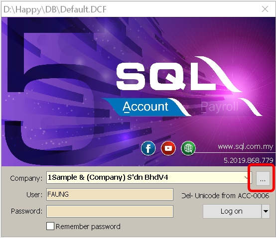
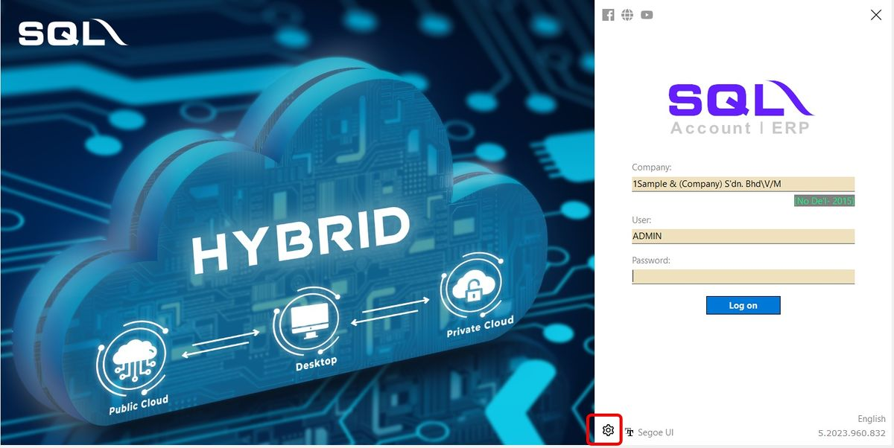
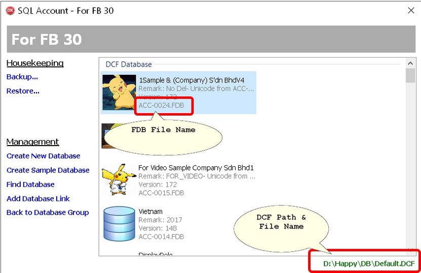

## Having Problem with Opening CHM Help files?

1. Right click the chm file & select Properties
2. At General tab Click Unblock button.
3. Click Apply | Ok.

### Still can't open CHM file?

1. Login SQL Accounting
2. Click Tools | Options | General
3. Click Register & follow wizard
4. Exit SQL Accounting
5. Login SQL Accounting
6. Run CHM File

## Why when I compile my program with stated unknown method or unknown identifier?

    - If you compiler had error may try add the **esfw10.dll** file under the SQL Accounting\bin folder

## How to make sure I login to correct database?

- Can use the Common.Agent.RO Report Objects to get the Profile info.
- Then use the cdsProfile Dataset
        - CompanyName Field
        - Remark Field
- Refer to [Get Company Profile](/integration/sdk-live/basic-guide#get-company-profile)

## Why after post to SQL Accounting the Description3 (More Description)/Notes field it show like this "M y D e s c r i p t i o n" instead of "My Description"?

        Make sure you use **.AsString** in your code 
        (see example below)

- Description3 Field Script/Code :

```sql

lDtl.FindField('DESCRIPTION3').AsString  := 'Sales Item A More Description'+ #13 + 'I in 2nd line';

```

## Can I Ignore Doc No Field & let SQL Accounting to Auto Assign?

Yes but we **not recommended** as you will **lost track** when user wants to know which Doc No in SQL Acc is posted.
To Set Auto Assign set it as below :

DocNo Field Script/Code :

```sql
lMain.FindField('DocNo').AsString  := '<<New>>';
```

```sql
lDocNo := lMain.FindField('DocNo').AsString; //To Get docno after post
```

## Can I Auto Login & Logout SQL Accounting when doing & after Posting?

- Yes , below is example script
- Only works if no user in that PC is using SQL Accounting (sql accounting should not be running at the time)

### C Sharp 

<details>
    <summary>C Sharp - click to expand </summary>

```csharp
Int32 lBuildNo;
dynamic ComServer;
public void CheckLogin()
{
    lBizType = Type.GetTypeFromProgID("SQLAcc.BizApp");
    ComServer = Activator.CreateInstance(lBizType);

    if (!ComServer.IsLogin)
    {
        try
        {
            ComServer.Login(edUN.Text, edPW.Text, edDCF.Text, edDB.Text);
            ComServer.Minimize();
        }
        catch(Exception ex)
        {
            MessageBox.Show(ex.Message, "Error", MessageBoxButtons.OK, MessageBoxIcon.Exclamation);
            FreeBiz(ComServer);
        }
    }
    if (ComServer.IsLogin)
    {
        lBuildNo = ComServer.BuildNo;
    }
}

public void FreeBiz(object AbizObj)
{
    System.Runtime.InteropServices.Marshal.ReleaseComObject(AbizObj);
}

private void btnExport_Click(object sender, EventArgs e)
{
    dynamic BizObject, lMain, lDocKey;

    CheckLogin();
    //'Step 2: Find and Create the Biz Objects
    BizObject = ComServer.BizObjects.Find("Agent");

    //Step 3: Set Dataset
    lMain = BizObject.DataSets.Find("MainDataSet");    //lMain contains master data

    //Step 4: Search
    lDocKey = BizObject.FindKeyByRef("CODE", edCode.Text);
    try
    {
        try
        {
            //Step 5 : Insert or Update
            if (Convert.IsDBNull(lDocKey))
            {
                BizObject.New();
                lMain.FindField("CODE").value = edCode.Text;
                lMain.FindField("DESCRIPTION").value = edDesc.Text;
            }
            else
            {//Edit Data if found
                BizObject.Params.Find("CODE").Value = lDocKey;
                BizObject.Open();
                BizObject.Edit();
                lMain.FindField("DESCRIPTION").value = edDesc.Text;
            }
            //Step 6: Save & Close
            BizObject.Save();
            MessageBox.Show("Done", "Status", MessageBoxButtons.OK, MessageBoxIcon.Information);
        }
        catch (Exception ex)
        {
            MessageBox.Show(ex.Message, "Error", MessageBoxButtons.OK, MessageBoxIcon.Exclamation);
        }
    }
    finally
    {
        BizObject.Close();

        //Step 7 : Logout after done
        FreeBiz(BizObject);
        ComServer.Logout();
        FreeBiz(ComServer);
    }
}
```

</details>

### Delphi

<details>
    <summary>Delphi - click to expand </summary>

```vb
....
  public
    { Public declarations }
    lBizApp : variant;
  end;
....

procedure TForm1.CheckLogin;
begin
  lBizApp := null;
  lBizApp := CreateOleObject('SQLAcc.BizApp');

  if not lBizApp.IsLogin then begin
    lBizApp.Login(edUN.Text, edPW.Text, edDCF.Text, edDB.Text); //Login with preset setting
    lBizApp.Minimize; //Mininise the SQLAccounting
  end;
end;

procedure TForm1.Button2Click(Sender: TObject);
var BizObject, lMain : Variant;
begin
  try
    //Begin Loop your data
    try
      CheckLogin;
      BizObject := lBizApp.BizObjects.Find('Agent');
      lMain     := BizObject.DataSets.Find('MainDataSet');
      BizObject.New;
      lMain.FindField('CODE').AsString := 'HALIM';
      lMain.FindField('Description').AsString := 'HALIM 123';	
      BizObject.save;
    except
      on E: Exception do
        MmLog.Lines.Append(E.Message);
    end;
    //
  finally
    BizObject.close;
    BizObject := null;
    lBizApp.Logout;
    lBizApp := null;
  end;
end;
```

</details>

### VB Script

<details>
    <summary>VB Script - click to expand </summary>

```vb
'Copy below script & paste to notepad & name it as eg Agent.vbs
Call PostData

Function CreateSQLAccServer
  Set CreateSQLAccServer = CreateObject("SQLAcc.BizApp")
End Function

Function PostData
Dim ComServer, BizObject

  'Step 1: Create Com Server object
  Set ComServer = CreateSQLAccServer 'Create Com Server

  Set WScr = CreateObject("WScript.Shell")
  WScript.Sleep 1000 '//Wait 1 second for system loading before proceed

  'Step 2: Force Logout to make sure login correct database
  If ComServer.IsLogin Then 'if user hasn't logon to SQL application
    ComServer.Logout
  END IF
  'Step 3: Login 
  ComServer.Login "ADMIN", "ADMIN", "C:\estream\SQLAccounting\Share\Default.DCF", "ACC-0015.FDB" 

  'Step 4: Find and Create the Biz Objects
  Set BizObject = ComServer.BizObjects.Find("Agent") 

  'Step 5: Set Dataset
  Set lMain = BizObject.DataSets.Find("MainDataSet")    'lMainDataSet contains master data


  'Step 6 : Posting
    BizObject.New
    lMain.FindField("CODE").AsString          = "_Test_"
    lMain.FindField("Description").AsString   = "Testing 123"

  'Step 7: Save Document
    BizObject.Save
    BizObject.Close

  'Step 8: Logout
    ComServer.Logout
  MsgBox "Done"
End Function
```

</details>

## Why when Post System Prompt Operation aborted Error ?

        - This happen when the Login User ID don't had the to **Override Sales Min/Max Price** &
        - Use **Last Price XXX** (In Tools | Options | Unit Price) &
        1 of record is below Min Price.

### Solution

        - Can try change the Posting Seq like below (UOM then Qty)

### Sequence Field Script/Code :

```vb
lDetail.Append();
   lDetail.FindField("Seq").value = 3;
   lDetail.FindField("ItemCode").AsString = "ANT";
   lDetail.FindField("Description").AsString = "Sales Item B";
   //lDetail.FindField("Account").AsString = "500-000"; To override the Sales Account Code
   lDetail.FindField("UOM").AsString = "UNIT";
   lDetail.FindField("Qty").AsFloat = 2;
   //lDetail.FindField("DISC").AsString = "5%+3"; //Optional(eg 5% plus 3 Discount)
   lDetail.FindField("Tax").AsString = "SV";
   lDetail.FindField("TaxRate").AsString = "6%";
   lDetail.FindField("TaxInclusive").value = False;
   lDetail.FindField("UnitPrice").AsFloat = 100;
   lDetail.FindField("Amount").AsFloat = 200;
   lDetail.FindField("TaxAmt").AsFloat = 12;
   lDetail.Post();
```

## How do my system know there is a changes or update in SQLAccounting?

### Data Entry

In all Document it had a field call UPDATECOUNT.
Default is null & each changes will +1.
So if you see 2 meaning it had being update 2 times

Only available in

        - Version 1001.858 & above

In Each table it had a field call LASTMODIFIED.
The value is **Epoch Time** or **Unix Time**

### Master Data

    Only available in

    Version 842.765 & above
    AP_SUPPLIER (Maintain Supplier)
    AR_CUSTOMER (Maintain Customer)
    ST_GROUP (Maintain Stock Group)
    ST_ITEM (Maintain Stock Item)
    ST_ITEM_TPL (Maintain Item Template)
    ST_PRICETAG (Maintain Price Tag)
    TAX (Maintain Tax)
    In Each table it had a field call LASTMODIFIED.
    The value is Epoch Time or Unix Time

- You can use below function to get the field

      - VB Script :

```vb
Function GetData
Dim lDataSet, lSQL
  lSQL = "SELECT DOCNO, UPDATECOUNT FROM SL_CS "
  lSQL = lSQL & "WHERE UPDATECOUNT IS NOT NULL " 
  lSQL = lSQL & "ORDER BY DOCNO "
  Set lDataSet = ComServer.DBManager.NewDataSet(lSQL)
  
  lDataSet.First
  While (not lDataSet.eof)
    MsgBox "DocNo : " & lDataSet.FindField("DocNo").AsString
    MsgBox "UpdateCount : " & lDataSet.FindField("UPDATECOUNT").AsString
    lDataSet.Next
  Wend
End Function
```

    - Delphi :

```csharp
procedure TfmMain.dxbb_GetFieldClick(Sender: TObject);
var BizApp : Variant;
    lDataSet : TClientDataSet;
    ASQL : String;
begin
  BizApp := CreateOleObject('SQLAcc.BizApp');
  lDataSet := TClientDataSet.Create(Self);
  try
     ASQL := 'SELECT DOCNO, UPDATECOUNT FROM SL_CS ' +
             'WHERE UPDATECOUNT IS NOT NULL ' +
             'ORDER BY DOCNO ';
     lDataSet.Data := BizApp.DBManager.Execute(ASQL);
     lDataset.SaveToFile('C:\Temp\_List.xml', dfXML); //Export To XML file
  finally
    lDataSet.Free;
  end;
end;
```

## Can I control my Stock when I link with other Application?

Yes. We suggest to use Stock Transfer to (eg Location call MOBILE) transfer stock as Reserve to avoid stock over deduct in SQL Accounting
When other Application post to SQL Accounting they just need set the Location to the Reserve Location (eg MOBILE)

Below is example posting with location :

Post Location Field Script/Code 

```c
 lDtl.FindField('UOM').AsString       := 'CTN';
 lDtl.FindField('QTY').AsFloat        := 6;
 lDtl.FindField('Location').AsString  := 'MOBILE';
```

## Where to Check the SQL Accounting DCF Path, FileName & FDB FileName?

In Login Screen Click 3 Dot Button then you can see the information
For SQL Accounting Version 5.2023.957.831 and below



For SQL Accounting Version 5.2023.958.832 and above





## How to check what is the value for Advance Credit Control in Maintain Customer ?

        - You can use ComServer.DBManager.NewDataSet(lSQL) function to Query the information
        lSQL = SELECT * FROM AR_CUSTOMERCRCTRL
        You may refer to ControlType column

| **ControlType** | **Exceed Credit Limit** | **Exceed OverDue Limit** |
|------------------|--------------------------|---------------------------|
| 0 | UnBlock | UnBlock |
| 1 | UnBlock | Block |
| 2 | UnBlock | Override |
| 3 | Block | UnBlock |
| 4 | Block | Block |
| 5 | Block | Override |
| 6 | Override | UnBlock |
| 7 | Override | Block |
| 8 | Override | Override |
| 9 | Suspended | — |

## How to get Error/Exception Message Return from SQL Accounting?

### In C Sharp

```csharp

try
{
   BizObject.New();
....
   BizObject.Save();
}
catch (Exception ex)
{
    MessageBox.Show(ex.Message, "Error", MessageBoxButtons.OK, MessageBoxIcon.Exclamation);
}
```

### In Python

```python
try:
       BizObject.Save()
   except Exception as e:
       print("Oops!", e)
```

### In VB.Net

```vb
Try
  BizObject.[New]
...
  BizObject.Save
Catch ex As Exception
  MsgBox(ex.Message, MsgBoxStyle.Exclamation)
End Try
```

### In Delphi

```sql
try
  lBizObj.New;
....
  lBizObj.Save;
except
  on E: Exception do
    Memo1.Lines.Text := E.Message;
end;
```

## Why sometimes when Post to SQL Accounting will prompt Catastrophic failure Error?

### Possible Problem 1

- Make sure you code don't cross over Call action during posting
- Eg Posing SL_SO Header partly then suddenly call other object example Check Customer Code Validity
Summary action (Correct Steps)

    1. Do Verify 1st (eg Check Customer Code Validity & etc)
    2. Post Transactions

### Possible Problem 2

- Keep Login & Logout till windows not enough time to response
- Summary action (Correct Steps)

    1. Pull Data from Your application/web
    2. Login SQL Accounting 1 time (Auto Login)
    3. Do all your requirement actions (eg. verify, query & posting)

        ```sql
        eg Posting Cash Sales & Customer Payment
        begin looping
        BizObject = ComServer.BizObjects.Find("SL_CS")
        ....
        BizObject.Save
        BizObject.Close
        FreeBiz(BizObject)

        BizObject = ComServer.BizObjects.Find("AR_PM")
        ....
        BizObject.Save
        BizObject.Close
        FreeBiz(BizObject)

        Next Record
        End looping
        ```

    4. Logout SQL Accounting 1 time (Auto Logout)
    5. Push Data to Your application/web (if any)

### Possible Problem 3

Company Profile Logo format had problem.
Solution

1. Click File | Company Profile
2. Export out the Logo by right Click the Company Logo
3. Open the Exported Logo with Photo Editor
4. Just Click File | Save again as jpg.
5. Load Back the Save Logo by right Click the Company Logo
6. Click Save

## How to Get the GL Account List for Sales & Purchase?

    You can use the function ComServer.DBManager.NewDataSet(lSQL) with the following SQL

```sql
SELECT  Code, Description, Description2 FROM GL_ACC A
WHERE (A.Parent<>-1
AND NOT (EXISTS (SELECT Parent FROM GL_ACC B
                 WHERE A.DocKey=B.Parent))
AND (A.SpecialAccType IS NULL OR A.SpecialAccType IN ('', 'AD')))
ORDER BY Code
```

## Can I setup a testing/Staging environment for SQL Accounting?

Yes can, you can self setup or we can help you to setup.
There are 4 types of Testing/Staging

1. Install the Testing SQL Accounting version & Testing Database in the developer PC

2. Install the Live SQL Accounting version & User Backup Database in the developer PC

    - Require User Permission for Backup

3. Setup at User PC/Server & using User Backup Database

    - Require User Permission for Backup & PC/Server setup

4. Setup at User PC/Server & using Testing Database

    - Require User Permission for PC/Server setup

## How to Loop & post SQL Accounting?

Below summary how to loop

1. Call ComServer
2. Check Login
3. Call BizObject (eg SL_CS)
4. Begin Loop you data
5. Call Close BizObject (eg BizObject.Close)
6. Continue Call other BizObject (eg AR_PM)
7. Repeat Steps 4 & 5
8. Call Logout
9. Free ComServer

## How to post Description3 with Unicode?

### C Sharp

```csharp
private static string FormatAsRTF(string DirtyText)
{
    System.Windows.Forms.RichTextBox rtf = new System.Windows.Forms.RichTextBox();
    rtf.Text = DirtyText;
    return rtf.Rtf;
}

....
 lDtl.FindField("DESCRIPTION3").AsString  = FormatAsRTF("ANTENNA ???");
...
```

### VB.Net

```vb
Private Shared Function FormatAsRTF(ByVal DirtyText As String) As String
    Dim rtf As System.Windows.Forms.RichTextBox = New System.Windows.Forms.RichTextBox()
    rtf.Text = DirtyText
    Return rtf.Rtf
End Function

....
 lDtl.FindField("DESCRIPTION3").AsString  = FormatAsRTF("ANTENNA ???")
...
```

### Delphi

```sql
function TfmMain.PlainTxtToRTF(const AValue:String):String;
var R:TRichEdit;
    M : TStringStream;
begin
  R := TRichEdit.CreateParented(HWND_MESSAGE);
  M := TStringStream.Create('');
  try
    R.WordWrap := False;
    R.Lines.Add(AValue);
    R.Lines.SaveToStream(M);
    Result := M.DataString;
  finally
    R.Free;
    M.Free;
  end;
end;

....
 lDtl.FindField('DESCRIPTION3').AsString  := PlainTxtToRTF('ANTENNA ???');
...
```
or Can use our built in Utility function (only available from **5.2022.941.822** & above)

### PHP

```php
<!DOCTYPE html>
<html>
<body>

<h1>SQL Acc SDK in PHP page</h1>

<?php
echo "Updated 14 Sep 2022<br>";
#This action to show & post Description3 with unicode

$ComServer = null;

function CheckLogin()
{
    global $ComServer;
    $ComServer = new COM("SQLAcc.BizApp", null, CP_UTF8) or die("Could not initialise SQLAcc.BizApp object.");
    $status = $ComServer->IsLogin();

    if ($status == true)
    {
        #$ComServer->Logout();
    }
    $ComServer->Login("ADMIN", "ADMIN", #UserName, Password
                      "C:\eStream\SQLAccounting\Share\Default.DCF",  #DCF file
                      "ACC-0082.FDB"); #Database Name

}

function GetData(){
    global $ComServer;

    $lSQL = "SELECT Description3 FROM ST_ITEM 
     WHERE Code='ANT' ";

    $lDataSet = $ComServer->DBManager->NewDataSet($lSQL);

    if ($lDataSet->RecordCount > 0) {
$lDataSet->First();

$rtf = $lDataSet->FindField('Description3')->AsString();

        echo $rtf;
echo "<br>== <br>";
echo "<br>Result after RTF: <br>";
$txt = $ComServer->Utility->RichTextToPlainText($rtf);
echo "<TEXTAREA rows=10 cols=80 id='edResult1' >".$txt. "</TEXTAREA>";
echo "<br>== <br>";
echo "??? ??";
}else {
    echo "Record Not Found";
    }
}

function PostData(){
global $ComServer;

$BizObject = $ComServer->BizObjects->Find("ST_AJ");
    $lMain = $BizObject->DataSets->Find("MainDataSet"); 
    $lDetail = $BizObject->DataSets->Find("cdsDocDetail"); 

    $BizObject->New();
    $lMain->FindField("DocKey")->value = -1;
    $lMain->FindField("DocNo")->AsString = "<<New>>";
    $lMain->FindField("DocDate")->value = "04/20/2020"; #MM/DD/YYYY
    $lMain->FindField("PostDate")->value = "04/20/2020"; #MM/DD/YYYY
    $lMain->FindField("Description")->AsString = "Stock Adjustment";	
    #Insert Data - Detail - Increase Stock Qty
    $lDetail->Append();
    $lDetail->FindField("DtlKey")->value = -1;
    $lDetail->FindField("DocKey")->value = -1;
    $lDetail->FindField("Seq")->value = 1;
    $lDetail->FindField("ItemCode")->AsString = "ANT";
    $lDetail->FindField("Description")->AsString = "Sales Item B";
    $lDetail->FindField("Qty")->AsFloat = 2;
    $lDetail->FindField("UOM")->AsString = "UNIT";
    $lDetail->Post();
    #Insert Data - Detail - Reduce Stock Qty
    $lDetail->Append();
    $lDetail->FindField("DtlKey")->value = -1;
    $lDetail->FindField("DocKey")->value = -1;
    $lDetail->FindField("Seq")->value = 2;
    $lDetail->FindField("ItemCode")->AsString = "ANT";
    $lDetail->FindField("Description")->AsString = "NOKIA CHARGER  ???";
$lDetail->FindField("Description3")->AsString = $ComServer->Utility->PlainTextToRichText("NOKIA CHARGER ??? ??");
    $lDetail->FindField("Qty")->AsFloat = -5;
    $lDetail->FindField("UOM")->AsString = "UNIT";
    $lDetail->Post();

    $BizObject->Save();
    $BizObject->Close();

try{
        $BizObject->Save();
        $BizObject->Close();
}catch (Exception $e) {
    echo 'Caught exception: ',  $e->getMessage(), "\n";
    }
}

if (isset($_POST['BtnData']))
{
    try
    {
        CheckLogin();
        GetData();
echo "<br>";
        echo date("d M Y h:i:s A")." - Done";
PostData();
echo "<br>";
        echo date("d M Y h:i:s A")." - Done ST_AJ";
    }
    finally
    {
        $ComServer->Logout();
        #free the object
        $ComServer = null;
    }
}

?>
    <form method="post">
        <input type="submit" name="BtnData"
                value="Get RTF n Post RTF"/>
    </form>
</body>
</html>
```

## Why the TAXEXEMPTIONREASON field become empty even I have pass the value in?

    Make sure the TAXRATE field is set to empty

```sql
....
  lDtl.FindField('Tax').AsString  := 'SVE';
  lDtl.FindField('TaxRate').AsString  := '';
  lDtl.FindField('TaxExemptionReason').AsString  := 'my tax exemption reason';
...
```

Why is Posting Amount not correct when SQL Acc Default Tax for Tax Inclusive is True ?

        - This Only happen if 3rd party also is Tax Inclusive is True
        - Can try below posting seq

```sql
....
    lDetail.FindField("Qty").AsFloat = 1
    lDetail.FindField("UOM").AsString = "UNIT"
    lDetail.FindField("Tax").AsString = "ST"
    lDetail.FindField("TaxRate").AsString = "10%"
    lDetail.FindField("TaxInclusive").value = False
    lDetail.FindField("UnitPrice").AsFloat = 264
    lDetail.FindField("Amount").AsFloat = 240
    lDetail.FindField("TaxAmt").AsFloat = 24

    lDetail.DisableControls()
    lDetail.FindField("TaxInclusive").value = True
    lDetail.EnableControls()
...
```
