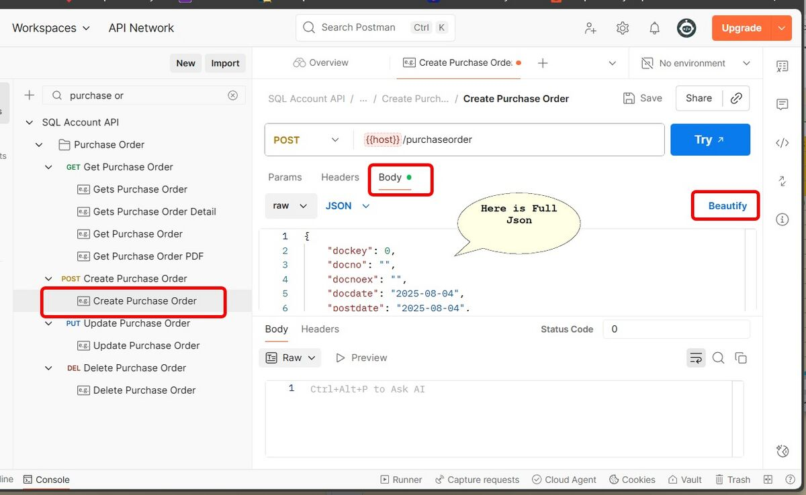

## Why when I try to update (PUT) for Data Entry (eg Sales Invoice) it prompt error "Record has been changed by other users."

- Make sure at you update the field **updatecount** by +1 after you get the original **updatecount** from sqlacc
- Below example original is 2

```vb
"updatecount": 3,
   "sdsdocdetail": [
      {
         "dtlkey": 99,
```

## How to update(PUT) detail information for Data Entry (eg Sales Invoice)?

- Make sure at sdsdocdetail

- For Update => Insert field dtlkey with the original dtlkey from sqlacc
- For Insert New record => Remove the dtlkey field or Set it as -1

```vb
   "sdsdocdetail": [
      {
         "dtlkey": 99,
         "seq": 1,
         "itemcode": "ISCT",
         "description": "Industrial Style Round Coffee Table - Edited",

      },
      {
         "seq": 2,
         "itemcode": "MISC",
         "description": "MISC - New Insert",

      },
      {
         "dtlkey": -1,
         "seq": 3,
         "itemcode": "RM-04",
         "description": "Arm Rest - New Insert",

```

:::warning
If provided dtlkey is invalid system will treat is as Insert New Record
:::

## What is the max limit for GET?

- Currently max is 50 records per request

## How many ways for GET Method available?

- Now it supported 3 ways on GET method.

| **Example GET Method** | **Description** |
|--------------------------|----------------|
| `/purchaseinvoice/?docno=PI-00001` | Return list (master data only). Can filter by all master table fields. |
| `/purchaseinvoice/*?docno=PI-00001&code=400-A0001` | Return single record (master + detail data). Can filter by indexed table fields. Field available: `code`, `docdate`, `docno`, `postdate`, `eiv_utc`. |
| `/purchaseinvoice/{dockey}` | Return single record (master + detail data), by path parameter `dockey` only. |

## How to get full JSON structure for the specific document?

- Below is example to get Purchase Order JSON file


