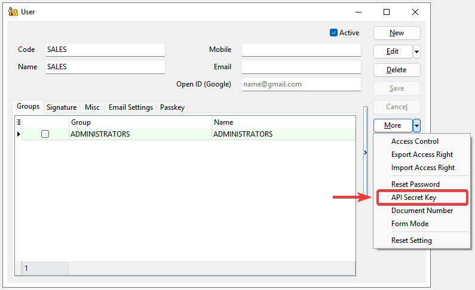
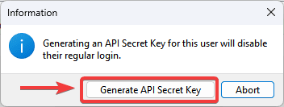
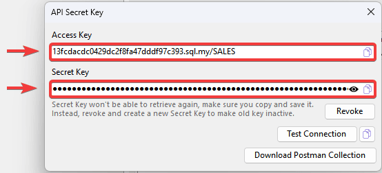
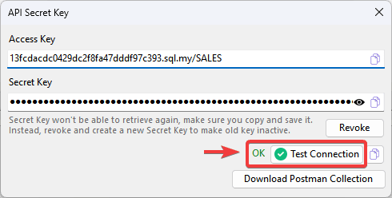
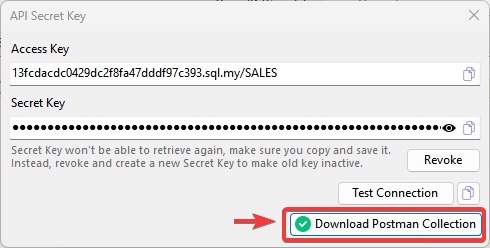
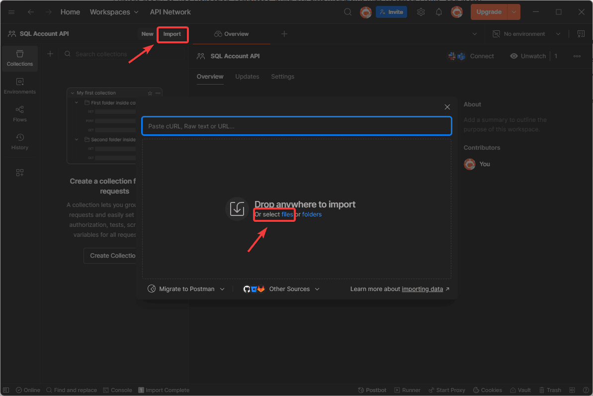
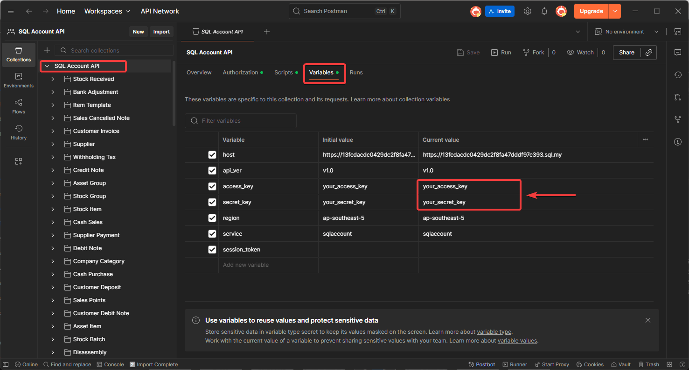
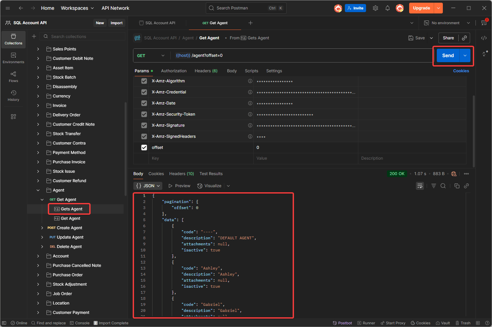

This guide will walk through generating `API Secret Key`, which allow the user to access SQL Account API Services.

## Step to Generate API Secret Key

1. **Navigate to User Detail:**

    Go to `Tools` > `Maintain User...` > `Detail`

2. **Select API Secret Key Option:**

    **Click** on `More` > `API Secret Key`

    

3. **Generate Secret Key:**

    **Click** on `Generate API Secret Key`

    

    :::warning[Important Note]
    Once an `API Secret Key` is generated for a user, that user will no longer be able to login on SQL Account directly. The user only be able to access `SQL Account API Service` with the secret key generated.
    :::

4. **Copy and Save Secret Key**

    The API `Access Key` and `Secret Key` will displayed. Make sure to copy and save it immediately in a secure location.

    

    :::info[Tip]
    **API Secret Key** can only be retrieved at the time of generated. If you lose it, you can `revoke` and `generate` a new API Secret Key.
    :::

## Test AWSv4 Signature with API Secret Key

`SQL Account API Service` uses [AWS Signature Version 4](https://docs.aws.amazon.com/AmazonS3/latest/API/sigv4-auth-using-authorization-header.html) for authenticating requests. You can **click** on `Test Connection` to test on the request with AWSv4 authorization header.



:::info[Hints]
For a sample cURL request with AWSv4 authorization header, **click** on `Copy`.
:::

## Download and Import SQL Account API Postman Collection

1. **Download Postman Collection:**

    **Click** on `Download Postman Collection` to save `postman_collection.json` file.

    

2. **Import the API specification into your Postman application:**

    **Click** on `Import`, then select `postman_collection.json` file you downloaded to import.

    

3. **Update Access Key and Secret Key:**

    After postman collection imported, **navigate** to `Variables` tab. Then, **replace** the `your_access_key` and `your_secret Key` with the Access Key and Secret Key generated earlier.

    

4. **Test on API Endpoint**

    **Select** on `Agent` endpoint. Then, **click** on `Send` to try retrieve agent data from `SQL Account API Service` and the `Agent` json data list will show on response body.

     

## FAQ

### When I try to update(PUT) for Data Entry (eg Sales Invoice) it prompt error "Record has been changed by other users."

- Make sure at you update the field updatecount by +1 after you get the original updatecount from sqlacc
- Below example original is 2

```pascal
.....
   "updatecount": 3,
   "sdsdocdetail": [
      {
         "dtlkey": 99,
.....
```

### How to update(PUT) detail information for Data Entry (eg Sales Invoice)?

- Make sure at sdsdocdetail
    For Update => Insert field dtlkey with the original dtlkey from sqlacc
    For Insert New record => Remove the dtlkey field or Set it as -1
- Below example is to Update Detail Row 1 & Insert 2 new row

```pascal
.....
   "sdsdocdetail": [
      {
         "dtlkey": 99,
         "seq": 1,
         "itemcode": "ISCT",
         "description": "Industrial Style Round Coffee Table - Edited",
.....
      },
      {
         "seq": 2,
         "itemcode": "MISC",
         "description": "MISC - New Insert",
.....
      },
      {
         "dtlkey": -1,
         "seq": 3,
         "itemcode": "RM-04",
         "description": "Arm Rest - New Insert",
....
```

:::caution
If provided dtlkey is invalid system will treat is as Insert New Record
:::

### What is the max limit for GET?

- Currently max is 50 records per request

### How many ways for GET Method available?

- Now it supported 3 ways on GET method.

| **Example Get Method** | **Description** |
|--------------------------|-----------------|
| `/purchaseinvoice/?docno=PI-00001` | Return list (master data only), can filter by all master table fields. |
| `/purchaseinvoice/*?docno=PI-00001&code=400-A0001` | Return single record (master + detail data), can filter by indexed table fields.<br/>**Fields available:** `code`, `docdate`, `docno`, `postdate`, `eiv_utc` |
| `/purchaseinvoice/{dockey}` | Return single record (master + detail data), by path parameter `dockey` only. |
