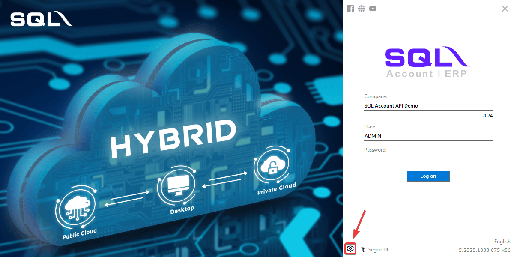
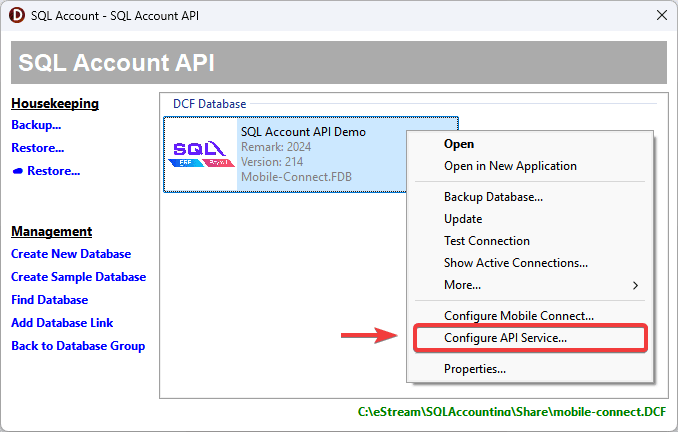
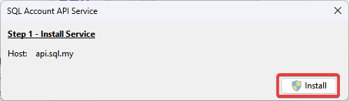
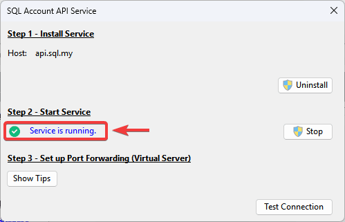
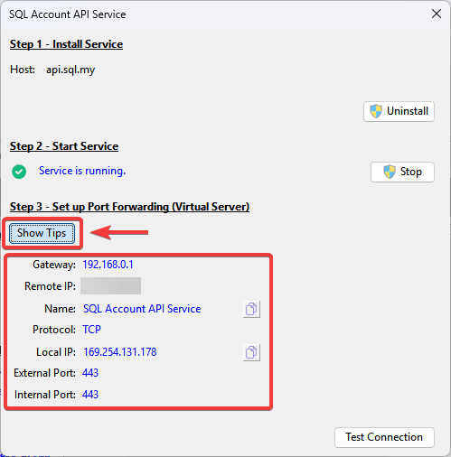
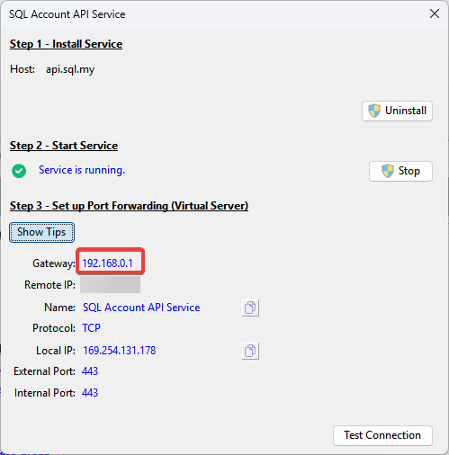
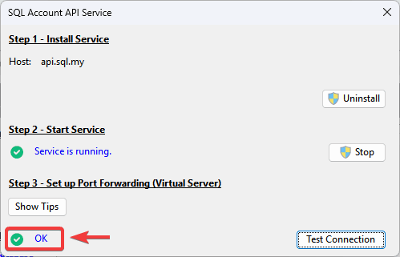

## Prerequisites

- Microsoft Windows 11 and above (recommended with 64 bits windows)
- CPU: Intel i5, i7 and above
- RAM: at least 8 GB of RAM (Recommended 12 GB and above)
- SQL Account: version 5.2025.1038.875 and above
- Firebird: version 3.0.9 and above
- Fix server IP address (either DHCP Reservation or Static)
- [Public IP Address](#public-ip-address)
- [Port Forwarding](#step-3---port-forwarding)

### Public IP Address

Make sure to have a **dedicated public IP Address**.

:::info[Check Public IP Address]
You can using [SQL Connect Detector](https://connect.sql.com.my/document/private-cloud/requirements/sql-connect-detector#download) to check whether public IP is enabled by your ISP.

Make sure the last requirement **Port Forward?** is in <text style={{color: "#43a047"}}>**Green**</text>
:::

:::tip[Hints]
If the result is <text style={{color:"#f44336"}}>**Red**</text>, kindly call your internet service provider and request for dedicated Public IP.

If the provider requests a reason, you can explain that you intend to host a server and therefore need to set up port forwarding.
:::

## Setup

### Step 1 - Install SQL API Service

1. On `Logon Screen` > **Click** `⚙️`

   

2. **Right-Click** on company database > **Select** `Configure API Service...`

   

3. **Click** on `Install` to install API service

   

### Step 2 - Start Service

1. Start the service. Once successful, `Service is running` status will show on screen.

   

### Step 3 - Port Forwarding

1. In SQL Account, you can click on the `Show Tips` to find all the information required for port forward configuration.

   

2. First thing first, you will need to access to your router management interface on web browser.

   From SQL Account, you can click on `Show Tips` > `Gateway IP Address`, to access login page of the router. Login with an **administrator credential**.

   :::warning
   If you are using a firewall or serving the router's web administration interface via a different IP address, this might not work.
   :::

   

3. After login, navigate to the port forward config. Different router model have different naming, try to find the section with `Port Forwarding`, `Virtual Service` or similar wording in the router's setting.

4. Create a new port forwarding rule. (All information can get from [Port Forwarding Information](#step-3---port-forwarding))

   | Field                 | Value                       | Description                               |
   | --------------------- | --------------------------- | ----------------------------------------- |
   | Service Name          | **SQL Account API Service** | Descriptive name of the service           |
   | Protocol              | **TCP**                     | Service protocol                          |
   | External/Public Port  | **443**                     | Port number to be use for external access |
   | Internal/Private Port | **443**                     | Port number of the internal service       |
   | Internal IP Address   | **E.g. 192.168.0.2**        | IP Address of the server                  |

5. Fill in and save the rule

6. Lastly, back to SQL Account, verify the service status by clicking on `Test Connection` to test `SQL Account API Service` status. When `✅ OK` status is shown, it means the service is setup successfully.

   

### Examples of Port Forward

Can refer to [Sample of port forward setup](../sql-mobile-connect/on-premise-setup#examples-of-port-forward) on some common router
