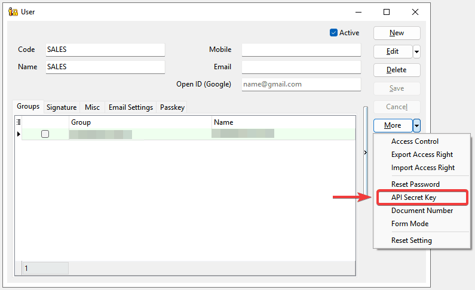

## Generate API Secret Key

> API secret key allow the user/application to access SQL Account API Service in a secured channel.

1. In SQL Account, go to `Tools` > `Maintain User...` > `Detail`

2. In the window, click on `More` > `API Secret Key`

    

3. Click on `Generate API Secret Key`

    :::warning[Important Note]
    Once an `API Secret Key` is generated for a user, that user will no longer be able to login on SQL Account directly. The user will be used solely for `SQL Account API Service`. We recommend to create a new user for the API usage.
    :::

    

4. New `Access key` and `Secret Key` will be generated and shown in the screen. Make sure to copy and save them immediately in a secure location.

    :::info[Tip]
    For security purpose, **API Secret Key** can only be retrieved at the time of generated. If you lose it, you can `revoke` and `generate` a new API Secret Key.
    :::

    

## AWSv4 Signature

In SQL Account API, it utilizes [AWS Signature v4](https://docs.aws.amazon.com/AmazonS3/latest/API/sigv4-auth-using-authorization-header.html) for authenticating requests on the endpoints. To start testing, you can **click** on `Test Connection` to test on the request with AWSv4 authorization header.

:::info[Hints]
For a sample cURL request with AWSv4 authorization header, click on the copy button.
:::

## Postman Collection

In SQL Account, a Postman collection is provided to simplify request testing and accelerate API integration and development.

1. In SQL Account, click on `Download Postman Collection` to save the `postman_collection.json` file.

    

2. In postman application, click on `Import` and select the `postman_collection.json` file downloaded to import.

    

3. Next, navigate to the `Variables` tab. Replace the `your_access_key` and `your_secret_key` with the **Access Key** and **Secret Key** generated earlier.

    

4. With the keys, you are ready to roll. Simply select on the `Agent`, click on the `Send` button to try retrieve agent data from `SQL Account API` and the `Agent` json data list will show on response body.

    
