## Set User View

1. Go to **Tools** > **DIY**, click on **Maintain DIY**

    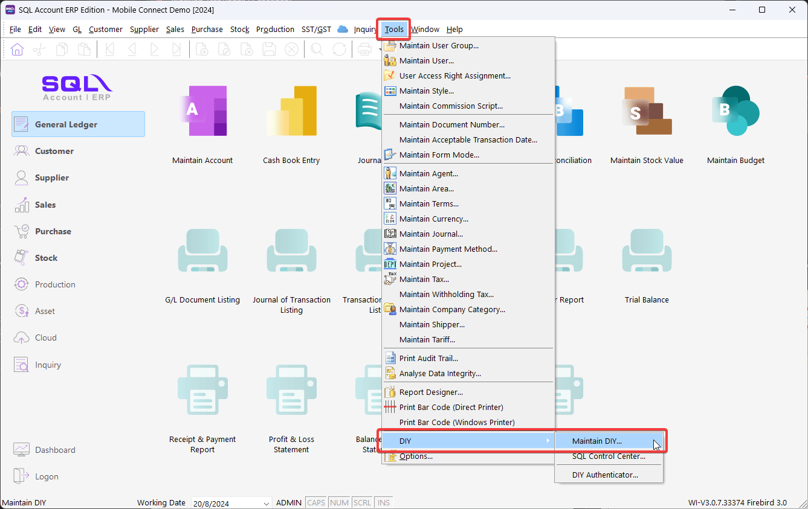

2. Switch to **View Template** tab, then click on **Load From File** to select `View Template` to load

    :::info[Download]
    You can download this **[View Template - View by Agent (Current User)](https://cdn.sql.com.my/wp-content/uploads/2024/08/View-Template-View-by-Agent-Current-User.zip)** and **load** to SQL Account.

    This `View Template` will filter document by `Agent`, where `Agent` is match to current login user `Code`.
    :::

    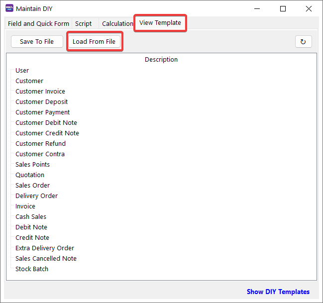

3. After select a `View Template` file to load, you can select **Load All** or **Custom**

    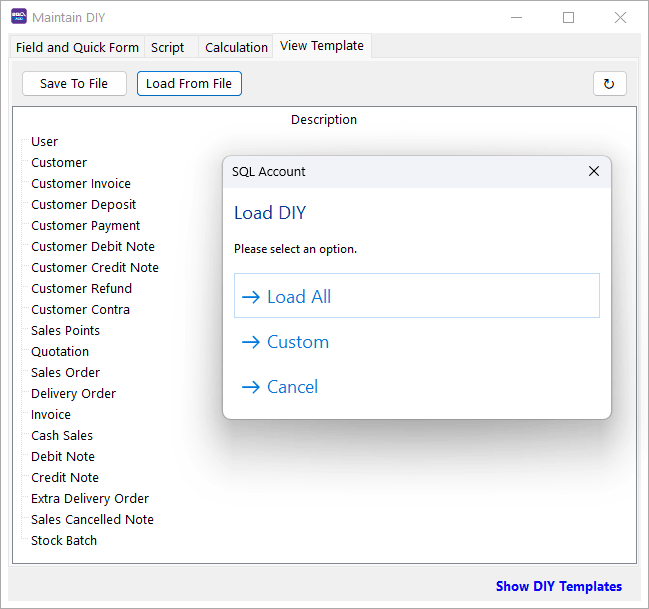

    - **Load All**: All the template will load.
    - **Custom**: Can select all or some template to load.

    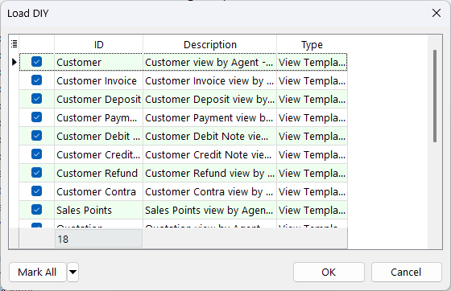

    Once completed, `Loaded` message will prompt and all `View Template` loaded will show.

    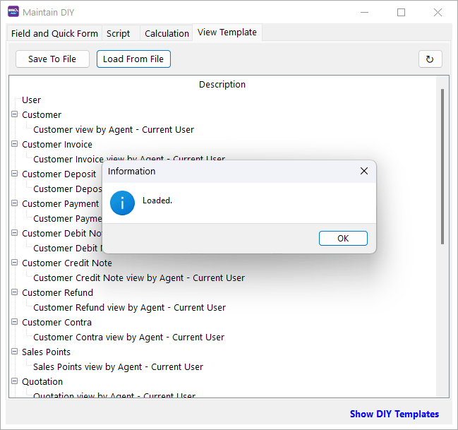

    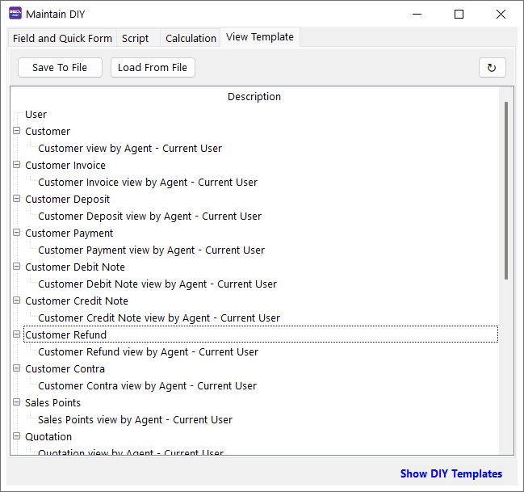

4. **Right-click** on View Template and click on **User View**.

    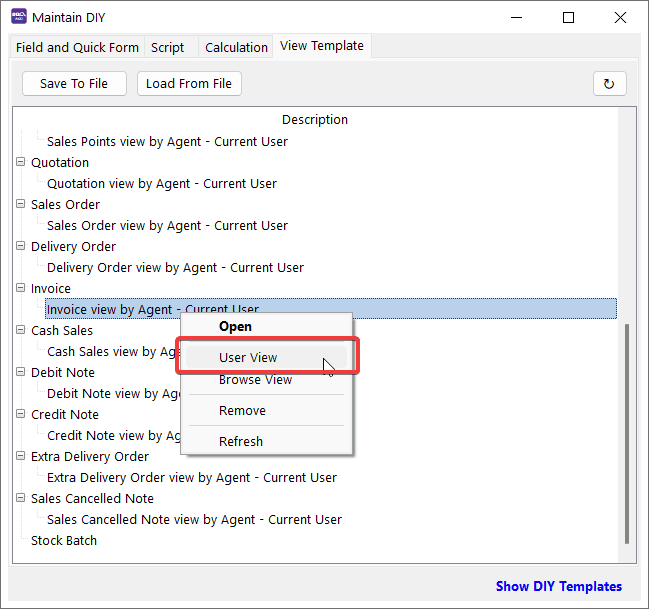

5. A list of `User` will shown, then **tick** on `User View` column for the `User` that want to apply this View Template and click **Save**.

    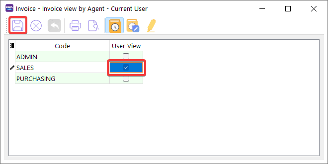

    Based on the scenario above, `Invoice view by Agent - Current User` View Template is applied to `SALES` user. When `SALES` user login to SQL Account, the user only can view those `Invoice` with `Agent` code equal to `SALES`

    - Login by **SALES**

        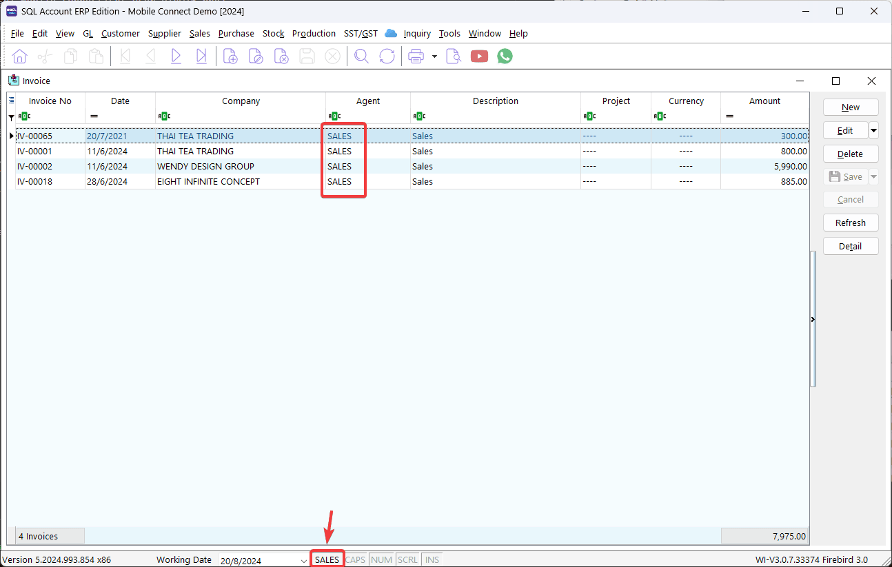

    - Login by **ADMIN**

        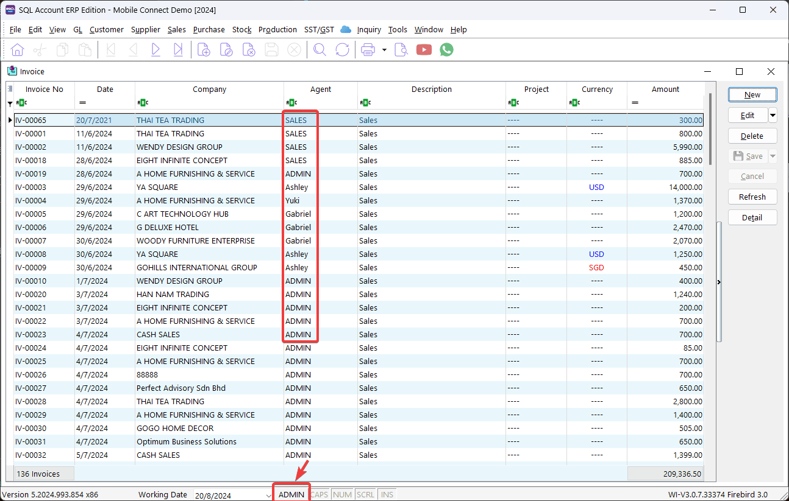

## Set Customer View by Agent

1. For the example below, we will set Customer View Filter by Agent **LIM**

    First, navigate to **Tools** > **DIY** > **Maintain DIY…** and click on **View Template**

    Under **Customer** > Open, select **AGENT** Equals **'LIM'** and save

    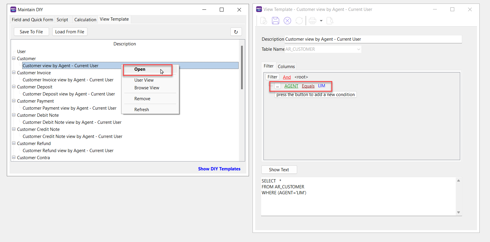

2. Right-click and Select **User View**

    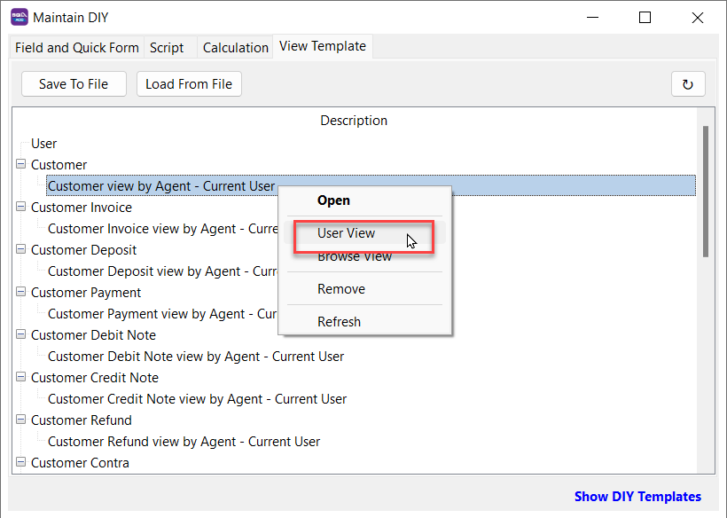

3. Choose **'LIM'** Under User View

    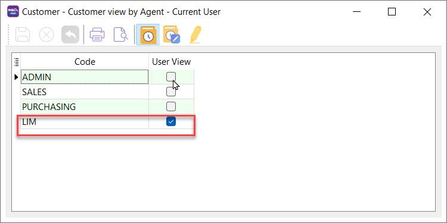

    Under Sales Document Listing, only the sales results for Agent **LIM** are visible.

    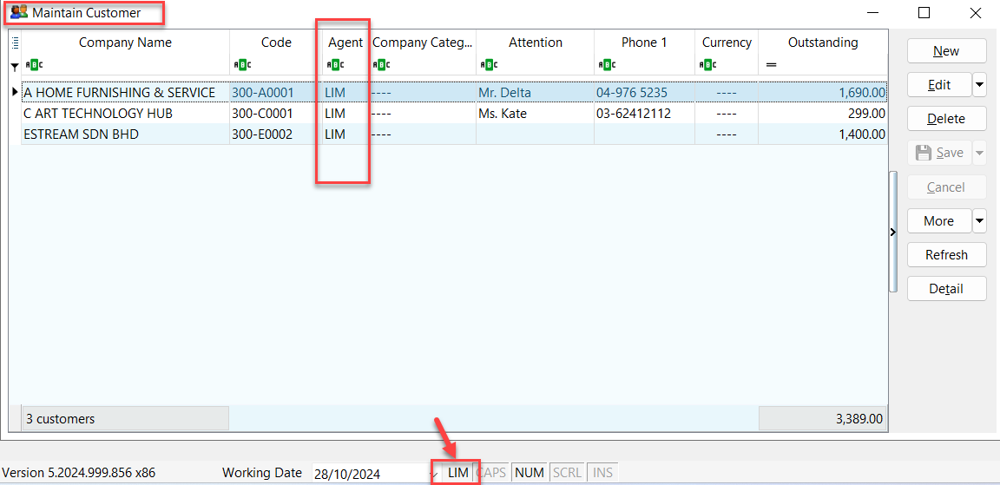

    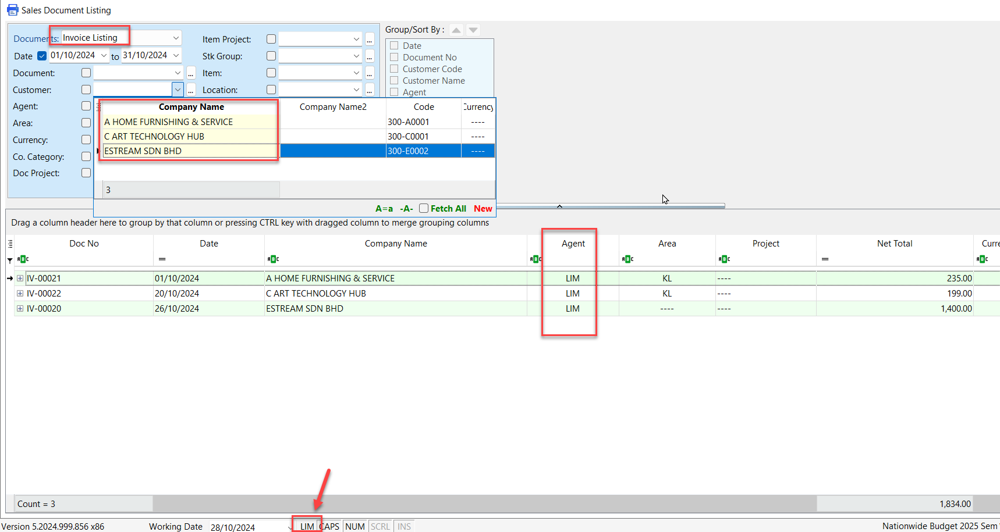
