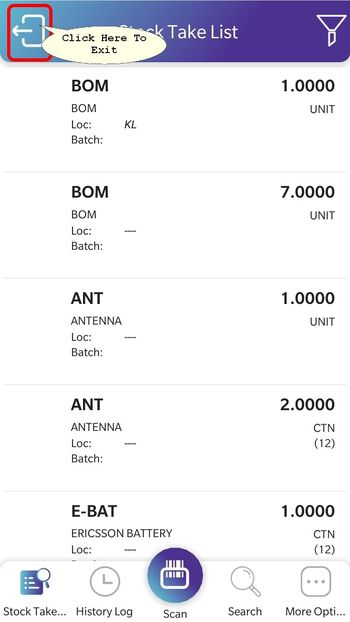

## Introduction

This Function & Mobile App which is use for Stock Take

### Pros

01. Able to Stock Take/Count using Smartphone
02. Sync to SQL Accounting Stock Adjustment wireless
03. Able to Check Price

### Cons

01. Unable to Sync if no WiFi or WiFi signal is very Weak
02. Drain Mobile Phone battery if keep On the

## Requirement

    - Internet Access
    - SQL Accounting Version 781 & above
    - Smart Phone requirement
        :::info
         - 4 GB RAM & above
        - 32 GB Storage (more Item more storage required)
        - Android 6 (Marshmallow) and above
        - Permission - Camera & Storage
        - IOS 11 and above
        :::
    - Barcode for Each Item Code

## Installation

- [stock take app - website](https://www.sql.com.my/sqlstocktake/)
- [stock take - huawei app gallery](https://appgallery.huawei.com/#/app/C102639285)

## Prerequisite

Please make sure the user has a SQL Drive account. For new users, please contact your SQL Service Consultant to register for an account.

Provide the following user details for registration purposes:
    - Customer's Google E-mail
    - Customer's Full Name
    - Company Name

:::warning[INFO]
Only one(1) SQL Drive account is needed for each company.

Users who already have an SQL Drive account that was previously used for SQL Payroll E-Claim may use that account to log in for SQL Account Stock Take.
:::

## Setup

### SQL Accounting

1. Stock | **Stock Take**

   

2. Click **Allow Access** if Windows Prompt the above warning

   

Leave this Screen Open as It will auto sync & update

#### After Done Scanning

1. Click Calculate Stock Take (System will compare with Month End As At Posted)

   

2. Click **Post Stock Adjustments**

| Button                  | Description |
|--------------------------|-------------|
| **New Job**              | • To Start New Stock Take |
| **Load From File**       | • To Load file exported from Stock Take (in Zip)   • For Offline/No WiFi User use only   • Normally is in Zip Format |
| **Export Stock List**    | • To Export the Stock List for Stock Take   • For Offline/No WiFi User use only   • Normally is in Zip Format |
| **Calculate Stock Take** | • To Calculate Stock Take |
| **Export To CSV**        | • To Export Grid Result to CSV |
| **Post Stock Adjustments** | • To Post Grid Result to Stock Adjustment |

### Stoke Take(Mobile App)

   
   

1. When to Sync Data

   

2. After Done Sycn, Click Stock Take

   
   

3. Click Scan to begin Scan

   

4. If the Item Code Had More then 1 UOM it will prompt as Above.
5. Select the UOM & Click Select to Confirm

   

6. Here User can Adjust the Quantity Field (Optional)
7. Click Stop to End Scanning

   

## Stock Take Items List Import

Before following the steps in the subsections below

### SQL Account Configuration

1. Go to "**Tools**" > "**Options...**".

2. On the Options window, click on "**Barcode**" > "**Stock Take**" tab and click on the switch beside "**Stock Take**" label.

3. On the SQL Drive window prompt, click "**Log in**" button.

4. Click on "**Log in with Google**" button.

5. Click on "**Grant access**" button.

6. On "**Account connected**" display, close SQL Drive window.

7. A Stock Take Share will be set, and the switch will change from Off to On

### Stock Take Module Initial Configuration

1. Go to "**Stock**" -> "**Stock Take...**".

2. On the Stock Take window, click "**New Job**" button.

3. On first dialog prompt(Do you want to cancel?), choose "**No**".

4. On second dialog prompt(Do you want to continue?), choose "**Yes**".

### Stock Take App Import

1. On the Stock Take app home page, tap on "Update Items List" button(located to the left of "Update Items List" label).

2. On "Import Options" page, users can change the device name by tapping on the edit box next to the label "Name:", which is optional. The device name will be displayed on SQL Account to help the user identify which device uploaded stock take result and its content

3. Tap on "**Network File Transfer**" button.

    - For devices without a Stock Take share profile set, a QR code scanner will be shown. Proceed to scan the QR shown in SQL Account Stock Take window.

    - For devices with stock take share profile set, the import process will begin immediately.

## Sync Stock Take Result To SQL Account

Sync stock take result from Stock Take app to SQL Account to perform stock adjustment on SQL Account

1. Stock Take App Upload

   1. On the Stock Take mode page, tap on "**More Options**" button.

   2. Tap on "**Export/Upload**" button.

   3. Choose option "**SQL Stock Take Import File**".

   4. Tap on the "**Upload**" button.

2. SQL Account Sync

   1. Go to "**Stock**" -> "**Stock Take...**".

   2. On Stock Take window, click on "**Refresh**" button.

## Reset Connection Profile

User may want to reset Stock Take share profile on Stock Take app as user would want to switch to different Stock Take share profile.

:::note
Stock Take share profile refers to one(1) company only
:::

Resetting company profile will require user to scan QR code on SQL Acoount Stock Take window and update items list. To reset Stock Take share profile:

1. On Stock Take app home page, tap on the "**Update Items List**" button (which is located to the left of "Update items List" label).

2. On "**Import Options**" page, tap on the "**Reset Connection Profile**" button (which is located to the left of "Reset Connection Profile" label).

3. When prompted to proceed with resetting the connection profile, tap on the button "**Yes**" to continue.

4. Once done, tap on the "**Network File Transfer**" to add a new Stock Take share profile and update items list (Follow steps in [stock take app import](#stock-take-app-import), specifically steps 2 and 3).
