The Checkout screen is the primary workspace of the POS system where users perform sales transactions. It provides a complete set of tools for managing the sales process, including item entry, cart management, pricing, discounts, and payment processing.

## Common Checkout Screen Structure

All checkout layouts consist of several common functional areas:

### Header Section

This section provides sales information.

| Component       | Description                                        | Notes                                                                    |
| :-------------- | :------------------------------------------------- | ------------------------------------------------------------------------ |
| **Member**      | Upcoming feature                                   |                                                                          |
| **Bill Number** | Displays the current sales number.                 | Read-only                                                                |
| **Promoter**    | Displays the selected promoter for current sales.  | **Search**: Change assigned promoter, **x**: Reset to default promoter   |
| **Price Tag**   | Displays the selected price tag for current sales. | **Search**: Change assigned price tag, **x**: Reset to default price tag |

### Item Entry and Cart Section

The item entry and cart section is the main area where users manage items in the current transaction.

**Search Field**:

1. Help key - can refer to **Main Menu** -> **Setting** -> **Shortcuts Configuration** -> **Default Shortcuts**
2. Add item into the cart by scanning items using a barcode scanner
3. Add item into the cart by entering the item code
4. Assign promoter by entering the promoter code

**Search Button**:

1. View stock item list
2. Add item from the item list

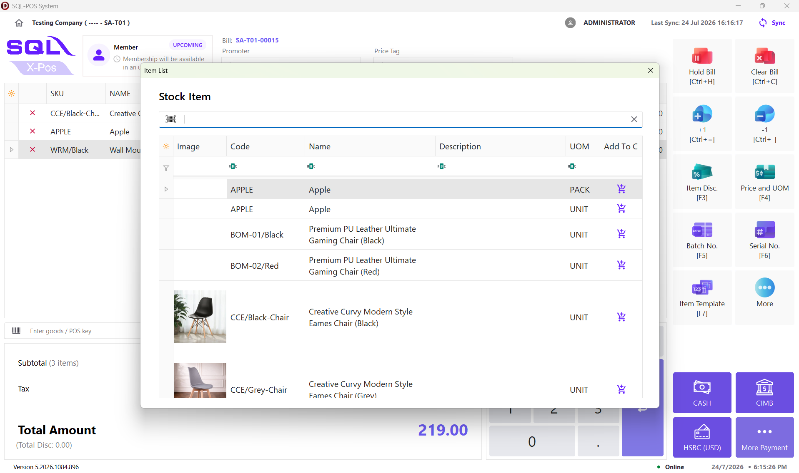

**Cart Table**:

| Field           | Description                          |
| --------------- | ------------------------------------ |
| X               | Remove item from the cart            |
| SKU             | Item code                            |
| Name            | Item description                     |
| UOM             | Unit of measure                      |
| Group           | Item template                        |
| Batch No.       | Batch number for inventory tracking  |
| Serial No.      | Serial number for serialized items   |
| Quantity        | Selling quantity                     |
| Unit Price      | Selling price per unit               |
| Discount        | Applied discount                     |
| Discount Amount | Discount value                       |
| Subtotal        | Item subtotal before tax calculation |
| Net Price       | Final item amount                    |

### Sales Summary Section

The sales summary section displays the current transaction calculation.

| Field        | Description                                |
| ------------ | ------------------------------------------ |
| Subtotal     | Total amount after discount and before tax |
| Tax          | Total tax amount applied                   |
| Total Disc   | Total discount applied to the transaction  |
| Total Amount | Final amount payable by customer           |

### Item Operation Buttons (Right side)

| Button                          | Description                             |
| ------------------------------- | --------------------------------------- |
| +1                              | Increase selected items' quantity by 1  |
| -1                              | Descrease selected items' quantity by 1 |
| [Quantity](#quantity)           | Edit item quantity                      |
| 5%                              | Apply discount of 5%                    |
| [Item Disc.](#item-disc)        | Edit item discount                      |
| [Price and UOM](#price-and-uom) | Change item unit price and UOM          |
| [Batch No.](#batch-no)          | Select the batch number                 |
| [Serial No.](#serial-no)        | Enter the serial number                 |
| [Item Template](#item-template) | View the item template list             |

:::info
User can configure the shortcut key for the buttons in **Main Menu** -> **Setting** -> **Shortcuts Configuration** -> **Action Buttons**.
:::

### Sales / System Operation Buttons (Bottom side)

| Button                            | Description                             |
| --------------------------------- | --------------------------------------- |
| Clear Bill                        | Clears the current item cart            |
| [Hold Bill](#hold-bill)           | Saves the current item cart temporarily |
| [Hold Bill List](#hold-bill-list) | Retrieves the hold bills                |
| [Search Bill](#search-bill)       | Searches existing sales                 |
| Print Last Receipt                | Reprints the previous sales' receipt    |
| [Price Checker](#price-checker)   | Checks item prices                      |
| Open Drawer                       | Opens the cash drawer                   |
| [Cash In/Out](#cash-inout)        | Records cash movement                   |

:::info
User can configure the shortcut key for the buttons in **Main Menu** -> **Setting** -> **Shortcuts Configuration** -> **Title Commands**.
:::

### Payment Section

The payment section allows users to complete transactions using available payment methods.

## Item and System Buttons

### Quantity

User can direct change the quantity of selected item

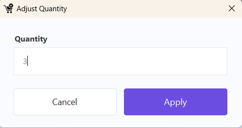

:::info
Edit quantity to **0** will direct remove the item from the cart.
:::

### Item Disc.

- **Subtotal**: displays the current amount (Quantity \* Unit Price) before discount
- **Discount**: user can input discount expression as shown in the image below
- **Reason**(optional): user can input the reason of discount
- **New Subtotal**: displays the amount after discount

  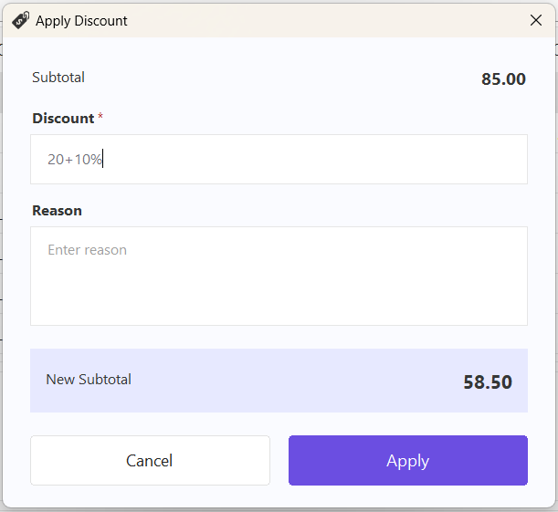

:::warning
The discount amount cannot exceed the subtotal.
:::

### Price and UOM

- Select one of the available **Units of Measure (UOM)** for the selected item
- The **Reference Price** will be display based on the selected UOM
- The **Selling Price** can be edited manually
- **Reset** icon: restore the selling price to the refer price of the selected UOM.

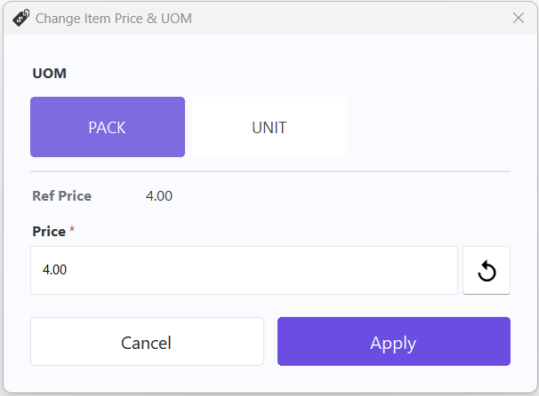

### Batch No.

- Assigning a batch number is **optional**
- Only **one batch number** can be assigned to each item row
- For information on creating and maintaining batch numbers, refer to [Maintain Batch](../../usage/stock/guide.md)

  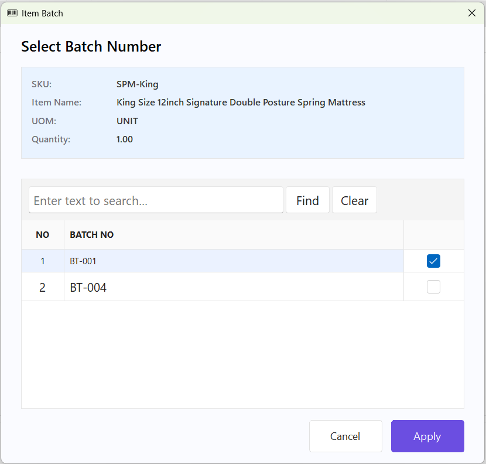

### Serial No.

:::info
To enable serial number tracking for a stock item:

**SQL Accounting** → **Stock** → **Maintain Stock Item** → Select the item → Enable **Serial No.**
:::

- Each serial-controlled item must have a serial number assigned
- One serial number is required for **each quantity** of the item

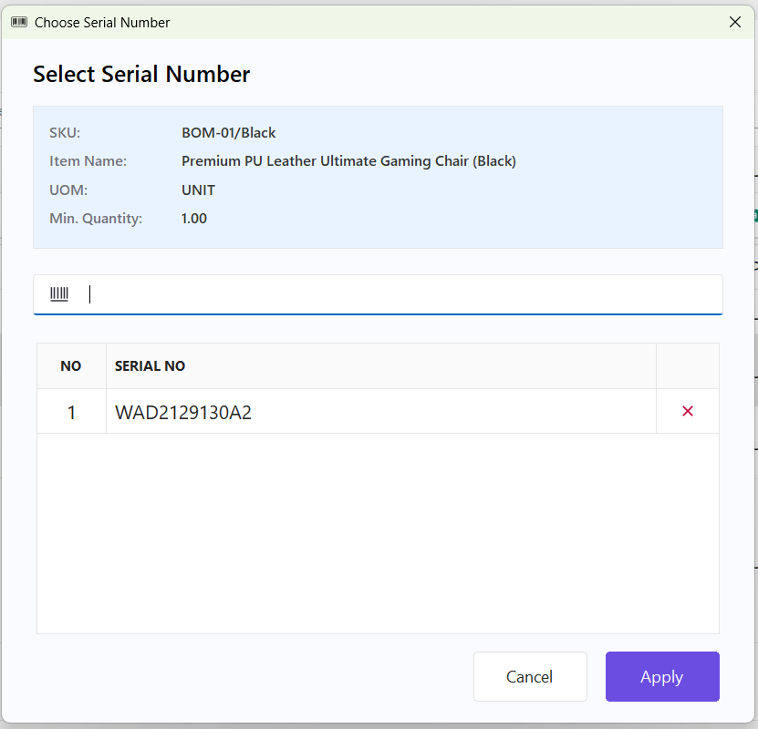

### Item Template

- User can quickly add a predefined group of items to the cart
- The quantity, selling price and selling price of each item are based on the item template configuration
- For information on creating and maintaining batch numbers, refer to [Maintain Item Template](../../usage/stock/guide.md)

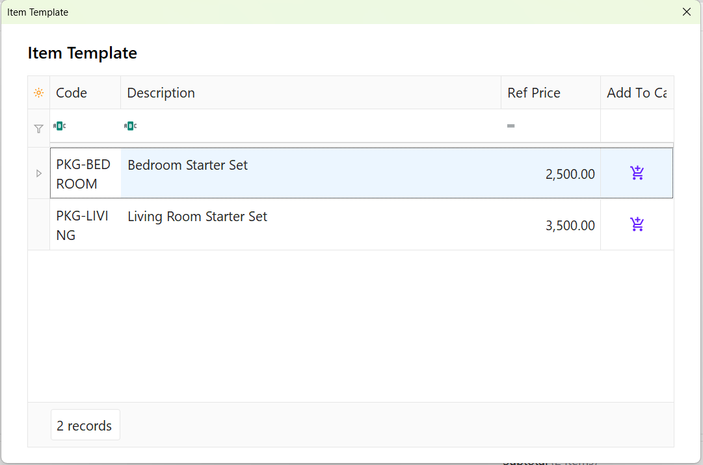

### Hold Bill

- **Remark (Optional)**: Enter a remark for the hold bill
- **Print Hold Bill Receipt**: Enable this option to print a hold bill receipt after saving
- User can temporarily save the current sales transaction and continue it later

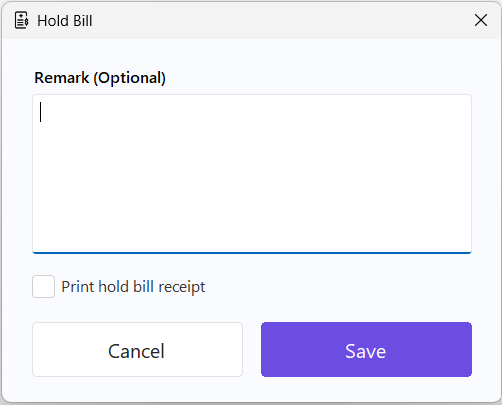

### Hold Bill List

- Displays all saved hold bills and allows users to resume or manage them
- View the hold bill information, including:
  - Date
  - Time
  - Customer
  - Remark
- Click a hold bill card to load the transaction back into the cart
- Click the **Delete** icon to permanently remove the selected hold bill

  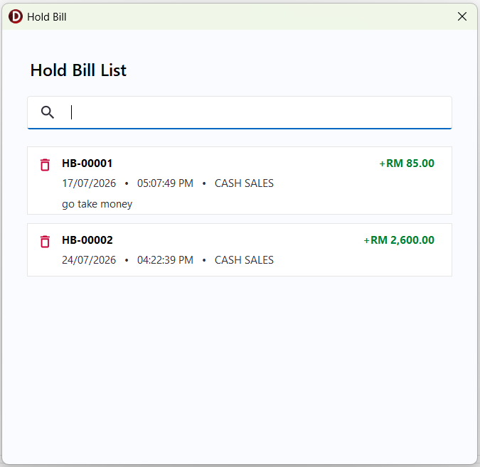

### Search Bill

- Search for a sales transaction using the **Invoice Number**
- Available actions:
  - **View** – Display the sales transaction details.
  - **Void** – Void the selected sales transaction.
  - **Copy with Original Price** – Copy all items to the cart using the original selling prices.
  - **Copy with Updated Price** – Copy all items to the cart using the latest reference prices.
  - **Print** – Print the selected sales transaction.

:::info
Void bill is not allowed for a new counter session.
:::

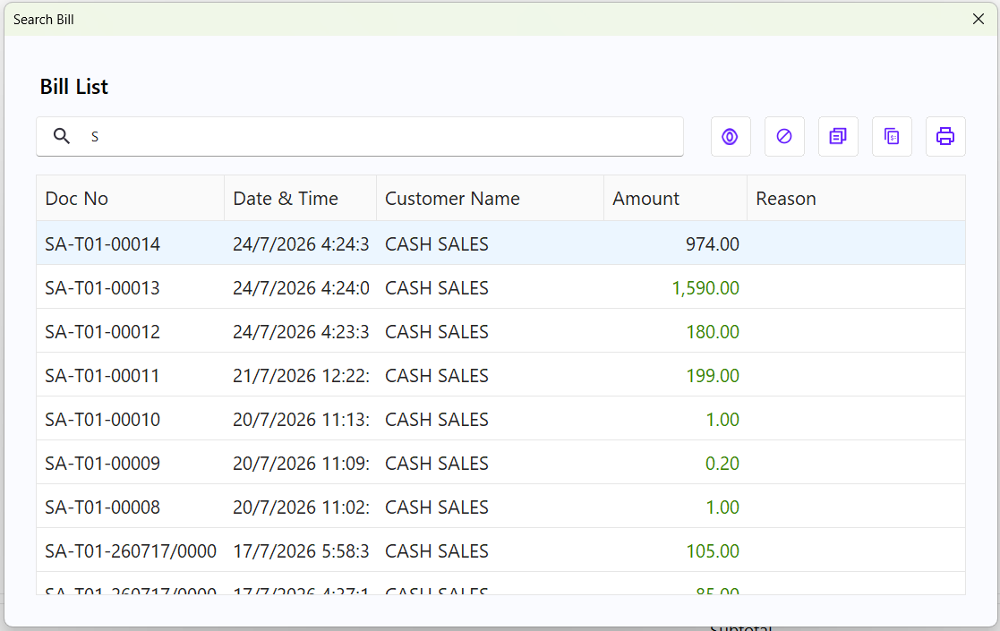

### Price Checker

- Allows users to quickly check an item's available units of measure (UOM) and reference prices
- Search for an item using its **Item Code** or **Barcode**.

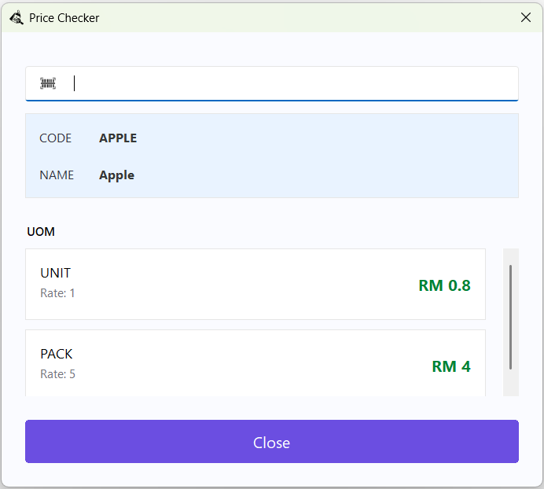

### Cash In/Out

- records cash movements that are not related to sales transactions
- **Cash In** – Record cash received into the cash drawer (for example, float money or miscellaneous income)
- **Cash Out** – Record cash removed from the cash drawer (for example, petty cash expenses or bank deposits)
- Enter the transaction amount and an optional remark before saving
- All cash in/out transactions are recorded for audit and counter balancing purposes

- 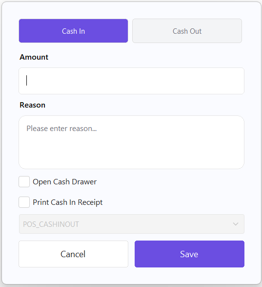

## Layouts

The following checkout layouts are available:

1. [Classic](#classic)
2. [Numpad](#numpad)
3. [Catalogue](#catalogue)
4. [Simple Touch](#simple-touch)
5. [Touch](#touch)

Each layout is designed to support different business environments and cashier workflows, providing flexibility for various retail operation needs.

### Classic

- There are 3 button modes for the classic checkout layout, including:
  - Standard (only displays the essential buttons)
  - Complex (displays all available buttons)
  - Custom (displays the buttons configured in the settings)
- No touch-specific affordances (no numpad, no inline qty steppers) — this is the traditional keyboard/mouse counter screen, built for a cashier who knows the shortcut keys

- 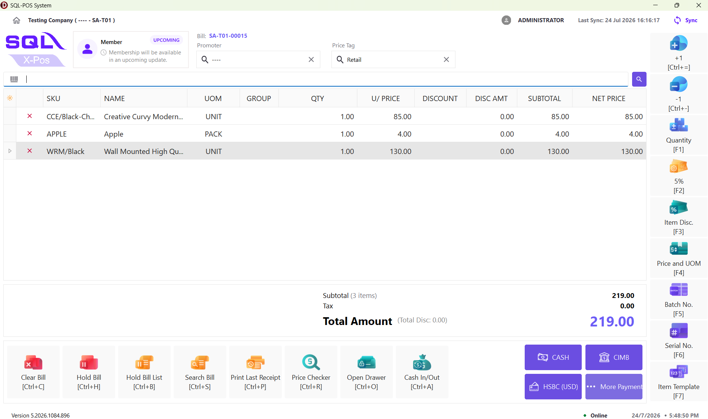

### Numpad

- Dedicated on-screen numeric keypad with an "Enter quantity" field — used for typing quantities without a physical keyboard

- 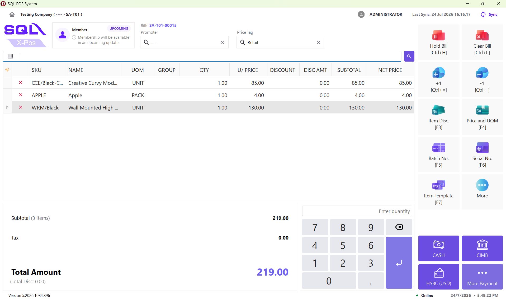

### Catalogue

- The only layout with a visual product grid: category tabs across the top of a scrollable tile grid, each tile showing image, name, and price — tap a tile to add it to the cart
- Built for browsing/selecting items visually rather than scanning or searching by SKU

- 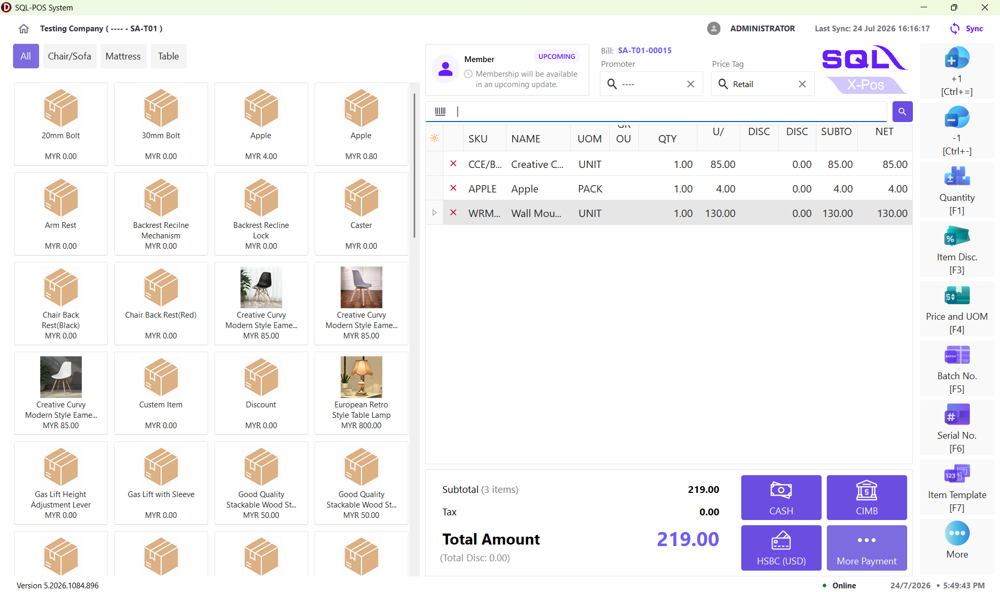

### Simple Touch

- No numpad. Instead, each cart row gets its own inline "−" and "+" buttons flanking the QTY value — tap to increment/decrement directly in the grid

- 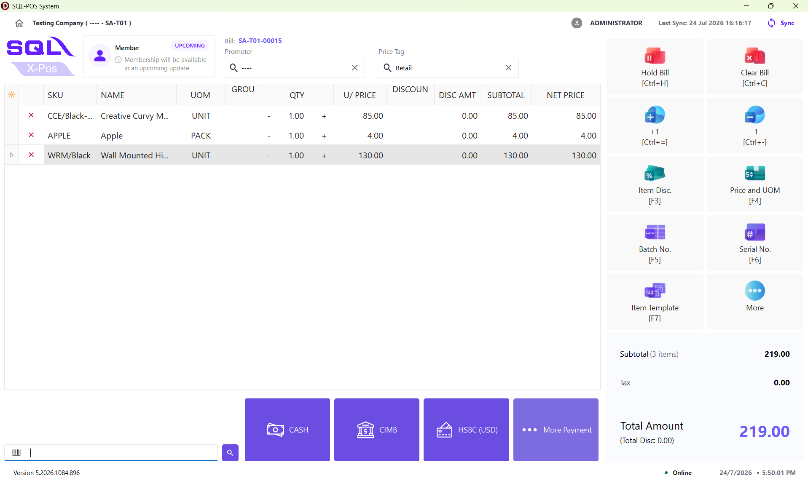

### Touch

- No inline +/- steppers. Instead, tapping a row's QTY cell selects/highlights it (shown in blue), and an on-screen numpad appears bottom-right to type an exact new quantity straight into that cell

- 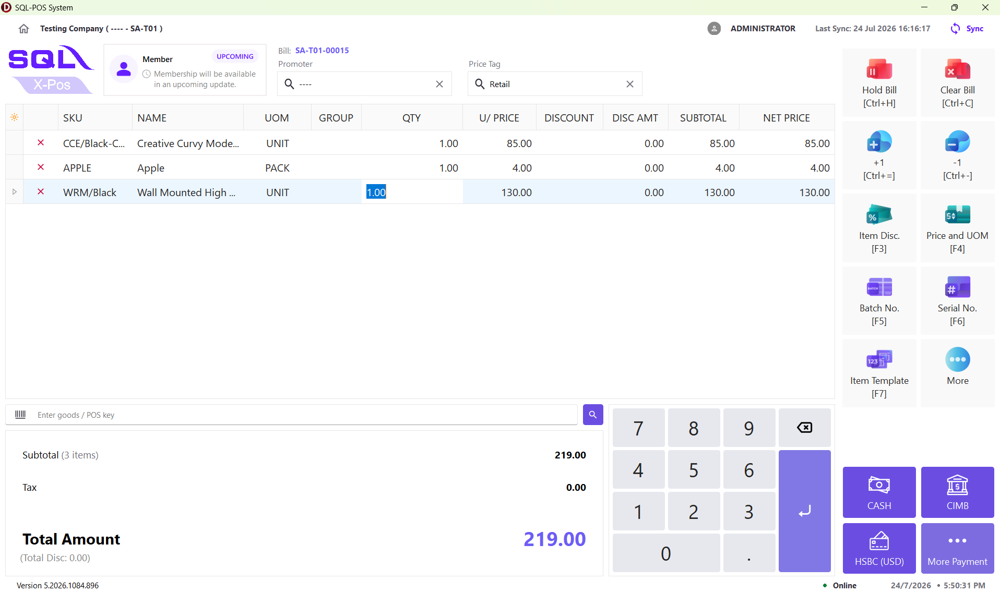
