## Overview

The **Counter Managament** module allows you to view counter summaries, handle cash flows, close counters, and preview or print closed counter reports

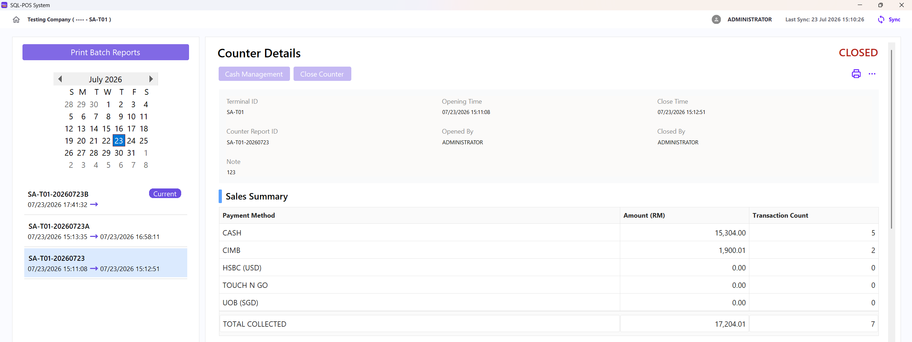
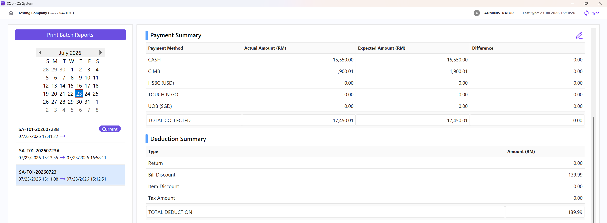
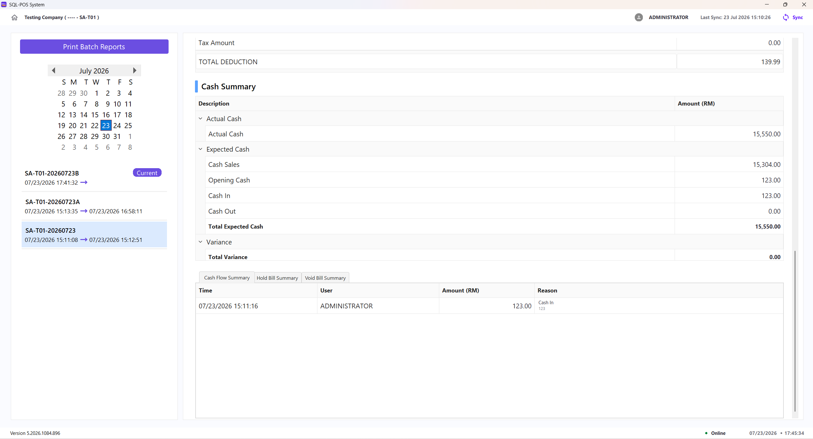

## Section

### Counter Details

Shows the basic information for the selected counter session.

The status shown beside **Counter Details** indicates whether the selected counter is **OPEN** or **CLOSED**.

| Field | Description |
| --- | --- |
| **Terminal ID** | The code of the X-Pos terminal where this counter session was opened |
| **Opening Time** | The local date and time when the counter session was opened |
| **Close Time** | The local date and time when the counter session was closed. Displays `-` while the counter is still open |
| **Counter Report ID** | The unique counter-session reference number used for reports and counter tracking |
| **Opened By** | The user who opened the counter session |
| **Closed By** | The user who closed the counter session. Displays `-` while the counter is still open |
| **Note** | Any note saved for the counter session. Displays `-` when no note was entered |

### Sales Summary

Displays total sales collected, broken down by payment method.

| Field | Description |
| ----- | ----------- |
| **Payment Method** | Payment method list |
| **Amount (RM)** | Total amount collected via that payment method during the counter session |
| **Transaction Count** | Number of transactions/bills paid using that method |

### Payment Summary

Compares what was physically counted against what the system expected per payment method.

| Field | Description |
| ----- | ----------- |
| **Payment Method** | Payment method list |
| **Actual Amount (RM)** | Amount counted and entered by the cashier |
| **Expected Amount (RM)** | Amount calculated by the system |
| **Difference** | Actual − Expected |

### Deduction Summary

Shows amounts deducted from gross sales.

| Field | Description |
| ----- | ----------- |
| **Type** | Category of deduction: **Return**, **Bill Discount**, **Item Discount**, **Tax Amount** |
| **Amount (RM)** | Total value of that deduction type during the session |

### Cash Summary

A detailed cash reconciliation for the **default Cash payment method** only.

#### Actual Cash

| Field | Description |
| ----- | ----------- |
| **Actual Cash** | The physical cash amount counted and entered by the cashier |

#### Expected Cash

| Field | Description |
| ----- | ----------- |
| **Cash Sales** | Total cash received from completed sales transactions |
| **Opening Cash** | Float entered when the counter was opened |
| **Cash In** | Total cash added during the session |
| **Cash Out** | Total cash removed during the session |
| **Total Expected Cash** | Cash Sales + Opening Cash + Cash In − Cash Out |

#### Variance

| Field | Description |
| ----- | ----------- |
| **Total Variance** | Actual Cash − Total Expected Cash |

### Cash Flow Summary / Hold Bill Summary / Void Bill Summary

#### Cash Flow Summary

Lists every Cash In/Cash Out transaction during the session.

| Field | Description |
| ----- | ----------- |
| **Time** | Date and time the cash transaction was made |
| **User** | The user who performed the transaction |
| **Amount (RM)** | The cash amount added (Cash In) or removed (Cash Out) |
| **Reason** | Additional note for the action |

#### Hold Bill Summary

Lists bills placed on hold during the session.

| Field | Description |
| ----- | ----------- |
| **ID** | The held bill's reference number |
| **Time** | Date and time the bill was held |
| **User** | The user who held the bill |
| **Amount (RM)** | The total amount of the held bill |
| **Remark** | Additional note for the action |

#### Void Bill Summary

Lists bills that were voided during the session.

| Field | Description |
| ----- | ----------- |
| **ID** | The voided bill's reference number |
| **Time** | Date and time the bill was voided |
| **User** | The user who voided the bill |
| **Amount (RM)** | The total amount of the voided bill |
| **Remark** | Additional note for the action |

## General Features

### Filter Counter by Date

1. Use the **calendar** on the left panel to navigate between months using the **◀** and **▶** arrows
2. Select a **date** to show counters opened on that day

    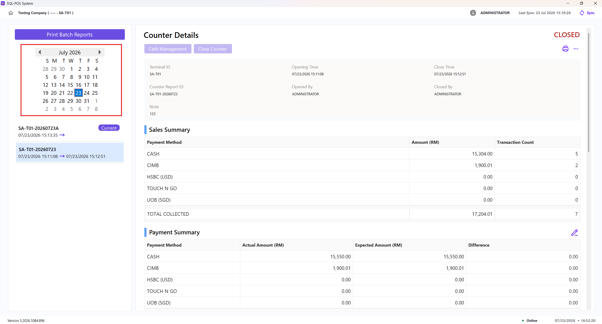

3. Select a counter in the list to view its full **Counter Details** on the right panel

### Print Batch Reports

1. Click **Print Batch Reports**

    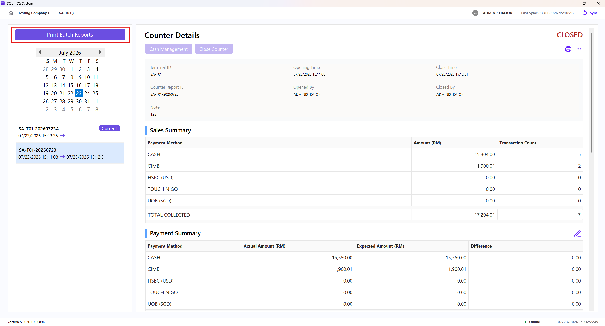

2. Select a **Report Type**:

    | Report Type | Description |
    | ----------- | ------------ |
    | **By Summary** | Consolidates all counters within the date range into a single combined report |
    | **By Counter** | Generates an individual close counter report for each counter within the date range, viewable one by one |

3. Select the **Start Date** and **End Date**
4. Select a **Template** (e.g., ` POS_CLOSECOUNTER_BYDATE `)
5. (Optional) Check **Send Report to Email** to email the reports. This requires an email to be configured first
6. A **preview** of the report is shown on the right

    - For **By Summary**, the preview shows the combined totals across all counters in the range

        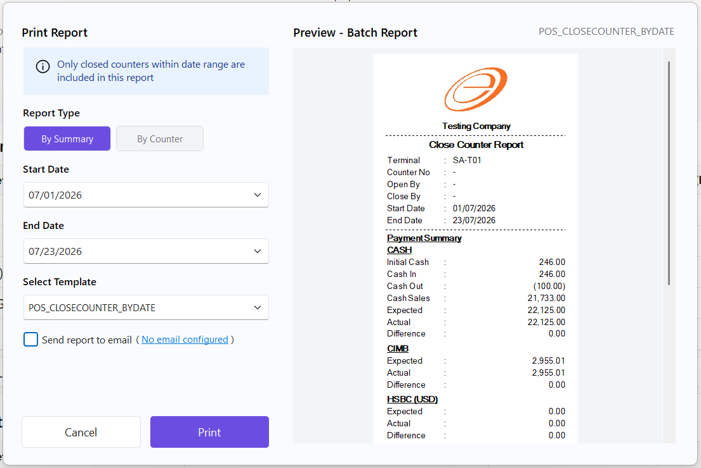

    - For **By Counter**, the preview shows each counter's report individually. Use **Previous** and **Next** to navigate between counters, indicated by the page counter (e.g., **1 of 2**)

        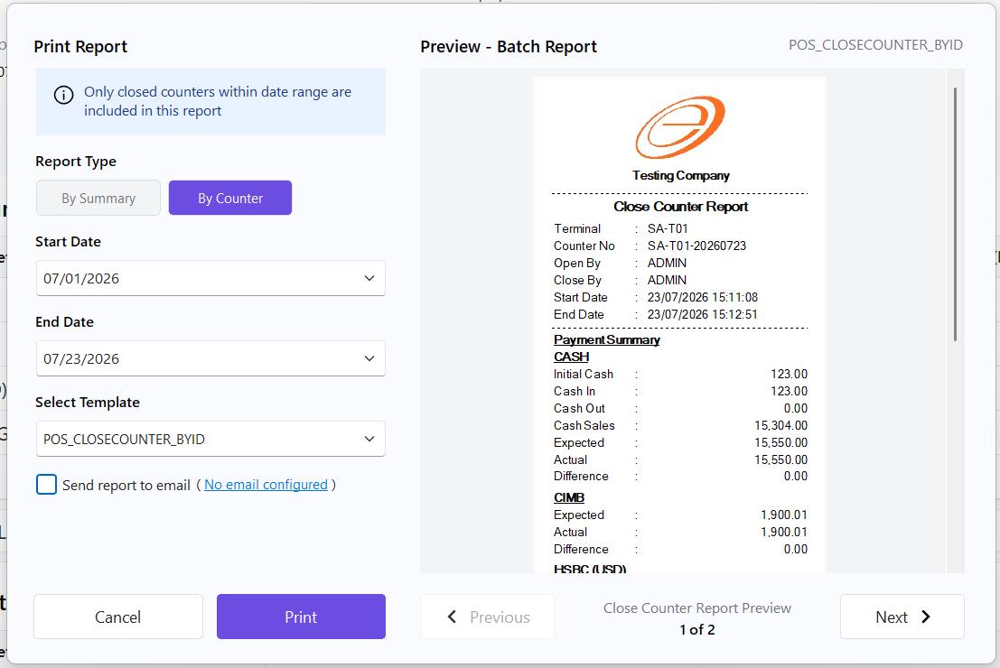

7. Click **Print** to generate the report(s), or **Cancel** to discard the selection

### Cash Management

1. Click **Cash Management**

    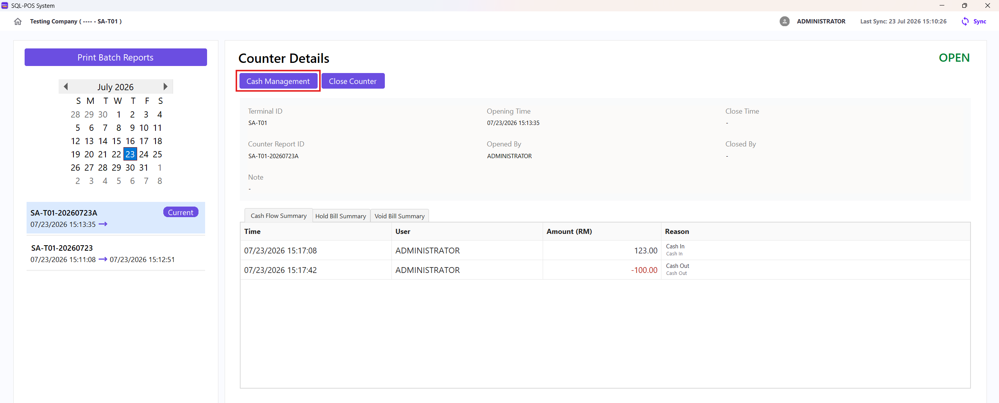

2. Select **Cash In** or **Cash Out** using the toggle at the top of the form
3. Enter the **Amount**
4. (Optional) Enter the **Reason**
5. (Optional) Check **Open Cash Drawer** to trigger the physical cash drawer to open
6. (Optional) Check **Print Cash In / Out Receipt** and select a template (e.g., ` POS_CASHINOUT `)
7. Click **Save** to confirm the transaction, or **Cancel** to discard it

    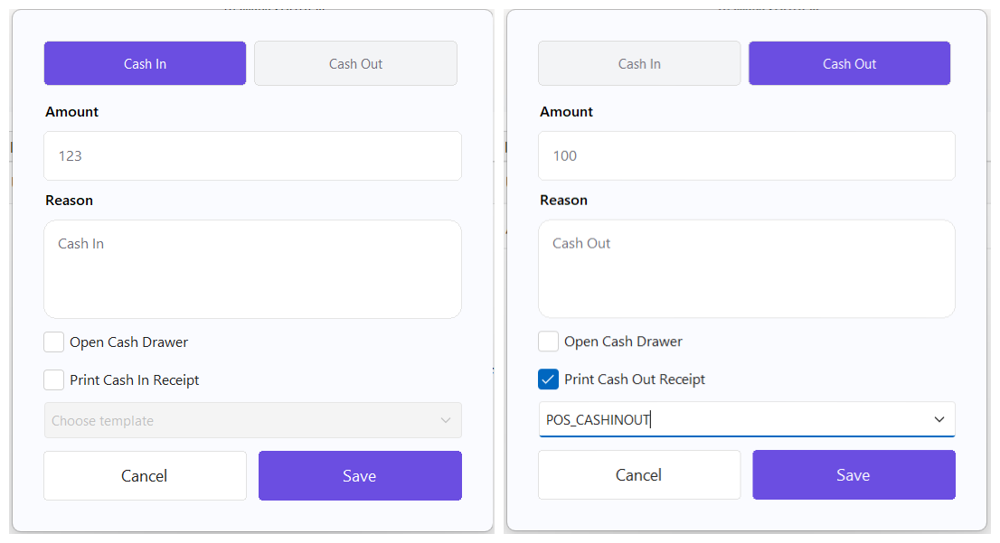

8. Once saved, a **success** message is displayed:

    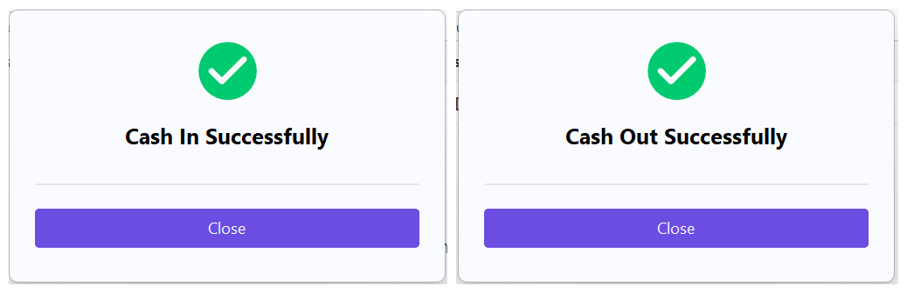

### Close Counter

1. Click **Close Counter**

    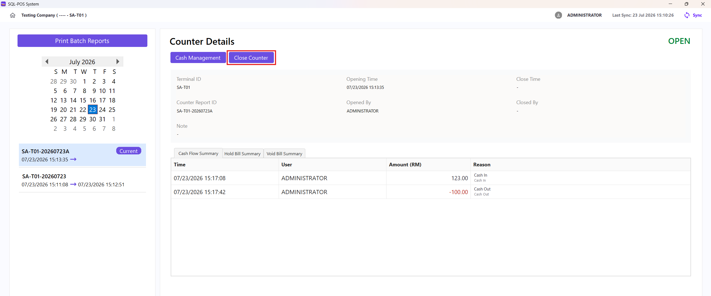

2. Count the amounts received and adjust the **Actual (RM)** amount for each payment method
3. (Optional) Check **Send Report to Email** to email the report. This requires an email to be configured first
4. (Optional) Check **Print Closing Summary Report** and select a template (e.g., ` POS_CLOSECOUNTER_BYID `)
5. Click **Proceed Close Counter** to close the counter, or **Cancel** to discard it

    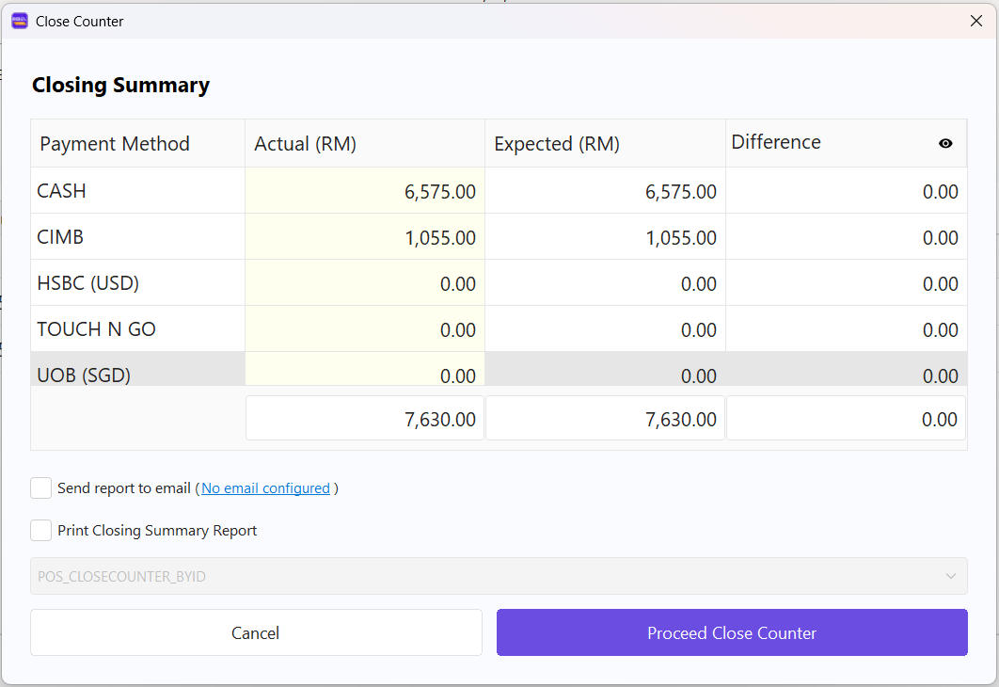

6. Once closed, a **Counter Closed** confirmation is shown with the **Counter ID**, **Date**, **Time**, and **Operator**
7. (Optional) Check **Auto Post to SQL Account** post the closed counter to SQL Acc automatically
8. Click **OK** to complete, or **Undo** within the countdown to reopen the counter

    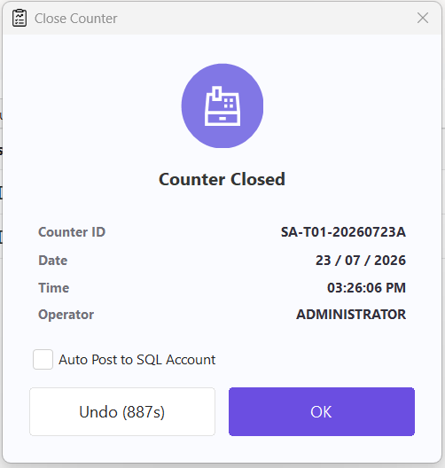

### Print Close Counter Report

1. Click **Print** icon

    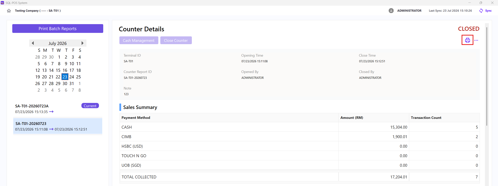

2. Select a **Template** (e.g., ` POS_CLOSECOUNTER_BYID `)
3. (Optional) Check **Send Report to Email** to email the report. This requires an email to be configured first
4. Click **Print** to generate the report, or **Cancel** to discard the selection

    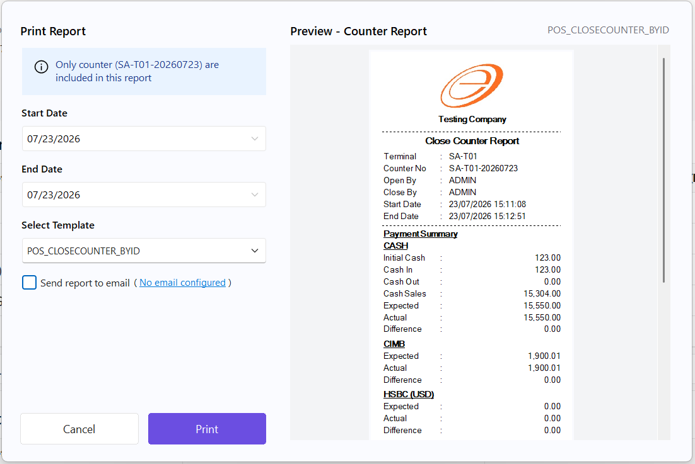

### PopUp Menu

1. Click **⋯ (three dots)** icon

    

2. Select one of the following actions:

    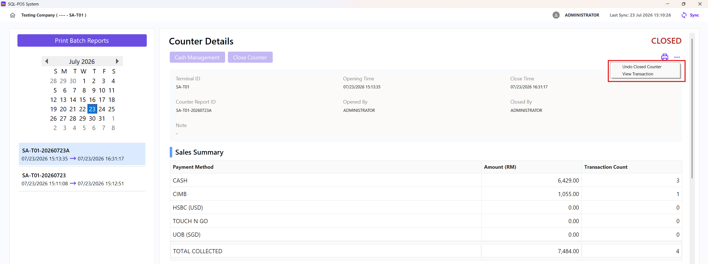

    | Action | Description |
    | --- | --- |
    | **Undo Closed Counter** | Reopens a closed counter within the **configured timeout window**. It is unavailable after the counter has been **posted to SQL Account** |
    | **View Transaction** | Opens the **Transaction** page and displays the transactions in the selected counter |

### Edit Payment Summary Actual Amount

1. Click **Edit** icon

    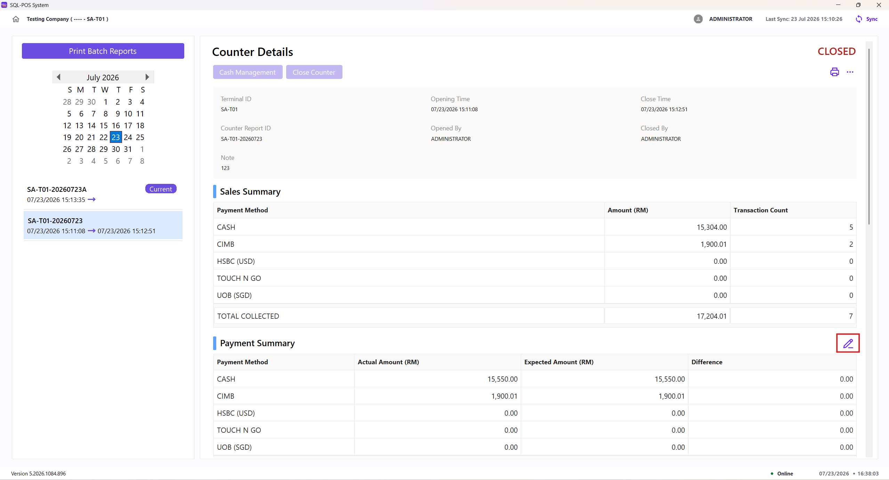

2. Adjust the **Actual (RM)** amount for the relevant payment method.
3. Click **Save** to update the actual amounts or **Cancel** to discard the changes.

    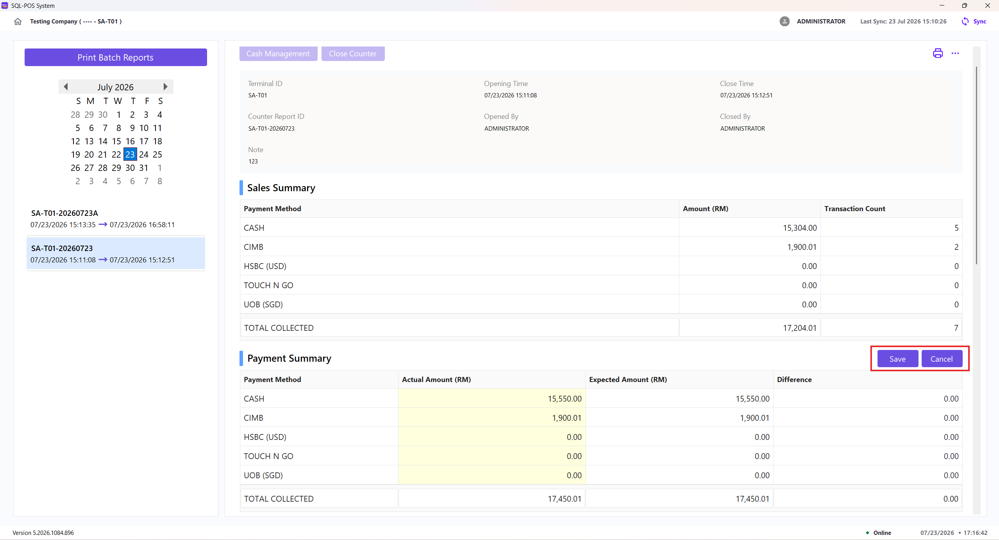
