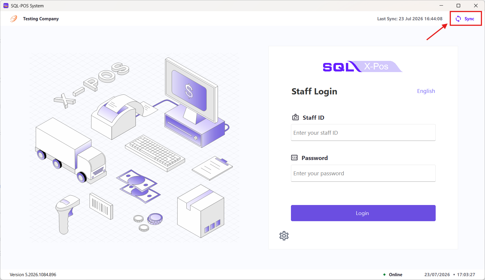
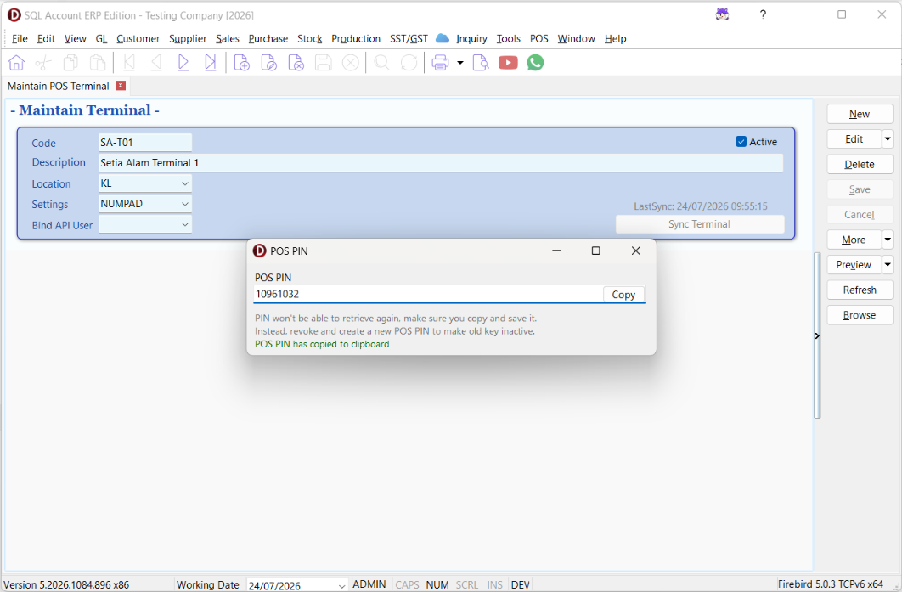
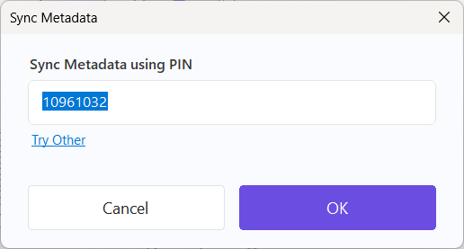
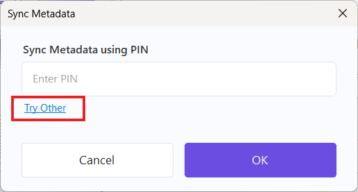
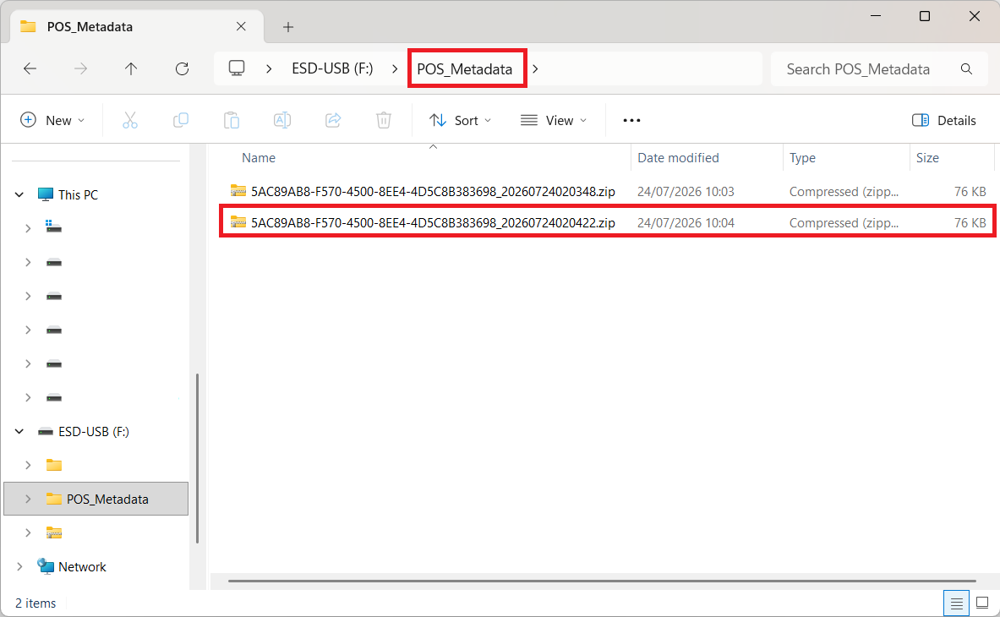
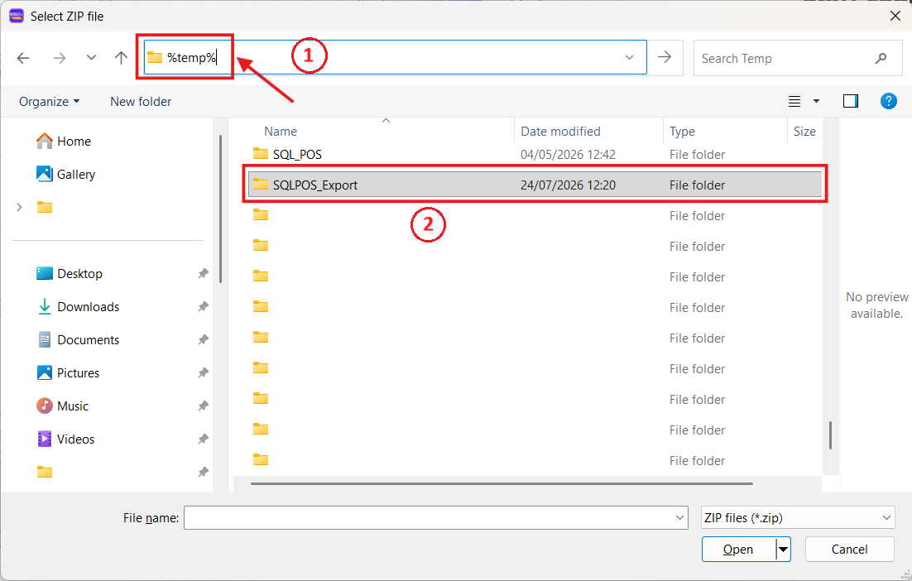
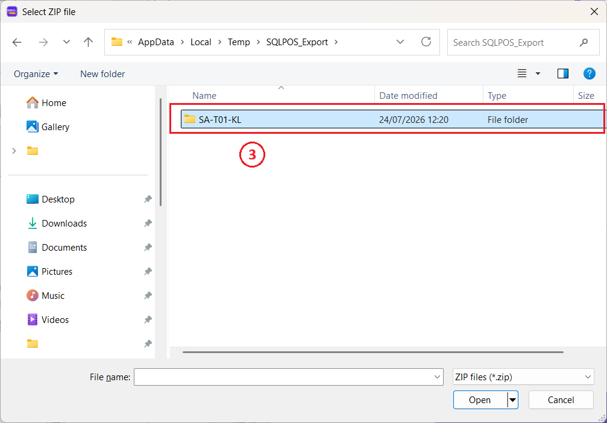
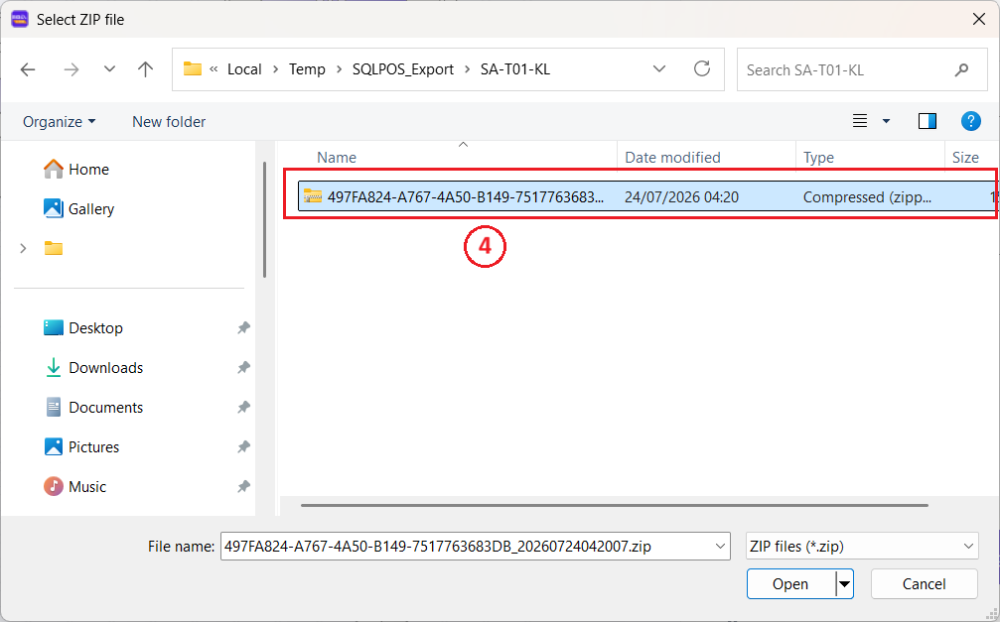
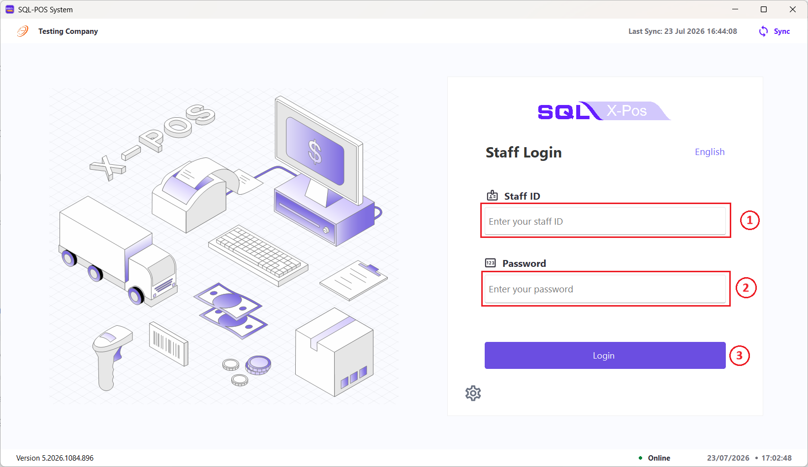

## Synchronize Data from SQL Account

Before signing in to X-Pos Terminal for the first time, synchronize the terminal
with SQL Account to retrieve the required company and POS data. After the
synchronization is complete, authorized users can sign in.

On the sign-in screen, select **Sync** in the upper-right corner.

You can synchronize the data using any of the following methods:

- A POS PIN generated in SQL Account
- A backup file stored on a USB drive
- A local export file, if SQL Account and X-Pos Terminal are installed on the
  same device

### Method 1: Use a POS PIN

1. In SQL Account, open **POS > Maintain POS Terminal**.
2. Select the terminal that you want to synchronize.
3. Select **Sync Terminal**, then select **Sync**.
4. A **POS PIN** will be generated. Select **Copy**, then store the PIN securely.

   :::caution
   The POS PIN is displayed only once and cannot be retrieved again. If you
   lose it, revoke the existing PIN and generate a new one.
   :::

   

5. In X-Pos Terminal, enter the PIN in the **Sync Metadata using PIN** window.
6. Select **OK** to start the synchronization.

   

<!-- ### Method 2: Use a Backup File on a USB Drive

1. Connect the USB drive containing the backup file to the X-Pos Terminal device.
2. In the **Sync Metadata using PIN** window, select **Try Other**.

   

3. Open the `POS_Metadata` folder on the USB drive, then select the backup file
   to start the synchronization.

   

   :::note
   You can configure backups to be saved to a USB drive under X-Pos Terminal
   **Settings > Hardware > USB**.
   ::: -->

### Method 2: Use a Local Export File

Use this method when SQL Account and X-Pos Terminal are installed on the **same** Windows device.

1. In the **Sync Metadata using PIN** window, select **Try Other**.
2. In the file-selection window, enter `%temp%` in the address bar and press Enter.
3. Select the `SQLPOS_Export` folder.

   

4. Open the folder for your terminal, for example `SA-T01-KL`.
   
   

5. Select the latest compressed backup file to start the synchronization.
   
   

## Sign In

After the synchronization is successful, any SQL Account user with access rights to POS Terminal for the database can sign in to X-Pos Terminal.

1. Enter your **User ID**.
2. Enter your **Password**.
3. Select **Login**.

