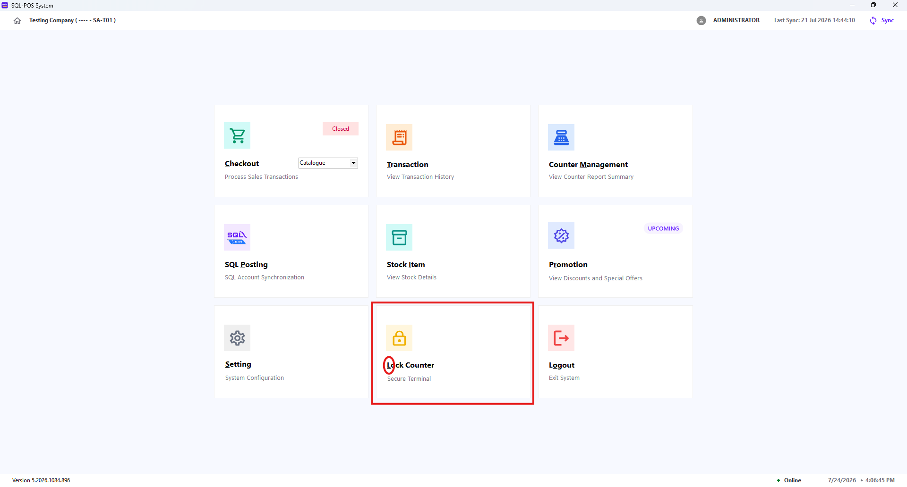
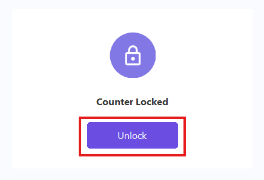
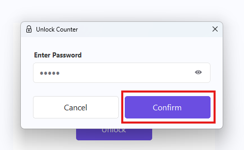
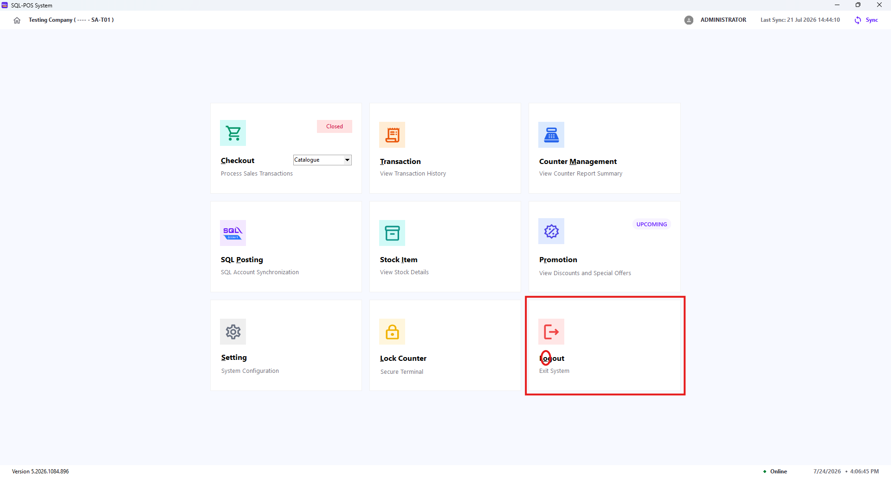
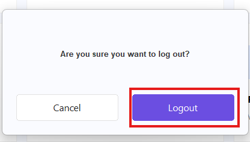

This page covers the actions on the XPOS home screen that help you secure the terminal or end your current XPOS session.

## Lock Counter

Use **Lock Counter** when you need to step away from the terminal without logging out. The counter remains secure until the current user unlocks it.

1. On the XPOS home screen, select **Lock Counter** or press **L**.
2. XPOS displays the **Counter Locked** screen.
3. To resume work, click **Unlock** or press **Enter**.  
   
4. Enter the password of the user currently signed in.
5. Click **Confirm** or press **Enter**.  
   

If the password is incorrect, XPOS displays an error message and keeps the counter locked. Press **Esc** in the unlock window to cancel and return to the locked screen.

:::tip
Lock the counter whenever the terminal will be unattended, even for a short time.
:::

## Logout

Use **Logout** when the current user has finished using XPOS and another user needs to sign in.

1. On the XPOS home screen, select **Logout** or press **O**.
2. In the confirmation window, select **Logout** to end the session.  
   

Select **Cancel** or press **Esc** to keep the current session active. Press **Enter** to confirm logout.

:::note
Logging out clears the current user's access rights from the terminal. The next user must sign in before continuing.
:::
