## Overview

The **Settings** module is organised into five sections for configuring X-Pos Terminal.

| Section | Description |
| --- | --- |
| **General** | Configure payment behaviour, POS screen options, and counter-closing controls |
| **Hardware** | Configure USB backup, receipt printer, barcode scanner, customer display, and weight scale |
| **Advanced** | Configure local synchronisation, SQL Account posting, bill-number formats, report templates, and database maintenance |
| **Shortcuts Configuration** | Assign keyboard shortcuts for title commands, action buttons, and payment methods |
| **About** | Maintain company and location information |

:::note

Select a section from the left menu, then select the required setting card. Use **Apply** to save changes. Where available, select **Restore Default** to return that setting page to its default configuration

:::

## General

### Payment

Click **General → Payment**

These settings are identical to the options described in the [X-Pos Guide - Payment](../../usage/xpos/guide.md#payment)

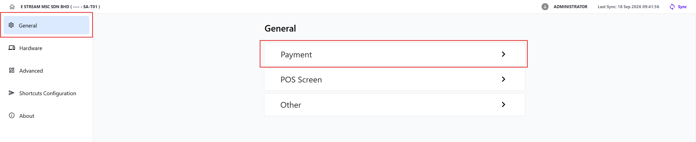
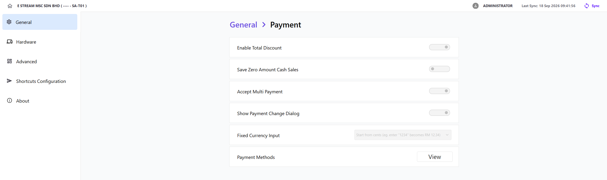

#### View Payment Methods

1. Click **Payment Methods → View**

    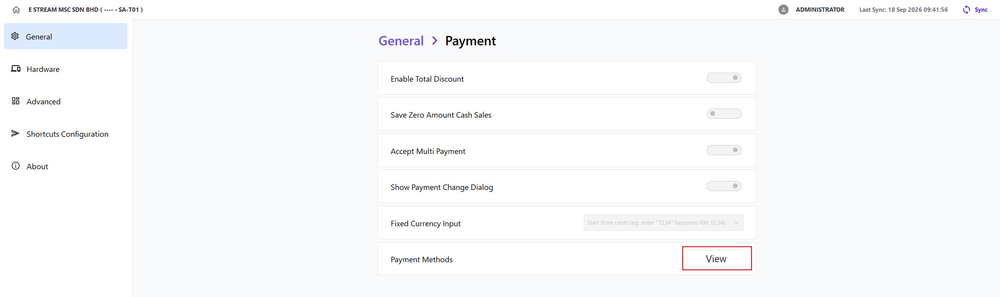

2. Select a payment method from the list

    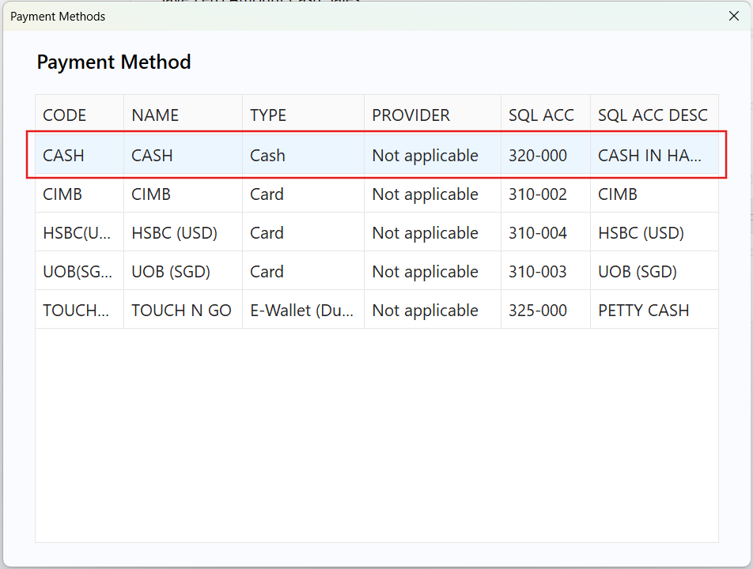

3. View payment method details

    For details on payment method fields, see [X-Pos Guide - POS Payment Options](../../usage/xpos/guide.md#pos-payment-options)

    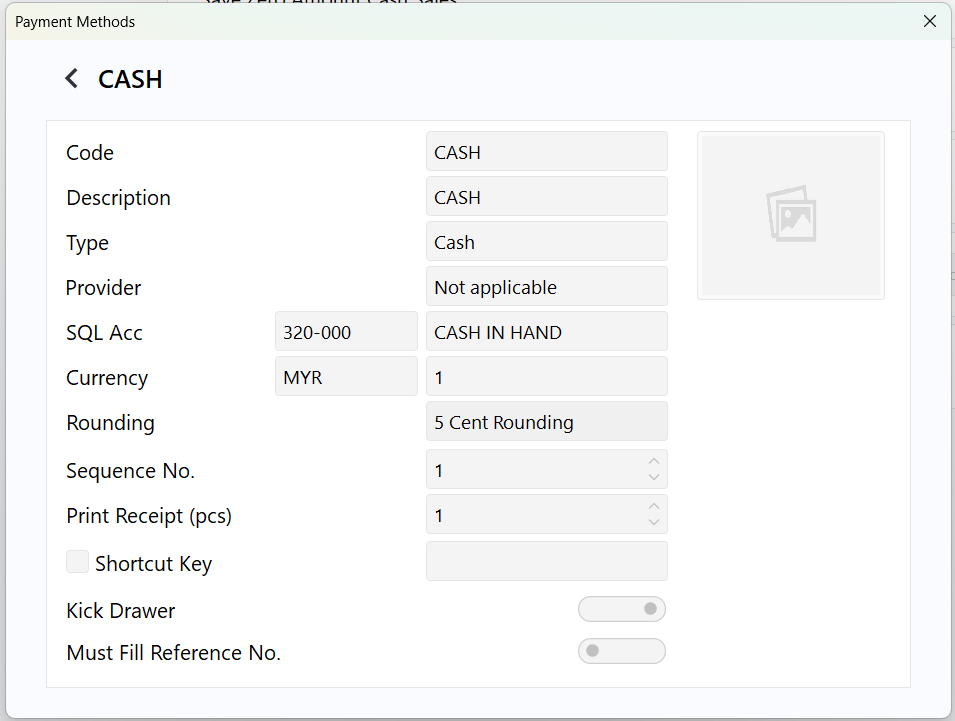

### POS Screen

Click **General → POS Screen**

These settings are identical to the options described in [X-Pos Guide - POS Screen](../../usage/xpos/guide.md#pos-screen)

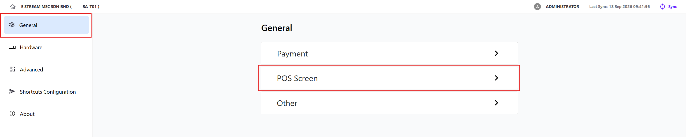
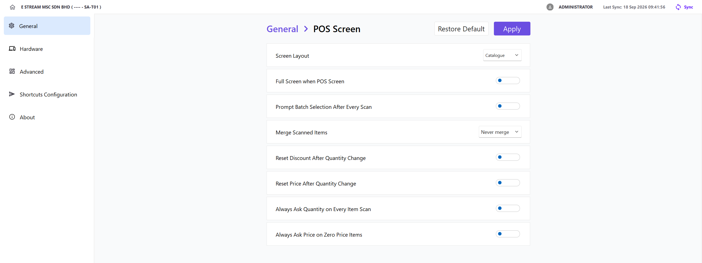

### Other

Click **General → Other**

These settings are identical to the options described in [X-Pos Guide - Other](../../usage/xpos/guide.md#other)

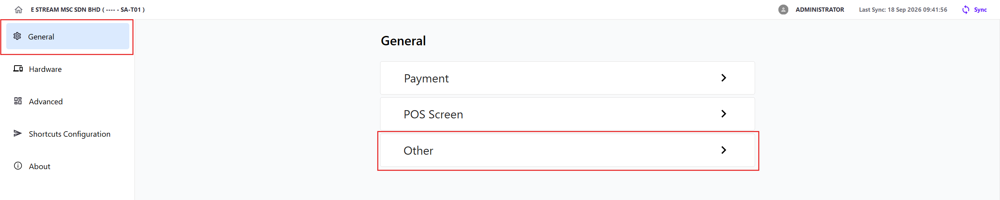
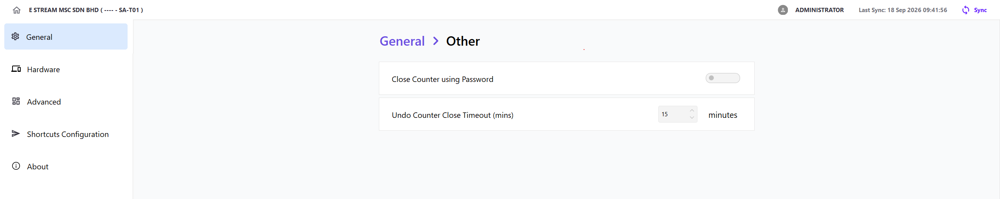

## Hardware

### USB

Click **Hardware → USB**

1. Enable USB backup
2. Select the required drive
3. Confirm that the drive status is detected
4. Click **Save**

For instructions on using a USB backup file to synchronize data, see [Getting Started - Method 2: Use a Backup File on a USB Drive](./getting-started.md#method-2-use-a-backup-file-on-a-usb-drive)

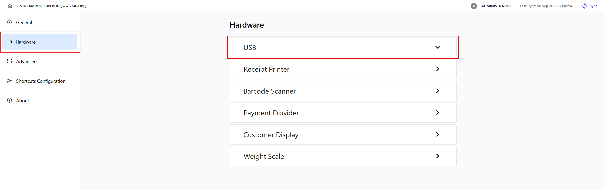
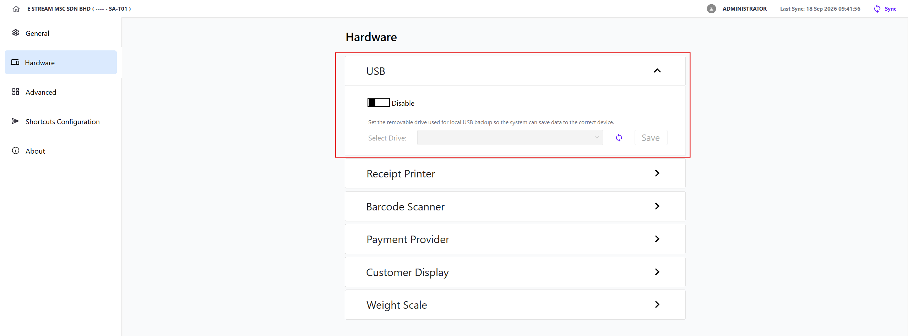

### Receipt Printer

Click **Hardware → Receipt Printer**

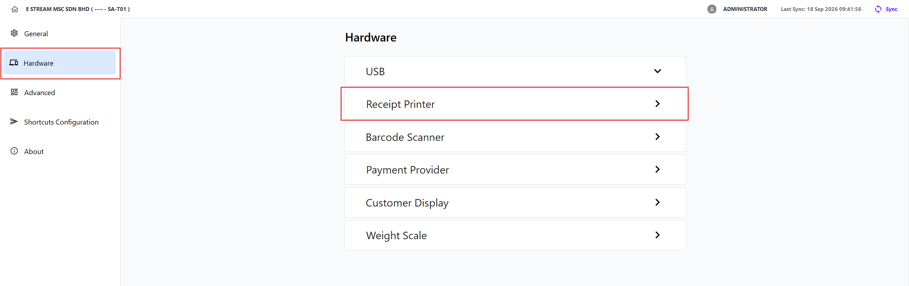
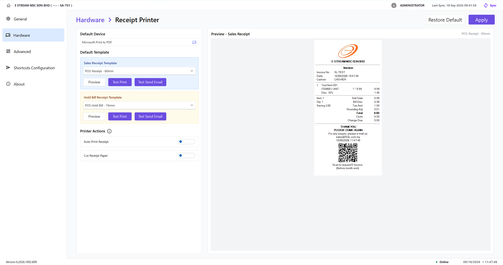

| Setting | Description |
| --- | --- |
| **Default Device** | Default printer used to print receipts |
| **Sales Receipt Template** | Default report template used when printing a completed sales receipt |
| **Hold Bill Receipt Template** | Default report template used when printing a hold-bill receipt |
| **Preview** | Displays a preview of the selected receipt template |
| **Test Print** | Prints a sample receipt using the selected template and default printer |
| **Test Send Email** | Sends a sample receipt as a PDF attachment to test the email receipt configuration |

#### Printer Actions

These settings are identical to the options described in [X-Pos Guide - Receipt Printer](../../usage/xpos/guide.md#receipt-printer)

:::warning

**Cut Receipt Paper** may conflict with the Windows printer-driver setting. If automatic paper cutting is enabled in both X-Pos and the printer driver, the printer may perform two cut actions for each receipt

:::

### Barcode Scanner

Click **Hardware → Barcode Scanner**

1. Scan an item barcode from the inventory
2. Display **Barcode**, **Item Code**, **Description**, **Description 2**, and **Reference Price** information

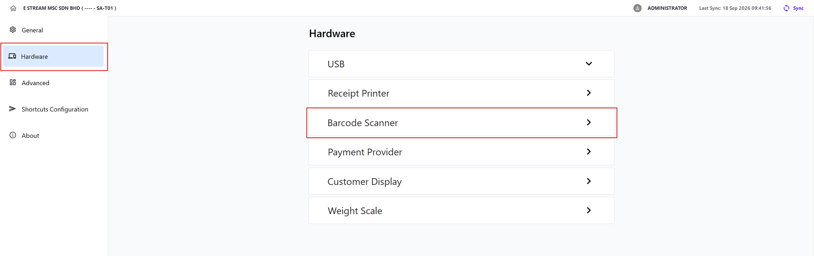
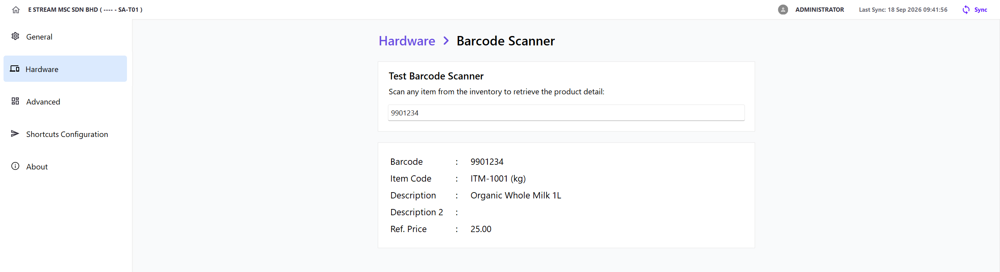

### Customer Display

Click **Hardware → Customer Display**

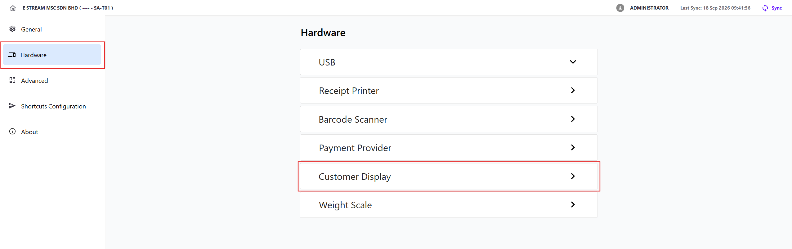
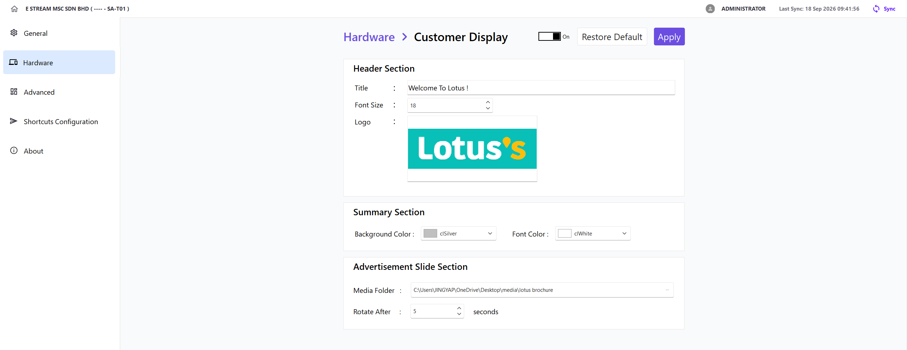

| Section | Configuration |
| --- | --- |
| **Header Section** | Set the display title, logo, and font size |
| **Summary Section** | Set the font colour and background colour for the sale summary |
| **Advertisement Slide Section** | Select the media folder and slide rotation interval |

### Weight Scale

Click **Hardware → Weight Scale**

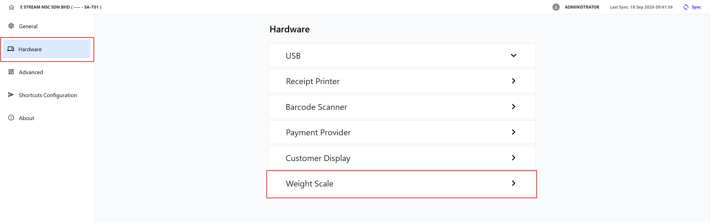
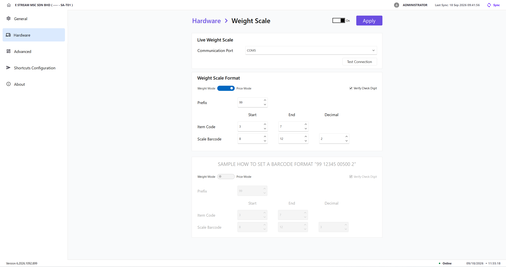

| Setting | Description |
| --- | --- |
| **Prefix** | Beginning digits that identify a scale barcode |
| **Item Code** | Start and end positions for the item code within the barcode |
| **Decimal** | Decimal position for the encoded weight or price |
| **Verify Check Digit** | Validates the barcode check digit |
| **Weight Mode / Price Mode** | Defines whether the barcode contains a weight or a price value |

## Advanced

### Sync From Local

Click **Advanced → Sync From Local**

1. Select the folder path
2. Confirm that the folder is available to the terminal
3. Click **Save**

For instructions on synchronizing with a local export file, see [Getting Started - Method 3: Use a Local Export File](./getting-started.md#method-3-use-a-local-export-file)

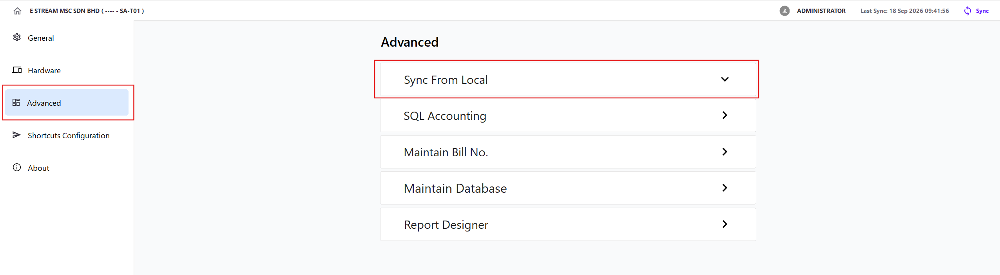
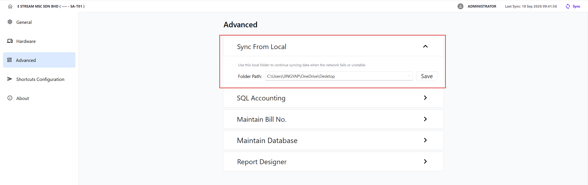

### SQL Accounting

Click **Advanced → SQL Accounting**

These settings are identical to the options described in [X-Pos Guide - Posting](../../usage/xpos/guide.md#posting)

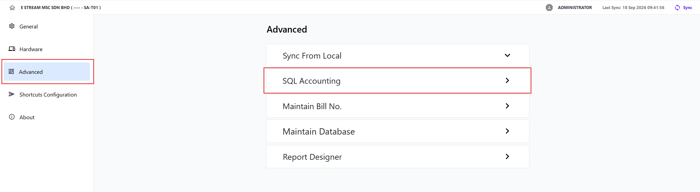
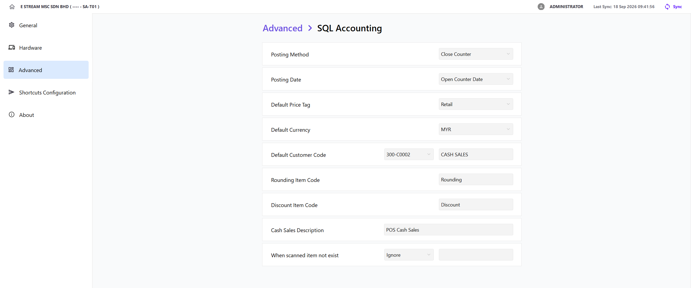

### Maintain Bill No

Click **Advanced → Maintain Bill No**

These settings are identical to the options described in [X-Pos Guide - Posting Behaviour](../../usage/xpos/guide.md#posting-behaviour)

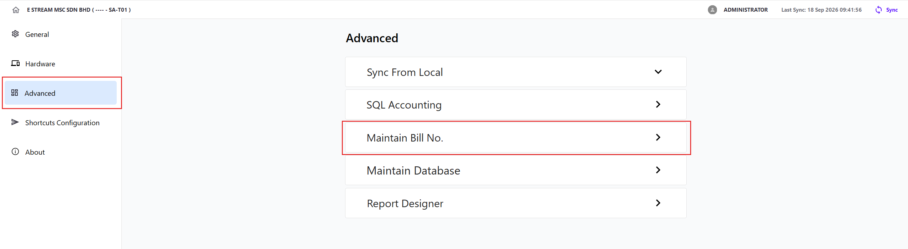
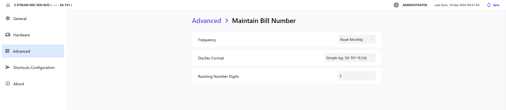

### Maintain Database

Click **Advanced → Maintain Database**

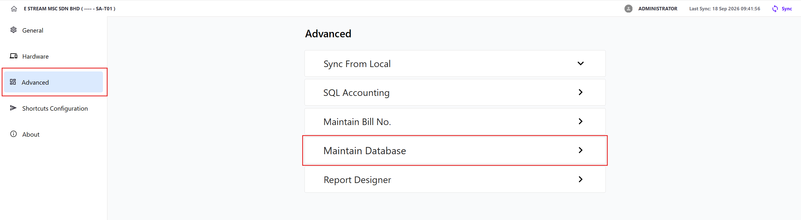
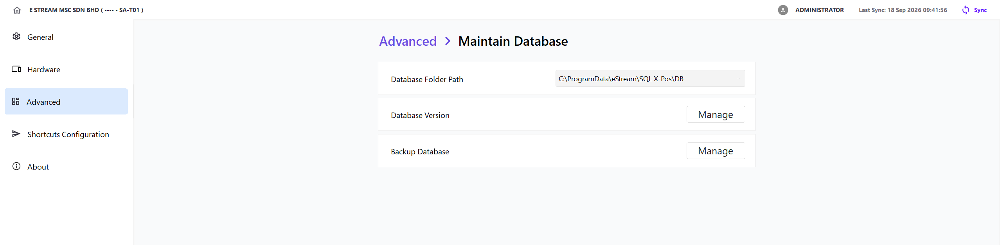

| Setting | Description |
| --- | --- |
| **Database Folder Path** | Folder path of the database currently used |
| **Database Version → Manage** | See [Database Version](#database-version) |
| **Backup Database → Manage** | See [Backup Database](#backup-database) |

#### Database Version

1. Click **Database Version → Manage**

    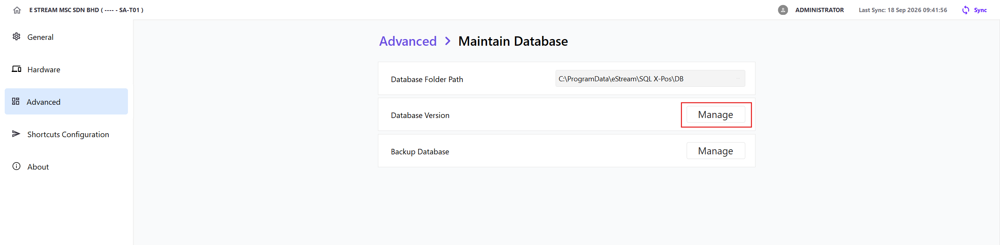

2. The current database version is displayed under **Current Database**

3. Select the required version from **Available Versions**

4. Click **Apply** to use the selected database version, or click **Cancel** to close without changes

5. To remove an unused version, select it and click **Delete Version**

    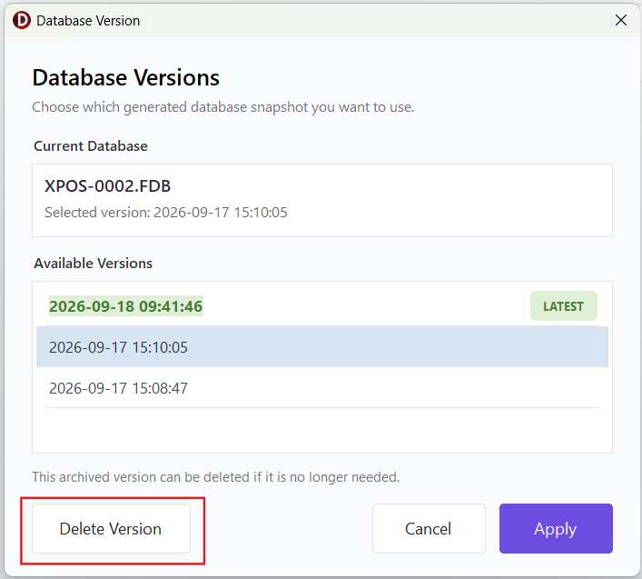

:::note

The current database version and the latest version are protected and cannot be deleted

:::

#### Backup Database

1. Click **Backup Database → Manage**

    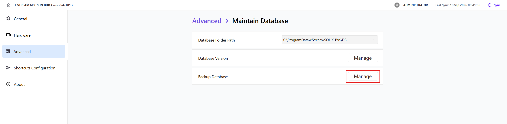

2. Enter or select a backup folder path.
3. Click **+ Add** to add the folder to **Configured Folder Paths**

    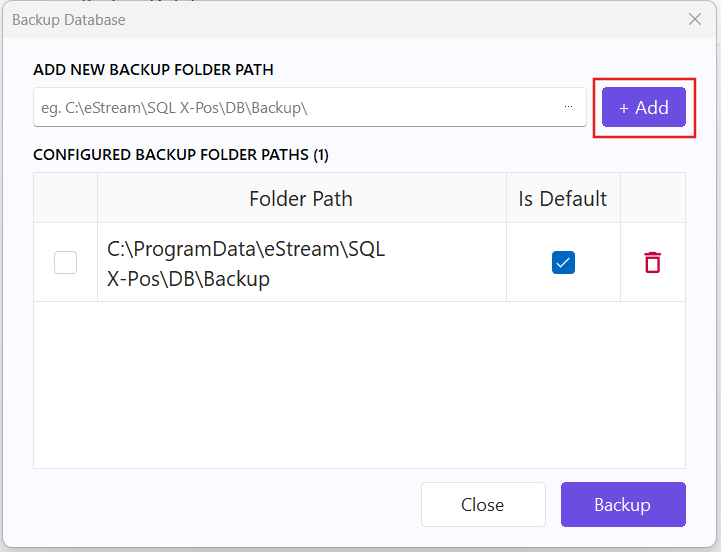

4. Click **Backup** to create a database backup in the selected folder

    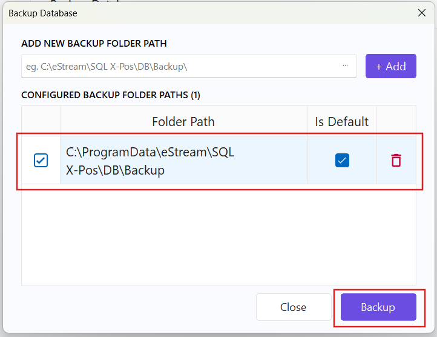

### Report Designer

Click **Advanced → Report Designer**

Each report template can use a different printer

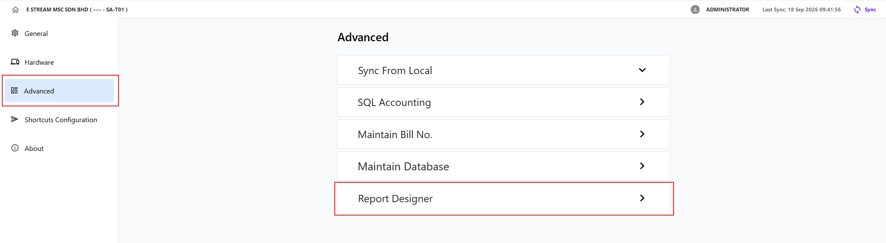
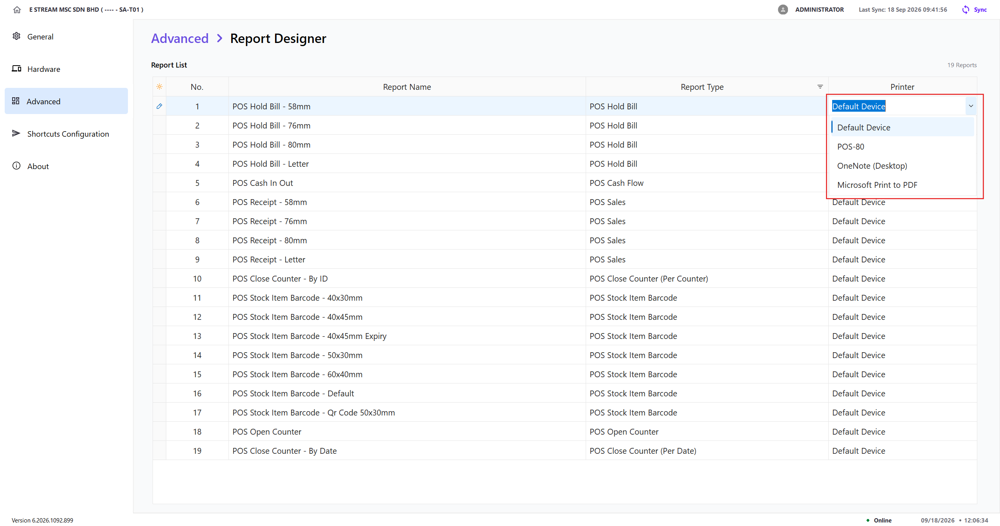

:::note

Select **Default Device** in the **Printer** field to print that report using the printer configured under **Hardware → Receipt Printer**

:::

## Shortcuts Configuration

Click **Shortcuts Configuration**

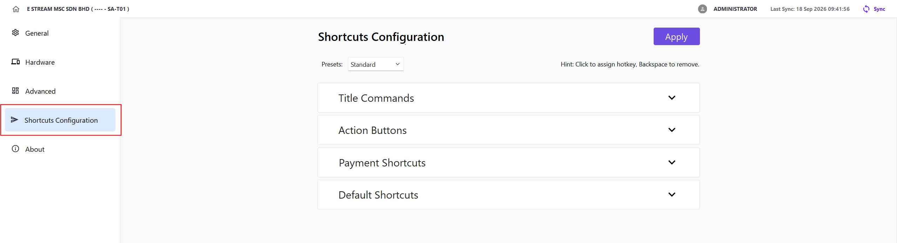

| Section | Description |
| --- | --- |
| **Title Commands** | Configures commands displayed in the POS title area |
| **Action Buttons** | Configures action buttons used during a transaction |
| **Payment Shortcuts** | Configures shortcuts for payment methods during checkout |
| **Default Shortcuts** | Displays the standard POS shortcut list |

### Presets

Use **Presets** to select the command layout used in the Checkout screen

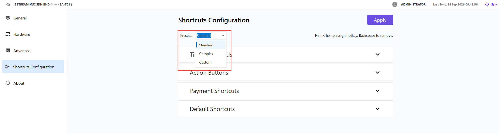

| Preset | Title Commands | Action Buttons |
| --- | --- | --- |
| **Standard** | No preset title commands | **+1**, **-1**, **Quantity**, **Item Disc.**, **Price and UOM**, **Clear Bill**, **Hold Bill**, and **Hold Bill List** |
| **Complex** | **Clear Bill**, **Hold Bill**, **Hold Bill List**, **Search Bill**, **Print Last Receipt**, **Price Checker**, **Open Drawer**, and **Cash In/Out**. | **+1**, **-1**, **Quantity**, **Item Disc.**, **Price and UOM**, **Batch No.**, **Serial No.**, and **Item Template** |
| **Custom** | Displays the active commands configured in **Title Commands** | Displays the active buttons configured in **Action Buttons** |

### Configure a Shortcut

1. Select **Title Commands**, **Action Buttons**, or **Payment Shortcuts**
2. Select the command, action, or payment method to configure
3. Enter the required **Shortcut Key**
4. Set **Active** to make the shortcut available on the POS screen
5. Use the **Up** or **Down** arrow to change the display order for Title Commands or Action Buttons
6. Click **Apply** to save the changes

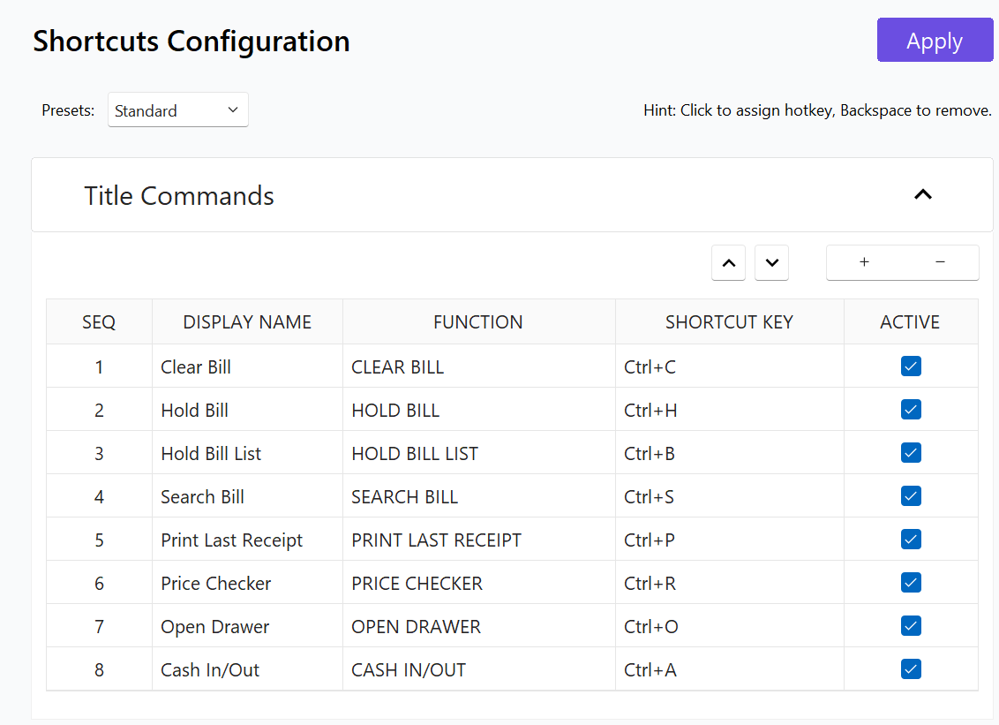

Press **Backspace** in the **Shortcut Key** field to remove an assigned shortcut

:::note

A shortcut key can only be assigned to one command, action, or payment method

:::

### Default Shortcuts

Click **Export** to export the standard shortcut list for reference

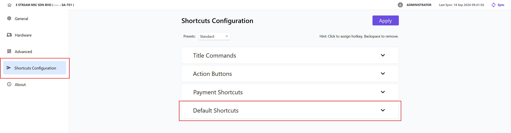
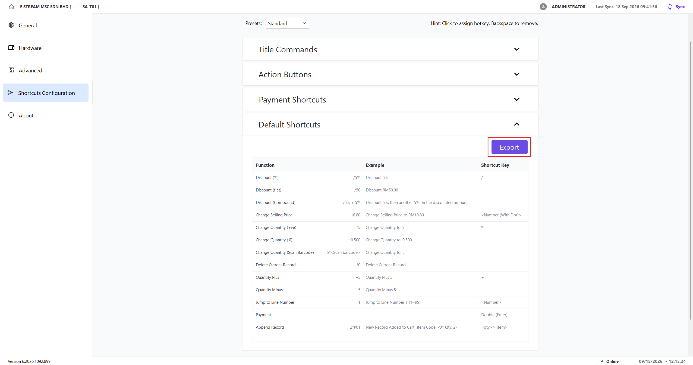

## About

### Location

Click **About → Location**

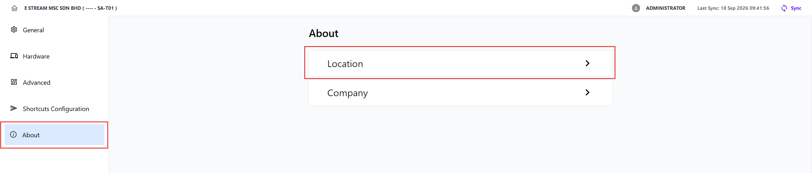
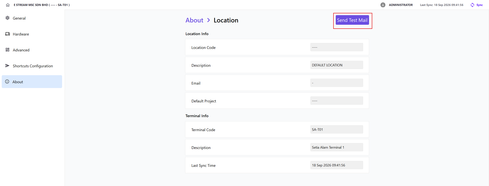

Click **Send Test Mail** to verify the email address configured for the location

| Section | Details |
| --- | --- |
| **Location Info** | Location code, description, email address, default project, and default price tag |
| **Terminal Info** | Terminal code, description, and last synchronisation time |

### Company

Click **About → Company**

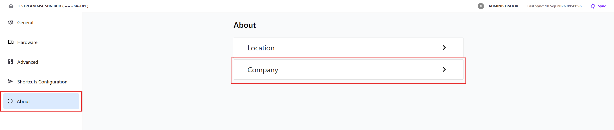
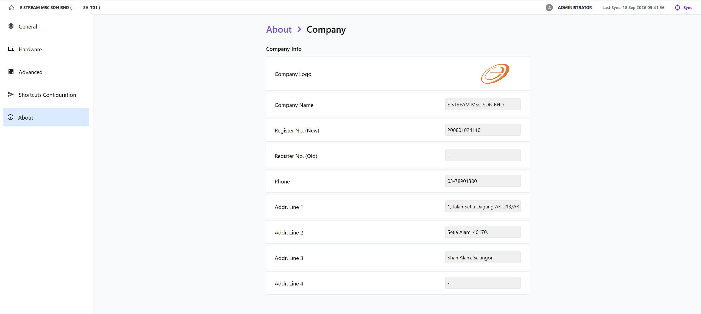

| Section | Details |
| --- | --- |
| **Company Info** | Company logo, company name, old and new registration numbers, phone number, and address lines |
