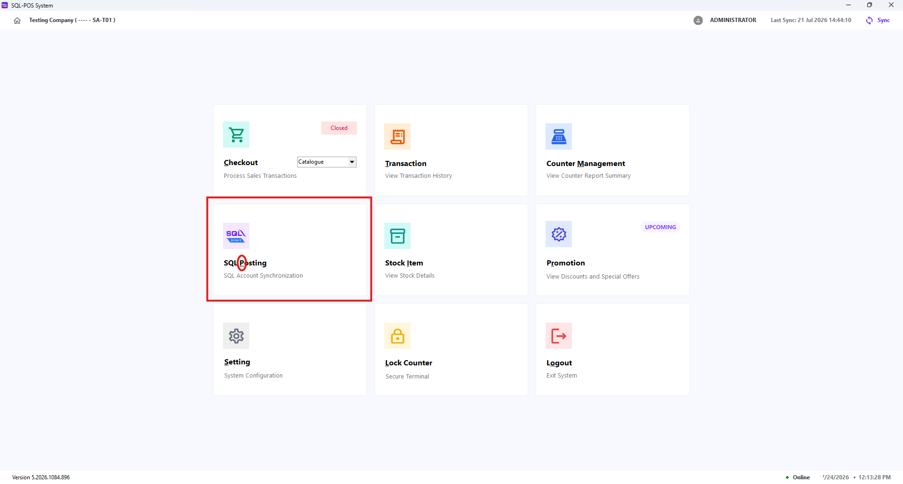
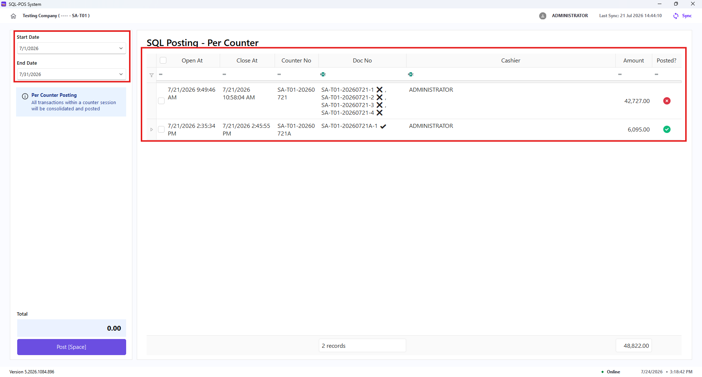
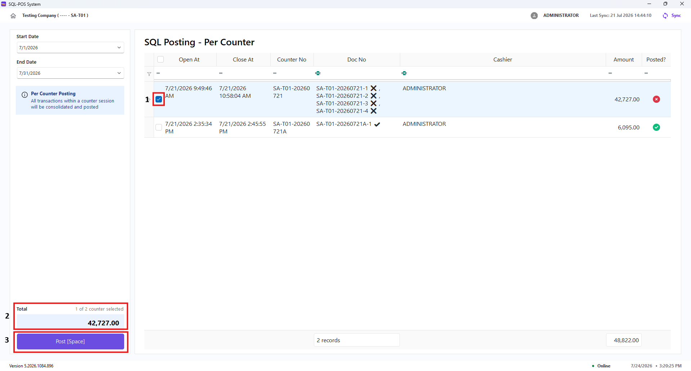
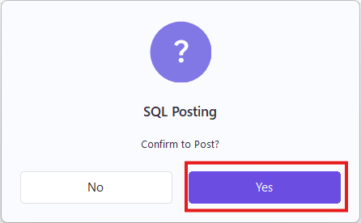
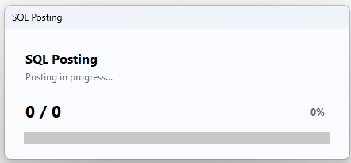
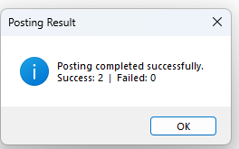
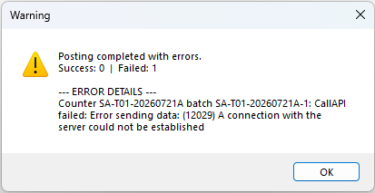

Use **SQL Posting** to send completed XPOS counter sessions to SQL Account. In the current **Per Counter** posting method, all transactions in a selected counter session are consolidated and posted together.

## Before You Start

- Make sure the counter session you want to post has been closed.
- Review the counter’s transactions and total before posting.
- Confirm that your SQL Account connection and posting setup have been completed.

:::note
You need the **Post to SQL Account** access right to open SQL Posting.
:::

## Open SQL Posting

From the XPOS home screen, select **SQL Posting**. You can also press **P** on the keyboard.

## Review Counter Sessions

1. Select the required **Start Date** and **End Date**. The list refreshes automatically when either date is changed.
2. Current **Posting Method** only support **Per Counter**.
3. Review the counter sessions displayed in the table.

| Field | Description |
| --- | --- |
| **Open At** | Date and time the counter session was opened. |
| **Close At** | Date and time the counter session was closed. |
| **Counter No** | The counter-session number. |
| **Doc No** | The document number created for the counter session. |
| **Cashier** | The cashier associated with the session. |
| **Amount** | Total amount for the counter session. |
| **Posted?** | Shows whether the counter session has already been posted to SQL Account. |

Select one or more sessions in the table. The **Total** area shows the number of selected counters and their combined amount.

:::tip
Use the table filters to find a particular counter, cashier, or document number before selecting the sessions to post.
:::

## Post to SQL Account

1. Select the counter sessions to post.
2. Verify the selected count and total amount.
3. Click **Post** or press **Space**.
4. Select **Yes** in the **Confirm to Post?** prompt.  
    
5. Wait for the progress screen to finish. Do not close XPOS while posting is in progress.
    
6. Review the posting result:
   - **Posting completed successfully** shows the number of successful and failed sessions.  
     
   - **Posting completed with errors** shows the successful and failed count, followed by error details. Correct the reported issue before trying again.  
     

After a successful posting, the session's **Posted?** status changes to **Yes**.

## Reposting and Common Messages

- Sessions already marked **Yes** are skipped when posting a mixed selection of posted and unposted sessions.
- If every selected session has already been posted, XPOS displays a message that the selected records have been posted.
- If no new session is posted, XPOS displays **No new records were posted**.
- The **End Date** cannot be earlier than the **Start Date**. If this occurs, XPOS restores the date range to the current month.
