The **Stock Item** page displays the stock items available in X-Pos Terminal.
Use it to find an item and review its general information, customer prices, and
batch numbers.

:::info
All data in the **Stock Item** module is synchronized from SQL Account and is
view-only in X-Pos Terminal. To make changes, update the records in SQL Account,
then select **Sync** in X-Pos Terminal.
:::

## View Stock Items

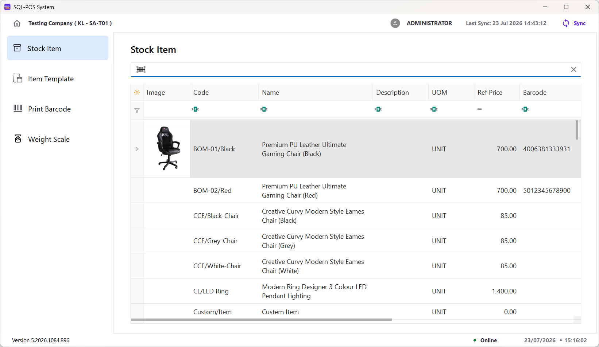

The list can display the following information:

| Column | Description |
| --- | --- |
| **Image** | The stock item's image, if available. |
| **Code** | The unique stock item code. |
| **Name** | The stock item name. |
| **Description** | Additional information about the stock item. |
| **UOM** | The stock item's unit of measurement. |
| **Ref Price** | The reference selling price. |
| **Barcode** | The barcode assigned to the stock item. |
| **Stock Group** | The stock group assigned to the item. |
| **Category** | The category assigned to the item. |
| **Is Active** | Indicates whether the item is active. |
| **Has Serial** | Indicates whether serial-number tracking is enabled for the item. |

Use the horizontal scroll bar to view columns that are outside the visible
area.

### Find a Stock Item

- Enter an item code, name, description, UOM, price, or barcode in the relevant
  filter row to narrow the list.
- Use the search box above the list to scan or enter a barcode.
- Select the **X** in the search box to clear the current search.

## View Stock Item Details

Open a stock item from the list to view its details.

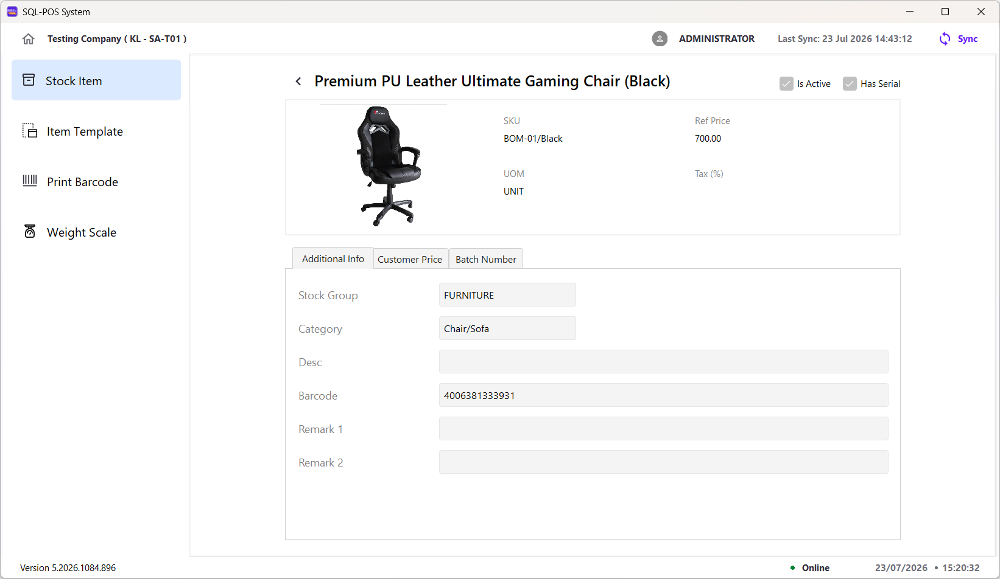

The upper section displays the item's general information:

| Field | Description |
| --- | --- |
| **Image** | The image assigned to the stock item. |
| **Name** | The stock item name. |
| **SKU** | The stock keeping unit or item code. |
| **UOM** | The item's unit of measurement. |
| **Ref Price** | The item's reference price. |
| **Tax (%)** | The tax percentage assigned to the item, if any. |
| **Is Active** | A checked box indicates that the item is active. |
| **Has Serial** | A checked box indicates that serial-number tracking is enabled. |

### View Additional Information

The **Additional Info** tab is displayed when the detail page opens.

| Field | Description |
| --- | --- |
| **Stock Group** | The stock group assigned to the item. |
| **Category** | The category assigned to the item. |
| **Desc** | The item's additional description. |
| **Barcode** | The barcode assigned to the item. |
| **Remark 1** | The item's first remark, if provided. |
| **Remark 2** | The item's second remark, if provided. |

### View Customer Prices

Select the **Customer Price** tab.

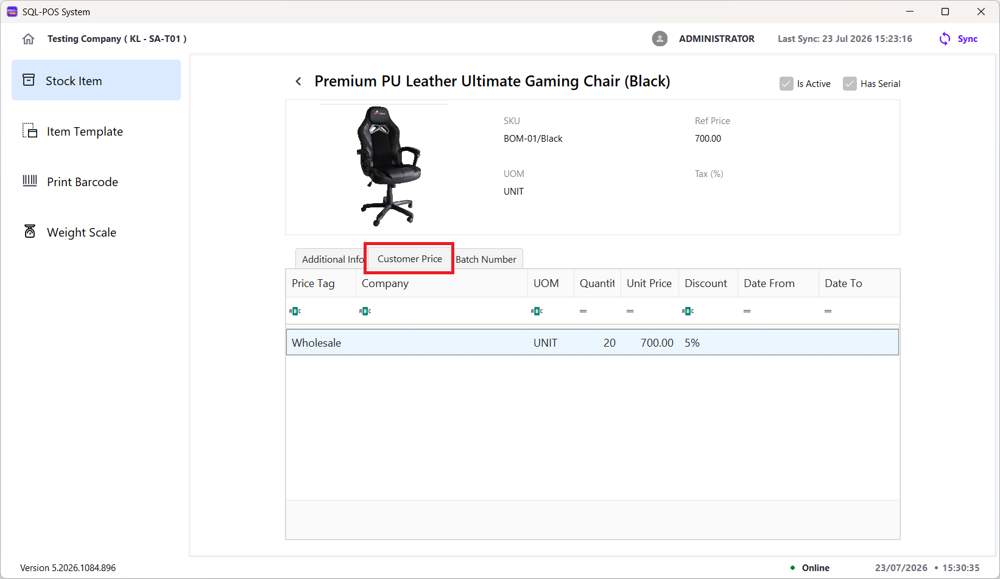

| Column | Description |
| --- | --- |
| **Price Tag** | The name of the customer price setting. |
| **Company** | The company assigned to the price setting, if any. |
| **UOM** | The UOM to which the price setting applies. |
| **Quantity** | The quantity associated with the price setting. |
| **Unit Price** | The unit price for the price setting. |
| **Discount** | The discount applied to the price setting. |
| **Date From** | The start date of the price setting, if specified. |
| **Date To** | The end date of the price setting, if specified. |

### View Batch Numbers

Select the **Batch Number** tab.

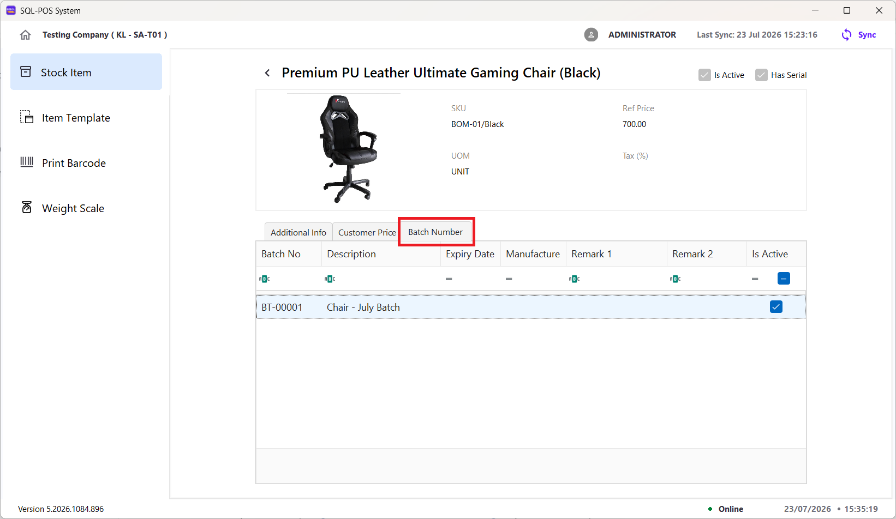

| Column | Description |
| --- | --- |
| **Batch No** | The batch number assigned to the item. |
| **Description** | The batch description. |
| **Expiry Date** | The batch expiry date, if specified. |
| **Manufacture Date** | The batch manufacturing date, if specified. |
| **Remark 1** | The first batch remark, if provided. |
| **Remark 2** | The second batch remark, if provided. |
| **Is Active** | A checked box indicates that the batch is active. |

Select the **back arrow** beside the item name to return to the stock item list.

## Item Template

**Menu: Stock Item → Item Template**

The **Item Template** page displays predefined item packages or sets. Each
template can contain several stock items with their own quantities and unit
prices.

> The Item Template module must be enabled, and templates must be maintained in
> SQL Account before they can be synchronized to X-Pos Terminal.

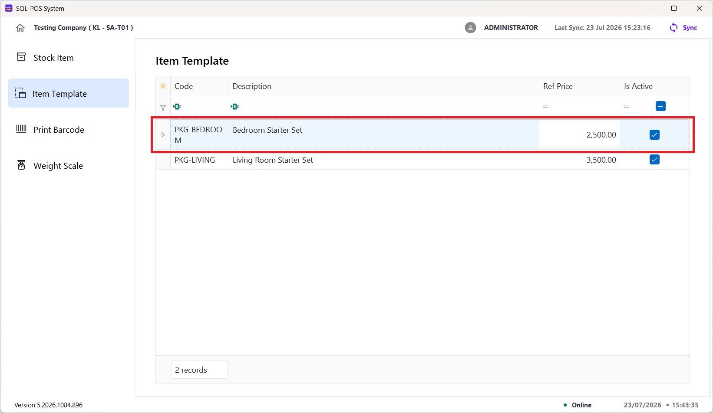

| Column | Description |
| --- | --- |
| **Code** | The unique code used to identify the item template. |
| **Description** | The name or purpose of the template. |
| **Ref Price** | The reference price for the complete template. |
| **Is Active** | A checked box indicates that the template is active. |

### View Items Template Details

Double-click a template in the list to view the stock items it contains.

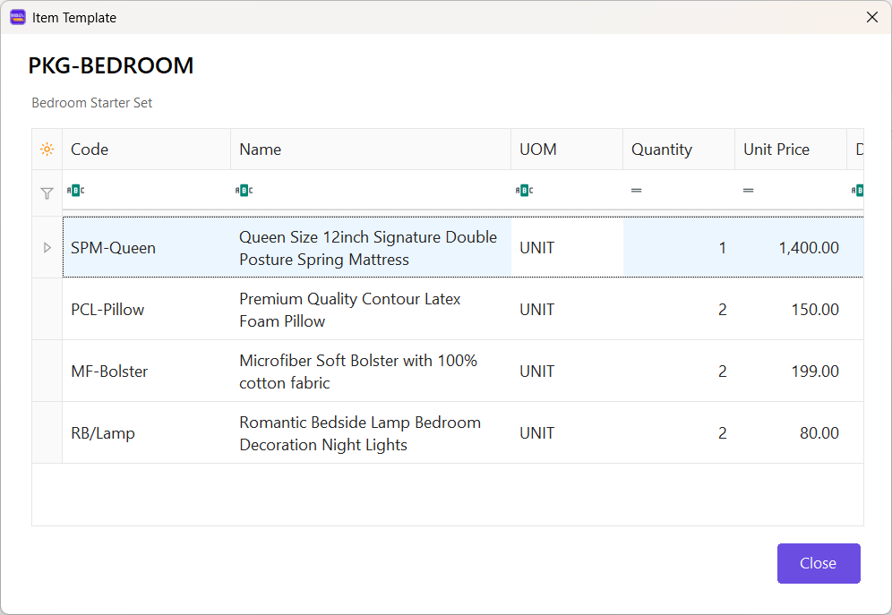

| Column | Description |
| --- | --- |
| **Code** | The stock item code. |
| **Name** | The stock item name. |
| **UOM** | The unit of measurement used by the template. |
| **Quantity** | The number of units included in the template. |
| **Unit Price** | The price of one unit of the stock item before discount. |
| **Discount** | The discount applied to the stock item, if any. |
| **Total Price** | The line total calculated from the quantity and unit price after discount. |
| **Is Printable** | A checked box indicates that the item is included in printed output when the template is used. |

Select **Close** to return to the Item Template list.

## Print Barcode

**Menu: Stock Item → Print Barcode**

Use the **Print Barcode** page to select stock items, choose a barcode layout,
set the number of labels, preview the result, and send the labels to a barcode
printer.

### Prepare the Barcode Labels

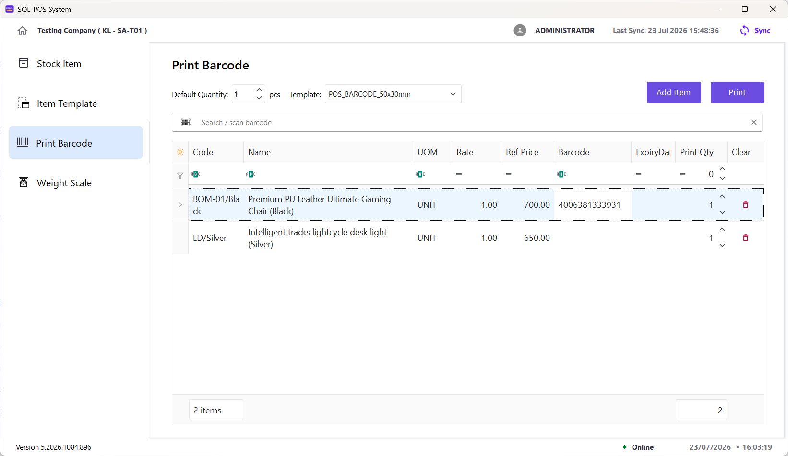

1. Set **Default Quantity**. This is the initial number of labels assigned to
   each item added to the print list.
2. Select a **Template** that matches the required barcode layout and label
   size.
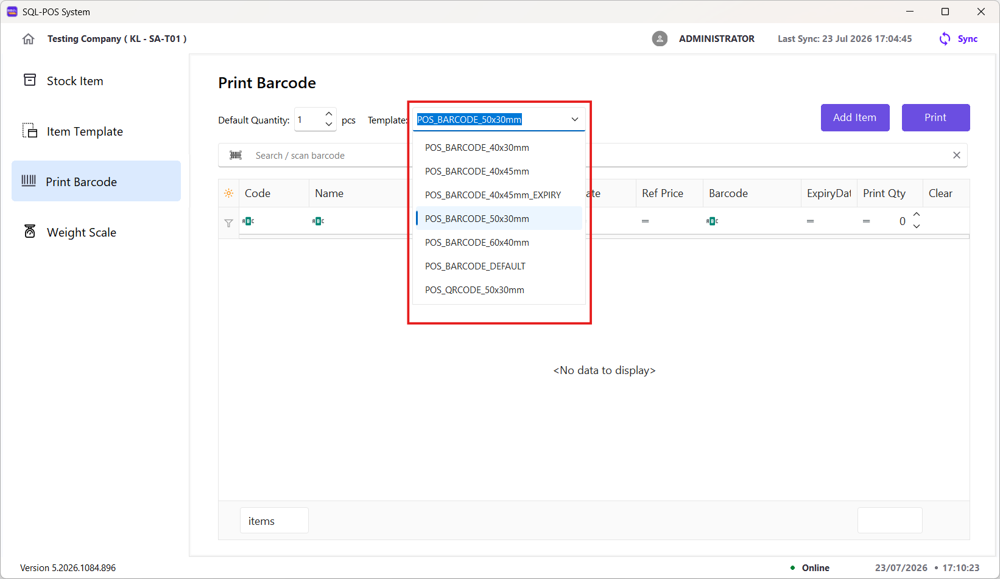
3. Add items in either of these ways:
   - Scan or enter a barcode in the **Search / scan barcode** box.
   - Select **Add Item**, choose one or more items, and then select **Apply**.
4. Check the item information and adjust **Print Qty** for each item.
5. Select the bin icon under **Clear** to remove an item that should not be
   printed.
6. Select **Print** to open the barcode preview.

### Add Multiple Items

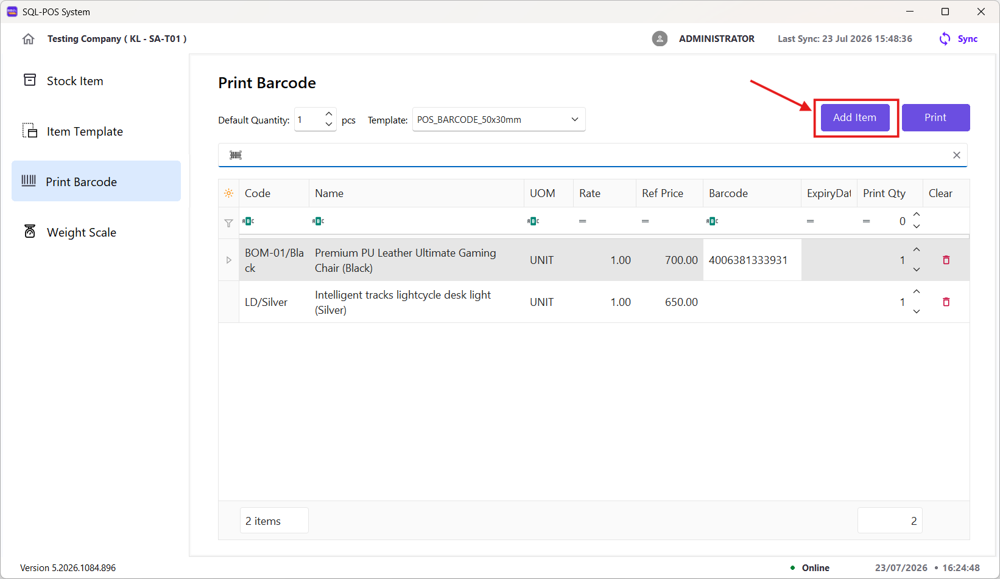

In the **Select Item** window:

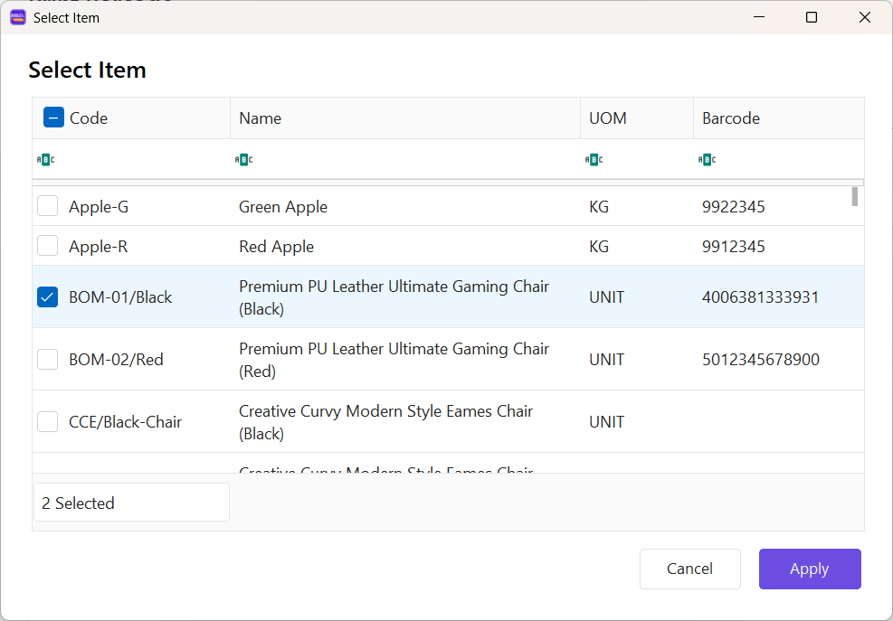

1. Check the box beside each item to be added.
2. Review the number of selected items at the bottom of the window.
3. Select **Apply** to add them to the print list, or **Cancel** to close the
   window without applying the selection.

> Can use the filter row to find the required items.

### Preview and Print

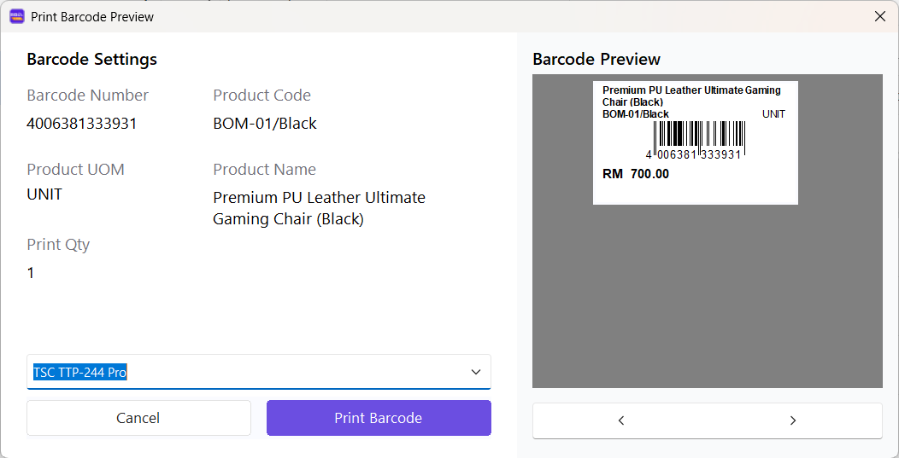

Before printing, confirm the information under **Barcode Settings**:

| Field | Description |
| --- | --- |
| **Barcode Number** | The barcode encoded in the label. |
| **Product Code** | The stock item code printed on the label. |
| **Product UOM** | The item's unit of measurement. |
| **Product Name** | The stock item name printed on the label. |
| **Print Qty** | The number of labels to print for the item. |

The **Barcode Preview** shows how the selected template will appear when
printed. If multiple items were added, use the left and right arrows below the
preview to check each label.

Select the required printer from the printer list, then select **Print
Barcode**. Select **Cancel** to return without printing.

> Use an expiry-date template when an expiry date must appear on the barcode
> label. Always check the preview and print quantity before printing.

## Weight Scale

**Menu: Stock Item → Weight Scale**

The **Print Weight Scale** page displays stock item information prepared for
use with a weighing scale.

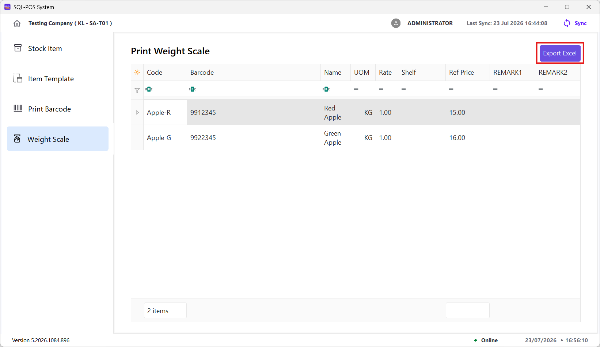

| Column | Description |
| --- | --- |
| **Code** | The stock item code. |
| **Barcode** | The barcode assigned to the item. |
| **Name** | The stock item name. |
| **UOM** | The item's unit of measurement, such as KG. |
| **Rate** | The UOM conversion rate maintained for the item. |
| **Shelf** | The shelf or rack number maintained for the item, if any. |
| **Ref Price** | The item's reference price. |
| **REMARK1** | The item's first remark, if provided. |
| **REMARK2** | The item's second remark, if provided. |

### Export Weight-Scale Items

1. Review the weight-scale items displayed on the page.
2. Use the filter row below the column headings to narrow the on-screen list if
   required. The filter is for viewing only and does not affect the export.
3. Select **Export Excel**. The system exports all weight-scale items that match
   the prefix configured in **Settings**, including items hidden by the current
   filter.
4. The system generates `Rongta_RSL1000_PLU_Export.xls` for use with the Rongta
   RLS1000 weighing scale.
