Use the **Transaction** screen to find completed XPOS sales, review their details, print receipts, and perform permitted follow-up actions.

:::note
You need the relevant user access rights before you can void a bill or edit payment details.
:::

## Open Transaction

From the XPOS home screen, select **Transaction**. You can also press **T** on the keyboard.

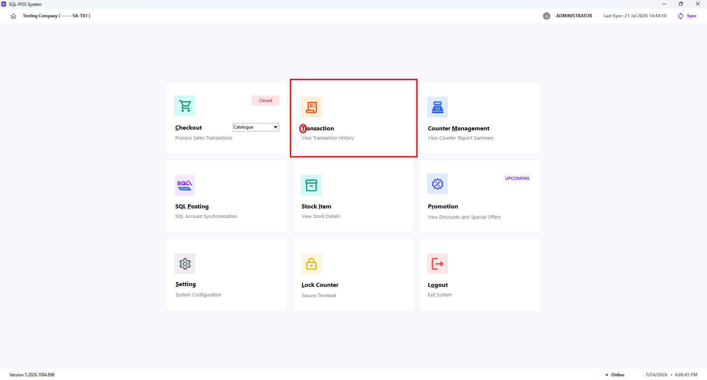

By default, XPOS displays transactions for the current day.

## Find a Transaction

### Quick Filter

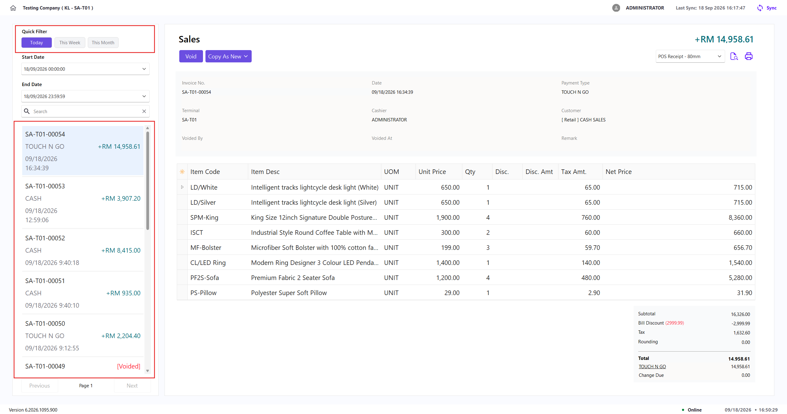

Use **Quick Filter** to display transactions from a commonly used date range without entering the dates manually.

| Quick filter | Date range |
| --- | --- |
| **Today** | From the start to the end of the current day |
| **This Week** | From the first to the last day of the current week |
| **This Month** | From the first to the last day of the current month |

:::note

Changing the **Start Date** or **End Date** manually clears the selected quick filter and applies the custom date range instead.

:::

### Custom Date Range and Search

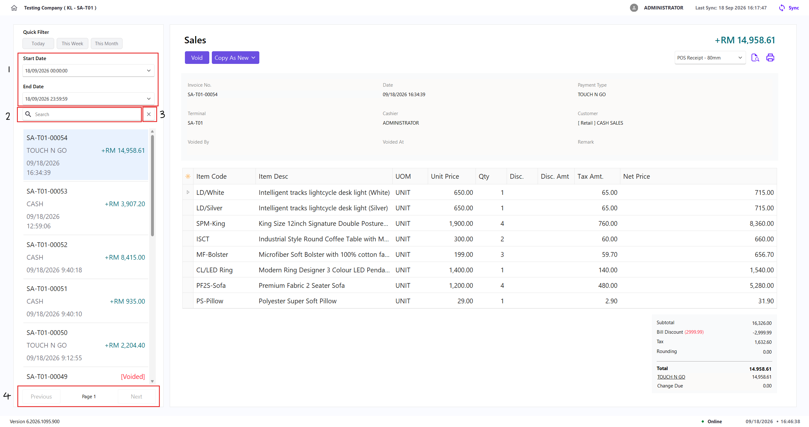

1. Select a **Start Date** and **End Date** to display transactions within the required period. The list refreshes automatically when either date changes.
2. Enter a search term to narrow the results within the selected date range. You can search by a partial document number or exact counter number.
3. Use the clear button in the search field to remove the search term and reload the list.
4. Use **Previous** and **Next** to move between pages when more results are available.

:::note
The **End Date** cannot be earlier than the **Start Date**. If this happens, XPOS changes the other date to match your selection.
:::

## Review Transaction Details

Select a transaction in the list to display its details on the right side of the screen.

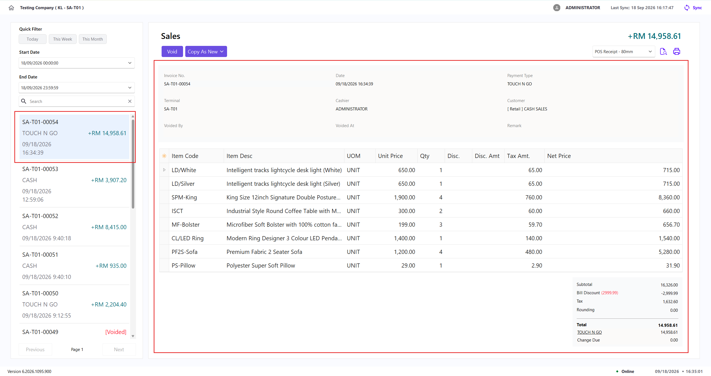

The detail panel displays:

| Section | Information available |
| --- | --- |
| **Transaction Information** | Invoice number, date, payment type, terminal, cashier, customer, price tag, and reference number. |
| **Items** | Item code, description, UOM, unit price, quantity, batch number, serial number, discount, tax, and net price. |
| **Payment Summary** | Payment method and payment amount. |
| **Totals** | Subtotal, tax, bill discount, rounding, and total. |
| **Void Information** | For voided transactions, the user who voided it, date and time voided, and the entered remark. |

### View or Edit Payment Details

1. Select a transaction.
2. Click the underlined payment method.
3. Review the **Method**, **Rate**, **Amount**, and **Refer No.**
4. To make changes, click the **Edit** icon.
5. Select the required payment method, update the reference number if needed, and click **Save**.

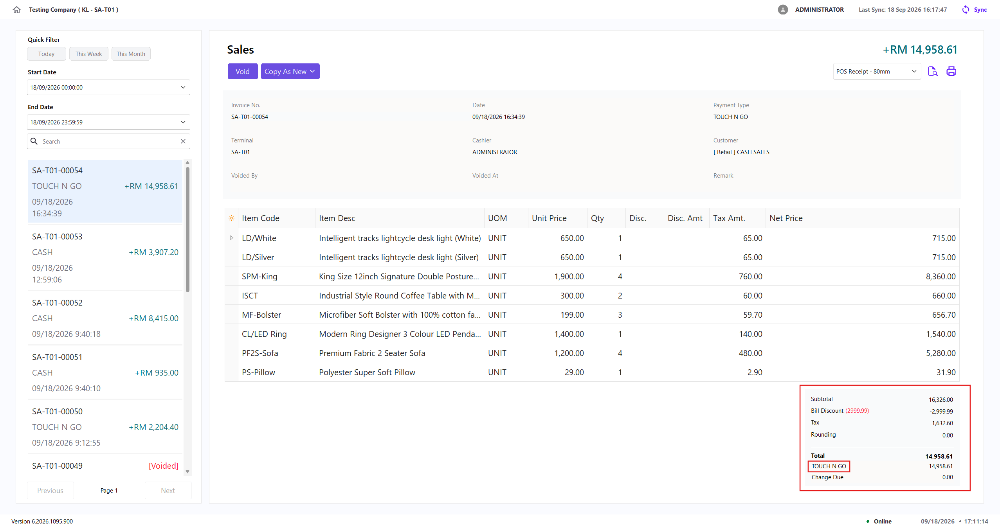

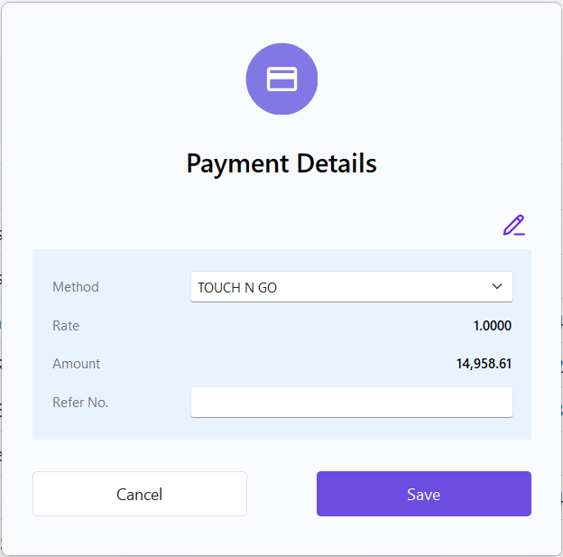

:::note

- Editing requires the relevant **Edit Transaction** access right
- Payment details can only be edited from the same open counter session in which the transaction was created

:::

## Preview or Print a Receipt

1. Select a transaction.
2. Select the required receipt template.
3. Select the **Preview** icon to view the receipt, or the **Print** icon to print it.

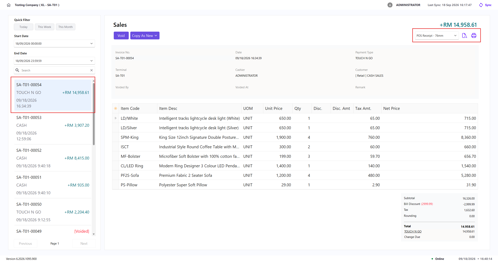

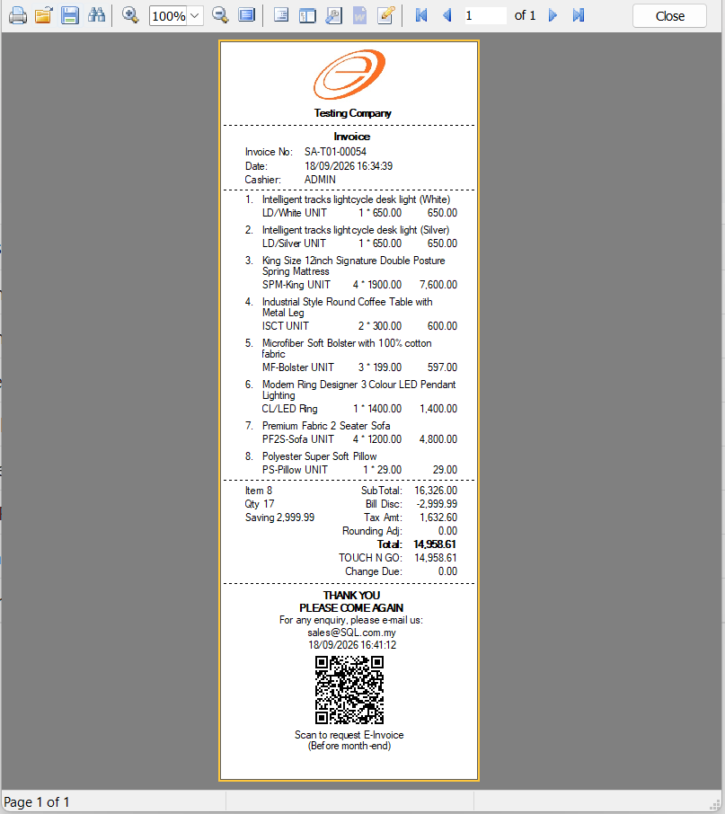

## Void a Bill

Use this function only when a completed sale must be cancelled. A voided transaction remains in the history and is identified as **Voided**.

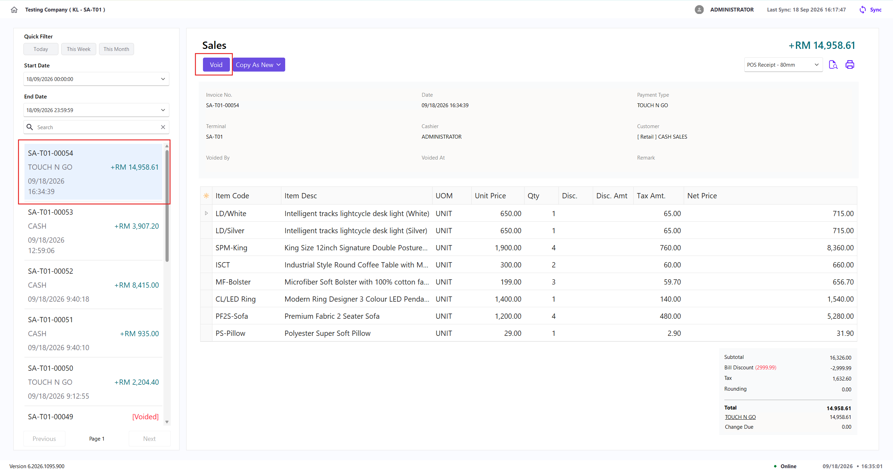

1. Select the sale to void.
2. Click **Void**.
3. Enter a remark if needed. The remark is optional and can contain up to 150 characters.
4. Click **Void** to confirm, or **Cancel** to return without making changes.  
   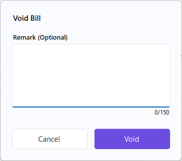

:::warning
You can void a bill only from the currently open counter session, and only before it has been posted to SQL Account. XPOS blocks voiding for sales from another counter session or sales that have already been posted.
:::

### Voiding an Integrated Payment

If the sale was processed through **Fiuu**, **Gkash**, or **Adaptis**, X-Pos also attempts to reverse the payment with the provider when the bill is voided.

If the provider reversal fails, X-Pos displays a warning with these options:

- Select **Abort** to keep the sale as not voided in X-Pos
- Select **OK** to void the sale in X-Pos and reconcile the provider payment manually

:::warning

Before selecting **OK**, check the payment terminal or provider portal to confirm the payment status. A locally voided sale may still require a manual void or refund through the provider.

:::

## Copy a Sale as a New Bill

Use **Copy As New** to place the selected transaction’s items into a new Checkout bill.

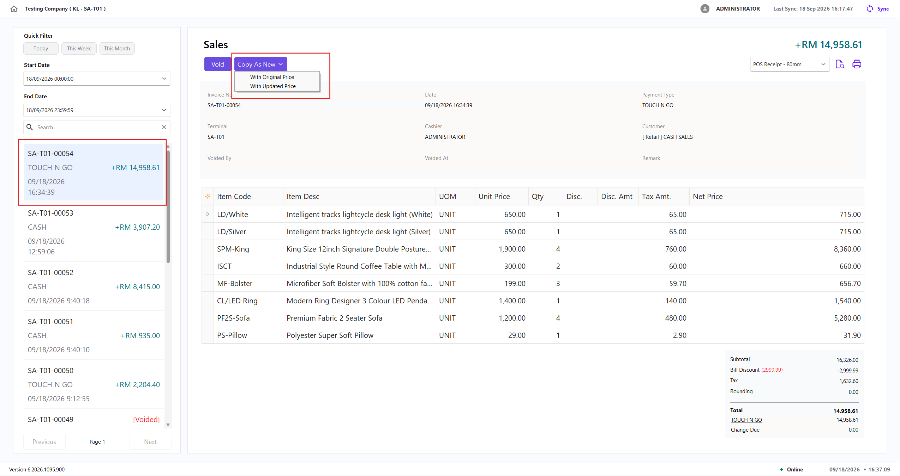

1. Select the transaction.
2. Click **Copy As New**.
3. Select one of the price options:
   - **With Original Price** keeps the prices from the original transaction.
   - **With Updated Price** uses the current item prices.
4. Continue the new bill in Checkout.  
   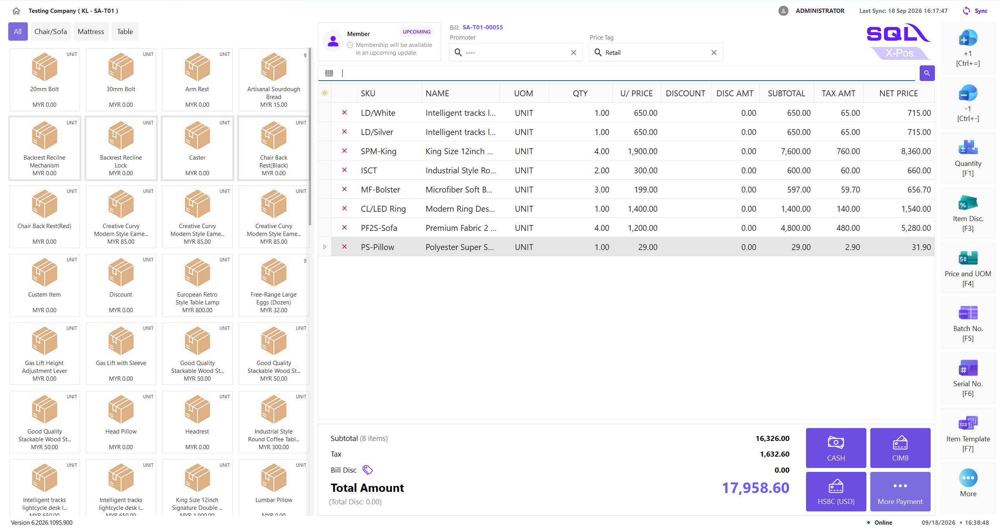

The counter must be open before you can copy a transaction as a new bill.
