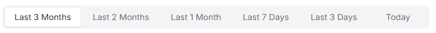
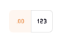
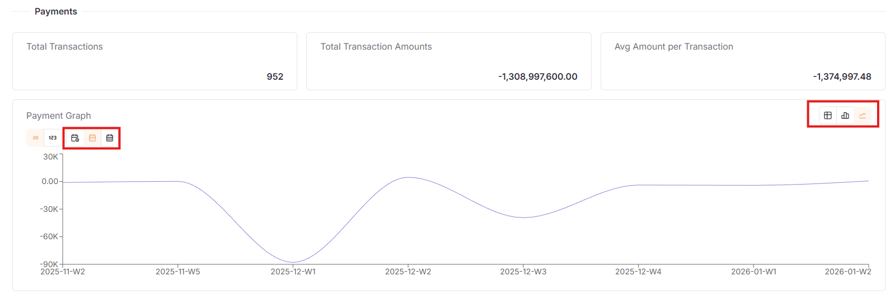
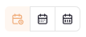
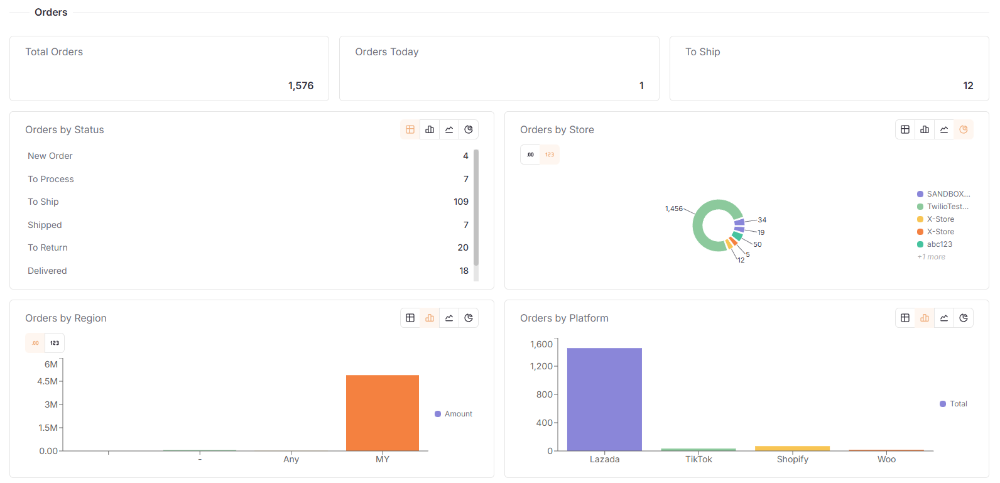
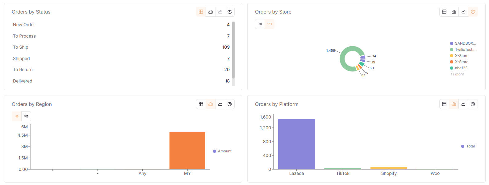
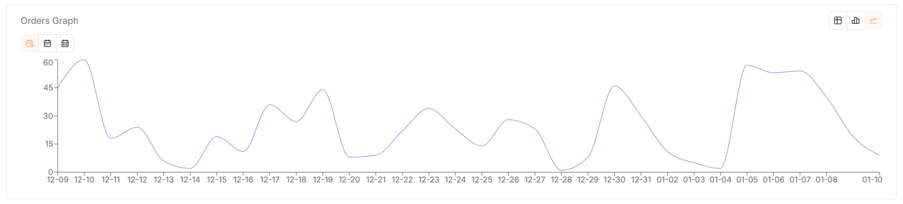
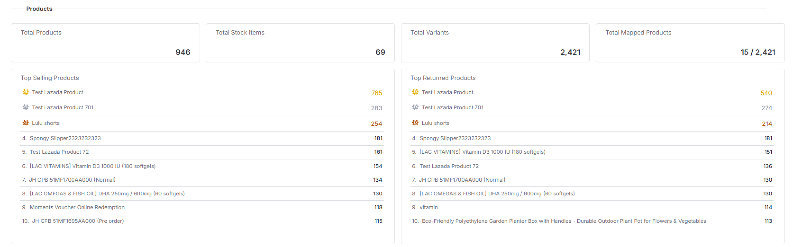
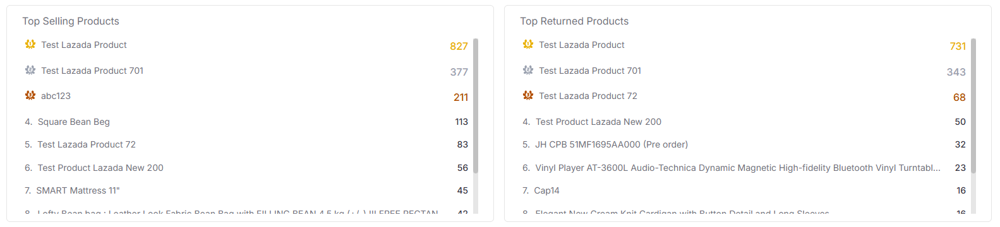
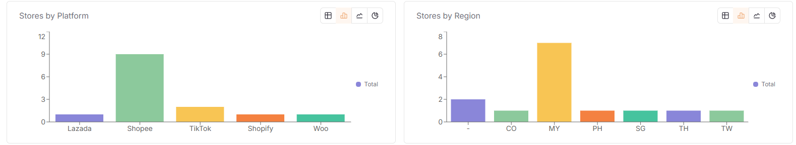

## Dashboard Overview

The **Dashboard** is the main page where you can see how your stores are doing. It shows you latest information on sales, orders, stock, and if your stores are connected properly.

### Date Filter

Pick a time period to see its data. You can choose:

- **Today**
- **Last 3 Days**
- **Last 7 Days**
- **Last 1 Month**
- **Last 2 Months**
- **Last 3 Months** (Default view)

### Choose What to See

Pick what kind of numbers you want to see:

- **Amount**: Show the total money from sales for that time.
- **Total**: Show the total number of sales for that time.

### Chart Types

Choose how you want the numbers to look:

- **Bar Chart**: Shows numbers as vertical bars to compare different times.
- **Line Chart**: Shows a line to see if sales are going up or down.
- **Pie Chart**: Shows a circle divided into parts to see which time had more sales.
- **Table**: Shows exact numbers in a list.

## Payments Section

This part shows you the money side of your business.

### Main Numbers

- **Total Transactions**: Total number of payments received.
- **Total Transaction Amounts**: Total amount of money from all payments.
- **Avg Amount per Transaction**: The average money made from one sale.

### Payment Chart

A picture showing your payment trends. You can change how it looks using the buttons on the top-right.

**Group by Time**

Choose how to bundle your payment data:

- **Day**: See total money for each day.
- **Week**: See total money for each week.
- **Month**: See total money for each month.

> **Tip**: Try different chart types with different time groups. For example, use a line chart with "Day" to see small changes, or a bar chart with "Month" to see how you did over several months.

## Orders Section

This part shows you how many orders you have and where they come from.

### Order Numbers

- **Total Orders**: The total number of orders you have received.
- **To Ship**: How many orders are waiting for you to send out.
- **Orders Today**: How many orders you got today.

### Order Details

- **Orders by Store**: Shows which individual store (like a specific Lazada or Shopee store) is getting orders.
- **Orders by Status**: Shows all orders status from all the stores.
- **Orders by Region**: Shows which country or area the orders are coming from (like MY or SG).
- **Orders by Platform**: Compare how many orders come from Lazada vs Shopee vs other sites.

- **Orders Chart**: A line or bar showing if you are getting more or fewer orders over time.

## Products Section

Check your stock and how well your items are selling.

### Stock Numbers

- **Total Products**: How many different types of items you sell.
- **Total Stock Items**: The total count of all items you have ready to sell.
- **Total Variants**: The count of different choices for items (like different sizes or colors).
- **Total Mapped Products**: How many items are correctly linked between your online store and SQL Account.

### Product Info

- **Top Selling Products**: A list of your most popular items.
- **Top Returned Products**: Items that customers send back most often. This helps you find problems with certain products.

## Stores Section

Manage your different selling channels.

### Store Numbers

- **Total Stores**: The total number of online stores you have connected.
- **Active Stores**: How many stores are currently working and sharing data.

### Store Locations

- **Stores by Platform**: Shows how many stores you have for Lazada, Shopee, or TikTok and more.
- **Stores by Region**: Shows where your stores are located (like MY, SG, and more).
