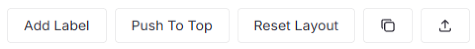
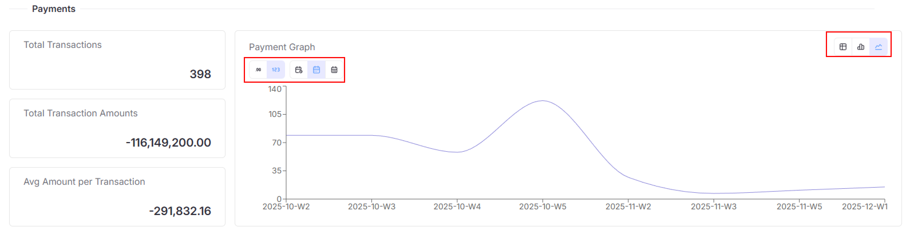
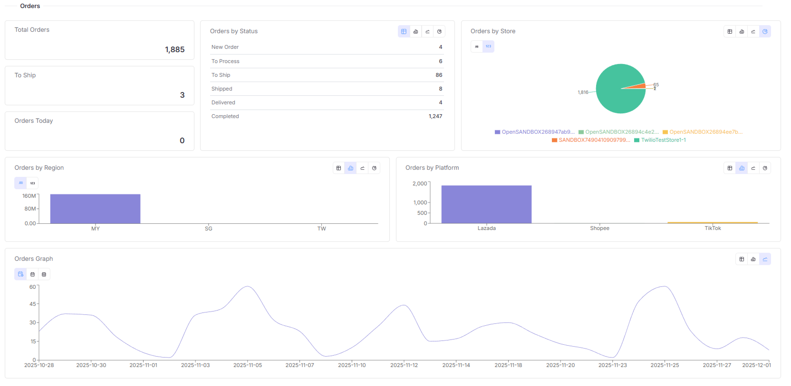
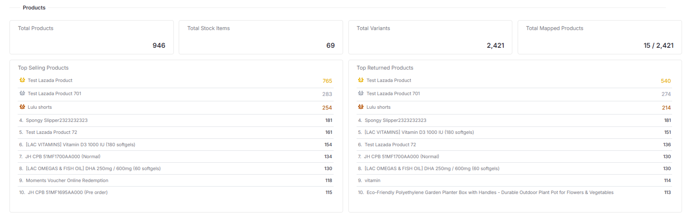
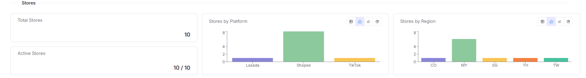

# Dashboard Overview

The **Dashboard** serves as the central hub for monitoring your e-commerce performance. It provides real-time insights into sales, orders, inventory, and store connectivity across all your integrated platforms.

---

### Date Range Filter
Select a time period to view data for that specific range. Options include:
- **Today**
- **Last 3 Days**
- **Last 7 Days**
- **Last 1 Month**
- **Last 2 Months**
- **Last 3 Months** (Default)

### Layout Actions

- **Add Label**: Insert custom labels to organize sections.
- **Push To Top**: Move widgets to the top of the view.
- **Reset Layout**: Revert the dashboard to its default arrangement.
- **Copy Layout**: Copy the current dashboard layout configuration.
- **Apply Layout**: Apply the dashboard data or layout settings.

---

## Payments Section

This section provides a financial overview of your transactions.

### Key Metrics
- **Total Transactions**: The total number of payment transactions within the selected period.
- **Total Transaction Amounts**: The cumulative value of all transactions.
- **Avg Amount per Transaction**: The average value of a single transaction.

### Payment Graph
A visual representation of payment trends over time. You can customize the visualization using the controls in the top-right corner of the widget.

#### Visualization Controls

**Metric Selection**
- **Amount**: Display the total transaction amounts for the selected time period (default view)
- Additional metrics may be available depending on your configuration

**Time Period Grouping**

Choose how to aggregate your payment data:
- **Day**: View daily transaction totals, ideal for tracking day-to-day performance
- **Week**: Aggregate data by week, useful for identifying weekly patterns and trends
- **Month**: Group transactions by month, perfect for long-term analysis and reporting

**Chart Types**

Select the visualization format that best suits your needs:
- **Bar Chart**: Compare transaction amounts across different time periods with vertical bars
- **Line Chart**: Visualize trends and patterns over time with a continuous line graph
- **Table**: View detailed numerical data in a structured table format for precise analysis

> **Tip**: Combine different time periods with chart types to gain different insights. For example, use a line chart with daily grouping to spot short-term trends, or switch to monthly grouping with a bar chart for quarterly reviews.
---

## Orders Section

The Orders section offers a comprehensive breakdown of your order processing status and sources.

### Order Metrics
- **Total Orders**: Cumulative count of orders received.
- **To Ship**: Number of orders currently pending shipment.
- **Orders Today**: Count of orders received in the current day.

### Orders by Status
A detailed list showing the count of orders in each stage of the fulfillment process:
- **New Order**
- **To Process**
- **To Ship**
- **Shipped**
- **Delivered**
- **Completed**

### Order Analytics
- **Orders by Store**: A pie chart showing the distribution of orders across your different connected stores (e.g., specific Lazada or Shopee stores).
- **Orders by Region**: A bar chart displaying order volume by country or region (e.g., MY, SG).
- **Orders by Platform**: A bar chart comparing performance across different e-commerce platforms (Lazada, Shopee, Shopify, etc.).
- **Orders Graph**: A line graph illustrating the trend of order volume over the selected date range.

---

## Products Section

Monitor your inventory health and product performance.

### Inventory Metrics
- **Total Products**: The total number of unique products in your catalog.
- **Total Stock Items**: The total quantity of stock available.
- **Total Variants**: The count of product variations (e.g., size, color).
- **Total Mapped Products**: The number (and ratio) of products successfully mapped between your e-commerce platforms and SQL Account.

### Product Insights
- **Top Selling Products**: A ranked list of your best-performing items based on sales volume.
- **Top Returned Products**: A list of products with the highest return rates, helping you identify potential quality or description issues.

---

## Stores Section

Manage the connectivity and distribution of your sales channels.

### Store Metrics
- **Total Stores**: The total number of e-commerce stores integrated.
- **Active Stores**: The number of stores currently active and syncing data.

### Store Distribution
- **Stores by Platform**: A bar chart showing how many stores you have connected for each platform (Lazada, Shopee, TikTok, Shopify).
- **Stores by Region**: A bar chart displaying the geographic distribution of your stores (e.g., CO, MY, SG, TH, TW, US).
