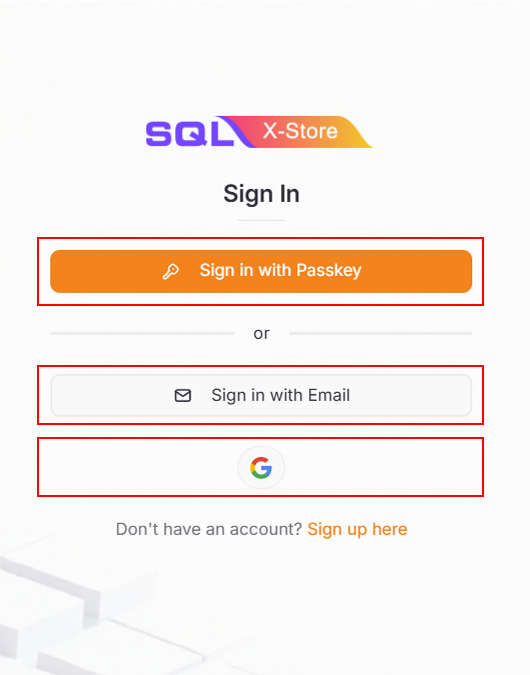
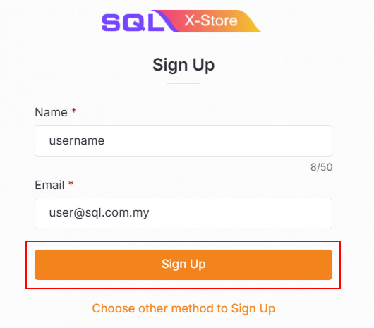
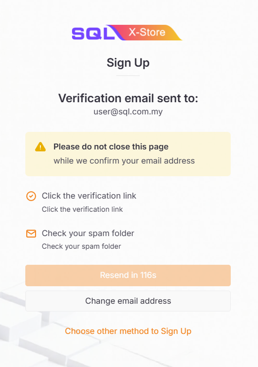

## Sign In

If you already have an account, you can [sign in](https://x-store.sql.com.my/login) using one of the following methods:

- **Sign in with Passkey** - Use your registered passkey for quick and secure access.
- **Sign in with Email** - Enter your email address and click the verification link to sign in.
- **Google Single Sign-On (SSO)** - Sign in with your Google account (Gmail only). Click the Google button, select your Gmail account, and you'll be signed in automatically.

For detailed instructions, please refer to the [sign up section](#sign-up) below.

  

## Sign Up

If you don't have an account yet, click [sign up here](https://x-store.sql.com.my/register) to create a new account.

### Sign Up with Passkey

Passkeys provide a secure, passwordless way to access your account.

1. Click **Sign up here** on the sign-in page

   

2. Select **Sign up with Passkey**

   

3. Enter your **User Name** and **Passkey Name**

   :::info
   This passkey name will be displayed on your phone as an option during authentication.
   :::

4. Click **Sign Up**

   

5. Choose the option:

   - iPhone, iPad, or Android device

   

6. Use your smartphone to scan the QR code displayed

   :::info
   Ensure both **Bluetooth** and **Wi-Fi/Mobile data** are turned on for both your laptop and smartphone.
   :::

   

7. Complete the passkey registration on your device

8. Once successful, you'll be redirected to the **Company List** page

### Sign Up with Email

For email-based registration:

1. Click **Sign up here** on the sign-in page

   

2. Select **Sign up with Email**

   

3. Enter your **Name** and **valid email address**

4. Click **Sign Up**

   

5. Check your email inbox for a verification link

   :::info
   The verification link expires in 2 minutes.
   :::

   

6. Click the **verification link** in the email

   

7. Your account is now successfully created

   

8. Once successful, you'll be redirected to the **Company List** page

## Company List Page

After successful sign-in or sign-up, you'll land on the **Company List** page.

Here you can:

- View all companies you've created
- View companies you've joined
- Create a new company

