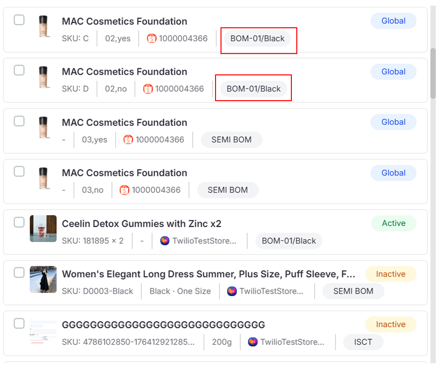
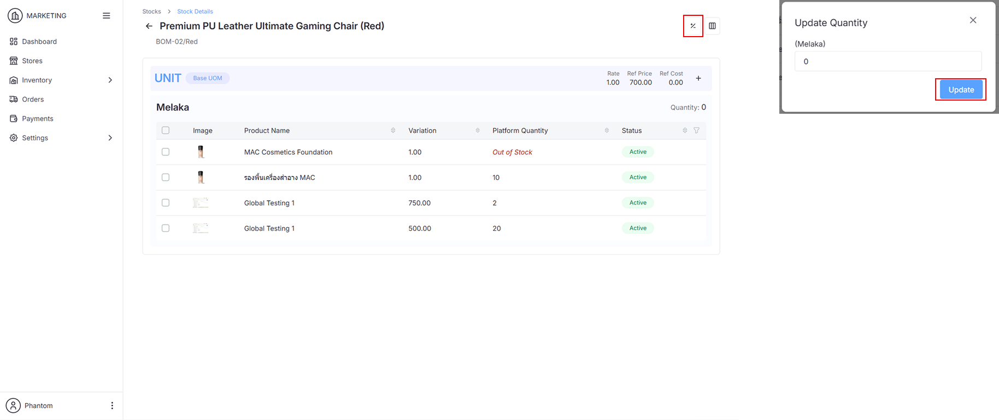

## Products Page

### Map Products

1. Go to **Inventory > Products**

   

2. Click the **Map Product Button** to open the **Map Product Dialog**

   

   

   :::info
   Use the **Filter Button** to narrow your **Platform Products View**, or use the **Search Bar** to find specific ecommerce products and stock items.
   :::

3. Select ecommerce products synced from various platforms and map them to stock items synced from SQL Account

   

   

   :::info
   **Ecommerce Products** are mapped to **Stock Item UOM**.
   :::

4. To unmap products, select them and click **Unmap**

   

   

## Stocks Page

### Map Products to Specific Stock Items

1. Go to **Inventory > Stocks**

   

2. Click the icon to view stock details

   

   :::info
   - **Map Product** can be performed here as well
   - **Location Description** and **Code** are fetched from SQL Account
   :::

3. Click the **+** icon to open the **Map Product Dialog**

   

4. Select the **Platform Product** and click **Map Product** to map it directly to this **Stock Item UOM**

   

   :::info
   Ensure your store is mapped to the correct stock item location, or mapped items won't appear.
   :::

### Update Quantity

1. Click the **+/-** icon to update the ecommerce platform product quantity

   

   :::info
   The ecommerce platform quantity is based on the current quantity of stock items in the location mapped to your store.
   :::
