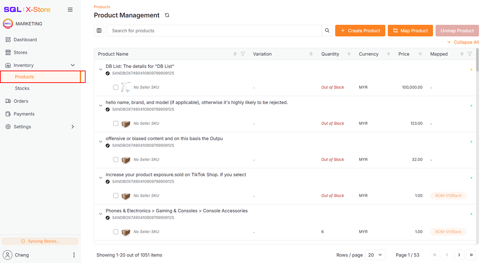
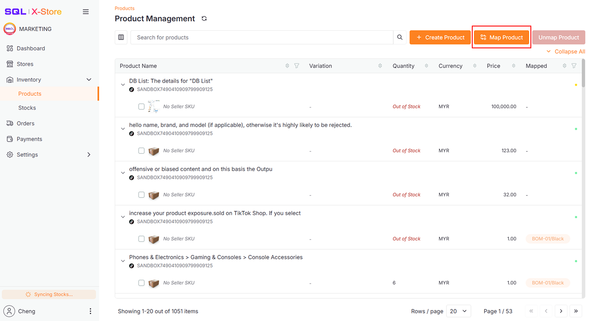
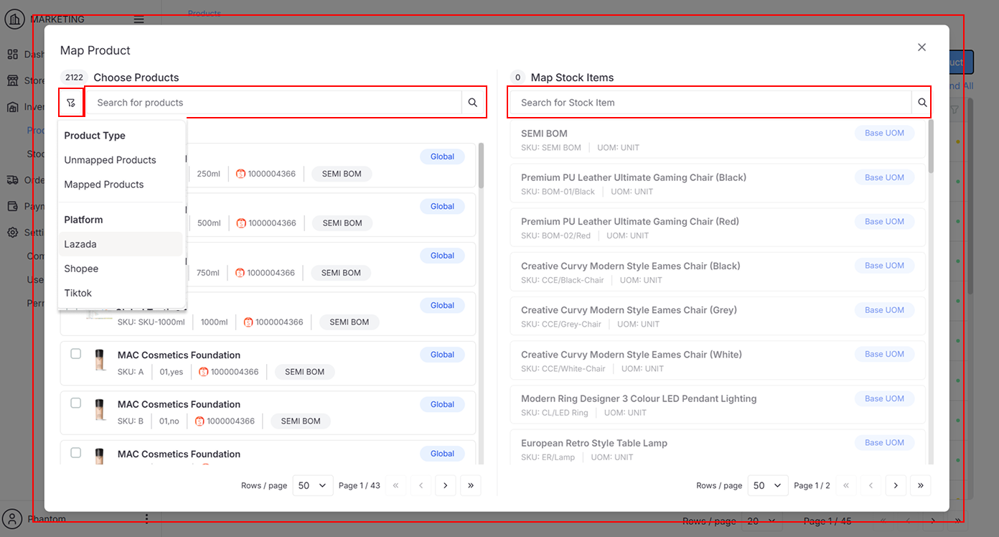
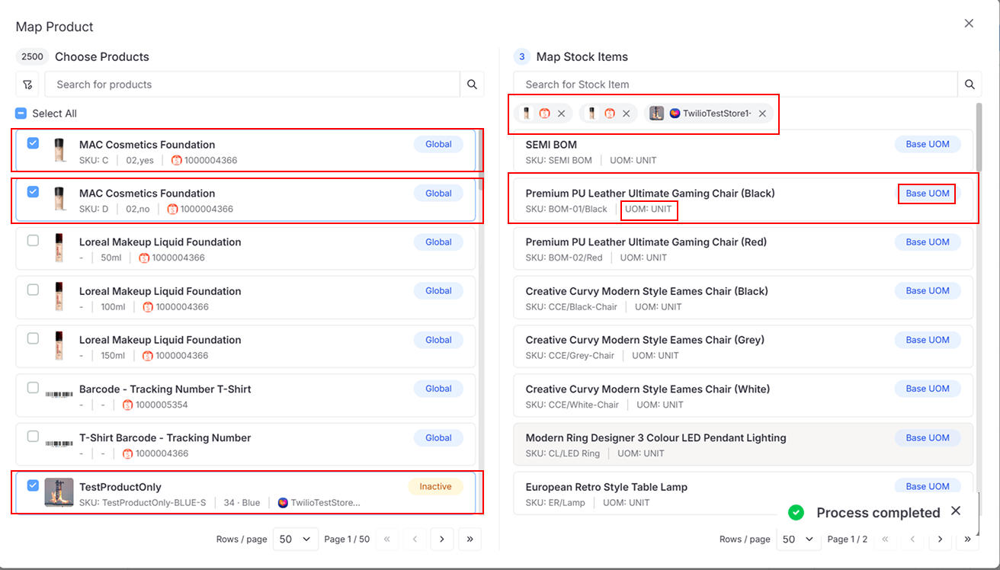
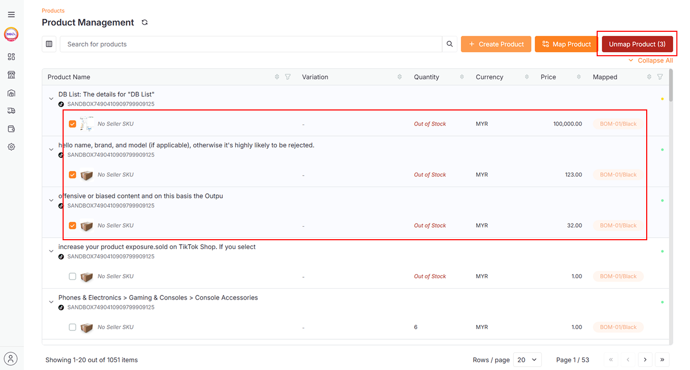
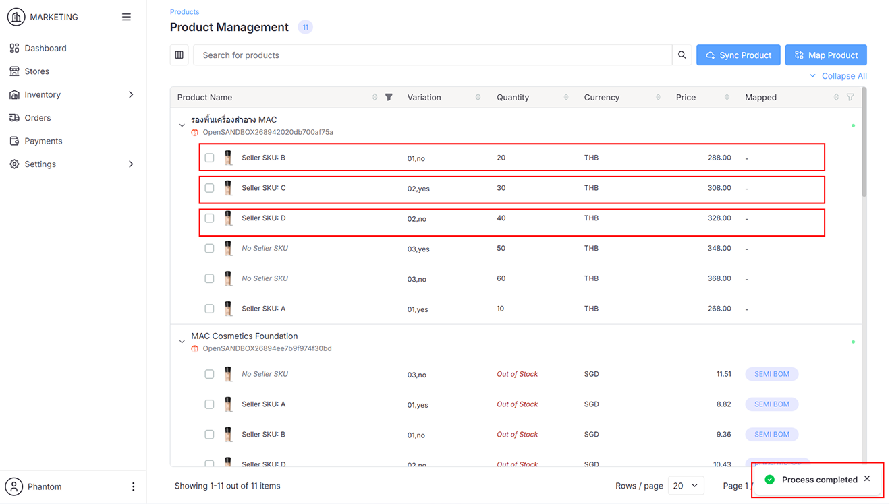
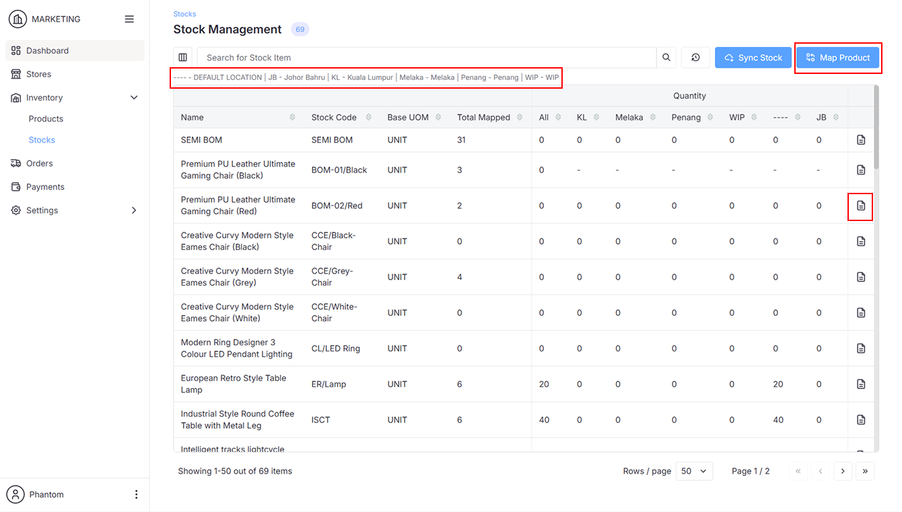
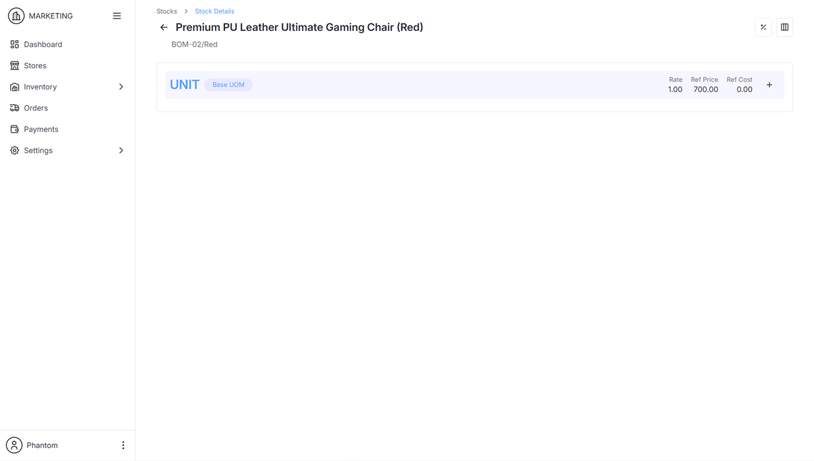
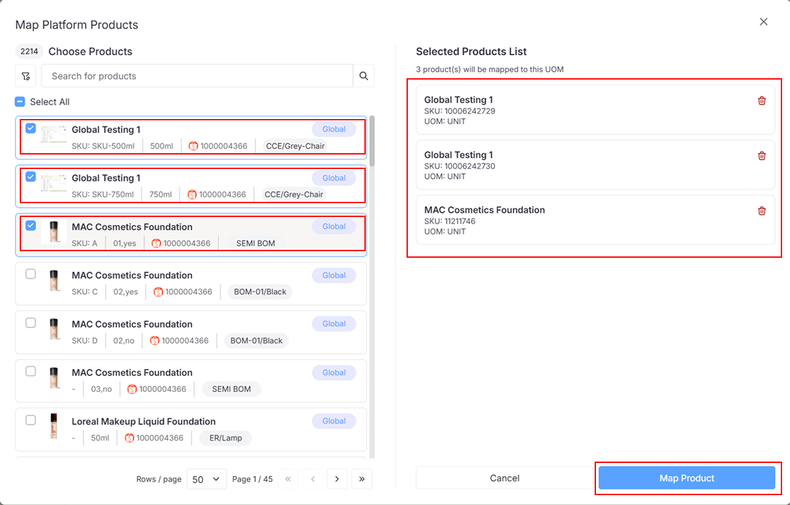

## Products

### Map Products

1. Go to **Inventory > Products**

   

2. Click the **Map Product Button** to open the **Map Product Dialog**

   

   

   :::info
   Use the **Filter Button** to narrow your **Platform Products View**, or use the **Search Bar** to find specific e-commerce products and stock items.
   :::

3. Select e-commerce products synced from various platforms and then a stock item synced from SQL Account to map them together

   

   :::info
   **e-commerce Products** are mapped to **Stock Item UOM**.
   :::

4. To unmap products, select them and click **Unmap**

   

   

## Stocks

### Map Products to Specific Stock Items

1. Go to **Inventory > Stocks**

   

2. Click the icon to view stock details

   

   :::info
   - **Map Product** can be performed here as well
   - **Location Description** and **Code** are fetched from SQL Account
   :::

3. Click the **+** icon to open the **Map Product Dialog**

   

4. Select the **Platform Product** and click **Map Product** to map it directly to this **Stock Item UOM**

   

   :::info
   Ensure your store is mapped to the correct stock item location, or mapped items won't appear.
   :::
