The **Manage Products** page allows you to view and manage all products across your connected platform stores. X-Store currently supports 5 platforms: **Lazada**, **Shopee**, **TikTok**, **Shopify**, and **WooCommerce**. You can quickly find specific products by searching using **store name**, **product name**, **product id**, **shop sku** or **seller sku**.

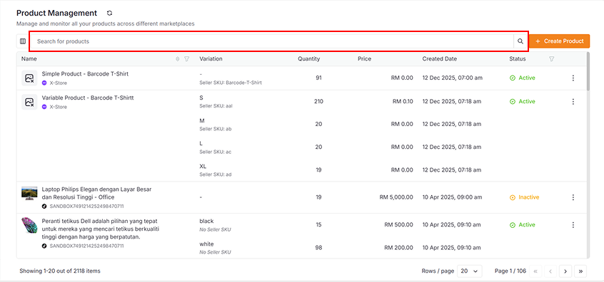

## Create Product

The **Create Product** feature allows you to publish new products to a specific store on your chosen platform.

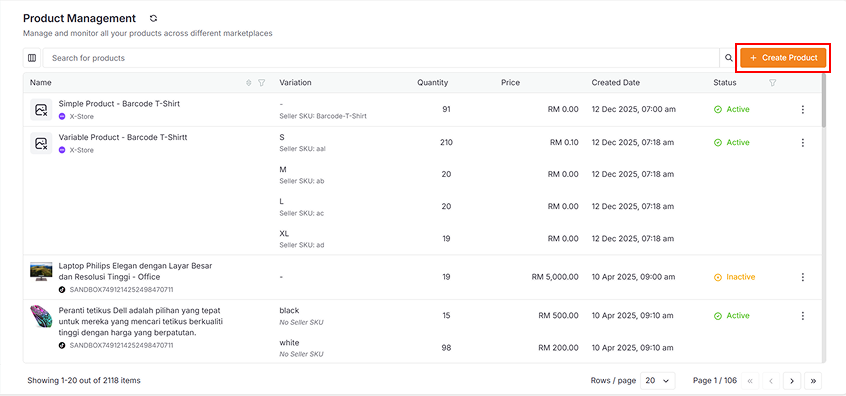

### Basic Flow

1. **Select Platform and Store**: Choose the platform and the relevant store where you want to create your product.

    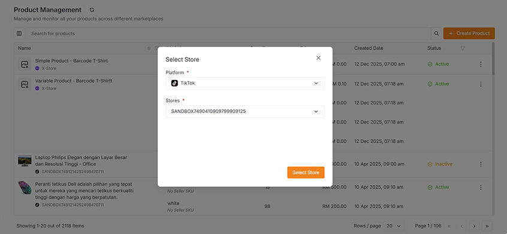

2. **Fill in Product Information**: Complete all required fields across five form steps:
   - Basic Information
   - Product Description
   - Product Specifications
   - Product Variants
   - Other Information

    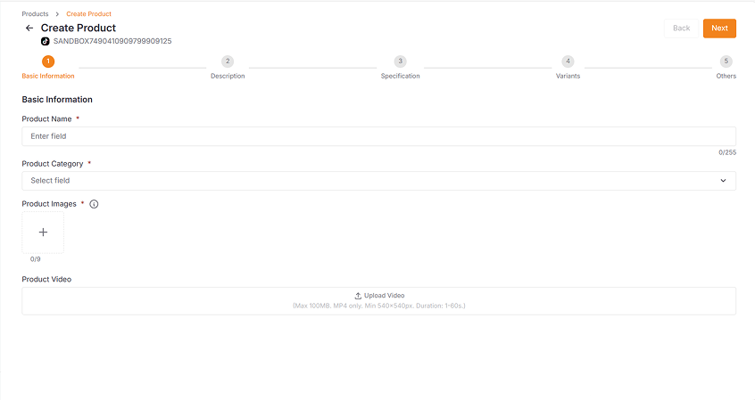

3. **Save and Publish**: After saving, wait a moment for the product to be created. Your product will be successfully created and activated in the seller center. You will then be redirected to the product list page, where your newly created product will automatically appear.

    

### Specific Information

1. Product variants may have different configuration options based on the platform.

    - **Pre-Order** allows customers to purchase products that require additional preparation time. When you enable Pre-Order, you need to specify the number of days needed to ship the product after receiving an order.

    - **GTIN Code** (Global Trade Item Number) is a unique identifier used to distinguish products and services in the supply chain. When you enable GTIN Code, you need to enter a specific numerical code for product identification.

    - When your product has more than two variant combinations, **Per-Variant Dimensions** allows each combination to have its own dimensions and weight. When enabled, you'll need to fill in the specific dimensions and weight parameters for each variant combination.

    - If multiple variant combinations share similar information, you can use the **Apply to Selected** feature for convenience as you will just need to input information once and the information will automatically apply to all selected variants.

    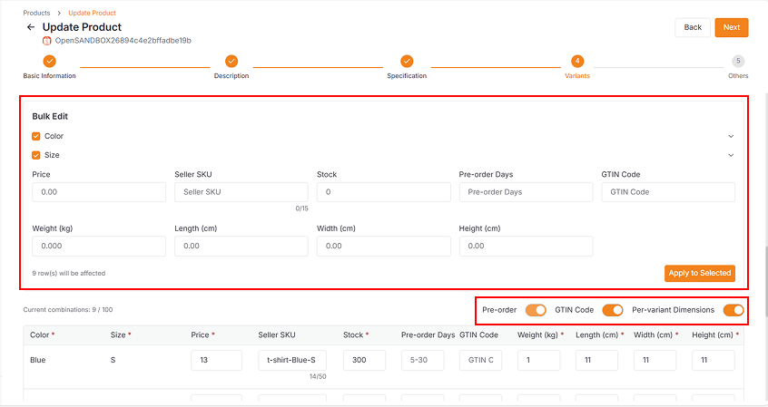

2. In the **Other Information** section, you'll find logistics details.

    - If your input weight or dimensions **exceed the logistics item limit**, the specific logistics option will be disabled.

    - You can read the **error hint** and **logistics item limit** in the tooltip.

    - You can adjust your product dimensions or weight according to the limits if you wish to use specific logistics options.

    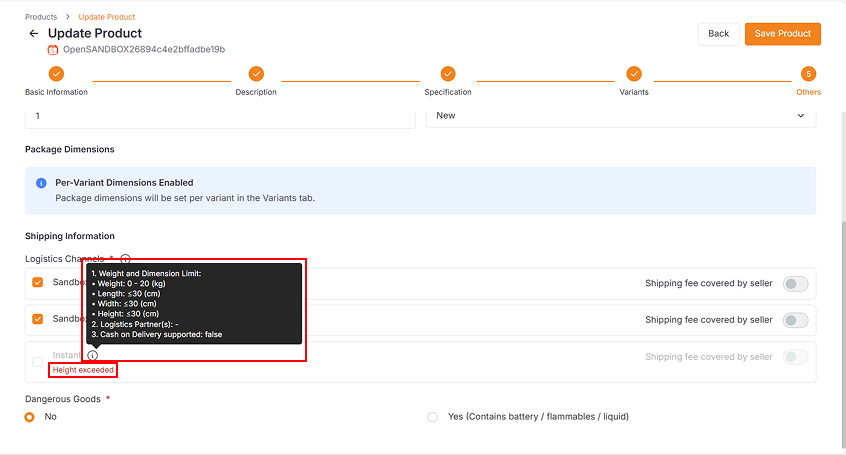

## Copy Listing

**Copy Listing** allows you to duplicate an existing product to another store. This feature supports one-to-one cross-platform copying, making it faster and easier to create similar products across different stores and platforms.

- Most common product information will be copied automatically
- **Platform-specific details** need to be filled in manually

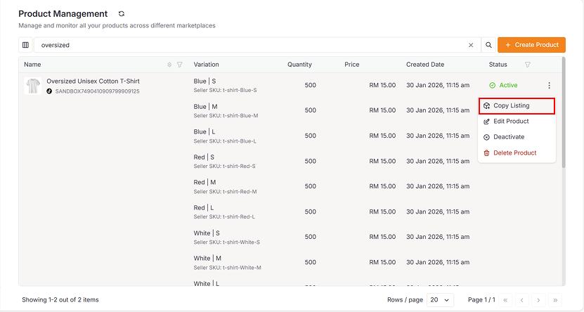

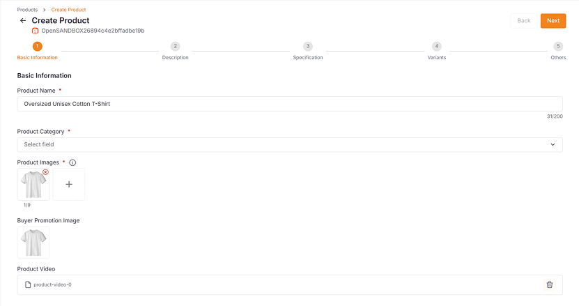

## Edit Product

The **Edit Product** feature allows you to update product information if you discover any outdated or incorrect information in your product details.

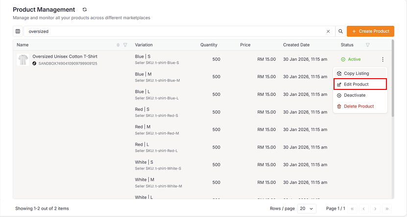

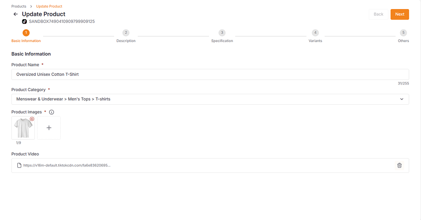

## Deactivate Product

You can change your product status between active and inactive:

- **Deactivate**: Update an active product to inactive status to unlist it from the platform
- **Activate**: Update an inactive product to active status to publish it again on the platform

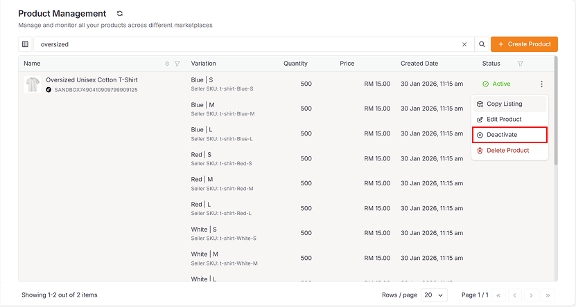

## Delete Product

The **Delete Product** feature allows you to permanently remove a product from both X-Store and your platform's seller center.

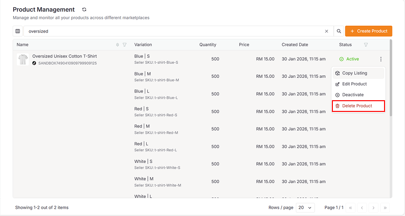
