Scrape products from e-commerce platforms.

1. Click **Scrape Product** in the sidebar

    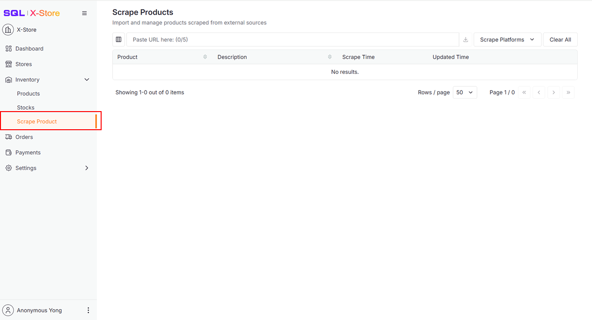

2. Click **Scrape Platforms**

    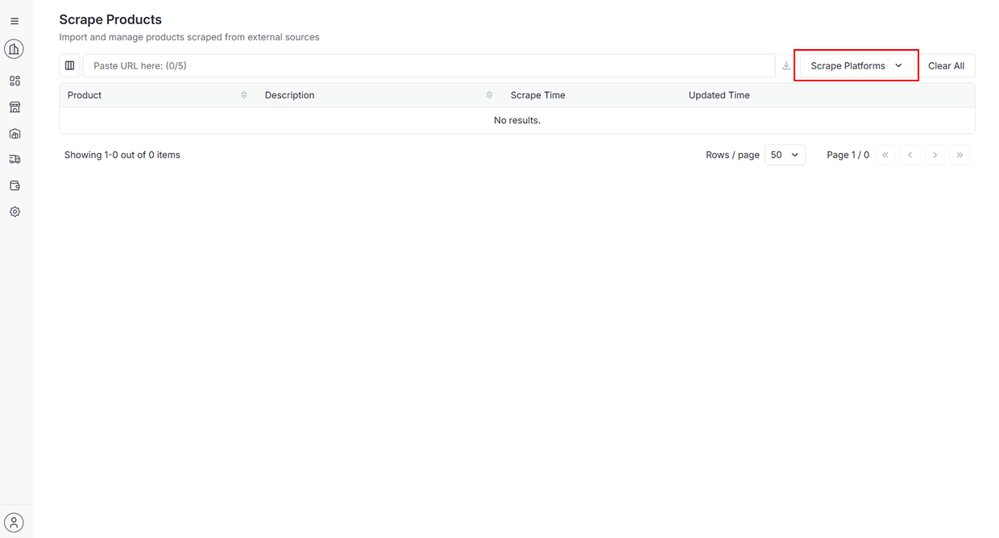

3. Choose a platform from the dropdown to visit its official website for copying product URL

    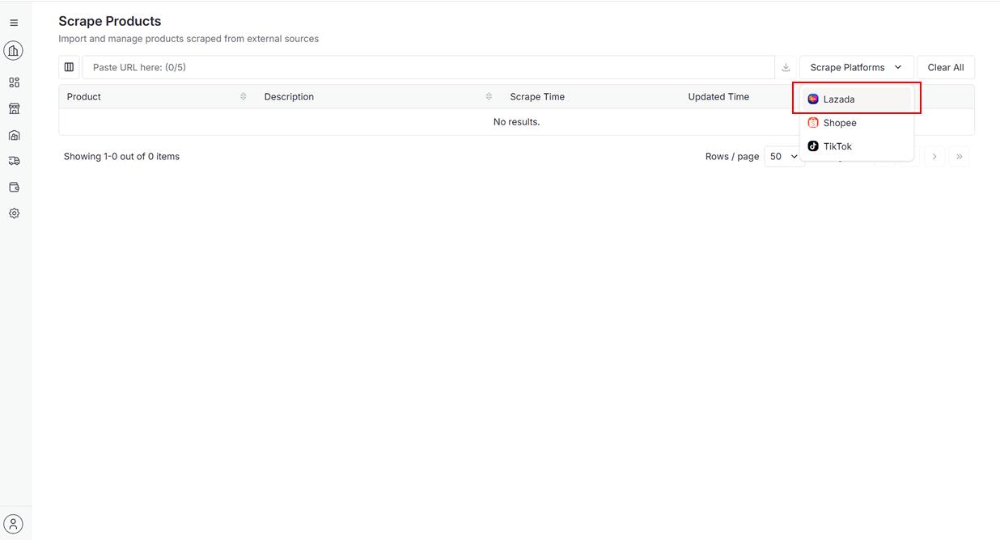

4. Paste URL and press **Enter** on keyboard or Click **Download** button for scraping

    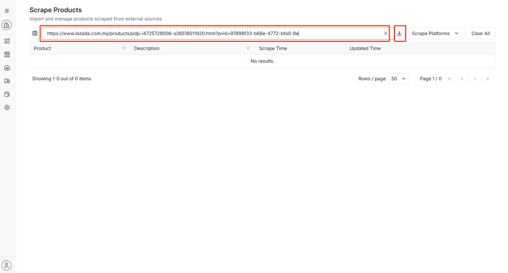

    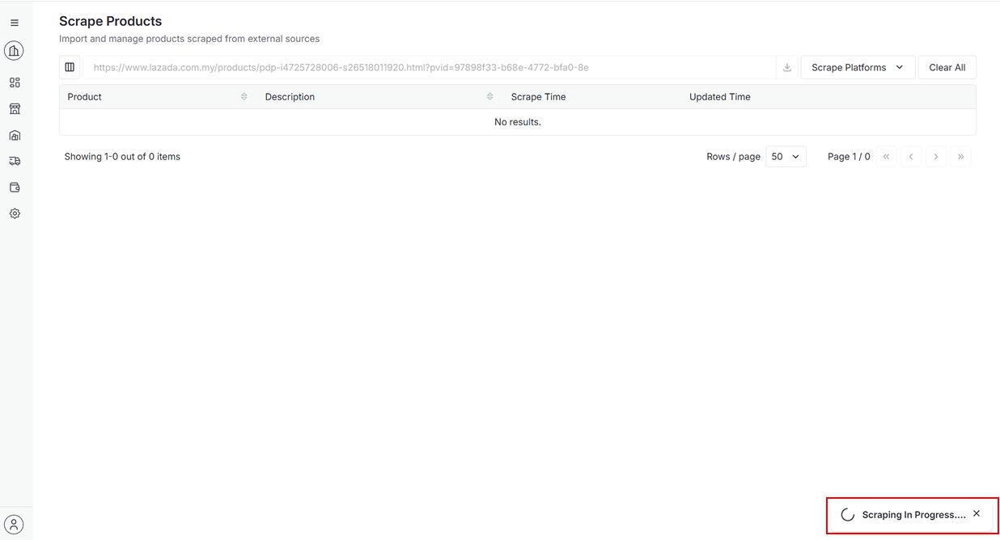

5. After successful scraping

    - A success message will appear

    - The product will be added to the data table.

        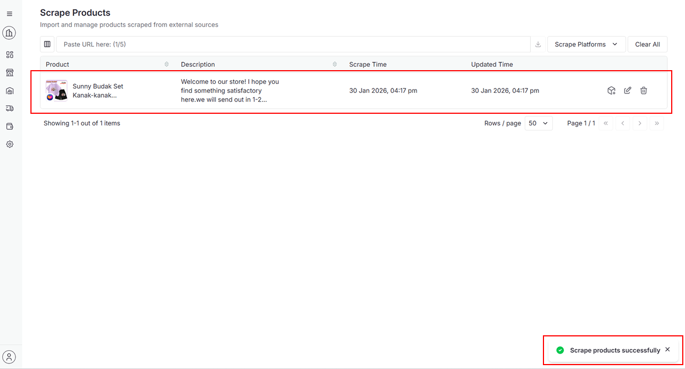

6. Click the **Trash** icon to delete the product.

    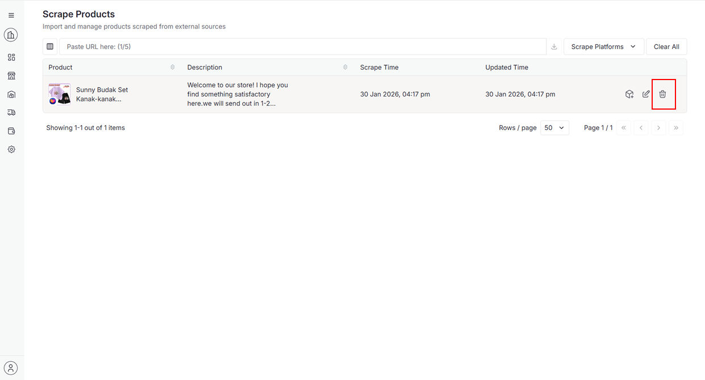

7. Click **Continue** to delete

    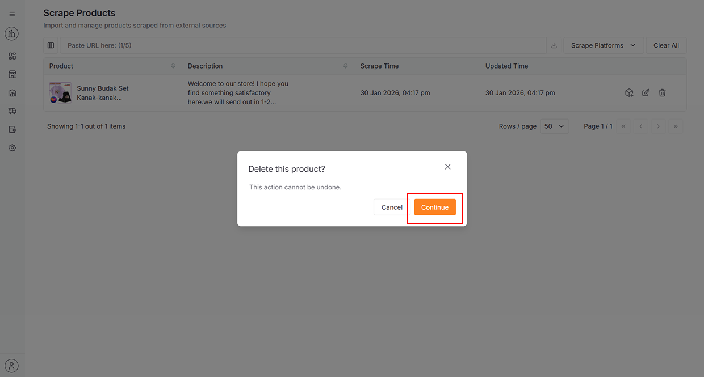

8. Click the **Edit** icon to edit the product details.

    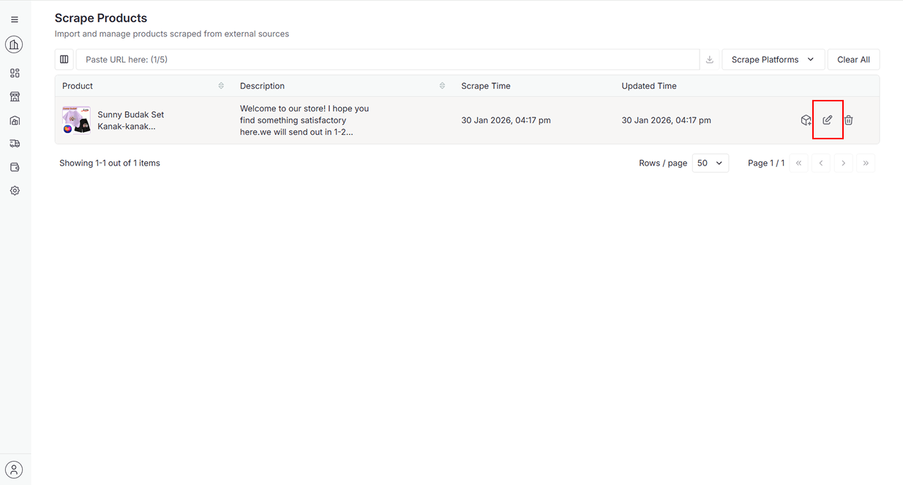

9. Click any section on the left to scroll automatically to the corresponding section

10. Click **Update** to update the changes

    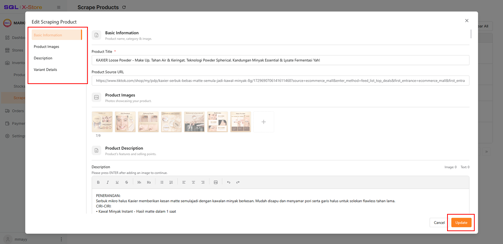

11. Click the **Create** icon to create the product in the selected store.

    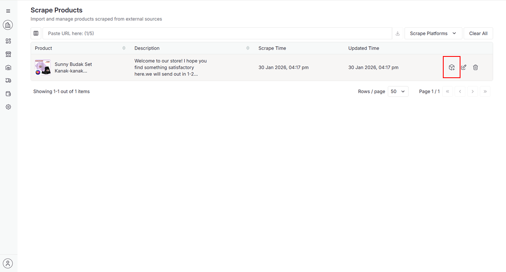

12. Select **Platform** and **Store**, then click **Select Store**

    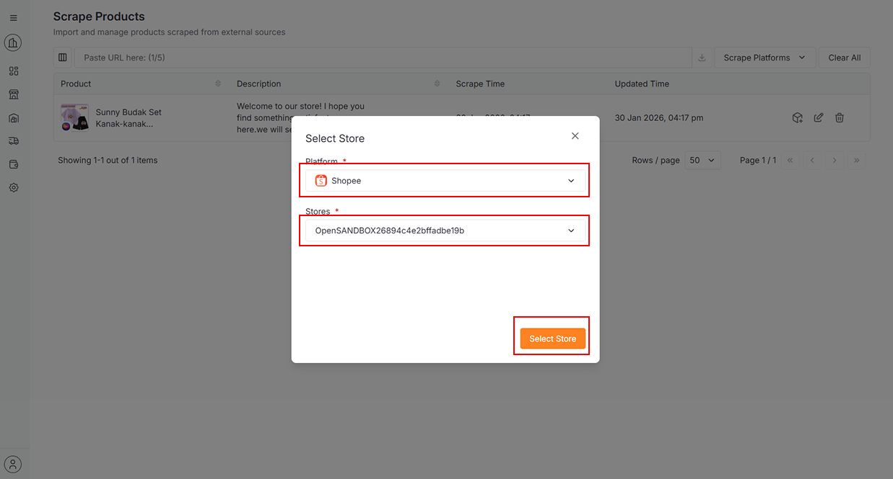

:::info
For detailed instructions on creating a product, navigate to **Integration > XStore > [Products](./products.md)**
:::

13. To clear all scraped products, click the **Clear All** button.

    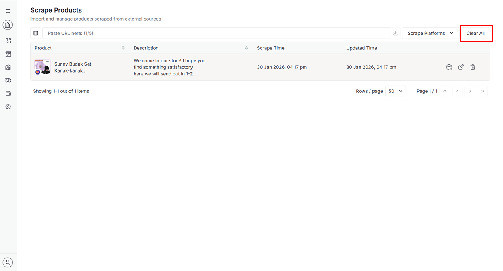

14. Click **Continue** to delete

    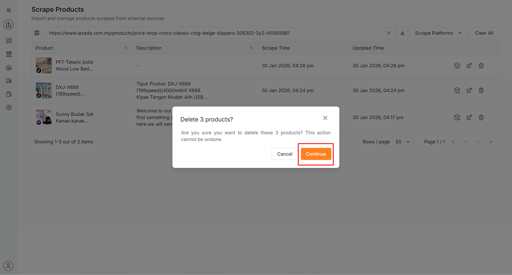

:::info
The maximum scrape limit is 5 products. Please delete some products before continuing.

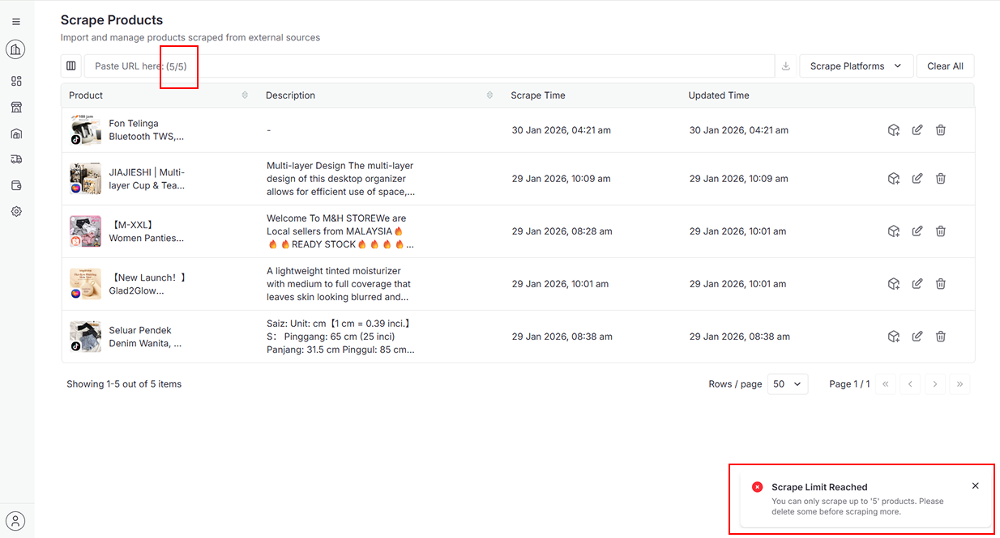
:::