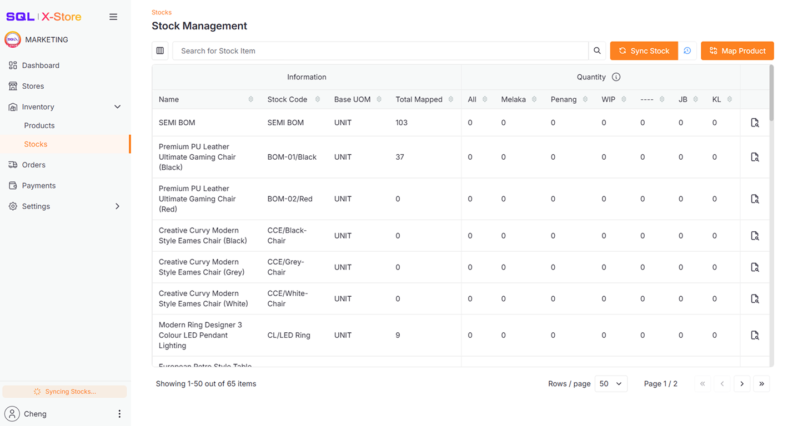
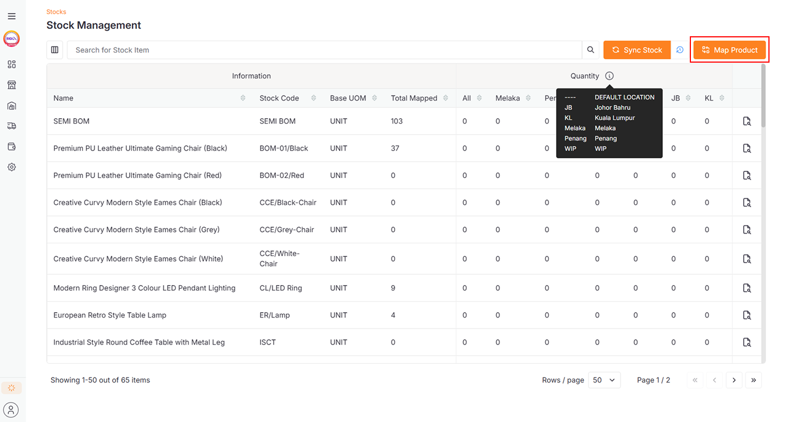
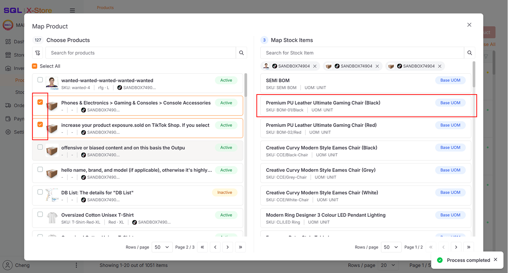
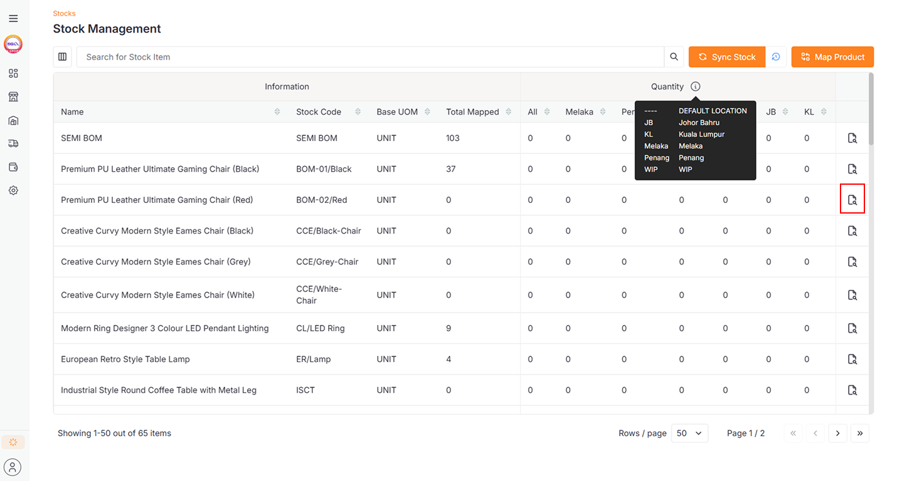
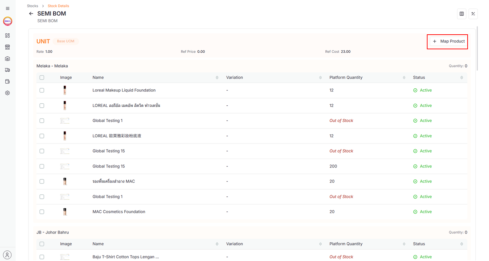
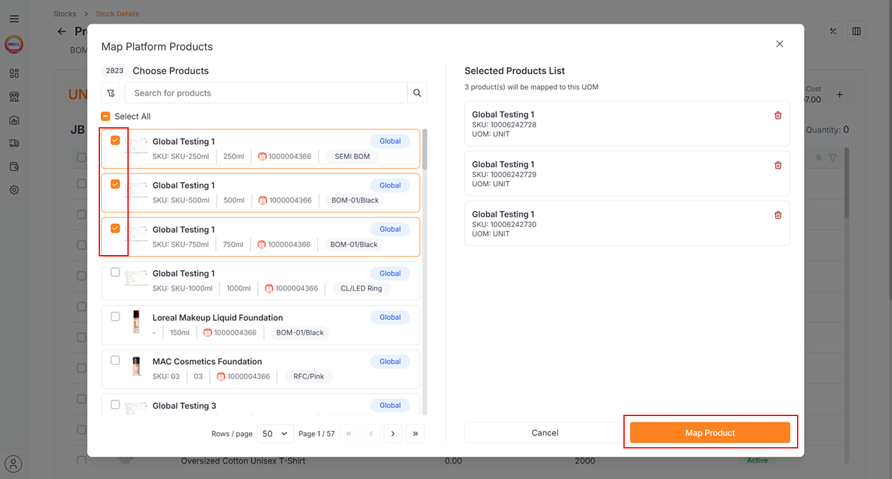
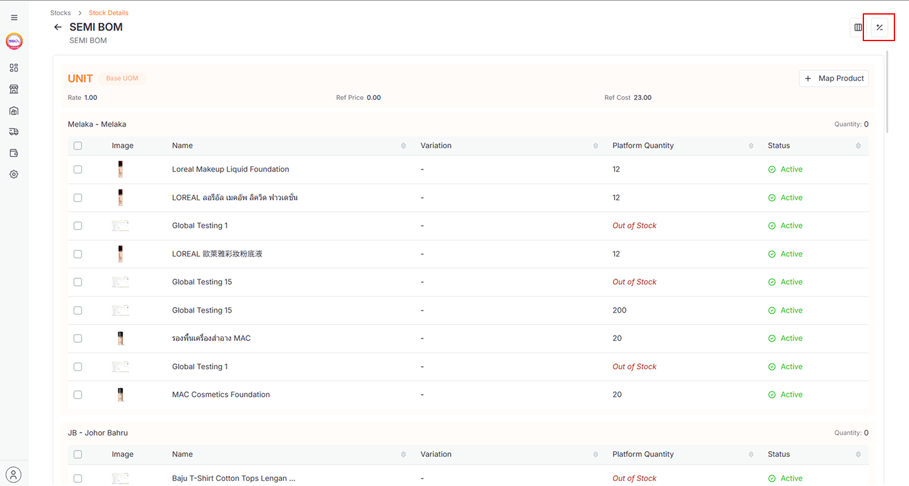
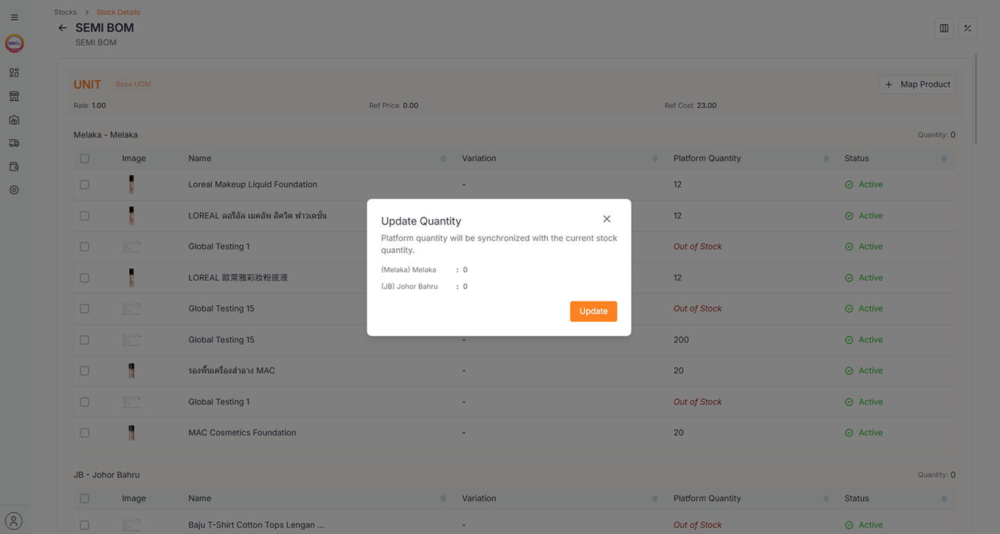

## Overview

The **Stocks** module allows you to view and manage stock items synced from SQL Account.

:::info
For more information regarding **Sync Stock Item**, please refer to **[Setup](../setup.md#step-5-sync-stock-items-from-sql-account)**
:::

## Map Products

Mapping platform products to stock items allows you to manage stock and quantity using the main stock item, improving stock quantity accuracy. There are two ways to map products:

### Map Multiple Stock Items

1. Go to **Inventory > Stocks**

2. Click the **Map Product** button

   

3. Select the **Platform Products** and then a **Stock Item** to map them together

   

   :::info
   Use the **Filter Button** to narrow your **Platform Products** view, or use the **Search Bar** to find specific e-commerce products and stock items.
   :::

### Map Single Stock Item

1. Go to **Inventory > Stocks**

2. Click the icon to view stock details

   

   :::info
   **Location Description** and **Code** are fetched from SQL Account
   :::

3. Click the **Map Product** button

   

4. Select the **Platform Products** and click **Map Product** to map them directly to this **Stock Item UOM**

   

   :::info
   Ensure your store is mapped to the correct stock item location, or mapped items won't appear.
   To map the location code, please refer to **[Setup](../setup.md#step-4-code-mapping)**
   :::

## Update Quantity

1. Go to **Inventory > Stocks**

2. Click the icon to view stock details

   

3. Click the **+/-** icon

   

4. Click the **Update** button to update the mapped products' quantity with the stock item's quantity

   