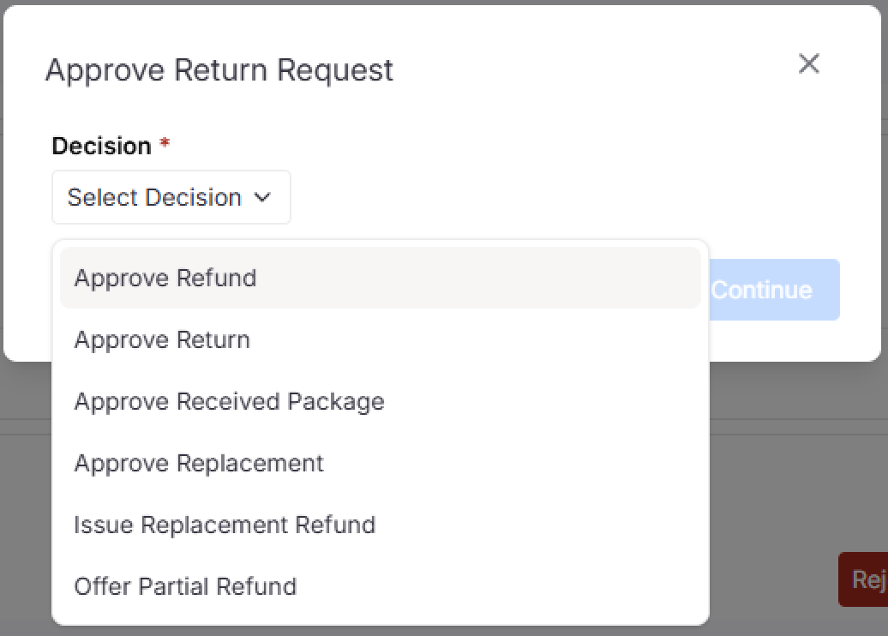

The **Order Detail** module allows you to view individual order information and perform actions such as cancellations, returns, and refunds.

To access this page, click the **document icon** on any order row.

---

## Overview

The Order Details interface allows you to:

- View order information
- Perform order actions (cancel, return, refund)
- Map order items to stock items

> **Quick Feature:** Use the mapping button to quickly link order items to your stock items directly from this page.

---

## Platform-Specific Guides

Each e-commerce platform has unique order detail layouts and available actions. Select your platform below:

- [Lazada](#lazada)
- [Shopee](#shopee)
- [TikTok](#tiktok)

---

## Lazada

### Order Detail Page

The order information section displays:

| Section              | Details                                     |
| -------------------- | ------------------------------------------- |
| **Order Details**    | Order ID, Shop ID, Payment Method           |
| **Payment Details**  | Currency, Payment Time                      |
| **Shipment Details** | Provider type, Shipping type, address, etc. |
| **Voucher Details**  | Applied discounts and promotions on an item |

Order items are grouped by package and tracking ID.

> **Note:** Cancelled items display a red badge indicating the cancellation reason.

### Return Order Info

### Cancel Order Info

---

### Repack Order

**Available for:** Orders in the **To Process** tab

Use the Repack action to repack specific items in the order after cancellation of specific items.

---

### Cancel Order (Seller-Initiated)

**Available for:** Orders in **New Order**, **To Process**, or **To Ship** tabs

**Steps to cancel:**

1. Click the **Cancel Order** button
2. Select the cancellation reason
3. Choose the items to cancel
4. Submit the cancellation request

> **Warning:** Hover over the warning icon to see Lazada's cancellation policies and potential consequences on this order.

---

### Return Order (Buyer-Initiated)

When a buyer initiates a return, the order moves to the **To Return** tab for seller approval.

**Return Processing Options:**

| Option                | Description                                |
| --------------------- | ------------------------------------------ |
| **Refund Only**       | Issue refund without requiring item return |
| **Return and Refund** | Refund after receiving returned item       |
| **Reject Refund**     | Decline the refund request with evidence   |

**1. Refund Only**

During **"Request Initiate"** status, process the refund directly to the buyer.

**2. Return and Refund**

During **"Buyer Return Item"** status:

1. Wait for the item to be returned
2. Click **Confirm Return Receipt** when received
3. Process the refund

**3. Reject Refund**

To reject a refund request:

1. Provide a rejection reason
2. Upload supporting evidence
3. Submit for platform review

**4. Refund Pending**

After processing, the status changes to **Refund Pending** while Lazada processes and reviews the refund.

---

## Shopee

### Order Detail Page

The order information section displays:

| Section              | Details                                   |
| -------------------- | ----------------------------------------- |
| **Buyer Details**    | Customer username, user ID and address    |
| **Payment Details**  | Payment method, Currency and Payment time |
| **Shipment Details** | Carrier information                       |
| **Extra Details**    | Additional order notes and info           |

### Return Order Info

---

### Cancel Order (Seller-Initiated)

**Available for:** Orders in the **New Order** and **To Process** tabs

**Out of Stock Cancellation:**

When selecting "Out of Stock" as the reason:

1. Select the out-of-stock items
2. Submit the cancellation

> **Note:** Cancelling with "Out of Stock" may reset the item quantity to 0 on the platform.

---

### Cancel Order (Buyer-Initiated)

Sellers can accept or reject the buyer's cancellation request.

---

### Return Order (Buyer-Initiated)

**1. Refund Only**

When a buyer requests **Refund Only**, review the request and choose to approve or reject.

**2. Return and Refund (Buyer's Offer)**

When the latest offer is from the buyer, you can:

| Action           | Description                       |
| ---------------- | --------------------------------- |
| **Create Offer** | Counter with a new offer amount   |
| **Accept Offer** | Accept the buyer's proposed terms |
| **Dispute**      | Escalate to Shopee for resolution |

**3. Return and Refund (Seller's Offer)**

When you've made an offer and are awaiting buyer response, you can still modify your offer.

**Create Offer Form:**

**Dispute Form:**

---

## TikTok

### Order Detail Page

### Cancel Order Info

### Return Order Info

---

### Cancel Order (Seller-Initiated)

**Available for:** Orders in the **New Order** and **To Process** tabs

Select a cancellation reason and submit to cancel the order.

---

### Cancel Order (Buyer-Initiated)

When a buyer requests cancellation, choose your response:

**Approve Cancellation:**

**Reject Cancellation:**

---

### Return Order (Buyer-Initiated)

When a buyer initiates a return, review the request and respond:

**Approve Return:**

**Reject Return:**

---

## Related

- [Order Management](./orders) – Managing orders across all platforms
