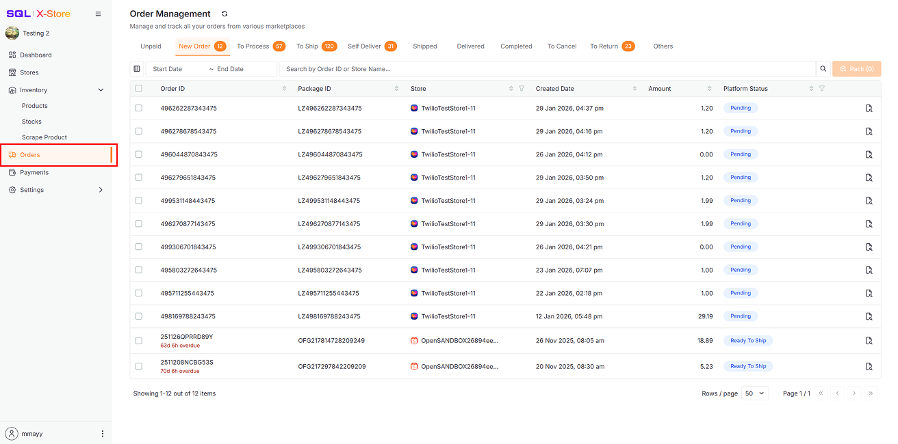
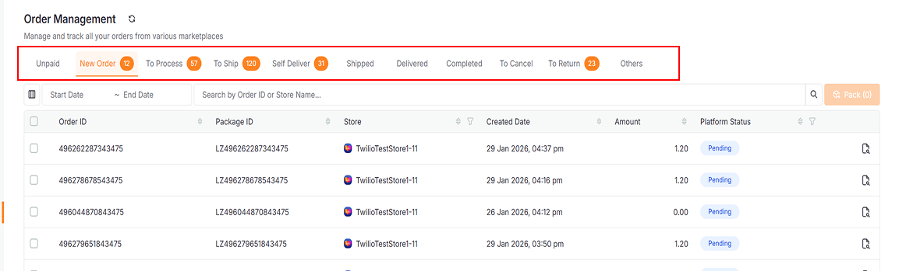
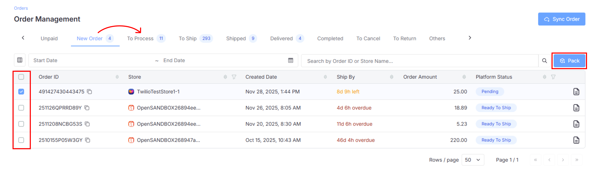
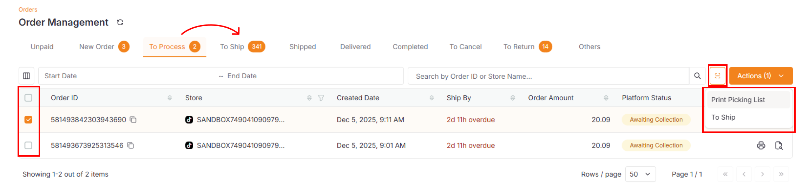
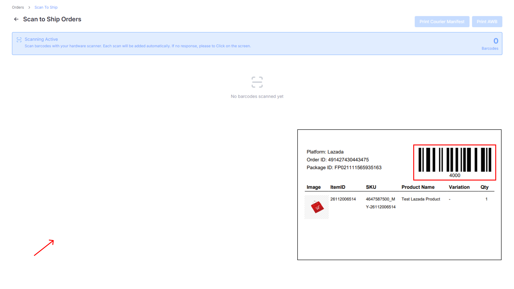
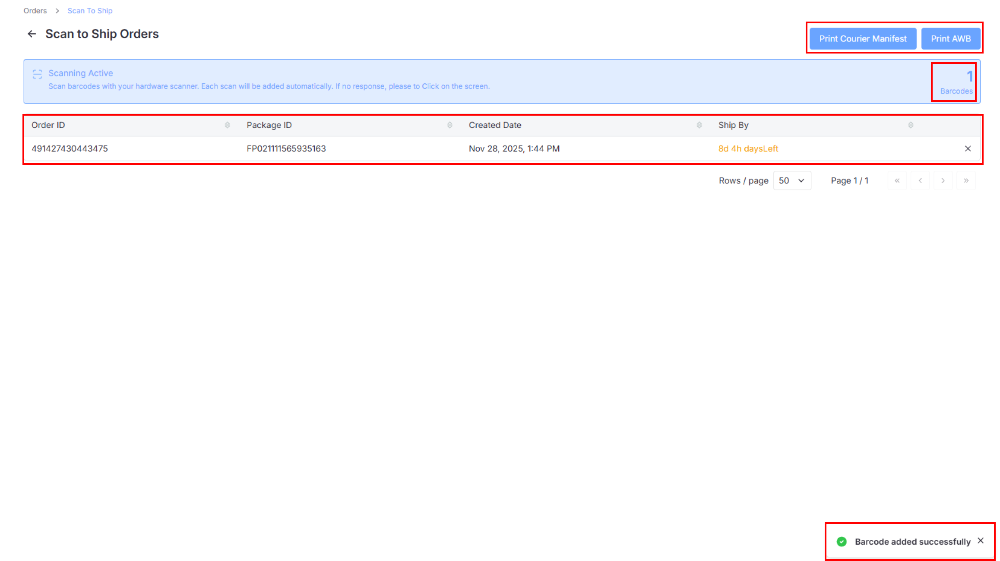
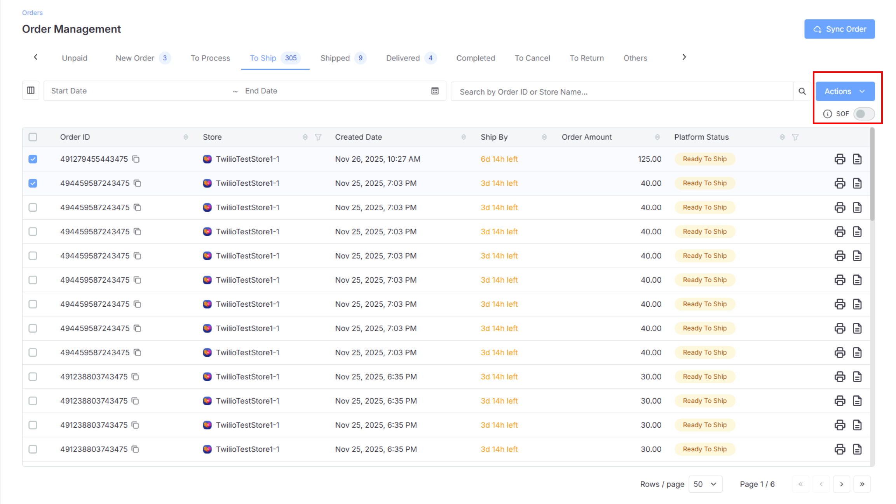
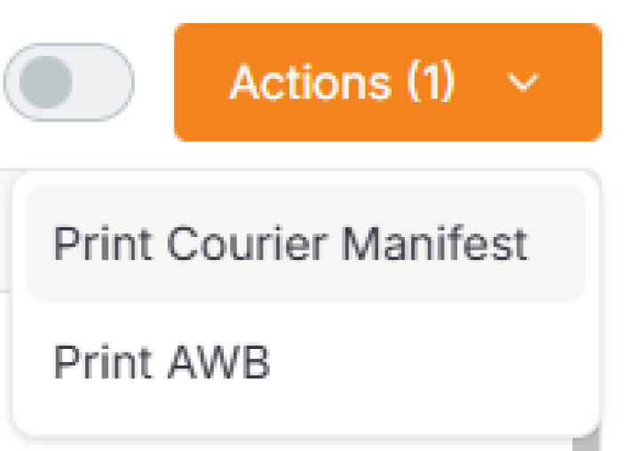
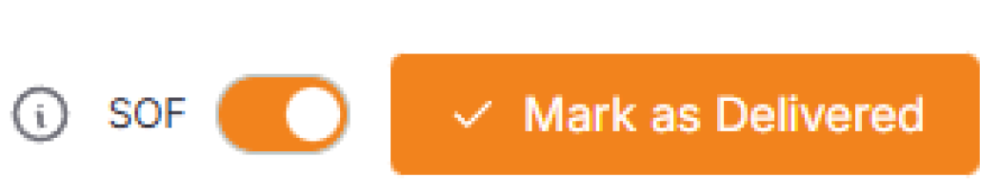
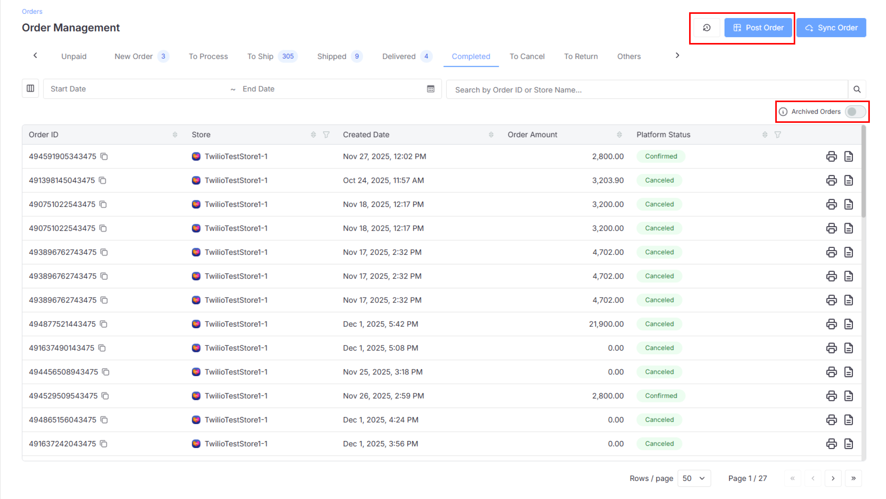

The **Order** module allows you to view, process, and manage orders from all your connected e-commerce platforms (Lazada, Shopee, TikTok, etc.) in one centralized location.

To access this page, navigate to **Orders** in the sidebar menu.

---

## Overview

The Order Management interface is organized into tabs representing each stage of the order lifecycle. You can:

- Filter orders by date range
- Search by Order ID or Store Name
- Perform bulk actions (packing, shipping, printing)
- Track order status across all platforms

---

## Filtering and Searching

| Feature               | Description                                                        |
| --------------------- | ------------------------------------------------------------------ |
| **Search**            | Find orders by **Order ID** or **Store Name** using the search bar |
| **Date Range**        | Filter orders by creation date using the date picker               |
| **Column Visibility** | Click the column icon to show/hide specific table columns          |

---

## Order Statuses

Orders are categorized into the following status tabs:

| Status         | Description                                                   |
| -------------- | ------------------------------------------------------------- |
| **Unpaid**     | Orders placed but not yet paid by the customer                |
| **New Order**  | Paid orders ready to be processed                             |
| **To Process** | Packed orders waiting to be shipped                           |
| **To Ship**    | Orders ready for courier handover                             |
| **Shipped**    | Orders currently in transit                                   |
| **Delivered**  | Orders successfully delivered to the customer                 |
| **Completed**  | Orders finalized and closed                                   |
| **To Cancel**  | Buyer-initiated cancellation requests pending seller approval |
| **To Return**  | Buyer-initiated return requests pending seller approval       |
| **Others**     | Orders with special or exceptional statuses                   |

---

## Order Processing Workflow

The order processing flow moves through several stages. Different actions are available at each stage.

### Step 1: Pack New Orders

1. Select orders by clicking the checkbox next to each order
2. Click the **Pack** button
3. Packed orders will move to the **To Process** tab

---

### Step 2: Process Orders for Shipping

1. Select the orders you want to process by checking the boxes

2. **Print Picking Documents:**

   

   Use the **Action** dropdown to print:

   - **Picking List Summary** – A consolidated list of all order items for batch picking
   - **Picking List** – Individual picking lists per order

3. Click **To Ship** to update order status on the marketplace and move orders to the "To Ship" tab

4. _(Optional)_ Click the **Scan** icon for the Scan to Ship interface

---

### Step 3: Scan to Ship (Optional)

Use this feature to quickly verify and ship orders by scanning.

1. Click on the screen and scan the barcode from the picking list
2. **Alternative:** Type the barcode number manually and press Enter

**Available Actions:**

- **Print AWB** – Print Air Waybills for selected orders
- **Print Courier Manifest** – Generate a manifest for courier pickup

---

### Step 4: Ship Orders & Print Documentation

**Available Actions:**

| Action                     | Description                            |
| -------------------------- | -------------------------------------- |
| **Print AWB**              | Print Air Waybills for selected orders |
| **Print Courier Manifest** | Generate a manifest for courier pickup |

**Seller Own Fulfillment (SOF):**

If you handle delivery yourself:

1. Toggle the **SOF** switch to enable self-fulfillment mode
2. Select the delivered orders
3. Click **Mark as Delivered**

---

### Step 5: Post Completed Orders to SQL Account

Once orders reach **Shipped**, **Delivered**, or **Completed** status:

1. **Post Order** – Click to post orders to **SQL Account**

   > The orders posted will match the current tab's status. For example, clicking **Post Order** on the Shipped tab posts only shipped orders.

2. **Status** – Click the **icon next to the Post Order button** to view order posting history and status

   | Icon Colour | Status     |
   | ----------- | ---------- |
   | 🔵 Blue     | Processing |
   | 🟢 Green    | Success    |
   | 🔴 Red      | Failed     |

3. **Archived Orders** – Turn on the switch to view orders that have been posted to SQL Account.  
   Note\*: If orders are updated after posting, they will be moved back to the **non-archived** page.

---

## Next Steps

Learn more about individual order management: [Order Detail](./order-details)
