## Overview

The **Order** module allows you to view, process, and manage orders from all your connected e-commerce platforms (Lazada, Shopee, TikTok, etc.) in one centralized location.

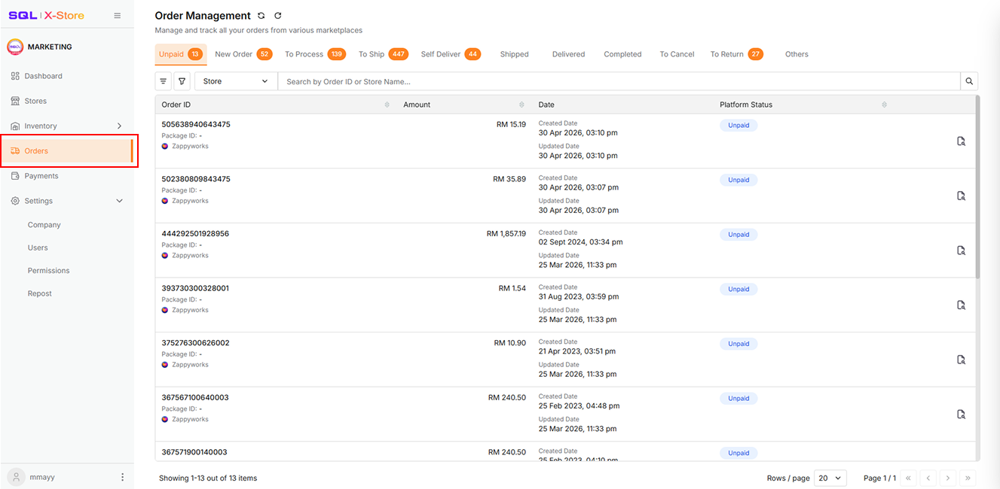

To access this page, navigate to **Orders** in the sidebar menu.

The Order Management interface is organized into tabs representing each stage of the order lifecycle. You can:

- Filter orders by date range
- Search by Order ID or Store Name
- Perform bulk actions (packing, shipping, printing)
- Track order status across all platforms

## Order Statuses

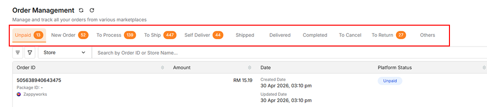

Orders are categorized into the following status tabs:

| Status         | Description                                                   |
| -------------- | ------------------------------------------------------------- |
| **Unpaid**     | Orders placed but not yet paid by the customer                |
| **New Order**  | Paid orders ready to be processed                             |
| **To Process** | Packed orders waiting to be shipped                           |
| **To Ship**    | Orders ready for courier handover                             |
| **Shipped**    | Orders currently in transit                                   |
| **Delivered**  | Orders successfully delivered to the customer                 |
| **Completed**  | Orders finalized and closed                                   |
| **To Cancel**  | Buyer-initiated cancellation requests pending seller approval |
| **To Return**  | Buyer-initiated return requests pending seller approval       |
| **Others**     | Orders with special or exceptional statuses                   |

## Order Processing Workflow

The order processing flow moves through several stages. Different actions are available at each stage.

### Step 1: Pack New Orders

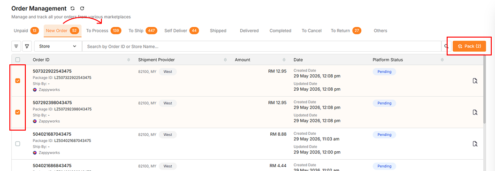

1. Select orders by clicking the checkbox next to each order
2. Click the **Pack** button
3. Packed orders will move to the **To Process** tab

### Step 2: Process Orders for Shipping

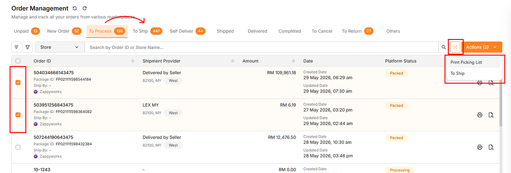

1. Select orders by clicking the checkbox next to each order
2. Click the **To Ship** button
3. Orders will move to the **To Ship** tab
4. (Optional) Click the **Scan** icon to use the **Scan To Ship** feature for faster processing

#### Print Picking Document

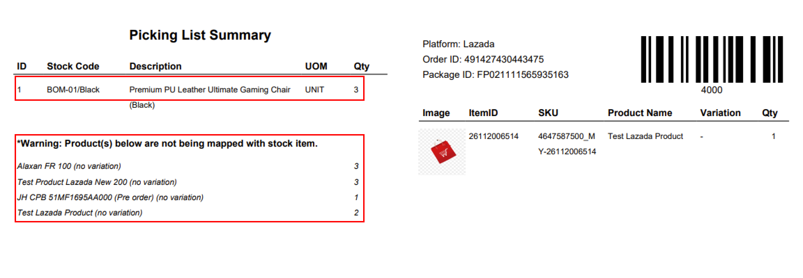

1. Click the **Print Picking List** button to generate the following:
   - **Picking List Summary:** A consolidated list of all order items for batch picking
   - **Picking List:** Individual picking lists generated per order, including barcodes 
2. The printed picking list can be used together with the **Scan To Ship** feature to speed up order fulfillment

### Step 3: Scan To Ship (Optional)

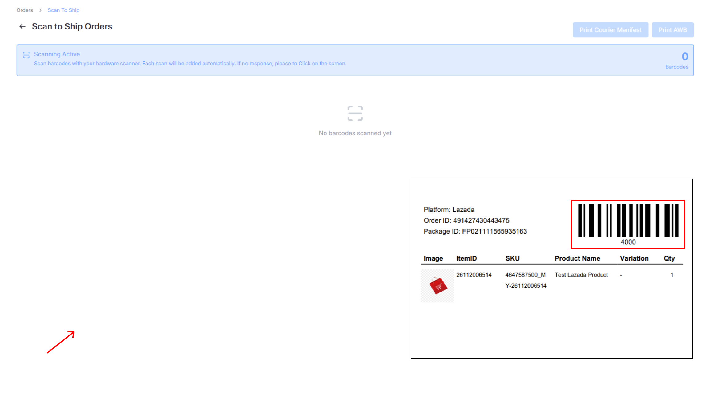

1. Click on the screen and scan the barcode from the picking list
2. **Alternative:** Type the barcode number manually and press Enter

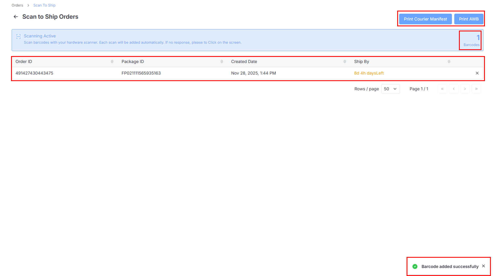

| Action                     | Description                            |
| -------------------------- | -------------------------------------- |
| **Print AWB**              | Print Air Waybills for selected orders |
| **Print Courier Manifest** | Generate a manifest for courier pickup |

### Step 4: To Ship

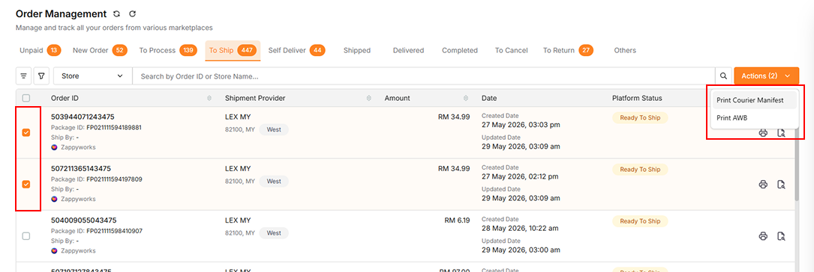

| Action                     | Description                            |
| -------------------------- | -------------------------------------- |
| **Print AWB**              | Print Air Waybills for selected orders |
| **Print Courier Manifest** | Generate a manifest for courier pickup |

### Step 5: Self Deliver

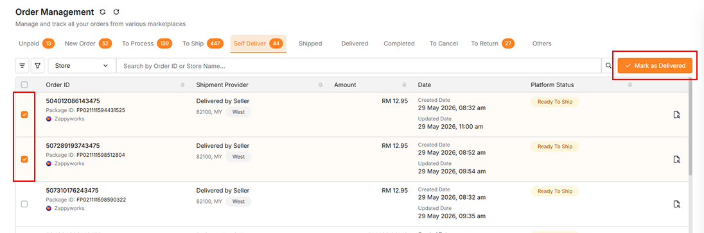

| Action                     | Description                            |
| -------------------------- | -------------------------------------- |
| **Mark as Delivered**      | Mark the order as delivered            |

### Step 6: Post Orders to SQL Account

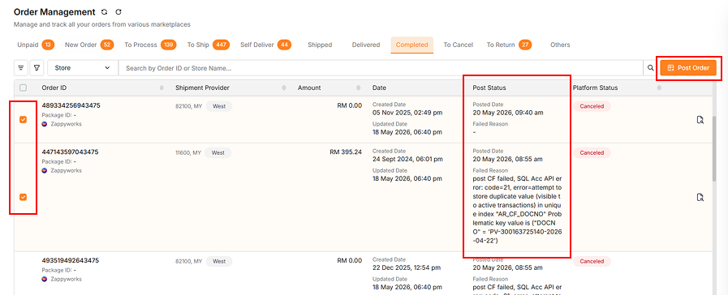

Once orders reach **Shipped**, **Delivered**, or **Completed** status, you may post orders to SQL Account:

1. Select orders by clicking the checkbox next to each order

2. Click the **Post Order** button; a popup dialog will appear as shown below
   
   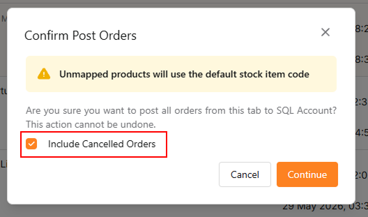

3. Select **Include Cancelled Orders** to post the cancelled orders too

4. Once the post order is complete, a toast notification will appear as shown below
   
   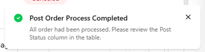

5. Each order's post status can be checked in the table under the **Post Status** column:
   - **Failed Reason:** there is some error when posting the order
   - **Posted Date:** the order had been posted before. May try to repost in **[Settings > Repost](../settings.md#repost)**

## General Features

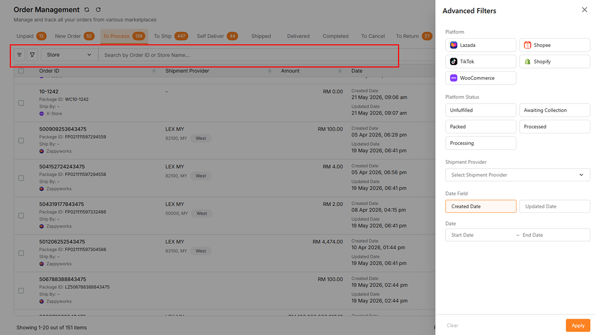

| Feature                         | Description                                                                                             |
|---------------------------------|---------------------------------------------------------------------------------------------------------|
| **Search**                      | Find orders by **Order ID**, **Store Name**, **Package ID** or **Tracking Number** using the search bar |
| **Column Visibility**           | Click the leftmost button to show/hide specific table columns                                           |
| **Filter by Platform**          | Displays orders based on platform filtered                                                              |
| **Filter by Platform Status**   | Displays orders based on platform status filtered                                                       |
| **Filter by Shipment Provider** | Displays orders based on shipment provider filtered                                                     |
| **Date Range**                  | Filter orders by created or updated date using the date picker                                          |
