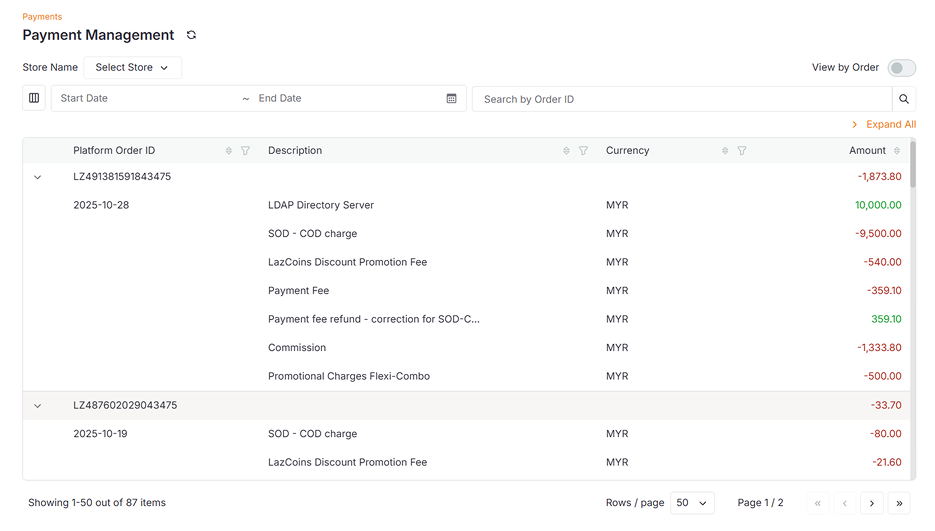

The **Manage Payments** page allows you to view and manage all payment details. The number below the table shows the **total number** of transactions or orders in the data table based on the view options.

## Data Table Features

| Column                                                                   | Description                                                                     |
|--------------------------------------------------------------------------|---------------------------------------------------------------------------------|
| **Transaction Date** (Payment view) / **Platform Order ID** (Order view) | The grouping field - by transaction date or order ID                            |
| **Description**                                                          | Details of each transaction line item                                           |
| **Currency**                                                             | The currency used (e.g., MYR)                                                   |
| **Amount**                                                               | Total amount for the grouped row, or individual line item amounts when expanded |

## General Features

| Filter Option               | Description                                                                                                                                                                                                                             |
|-----------------------------|-----------------------------------------------------------------------------------------------------------------------------------------------------------------------------------------------------------------------------------------|
| **Sync Payment**            | Click the **Sync Payment** button at the top-left corner besides title "Payment Management" to synchronize payment data from your e-commerce platform                                                                                   |
| **Store Selection**         | Click the **Select Store** dropdown next to "Store Name" to choose a specific store, or leave as default to display **All** stores                                                                                                      |
| **View Options**            | Toggle between two view modes using the switch at the top-right corner. **View by Payment** displays transactions grouped by transaction date while **View by Order** displays individual orders grouped by Platform Order ID           |
| **Customize Table Columns** | Click the **column icon** on the left side (beside the Start Date field) to show or hide specific columns and customize which information is displayed                                                                                  |
| **Date Range Filter**       | Select a **Start Date** and **End Date** (up to today) to filter transactions within the date range.                                                                                                                                    |
| **Search by Order ID**      | Enter an **Order ID** in the search field to filter and display matching orders                                                                                                                                                         |
| **Expand All**              | Click **Expand All** in the top-right to expand all transactions rows and reveal detailed breakdowns                                                                                                                                    |
