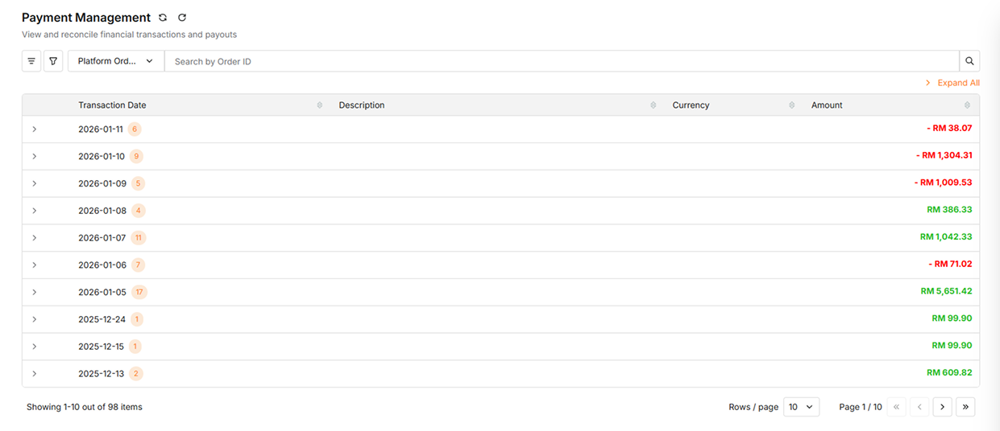
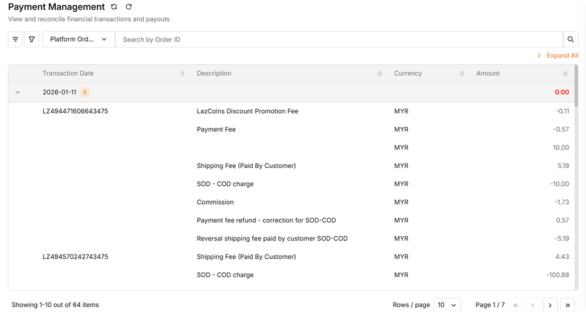
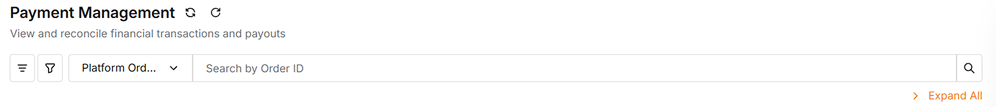
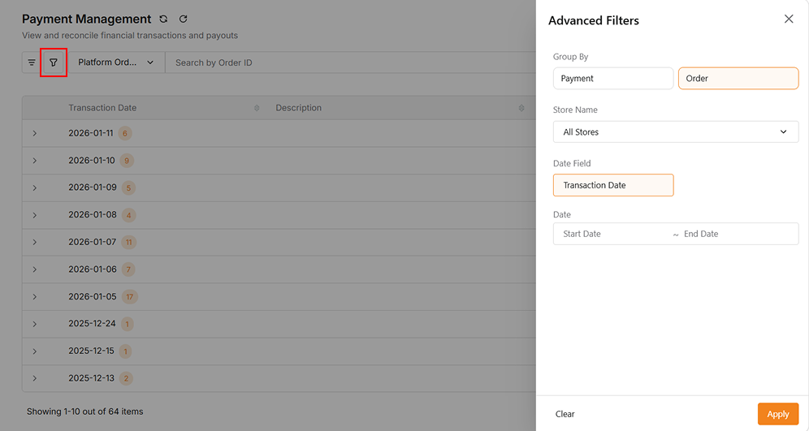

The **Manage Payments** page allows you to view and manage all payment details. The number below the table shows the **total number** of transactions or orders in the data table based on the view options.

## Data Table Features

| Column                                                                   | Description                                                                     |
|--------------------------------------------------------------------------|---------------------------------------------------------------------------------|
| **Transaction Date** (Payment view) / **Platform Order ID** (Order view) | The grouping field - by transaction date or order ID                            |
| **Description**                                                          | Details of each transaction line item                                           |
| **Currency**                                                             | The currency used (e.g., MYR)                                                   |
| **Amount**                                                               | Total amount for the grouped row, or individual line item amounts when expanded |

## General Features

| Actions                     | Description                                                                                                                                                                                                                             |
|-----------------------------|-----------------------------------------------------------------------------------------------------------------------------------------------------------------------------------------------------------------------------------------|
| **Sync Payment**            | Click the **Sync Payment** button at the top-left corner beside the title "Payment Management" to synchronize payment data from your e-commerce platform                                                                                   |
| **Refresh Payment**         | Click the **Refresh Payment** button to refresh payment data                                                                                                                                                                            |
| **Customize Table Columns** | Click the **column icon** on the left side (beside the Start Date field) to show or hide specific columns and customize which information is displayed                                                                                  |
| **Advanced Filter**         | Click the filter options to narrow down payment data by grouping, store, or date range. See [Advanced Filter Options](#advanced-filter-options) below.                                                                                  |
| **Search by Order ID**      | Enter an **Order ID** in the search field to filter and display matching orders                                                                                                                                                         |
| **Expand All**              | Click **Expand All** in the top-right to expand all transaction rows and reveal detailed breakdowns                                                                                                                                     |

### Advanced Filter Options

| Filter              | Description                                                                                                                         |
|---------------------|-------------------------------------------------------------------------------------------------------------------------------------|
| **Group by Payment** | Displays transactions grouped by transaction date                                                                                  |
| **Group by Order**  | Displays individual orders grouped by Platform Order ID                                                                             |
| **Store Name**      | Click the **All Stores** dropdown to choose a specific store, or leave as default to show all stores                                |
| **Date Range**      | Select a **Start Date** and **End Date** (up to today) of transaction date to filter transactions within a date range               |
