The Settings module consists of three main sections to help you manage your organization:

- **Company** - Manage your organization's profile and configuration
- **Users** - Control team member access and invitations
- **Permissions** - Define roles and access control

## Company Settings

### Overview

View and update your organization's information, including business details and API configurations.

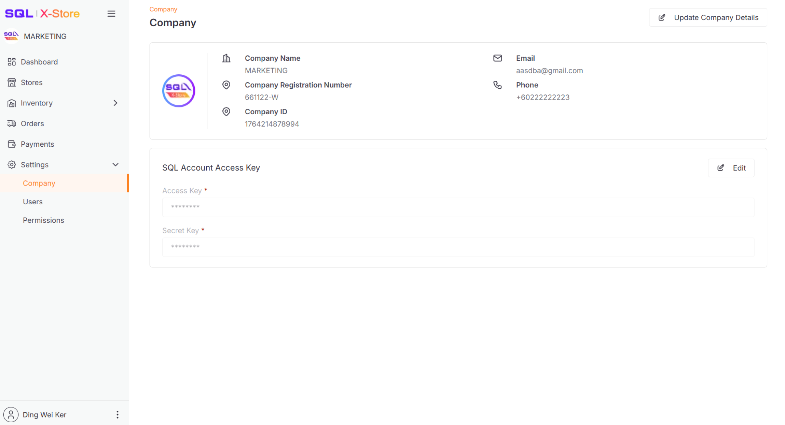

### Company Information

Your company profile displays:

- Company ID
- Company name
- Logo
- Registration number
- Email address
- Phone number

**SQL Account Integration**

Configure your SQL Account API access by setting up:

- Access key
- Secret key

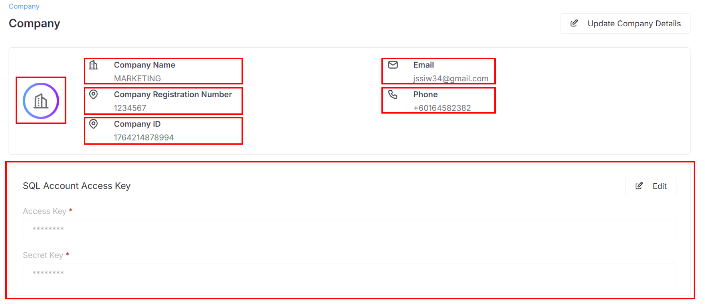
[Learn more about SQL Account configuration](/integration/xstore/setup#step-3-configure-company-settings)

#### Update Company Logo

Click on your current logo to upload a new one.

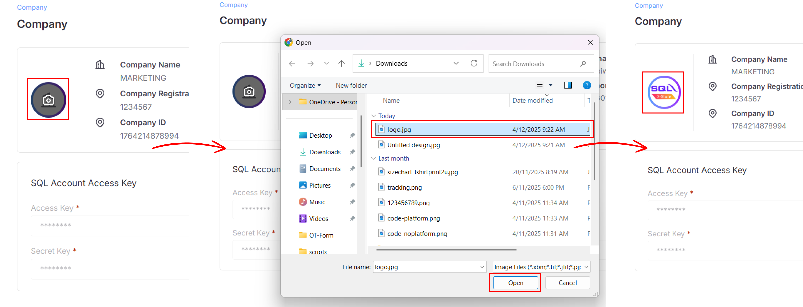

### Editing Company Details

**To update your company information:**

1. Click the **Update Company Details** button

   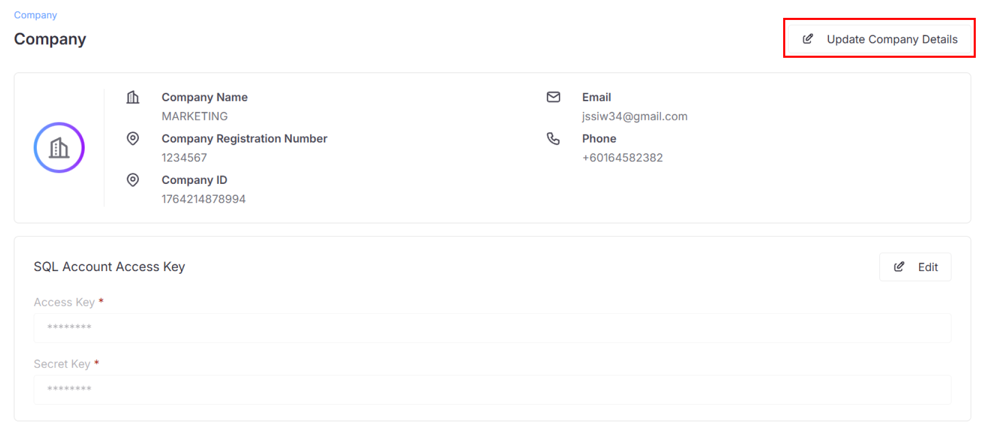

2. Modify any of the following fields:

   - Company name
   - Registration number
   - Email address
   - Phone number

3. Click **Save** to apply changes

   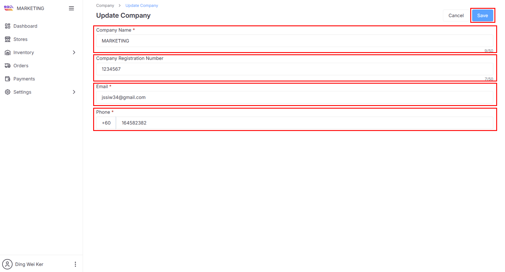

:::warning Validation Required
You must provide valid email and phone number formats. Invalid entries will trigger a warning message.
:::

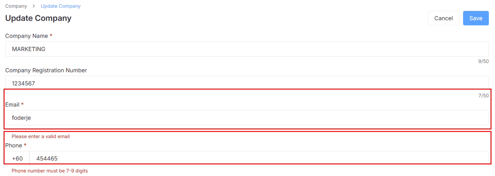

**Canceling Changes**

If you click **Cancel** after making edits, you'll see a confirmation dialog. Click **Continue** to discard your changes.

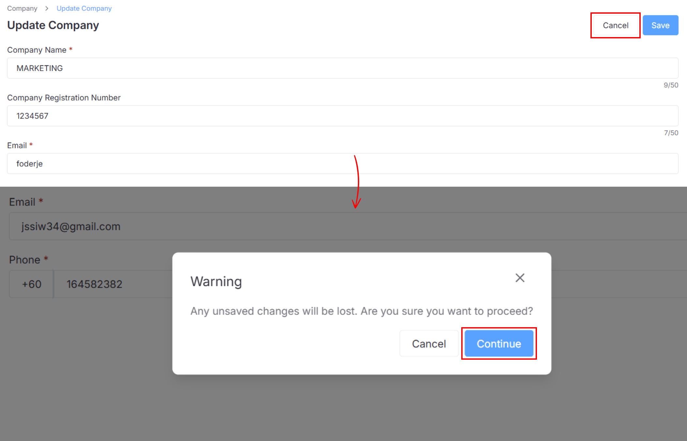

## Users Settings

### Overview

Manage your team members, including viewing, editing, inviting, and removing users.

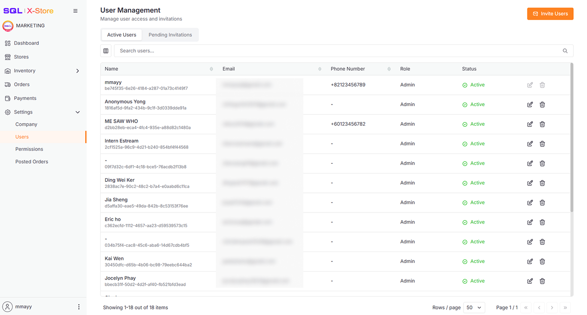

### Active Users Table

The users table displays all team members with their name, ID (with copy function), email, phone number, assigned role, status, and removal action. Use the search bar to filter users by name, ID, email, or phone number. Your account always appears in the first row.

| Column         | Description                 |
| -------------- | --------------------------- |
| User Name & ID | Full name with copyable ID  |
| Email          | Contact email address       |
| Phone Number   | Contact phone number        |
| Role           | Assigned role in the system |
| Status         | Active/Inactive status      |
| Actions        | Remove user button          |

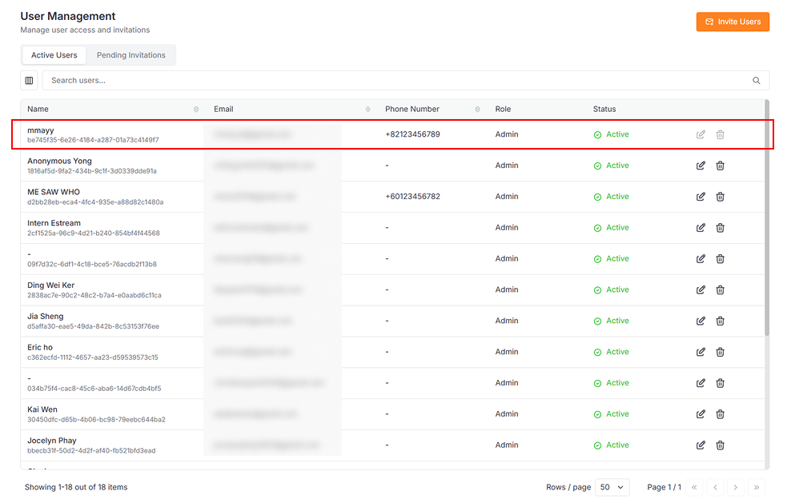

### Editing User Details

You can modify a user's role and status directly in the table.

1. Update the desired fields
2. Click the **Save** button
3. Confirm your changes in the dialog
4. Click **Continue** to apply (or **Cancel** to discard any unsaved modifications)

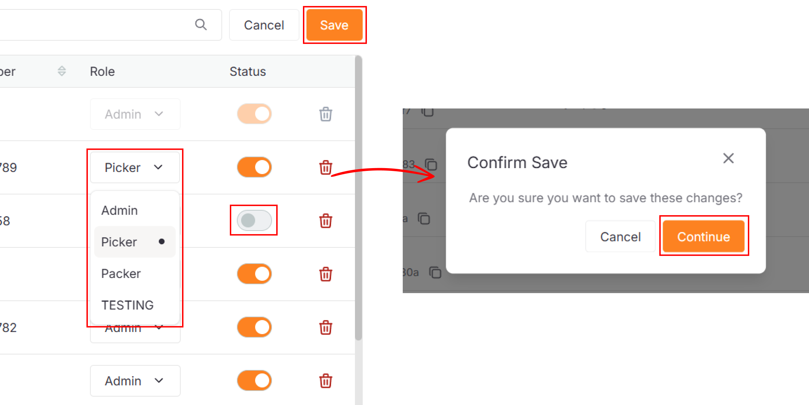

### Removing Users

1. Click the **Delete** icon in the user's row
2. Type `delete user` in the confirmation dialog
3. Click **Continue** to remove the user

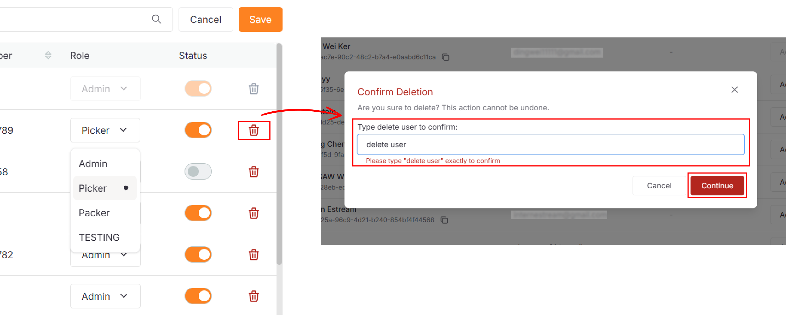

### Inviting New Users

#### Step 1: Enter User Details

1. Click the **Invite Users** button
2. In the dialog, enter either:
   - Email address (press Enter after each email)
   - User ID
3. Click **Batch Invite** to add users to the invitation list

:::info Finding User ID
User IDs appear in the users table. Ask the person you want to invite to copy their ID and send it to you.
:::

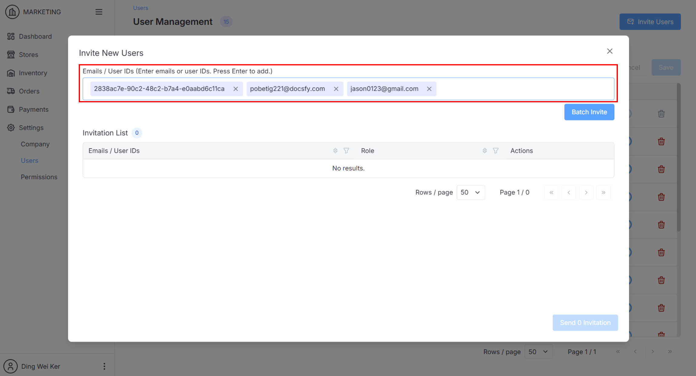

#### Step 2: Assign Roles and Send

1. Select a role from the **Role** dropdown for each user
2. Click **Send Invitation** to send all invitations
3. Use **Clear All** to remove all pending invitations from the list

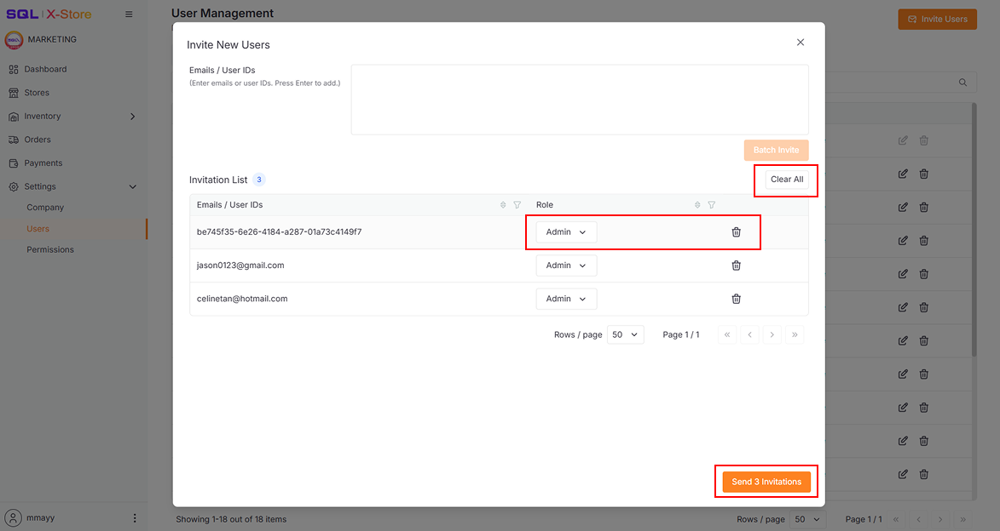

#### Step 3: Review Invitation Status

After sending, you'll see a status summary showing:

| Status     | Meaning                                       |
| ---------- | --------------------------------------------- |
| ✅ Success | Invitation sent successfully                  |
| ℹ️ Exist   | User already has an invitation or is a member |
| ❌ Failed  | Invitation could not be sent                  |

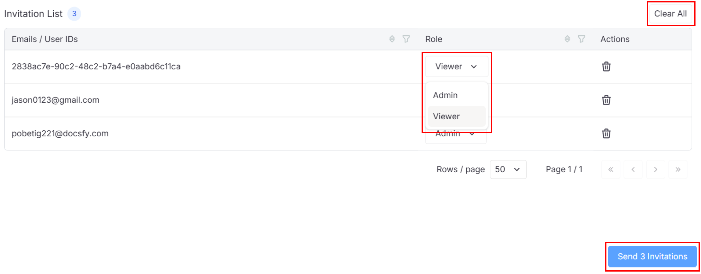

### Managing Pending Invitations

Click **Pending Invitations** to switch to the pending list view.

- Shows invitations not yet accepted
- Includes a **Revoke** button for each invitation
- Invitations expire after 24 hours
- Expired invitations must be resent

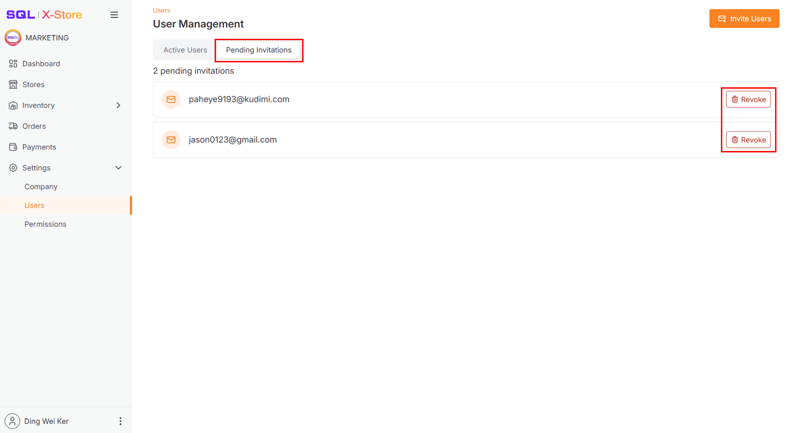

### Accepting Invitations

:::tip Invitation with User ID
Users invited by User ID join the company immediately without needing to accept an invitation.
:::

Recipients receive an email with an invitation link.

- **Existing users** are redirected directly to the Company List page
- **New users** are redirected to the acceptance page to create an account

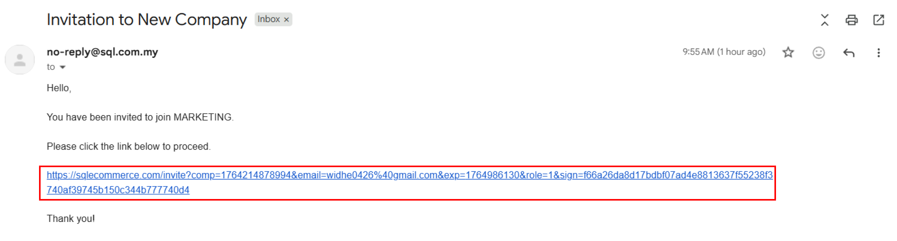

**Acceptance methods for new users:**

**Option 1: Sign in with Passkey**

Log in using a Passkey and redirect to the Company List page.

:::info Prerequisite
You must register a Passkey before using this method to accept the invitation.
:::

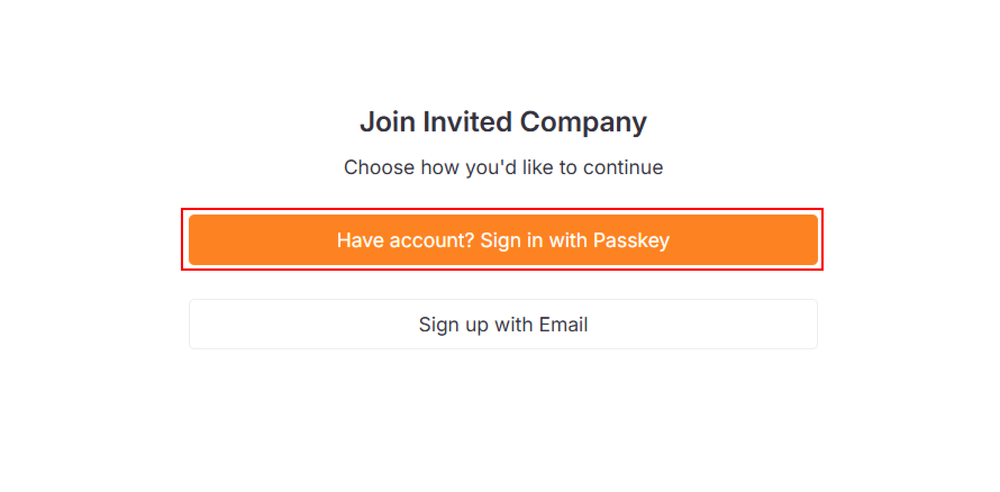

**Option 2: Sign up with Email**

Register a new account, log in automatically, and redirect to the Company List page.

[Learn more about company setup](/integration/xstore/setup#step-1-create-company)

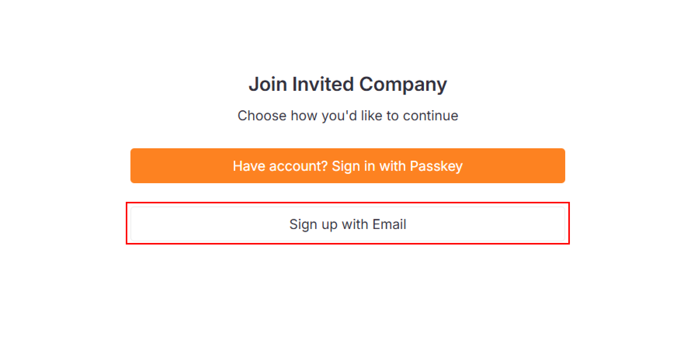

## Permissions Settings

### Overview

Define and manage roles with specific permissions to control what users can do in the system.

The roles table displays:

- Role name
- Last updated date
- Updated by (user name)
- Action buttons (Edit, Delete)

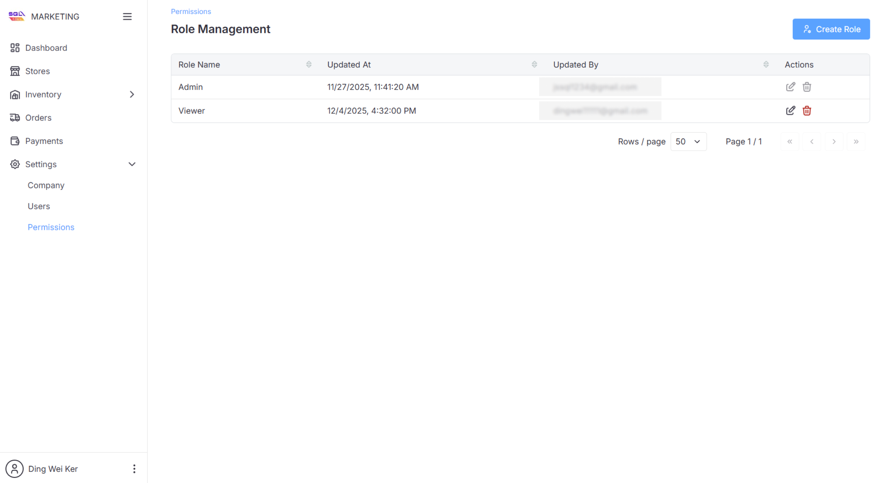

### Editing Roles

1. Click the **Edit** icon in the role's row
2. Update the role name or adjust permissions
3. Click **Update Role**
4. Confirm your changes by clicking **Continue**

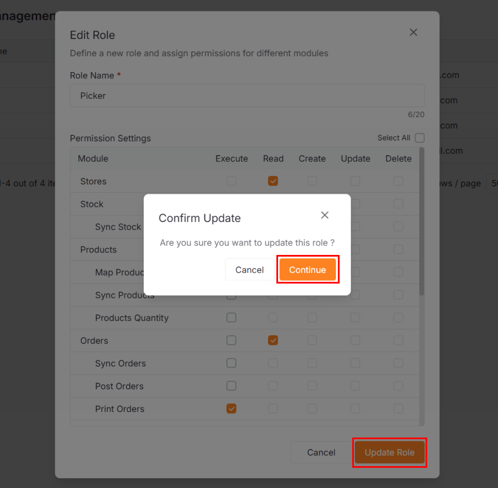

### Deleting Roles

1. Click the **Delete** icon
2. Confirm the deletion in the dialog

:::warning Deletion Requirements
Roles can only be deleted if they're not assigned to any users. If the role is in use, you'll see a warning message.
:::

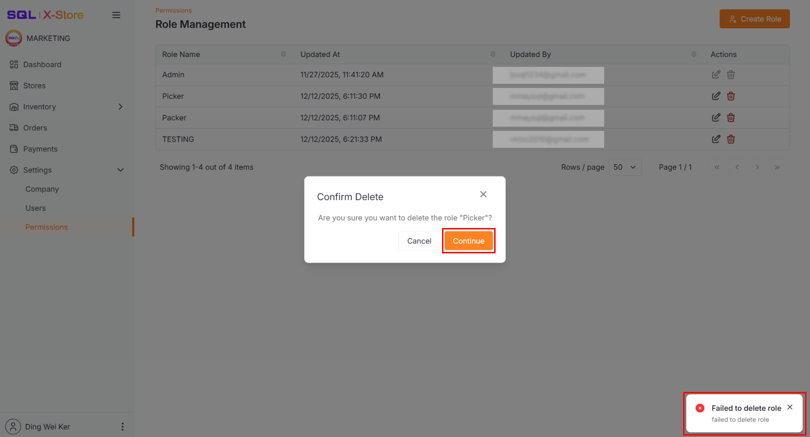

### Creating New Roles

1. Click **Create Role** at the top right of the table

   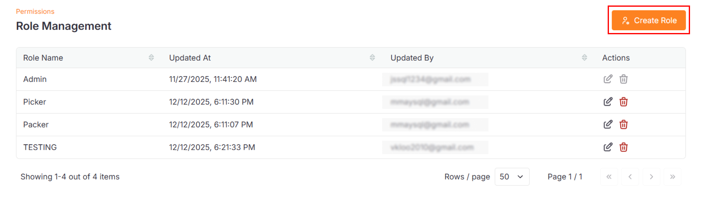

2. In the dialog:
   - Enter a role name
   - Select the permissions to assign
3. Click **Create Role**
4. Confirm by clicking **Continue**

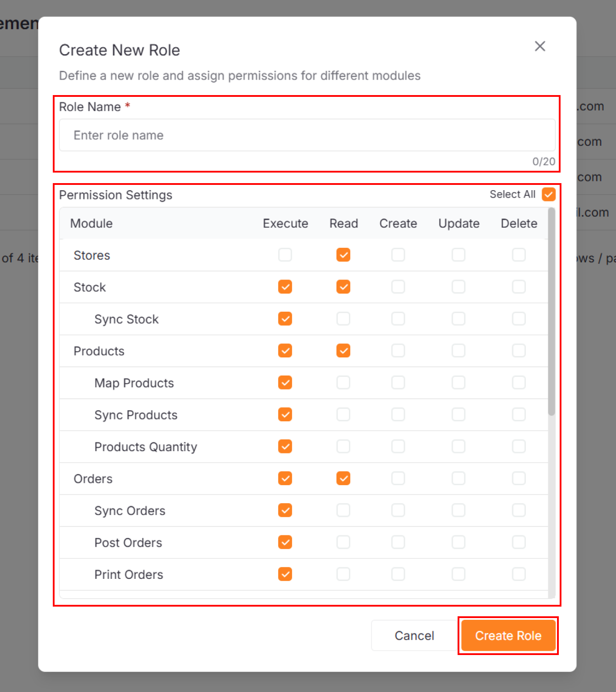
